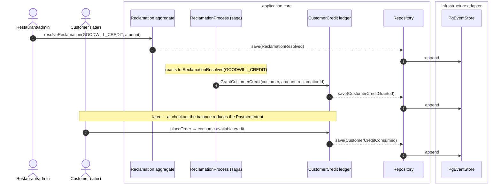

# ADR-20260726-163737 — ReclamationProcess saga + the customer credit-balance ledger

## Status

Accepted

<!-- Realizes the automations promoted to V0 by ADR-20260726-124204 (decision #2) — the refund-resolution
     binding (deferred from #153's proposal scope §10.1) and the GOODWILL_CREDIT ledger. #159 (replacement
     order) extends the same saga. Tracking issue #158. -->

## Context

The `Reclamation` aggregate records a resolution *decision* (`ReclamationResolved{resolution, refundAmount?}`)
but performs no automation — the money-move, the credit, and the replacement are downstream
(ADR-20260726-124204). This ADR builds the first two automations and the saga that carries all three:

- **A refund resolution** (`FULL_REFUND`/`PARTIAL_REFUND`) must actually refund — reusing the **existing**
  refund path (`RequestRefund`/`ApproveRefund` + `RefundProcess` + Stripe's inbound `PaymentRefunded`),
  never a second money mechanism (CLAUDE.md request/report split).
- **A goodwill-credit resolution** (`GOODWILL_CREDIT`) must grant the customer store credit they can spend
  later — a **new financial concept** the platform does not have.

## Decision

Introduce a **`ReclamationProcess` process manager** that reacts to `ReclamationResolved` and dispatches by
`resolution`, and a **`CustomerCredit` ledger** aggregate for goodwill credit.

- **Saga** (`processmanager.yaml#/ReclamationProcess`, mirroring `RefundProcess`): on `ReclamationResolved`
  → `FULL_REFUND`/`PARTIAL_REFUND` drive the existing refund command (the restaurant's resolution IS the
  approval); `GOODWILL_CREDIT` → `GrantCustomerCredit`; `REPLACEMENT` → deferred to #159 (the saga arm is
  reserved).
- **`CustomerCredit` aggregate** keyed by `customerId`: `CustomerCreditGranted{amount, reason=reclamationId}`
  and `CustomerCreditConsumed{amount, orderId}`; the fold tracks the **available balance** (granted −
  consumed, never negative). Read model `View_CustomerCredit` (balance per customer) backing a
  `customerCredit` query.
- **Apply at checkout**: at `placeOrder`, available credit reduces the `PaymentIntent` and emits
  `CustomerCreditConsumed`. This touches `PlaceOrderProcess`/pricing and is the invasive part — built if it
  lands cleanly, else the grant + balance + query ship and the consume-at-checkout is a flagged follow-up
  (a credit you can see but not yet spend), never a half-correct money path.

### Sequence — goodwill credit (grant now, spend later)



### Mockup — credit at checkout (customer)

```
+-------------------------------------------+
|  Checkout - Chez Marco                     |
+-------------------------------------------+
|  Articles                        18.00 EUR |
|  Delivery                         2.50 EUR |
|  Captain service fee              1.20 EUR |
|  Store credit applied           -5.00 EUR  |   <- CustomerCreditConsumed (balance 5.00 -> 0.00)
|  -----------------------------------------  |
|  Total                           16.70 EUR |   <- PaymentIntent reduced by the credit
|                         [ Pay 16.70 EUR ]  |
+-------------------------------------------+
   Your store credit: 5.00 EUR  (from claim A1B2)   <- customerCredit query
```

## Alternatives considered

**Where the credit lives**
| Option | Pros | Cons |
|---|---|---|
| **New `CustomerCredit` aggregate → CHOSEN** | Clean financial audit trail (grant/consume events); balance is a fold; isolated from identity | One more aggregate + read model |
| Fields on the `Customer` aggregate | Fewer moving parts | Bloats identity with money; mixes a financial ledger into profile data; weaker audit |

**Who grants the credit**
| Option | Pros | Cons |
|---|---|---|
| **A saga on `ReclamationResolved` → CHOSEN** | Pure per-aggregate handlers stay pure; the cross-aggregate move lives where sagas belong (RefundProcess precedent) | A PM to define + generate |
| The reclamation handler grants directly | One less hop | A command handler emitting a cross-aggregate command breaks the pure-per-aggregate rule |

**Refund binding**
| Option | Pros | Cons |
|---|---|---|
| **Reuse the existing refund path via the saga → CHOSEN** | One money path, one audit trail, request/report split preserved; Stripe reports the fact | The saga must map "resolution" onto the existing refund command sequence |
| A dedicated claim-refund path | Fewer cross-aggregate hops | Duplicates the refund mechanism — the exact thing the proposal forbids |

**Apply credit at checkout**
| Option | Pros | Cons |
|---|---|---|
| **Reduce the PaymentIntent at `placeOrder`, emit CustomerCreditConsumed → CHOSEN (build-permitting)** | Seamless; the customer just pays less; one consume fact | Invasive to `PlaceOrderProcess`/pricing; must be exactly-once (no double-spend) |
| A separate "redeem credit" step before checkout | Simpler, isolated | Clunky UX; two steps; state to reconcile |

**Credit expiry**
| Option | Pros | Cons |
|---|---|---|
| **Expire after 1 year → CHOSEN default** | Bounds liability; standard for store credit | Needs a sweep/observability; a customer can lose unused credit |
| Never expires | Most customer-generous | Open-ended liability on the books |

## Consequences

### Positive
- Refund claims actually refund (reusing one path); goodwill claims grant real, spendable credit.
- The saga is the shared foundation #159 (replacement) extends.

### Negative / Follow-up
- The checkout-consume is the risky integration; if deferred, credit is grant-and-view-only until a
  follow-up (flagged honestly on the issue), and double-spend safety is the key correctness property to
  prove when it lands.
- Credit expiry (1-year sweep) is a follow-up (observability + a scheduled fold), not in the first cut.
- REPLACEMENT is a reserved saga arm until #159.
