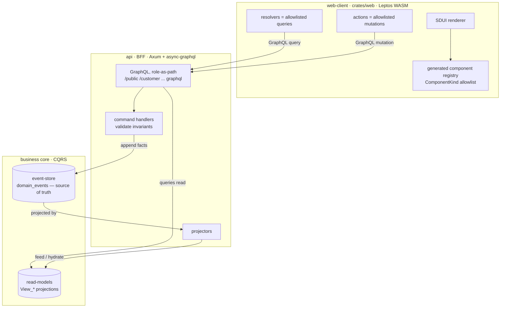
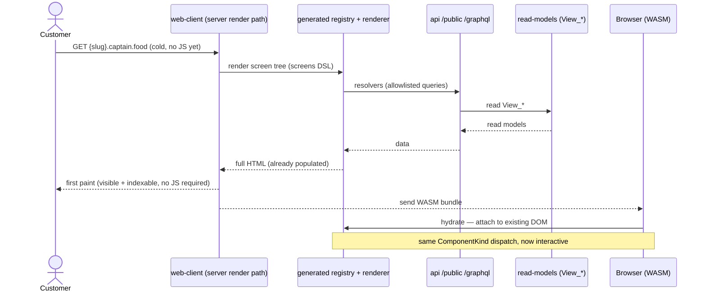
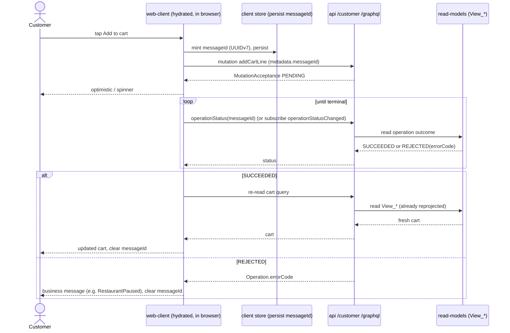
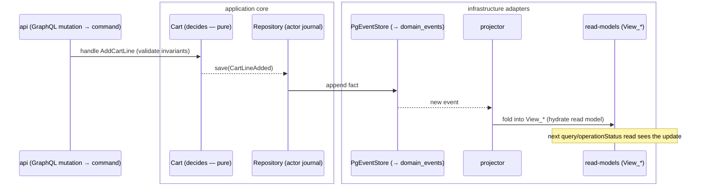

# Frontend architecture — SDUI renderer, GraphQL BFF, SSR & the two “hydrations”

> Companion to #21 (Leptos/WASM SDUI renderer) and its split 1 (#68). Explains how the customer web
> client is wired to the backend, where **SSR** fits (and where it does **not**), and disambiguates the
> word **“hydrate”**, which means two completely different things in this stack.
>
> Sources of truth: ADR-0033 (SDUI), ADR-0034 (full-stack Rust), ADR-0035 (clean-architecture crates),
> ADR-0006 (role-as-path GraphQL), ADR-20260720-015500 (acceptance-first mutations),
> `specs/architecture/c4-l2.yaml`, `specs/api.yaml`, `specs/screens/customer_screens.yaml`.

## TL;DR

- There is **one** GraphQL surface: the **BFF** (`api` container — Axum + async-graphql), served
  **per role** at `/{role}/graphql`. The frontend talks **only** to it.
- “A GraphQL for the frontend, hydrated by the business behind” = **the BFF is the frontend façade, and
  it is fed by the business core via CQRS read models** (`View_*` projected from the domain event log).
  The “business behind” is **not a second GraphQL** — it’s the event-sourced write side + projections.
- **SSR is for the _initial page load_, not for mutation freshness.** It renders the first HTML on the
  server (fast first paint, SEO for public `{slug}.captain.food` pages, works before/without WASM).
- **Freshness after a mutation is a client-side concern**, handled by the **acceptance-first two-step
  model** (#17) — mutation → acceptance → poll/subscribe → re-read — while the app is already running in
  the browser. SSR plays no part in it.

---

## 1. The layering (one GraphQL façade, CQRS behind it)

**Read this as:** the frontend’s SDUI `resolvers`/`actions` are a spec-declared **allowlist**
(`customer_screens.yaml`) bound by `$ref` to real `api.yaml` queries/mutations — the codegen **proves the
API answers the UI**. The BFF answers queries from `View_*` read models (**never** raw `domain_events`),
and turns mutations into commands that append events. A projector folds those events back into the
`View_*` models. That last arrow — **events → projector → `View_*`** — is the sense in which the
frontend-facing GraphQL is “**hydrated by the business behind**”.

---

## 2. “Hydrate” means two different things — keep them apart

| Term | Layer | What it means here |
|---|---|---|
| **Read-model hydration** | backend / CQRS | The `View_*` read models the BFF serves are **projected (“hydrated”) from the domain event log**. This is the data-freshness pipeline behind the GraphQL façade. |
| **Leptos hydration** | frontend / SSR | The WASM client **attaches to server-rendered HTML** and takes over interactivity **without re-rendering** it. Pure client-side runtime concern. |

They are unrelated. Section 3 is Leptos hydration, section 5 is read-model hydration.

---

## 3. Initial page load — **where SSR is needed**

SSR runs the read `resolvers` **on the server** during the first request, returns fully-populated HTML,
then ships the WASM bundle that **hydrates** it.

**Why we need SSR (from the NFRs, `PRODUCT_SPEC_WEB_CLIENT.md` §4):**

1. **First paint / mobile Lighthouse over 90** — the user sees a real menu, not a spinner waiting on a
   WASM download.
2. **SEO & link previews** — public discovery and per-restaurant pages are multi-tenant
   (`{slug}.captain.food`); crawlers and share-cards need real HTML.
3. **Resilience** — the page is meaningful before (or without) the WASM app booting.

SSR is a **first-load boundary** concern. After hydration the app is a normal reactive client.

---

## 4. After hydration — reads and **mutations (the freshness question)**

> **Your question: is SSR how the UI stays up to date after a mutation? — No.** Once hydrated, the app
> runs in the browser and keeps itself fresh by **re-reading the BFF**, using the **acceptance-first
> two-step model** (#17, ADR-20260720-015500). No server re-render, no SSR.

Why two-step at all: business **rejections are no longer GraphQL errors** — a mutation returns a
`MutationAcceptance` (status `PENDING`), and the **result is a read**. So the client mints a `messageId`
(UUIDv7, in `metadata`), fires the mutation, then polls/subscribes for the outcome and re-reads the
affected view.

Same shape for **checkout** (`placeOrder` acceptance → `paymentStatus(orderId)` → mount Stripe element
with the served `clientSecret`) and **identity** (`verifyPhone` acceptance → poll to SUCCEEDED → read
`me`). Persisting `messageId` until a terminal status makes retries on flaky mobile networks
**duplicate-proof** — the V0 Tours reality.

This is **split 2 of #21 (== #17)**; the current split (#68) only stands up the renderer + registry.

---

## 5. How the read models stay current (the “business behind”)

The freshness the client re-reads in §4 is produced here — the CQRS write path. Drawn faithfully to the
hexagon (ADR-20260719-031136): the **actor decides** the facts (pure), they are **saved through the
`Repository`**, and **one adapter** (`PgEventStore`) appends them to `domain_events`; a projector folds
them into `View_*`.

In V0 the `View_*` are **SQL views over `domain_events`** (projection-on-read); a hot one can later become
a materialized table fed by a projector with **no change to the query API** (ADR-0035). Either way the
frontend contract is identical.

---

## 6. Where split 1 (#68) fits

This PR builds the **left box** of §1’s diagram, minus the live data edges:

- **generated component registry** — `ComponentKind` (the allowlist of component `type` keys from
  `customer_screens.yaml#/component_registry`) emitted by the codegen into
  `crates/web/src/generated/registry.rs`. The renderer **dispatches on this enum**, so a screen can never
  name a component outside the spec.
- **renderer skeleton** — renders **one static screen** through that registry: `render_home_html` produces
  it server-side (`ssr`), and the `hydrate()` wasm entry attaches to the `data-hydrate` root.

Deferred to later splits: live `resolvers`/`actions` + session/cookie layer (#12) + the two-step mutation
layer (#17) → split 2; checkout (Stripe) + order tracking subscriptions → split 3.

---

## 7. Prior art — a proven technique, and where the markup lives

SDUI is not novel; it is a proven pattern at scale. Publicly documented adopters include **Meta**
(Instagram), **Airbnb** (their server-driven “Ghost”/GP systems), **Netflix**, **Lyft**, **Reddit** and
**Tinder** — all use it to ship UI changes and experiments **without app-store releases** and to drive one
screen definition across web + iOS + Android. It is common in mobility/travel marketplaces for the same
reason (one product surface, many native + web clients).

**How Captain.Food differs — _spec-driven_ SDUI.** Classic SDUI ships UI as **runtime JSON**: the client
trusts whatever screen the server sends, so a screen can reference a component the client lacks or data the
API doesn’t serve — caught only at runtime. Ours is stricter:

- screens live in a **build-time DSL** (`customer_screens.yaml`), not ad-hoc server JSON,
- the component allowlist + every resolver/action binding are **validator-proven against the GraphQL API**
  (“the API answers the UI”) before anything ships,
- the client component **registry is generated** from that spec (`ComponentKind`),

so a screen can only ever name components the client has and data the API serves. We keep SDUI’s payoff
(screens as data, one spec across platforms) while removing its main failure mode.

**Where the HTML/markup lives.** There are **no HTML template files** and **no string-templating engine**
(no Tera/Handlebars). Markup is written in **Rust with Leptos `view!`** and compiled — WASM on the client,
SSR on the server. Three distinct layers:

| Layer | Where it lives | Generated or hand-written |
|---|---|---|
| Which components exist (allowlist) | `component_registry` → `crates/web/src/generated/registry.rs` | **generated** from the spec |
| Each component’s markup (`restaurant_card`, `cta_banner`, …) | a Leptos `view!` component per `ComponentKind` in `crates/web` | **hand-written Rust**, compiled |
| Screen composition (order, props, text) | `customer_screens.yaml` + `design_tokens` | **data** (spec-driven; later runtime-editable via Supabase `screen_specs`) |

The generated registry **dispatches** a spec `type` to its Rust component — the component *is* the markup.
Design tokens (colors, spacing, radius) come from the spec and feed CSS. This is exactly why the markup is
type-checked Rust rather than free-form HTML: the compiler + the validator together guarantee every screen
the spec can express is one the client can actually render and the API can actually feed.

---

## Glossary

- **SDUI** — Server-Driven UI: screens are data (`customer_screens.yaml`), rendered by a generic
  registry-driven renderer (ADR-0033).
- **BFF** — Backend-for-Frontend: the single `api` GraphQL, filtered per role by path (ADR-0006).
- **`View_*`** — event-fed read models; queries read here, never `domain_events`.
- **Acceptance-first** — mutations return `PENDING` acceptance; results are reads (ADR-20260720-015500).
- **SSR / hydration** — server renders initial HTML; the WASM client attaches to it (§3).
