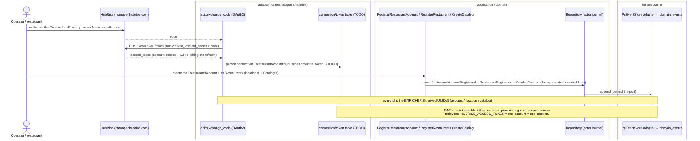
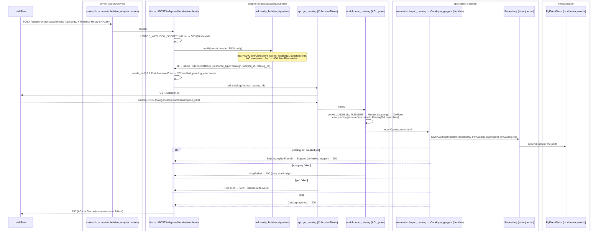
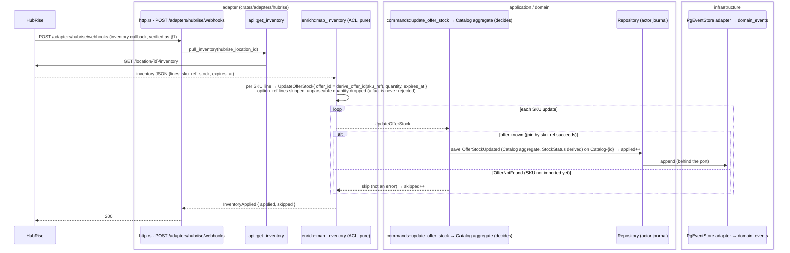

# 🔌 HubRise — catalog & inventory process (end-to-end, by architecture layer)

> Hand-maintained process view. Data **mapping** (fields, refinements) is the source-of-truth spec in
> [specs/integrations/hubrise.md](../../specs/integrations/hubrise.md); this doc is the **runtime process**
> (who calls whom, across which crate). Behaviour source = `crates/adapters/hubrise/*`
> (`http.rs`, `acl.rs`, `enrich.rs`, `api.rs`) + the `import_catalog` / `update_offer_stock` handlers in
> `crates/application`. Complements ADR-20260718-145856 (inbound webhook ACL), ADR-20260718-213352
> (partner-adapter crates + OAuth2 pull), ADR-0041 (event envelope).

HubRise is a **stateless-callback** integration: a webhook only says *"catalog/inventory X changed"* — it
carries no content. So the flow is always **callback → verify → PULL the resource → map (ACL) → domain
write**. Two directions, per CLAUDE.md's request/report split:

- **Catalog** is an **orchestrated import we can reject** (ACL validation, `CatalogNotFound`, `MissingRef`)
  → it goes through the **`ImportCatalog` command** → `CatalogImported`.
- **Inventory** is a **reported fact** (stock already changed on the POS) → routed through the
  `update_offer_stock` handler **only** to reuse its `Catalog-<id>` stream/version + `StockStatus`
  derivation; its lone `OfferNotFound` rejection is the "SKU not imported yet" case, which we **skip** — so
  **no inbound fact is ever rejected**.

## The architecture layers (legend for every diagram below)

| Box | Crate | Role in the HubRise flow |
|---|---|---|
| **HubRise** | — | the external POS/aggregator (pushes callbacks, serves the pull API) |
| **server** | `crates/server` | Axum BFF: composition root (`lib.rs`), mounts `POST /adapters/hubrise/webhooks`, builds the `Enricher` |
| **adapter** | `crates/adapters/hubrise` | the HubRise vertical slice: `http.rs` (endpoint) · `acl.rs` (verify + callback shape) · `api.rs` (OAuth2 outbound pull) · `enrich.rs` (map + drive commands) |
| **application** | `crates/application` | `commands::{import_catalog, update_offer_stock}` handlers |
| **domain** | `crates/domain` | Catalog aggregate: validates refs, folds, emits `CatalogImported` / `OfferStockUpdated` |
| **infrastructure** | `crates/infrastructure` | `PgEventStore` |
| **domain_events** | Postgres | append-only log (`Catalog-<id>` streams) |

Dependency rule (ADR-0035): the adapter depends inward on `application`/`domain` (+ `infrastructure` only
in its standalone `main.rs`); it is **not** part of `infrastructure`. The ACL is framework-free and
unit-tested without axum.

---

## 0. Precondition — the Connect flow (⚠️ the open gap, STATUS 2a)

### Entity alignment — HubRise ↔ Captain.Food (1:1 by design)

Captain.Food's aggregates were deliberately shaped to HubRise's hierarchy, so the mapping is direct
(`specs/entities.yaml`: *"a `RestaurantAccount` groups one or more `Restaurant` locations … which links
to its account via `accountId`"*):

| HubRise | Captain.Food | Notes |
|---|---|---|
| **Account** (carries `currency`) | **`RestaurantAccount`** | the holding / brand — groups the locations |
| **Location** (a point of sale) | **`Restaurant`** | one physical location; `Restaurant.accountId → RestaurantAccount`, and `Restaurant.ref` = the HubRise location id |
| **Catalog** | **`Catalog`** | the menu, imported per catalog |

So a HubRise **Account with N Locations** is a Captain **`RestaurantAccount` with N `Restaurant`s** — and
that is exactly why the access token is **not** one global secret.

### The token is scoped to a HubRise **Account** → it lives on the `RestaurantAccount`

A HubRise OAuth **connection** is authorized against an **Account** and returns a **non-expiring** access
token covering that account (its locations + catalogs). So **one token per `RestaurantAccount`** (= per
HubRise Account) serves **all** of its `Restaurant` locations. Today the code holds a **single** token in
`HUBRISE_ACCESS_TOKEN`, so it can serve **one** account only. Multiple connected accounts need a
**connection/token table keyed by `RestaurantAccount`** (holding the HubRise `account_id` + token); the
enricher then resolves a callback's `account_id` → that `RestaurantAccount` → its token before pulling.

> **The gap (STATUS 2a):** enrichment can only land once the `RestaurantAccount`, its `Restaurant`(s) and
> `Catalog`(s) **exist with the ACL's derived ids** *and* the **account's token is stored**. Establishing
> both is the **connect flow**, which is **not built yet** — until then `ImportCatalog` skips
> `CatalogNotFound`. (When building it, confirm the exact HubRise OAuth scope — account-wide vs
> per-location — against the HubRise Accounts API; the model here assumes the account-scoped connection.)

**Why the derived ids matter:** every domain id is a **UUIDv5 of the HubRise identifier** under a fixed
namespace (`enrich.rs::derive`). The connect flow must create the `RestaurantAccount`/`Restaurant`/`Catalog`
with *those same* ids, so a later inventory update targets the exact `OfferId` the import assigned. The
reconciliation table:

| Domain id | Seed (`kind:value`) | Why that seed |
|---|---|---|
| `RestaurantAccountId` | `account:<hubrise account id>` | the connect flow creates the account that holds the token *(enricher: to add)* |
| `CatalogId` | `catalog:<hubrise catalog id>` | the connect flow must `CreateCatalog` with this id |
| `RestaurantId` | `location:<hubrise location id>` | the location **is** the restaurant |
| category / product / option-list / option | `<kind>:<hubrise id>` | the tree re-joins by `ref` after translation |
| **`OfferId`** | `sku:<SKU ref, else SKU id>` | **inventory joins by `sku_ref`** — the SKU's *ref*, not its id |

---

## 1. Catalog callback — import (orchestrated, rejectable)

A verified `catalog` callback triggers an **outbound pull** of the full catalog, which the ACL maps to an
`ImportCatalog` command. The Catalog aggregate validates and emits `CatalogImported`.

**Layer notes**
- **Two auth schemes, opposite directions:** inbound uses HubRise's **HMAC** (`x-hubrise-hmac-sha256`, hex,
  raw body, **no** timestamp — contrast Stripe's `t=`+replay window); outbound uses **our** token
  (`X-Access-Token`) on the pull. Both fail closed when their secret/token is unset.
- **ACL discipline:** `enrich::map_catalog` is the **only** place HubRise's `"9.80 EUR"` string, decimal
  tax-rate strings, and `data` envelope exist. Ids never leak — they become UUIDv5 (`§0`).
- **Rejectable by design:** `import_catalog` is a real command; `CatalogNotFound` (connect flow hasn't run)
  and `MissingRef` are **definitive skips** (logged, ACKed 200 — retrying the same payload won't help).

---

## 2. Inventory callback — stock update (reported fact, never rejected)

Same verify + pull shape, but the pulled inventory maps to **one `UpdateOfferStock` per SKU line**, routed
through the handler purely to reuse the `Catalog-<id>` stream + `StockStatus` derivation.

**Layer notes**
- **The join is the whole point:** `derive_offer_id(sku_ref)` in §2 equals the `OfferId` §1 assigned
  (both seed on the SKU **ref**), so an inventory update lands on the exact imported offer — idempotent
  across re-syncs.
- **No fact is rejected:** `OfferNotFound` = "we don't know this SKU yet" ⇒ counted as `skipped`, never a
  domain error. Only an unreachable event store surfaces as `Err` → **5xx** (HubRise redelivers).
- `low_stock_threshold` is `None` from HubRise (it carries no threshold), so the handler derives
  `IN_STOCK`/`OUT_OF_STOCK` from quantity alone (`LOW_STOCK` needs the manual threshold — see
  [specs/integrations/hubrise.md](../../specs/integrations/hubrise.md#3-refinements-vs-hubrise)).

---

## 3. Envelope, idempotency & ingress-only fallback

- **Envelope (ADR-0041):** facts are stamped with `user_id = hubrise_system_user_id()` (UUIDv5),
  `user_type = EXTERNAL`, `correlation_id = UUIDv5("callback:<id>")` — same discipline as the Stripe ACL,
  so a catalog/inventory change is traceable end-to-end.
- **Idempotency:** the deterministic UUIDv5 ids make a re-sync map to the *same* command shape; combined
  with the Catalog aggregate's fold + `UNIQUE(stream, version)`, a redelivered callback converges (a
  re-import replaces catalog content; a repeated stock line re-derives the same `StockStatus`).
- **Ingress-only fallback:** when no `Enricher` is wired (`HUBRISE_ACCESS_TOKEN` unset) or the callback
  needs no pull, a *verified* callback is ACKed **202 `verified_pending_enrichment`** — the signature is
  proven but nothing is written. This is the state before the connect flow (`§0`) provisions a token.

---

## 4. Configuration & operational contract

| Env | Used by | Effect when unset |
|---|---|---|
| `HUBRISE_WEBHOOK_SECRET` | `http.rs` (inbound HMAC) | `POST /adapters/hubrise/webhooks` → **503** (fail closed) |
| `HUBRISE_ACCESS_TOKEN` | `api.rs` (outbound pull) | no `Enricher`; verified callbacks → **202** ingress-only (no enrichment) |
| `HUBRISE_API_BASE_URL` | `api.rs` | defaults to `https://api.hubrise.com/v1` |

- **Endpoint:** `POST /adapters/hubrise/webhooks` — mounted by `crates/server/src/lib.rs`
  (`.merge(hubrise_adapter::routes(hubrise_enricher))`), **not** the GraphQL surface. The adapter ships a
  standalone `main.rs`, so HubRise can be **deployed as its own web service** (ADR-20260718-213352).
- **Import path (events):** full sync → `CatalogImported` (replace semantics); inventory sync →
  `OfferStockUpdated` — see [specs/integrations/hubrise.md §5](../../specs/integrations/hubrise.md#5-import-path-events).

## Open items (HubRise)
| Item | Where | Blocked on |
|---|---|---|
| **Connect flow**: derived-id `CreateCatalog` + register `Restaurant` | §0 | plan mode (STATUS 2a) |
| Persist **per-location tokens** (multi-location) | §0 | a connection/token table → plan mode |
| Confirm HubRise API resource **paths** (`/catalog/{id}`, `/location/{id}/inventory`) | §1–§2, `api.rs` | check against the live API reference |
| Deals / advanced price_overrides / restrictions | mapping | out of V0 scope (spec §4) |
