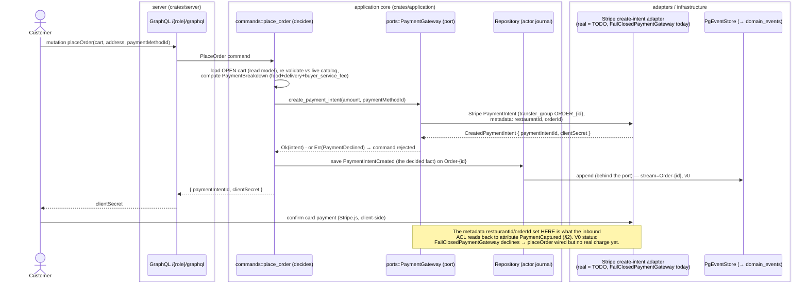
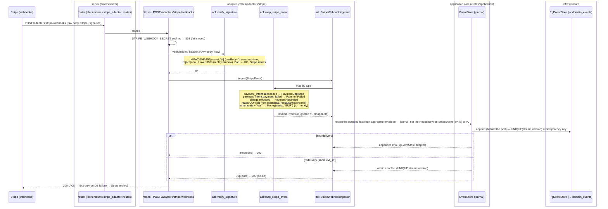
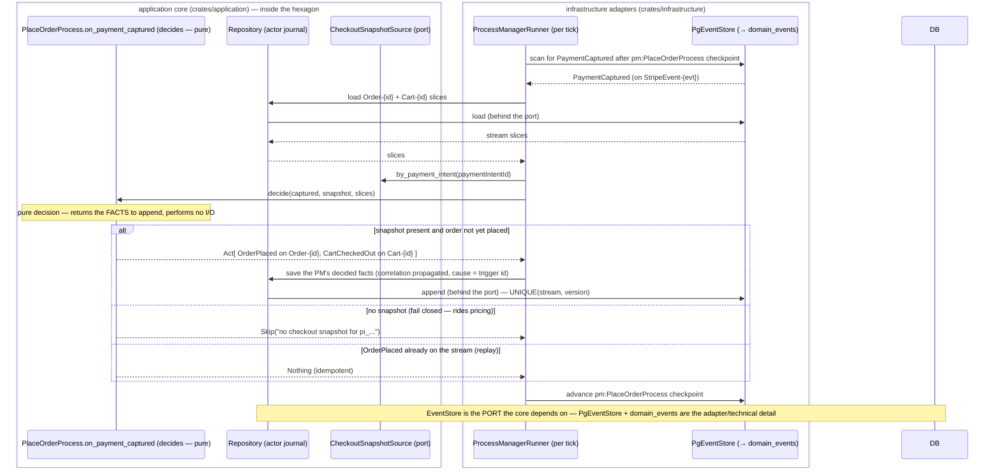
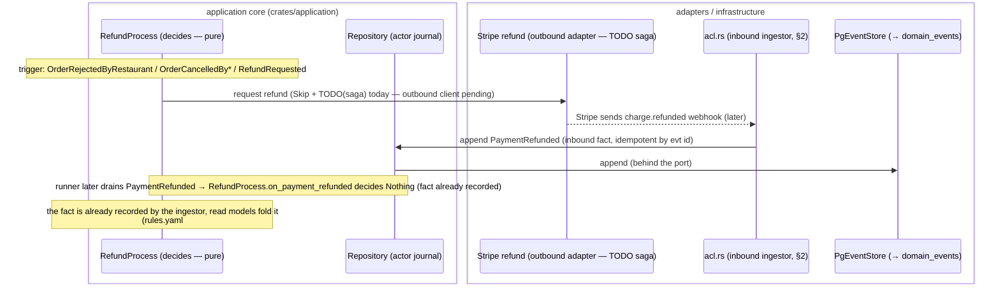

# 💳 Stripe — payment process (end-to-end, by architecture layer)

> Hand-maintained process view. Source of truth for behaviour = the code cited inline
> (`crates/adapters/stripe/*`, `crates/application/src/{commands.rs,ports.rs,process_managers/*}`,
> `crates/infrastructure/src/integrations/payments.rs`, `crates/server/src/lib.rs`) + the events in
> `specs/events.yaml`. Complements [docs/sagas.md](../sagas.md) (process-manager runtime) and
> ADR-20260718-145856 (inbound webhook ACL), ADR-20260718-213352 (partner-adapter crates),
> ADR-0017 (3-way Connect split), ADR-0016 (service fee), ADR-0041 (event envelope).

Payments are **not one call**. Stripe participates in two opposite directions, and the domain only ever
sees the outcome as **events** — never Stripe's wire vocabulary:

- **Outbound (a request we can be told _no_ about):** at checkout we compute the split server-side and
  ask Stripe to **create a PaymentIntent**. This is driven by the `PlaceOrder` **command**, through the
  `PaymentGateway` **port** — so a synchronous decline is a domain rejection (`PaymentDeclined`).
- **Inbound (a reported fact that already happened):** Stripe **PUSHes** signed webhooks
  (`payment_intent.succeeded` / `.payment_failed` / `charge.refunded`). There is nothing to validate and
  nothing to reject, so **no command** is involved — the **Anti-Corruption Layer** records them as the
  already-modelled inbound events `PaymentCaptured` / `PaymentFailed` / `PaymentRefunded`
  (CLAUDE.md "Commands vs inbound events").

## The architecture layers (legend for every diagram below)

| Box | Crate | Role in the payment flow |
|---|---|---|
| **Customer / Stripe** | — | the external actor / system |
| **server** | `crates/server` | Axum BFF: composition root (`lib.rs`), `/{role}/graphql`, mounts `POST /adapters/stripe/webhooks` |
| **adapter** | `crates/adapters/stripe` | the Stripe vertical slice: `http.rs` (endpoint) + `acl.rs` (verify + map + ingest) + outbound create-intent client |
| **application** | `crates/application` | `commands::place_order`, `ports::{PaymentGateway, CheckoutSnapshotSource}`, `process_managers::{place_order, refund}` (pure decisions) |
| **domain** | `crates/domain` | aggregates + events; pure `fold`/decisions, no I/O |
| **infrastructure** | `crates/infrastructure` | `PgEventStore`, the `ProcessManagerRunner`, read-model repos, the fail-closed payment stand-ins |
| **domain_events** | Postgres | the append-only log (`UNIQUE(stream_name, version)`) |

Dependency rule (ADR-0035, compile-enforced): `server → application, infrastructure`; `adapter →
application, domain` (+ `infrastructure` only in its standalone `main.rs`); `application → domain`;
`infrastructure → application, domain`. Nothing depends on `server`; `domain` depends on nothing.

---

## 1. Outbound — checkout creates the PaymentIntent (`PlaceOrder` command)

The customer submits checkout; we **price the cart server-side** (the 3-way split, ADR-0017/0016),
then ask Stripe for a PaymentIntent through the port. On success we record **`PaymentIntentCreated`** on
the `Order-<id>` stream and hand the `clientSecret` back so the browser (Stripe.js) can confirm the card.



**Layer notes**
- `crates/application/src/commands.rs::place_order` depends only on the `PaymentGateway` **trait**
  (`ports.rs`), never on Stripe — Ports & Adapters. The real create-intent client belongs to
  `crates/adapters/stripe`; until it lands the composition root injects
  `infrastructure::integrations::payments::FailClosedPaymentGateway`, whose `create_payment_intent`
  returns the canonical `errors.yaml#/PaymentDeclined` (a checkout is **declined**, never silently paid).
- `PaymentIntentCreated { paymentIntentId, restaurantId, customerId?, amount, checkout }`
  (`specs/events.yaml`) is the **only** payment fact born from a command; the rest are inbound (§2).

> ✅ **Checkout snapshot** (ADR-20260719-014434, see [docs/sagas.md](../sagas.md)):
> `PaymentIntentCreated` now carries a required `checkout` (`CheckoutSnapshot` — cart items, breakdown,
> contact, service type, address), frozen **here** by `place_order`, so §3 rebuilds `OrderPlaced` from the
> log alone — no external store. The metadata `restaurantId`/`orderId` on the PaymentIntent stays the
> Stripe-side linkage for §2. Priced `items`/`breakdown` + retiring the `CheckoutSnapshotSource` port ride
> on server-side pricing (nothing consumes the approximate breakdown meanwhile).

---

## 2. Inbound — Stripe webhook → domain fact (the ACL)

Stripe PUSHes a signed webhook. The **thin HTTP shell** (`http.rs`) reads the **raw** body + signature and
delegates everything to the **framework-free ACL** (`acl.rs`): verify → map → append, idempotently.



**Layer notes**
- **Auth is per-partner and security-critical** (ADR-20260718-145856): the MAC is verified over the **raw
  bytes** (a re-serialized JSON would never verify), constant-time (`hmac::Mac::verify_slice`), inside a
  **±300s** replay window (`SIGNATURE_TOLERANCE_SECS`). Secret unset ⇒ **503** (fail closed).
- **Stripe idioms stay out of the domain**: `acl::to_money` is the only place minor-units + lowercase ISO
  currency exist; `restaurantId`/`orderId` are OUR ids, read back from the PaymentIntent `metadata` that
  §1 set. A verified event whose metadata lacks a required id is **Unmappable** — logged + ACKed, never guessed.
- **Idempotency** is structural: each delivery appends to its own stream `StripeEvent-<evt id>` at
  `expected_version = 0`, so a redelivery loses the `UNIQUE(stream_name, version)` race and folds to
  `Duplicate`. Envelope (ADR-0041): `user_id = stripe_system_user_id()` (UUIDv5), `user_type = EXTERNAL`,
  `correlation_id = UUIDv5(evt id)`.
- **HTTP status contract**: definitive outcomes (Recorded / Duplicate / Ignored / Unmappable) → **200** so
  Stripe stops redelivering; only an infrastructure failure (event store unreachable) → **5xx** so it retries.

---

## 3. The saga reaction — `PaymentCaptured` materializes the order

The recorded fact is picked up by the **`ProcessManagerRunner`** (mirrors the projection worker,
[docs/sagas.md](../sagas.md)), which drives **`PlaceOrderProcess`** — a **pure** decision in
`crates/application`. It emits `OrderPlaced` on `Order-<id>` and closes the cart with `CartCheckedOut`.



**Layer notes**
- `on_payment_captured` is a **pure sync function** over pre-loaded stream slices — all I/O (load, append,
  checkpoint) lives in the `infrastructure` runner (the same `Compute`/I-O split as the projectors,
  ADR-0012 keeps business logic off the telemetry SDK).
- **Runtime still fail-closed (rides pricing)**: the checkout is now frozen on `PaymentIntentCreated`
  (ADR-20260719-014434), but until server-side pricing populates `items`/`breakdown` the saga keeps reading
  through the fail-closed `UnavailableCheckoutSnapshotSource` and returns **`Skip`** (logged at `/saga`,
  never guesses). Retiring the port (read `PaymentIntentCreated.checkout` from the log) lands with pricing.
- Idempotency is by construction: `OrderPlaced` already on `Order-<id>` ⇒ `Nothing`; a re-appended event
  would also hit `UNIQUE(stream, version)`.

---

## 4. Refund — requested by a command, reported by Stripe

A refund is the request/report split in one flow: an order reaching a refundable terminal state (or a
customer `RefundRequested`) makes **`RefundProcess`** ask Stripe for a refund (an **outbound** call, not a
domain command); the settled **`PaymentRefunded`** fact comes **back** through the same inbound ACL as §2.



**Layer notes**
- `RefundProcess` legs all declare `emits: []` (actors.yaml): the effect is an **external call**, and the
  fact returns inbound. Today each refund-triggering leg returns `Decision::Skip` with a precise
  `TODO(saga)` so the pending outbound call is observable, never silently dropped.
- `PaymentRefunded` requires both `orderId` and `restaurantId` (`specs/events.yaml`), read from the
  charge `metadata` — same ACL discipline as §2.

---

## 5. The 3-way Connect split (ADR-0017 / ADR-0016)

The amount asked of Stripe in §1 is computed **server-side before** the PaymentIntent, and settled after
capture via **Stripe Connect "Separate Charges & Transfers"** (`transfer_group = ORDER_{id}`):

```
PaymentIntent.amount = food + delivery + buyer_service_fee          (on the Captain platform account)
on payment_intent.succeeded (→ PaymentCaptured):
    Transfer → rider account       = delivery_total
    Transfer → restaurant account  = food − restaurant_service_contribution
    remainder on Captain account   = buyer_service_fee + restaurant_service_contribution (net of Stripe)
```

This split is carried in the domain as the **`PaymentBreakdown`** value object on `OrderPlaced`
(`articles / delivery / serviceFee / total / restaurantContribution / restaurantPayout / riderPayout /
captainNet`), with `breakdown.total == totalAmount`. Captain is merchant of record (PSD2-ok, no extra
PSP licence). Refunds require a transfer-reversal procedure (ADR-0017 follow-up).

---

## 6. Configuration & operational contract

| Env (`sync:false`) | Used by | Effect when unset |
|---|---|---|
| `STRIPE_WEBHOOK_SECRET` | `http.rs` §2 | `POST /adapters/stripe/webhooks` → **503** (fail closed) |
| *(create-intent secret key — real outbound adapter, TODO)* | §1 | `FailClosedPaymentGateway` → every checkout **declined** |

- **Endpoints:** `POST /adapters/stripe/webhooks` (inbound facts) — mounted by `crates/server/src/lib.rs`
  (`.merge(stripe_adapter::routes(stripe_ingestor))`), **not** the GraphQL surface. The adapter also ships
  a standalone `main.rs` binary, so Stripe can later be **deployed as its own web service** (ADR-20260718-213352).
- **Observability:** saga progress at `/saga`; every recorded fact carries the deterministic envelope
  (§2) for tracing a payment across `PaymentIntentCreated → PaymentCaptured → OrderPlaced`.

## Open items (Stripe)
| Item | Where | Blocked on |
|---|---|---|
| Real outbound create-intent (metadata + split) | §1, `PaymentGateway` impl | Stripe outbound adapter in `crates/adapters/stripe` |
| Retire `CheckoutSnapshotSource` (read `checkout` from the log; materialize `OrderPlaced`) | §3 | server-side pricing (priced items + breakdown) |
| Outbound refund request | §4 | Stripe outbound adapter |
| Transfer reversal on refund | §5 | documented Connect procedure (ADR-0017) |
