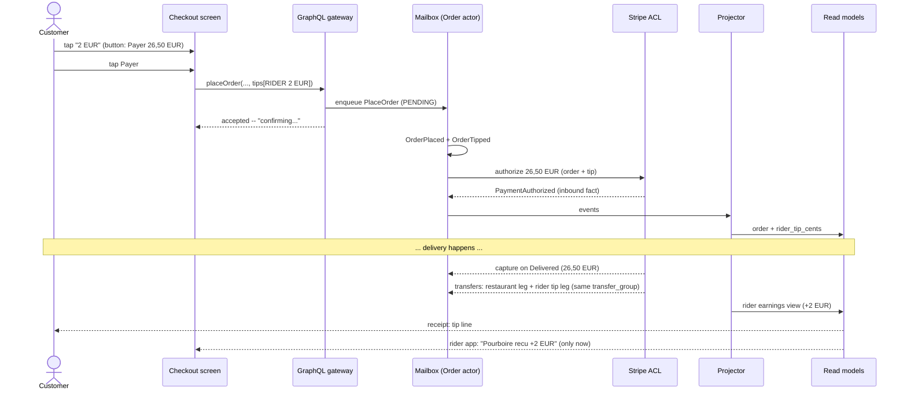
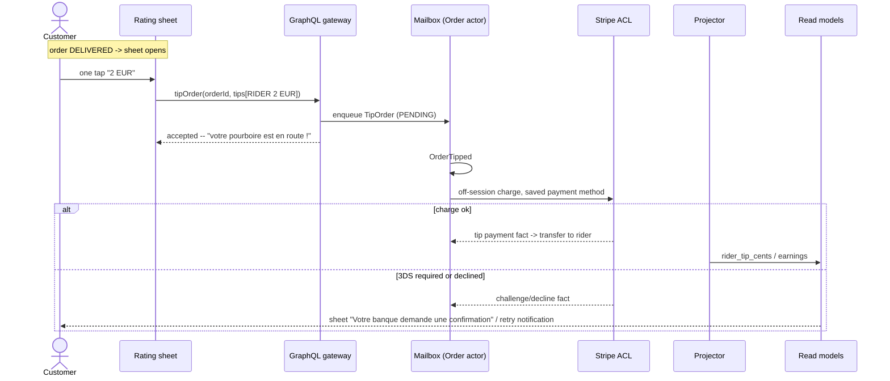

# Tips discussion — the option grid the customer asked for (PROP-165000 D5, widened)

**Date**: 2026-08-08 · **Status**: In discussion with the customer · **Prepared by**: the
business-specialist and ux-designer lenses, session
https://claude.ai/code/session_01AKgDqRbCcCxtUePWPRfxtp · **Decision thread**:
[#403 "Decision thread: money posture"](https://github.com/TheCaptainCompany/captain-food/issues/403)
· **Context**: the customer answered the money brief
([ADR-20260808-195315](../adr/ADR-20260808-195315-customer-brief-answers.md)) and widened the tips
question — *"There is different kind of tips: at checkout and at delivery, and for whom — the
rider, the restaurant or the platform."*

**Decided context this builds on**: Connect separate charges & transfers · authorize at checkout,
**capture on delivered/picked-up** · 0% commission · the standing gate: a tip control ships only
with a live transfer leg (a button that moves no money is a misleading-practice risk).

**What already exists in the DSL** (no redesign needed): `TipOrder`/`OrderTipped`/`Tip`,
`TipRecipient = RIDER|RESTAURANT|CAPTAIN`, `Tipper = CUSTOMER|RESTAURANT` (`specs/ordering/`), the
`tipOrder` mutation, a post-delivery tip control in the rating sheet
(`specs/screens/restaurant_frontoffice.yaml`), per-recipient tip sums in the order projection.
**What exists nowhere**: any money leg — `specs/payments/` has no transfers and riders have no
payout identity. That is the gating dependency for every cell below.

## The grid — timing × recipient

| | RIDER | RESTAURANT | PLATFORM/COOP |
|---|---|---|---|
| **At checkout** | **SHIP V0** — rides the original authorization, zero extra mechanics; checkout is where French tip volume actually lives | Defer — near-zero French demand; the restaurant already sets its own prices at 0% commission | Defer — coop support belongs on a **membership** surface (the SCIC's colleges), never at the pay button |
| **At/after delivery** | **Ship the already-specced rating-sheet tip** — but under capture-on-delivered it is structurally a **second, off-session payment** on the saved card (capture has already settled) | No case | Defer |
| **Restaurant → rider** | Keep in schema; back-office "thank the courier" one-tap is cheap (a cent-shift between the two transfers in the same `transfer_group`, no card charge) | — | — |

## Key findings (both lenses converged)

1. **The customer never picks a recipient.** A rider/restaurant/platform selector at a
   money-moment is three decisions where the journey needs zero; context fixes the recipient and
   the copy prints it: *"100 % pour votre livreur — Captain ne prend rien."* At 0% commission that
   line is both the compliant claim and the best conversion copy we own. The domain model stays
   three-way; only the V0 surface narrows — reversible with evidence.
2. **Checkout module placement**: after the order summary, before the payment element, default
   **"Aucun" visibly selected** (no pre-selected amount — dark-pattern-free, but no ambiguous
   empty state either); flat presets 1/2/3 € + "Autre" (percentages read imported at 15–25 €
   Tours baskets); the pay button updates live with the tip. Renders only for `DELIVERY`, and
   only on channels with a verified pass-through path.
3. **Money path**: tip rides the checkout PaymentIntent, captured with the order on DELIVERED,
   transferred 100% on the rider payout leg under the same `transfer_group`. Rejection/timeout
   releases the whole hold, tip included — no refund path, no orphan money, and tip-baiting is
   impossible by construction (no post-hoc reduce control).
4. **Fees**: the cooperative absorbs the marginal Stripe percentage on checkout tips (~2–3 cents
   on 1,50 €; on the order of ~50 €/year at pilot volume) so *"100 % du pourboire va au
   livreur"* is literally, auditably true. Honesty note for copy: 100% reaches the rider **as
   gross revenue** (a micro-entrepreneur's turnover) — "100% transferred" is claimable, "100% in
   the pocket" is not.
5. **Post-delivery tip** stays in the rating sheet (the honest gratitude moment, one sheet, one
   tap on a preset) but needs: saved-payment-method consent at checkout
   (`SetCustomerPaymentMethod` exists, unreached), an off-session charge leg, and a designed
   3DS/decline path (*"Votre banque demande une confirmation"* + one-tap retry) — a silently
   failing tip teaches customers their generosity evaporates. Economics honesty: the fixed
   per-charge fee is ~15–25% of a 1–2 € tip; if shipped, minimum 2 €, coop still absorbs.
   Reference point: at the incumbents, post-delivery tips are a goodwill valve at low single
   digits of orders — checkout is where the volume is.
6. **Rider-side visibility — cooperative position**: the tip is **never visible before or during
   the job**; it appears only after DELIVERED and only once the transfer confirmed.
   Tip-visible-before-accept (Uber Eats) converts tips into bids and distorts acceptance; equal
   service is the product claim and visibility timing is how the interface enforces it. Codify as
   a business rule (`TipNeverVisibleBeforeDelivered` in `specs/ordering/rules.yaml`) with a test.
   Honest cost, said out loud: Captain cannot use tips to sweeten hard-to-fill peak jobs — the
   cooperative answer to those is the fee structure.
7. **Partner channels**: `uber_direct` passes tips on Uber's rails (verify current API contract
   before shipping); local partners (avelo37, coopcycle) need a contractual 100% pass-through
   clause + per-delivery reporting — where pass-through cannot be verified, **do not render the
   control on that channel**.
8. **Unknown that must be measured**: French checkout tip attach rate and average (working guess
   5–15% / 1–2 €, not data; US figures do not transport). The tip funnel needs an
   `specs/observability.yaml` contract before any second surface is argued from "demand".

## The recommendation (for the customer to confirm)

Ship **both moments, one recipient, zero choices**: the checkout rider-tip module (mechanically
almost free under the decided capture posture) and the already-specced one-tap rating-sheet tip
(separate off-session charge). No restaurant or platform tip in any customer money-flow for V0;
back-office "thank the courier" stays; riders see tips only after delivery, post-transfer.
**Nothing ships until the transfer leg + rider payout identity exist** — the biggest missing
block in `specs/payments/`, owned by the ch. 1.1/1.2 realization.

## GAP-marked journeys (ux-designer derivation chain)

### Journey A — checkout tip (customer, DELIVERY)

| # | Step | Chain | Status |
|---|---|---|---|
| A1 | Tip module in checkout, "Aucun" default; pay button updates live | checkout screen | **GAP(screen)** — module + translations |
| A2 | Pay → accepted | `placeOrder` → `PlaceOrder` → `OrderPlaced` (+`OrderTipped`) | **GAP(command)** — `PlaceOrder` needs optional `tips[]` (emit `OrderTipped` at placement; never a racing second `tipOrder` call) |
| A3 | Hold for total + tip | Stripe auth via ACL | **GAP(event)** — `PaymentAuthorized` (the authorize/capture split) not yet in `specs/payments/events.yaml`; owned by the ch. 1.2 realization |
| A4 | Delivered → capture total + tip | capture PM leg | **GAP(process-manager)** — same ch. 1.2 slice |
| A5 | Tip transferred 100% to rider, same `transfer_group` | inbound Stripe transfer facts (📥 ACL) | **GAP(command/event/read-model)** — zero transfer modelling; riders have **no payout identity** — the gating block |
| A6 | Receipt shows tip line | `order` query, `rider_tip_cents` | DONE (projection exists) |

### Journey B — after-delivery tip

B1 rating sheet + tip chips: DONE · B2 `tipOrder` → `OrderTipped`: DONE ·
B3 off-session charge on saved method: **GAP(command/event + 3DS/decline screen state)** ·
B4 save-method consent at checkout wiring: **GAP(wiring)** ·
B5 decline → notify + one-tap retry: **GAP(comms + screen state)**.

### Journey C — restaurant thanks the courier

Story step `ThankRiderOrCaptain` → `tipOrder` exists; **GAP(screen)** — no tip affordance in
`restaurant_backoffice.yaml`; money leg = cent-shift within the `transfer_group` (rides A5).

### Journey D — rider sees the tip

D1 job offer/active job carry **no tip data**: **GAP(rule + test)** `TipNeverVisibleBeforeDelivered` ·
D2 post-transfer "+2 € pourboire" on the completed job + notification: **GAP(api + read-model +
screen in `rider.yaml` + comms)**.

Also **GAP(observability)**: no contract for the tip funnel (module shown → tapped → tip on
order; checkout vs post-delivery split; off-session decline rate).

### Flow — checkout tip (hexagonal-faithful)

### Flow — after-delivery tip

Every GAP above maps one-to-one onto a DSL change plan mode can propose once the customer
confirms the surface.
