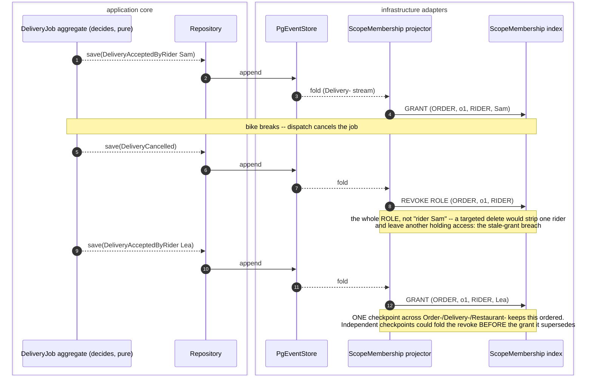
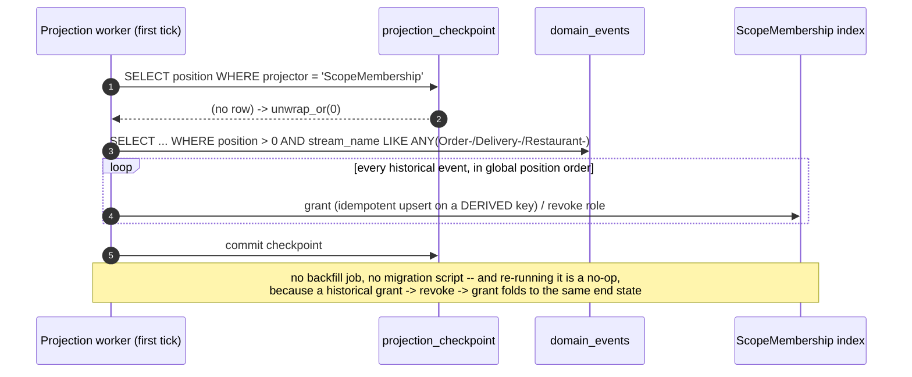

# PROP-20260725-185140 — Read-side per-instance authorization (`ReadScope` on the read ports + the identity bridges)

- **Status**: **Approved** — product-owner decisions taken in-session 2026-07-25 (enforce immediately, no shadow mode · rider revoked / others permanent · scope types ORDER + RESTAURANT); realization directed by [#429 "Production with test data: a test customer places a real order against a test restaurant, paid with Stripe test mode"](https://github.com/TheCaptainCompany/captain-food/issues/429) ("rebase-and-land"). Landed by [PR #430](https://github.com/TheCaptainCompany/captain-food/pull/430) (port of the parked [PR #152](https://github.com/TheCaptainCompany/captain-food/pull/152)) with the deviations recorded in [ADR-20260809-160000](../adr/ADR-20260809-160000-read-authorization-lands-ported-from-152.md): **no Rider bridge table** (ADR-20260809-050000 CARD-11 put the login-to-domain bridge in JWT claims — the `ReadScope` enum also gained `RestaurantAccount` and `System` beyond the sketch below), TEXT enum storage (ADR-20260728), delivery payloads carrying `orderId` (D-QW1) so only `DeliveryCancelled` needs the job→order lookup, and `ReadScope::System` hydration for the rider offer pool. §6.4 (claim staleness) stays open by explicit decision (ADR-20260808-171056).
- **Date**: 2026-07-25 (approved as realized 2026-08-09)
- **Tracking issue**: [#144 "Read-side per-instance authorization: ReadScope on the read ports + RESTAURANT/RIDER identity bridges"](https://github.com/TheCaptainCompany/captain-food/issues/144) (every proposal MUST have one, ADR-20260724-143000; always the full clickable link, never a bare number)
- **Blocks**: [#134 "Order conversations: generic file-attachment framework"](https://github.com/TheCaptainCompany/captain-food/issues/134)
- **Realized by**: [ADR-20260809-160000](../adr/ADR-20260809-160000-read-authorization-lands-ported-from-152.md) + [PR #430 "feat(#144): read-side per-instance authorization — ScopeMembership (port of #152)"](https://github.com/TheCaptainCompany/captain-food/pull/430)
- **Related**: [PROP-20260725-120055 §4.5](PROP-20260725-120055-generic-file-attachment-framework.md) (where this was discovered) · ADR-0047 (JWT via JWKS at the role-path boundary) · ADR-0006 (role-as-path ACL) · ADR-0035 (Clean-Architecture layering) · ADR-0041 (acting user is envelope, not payload) · ADR-20260719-031136 (write-side Repository) · [#112 "Client auth-token wiring"](https://github.com/TheCaptainCompany/captain-food/issues/112) (the transport this builds on)

---

## TL;DR

**A customer who knows an order id can read another customer's order today.** Same for restaurants and
riders. The read ports take no principal, so an unscoped read is expressible by signature — safety
depends on every caller remembering, and nothing makes them.

This proposes: thread a **`ReadScope`** (constructible only from a verified `Principal`) through the
read repository traits in `crates/application/src/queries.rs`, push it into the SQL predicate in each
`Pg*Repository`, and build the two **identity bridges** (RESTAURANT, RIDER) that make the scope
resolvable at all.

**This is not a defect in ADR-0047.** The role-path gate works exactly as designed. The issue is that
`@auth`/`@public` answers *may this **role** call this operation?* and **nothing** yet answers *may this
**principal** see this row?* The second gate was never built because, until now, nothing needed it.

## 1. Context — how this surfaced, and why it was invisible

Discovered while designing the `/files` guard for
[#134](https://github.com/TheCaptainCompany/captain-food/issues/134) (PROP-20260725-120055 §3.3): the
attachment ACL resolves "is this principal a member of this order?", and answering that turned out to be
impossible for two of four roles — and, worse, revealed that the *existing* read path never asks.

It stayed latent for a good reason. ADR-0047 gates the **path** (`/{role}/graphql`) and explicitly defers
per-field `@auth`; the resolvers are thin read models over projections. So nothing has yet had to enforce
*which* restaurant a staff user belongs to. `/files` is simply the first surface that must, because it is
the first one serving personal data (doorstep photos, reclamation photos) **outside** the GraphQL ACL
entirely.

The current signature, verbatim:

```rust
// crates/application/src/queries.rs:252 — no principal, no scope
async fn by_id(&self, id: OrderId) -> Result<Option<OrderTrackingRow>, DomainError>;
```

Same shape on `CartReadRepository::by_id`, `CustomerReadRepository::by_id`, and the rest.

**Two distinct gates, only one of which exists:**

| gate | question | granularity | where | status |
|---|---|---|---|---|
| `@auth` / `@public` (ADR-0006) | may this **role** call this operation? | coarse, static, per-schema | api.yaml → role path | ✅ built |
| **`ReadScope`** | may this **principal** see this **row**? | fine, dynamic, per-instance | application read ports | ❌ **missing** |

The first structurally cannot express the second: the schema does not know *which* order is being asked
for. They are not redundant, and neither substitutes for the other.

## 2. Which layer owns the check

On the **write** side the aggregate is the choke point — every mutation funnels through it, and business
security checks belong there (product-owner position, 2026-07-25). On the **read** side there is no
aggregate: queries go straight from resolver to read model (projection-on-read, ADR-0035). So the choke
point must move, and the only thing every read funnels through is the **read repository trait**.

| layer | verdict |
|---|---|
| `domain` | **No.** No aggregate on the read side, and domain must not know auth subjects — ADR-0041 deliberately keeps the acting user in the envelope. Row ownership is not a business invariant. |
| `server` (resolver, `/files` route) | **Supplies** the verified `Principal`; must not **own** the rule. Otherwise every transport — GraphQL resolvers, `/files`, the SSR renderer, later the UniFFI mobile shells — reimplements it, and they will drift. |
| **`application` (the read ports)** | **Yes.** "A customer reads their own order" is a use-case rule. This is where use cases live. |
| `infrastructure` (`Pg*Repository`) | Where the predicate **executes** (the SQL `WHERE`), not where the decision **lives**. |
| Postgres RLS | **No** — forks the ACL into a second engine that must be kept in agreement with ours. The exact failure mode ADR-0006 exists to avoid. |

**The symmetry worth recording in the ADR:** on the write side the *aggregate* is the choke point; on the
read side the *port signature* is. Same principle — make the safe thing the only expressible thing —
different mechanism, because there is no aggregate to hold the rule.

> **Vocabulary note** (hexagonal jargon, since it caused confusion): the thing being changed is the
> **read repository trait** — `trait OrderReadRepository` in `application`. "Port" is that same trait seen
> from the architecture's point of view (an interface the core owns, which `infrastructure` must fit);
> "repository" is it seen from the DDD pattern. Not two things. There is **no service layer** on the read
> side — the chain is `resolver → Arc<dyn OrderReadRepository> → PgOrderRepository → SQL` — which is
> precisely *why* the scope must go in the trait signature: there is no intermediate service to hold it.

## 3. The design

### 3.1 `ReadScope`

```rust
// crates/application — constructible ONLY from a verified Principal
enum ReadScope { Public, Customer(CustomerId), Restaurant(RestaurantId), Rider(RiderId), Admin }

async fn by_id(&self, id: OrderId, scope: &ReadScope) -> Result<Option<OrderTrackingRow>, DomainError>;
```

Each `Pg*Repository` turns the scope into a predicate: `AND customer_id = $2` · `AND restaurant_id = $2` ·
a join to `View_DeliveryJob` for rider · nothing for admin · `Public` restricted to genuinely public
projections.

Two properties carry the whole proposal:

- **Structural, not procedural.** An unscoped read stops compiling. A review checklist catches this most
  of the time; a type signature catches it every time. Given that the failure mode is silent
  cross-tenant data disclosure, "most of the time" is not a safety property.
- **Filter, don't check.** Push the scope into the `WHERE` rather than load-then-compare. List queries
  become correct by construction (nobody "forgets to filter the order history"), collections leak no
  existence, and it is one round trip instead of two.

### 3.2 Where each principal value comes from

Two mechanisms, and which applies is the difference between `principal: userId` and a claim (§3.3.1).

#### 3.2.1 `userId` is NOT the domain id — it must be bridged

**`customerId` and the auth `userId` are different values.** `CustomerRegistered` carries both, and
`authRef` is **`nullable: true`**:

```yaml
CustomerRegistered:
  properties:
    customerId: { $ref: 'scalars.yaml#/CustomerId' }               # domain identity
    authRef:    { $ref: 'scalars.yaml#/ExternalReference', nullable: true }   # the Supabase sub
```

Nullable is the operative detail: a `Customer` is born on **first phone verification**, so one can exist
with **no auth user at all** (guest/OTP flows). A guard assuming `userId == customerId` would deny those
customers outright. The deeper reason to keep them distinct: equating them welds domain identity to
Supabase, so changing auth provider would invalidate every `customerId` already written into the
immutable event log. `RiderRegistered` has the same `riderId` + `authRef` split.

So `principal: userId` means **bridge first** — `sub → customerId` / `sub → riderId`, resolved once per
request (§3.1), not once per check.

| role | bridge | today |
|---|---|---|
| ADMIN | none — role alone | ✅ |
| CUSTOMER | `sub` → `Customer.auth_ref` → `customerId` | ✅ `by_auth_ref` exists (`queries.rs:233`) |
| RIDER | `sub` → `riderId` | ⚠️ `RiderRegistered.authRef` exists but is **projected nowhere** |

#### 3.2.2 Restaurant identity comes from the JWT claims, not a bridge

Per the product owner (2026-07-25): a **RESTAURANT** principal carries `restaurantId` and a
**RESTAURANT_ACCOUNT** principal carries `restaurantAccountId`, both as verified JWT claims —
server-controlled `app_metadata`, exactly like `captain_role` today (ADR-0047), so not user-editable.

This is why the two roles already exist as distinct `UserType`s: a chain's manager authenticates as
RESTAURANT_ACCOUNT and reaches every location under the account (one hop through
`Restaurant.restaurant_account_id`); a single-location user authenticates as RESTAURANT. No
staff↔restaurant membership table is needed for the common case, which removes the largest open piece
of this proposal.

**One honest caveat: a claim is frozen until token refresh.** Remove someone from a restaurant and their
existing token keeps working until it expires. That is inconsistent with the instant revocation the
`audience` × `scope` design buys for riders (PROP-20260725-120055 §3.3). Either accept the staleness
explicitly with a short token lifetime, or resolve staff membership from the DB and treat the claim as a
cache. **Decision §6.4.**

**Mobile is the easy case, not the hard one.** The cookie exists solely because a browser ``
cannot set an `Authorization` header; native shells fetch the bytes themselves and send
`Authorization: Bearer` on `/files` like any other call — same token, same claims, no cookie.

#### 3.2.3 A customer has exactly ONE `customerId`, platform-wide

Confirmed, and it is an explicit invariant rather than an accident:

- ADR-20260722-174500: the domain `Customer` is *"a single **global aggregate keyed by phone /
  `authRef`**"*, its read model *"one row per phone/`auth_ref`"*, and *"there is **no per-restaurant
  customer** today"*. The stated product goal is *"a customer must not create a separate account per
  restaurant"*.
- ADR-0036 (single-origin identity): one passkey/OTP identity across the whole `*.captain.food` space.
- The schema agrees: `Customer.customer_id` is the pk, `phone` is `unique: true`, and there is **no
  restaurant column** — restaurant ids appear only inside the cross-restaurant `favorites`/`ratings`
  jsonb, which is data, not scoping.

So `matches: customerId` needs no restaurant dimension. (Status note: that ADR is **Proposed** pending
DPO/CNIL review — but what is pending is the cross-restaurant *personalization/consent* half; the
identity half it describes is already the architecture.)

Remaining bridge work:

- **A `Rider` read model** projecting `RiderRegistered.authRef`. The event already carries it, so this is
  a projection, not a model change — small.
- **`restaurantId` / `restaurantAccountId` provisioned into `app_metadata`** at staff creation, and
  surfaced on `Principal` alongside `captain_role` (§3.2.2). Small — `auth.rs` already reads
  `app_metadata`; this adds two optional claims.
- **A staff ↔ restaurant membership model** only if §6.4 chooses DB-resolved membership over the
  claim. The claims alone cover the common case, so this is no longer on the critical path.

> ⚠️ **Do not resolve the restaurant from the `Host` header.** The tenant middleware maps
> `{slug}.captain.food` → restaurant, and reusing it here looks free — but it identifies the storefront
> being *viewed*, not the restaurant the user *works for*. Staff visiting a competitor's subdomain would
> authorize as that competitor's staff. Host is tenant **routing**, never authorization. Recording this
> explicitly because the shortcut is available, tempting, and silently catastrophic.

### 3.3 One generic check: a **binding** (where the scope comes from) × a **resolution** (how membership is tested)

The check is a single generic function used by every surface. It takes two inputs that must not be
confused, because they come from different places and answer different questions:

| input | question | declared in |
|---|---|---|
| **binding** | *which scope instance is this request about?* → `(scope_type, scope_id)` | **api.yaml** per operation (GraphQL) · the **`files` row** (`/files`) |
| **resolution** | *what does membership in a scope type mean for a role?* → table/column | **`scope_membership.yaml`**, shared by both |

```rust
fn authorize(binding: &ScopeBinding, principal: &ReadScope) -> Allow | Deny
```

Separating them is what keeps it generic. If the table/column triple lived on each operation it would
be repeated on every query touching an order; if the binding lived in the membership DSL it could not
vary per operation. **api.yaml says *which* order; `scope_membership.yaml` says what "member of an
order" means.**

#### 3.3.1 The binding — api.yaml for GraphQL, the row for `/files`

api.yaml already owns the role ACL, so the instance binding belongs beside it — one place answers both
*which roles* and *on which instance*:

```yaml
# specs/api.yaml — the BINDING: which instance, and which roles may ask at all
orderConversation:
  roles: [CUSTOMER, RESTAURANT, RIDER, ADMIN]      # existing: the @auth ACL
  scope: { type: ORDER, from: arg.orderId }        # NEW: the instance binding
```

`from: arg.orderId` names the argument carrying the scope id, so the guard stays generic — it never
knows what an order is.

**Note what is deliberately absent: the principal.** The binding says *which order*; it never says how
the caller links to it. That link is **role-dependent**, so it belongs in the resolution table
(§3.3.4), keyed by `(scope_type, role)`:

**No table or column names at this level** (product-owner directive, 2026-07-25). The rule states only
*which property of the principal must equal which property of the scope*; storage is codegen's problem:

```yaml
# specs/database/scope_membership.yaml — the RESOLUTION: how each role links to the scope
ORDER:
  ADMIN:              { always: true }
  CUSTOMER:           { principal: userId,              matches: customerId }
  RIDER:              { principal: userId,              matches: riderId }
  RESTAURANT:         { principal: restaurantId,        matches: restaurantId }
  RESTAURANT_ACCOUNT: { principal: restaurantAccountId, matches: restaurant.restaurantAccountId }
```

The column never appears because it is **already declared**: the projection DSL states
`OrderTracking.customer_id ← CustomerRegistered.customerId` (ADR-0039 lineage), so "the order's
`customerId`" resolves to a column without anyone writing it twice — and a projection rename cannot
desynchronise the ACL from the schema, because there is nothing to keep in sync.

Two forms of `principal:`, and the difference is the identity bridge (§3.2):

- **`principal: userId`** — the auth subject, which must be **bridged** to the domain id first
  (`sub → customerId`, `sub → riderId`). See §3.2.1: these are *not* the same value.
- **`principal: restaurantId` / `restaurantAccountId`** — read directly from the verified JWT claims,
  no bridge (§3.2.2).

**`restaurant_account_id` should be denormalised onto `OrderTracking`** (product-owner direction,
2026-07-25) rather than resolved by a hop. Today `OrderTracking` carries `restaurant_id` but **no**
`restaurant_account_id`; `Restaurant.restaurant_account_id` exists with a declared `fk`, so a hop *works*
— but the column is better for three reasons, only one of which is performance:

1. **Account-scoped list queries become indexable.** A chain's consolidated order view is
   `WHERE restaurant_account_id = $1`, not a join to `Restaurant` on every page.
2. **The guard stays join-free** on a path that runs for every file request.
3. **It is a snapshot, and a snapshot is the *correct* semantics.** If a restaurant is later sold to
   another account, a live join would retroactively rewrite who owned every past order — wrong for
   accounting and for audit. Orders should keep the account that owned them **at the time**.

`OrderPlaced` carries `restaurantId` but not `restaurantAccountId`, so the projector resolves it from
the `Restaurant` read model at projection time — allowed, since `OrderTracking` is `projector: app`.
With the column present the rule simplifies to `matches: restaurantAccountId`.

The three parameters of the check come from three different places, which is what makes one function
serve every surface:

| parameter | from |
|---|---|
| `scope_id` | the **binding** (api.yaml `from:`, or the `files` row) |
| principal value | the **`ReadScope`** resolved once per request (§3.1) |
| which properties must match | the **resolution**, keyed by `(scope_type, role)` |

Worked example — `order(orderId: ord_7)` called by `ReadScope::Customer(cust_42)`:

1. binding → `(ORDER, ord_7)`
2. resolution `[ORDER][CUSTOMER]` → *the order's `customerId` must equal the principal's bridged id*
3. codegen has already turned that into `WHERE order_id = ord_7 AND customer_id = cust_42`

The same call by `ReadScope::Rider(rider_9)` matches on `riderId` instead — same binding, same
operation, different link, **zero per-operation configuration**. Naming a principal property on the
*operation* would have forced one role's link onto an operation serving five.

**`/files` has no api.yaml entry, and that is exactly the case you flagged.** It is one route serving
any object, so its binding cannot be declared per operation — it comes from the **`FilesRow`**:
`scope_type`, `scope_id` and `audience` are columns, written at upload time. **The row *is* the
declaration.** Same checker, same resolution table; the binding is data instead of spec. That is the
whole reason those three columns exist on the row rather than being inferred.

#### 3.3.2 Where it runs — middleware for `/files`, executor extension for GraphQL

The check is cross-cutting and must never be re-implemented per resolver. But the interception point
differs, and this is a **real constraint, not a detail**:

- **`/files` → a genuine Axum middleware.** One route, one object, binding from the row. Exactly as
  intended: `layer(from_fn(scope_guard))` in front of the handler.
- **GraphQL → an async-graphql *extension/guard*, not an HTTP middleware.** An Axum middleware runs
  **before the GraphQL body is parsed**: at that point the request is an opaque JSON blob, so the layer
  cannot know which query was selected or what its arguments are — and one POST may carry several
  operations with different scopes. The equivalent hook inside the executor (`Guard`/`Extension`) runs
  per operation/field, *after* parsing, where the selected field and its arguments are known.

Both call the same `authorize`. "Middleware" in the sense that matters — one cross-cutting
implementation, zero authorization code in resolvers — holds; only the mounting point differs, because
HTTP layering physically cannot see into a GraphQL body.

#### 3.3.3 What the guard cannot do: list queries

A guard authorizes *a named instance*. **List queries have no scope-id argument** — "my orders" is not a
check, it is a filter. `orders`/history must be enforced by the repository predicate (§3.1), not by the
guard, and no amount of middleware changes that.

So api.yaml declares which of the two applies:

```yaml
order:   { scope: { type: ORDER, from: arg.orderId } }   # by-id -> guard checks
orders:  { scope: { type: ORDER, mode: filter } }        # list  -> repository filters
```

⚠️ **`mode: filter` names no column, and that is the point.** An earlier draft of this proposal wrote
`filter: customer_id`, which was **wrong**: `orders` serves four roles, and a RESTAURANT calling it must
be filtered on `restaurant_id`, a RIDER through `View_DeliveryJob.rider_id`. Naming one column on the
operation silently hardcodes the customer's view for everyone. The filter column comes from the **same
`principal_column` resolution** the guard uses (§3.3.1) — so the two paths cannot drift, and neither
form of the binding ever mentions the principal.

Stating the guard/filter split explicitly because the failure is silent: mount the guard, see it pass on
every by-id query, and assume lists are covered — while `orders` happily returns every customer's
history.

#### 3.3.4 Resolution

**Resolution must be generic over `scope_type`.** `scope_type` is a configured column on the `files`
row, so hand-writing one SQL statement per (scope type × role) is a combinatorial trap: it is N×M
statements, and adding a scope type means editing code in a security-critical path. That defeats the
point of making the scope configurable at all.

Instead, membership resolution is **declared as DSL** — consistent with ADR-0001 (the YAML DSL is the
source of truth) and ADR-0037 (schema-driven codegen). Every membership rule is the same 3-tuple:
*which table, which column holds the scope key, which column holds the principal.*

```yaml
# specs/database/scope_membership.yaml
ORDER:
  description: "Membership in one order."
  ADMIN:              { always: true }
  CUSTOMER:           { principal: userId,              matches: customerId }
  RIDER:              { principal: userId,              matches: riderId, active: true }   # see 3.3.5
  RESTAURANT:         { principal: restaurantId,        matches: restaurantId }
  RESTAURANT_ACCOUNT: { principal: restaurantAccountId, matches: restaurantAccountId }

RESTAURANT:
  description: "Membership in one restaurant (KYC documents, cover photos)."
  ADMIN:              { always: true }
  RESTAURANT:         { principal: restaurantId,        matches: identity }   # principal IS the scope — no query
  RESTAURANT_ACCOUNT: { principal: restaurantAccountId, matches: restaurantAccountId }
```

Three forms cover every case: `always` (admin), `matches: identity` (the principal *is* the scope — a
pure comparison, zero queries), and a property match (one indexed `EXISTS`, with an optional single hop
through a declared FK). Adding a scope type becomes a **data change plus a regenerate**, not new code
in the guard.

**Generic in the spec, static in the binary.** The codegen emits a `match` with one `sqlx::query_scalar!`
per arm and the identifiers baked in as **literals** — it does **not** build SQL strings at runtime:

```rust
// GENERATED — no runtime SQL construction, no dynamic identifiers
match (scope_type, scope) {
    (_, ReadScope::Admin) => true,
    (ScopeType::Order, ReadScope::Customer(id)) => sqlx::query_scalar!(
        r#"SELECT EXISTS(SELECT 1 FROM "OrderTracking" WHERE order_id=$1 AND customer_id=$2)"#,
        scope_id, id.0).fetch_one(pool).await?.unwrap_or(false),
    // … one arm per declared resolver …
    (ScopeType::Restaurant, ReadScope::Restaurant(id)) => id.0 == scope_id,   // identity
    _ => false,                                                               // deny by default
}
```

This is the load-bearing detail. Interpolating a table name from a runtime string would (a) reintroduce
SQL injection into the one code path that must not have it, and (b) forfeit SQLx's **compile-time
checking** (CLAUDE.md), so a renamed column would fail in production instead of at build. Generating the
arms keeps both properties while the *authoring* stays declarative.

**Deny by default, but never silently.** An unmatched `(scope_type, role)` pair returns `false` at
runtime, and the validator **rejects the spec at build time** if any role reachable in a `FileKind`'s
`audience` lacks a resolver for that scope type. Silent denial is a confusing outage; silent permission
is a breach. Neither is acceptable, so the gap is caught by `make validate` (ADR-0032 completeness,
the bidirectional style already used for rules↔tests).

**Caching:** memoize per `(scope_type, scope_id)` in request extensions — a conversation thread
rendering 5 images then costs 1 membership check, not 5. Beyond the request the two halves have
*opposite* volatility and must be cached differently:

- **`sub` → domain id** (§3.1, one bridge lookup per request): **immutable** — an auth subject's
  `customerId` never changes — so cache it hard and long.
- **`is_member`**: **volatile** — cache negatives freely, positives briefly or not at all. Instant
  revocation on rider reassignment is the entire point of the `audience` × `scope` design
  (PROP-20260725-120055 §3.3), and a 60-second positive cache hands the previous rider a 60-second
  window after they are off the job.

Resolving the principal to a domain id **once per request** is what keeps step 2 join-free: the
membership check compares two ids against an index, rather than re-joining `Customer.auth_ref` on every
file in the thread.

#### 3.3.5 Rider reassignment is self-healing — but only against the **active** job

Reassignment needs no special handling *by design*: the check reads current state, so the moment the read
model names a new rider, the new rider gains access and the previous one loses it. Nothing is written to
the `files` table, no grant is revoked, no backfill runs. That is the payoff of matching on rules rather
than freezing people (PROP-20260725-120055 §3.3).

**One condition makes or breaks it: the rule must target the order's *active* delivery job.**
`View_DeliveryJob.order_id` is `index: true`, **not unique** — `delivery_job_id` is the pk. So an order
can accumulate several jobs (`DeliveryCancelled`, `DeliveryDispatchFailed`, the reoffer policy of
ADR-20260720-004556 all produce terminal jobs that a fresh `DeliveryRequested` succeeds).

If reassignment mints a **new** job row, then a naive

```sql
EXISTS(SELECT 1 FROM "View_DeliveryJob" WHERE order_id = $1 AND rider_id = $2)   -- WRONG
```

also matches the **previous rider's cancelled job** — so the old rider keeps access to the customer's
doorstep photos permanently. That is the exact opposite of the intent, and it fails silently: the new
rider works, nobody notices the old one still does.

If instead reassignment reuses the same job (a second `DeliveryAcceptedByRider` folding `rider_id` to the
latest), the naive form is already correct. **The model permits both shapes and does not pin one** —
there is no `ReassignRider` command or event today.

Hence `active: true` on the rule: membership resolves against the job in a live status, never a terminal
one. Cheap to state, and it makes the rule correct under either shape. The `[rider_id, status]` index
already exists to serve it.

### 3.4 `ScopeMembership` — a projected membership index (SUPERSEDES §3.3.4 and §3.3.5)

Product-owner proposal, 2026-07-25, **adopted**: rather than resolving membership by querying whichever
read model happens to hold the link, **project the membership itself** into one technical index.

```yaml
# specs/database/tables/projection_tables.yaml
ScopeMembership:
  projector: app
  note: "Technical authorization index: who may see which scope instance. Not a business read model."
  columns:
    scope_type:     { type: { $ref: 'scalars.yaml#/ScopeType' } }
    scope_id:       { type: uuid }
    principal_type: { type: { $ref: 'scalars.yaml#/UserType' } }
    principal_id:   { type: uuid }   # customerId | restaurantId | restaurantAccountId | riderId
    granted_at:     { type: timestamptz }
  pk: [scope_type, scope_id, principal_type, principal_id]
  indexes:
    - [principal_type, principal_id, scope_type]   # "everything this principal may see" -> list queries
```

The entire guard collapses to one index-only lookup, forever, for every scope type and role:

```sql
SELECT EXISTS(SELECT 1 FROM "ScopeMembership"
               WHERE scope_type=$1 AND scope_id=$2 AND principal_type=$3 AND principal_id=$4);
```

#### 3.4.1 What this dissolves

- **The resolution mapping (§3.3.4).** No table/column triples, no `matches:`, no property paths.
- **The `restaurant.restaurantAccountId` hop (§3.3.1).** The projector writes an account row directly.
- **`active: true` (§3.3.5).** Reassignment is a **`revoke` then `grant`**, an explicit projector action,
  rather than a status predicate inferred at query time.
- **Multiple riders per order.** Two rows. The problem disappears instead of being special-cased.
- **The guard/filter asymmetry (§3.3.3).** The `[principal_type, principal_id, scope_type]` index answers
  *"which orders may I see"*, so list queries can use the same mechanism as by-id checks.

`principal_type` is in the pk deliberately: a **rider who is also a customer** must hold two distinct
memberships, or their customer row would let them fetch rider-audience files.

#### 3.4.2 Declaring how the projector fills it

Grants and revokes, per event — the DSL the product owner asked for:

```yaml
ScopeMembership:
  grants:
    - on: OrderPlaced
      scope: { type: ORDER, id: orderId }
      principals:
        - { type: CUSTOMER,           id: customerId }
        - { type: RESTAURANT,         id: restaurantId }
        - { type: RESTAURANT_ACCOUNT, id: restaurantAccountId, via: restaurant }
    - on: DeliveryAcceptedByRider
      scope: { type: ORDER, id: orderId, via: deliveryJob }   # see below
      principals: [{ type: RIDER, id: riderId }]
  revokes:
    - on: [DeliveryCancelled, DeliveryDispatchFailed]
      scope: { type: ORDER, id: orderId, via: deliveryJob }
      principals: [{ type: RIDER, id: riderId }]
```

⚠️ **`via: deliveryJob` is required, not decoration.** `DeliveryAcceptedByRider` and `DeliveryCancelled`
carry **only `deliveryJobId`** — no `orderId`. The projector must resolve job → order (it may;
`OrderConversation` already folds cross-aggregate by `order_id`). A rule that assumed `orderId` was in
the payload would simply never fire, granting nothing and denying every rider.

#### 3.4.3 The costs, honestly

This is an **ACL cache**, and the failure modes are asymmetric:

- **A missing row denies** — annoying, visible, safe.
- **A stale row grants** — a breach, silent. So the **`revokes` rules are more safety-critical than the
  grants**, and the projector must err toward deleting. Most systems get this backwards because missing
  grants generate support tickets and stale grants generate nothing.
- **Same transaction.** The membership write must commit with the domain projection it derives from,
  or there is a window where an order exists and its customer gets a spurious 403.
- **Rebuildable.** It is a projection over `domain_events`, so drift is repaired by replay — the one
  property that makes an ACL cache acceptable at all. A periodic consistency check against the source
  read models is cheap insurance.
- **Backfill.** Existing orders need a replay before the guard is switched on, or every historical order
  becomes unreadable.

#### 3.4.4 What it does NOT solve

Two riders splitting a large order raises a genuine **product** question — *which rider delivered which
items?* — that is order/delivery modelling, not authorization. `ScopeMembership` makes the authorization
half free under any answer, but the modelling question stays open and belongs in the delivery bounded
context (ADR-0031), not here.

**A delivery job per request** (rather than mutating one job) is the right shape and is already what the
schema permits — `View_DeliveryJob.order_id` is non-unique. It gives an attempt history and supports
concurrent jobs, and with `ScopeMembership` it no longer complicates the guard.

**Rejected: a `riderIds` JSON column.** It solves only riders, needs a JSON-containment special case in
the one code path that must stay simple, requires read-modify-write in the projector, and leaves the
account hop and the terminal-job problem untouched. Special cases in a security-critical generic path
are where holes live.

## 3b. Sequence diagrams

Added 2026-07-26 to meet the standing proposal directive (docs/proposals/README.md). Drawn faithfully
to the hexagonal architecture: the aggregate/PM **decides** (pure, no I/O), facts are saved through the
`Repository` and appended by `PgEventStore` (ADR-20260719-031136, docs/claude/mermaid.md).

**(a) A guarded read — the bridge happens ONCE, the check is a primary-key lookup.** This is the whole
runtime cost of per-instance authorization.

```mermaid
sequenceDiagram
    autonumber
    actor C as Client
    box edge adapters
        participant AUTH as AuthContext (JWKS)
        participant RES as Resolver / files middleware
    end
    box application core
        participant SM as ScopeMembershipRepository (port)
    end
    box infrastructure adapter
        participant IDX as ScopeMembership index
    end
    C->>AUTH: request (Bearer or httpOnly cookie)
    AUTH->>AUTH: verify signature, exp, aud -> Principal { sub, role, claims }
    Note over AUTH: ONCE per request: sub -> domain id.<br/>CUSTOMER/RIDER need a bridge (domain ids are NOT the auth sub);<br/>RESTAURANT/RESTAURANT_ACCOUNT do not (the verified claim IS the id)
    AUTH->>RES: ReadScope
    RES->>SM: is_member(scope_type, scope_id, scope)
    alt ADMIN
        SM-->>RES: true (holds no rows by design)
    else PUBLIC or unresolved bridge
        SM-->>RES: false (fail closed -- never a guessed identity)
    else
        SM->>IDX: SELECT ... WHERE membership_id = $1
        IDX-->>SM: hit / miss
        SM-->>RES: bool
    end
    RES-->>C: rows / 403
```

**(b) Rider reassignment — self-healing, because the check reads current state.** No writes to the
files table, no grant to revoke by hand.



**(c) Backfill — free, because a new group starts at position 0.**



## 3c. Screen mockups (wireframes)

Authorization has no screen of its own — but every decision it makes surfaces to somebody, and the
distinctions below are exactly what the guard must make representable.

**Customer — their own order list.** `orders` is FILTERED, not checked: another customer's order is not
denied, it is *absent*. That is why lists cannot be guarded (§3.3.3).

```
+-------------------------------------------+
|  My orders                                |
+-------------------------------------------+
|  A1B2  Chez Marco       Delivered  12:35  |
|  C3D4  Pizza Nova       Delivered  Jul 21 |
+-------------------------------------------+
   scope = Customer(cust-1) -> WHERE the index says so.
   Marie's orders are not "hidden": they never enter the result set.
```

**Any role — a by-id fetch they are not a member of.** Here there is nothing to filter, so the guard
returns a status. 403 rather than 404 keeps the probing signal meaningful (§3.3.1).

```
+-------------------------------------------+
|            (!)  Not available             |
|  You do not have access to this order.    |
|              [ Back to orders ]           |
+-------------------------------------------+
   403 -- and a spike in these is an operator signal (enumeration), not user error
```

**Rider — the same job, before and after reassignment.** No admin action, no cache to clear.

```
   Sam (12:30, assigned)          Lea (12:33, reassigned to her)
+---------------------------+   +---------------------------+
|  Job A1B2                 |   |  Job A1B2                 |
|  Marie D., 9 Rue Colbert  |   |  Marie D., 9 Rue Colbert  |
|  [ photo ] [ delivered ]  |   |  [ photo ] [ delivered ]  |
+---------------------------+   +---------------------------+

   Sam AFTER 12:33
+---------------------------+
|  (!) This job is no longer|   <- the revoke landed; nothing was un-shared by hand
|      assigned to you.     |
+---------------------------+
```

**Restaurant vs account — the same order, two principals.** Both pass; they match on different rows.

```
  /restaurant/graphql            /restaurant-account/graphql
  claim: restaurantId=r1         claim: restaurantAccountId=acc1
  -> membership (ORDER,o1,       -> membership (ORDER,o1,
      RESTAURANT,r1)                 RESTAURANT_ACCOUNT,acc1)
  sees its own location's order  sees every location's order under the account
```

## 4. Blast radius

Every read port gains a parameter, and every resolver gains a `ReadScope` construction from its
`Principal`. That is mechanical but **wide** — `queries.rs` declares read repositories for restaurants,
catalog, carts, customers, orders, deliveries, prospection, refunds and the referential policies.

Two mitigations:

- **`Public` and `Admin` are explicit variants**, so genuinely public reads (restaurant discovery,
  catalog) stay one-word changes rather than exceptions carved out of the type.
- **The referential/policy repositories** (pricing, Uber estimation/split) are config, not tenant data —
  they take `Public` and are unaffected in substance.

Honest residual: this touches nearly every read path, so it wants to land as **one focused change**, not
spread across feature work where a missed call site hides in a diff about something else.

## 5. Alternatives considered

- **(a) Enforce in the GraphQL resolvers.** Rejected: the rule would live in the outermost layer, so
  `/files`, SSR and the future mobile transports each reimplement it. Also leaves the read ports still
  unsafe by signature for any future caller.
- **(b) Extend `@auth` in api.yaml to per-instance rules.** Rejected: the ACL is declarative over
  *operations and roles*; it has no access to the argument values or the row. Making it instance-aware
  would mean inventing a policy language inside the schema — a second authorization engine.
- **(c) Postgres RLS with the JWT claims.** Rejected: forks the ACL into two engines that must agree, and
  our authorization model lives in the role path (ADR-0047), not in the database session. Also invisible
  to the behaviour tests, which run against the application layer.
- **(d) Load-then-check inside each resolver** (`if row.customer_id != me { Forbidden }`). Rejected: it is
  the procedural version of the same rule — forgettable, leaks existence via 403-vs-404 on collections,
  and doubles the round trips on lists.
- **(e) Denormalize an `allowed_subjects` array onto each read model.** Rejected for the same reason
  PROP-20260725-120055 §3.3 rejected it for files: it freezes *people* rather than *rules*, so rider
  reassignment, staff churn and admin escalation all produce stale grants in both directions.
- **(f) Ship `/files` with CUSTOMER + ADMIN only, defer the rest.** Rejected as a way to avoid this work:
  it would 403 the restaurant on the order photo it had just uploaded, which guts the feature it was
  meant to unblock.

## 6. Decisions this proposal asks the product owner to make

Each decision lists its options with **pros / cons** (standing directive, docs/proposals/README.md);
settled ones are marked **→ CHOSEN**.

**6.1 Resolution mechanism** — **DECIDED 2026-07-25** (§3.4, was D11/D5/D10)
| Option | Pros | Cons |
|---|---|---|
| **`ScopeMembership` projected index → CHOSEN** | One index-only `EXISTS` for every scope type and role; dissolves the resolution mapping, the account hop, the `active` predicate and multi-rider all at once; unifies by-id guarding with list filtering | It is an **ACL cache**: a stale row grants (silent breach), so revokes need more care than grants; needs a backfill (which turned out free — a new group starts at position 0) |
| Per-(scope,role) table/column resolution in DSL + codegen | No derived index to keep in step with the read models | N scope types × M roles of generated SQL; every new scope type edits a security-critical path; still needs `active: true` and a JSON special case for multi-rider |
| Hand-written SQL per role | Nothing to generate | Combinatorial and unauditable; the shape that produced the original hole |

**6.2 Scope binding location** (§3.3.1, was D6)
| Option | Pros | Cons |
|---|---|---|
| **api.yaml `scope: { type, from }` beside `roles`** *(recommended)* | One file answers *which roles* AND *which instance*; the validator can then require a `scope:` on every tenant-data op | api.yaml grows a second authorization concept |
| A separate binding file | Keeps api.yaml purely about the API surface | Splits the ACL across two files that must agree — the failure mode ADR-0006 exists to avoid |

**6.3 List queries** (§3.3.3, was D7)
| Option | Pros | Cons |
|---|---|---|
| **Repository-filtered, marked `mode: filter`** *(recommended)* | Correct by construction; leaks no existence; one round trip | A second enforcement path to hold in your head alongside the guard |
| Guard them too | One mechanism | **Impossible** — a guard authorizes a *named instance*, and a list has no scope-id argument. Believing otherwise is the silent failure: the guard passes on every by-id query while `orders` returns everyone's history |

**6.4 Claim staleness** (§3.2.2, D8 — **still open**)
| Option | Pros | Cons |
|---|---|---|
| Accept it, with a short token lifetime | No lookup on the hot path; the claim is already verified | Removing staff leaves their token working until expiry — inconsistent with the instant revocation riders get |
| Treat the claim as a cache over a DB membership lookup | Revocation is immediate for every role, uniformly | A lookup per request (cacheable, since `sub`→id is immutable) and a staff-membership model to build |
| *(status quo)* leave it undecided | — | The bad outcome: staleness by drift rather than by choice |

**6.5 Account-wide order access** (§3.3.1, was D9)
| Option | Pros | Cons |
|---|---|---|
| **RESTAURANT_ACCOUNT sees all its locations' orders; `restaurant_account_id` denormalised onto `OrderTracking`** *(recommended)* | The account is the legal/commercial entity (HubRise connections keyed by it, payouts aggregate there); account-scoped lists become indexable; the column is a **snapshot**, which is the correct semantics if a restaurant is later sold | ⚠️ Assumes an account is one owner's sites — blanket access would leak between franchisees if accounts ever group independents |
| Per-location only | Tightest possible exposure | No consolidated view for a chain; the account role becomes pointless |

**6.6 Rollout** — **DECIDED 2026-07-25**
| Option | Pros | Cons |
|---|---|---|
| **Enforce immediately → CHOSEN** | The hole closes on merge; no half-enforced window to reason about | The backfill must be right on the first run — a missing grant is a production denial, not a log line |
| Shadow mode first (log would-be denials) | Proves the index is complete before it can deny anyone | Leaves the exposure open for another cycle; needs the logging scaffold built and then removed |

**6.7 Landing strategy** (§4, was D4)
| Option | Pros | Cons |
|---|---|---|
| **One focused change for the `ReadScope` threading** *(recommended)* | A missed call site is visible in a diff that is only about scoping | A large diff touching nearly every read path |
| Incrementally per repository | Small reviewable steps | A missed call site hides inside an unrelated feature diff — and the failure is silent cross-tenant disclosure |

**6.8 Priority relative to [#134](https://github.com/TheCaptainCompany/captain-food/issues/134)** (was D1)
| Option | Pros | Cons |
|---|---|---|
| **Above the epic it blocks** *(recommended)* | It is a live cross-tenant read exposure on its own terms, not merely a prerequisite for a post-V0 feature | Delays the attachment epic |
| As a plain blocker, sequenced with #134 | Keeps the epic moving as one unit | Ties closing a live exposure to the schedule of a post-V0 feature |

**6.9 `Public` read allowlist** (was D3)
| Option | Pros | Cons |
|---|---|---|
| **Discovery, catalog and referential only; everything else scoped, declared not assumed** *(recommended)* | The validator can then fail any op that declares neither a scope nor an exemption | Each new public op needs an explicit justification |
| Infer "public" from the absence of a scope | Less ceremony | "This one's public" becomes an assumption nobody checked — exactly how the current hole survived |

## 7. Completeness obligations (ADR-0032)

- **Rule** in `rules.yaml`: *a read never returns a row outside the caller's scope*.
- **Validator gates** — a missing rule fails `make validate`, never degrades to a silent deny in prod:
  - every role reachable in an `audience` has a declared resolver for that `scope_type` (§3.3.4);
  - **every api.yaml operation returning tenant data declares a `scope:`** — either `from:` (guarded)
    or `mode: filter` (repository-enforced). An operation with neither is a hole, and the validator is the
    only thing that can see it, since both failure modes are silent at runtime (§3.3.3).
- **Behaviour tests** per role, and the **negatives are the point**: customer → another customer's order;
  restaurant → another restaurant's order; rider → an unassigned job; and **the reassignment pair** —
  after reassignment the new rider is allowed *and the previous rider is denied* (§3.3.5). Asserting only
  the first half of that pair would pass against the broken rule.
- **Observability**: authorization-denial rate as an operator signal — a spike is enumeration, not user
  error.

## 8. Verification plan

- `make rust` green; `make validate` at 0 errors, no new warnings.
- The negative behaviour tests of §7 fail on `main` today (they are a reproduction of the hole) and pass
  after the change — the honest before/after.
- A compile-level check that an unscoped read is inexpressible: removing the scope argument from a call
  site must fail the build, not a test.
