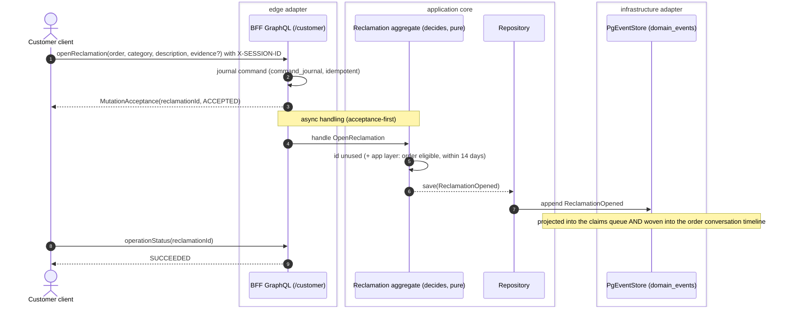
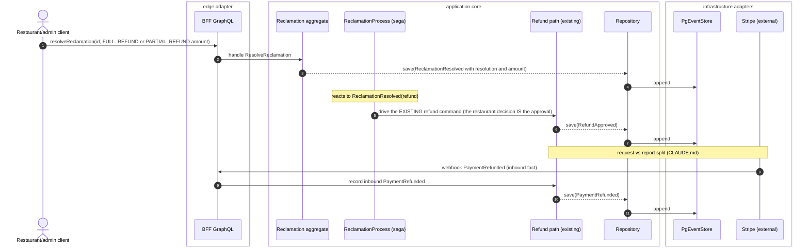
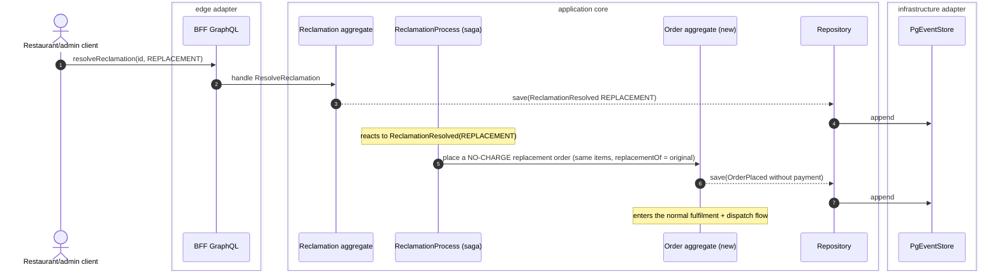
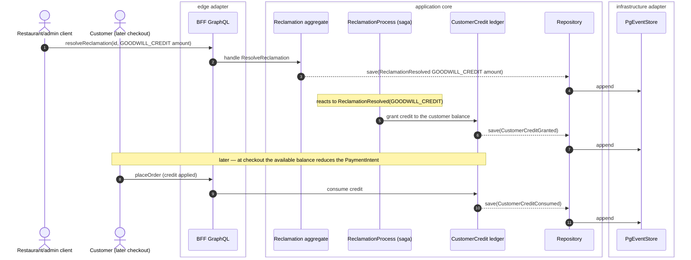
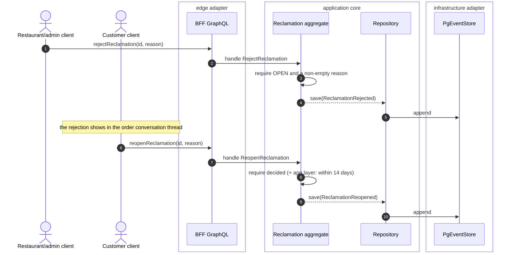

# PROP-20260726-013207 — First-class reclamation (customer claim/dispute) lifecycle

- **Status**: Accepted (2026-07-26, product owner made the §9 decisions) — see [ADR-20260726-124204](../adr/ADR-20260726-124204-reclamation-lifecycle.md). Realized incrementally by the §10 sub-issues; the two automations (credit ledger, replacement order) are promoted to **V0** by decision #2 and each carry their own ADR at build time.
- **Date**: 2026-07-26
- **Tracking issue**: [#151 "First-class reclamation (customer claim/dispute) lifecycle — open, discuss, resolve (refund/replacement/goodwill/reject)"](https://github.com/TheCaptainCompany/captain-food/issues/151) (every proposal MUST have one, ADR-20260724-143000; always the full clickable link)
- **Realized by**: [ADR-20260726-124204](../adr/ADR-20260726-124204-reclamation-lifecycle.md) (adopts this design + records the 7 §9 decisions). The §10 sub-issues land the slices.
- **Related**: [#129 "Epic: in-app order conversations (messaging)"](https://github.com/TheCaptainCompany/captain-food/issues/129) (the discussion channel — now live on the customer + restaurant surfaces) · [PROP-20260725-013008](PROP-20260725-013008-order-conversations-messaging.md) §2.7/§9.5 (in-thread refund binding, [#133](https://github.com/TheCaptainCompany/captain-food/issues/133)) · [PROP-20260725-120055](PROP-20260725-120055-generic-file-attachment-framework.md) ([#134](https://github.com/TheCaptainCompany/captain-food/issues/134), the `RECLAMATION` evidence photo) · the existing **refund flow** (`RequestRefund`/`ApproveRefund` + `RefundProcess`) · ADR-0041 (acting user is envelope, not payload) · CLAUDE.md request/report split.

> **Status:** Proposed. This document records the design and the decisions it asks the product owner
> to make. It is intentionally scoped as an **epic-candidate** and decomposed into shippable
> sub-issues (§10).

---

## TL;DR

Today a customer complaint has exactly one shape: a **refund request**. `RECLAMATION` exists only as a
photo *kind* in the messaging/attachment proposals. There is **no first-class claim object** — no
category, no non-refund resolution, no reopen, no status, no claims queue.

This proposes a **`Reclamation` aggregate** (event-sourced, correlated to an order): a customer **opens**
a claim (category + description + optional evidence photo), it is **discussed in the order's existing
conversation thread** ([#129](https://github.com/TheCaptainCompany/captain-food/issues/129)), and the
restaurant or an admin **resolves** it. Refund resolutions **feed the refund path we already have**
(request → the restaurant/admin approves → Stripe reports the fact) — *not* a second money mechanism.
Non-refund resolutions (replacement, goodwill, rejection-with-reason) are new. The claim carries a
tracked status, a reopen policy, and (later) an SLA.

It reuses three things already built or designed — the **conversation thread** (discussion), the
**refund path** (money), and the **attachment framework** (evidence) — and adds only the missing spine:
the claim's identity, lifecycle, categories, and non-refund resolutions.

## 1. The problem — "reclamation = refund" today

The current complaint path (implemented, not just proposed):

`RequestRefund` (customer) → `RefundRequested` → the **`RefundProcess`** process manager opens it for
decision → restaurant/admin `ApproveRefund` / `DenyRefund` → `RefundApproved` / `RefundDenied` → Stripe
reports `PaymentRefunded` (inbound). Read side: `View_PendingRefunds` → `pendingRefunds` → the
back-office refunds queue.

What that model cannot express:
- A complaint whose right outcome is **not money** (a remake, a redelivery, a goodwill gesture, or a
  reasoned "no").
- A **category** ("missing item" vs "cold" vs "never arrived") — so no analytics, no routing, no
  restaurant-quality signal.
- A **discussion** attached to the claim (now possible — the #129 thread exists).
- **Reopen** after a rejection, or a **time-bounded** claim window (the chargeback tail).
- A **claims queue** distinct from the refunds queue (a claim may be open with no refund yet).

## 2. The model

### 2.1 A `Reclamation` aggregate, event-sourced

New aggregate in `crates/domain` (spec: entities/events/commands/actors/errors/rules/tests), keyed by a
**client-generated `reclamationId`** (so a single order can carry more than one claim — see the §9.1
decision), correlated to its `orderId`. Business events (payloads business-only, ADR-0041 — the acting
user is `domain_events.user_id`, never a field):

| event | payload (business only) |
|---|---|
| `ReclamationOpened` | `reclamationId`, `orderId`, `category` (`ReclamationCategory`), `description`, `requestedResolution?` (`ReclamationResolution`, the customer's ask) |
| `ReclamationEvidenceAttached` | `reclamationId`, `attachmentRef` (opaque, via #134) |
| `ReclamationResolved` | `reclamationId`, `resolution` (`ReclamationResolution`), `note?`, `refundAmount?` (`Money`, for a partial) |
| `ReclamationRejected` | `reclamationId`, `reason` |
| `ReclamationReopened` | `reclamationId`, `reason` |

Status is derived in the read model (a fold), not stored — the same pattern as the conversation and the
refund views.

### 2.2 Categories and resolutions (new scalars)

- `ReclamationCategory` — `MISSING_ITEM | WRONG_ITEM | QUALITY | LATE_DELIVERY | DAMAGED | NOT_DELIVERED | OTHER`.
- `ReclamationResolution` — `FULL_REFUND | PARTIAL_REFUND | REPLACEMENT | GOODWILL_CREDIT | REJECTED`.
- `ReclamationStatus` (derived) — `OPEN → UNDER_REVIEW → RESOLVED | REJECTED`, with `REOPENED` folding back to `OPEN`.

### 2.3 Refund resolutions REUSE the existing refund path (the load-bearing reuse)

`FULL_REFUND` / `PARTIAL_REFUND` do **not** move money themselves. Resolving a claim that way **triggers
the refund command we already have** (`ApproveRefund` on the order, optionally partial via
`refundAmount`), and Stripe reports `PaymentRefunded` as an **inbound fact** — the CLAUDE.md request/
report split, exactly as [#133](https://github.com/TheCaptainCompany/captain-food/issues/133) binds the
in-thread refund. The `Reclamation` records the *decision*; the `RefundProcess` moves the *money*. One
refund path, one audit trail. (Whether the claim resolution emits `ReclamationResolved` **and** the
refund command in one handler, or a process manager reacts to `ReclamationResolved` and issues the
refund, is an implementation detail — the saga precedent is `RefundProcess`.)

### 2.4 Non-refund resolutions (the genuinely new part)

- `REJECTED` — a reasoned "no" (`ReclamationRejected`), reopenable within the window.
- `REPLACEMENT` / `GOODWILL_CREDIT` — see §9.2: for V0 these can be **recorded intents** (the resolution
  fact + a note, actioned operationally) without automating a replacement order or a credit-balance
  ledger, which are larger builds. The aggregate models the *decision*; automation follows if wanted.

### 2.5 Discussion reuses the order conversation (#129)

A reclamation does **not** get its own thread. The order already has a `Conversation` (identity = the
order); the claim's back-and-forth, the `RECLAMATION` evidence photo, and the status changes all live in
that one thread (the conversation read model can weave `Reclamation*` events into its timeline the same
way it folds order-status events). "Open a claim" is a structured overlay on the thread the customer is
already in — no second inbox.

### 2.6 Evidence reuses the attachment framework (#134)

`ReclamationEvidenceAttached.attachmentRef` is an opaque reference into the generic file framework
(`PROP-20260725-120055`), which already reserves the `RECLAMATION` kind with a **180-day** retention
(a claim/chargeback can run months). No bespoke storage here.

## 2b. Sequence diagrams

The load-bearing flows, drawn faithfully to the hexagonal architecture (the aggregate/PM **decides** the
facts — pure, no I/O — saved **through the `Repository`**, appended by its one adapter `PgEventStore`;
ADR-20260719-031136 / docs/claude/mermaid.md).

**(a) Open a claim — acceptance-first; folds into the queue + the order thread.** The mutation journals
the command and returns immediately (ADR-20260720-015500); the outcome is polled via `operationStatus`.



**(b) Resolve as refund — REUSE the existing refund path; request vs report split.** The claim decision
triggers the refund command we already have; Stripe **reports** the settled refund inbound.



**(c) Resolve as replacement — a no-charge replacement order ([#159](https://github.com/TheCaptainCompany/captain-food/issues/159)).**
The saga places a new order linked to the original, at no charge, which enters normal fulfilment.



**(d) Resolve as goodwill credit — grant to the customer balance, applied later at checkout
([#158](https://github.com/TheCaptainCompany/captain-food/issues/158)).**



**(e) Reject, then reopen within the 14-day window.**



## 2c. Screen mockups (wireframes)

Low-fidelity, per use case — to fix the shape, not the visual design. Rendered by the SDUI component
vocabulary; only a category picker and a claims-list card are plausibly new component kinds.

**Customer — open a claim** (from an order). Category + description + evidence photo (#134) + the
optional *requested* resolution.

```
+-------------------------------------------+
|  <  Back        Report a problem - A1B2    |
+-------------------------------------------+
|  What went wrong?                          |
|   ( ) Missing item    ( ) Wrong item       |   <- ReclamationCategory
|   ( ) Quality         ( ) Late delivery    |
|   ( ) Damaged         ( ) Not delivered    |
|   (o) Other                                |
|                                            |
|  Tell us more                              |
|  [ The drinks were missing____________ ]   |   <- description
|                                            |
|  [ + Add a photo ]      [ photo ]          |   <- RECLAMATION evidence (#134)
|                                            |
|  What would resolve this? (optional)       |
|   ( ) Refund   ( ) Replacement  ( ) Credit |   <- requestedResolution (the ask)
|                                            |
|                        [ Submit claim ]    |   -> openReclamation
+-------------------------------------------+
```

**Customer — my claims** (list) and a **claim detail** (deep-links into the order thread).

```
+-------------------------------------------+        +-------------------------------------------+
|  My claims                                 |        |  <  Claim - order A1B2        [ OPEN ]     |
+-------------------------------------------+        +-------------------------------------------+
|  A1B2  Chez Marco        [ OPEN ]          |        |  Missing item                             |
|  Missing item - 2h ago                     |        |  "The drinks were missing"   [ photo ]    |
|  ---------------------------------------   |  tap-> |   * Opened              14:02             |   <- woven into the
|  9F3C  Sushi Bar     [ RESOLVED ]          |        |   Chez Marco            14:20             |      order thread (#129)
|  Quality - refunded 4.50 EUR               |        |   "So sorry - refunding the drinks"       |
|  ---------------------------------------   |        |                                           |
|  77KK  Pizza Co      [ REJECTED ]          |        |  [ Open the conversation -> ]             |   -> #129 thread
|  Late delivery       [ Reopen ]            |        |                                           |
+-------------------------------------------+        +-------------------------------------------+
     ^ Reopen shows only within 14 days (decision 4)
```

**Restaurant/admin — claims queue** (beside the refunds queue; overdue-flagged, #160).

```
+-------------------------------------------------+
|  Claims  [ Open ] [ Overdue ] [ All ]  | Refunds |
+-------------------------------------------------+
|  (!) A1B2  Marie D.  Missing item   OPEN  4h     |   <- (!) = past the SLA first-response target (#160)
|      K3M9  Paul R.   Quality        OPEN  20m     |
|      77KK  Ana S.    Late delivery  REJECTED      |
|  ---------------------------------------------    |
|  Filter:  category [ any v ]   status [ open v ]  |
+-------------------------------------------------+
```

**Restaurant/admin — resolve panel** (one control, every resolution).

```
+-------------------------------------------------+
|  Claim - order A1B2 - Marie D.        [ OPEN ]  |
+-------------------------------------------------+
|  Missing item                                   |
|  "The drinks were missing"     [ order photo ]  |
|                                                 |
|  Resolve as:                                    |
|   ( ) Full refund                               |   -> resolveReclamation FULL_REFUND  (reuses the refund path)
|   (o) Partial refund   amount [ 4.50 ]          |   -> PARTIAL_REFUND + refundAmount
|   ( ) Replacement (send a new order)            |   -> REPLACEMENT  (#159 no-charge order)
|   ( ) Goodwill credit  amount [ 5.00 ]          |   -> GOODWILL_CREDIT (#158 balance)
|   ( ) Reject           reason [ __________ ]    |   -> rejectReclamation (reason REQUIRED)
|                                                 |
|  Note (optional) [ ___________________ ]        |
|                              [ Cancel ][ OK ]   |
+-------------------------------------------------+
```

## 3. Read model + queries

A `Reclamation` read model (a `View_*` fold or a projection table if it carries the discussion) backing:
- `myReclamations` (CUSTOMER) — the customer's claims + status.
- `restaurantReclamations` (RESTAURANT/RESTAURANT_ACCOUNT/ADMIN) — the **claims queue**, filterable by
  status/category; the restaurant's quality signal.
- `reclamation(reclamationId)` — one claim's detail (links to its order + conversation).

## 4. SDUI surfaces

- **Customer** (`restaurant_frontoffice`): an "Open a claim" entry from the order (category picker +
  description + optional photo → `openReclamation`); a "my claims" list; the claim detail deep-links into
  the order conversation for the discussion.
- **Restaurant/admin** (`restaurant_backoffice`): a **claims queue** beside the refunds queue; a resolve
  panel (choose resolution; a refund resolution reuses the refund amount control that
  [#133](https://github.com/TheCaptainCompany/captain-food/issues/133) introduces; reject-with-reason).

All reuse the SDUI component vocabulary + the now-live conversation screens; only a category picker and a
claims-list card are plausibly new component kinds.

## 5. Lifecycle, reopen window, SLA

- **Status** folds from the events (§2.2). A claim can be `REOPENED` after `REJECTED` (or after an
  unsatisfactory `RESOLVED`) within a **window** (§9.4).
- **SLA** (a response-time target, overdue flagging) is **deferred** (§9.5) — a first-response clock is
  an observability/read-model addition, not a domain change.

## 6. Completeness obligations (ADR-0032)

Every new command/event/error also needs a behaviour test (+ its `rules:` link), every new query/mutation
a story step, every new rule a test — enforced by `make validate`. New rules this introduces (illustrative):
a reclamation targets a real order; a refund resolution goes through the one refund path; a rejection
carries a reason; reopen is allowed only within the window; only the customer opens/reopens, only
restaurant/admin resolves/rejects.

## 7. Observability

Contracts in `specs/observability.yaml` for: claim open → first response (the SLA clock), resolution
outcome distribution (refund vs replacement vs goodwill vs reject) by category, and the refund-path
hand-off (a claim-driven refund must correlate to its `RefundProcess` run).

## 8. Relationship to what exists

- **Refund flow** — reused for money (§2.3); the claim is the *why*, the refund is the *how much*.
- **Messaging (#129)** — reused for discussion (§2.5); [#133](https://github.com/TheCaptainCompany/captain-food/issues/133)'s
  in-thread "accept refund" becomes *"resolve the claim as a refund"*.
- **Attachments (#134)** — reused for evidence (§2.6).
- The claim is the missing **spine** that turns three capabilities into a process.

## 9. Decisions this proposal asks the product owner to make

Each decision lists its options with **pros / cons**; the product owner's choice (2026-07-26) is marked
**→ CHOSEN** and recorded in [ADR-20260726-124204](../adr/ADR-20260726-124204-reclamation-lifecycle.md).

**9.1 Identity / cardinality**
| Option | Pros | Cons |
|---|---|---|
| **Several claims per order** (`reclamationId`) **→ CHOSEN** | Matches reality (one order can have several distinct issues); each claim has its own status/resolution/audit | Slightly more read-model work (list per order); UI must group by order |
| One claim per order (keyed by `orderId`) | Simplest; no grouping | Conflates distinct issues; a second problem can't be filed without reopening/overwriting the first |

**9.2 V0 resolution set**
| Option | Pros | Cons |
|---|---|---|
| Refund + reject first; **REPLACEMENT / GOODWILL_CREDIT as recorded intents** | Smallest V0; reuses the existing refund path only; ships fast | Two of the four resolutions don't actually *do* anything — staff act out-of-band; feels half-built to customers |
| **Build the credit-ledger + replacement-order automation up front → CHOSEN** | The full customer promise is real (a claim can end in credit or a remake, not just money-back); differentiator | Two substantial new sub-systems (a financial balance; a no-charge order flow), each its own ADR — a much larger V0 |

**9.3 Discussion channel**
| Option | Pros | Cons |
|---|---|---|
| **Reuse the order conversation thread (#129) → CHOSEN** | No second inbox; the claim sits where the customer already talks to the restaurant; status folds into one timeline for free | The thread mixes general chat and claim-specific messages (mitigated by the structured claim overlay) |
| A dedicated per-claim thread | Clean separation of claim discussion from general chat | A second inbox splits the customer's context; duplicates identity/ACL/notifications for no V0 gain |

**9.4 Reopen window** (how long after delivery/rejection a customer may open/reopen)
| Option | Pros | Cons |
|---|---|---|
| **14 days → CHOSEN** | Tight enough to bound restaurant liability + fraud; covers the normal "noticed it later" case | May feel short for a card-chargeback that surfaces months later (evidence still retained 180 days, so a manual/admin path can still act) |
| 30 days | More customer-generous | Longer liability tail for restaurants |
| 180 days (align to evidence retention / chargeback) | Covers the full chargeback tail automatically | Large open-liability window; invites stale/low-signal claims |

**9.5 Who may open**
| Option | Pros | Cons |
|---|---|---|
| **Customer only → CHOSEN** | Simplest ACL; the claim is authentically the customer's; no impersonation surface | A phone/in-person complaint can't be filed by staff on the customer's behalf in V0 (deferred) |
| Also restaurant/admin on behalf | Captures off-app complaints | Needs an on-behalf-of / impersonation model + audit; larger ACL surface |

**9.6 SLA**
| Option | Pros | Cons |
|---|---|---|
| **First-response clock + overdue flag in V0 → CHOSEN** | Claims don't rot silently; the queue surfaces overdue ones; a real service signal | A little extra read-model + observability work; needs a target value set |
| Deferred | Less to build now | No pressure/visibility on unanswered claims — the classic support-black-hole |

**9.7 Phasing**
| Option | Pros | Cons |
|---|---|---|
| **V0 → CHOSEN** ("the minimal thing we build for customers") | A credible complaint experience is table-stakes for ordering; refunds already exist to build on | With 9.2's automations promoted to V0, the epic is large — sequenced (core loop first, then the two automations) |
| Post-V0 | Focus V0 purely on order→pay→track | Ships without any structured way to handle "my order was wrong" beyond a raw refund |

## 10. Decomposition into sub-issues (created on approval)

1. **`Reclamation` aggregate** — open/resolve/reject/reopen + category/resolution/status scalars + the
   refund-path binding for refund resolutions (the RefundProcess hand-off). *(domain; the core)*
2. **Read model + queries** — `myReclamations`, `restaurantReclamations` (claims queue), `reclamation`.
3. **Weave `Reclamation*` into the conversation timeline** (#129 read model) — the discussion overlay.
4. **Evidence** — `ReclamationEvidenceAttached` over the #134 attachment framework.
5. **SDUI** — customer "open a claim" + "my claims"; restaurant/admin claims queue + resolve panel.
6. **Non-refund automation** (if approved) — replacement order + goodwill credit ledger. *(post-V0, large)*
7. **SLA + overdue flagging** — first-response clock (observability + read model). *(post-V0)*

## 11. Considered alternatives

- **Keep "reclamation = refund request" (status quo).** Rejected as the target state: it cannot express a
  non-money outcome, a category, a discussion, a reopen, or a claims queue — the whole point here.
- **Model the claim as fields on the `Order` aggregate.** Rejected: a claim has its own lifecycle (open →
  resolve → reopen), there can be several per order, and folding it into `Order` bloats the order
  aggregate and couples two lifecycles that evolve independently.
- **A dedicated per-claim conversation thread.** Rejected for V0 (§2.5): the order already has one thread;
  a second inbox splits the customer's context for no product gain. Revisit if a claim ever needs
  participants the order thread does not have.
- **A third-party helpdesk (Zendesk/Gorgias).** Rejected for the core: it forks the source of truth off
  the event log, duplicates identity/ACL, ships order+customer data to another processor (a GDPR + the
  "ethical alternative" positioning cost), and cannot fold the order/refund/conversation events. A
  support-desk *integration* could still sit beside it later.
