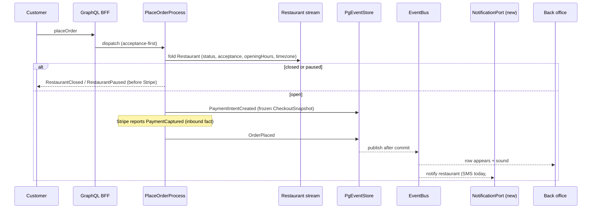
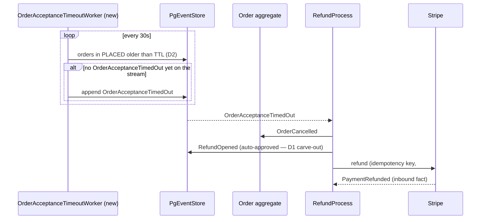
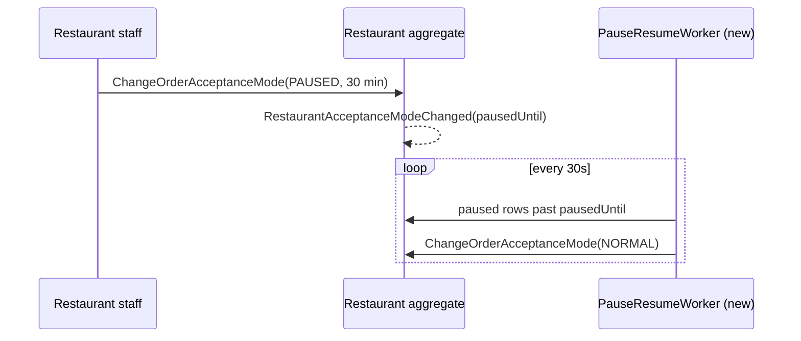

# PROP-20260726-164500 — Order operational safety: the loop that lets a restaurant run a shift

- **Status**: Proposed
- **Date**: 2026-07-26
- **Tracking issue**: [#198 "Epic: order operational safety — the loop that lets a restaurant actually run a shift"](https://github.com/TheCaptainCompany/captain-food/issues/198)
- **Realized by**: _(filled at completion)_

---

## 1. Context

The 2026-07-26 architecture review found a cluster of gaps that individually look like polish and
jointly mean **a paid order can be placed and nothing happens**.

Verified on `main` at commit `835da95`:

| Fact | Evidence |
|---|---|
| No notification mechanism exists — no push, SMS, email, printer or sound | repo-wide; `OvhSmsClient` is wired only to the Supabase auth OTP hook |
| The back office declares **no `subscription:`** on any screen | `specs/screens/restaurant_backoffice.yaml` (the customer's `order_tracking` *does* subscribe) |
| Nothing watches an unaccepted order | `specs/processmanager.yaml` declares 4 PMs, none triggered by `OrderPlaced` |
| Money is captured **before** acceptance, and refunds need human approval | `rules.yaml#/OrderMaterializedOnPaymentCapture`, `#/RefundRequiresApproval` |
| Opening hours are never enforced; no `RestaurantClosed` error exists | `processmanager.yaml:95-114` guard list; `specs/errors.yaml` |
| `BUSY` is referenced by no guard, rule, PM or projection | `crates/application/src/commands.rs:2023` checks `PAUSED` only |
| `PAUSED` has no duration and no auto-resume | `commands.yaml#/ChangeOrderAcceptanceMode` takes `{restaurantId, mode}` |
| No order detail screen exists | `restaurant_backoffice.yaml` `orders_queue` = card list + 5 flat buttons |

The compounding failure is the point. A customer orders at 23:40 from a restaurant that closed at
23:00 (no hours check), the kitchen is never told (no notification), nobody accepts (no timeout),
and the money stays captured (no auto-refund). Every link in that chain is missing independently.

**The pattern to copy already exists.** `delivery_offer_timeout_worker.rs` sweeps stale delivery
offers on a 30s tick, records `DeliveryOfferTimedOut` idempotently per (job, rank), and the dispatch
saga consumes it as an ordinary trigger. The most important wait in the system simply never got the
same treatment.

## 2. Recommended approach

Five changes, sequenced so each is useful alone.

1. **Notify (#166).** An `orderStatusChanged`-style subscription on `orders_queue` with an audible
   alert, plus a **notification port** in `application` fired on `OrderPlaced`. V0 transport = SMS
   through the existing `OvhSmsClient`; [#127](https://github.com/TheCaptainCompany/captain-food/issues/127)
   later swaps the transport without touching the trigger.
2. **Enforce opening hours (#180).** A guard in the checkout path evaluated in the restaurant's own
   `timezone`, plus a typed `RestaurantClosed` rejection and a matching read-side `openNow`.
3. **Time out acceptance (#167).** `OrderAcceptanceTimeoutWorker`, modelled on the delivery-offer
   worker, recording `OrderAcceptanceTimedOut`.
4. **Give staff the order (#170).** An `order_detail` screen carrying the items, options, note,
   address, contact and the lifecycle actions — including the prep-time input that finally populates
   `estimatedReadyAt`.
5. **Make capacity real (#186).** `BUSY` extends the customer-facing promise; `PAUSED` carries a
   duration with automatic resume.

Order matters: **hours before timeout**. Enforcing hours removes the largest single source of
un-accepted orders, so the timeout lands on a much smaller and more genuine population.

## 3. Decisions surfaced

### D1 — What happens when acceptance times out

| Option | Pros | Cons |
|---|---|---|
| **Auto-cancel + auto-approved refund** ✅ **recommended** | The customer is never left charged for a platform/partner failure; no human in the loop at the worst moment; bounded, predictable | Needs an explicit auto-approval carve-out in `RefundRequiresApproval`; a slow-but-willing restaurant loses an order |
| Escalate to admin, hold the order | A human can rescue a genuinely good order | Requires staffed operations Captain does not have; the customer waits with money gone |
| Notify the customer, let them cancel | Cheap; keeps customer in control | Puts the burden of a platform failure on the customer; most will simply not return |

`RefundRequiresApproval` is correct for **disputed** refunds and wrong for **"we failed to serve
you"** refunds. That distinction should be explicit in `rules.yaml`, not left to operator habit.

### D2 — Acceptance TTL value

| Option | Pros | Cons |
|---|---|---|
| **5 minutes, per-restaurant override** ✅ **recommended** | Matches category norms; short enough that the customer has not left | Aggressive for a restaurant new to the tablet — hence the override |
| 10–15 minutes | Forgiving during onboarding | Customer has usually given up; food is late before it is cooked |
| No fixed TTL, alert only | No false cancellations | Restores the current failure — something must eventually resolve the order |

### D3 — V0 notification channel

| Option | Pros | Cons |
|---|---|---|
| **In-app subscription + sound, then SMS** ✅ **recommended** | Subscription infrastructure already exists and already serves the customer screen; SMS reuses `OvhSmsClient`; both are days not weeks | SMS has a per-message cost; in-app requires the tab to be open |
| Wait for [#127](https://github.com/TheCaptainCompany/captain-food/issues/127)'s full cascade | One coherent build; cheapest per message at scale | #127 is post-V0 and unstarted; blocks the entire operational loop behind it |
| Email | Free | Restaurants do not watch email during service |

### D4 — Pause duration

Recommended: **add an optional duration with auto-resume**. A forgotten pause is silent lost revenue
and the restaurant blames the platform. The auto-resume reuses the same worker pattern.

### D5 — Opening-hours exception days

Recommended: **model them in the same change**. Weekly recurrence alone will be wrong on every
public holiday, and France has eleven. `RestaurantListingClosed` is permanent establishment closure
from SIRENE and is not a substitute.

## 4. Screen mockups

### 4.1 Order queue — arrival (#166, #170)

```
+--------------------------------------------------+
| Chez Marco          Orders: [ ACCEPTING v ]       |
+--------------------------------------------------+
|  * NEW  #A1B2   Marie D.    23.50 EUR    0:04     |  <- appears live, sound
|         2 items - DELIVERY          [ Open ]      |
+--------------------------------------------------+
|    #9F3C   Paul R.          14.00 EUR   PREPARING |
+--------------------------------------------------+
```

The `0:04` is the acceptance clock (D2) — visible pressure, not a hidden timer.

### 4.2 Order detail — accept with a prep time (#170)

```
+--------------------------------------------------+
| < Orders            Order #A1B2   [ PLACED ]      |
+--------------------------------------------------+
| Marie D.  ·  06 12 34 56 78        [ Call ]       |
| DELIVERY  ·  12 rue Nationale, 37000 Tours        |
| Note: "sans oignons svp"                          |
+--------------------------------------------------+
| 2x  Burger Maison                        19.00 EUR|
|     + Cheddar, + Bacon                            |
| 1x  Frites                                4.50 EUR|
+--------------------------------------------------+
| Ready in:  [15]  [20]  [30]  min                  |
| [ Accept ]   [ Reject... ]                        |
+--------------------------------------------------+
```

`Reject...` opens the reason sheet that [#168](https://github.com/TheCaptainCompany/captain-food/issues/168)
requires — `RejectOrder.reason` is in `required` and is currently never sent.

### 4.3 Capacity control (#186)

```
+--------------------------------------------------+
| Orders: [ ACCEPTING v ]                           |
|   ( ) Normal                                      |
|   (o) Busy      - quote +15 min to customers      |
|   ( ) Paused    for [ 30 min v ] -> resumes 20:45 |
+--------------------------------------------------+
```

### 4.4 Customer, refused before payment (#180)

```
+--------------------------------------------------+
|  Chez Marco is closed                             |
|  Opens tomorrow at 11:30                          |
|  [ Browse open restaurants ]                      |
+--------------------------------------------------+
```

Refused at address/checkout entry — never after the card is charged.

## 5. Sequence diagrams

### 5.1 Placement with the hours guard, and the notification fan-out



### 5.2 Acceptance timeout



Note the hexagonal shape: the worker *observes* and records a fact; the **saga decides**; the
aggregate is saved through the `Repository`; Stripe reports the settlement back as an inbound event.
No worker writes business state directly.

### 5.3 Timed pause with auto-resume



## 6. Alternatives considered for the cluster as a whole

| Approach | Pros | Cons |
|---|---|---|
| **Five sequenced slices behind one epic** ✅ **recommended** | Each ships independently and is useful alone; the notification slice alone unblocks piloting with a real restaurant | Five ADR-0032 completeness sets |
| One "make ordering work" mega-slice | One coherent design pass | Large, un-reviewable, and delays the one-day notification fix behind months of capacity modelling |
| Fix only notification, defer the rest | Fastest to a pilot | Leaves customers charged for ignored orders — acceptable for a supervised pilot, not for public launch |

A supervised pilot (Captain staff watching every order) could legitimately run on #166 alone. That
is worth stating explicitly, because it is the cheapest path to real product feedback.

## 7. Verification plan

- **#166** — rule *a placed order always produces a restaurant-addressed notification*; behaviour
  test; the `orders_queue` empty-state promise becomes true. Observability: notification dispatch
  outcome per channel.
- **#180** — rule *an order is accepted only within opening hours, in the restaurant's timezone*;
  tests include a DST boundary and an exception day; `openNow` agrees with the write path.
- **#167** — rule *a placed order is never left unresolved past the acceptance TTL*; negative test
  (an accepted order is never timed out); idempotency test (two sweeps, one event). Observability:
  acceptance-timeout rate as an operator signal.
- **#170** — story step for "restaurant reads the order to prepare it"; the new action-variable
  validator checks ([#169](https://github.com/TheCaptainCompany/captain-food/issues/169)) pass.
- **#186** — rule *a paused restaurant auto-resumes at the stated time*; `BUSY` measurably changes
  the customer-facing promise; `AcceptanceModeUnchanged` idempotency preserved.

All slices: `make rust` green, `make validate` 0 errors, `check-drift` clean.

## 8. Open questions for the product owner

1. **D1** — auto-approved refund on timeout? (recommended: yes)
2. **D2** — acceptance TTL: 5 minutes with a per-restaurant override? (recommended: yes)
3. **D3** — ship in-app + SMS now rather than waiting for [#127](https://github.com/TheCaptainCompany/captain-food/issues/127)? (recommended: yes)
4. **D4** — timed pause with auto-resume? (recommended: yes)
5. **D5** — model exception days now? (recommended: yes)
6. Is a **supervised pilot on #166 alone** an acceptable interim, ahead of the rest?

## 9. Refs

`crates/infrastructure/src/integrations/delivery_offer_timeout_worker.rs` ·
`crates/infrastructure/src/integrations/ovh_sms.rs` · `specs/processmanager.yaml:95-114` ·
`specs/screens/restaurant_backoffice.yaml` · `specs/rules.yaml#/RefundRequiresApproval` ·
`specs/scalars.yaml#/OrderAcceptanceMode` ·
[#166](https://github.com/TheCaptainCompany/captain-food/issues/166) ·
[#167](https://github.com/TheCaptainCompany/captain-food/issues/167) ·
[#170](https://github.com/TheCaptainCompany/captain-food/issues/170) ·
[#180](https://github.com/TheCaptainCompany/captain-food/issues/180) ·
[#186](https://github.com/TheCaptainCompany/captain-food/issues/186) ·
[#127](https://github.com/TheCaptainCompany/captain-food/issues/127)
