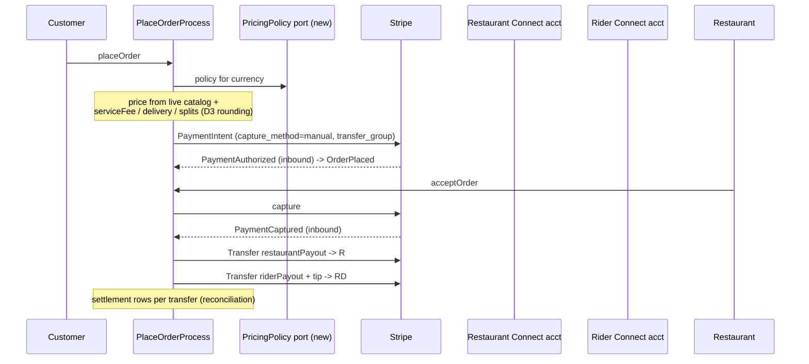
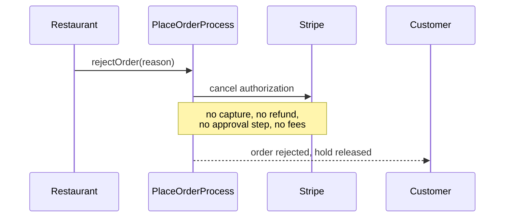
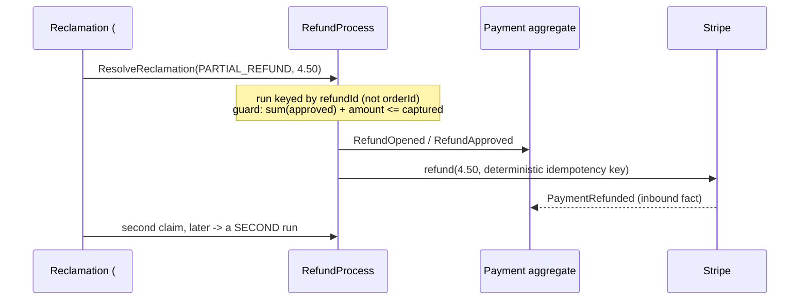

# PROP-20260726-165000 — Marketplace economics and money movement

- **Status**: Partially approved — D1/D2 decided by the customer 2026-08-08 ([ADR-20260808-195315](../adr/ADR-20260808-195315-customer-brief-answers.md)); D3/D4 by ensemble consent ([ADR-20260808-171056](../adr/ADR-20260808-171056-register-sweep-consent-decisions.md)); D5 decided by the customer 2026-08-08 ([ADR-20260808-203443](../adr/ADR-20260808-203443-tips-voluntary-contributions-funding-model.md): rider tips per [BRIEF-20260808-tips-discussion.md](BRIEF-20260808-tips-discussion.md), restaurant tip opt-in, platform voluntary-contribution funding model)
- **Date**: 2026-07-26
- **Tracking issue**: [#199 "Epic: marketplace economics and money movement — fees, payouts, VAT, invoicing, capture timing"](https://github.com/TheCaptainCompany/captain-food/issues/199)
- **Realized by**: _(filled at completion)_

> **Decision note 2026-08-08 (ADR-20260808-195315)**: **D1** = Connect, separate charges &
> transfers, as recommended. **D2 decided DIFFERENTLY from the recommendation**: authorize at
> checkout, **capture on delivered / picked-up** (in advance for at-table) — capture is per
> service type, NOT on acceptance. Where this document's flows (§5.1, §7) say "capture on
> acceptance", the decided posture supersedes them; the acceptance timeout **releases the
> authorization** (no refund on that path). Consequence carried into D5: an after-delivery tip is
> a post-capture second payment.

> **Forward hazard 2026-08-14 (PR #545 five-lens review, dba lens — recorded, NOT reachable today)**:
> the decided per-service-type posture has a third arm the other two do not — **capture in advance
> for at-table service** (an auto-/advance-capture that captures *before* the customer is present).
> It is unbuilt, and there is no at-table `ServiceType` yet (`specs/common/scalars.yaml:271-276`,
> `EAT_IN` explicitly not offered), so it has **no dedicated issue** — this hazard should be attached
> to the at-table arm's issue when one is opened. The trap is compounding, so it is recorded now:
> under [PR #545 "capture on delivered"](https://github.com/TheCaptainCompany/captain-food/pull/545)'s
> authorize-first design, `PlaceOrderProcess` materializes the `Order` **only** on `PaymentAuthorized`,
> while the `Payment` aggregate keeps a direct `PENDING → CAPTURED` transition on `PaymentCaptured`
> (`specs/payments/actors.yaml:22`) and a `PaymentAuthorized` arriving past `PENDING` is swallowed as
> already-recorded. So the day the advance-capture arm lands, a `PaymentCaptured` on a still-`PENDING`
> payment drives `PENDING→CAPTURED`, the following `PaymentAuthorized` is swallowed, and
> `PlaceOrderProcess` never fires: **money captured, order never materialized** — the worst failure
> mode (money moved, nobody told). Today's manual-capture DELIVERY/COLLECTION posture closes the
> ordering (every order is Authorized→Captured), so it cannot happen yet. **Build constraint, pinned
> by a test when the arm lands**: `PlaceOrderProcess` MUST also materialize the `Order` on a
> `PaymentCaptured`-from-`PENDING`, not only on `PaymentAuthorized`. Tracked at
> [DECISIONS §38](../proposals/DECISIONS.md).

---

## 1. Context

The money **plumbing** is genuinely built and tested: Stripe webhook signature verification over the
raw body with a replay window, three independent layers of inbound idempotency, event-sourced payment
facts, server-side price authority with fail-closed repricing, and an approval-gated refund workflow.

The money **itself** is not. Verified on `main` at `835da95`:

| Fact | Evidence |
|---|---|
| Every fee and split leg is hard-zeroed at checkout | `crates/application/src/pricing.rs:103-112` |
| `PricingPolicy` (5% fee, 60% buyer share) is read only by an admin query | `crates/server/src/lib.rs:238`; the write path never reads it |
| No delivery-fee source exists anywhere | no `deliveryFee` on `Restaurant`; `avg_delivery_fee_cents` is an *Uber comparison* constant |
| **No Stripe Connect, transfers or payouts** | zero hits for `transfer_data`, `application_fee`, `on_behalf_of`, `acct_`, `/v1/transfers`, `/v1/payouts` |
| No payout destination is modelled at all | zero hits for `iban`, `bank`, `connectAccount` |
| `TaxRate` is stored per product per mode and never computed with | `pricing.rs` never touches tax |
| No invoice or receipt is generated | only a nav icon name and one translation string |
| No ledger or reconciliation model | zero hits for `ledger`, `reconcil` outside prose |
| No authorize/capture split | `outbound.rs:101-115` sends no `capture_method` ⇒ Stripe automatic capture |
| No `Idempotency-Key` on outbound Stripe calls | `outbound.rs:51-70` |
| One refund run per order, forever | `process_managers.yaml:39` — `order_id` is the PK |
| No rounding policy anywhere | `MoneyCents` is `minimum: 0`; ADR-0017's percentages have no stated rounding |

Stated plainly for the record: **today the platform takes 0%, charges no delivery fee, and every euro
lands in Captain's own Stripe balance with no mechanism to pay the restaurant.**

That last clause is not only an unbuilt feature. Collecting customer funds on behalf of a third party
makes Captain the merchant of record holding other people's money, which in France raises
payment-agent and fund-safeguarding questions. It is dramatically cheaper to answer before the first
few hundred real orders than after.

## 2. Recommended approach

**Decide the payout posture first; everything else follows from it.** The posture determines who the
seller is, who invoices whom, how VAT is declared, and Captain's legal standing while holding funds.
Building the fee split before answering it means building it twice.

Then, in order:

1. **#176 idempotency keys** — hours of work, removes a duplicate-refund risk. Do it immediately,
   independent of every decision below.
2. **#173 payout posture + Connect** — the decision now, the build next.
3. **#172 fee computation** — once the posture fixes where each leg goes.
4. **#175 capture-on-acceptance** — pairs with the acceptance timeout in
   [PROP-20260726-164500](PROP-20260726-164500-order-operational-safety.md).
5. **#177 refund re-key** — blocks [#151](https://github.com/TheCaptainCompany/captain-food/issues/151)'s
   approved "multiple claims per order"; needed before [#158](https://github.com/TheCaptainCompany/captain-food/issues/158)/[#159](https://github.com/TheCaptainCompany/captain-food/issues/159).
6. **#174 VAT + invoicing** — computation can start early; invoicing waits on the posture.

## 3. Decisions surfaced

### D1 — Payout posture

| Option | Pros | Cons |
|---|---|---|
| **Connect, separate charges & transfers** (ADR-0017) ✅ **recommended** | Restaurant is its own merchant of record; Captain never holds partner funds; Stripe carries KYC/AML; clean three-way split for the rider leg | Each partner completes Connect onboarding (real friction); more moving parts; transfer reconciliation |
| Connect **destination charges** | Simplest Connect variant; one charge, automatic transfer | Captain sits closer to merchant of record; awkward for a second recipient (rider); less clean fee attribution |
| **Manual payouts** — collect everything, bank-transfer monthly | Zero build today | Captain holds third-party funds (the posture problem); manual reconciliation; does not survive a dozen partners or an audit |

The friction objection to Connect is real and worth naming: a restaurant that will not complete KYC
cannot be paid. That is a feature, not a bug — it is the same check that makes Captain not liable for
their funds.

### D2 — Capture timing

| Option | Pros | Cons |
|---|---|---|
| **Authorize at checkout, capture on acceptance** ✅ **recommended** | Rejection/timeout releases an authorization — no money ever moved, no refund, no approval; category norm | Payment lifecycle gains a state; authorizations expire (~7 days), which bounds scheduled orders ([#197](https://github.com/TheCaptainCompany/captain-food/issues/197)) |
| Keep capture-at-checkout | No change; the order materialises from one clean fact | Every rejection becomes a refund needing human approval; consumers left charged; chargeback exposure |
| Capture at checkout, auto-approve rejection refunds | Small change | Money still round-trips; refund fees; still slow for the customer |

### D3 — Rounding

Undefined today, and it must not stay that way once percentages are applied. Recommended:
**compute the buyer-facing total first, then derive splits, allocating the residual cent to
`captainNet`** — so the customer is never charged an unexpected cent and the splits always reconcile
to the captured amount. Whatever is chosen must be stated in an ADR and pinned by a test with an odd
total.

### D4 — Delivery-fee dimension

| Option | Pros | Cons |
|---|---|---|
| **Per-zone** ✅ **recommended** | Pairs naturally with the delivery-area work ([#181](https://github.com/TheCaptainCompany/captain-food/issues/181)); understandable to restaurant and customer; no geocoding needed for a postal-set first cut | Coarse at zone boundaries |
| Flat per restaurant | Trivial | Subsidises long trips, overcharges short ones |
| Distance-banded | Fairest; matches rider cost | Requires geocoded customer addresses — a prerequisite Captain does not have yet |

### D5 — Do tips move money?

Tips are recorded (`OrderTipped`, per-recipient sums on the read model) and **move no money at all**.
Recommended: fold rider/restaurant tips into the same transfer mechanism as D1 in the same change —
a tip that never reaches the rider is worse than no tip button.

## 4. Screen mockups

### 4.1 Checkout — an honest breakdown (#172, #174)

```
+--------------------------------------------------+
| Your order                                        |
|   Articles                              23.50 EUR |
|   Delivery (zone Tours-centre)           2.90 EUR |
|   Service fee                            1.18 EUR |
|   ------------------------------------------------|
|   TOTAL                                 27.58 EUR |
|   incl. VAT 10%  2.14  ·  VAT 20%  0.24           |
+--------------------------------------------------+
|   Add a tip for your courier                      |
|   [ none ] [ 1 EUR ] [ 2 EUR ] [ other ]          |
+--------------------------------------------------+
|              [ Pay 27.58 EUR ]                    |
+--------------------------------------------------+
```

### 4.2 Restaurant onboarding — payout destination (#173)

```
+--------------------------------------------------+
| Get paid                                          |
|                                                   |
| To receive payouts, complete your Stripe account. |
| Captain never holds your money - customers pay    |
| you directly and we take our fee at the same time.|
|                                                   |
|   Status: [ !! Not started ]                      |
|   [ Continue to Stripe ]                          |
|                                                   |
| Your restaurant cannot go live until this is done.|
+--------------------------------------------------+
```

The last line is the product expression of D1: no payout destination, no `ACTIVE_PARTNER`.

### 4.3 Restaurant — payouts view (#173)

```
+--------------------------------------------------+
| Payouts                        July 2026          |
+--------------------------------------------------+
| 24 Jul   38 orders     712.40 EUR   [ paid ]      |
| 25 Jul   41 orders     786.10 EUR   [ paid ]      |
| 26 Jul   12 orders     221.70 EUR   [ pending ]   |
+--------------------------------------------------+
| Gross 1 848.20 · Captain fee -92.41 · Refunds -18.00
| NET                                  1 737.79 EUR |
|                            [ Download statement ] |
+--------------------------------------------------+
```

## 5. Sequence diagrams

### 5.1 Recommended end-to-end (D1 + D2 + #172)



### 5.2 Rejection under D2 — nothing to refund



### 5.3 Multiple partial refunds after the #177 re-key



## 6. Alternatives considered for the whole cluster

| Approach | Pros | Cons |
|---|---|---|
| **Decide posture now, build in the order above** ✅ **recommended** | The one irreversible decision is made while it is still cheap; each build slice is independently shippable | Requires a product-owner decision before meaningful money work starts |
| Ship fees now, payouts later | Revenue starts immediately | Captain accumulates partner funds it has no mechanism to remit — the exact posture problem, made larger daily |
| Stay at 0% through the Tours pilot deliberately | Simplest; removes pricing as a pilot variable; "no commission" is already marketing copy | Does not remove the payout problem (the restaurant is still owed the food revenue); no data on fee tolerance |

The third option deserves consideration on its merits — but note it only defers **#172**, not **#173**.
The restaurant is owed its money whether or not Captain takes a fee.

## 7. Verification plan

- **#176** — deterministic key pinned by a unit test; a simulated timeout + saga re-run produces
  exactly one Stripe refund.
- **#173** — no order is captured for a restaurant with no payout destination; transfers idempotent
  per (order, recipient); a reconciliation view where charges − refunds − transfers − fees balances
  for any settled day.
- **#172** — rule *the buyer is charged exactly `articles + delivery + serviceFee`, and the split
  reconciles with no lost cents*, with an odd-cents test; the existing `PaymentBreakdown` invariants
  asserted against real values rather than zeros.
- **#175** — rule *a customer is never left charged for an order the restaurant did not accept*;
  existing captured-flow streams keep folding (additive events only — see
  [#192](https://github.com/TheCaptainCompany/captain-food/issues/192)).
- **#177** — two sequential partial refunds settle; a third exceeding the capture is rejected; a
  cross-currency amount is rejected; `pendingRefunds` shows concurrent runs without collapsing them.
- **#174** — a mixed-rate cart produces per-rate buckets summing exactly to the TTC total; every
  captured order has a receipt with a gap-free number.

## 8. Open questions for the product owner

1. **D1** — Connect separate charges & transfers? (recommended: yes)
2. **D2** — move to authorize-then-capture-on-acceptance? (recommended: yes)
3. **D3** — residual cent to `captainNet`? (recommended: yes; any answer, but it must be stated)
4. **D4** — per-zone delivery fee? (recommended: yes)
5. **D5** — tips ride the same transfer mechanism? (recommended: yes)
6. Is **0% through the Tours pilot** a deliberate choice, or an accident of the placeholder?

## 9. Refs

`crates/application/src/pricing.rs:103-112` · `crates/adapters/stripe/src/outbound.rs:51-70,101-115` ·
`specs/entities.yaml#/PaymentBreakdown`, `#/TaxRate` · `specs/database/tables/referential.yaml#/PricingPolicy` ·
`specs/database/tables/process_managers.yaml:39` · ADR-0016 · ADR-0017 (Proposed) ·
[#172](https://github.com/TheCaptainCompany/captain-food/issues/172) ·
[#173](https://github.com/TheCaptainCompany/captain-food/issues/173) ·
[#174](https://github.com/TheCaptainCompany/captain-food/issues/174) ·
[#175](https://github.com/TheCaptainCompany/captain-food/issues/175) ·
[#176](https://github.com/TheCaptainCompany/captain-food/issues/176) ·
[#177](https://github.com/TheCaptainCompany/captain-food/issues/177) ·
[#151](https://github.com/TheCaptainCompany/captain-food/issues/151)
