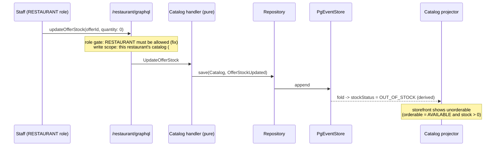
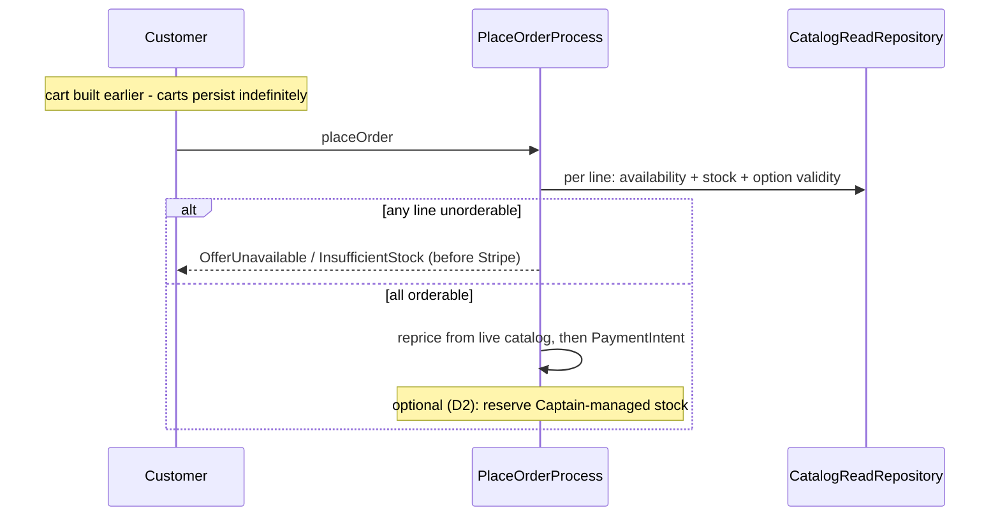

# PROP-20260726-165500 — Catalog compliance and merchandising

- **Status**: Proposed
- **Date**: 2026-07-26
- **Tracking issue**: [#200 "Epic: catalog compliance and merchandising — allergens, photos, menu management, promotions"](https://github.com/TheCaptainCompany/captain-food/issues/200)
- **Realized by**: _(filled at completion)_

---

## 1. Context

The catalog **model** is one of the stronger parts of the system: HubRise-aligned, correctly typed,
with `OptionList` min/max bounds genuinely enforced at write time and a clean availability-vs-stock
separation. What is missing is everything that makes a catalog **sellable and lawful**.

Verified on `main` at `835da95`:

| Fact | Evidence |
|---|---|
| **Allergens do not exist** — no field, enum or note | `allergen`, `gluten`, `halal`, `kcal` = **zero hits repo-wide** |
| HubRise `nutrition` is available and dropped at the ACL | `specs/integrations/hubrise.md:27` — not in the mapping table |
| No screen binds any of the 13 catalog mutations | `specs/screens/*.yaml` — only the read-only storefront `catalog.byRestaurant` |
| `updateOfferStock` excludes the `RESTAURANT` role | `api.yaml` — `[ADMIN, RESTAURANT_ACCOUNT]` only |
| Images are UUIDs with no entity, upload, storage or CDN | `ImageId` scalar; `upload`/`Upload` = zero hits |
| The HubRise adapter hardcodes empty images | `crates/adapters/hubrise/src/enrich.rs:343` |
| The storefront binds `photoUrl`/`coverUrl`/`logoUrl` that exist on no type | `restaurant_frontoffice.yaml:215,304`; declared gap at `:297` |
| Stock never decrements on order | `OrderPlaced` is not in `projection_tables.yaml#/Catalog` `fedBy`; `catalog.rs` `apply()` ignores it |
| Checkout does not re-validate availability/stock/options | `crates/application/src/commands.rs:2066-2069` (TODO) |
| No promotions, promo codes, combos or loyalty | declared `gap`s, with live widgets bound to nothing |
| No per-service-type **pricing** (only per-mode VAT) | `Offer.price` is a single `Money`; HubRise `price_overrides` dropped |
| Multiple catalogs per restaurant: modelled, unreachable | non-unique FK + `entities.yaml:243` note vs `catalog(restaurantId)` returning one nullable catalog |
| No menu scheduling | `availableFrom`, `menuSchedule`, `lunch` = zero hits; only restaurant-level `OpeningHoursSlot` |

Two of these are not backlog items. **Allergens are a legal blocker** — Regulation (EU) 1169/2011
requires the 14 declarable allergens to be available to the consumer before a distance-selling
purchase is concluded, enforced in France by the DGCCRF. And **structural oversell** means customers
are charged for food that does not exist, which converts straight into the reclamation queue that
[#151](https://github.com/TheCaptainCompany/captain-food/issues/151) just built.

## 2. Recommended approach

1. **#184 allergens** — the model first, so HubRise imports and manual entry can start carrying it.
2. **#171 catalog UI**, starting with the **86 toggle alone** (small, and the highest-frequency
   operation in a kitchen), then full editing. Add `RESTAURANT` to `updateOfferStock` in the same
   change — the role that works the shift is the one currently excluded.
3. **#183 checkout re-validation** — closes the TODO, cheap, removes most oversell exposure.
4. **#185 photos**, riding [#134](https://github.com/TheCaptainCompany/captain-food/issues/134)'s
   generic `files` registry rather than building a second pipeline.
5. **#196 merchandising**, promo codes first.

## 3. Decisions surfaced

### D1 — Allergen representation

| Option | Pros | Cons |
|---|---|---|
| **Controlled `Allergen` enum (14 EU categories) + explicit "not declared" state** ✅ **recommended** | Machine-checkable; filterable; the undeclared state prevents "no allergens listed" reading as "allergen-free" | A new scalar and per-product capture UI |
| Reuse the free-form `Tag` scalar | Zero model change | Unvalidated, untranslatable, unfilterable — and legally worthless as a declaration |
| Free-text allergen note per product | Easy for restaurants | Not machine-readable; cannot power warnings or filters; inconsistent across partners |

The **"not declared"** state carries more weight than it looks. A nullable list where empty renders
as "contains nothing" is the failure mode that gets someone hurt. Undeclared must render as
*"Allergen information not provided — contact the restaurant"*.

### D2 — Does Captain own stock consumption?

| Option | Pros | Cons |
|---|---|---|
| **Re-validate at checkout; decrement only for Captain-managed offers** ✅ **recommended** | Closes the cheap half now; respects the POS as stock authority where one exists | Two behaviours to document; HubRise restaurants still oversell between syncs |
| Decrement on every `OrderPlaced` | Uniform | Double-counts against a HubRise POS that is already decrementing — worse than not counting |
| Never decrement (status quo) | No work | Guaranteed oversell, no manual remedy while `RESTAURANT` cannot set stock |

Reservation-on-checkout (hold stock during the payment window, release on failure) is the natural
extension once Captain owns the number; it is deliberately out of the first slice.

### D3 — Per-service-type pricing

| Option | Pros | Cons |
|---|---|---|
| **Optional per-service-type price override on `Offer`** ✅ **recommended** | Matches French practice (delivery priced above counter); small additive change; maps HubRise `price_overrides` instead of dropping it | Pricing logic must resolve the override by `ServiceType` |
| Multiple catalogs per restaurant, one per service type | Already half-modelled; clean separation | `catalog(restaurantId)` has no disambiguating argument today, so the read API must change; duplicate maintenance for restaurants |
| Single price (status quo) | Simplest | Restaurants cannot recover delivery cost in the price — the standard lever in this market |

Whichever is chosen, the **`catalog(restaurantId)` ambiguity must be resolved** — a non-unique FK
with a singular nullable query has no defined answer if a second catalog ever appears.

### D4 — Catalog images on the #134 framework

[#134](https://github.com/TheCaptainCompany/captain-food/issues/134) designs `files` with an
`audience` (set of roles) × `scope_type`/`scope_id`, aimed at **private** per-order attachments.
Catalog images are **public** content with no order scope. Recommended: **confirm #134's design
admits a public audience now**, while it is still on paper — retrofitting a public path into a model
built around per-order membership is the expensive version.

Also needed: derivatives/resizing. A 4MB phone photo on a 4G product list defeats the ~2s page-load
NFR in the product spec.

### D5 — Merchandising order

Recommended: **promo codes first** — highest acquisition value for a single-city launch, and the UI
is already built. Note loyalty must reuse
[#158](https://github.com/TheCaptainCompany/captain-food/issues/158)'s customer credit balance; two
balances would be a data-integrity problem, not just duplication.

### D6 — Menu scheduling

Not separately filed. Recommended: **defer**, but record it — `Offer.availability` is binary and
restaurant-level `OpeningHoursSlot` is the only time model, so a lunch-only formule cannot be
expressed. It becomes necessary at the same moment combos land (D5), since a *formule du midi* is
both.

## 4. Screen mockups

### 4.1 Menu management, with the 86 toggle (#171)

```
+--------------------------------------------------+
| Menu            [ + Category ]  [ + Product ]     |
+--------------------------------------------------+
| v Burgers                                (4)      |
|   Burger Maison            9.50 EUR   [====o] ON  |
|     Cheddar +1.00 · Bacon +1.50                   |
|     Stock: 12          [ 86 it ]                  |
|     Allergens: gluten, milk, eggs  [ edit ]       |
|   Veggie                   9.00 EUR   [o====] OFF |
| > Desserts                               (3)      |
+--------------------------------------------------+
```

### 4.2 Product editor (#171, #184, #185, D3)

```
+--------------------------------------------------+
| Burger Maison                                     |
+--------------------------------------------------+
| Photo    [ +------+ ]  [ Replace ]  [ Remove ]    |
|          | image  |                               |
|          +------+ ]                               |
+--------------------------------------------------+
| Price     Delivery [  9.50 ]   Collection [ 8.90 ]|  <- D3
| VAT       Delivery [ 10 % ]    Collection [ 10 % ]|
+--------------------------------------------------+
| ALLERGENS (required before publishing)            |
|  [x] gluten  [x] milk   [x] eggs   [ ] fish       |
|  [x] mustard [ ] nuts   [ ] soya   [ ] celery     |
|  May contain traces of: [ sesame, nuts        ]   |
+--------------------------------------------------+
|                    [ Save ]   [ Publish ]         |
+--------------------------------------------------+
```

"Required before publishing" is D1 made operational — a product may exist undeclared, but it should
not go on sale silently undeclared.

### 4.3 Customer product sheet (#184, #185)

```
+--------------------------------------------------+
|   [        dish photograph                ]       |
+--------------------------------------------------+
| Burger Maison                          9.50 EUR   |
| Steak hache, cheddar, salade, pain brioche        |
+--------------------------------------------------+
| ALLERGENS                                         |
|  Contains: gluten, milk, eggs, mustard            |
|  May contain traces of: sesame, nuts              |
+--------------------------------------------------+
| Cheese          ( ) none  (o) cheddar  ( ) bleu   |
| Extras          [ ] bacon +1.50  [ ] egg +1.00    |
+--------------------------------------------------+
|            [ Add to cart - 9.50 EUR ]             |
+--------------------------------------------------+
```

Undeclared variant:

```
+--------------------------------------------------+
| ALLERGENS                                         |
|  Not provided by this restaurant - please contact |
|  them before ordering if you have an allergy.     |
+--------------------------------------------------+
```

## 5. Sequence diagrams

### 5.1 86-ing an item (#171)



### 5.2 Checkout re-validation (#183)



### 5.3 Allergens through the HubRise ACL (#184)

```mermaid
sequenceDiagram
    participant HR as HubRise
    participant ACL as hubrise/enrich.rs (ACL)
    participant H as Catalog handler
    participant ES as PgEventStore

    HR-->>ACL: catalog callback -> API pull (products incl. nutrition/allergens)
    Note over ACL: today: dropped.<br/>after: map to the Allergen enum;<br/>unmappable value -> NOT DECLARED, never guessed
    ACL->>H: ImportCatalog (rejectable command)
    H->>ES: CatalogImported
```

The fail-closed shape matters: an allergen the ACL cannot map must become *undeclared*, never
silently omitted.

## 6. Alternatives considered for the cluster

| Approach | Pros | Cons |
|---|---|---|
| **Allergens + 86 toggle + checkout re-validation first, rest sequenced** ✅ **recommended** | Clears the legal blocker and the daily-operations blocker in one small slice | Photos and merchandising wait, so the storefront stays visually thin |
| Full catalog back office as one project | One coherent surface | Large; delays the legal blocker behind a CRUD build |
| HubRise-only catalogs for the pilot | No catalog UI needed at all | Excludes most Tours independents, who have no POS — i.e. the actual target market |

The third is worth naming because it is tempting and quietly changes the product's addressable
market.

## 7. Verification plan

- **#184** — `Allergen` enum + per-product declaration with an explicit undeclared state; rule +
  tests; displayed before add-to-cart; carried onto the order line so the record shows what was
  declared at purchase time; HubRise data mapped, not dropped.
- **#171** — story steps covering the 13 mutations from the UI side; `RESTAURANT` can set stock and
  availability, proven by an ACL test; a restaurant cannot touch another restaurant's catalog
  ([#178](https://github.com/TheCaptainCompany/captain-food/issues/178)).
- **#183** — behaviour tests: an offer that goes `UNAVAILABLE` after cart-building is rejected at
  checkout; likewise stock reaching zero; likewise changed option bounds. The existing
  `OfferUnavailable`/`InsufficientStock`/`InvalidOptionSelection` errors gain a checkout-path producer.
- **#185** — an image uploaded in the back office is served on the storefront through the #134 path;
  the `restaurant_frontoffice.yaml:297` gap entry is deleted; the `image_ids: vec![]` hardcode is gone.
- **#196** — per capability: a discount leg in the breakdown with a tested rounding rule; redemption
  limits; the corresponding screen `gap` entries deleted.

## 8. Open questions for the product owner

1. **D1** — controlled allergen enum with an explicit undeclared state? (recommended: yes)
2. **D2** — re-validate at checkout now, decrement only Captain-managed stock? (recommended: yes)
3. **D3** — per-service-type price override on `Offer`? (recommended: yes) — and how should
   `catalog(restaurantId)` disambiguate if multiple catalogs ever exist?
4. **D4** — confirm a public audience in [#134](https://github.com/TheCaptainCompany/captain-food/issues/134)
   before building catalog images on it? (recommended: yes)
5. **D5** — promo codes first? (recommended: yes) — and confirm loyalty reuses
   [#158](https://github.com/TheCaptainCompany/captain-food/issues/158)'s balance.
6. **D6** — defer menu scheduling, or model it with combos?

## 9. Refs

`specs/entities.yaml#/Product`, `#/Offer`, `#/OptionList` · `specs/integrations/hubrise.md:27`, §4.3 ·
`crates/adapters/hubrise/src/enrich.rs:343` · `crates/application/src/commands.rs:2066-2069` ·
`crates/application/src/projectors/catalog.rs` · `specs/screens/restaurant_frontoffice.yaml:215,297,304` ·
[#171](https://github.com/TheCaptainCompany/captain-food/issues/171) ·
[#183](https://github.com/TheCaptainCompany/captain-food/issues/183) ·
[#184](https://github.com/TheCaptainCompany/captain-food/issues/184) ·
[#185](https://github.com/TheCaptainCompany/captain-food/issues/185) ·
[#196](https://github.com/TheCaptainCompany/captain-food/issues/196) ·
[#134](https://github.com/TheCaptainCompany/captain-food/issues/134) ·
[#158](https://github.com/TheCaptainCompany/captain-food/issues/158)
