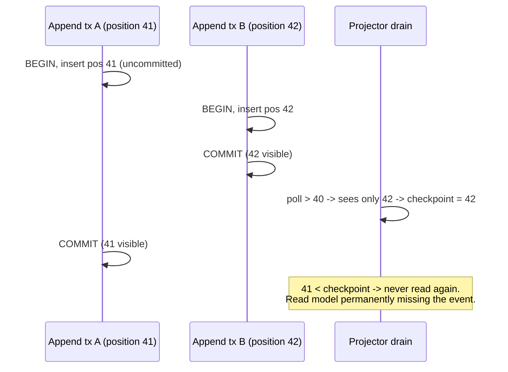
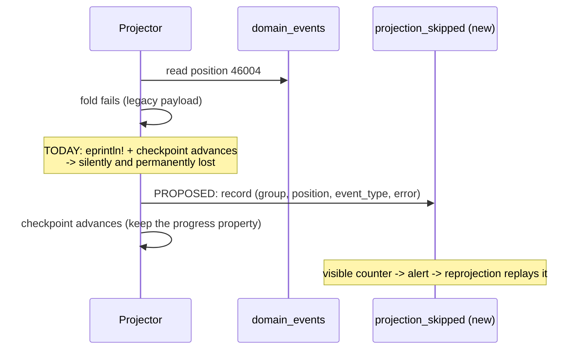
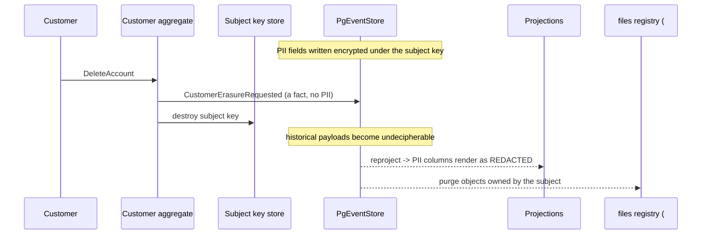

# PROP-20260726-170000 — Event-log integrity, evolution and erasure

- **Status**: Proposed
- **Date**: 2026-07-26
- **Tracking issue**: [#201 "Epic: event-log integrity, evolution and erasure"](https://github.com/TheCaptainCompany/captain-food/issues/201)
- **Realized by**: _(filled at completion)_

---

## 1. Context

Four properties the event log needs and does not have: **events are never silently lost**,
**divergence is detectable and repairable**, **payloads can evolve**, and **personal data can be
erased**.

Verified on `main` at `835da95`:

| Fact | Evidence |
|---|---|
| `position` is `GENERATED ALWAYS AS IDENTITY` — allocated **before** commit | `specs/generated/schema.generated.sql:172` |
| Both drains poll `WHERE position > checkpoint ORDER BY position` with **no visibility guard** | `projection/worker.rs:298-306`; `process_manager/runner.rs:222-261` |
| Checkpoints advance per row | `worker.rs:323` |
| `/projector` lag is computed as `head - head` | `tick()` returns `Ok((head, head))` at `worker.rs:274-283`; consumed at `:242-247` |
| Same defect in the saga runner | `runner.rs:202`, consumed at `:163-167` |
| A failing fold is logged, skipped, **and the checkpoint still advances** | `worker.rs:310-324` |
| No reprojection tooling exists | no `reproject`/rebuild target in `Makefile` or any crate |
| No projection-lag metric or alert | `observability.yaml` has `inbound_drain_lag_ms` only |
| **No event version column, no upcasting, no policy** | `upcast`, `event version`, `schema evolution` = zero matches repo-wide |
| Deserialization is a bare serde round-trip in 3 places | `event_store.rs:121-125`, `worker.rs:342-346`, `runner.rs:278-282` |
| **No erasure mechanism** | `erase`, `forget`, `anonymi`, `DeleteAccount` = zero matches in commands/events |
| `sweep_retention()` deliberately never touches `domain_events` | `sweep_retention.sql:13-18` |
| `$maxAge` and `expired_at` are specified and entirely unimplemented | `eventstore.yaml:26,42` — nothing reads or writes them |

Two spec-vs-code divergences in the same area: `eventstore.yaml:17` says `version` is 0-based while
the store writes 1-based (`event_store.rs:52`), and `id` is documented as an append-time idempotency
key but is a fresh `Uuid::new_v4()` per append (`:69`). Also `ce_events()` filters with
`split_part(stream_name,'-',1) =`, which is not sargable, contradicting the "prefix-scannable" note
at `eventstore.yaml:30`.

**Why these belong together.** The position gap loses events; the fake lag metric hides it; the
absence of reprojection means it cannot be repaired; and any payload change hits the versioning gap.
Erasure joins them because immutability is exactly what makes erasure hard — it is the same
substrate decision.

## 2. Recommended approach

Sequence matters unusually much here.

1. **#190 first** — honest per-group lag + recording of skipped events. Without it, the next fix
   cannot be verified and existing damage cannot be seen.
2. **#189** — close the position gap.
3. Reprojection tooling (part of #190) — repair whatever the gap already lost.
4. **#192** — evolution policy + validator gate, **before** the payload changes queued in
   [#174](https://github.com/TheCaptainCompany/captain-food/issues/174),
   [#175](https://github.com/TheCaptainCompany/captain-food/issues/175),
   [#184](https://github.com/TheCaptainCompany/captain-food/issues/184).
5. **#194** — decide erasure now, build later. The decision is cheap today and gets monotonically
   more expensive with every customer.

## 3. Decisions surfaced

### D1 — How to prevent skipped events (#189)

| Option | Pros | Cons |
|---|---|---|
| **Snapshot / `xmin` guard** — read only positions below the oldest in-flight transaction ✅ **recommended** | Correct by construction, not probabilistic; standard practice; composes with the existing per-group checkpoints | Needs a snapshot column captured on append, plus a migration |
| Lag window — read only up to `head - margin`, or rows older than N ms | Trivial; no schema change | Adds latency to every projection; the margin is a guess; a long transaction still defeats it |
| Gap detection + re-scan — track missing positions and re-poll | Precise; catches late arrivals | More state to manage; still needs a bound on how long to wait before declaring a gap permanent |

This is a correctness bug, not a scale concern — concurrent appends are routine (every mutation
spawns its handler; several workers append in parallel), so it can bite on the second concurrent
order. A probabilistic mitigation is the wrong shape for a correctness bug.

### D2 — Event evolution policy (#192)

| Option | Pros | Cons |
|---|---|---|
| **Additive-only policy + a validator gate, and add `event_version` now** ✅ **recommended** | Matches today's reality; the gate is cheap; adding the column before it is needed avoids a later migration over a large table | Cannot rename or restructure without the upcaster seam (which the column leaves room for) |
| `event_version` + a full upcasting chain immediately | Complete freedom to evolve | Upcasters accumulate forever; premature while the model is still moving fast |
| Versioned event types (`OrderPlacedV2`) | No upcaster machinery; explicit at the call site | Type sprawl; every fold must handle every version |

The failure mode today is worth stating precisely, because it is asymmetric and the worst case is on
the write path: a payload that no longer deserializes becomes `DomainError::Repository`, so **the
aggregate cannot be rehydrated at all and every command on that stream fails**. In projections it is
logged and skipped; in sagas the leg silently never runs. The code comments show this has already
happened in production — the mitigation shipped was panic containment, not evolution support.

### D3 — GDPR erasure strategy (#194)

| Option | Pros | Cons |
|---|---|---|
| **Crypto-shredding** — PII encrypted per subject, erasure destroys the key ✅ **recommended** | Log stays append-only and immutable — the property the whole architecture rests on; erasure is bounded and provable; standard for event-sourced systems | Key management and rotation; historical events become unreadable, so every projector must tolerate redacted payloads |
| Pseudonymisation at write — PII in a mutable side table, events carry a subject ref | Erasure is an ordinary `DELETE`; the log never holds PII at all | Large refactor of existing events; breaks the "events are self-contained facts" property; needs a backfill |
| Targeted rewrite / tombstone of PII fields in place | Conceptually simple | Breaks append-only immutability — the guarantee the event store exists to provide |

Scope beyond the mechanism: an account-deletion command and customer-facing flow; propagation to
projections, the [#134](https://github.com/TheCaptainCompany/captain-food/issues/134) `files`
registry (which already anticipates the hook) and the Supabase identity; and the DPIA, privacy
notice and terms — none of which exist, as
[ADR-20260722-174500:48](../adr/20260722-174500-identity-federation-cross-tenant-personalization.md)
already records.

### D4 — `$maxAge` / `expired_at`

Recommended: **implement or delete**. A specified-but-inert retention mechanism is worse than none —
it reads as a control that exists. Today nothing populates `domain_stream` rows at all, so even the
"ephemeral Cart streams" story in the DSL is not real.

### D5 — Spec-vs-code divergences

Recommended: **correct the spec to match the code** (`version` is 1-based; `id` is not an
idempotency key; `ce_events()` is not prefix-scannable), rather than changing the code to match the
spec. The code's behaviour is the one that has been running.

## 4. Mockups

This proposal is almost entirely infrastructural; the operator-facing surface is the health endpoint
and the repair tool.

### 4.1 `/projector` — honest per-group lag (#190)

Today (always `lag: 0`, whatever is true):

```json
{ "running": true, "checkpoint": 48210, "head": 48210, "lag": 0, "lastError": null }
```

Proposed:

```json
{ "running": true, "head": 48210, "lastTickAt": "2026-07-26T19:04:12Z",
  "groups": [
    { "name": "Order",            "checkpoint": 48210, "lag": 0,    "skipped": 0 },
    { "name": "Catalog",          "checkpoint": 48210, "lag": 0,    "skipped": 0 },
    { "name": "OrderConversation","checkpoint": 46003, "lag": 2207, "skipped": 3,
      "lastError": "position 46004 (MessagePosted): missing field `originalLocale`" }
  ] }
```

The aggregate number hid exactly the case that matters: one group permanently behind.

### 4.2 Reprojection (#190)

```
$ make reproject GROUP=OrderConversation
  building shadow table order_conversation_rebuild ...
  folding 48210 events (3 previously skipped will be retried) ...
  [########################################] 48210/48210   skipped: 0
  atomic swap? [y/N]
```

Shadow-table-then-swap so a rebuild can run against production without a read outage.

### 4.3 Customer account deletion (#194)

```
+--------------------------------------------------+
| Delete my account                                 |
|                                                   |
| Your personal data (name, phone, email, addresses,|
| messages) will be permanently erased.             |
|                                                   |
| Your past orders remain in our records without    |
| your personal details, as required for accounting |
| and tax obligations.                              |
|                                                   |
|          [ Cancel ]   [ Delete my account ]       |
+--------------------------------------------------+
```

The second paragraph is the honest expression of D3 — erasure of personal data, retention of the
financial facts that law requires be kept.

## 5. Sequence diagrams

### 5.1 The position gap (#189)



With the D1 snapshot guard the drain would not have advanced past 41 while tx A was still in flight.

### 5.2 Poison event today vs proposed (#190)



### 5.3 Crypto-shredded erasure (#194, D3)



The financial facts (amounts, dates, order ids) stay readable because they were never under the
subject key — which is what makes "erase the person, keep the accounting" expressible at all.

## 6. Alternatives considered for the cluster

| Approach | Pros | Cons |
|---|---|---|
| **Observability → correctness → repair → evolution → erasure** ✅ **recommended** | Each step makes the next verifiable; the cheap steps come first | Erasure decision waits — acceptable only if it is genuinely taken before launch |
| Fix #189 first (it is "the real bug") | Addresses the correctness defect immediately | Unverifiable, and leaves prior damage invisible and unrepairable |
| Defer all of it until after the Tours pilot | Focus on product | Every day of orders adds subjects to erase and events to reproject; the log only grows |

## 7. Verification plan

- **#190** — a deliberately-stalled group reports non-zero lag (test); a skipped event increments a
  visible counter and is recoverable by reprojection; an observability contract + alert threshold for
  projection lag.
- **#189** — a test interleaving two appends with a delayed commit proves no event is skipped; **it
  must fail on `main` today**. Both the projector and the saga runner adopt the guard — fixing one
  leaves the worse half broken.
- **#192** — a breaking change to an event payload **fails `make validate`** with a clear message
  rather than failing at runtime; an ADR records the policy; a legacy payload still folds after an
  additive change.
- **#194** — an erasure request removes or renders unreadable the subject's PII across log,
  projections, files and identity provider; rule *an erased subject's personal data is not readable
  through any query or projection*; `$maxAge`/`expired_at` implemented or removed; DPIA, privacy
  notice and terms committed.

## 8. Open questions for the product owner

1. **D1** — snapshot/`xmin` guard? (recommended: yes)
2. **D2** — additive-only policy + gate, and add `event_version` now? (recommended: yes)
3. **D3** — crypto-shredding for erasure? (recommended: yes) — and **when** is the decision needed,
   given it gets more expensive with every customer?
4. **D4** — implement or delete `$maxAge`/`expired_at`?
5. **D5** — correct the spec to match the code on `version`/`id`/`ce_events()`?
6. Who owns the **DPIA, privacy notice and terms**? None exist, and they are launch prerequisites.

## 9. Refs

`specs/generated/schema.generated.sql:172,185-189` · `specs/database/tables/eventstore.yaml:15,17,26,30,36-43` ·
`crates/infrastructure/src/persistence/event_store.rs:37-100,121-125` ·
`crates/infrastructure/src/projection/worker.rs:242-247,274-283,298-324,342-352` ·
`crates/infrastructure/src/process_manager/runner.rs:163-167,176-177,202,222-261,278-282` ·
`specs/database/functions/sweep_retention.sql:13-18` · ADR-20260721-025159 · ADR-20260722-174500 ·
[#189](https://github.com/TheCaptainCompany/captain-food/issues/189) ·
[#190](https://github.com/TheCaptainCompany/captain-food/issues/190) ·
[#192](https://github.com/TheCaptainCompany/captain-food/issues/192) ·
[#194](https://github.com/TheCaptainCompany/captain-food/issues/194) ·
[#18](https://github.com/TheCaptainCompany/captain-food/issues/18) ·
[#134](https://github.com/TheCaptainCompany/captain-food/issues/134)
