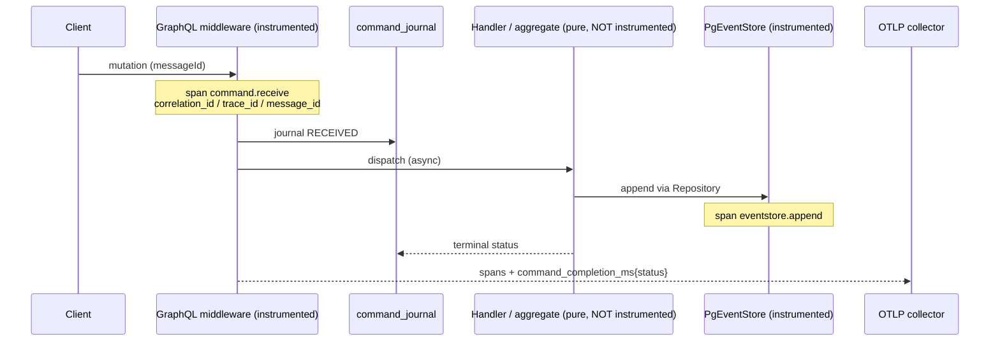
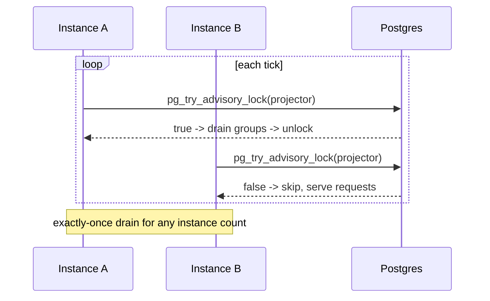
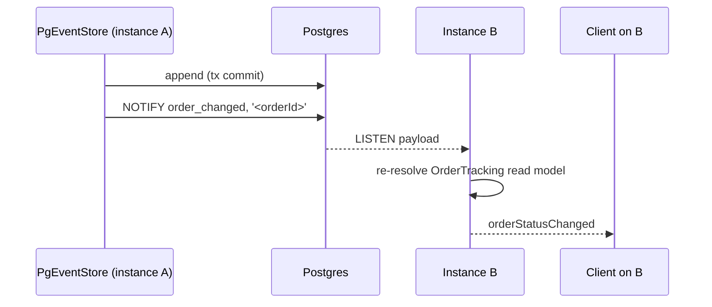

# PROP-20260726-170500 — Runtime observability and scale readiness

- **Status**: Partially realized — D1 and D2 answered; D3, D4 and D5 still open
- **Date**: 2026-07-26
- **Tracking issue**: [#202 "Epic: runtime observability and scale readiness"](https://github.com/TheCaptainCompany/captain-food/issues/202)
- **Realized by**: [#191 "Observability contracts are 100% unimplemented"](https://github.com/TheCaptainCompany/captain-food/issues/191) → [ADR-20260729-183000](../adr/ADR-20260729-183000-telemetry-is-honeycomb-eu-and-degrades-never-gates.md). **D1** answered as recommended (hosted OTLP, EU-pinned) with the vendor settled: **Honeycomb `eu1`**. **D2** answered but **narrowed against the recommendation** — parent-based *head* sampling at `1.0`, not tail-based, because tail sampling needs Refinery (a service to run and pay for) and D2's own reasoning says the volume is not there yet. [#179](https://github.com/TheCaptainCompany/captain-food/issues/179) (GraphQL hardening) and [#193](https://github.com/TheCaptainCompany/captain-food/issues/193) (advisory locks + the missing index) are untouched, so **D3/D4/D5 remain open**.

---

## 1. Context

The platform runs as **one free-tier instance, with no telemetry, no request limits, and no safe way
to add a second instance**.

Verified on `main` at `835da95`:

| Fact | Evidence |
|---|---|
| **No telemetry dependency at all** | `Cargo.toml` workspace deps: no `opentelemetry`, no `tracing` |
| No subscriber/telemetry initialisation anywhere | `crates/` |
| Logging is 69 `println!`/`eprintln!` calls | `crates/server`, `crates/infrastructure` |
| `specs/observability.yaml` is 755 lines of contracts | 7 workflows, each with mandatory `correlation_id` + `trace_id` |
| No depth, complexity or introspection limits | `graphql/schema.rs:92-125` — `Schema::build(...).finish()` |
| One middleware on the whole router | `lib.rs:667` — `response_timing` only |
| No body limit, timeout, CORS layer or rate limiter | `lib.rs:575-661`; `RateLimited` error has no producer |
| GraphiQL served in production | `graphql/routes.rs:192-202` |
| Voyager served in production, CDN bundle, no CSP | `graphql/routes.rs:257-280` (acknowledged at `:268`) |
| **No leader election on any worker** | `pg_advisory` = zero hits; per-row checkpoint upserts |
| Subscriptions are in-process | generated `subscription.rs` header states the caveat |
| Fold views cannot use the only candidate index | `ORDER BY position DESC LIMIT 1` vs an index on `(stream_name, **version**)` |
| The instance has been OOM-killed four times by ordinary traffic | [#105](https://github.com/TheCaptainCompany/captain-food/issues/105), [#106](https://github.com/TheCaptainCompany/captain-food/issues/106), [#107](https://github.com/TheCaptainCompany/captain-food/issues/107), [#123](https://github.com/TheCaptainCompany/captain-food/issues/123) |

**These compound precisely.** An unbounded nested GraphQL query OOM-kills a 512Mi box that legitimate
traffic has already killed four times; there is no trace to explain it; and the obvious fix — run two
instances — is currently unsafe, because two projectors and two saga runners would race on the same
checkpoints, with the saga runner's non-idempotent legs double-calling Stripe.

[#16](https://github.com/TheCaptainCompany/captain-food/issues/16) closed as completed and was honest
about the boundary: *"Runtime emission itself remains contract-only until the OpenTelemetry layer
exists."* That layer was never filed as work. This proposal files it.

It is worth naming the systemic cause the review identified: **the operating model rewards work that
is spec-able.** Aggregates, events, rules and tests all fit the DSL and are excellent. Telemetry
wiring, middleware configuration and hosting posture do not fit it, and are correspondingly the
weakest areas. That is a property of the machine, not a lapse of attention, and it needs deliberate
compensation.

## 2. Recommended approach

1. **#179 hardening first** — smallest diff, largest immediate risk reduction, no decisions blocked.
2. **#193 advisory locks + the missing index** — cheap, and unblocks running more than one instance.
3. **#191 OpenTelemetry** — the largest piece; the one that makes everything else diagnosable.

## 3. Decisions surfaced

### D1 — Telemetry backend

| Option | Pros | Cons |
|---|---|---|
| **OTLP to a hosted free/low tier** (Grafana Cloud, Honeycomb, Axiom) ✅ **recommended** | No infrastructure to run; generous free tiers at V0 volume; standard OTLP so it is swappable | Per-GB cost as volume grows; data leaves the EU unless the region is chosen deliberately |
| Self-hosted collector + storage | Full control; EU residency by construction | Another service to run and pay for — contrary to ADR-0042's "minimal ops pre-PMF" |
| Structured JSON logs only, no traces | Cheapest; a large improvement over `println!` | No spans means no causality across the acceptance-first async boundary — exactly where the hard bugs live |

**EU residency is a real constraint**, not a preference: ADR-0042 chose Frankfurt for both compute and
data specifically for GDPR. Whichever vendor is chosen must be pinned to an EU region, and traces
carrying `customerId`/`orderId` must be treated as personal data.

### D2 — Sampling

Recommended: **tail-based sampling — keep 100% of errors and rejections, sample successes**. Volume
at V0 is low enough that head-sampling would mostly discard the interesting traces; the money paths
(`place-order`, `refund`) should be kept in full regardless of cost.

### D3 — Where the workers run

| Option | Pros | Cons |
|---|---|---|
| **Advisory lock now, in-process; separate service later** ✅ **recommended** | Unblocks horizontal scaling for the cost of a lock helper; no hosting spend; matches ADR-0043's stated intent | Workers still compete with request handling for the same 512Mi |
| Dedicated worker service now | Clean separation; independent scaling and memory | Render Background Workers are paid — a real cost decision pre-PMF |
| Stay single-instance, no lock | Zero work | Cannot scale for peak service; a redeploy drops every live subscription |

### D4 — GraphiQL and Voyager in production

| Option | Pros | Cons |
|---|---|---|
| **Keep, gated to ADMIN** ✅ **recommended** | Retains the exploration value the team actually uses; removes the anonymous surface | Small amount of gating work |
| Remove from production entirely | Smallest surface | Loses a genuinely useful tool; they are the fastest way to inspect the deployed schema |
| Leave as-is | No work | Anonymous tooling pages plus a third-party CDN bundle with no CSP |

Per-role introspection filtering already works and is tested — the question is only whether the
*tooling pages* belong on a production origin, unauthenticated.

### D5 — Subscription fan-out once there is more than one instance

Recommended: **Postgres `LISTEN`/`NOTIFY`**. The database is already the single shared dependency, it
requires no new infrastructure, and the payload can stay a thin "re-resolve this id" nudge rather
than the event itself — which preserves the existing design where subscriptions re-read the read
models rather than exposing raw `domain_events`.

## 4. Mockups

### 4.1 An order's trace, once #191 lands

What a Friday-night investigation should look like:

```
trace 7f3a...  correlation_id 9c21...  duration 4.21s   [ERROR]
+- command.receive          placeOrder        12ms   actor=CUSTOMER channel=GRAPHQL
+- command.journal          RECEIVED           8ms   messageId=01J...
+- command.dispatch                          4.19s
   +- repository.load       Restaurant        21ms   events=14
   +- repository.load       Cart              18ms   events=6
   +- catalog.reprice                         44ms   lines=3
   +- payment.create_intent                  3.9s !  stripe.status=timeout
   +- command.complete      FAILED            11ms   code=Internal
```

Today this investigation consists of grepping unstructured `eprintln!` output with no correlation id.

### 4.2 A rejected over-complex query (#179)

```
{ "errors": [ { "message": "Query is too complex: 1840 > 500",
                "extensions": { "code": "RateLimited" } } ] }
```

### 4.3 Two instances, one drain (#193)

```
instance-a  projector: lock acquired  -> drained 41 events (Order, Catalog, ...)
instance-b  projector: lock held elsewhere -> skipped tick
instance-b  http: serving requests
```

## 5. Sequence diagrams

### 5.1 Instrumentation at the boundaries only



The playbook rule holds by construction: `domain` and the pure handlers never see the telemetry SDK;
`c4-l3.yaml`'s `instrumented` flags are the authority on which components carry it.

### 5.2 Advisory-lock leader election (#193)



### 5.3 Subscriptions across instances (D5)



## 6. Alternatives considered for the cluster

| Approach | Pros | Cons |
|---|---|---|
| **Harden → lock → instrument** ✅ **recommended** | Risk falls fastest per hour spent; nothing blocks on a vendor decision | Full observability arrives last, so an incident before then is still hard to diagnose |
| Instrument first | Diagnoses everything else | Largest piece; leaves the trivially-reachable DoS open for weeks |
| Do nothing until after the pilot | Focus on product | The pilot is exactly when the first real load arrives, and there would be nothing to learn from it |

The third option is self-defeating in a specific way worth stating: the V0 goal is to *validate*
product–market fit in Tours, and a pilot with no telemetry produces anecdotes rather than data.
[#19](https://github.com/TheCaptainCompany/captain-food/issues/19) already depends on metrics that do
not exist and is currently flying on daily smoke-test timings.

## 7. Verification plan

- **#179** — a query exceeding the depth/complexity budget is rejected with a typed error (test);
  oversized bodies and slow requests are bounded; rejected-by-limit counters as an operator signal.
- **#193** — two concurrently-running instances drain each checkpoint exactly once (test);
  `EXPLAIN` on the heaviest fold view uses the new `(stream_name, position)` index instead of scanning
  the stream; an ADR records the scaling posture and what, if anything, still forbids a second instance.
- **#191** — every span, attribute and metric named in `observability.yaml` is actually emitted for at
  least `command-acceptance` and `place-order`; the observability-agent can run a real trace against a
  contract and report conformance; no business/domain crate depends on the telemetry SDK, enforced by
  a dependency test.

## 8. Open questions for the product owner

1. **D1** — hosted OTLP backend, pinned to an EU region? Which vendor, and what monthly ceiling?
2. **D2** — tail-based sampling, 100% of errors and money paths? (recommended: yes)
3. **D3** — advisory locks now, dedicated worker service later? (recommended: yes)
4. **D4** — gate GraphiQL/Voyager to ADMIN? (recommended: yes)
5. **D5** — `LISTEN`/`NOTIFY` for subscriptions? (recommended: yes, when a second instance lands)
6. Is there a **peak-load target** for the Tours pilot (orders per hour at Friday peak)? It decides
   whether a second instance is needed at all.

## 9. Refs

`specs/observability.yaml` · `docs/claude/observability.md` · `specs/architecture/c4-l3.yaml` ·
`crates/server/src/graphql/schema.rs:92-125` · `crates/server/src/lib.rs:575-661,667` ·
`crates/server/src/graphql/routes.rs:192-202,257-280` ·
`crates/infrastructure/src/projection/worker.rs` · `crates/infrastructure/src/process_manager/runner.rs` ·
`specs/generated/views.generated.sql:25-157` · ADR-0042 · ADR-0043 ·
[#179](https://github.com/TheCaptainCompany/captain-food/issues/179) ·
[#191](https://github.com/TheCaptainCompany/captain-food/issues/191) ·
[#193](https://github.com/TheCaptainCompany/captain-food/issues/193) ·
[#16](https://github.com/TheCaptainCompany/captain-food/issues/16) ·
[#19](https://github.com/TheCaptainCompany/captain-food/issues/19)
