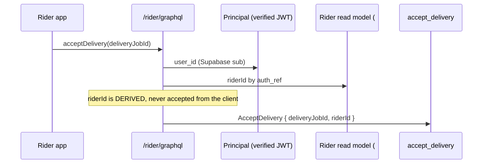

# PROP-20260726-171500 — Write-side per-instance authorization

- **Status**: Proposed
- **Date**: 2026-07-26
- **Tracking issue**: [#205 "Write-side per-instance authorization — extend ScopeMembership to commands (tracking issue for the proposal)"](https://github.com/TheCaptainCompany/captain-food/issues/205)
- **Work issue**: [#178 "Write-side per-instance authorization: nothing binds the caller to the restaurantId/riderId in a command payload"](https://github.com/TheCaptainCompany/captain-food/issues/178)
- **Extends**: [PROP-20260725-185140 "Read-side per-instance authorization"](PROP-20260725-185140-read-side-per-instance-authorization.md) / [#144](https://github.com/TheCaptainCompany/captain-food/issues/144)
- **Realized by**: _(filled at completion)_

---

## 1. Context

[PROP-20260725-185140](PROP-20260725-185140-read-side-per-instance-authorization.md) designs the read
half of per-instance authorization — the `ScopeMembership` projection, projector `grants`/`revokes`
rules, `ReadScope` on the read ports, and the identity bridges — and states its rule as *"a read never
returns a row outside the caller's scope."*

**The write half was never designed.** The exposure there is strictly worse: a read leaks data, a
write changes someone else's.

Verified on `main` at `835da95`:

| Fact | Evidence |
|---|---|
| `Principal` carries only `user_id` and `role` | `crates/server/src/auth.rs:45-48` |
| `restaurantId` is an ordinary command property on every staff command | `AcceptOrder`, `RejectOrder`, `StartPreparation`, `MarkOrderReady`, `ChangeOrderAcceptanceMode`, all catalog commands |
| Nothing compares it to the caller | `grep` over `mutation.rs` finds only `operation_owned` (a *read* helper) and `request_envelope` (stamps the actor into the journal envelope only) |
| `AcceptDelivery` trusts a client-supplied `riderId` | `crates/application/src/commands.rs` — `accept_delivery` never checks `cmd.rider_id` against the actor |
| `confirm_pickup` checks only against the earlier accept | `commands.rs:1191` — validates against a value that may itself have been forged |
| Host resolves the storefront and never reaches GraphQL | `crates/server/src/hosts.rs`; no `host` reference under `crates/server/src/graphql/**` |

So today, with a valid `RESTAURANT` token, a partner can accept, reject or cancel **another
restaurant's** orders and edit its catalog; and with a `RIDER` token, a courier can claim a job as any
rider.

The role gate itself is sound — the Supabase JWT is genuinely verified (signature via JWKS, expiry,
audience, algorithm-confusion closed) and the role-to-path check is strict equality. This is a missing
second gate, not a broken first one.

## 2. Recommended approach

**Reuse [#144](https://github.com/TheCaptainCompany/captain-food/issues/144)'s index. Do not build a
second mechanism.** Concretely:

1. **`WriteScope` on command dispatch.** A command that declares a scoped id has it resolved against
   `ScopeMembership` for the acting principal **before the handler runs** and **before journaling**,
   rejecting with the existing `Forbidden`.
2. **Derive rather than accept, wherever possible.** The strongest form of this fix is not validating
   `riderId` — it is removing it from the client's reach so there is nothing to forge. Once
   `Principal` carries the verified claims (#144 scope item 4), the same applies to `restaurantId` on
   single-location staff commands.
3. **A validator gate**, mirroring the read-side one: every `api.yaml` mutation carrying a
   tenant-scoped id declares a `scope:` or an explicit, *declared* exemption.

## 3. Decisions surfaced

### D1 — Where the write check runs

| Option | Pros | Cons |
|---|---|---|
| **In the dispatch layer, before journaling** ✅ **recommended** | A forbidden command never enters `command_journal`, so the journal stays a record of legitimate intent; one place to audit; consistent with acceptance-first | The check needs the command's scoped id parsed before dispatch |
| In each handler | Closest to the invariant; handlers already load the aggregate | 82 mutations to touch and keep correct forever; an omission is invisible; the pure-handler layer would gain an authorization concern it should not own |
| As an async-graphql `Guard` per mutation | Declarative; mirrors the existing role guard | Runs before input coercion in some paths; awkward to reach into the input for the scoped id |

Note the interaction with the journal: rejecting **before** journaling means a forbidden attempt
leaves no `command_journal` row. That is the right default (the journal is an idempotency and
operation-status record, not a security log) — but the attempt must still be **observable**, which is
what the denial metric in §7 is for.

### D2 — Validate the supplied id, or derive it from the principal?

| Option | Pros | Cons |
|---|---|---|
| **Derive where the role implies a single scope; validate otherwise** ✅ **recommended** | A field the client cannot set cannot be forged; smaller attack surface; simpler clients | `RESTAURANT_ACCOUNT` legitimately spans several locations, so it must still pass and be validated |
| Validate everything, keep the payloads unchanged | No API change; no client change | Every new command is a new chance to forget; the field keeps *looking* like caller input |
| Derive everything | Smallest surface | Cannot express multi-location accounts or admin acting-on-behalf |

`RIDER` is the clearest case for derivation: a rider is always exactly one rider, so `riderId` should
come from the verified principal and leave the command payload entirely.

### D3 — Sequencing against #144

| Option | Pros | Cons |
|---|---|---|
| **Immediately after #144 lands** ✅ **recommended** | Index, projector rules and `Principal` claims are already paid for; the marginal cost is small | The write exposure stays open while #144 is built |
| In parallel with #144 | Closes both sooner | Two sessions on the same design surface; merge conflict risk on the ACL DSL |
| Before #144 | Closes the worse exposure first | Would have to build `ScopeMembership` itself — i.e. do #144 under another name |

### D4 — What about ADMIN acting on behalf of a tenant?

Not currently modelled. Recommended: **allow `ADMIN` to bypass scope, and make the bypass explicit and
logged** rather than implicit. ADR-0037's impersonation-only stance is the nearest prior decision and
should be revisited in the same change.

## 4. Mockups

The user-visible surface is a refusal and an operator signal.

### 4.1 A cross-tenant write, refused

```
POST /restaurant/graphql          token: restaurant B staff
{ acceptOrder(input: { orderId: "<A's order>", restaurantId: "<A>" }) }

{ "errors": [ { "message": "Forbidden",
                "extensions": { "code": "Forbidden" } } ] }
```

No `command_journal` row, no handler invocation, no aggregate load (D1).

### 4.2 Rider commands after derivation (D2)

```
BEFORE   acceptDelivery(input: { deliveryJobId, riderId })   <- forgeable
AFTER    acceptDelivery(input: { deliveryJobId })            <- rider derived from the verified principal
```

### 4.3 Operator signal

```
+--------------------------------------------------+
| Authorization denials (last 24h)                  |
|   read  (#144)   12   -> 3 principals              |
|   write (#178)    0                                |
|                                                    |
|   !! spike alert: >20 denials / 5 min from one     |
|      principal = enumeration, not user error       |
+--------------------------------------------------+
```

## 5. Sequence diagrams

### 5.1 Recommended — check before journaling (D1)

```mermaid
sequenceDiagram
    participant C as Staff client
    participant G as GraphQL BFF
    participant SM as ScopeMembership (#144)
    participant J as command_journal
    participant H as Handler (pure)
    participant R as Repository
    participant ES as PgEventStore

    C->>G: acceptOrder(orderId, restaurantId)
    Note over G: role gate (ADR-0047) passes: caller IS a RESTAURANT
    G->>SM: EXISTS(principal, RESTAURANT, restaurantId)?
    alt not a member
        G-->>C: Forbidden
        Note over G: no journal row; denial counter++
    else member
        G->>J: journal RECEIVED
        G->>H: dispatch (async)
        H->>R: decide + save
        R->>ES: append
    end
```

### 5.2 Rider derivation (D2)



This also fixes the accidental behaviour noted in #144's scope: `myDeliveries` currently parses the
Supabase `sub` and uses it *directly* as a `RiderId`, which fails closed by coincidence rather than by
design.

## 6. Alternatives considered

| Approach | Pros | Cons |
|---|---|---|
| **`WriteScope` over the #144 index** ✅ **recommended** | One mechanism, one mental model, one place to audit; most of the cost already paid by #144 | Inherits #144's cache semantics — a stale grant is a silent breach, so `revokes` remain the safety-critical rules |
| Postgres RLS | Enforced at the storage layer; cannot be bypassed by application code | Explicitly rejected in PROP-20260725-185140 (alternative (c)); the app uses one DB role with full access and no per-request role switching |
| Tenant from the `Host` header | Free; already resolved for page routing | **Wrong by construction** — PROP-20260725-185140 argues this correctly: Host is tenant *routing*, never authorization. A staff client can send any Host |
| Per-handler checks | Local and explicit | 82 places to get right forever; pushes authorization into the pure layer |

The Host option is listed because it is the tempting shortcut and it must stay refused in writing.

## 7. Verification plan

- Rule in `rules.yaml`: *a write never affects a resource outside the caller's scope.*
- Behaviour tests, **negatives first** — each must fail on `main` today:
  - restaurant A accepting / rejecting / cancelling restaurant B's order;
  - restaurant A editing restaurant B's catalog;
  - a rider accepting a job as another rider;
  - the reassignment pair — after a rider is replaced, the new rider is allowed **and the previous one
    is denied** (asserting only the first half passes against a broken rule).
- `riderId` removed from the client-facing input; `restaurantId` derived where the role implies one.
- Validator gate: every mutation with a tenant-scoped id declares `scope:` or a declared exemption.
- Observability: write-path authorization-denial rate, separate from the read-path signal.

## 8. Open questions for the product owner

1. **D1** — reject before journaling? (recommended: yes)
2. **D2** — derive `riderId` from the principal and drop it from the payload? (recommended: yes)
3. **D3** — sequence immediately after [#144](https://github.com/TheCaptainCompany/captain-food/issues/144)? (recommended: yes)
4. **D4** — explicit, logged `ADMIN` scope bypass, revisiting ADR-0037's impersonation stance?

## 9. Refs

`crates/server/src/auth.rs:45-48` · `crates/application/src/commands.rs` (`accept_delivery`, `accept_order`) ·
`crates/server/src/graphql/generated/mutation.rs:3716` · `crates/server/src/hosts.rs` ·
[PROP-20260725-185140](PROP-20260725-185140-read-side-per-instance-authorization.md) ·
[#178](https://github.com/TheCaptainCompany/captain-food/issues/178) ·
[#144](https://github.com/TheCaptainCompany/captain-food/issues/144) ·
[#187](https://github.com/TheCaptainCompany/captain-food/issues/187) · ADR-0047 · ADR-0006 · ADR-0037
