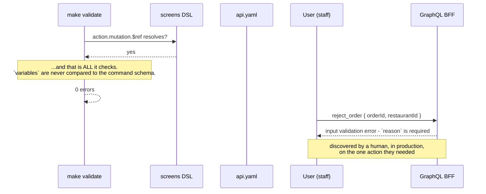
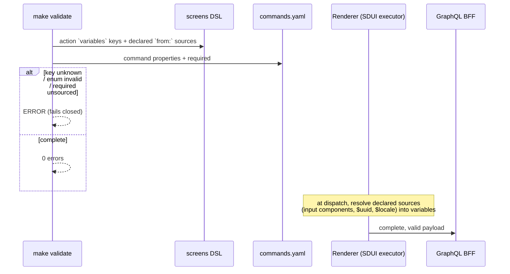

# PROP-20260726-172000 — Spec-to-UI contract integrity

- **Status**: Proposed
- **Date**: 2026-07-26
- **Tracking issue**: [#203 "Epic: spec-to-UI contract integrity — close the write-side gate hole and the source-of-truth drift"](https://github.com/TheCaptainCompany/captain-food/issues/203)
- **Realized by**: _(filled at completion)_

---

## 1. Context

The operating model's central claim is that the DSL is the source of truth and `make validate` is the
executable gate that proves it. For the UI↔API contract the claim is *"the validator proves the API
answers the UI"*.

**On the read side that is true.** [#82](https://github.com/TheCaptainCompany/captain-food/issues/82)
tightened it after a pinned resolver arg typo (`listKey` for `list`) shipped undetected, adding
`resolver-unknown-arg` and `resolver-invalid-arg-value`.

**On the write side nothing is checked at all.** A screen `action` binds a mutation by `$ref` and
dispatches a `variables:` map, and no rule verifies that map against the command schema — not the key
names, not the enum values, not the `required` list.

The validator states the read-side exemption explicitly (`tools/codegen-rs/src/main.rs:897-901`):

> *"NOT checked: that every REQUIRED arg is pinned. A pin is a static DEFAULT — the remaining args are
> supplied by the caller at runtime (`crates/web/src/graphql.rs#execute_resolver` merges caller
> variables OVER the pins), so an unpinned required arg is normal, not an error."*

That reasoning is **correct for a resolver pin and does not transfer to an action dispatch**: an
action's `variables` map *is* the whole payload, merged with nothing. The exemption was inherited by a
case it was never argued for.

The consequence is live on `main` at `835da95` — four staff actions in
`specs/screens/restaurant_backoffice.yaml` can never succeed:

| Action | Dispatches | Command requires |
|---|---|---|
| `reject_order` (`:123`) | `{orderId, restaurantId}` | `[orderId, restaurantId, **reason**]` |
| `cancel_order_by_restaurant` (`:127`) | `{orderId, restaurantId}` | `[orderId, restaurantId, **reason**]` |
| `approve_refund` (`:172`) | `{**refundId**}` | `[orderId, amount]` |
| `deny_refund` (`:173`) | `{**refundId**}` | `[orderId, reason]` |

`refundId` is not a parameter of either refund command — and `RefundId` is a Stripe `re_...` provider
string, not a domain key those commands accept. So the refund queue is decorative and a restaurant has
no in-product way to refuse an order, while `make validate` reports **0 errors**.

Grouped into the same proposal: three places where a spec currently states something false
([#195](https://github.com/TheCaptainCompany/captain-food/issues/195)) — the product spec still
mandates Next.js/TypeScript/Tailwind (superseded by ADR-0034), `commands.yaml` says a rejected order's
payment *"is refunded"* while the process manager and `rules.yaml#/RefundRequiresApproval` gate it
behind human approval, and `CLAUDE.md` still says `crates/` does not exist. Same failure class: a
reader — human or agent — trusting a source of truth that does not match reality.

## 2. Recommended approach

1. **Two cheap validator rules immediately** — `action-unknown-variable` and
   `action-invalid-variable-value`. No DSL change, no design decision, fails closed on landing.
2. **The required-field rule with an input-source affordance** — needs D1 below.
3. **Fix the four actions** in the same change as (1)/(2), or immediately before, so `main` never goes
   red.
4. **Correct the three drifted specs.**

## 3. Decisions surfaced

### D1 — How a screen declares that a variable comes from a runtime input

The required-field check cannot simply demand every `required` key be pinned — some are legitimately
collected from the user at dispatch time (a rejection reason, a refund amount). The validator needs to
tell "collected at runtime" from "forgotten".

| Option | Pros | Cons |
|---|---|---|
| **Name the input source explicitly** — `variables: { reason: { from: reject_reason_input } }` ✅ **recommended** | The validator can resolve the reference against the screen's own components, so a typo fails; "where does this value come from" becomes answerable by reading the spec instead of the renderer | A DSL addition → plan mode; existing actions need migrating |
| A boolean escape hatch — `runtime: [reason]` | Trivial; no resolution needed | Un-checkable; degenerates into a suppression list nobody revisits |
| Infer from the components on the screen | No DSL change | Fragile and implicit — exactly the kind of magic that produced this bug |
| Require every `required` key to be pinned | Simplest rule | Wrong: it would reject legitimately user-supplied values, and pins are static |

The explicit form has a second benefit worth naming: it makes the **synthesized tokens** already in
use (`{{ $uuid }}`, `{{ $locale }}` from
[#147](https://github.com/TheCaptainCompany/captain-food/issues/147)) declarable in the same
vocabulary, rather than being renderer-only knowledge.

### D2 — Rejection reasons: free text or a controlled enum?

| Option | Pros | Cons |
|---|---|---|
| **Controlled enum + optional free-text note** ✅ **recommended** | Rejection reasons are the analytics that tell you which restaurants to coach and which items to delist; translatable; `errors.yaml#/RejectionReasonRequired` already exists | A new scalar; needs a considered value list |
| Free text only (as specified today) | No model change | Unanalysable; untranslatable; every restaurant invents its own vocabulary |

### D3 — The drifted product spec

| Option | Pros | Cons |
|---|---|---|
| **Rewrite §4–§5 to match ADR-0034** ✅ **recommended** | It is still the canonical V0 product statement and is cited from `CLAUDE.md` | Someone must do the rewrite carefully |
| Mark it historical, point elsewhere | Cheapest; honest | Leaves the product with no current product spec |
| Delete it | No stale content | Loses the flows, NFRs and gating rules that are still correct |

### D4 — When to fix the four actions relative to the rule

Recommended: **same PR**. A validator rule that lands red on `main` violates the "keep main green"
directive, and splitting them invites the fix to be deferred behind the rule's DSL work.

## 4. Screen mockups

### 4.1 Reject with a reason (#168, D2)

```
+--------------------------------------------------+
| Reject order #A1B2                                |
+--------------------------------------------------+
|  Why?                                             |
|   ( ) Out of stock                                |
|   (o) Too busy right now                          |
|   ( ) Closing soon                                |
|   ( ) Address outside our area                    |
|   ( ) Other                                       |
|                                                   |
|  Note to customer (optional)                      |
|  [                                             ]  |
+--------------------------------------------------+
|  The customer is refunded automatically.          |
|            [ Cancel ]   [ Reject order ]          |
+--------------------------------------------------+
```

The footer line is only truthful once
[#175](https://github.com/TheCaptainCompany/captain-food/issues/175) (capture-on-acceptance) or the
auto-approval carve-out lands — until then the copy must say what actually happens. Worth stating,
because writing aspirational UI copy is how #195's drift happened in the first place.

### 4.2 Resolve a refund (#168)

```
+--------------------------------------------------+
| Refund request - order #9F3C                      |
| Captured 23.50 EUR  ·  requested by the customer  |
+--------------------------------------------------+
|  Amount to refund                                 |
|   (o) Full            23.50 EUR                   |
|   ( ) Partial         [  4.50 ] EUR               |
|                                                   |
|  Reason (required to deny)                        |
|  [                                             ]  |
+--------------------------------------------------+
|          [ Deny ]            [ Approve refund ]   |
+--------------------------------------------------+
```

Both buttons now dispatch `orderId` — the key the commands actually take.

### 4.3 What the new rules report

```
$ make validate
specs/screens/restaurant_backoffice.yaml:123  action-missing-required-variable
    reject_order -> commands.yaml#/RejectOrder requires `reason`, not dispatched
    and no input source declared
specs/screens/restaurant_backoffice.yaml:172  action-unknown-variable
    approve_refund -> `refundId` is not a property of commands.yaml#/ApproveRefund
    (did you mean `orderId`?)
3 errors
```

## 5. Sequence diagrams

### 5.1 Where the contract breaks today



### 5.2 With the rule and the input-source affordance (D1)



## 6. Alternatives considered for the cluster

| Approach | Pros | Cons |
|---|---|---|
| **Two cheap rules now, required-field rule with the DSL affordance next, fixes in the same PRs** ✅ **recommended** | Immediate partial coverage; the expensive part is not blocked by the cheap part | Two changes rather than one |
| One change: DSL affordance + all three rules + the four fixes | Single coherent landing | Plan-mode approval for the DSL blocks the two rules that need no approval at all |
| Fix the four actions, skip the rules | Fastest visible fix | Guarantees a recurrence — and the recurrence would again be invisible |

The third is the one to argue against explicitly: this repo's own rule is that *"every recurring
agent/loop failure becomes a new rule, test, or ADR"*. A one-off fix here would violate the operating
model that found the bug.

## 7. Verification plan

- The three new issues are reported against today's `restaurant_backoffice.yaml`, and 0 after the fix.
- A codegen test pins each rule — the same protection pattern as
  `makefile_recipe_lines_are_ascii`, so the hole cannot silently return.
- All four actions dispatch payloads satisfying their command's `required` list; the refund queue and
  the reject path are exercised end to end.
- `#195`: no spec file describes a stack or a behaviour the system does not have; `make validate`
  0 errors and `check-drift` clean after regeneration (the `commands.yaml` edit regenerates the docs).

## 8. Open questions for the product owner

1. **D1** — explicit `from:` input-source declaration on action variables? (recommended: yes; it is a
   DSL change, so plan mode)
2. **D2** — controlled rejection-reason enum plus an optional note? (recommended: yes)
3. **D3** — rewrite the product spec, or mark it historical? (recommended: rewrite)
4. **D4** — rule and fixes in the same PR? (recommended: yes)

## 9. Refs

`tools/codegen-rs/src/main.rs:888-915` · `specs/screens/restaurant_backoffice.yaml:118-132,165-176` ·
`specs/commands.yaml:976,1027,1041,1376,1390` · `specs/errors.yaml#/RejectionReasonRequired`,
`#/PartialRefundAmountRequired` · `specs/PRODUCT_SPEC_WEB_CLIENT.md` §4–§5 · `CLAUDE.md` "Project status" ·
ADR-0034 ·
[#168](https://github.com/TheCaptainCompany/captain-food/issues/168) ·
[#169](https://github.com/TheCaptainCompany/captain-food/issues/169) ·
[#195](https://github.com/TheCaptainCompany/captain-food/issues/195) ·
[#82](https://github.com/TheCaptainCompany/captain-food/issues/82) ·
[#147](https://github.com/TheCaptainCompany/captain-food/issues/147)
