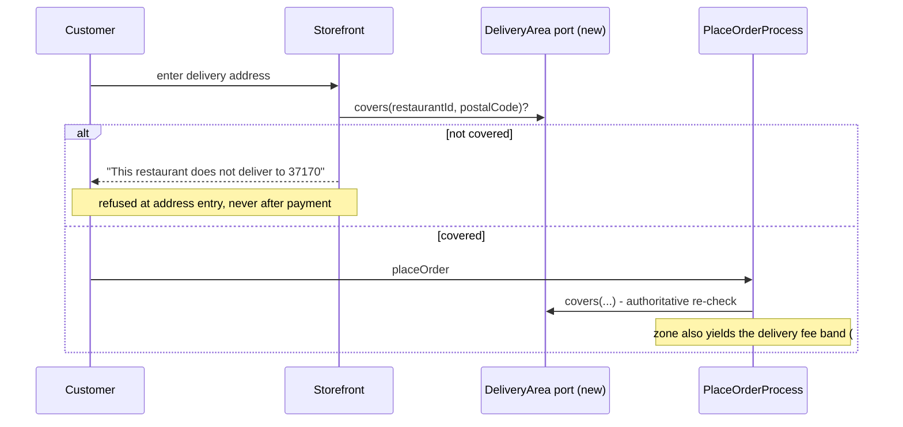
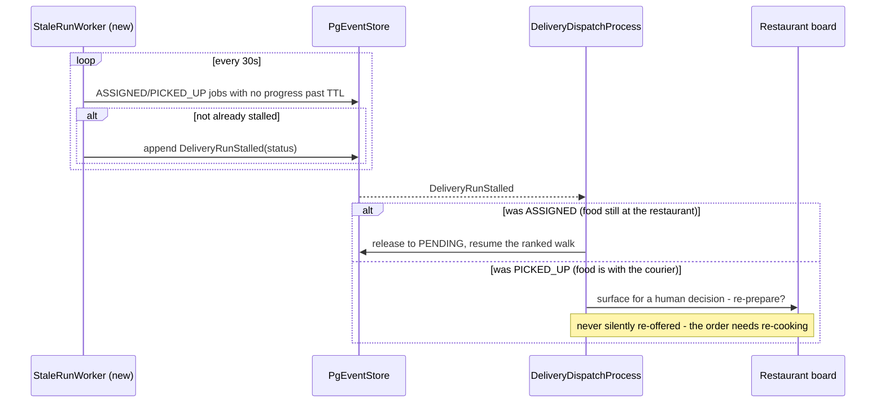

# PROP-20260726-172500 — Delivery execution: deliverability, the rider surface, run recovery

- **Status**: Proposed
- **Date**: 2026-07-26
- **Tracking issue**: [#204 "Epic: delivery execution — deliverability, the rider API surface, and run failure recovery"](https://github.com/TheCaptainCompany/captain-food/issues/204)
- **Realized by**: _(filled at completion)_
- **Scope split (2026-08-08)**: the rider/delivery **write surface** (the former #187 half) is now
  designed and sliced by
  [PROP-20260808-141817 "The rider/delivery write surface: journeys, vocabulary verdict, and V0 slices"](PROP-20260808-141817-rider-delivery-write-surface.md),
  whose slices land under
  [#348 "Epic: the rider/delivery write surface does not exist"](https://github.com/TheCaptainCompany/captain-food/issues/348).
  This proposal and [#204](https://github.com/TheCaptainCompany/captain-food/issues/204) keep
  **deliverability (D1), proof of delivery (D2), recovery automation (D3), pool filtering (D4) and
  rider↔customer contact (D5)**. This proposal is NOT superseded.

---

## 1. Context

**Dispatch is good.** The ranked channel walk, the offer-timeout worker with its resolved TTL and
per-(job, rank) idempotency, manual escalation, and fail-closed exhaustion
([#60](https://github.com/TheCaptainCompany/captain-food/issues/60),
`rules.yaml#/DispatchExhaustionFailsClosed`) are real, tested and well-shaped. Three partner adapters
(Avelo37, Uber Direct, CoopCycle) are implemented, wired and signature-verified.

Everything **around** dispatch is missing. Verified on `main` at `835da95`:

| Fact | Evidence |
|---|---|
| No delivery-area model of any kind | `delivery_zone`, `deliveryRadius`, `radius` → only CSS tokens |
| `OutsideDeliveryArea` is an unimplemented TODO | `crates/application/src/commands.rs:2065` |
| The behaviour test accepts it as one of several *allowed* throws | `generated/behaviour_tests.rs:2291` — so the gate does not catch the omission |
| Customer addresses carry no coordinates | `GeoPoint` is scoped to *the restaurant location*; nothing geocodes a delivery address |
| No apartment, floor, door code or delivery instructions | `line2` is the only free field |
| **9 delivery/rider commands have no GraphQL mutation** | incl. `RegisterRider`, `DeclineDelivery`, `ReportDeliveryIssue` |
| So a rider cannot be onboarded at all | `register_rider` exists at `commands.rs:1501`; no mutation reaches it |
| …while `independent` is seeded **rank 1 for Tours** | `migrations/20260721140000_delivery_dispatch_strategy.sql` |
| No `Rider` read model exists | rider identity is write-side only; no query lists riders |
| The job pool is global and unfiltered | `crates/infrastructure/src/persistence/delivery.rs:85` — `WHERE (rider_id = $1 OR (status = PENDING AND rider_id IS NULL))` |
| `RiderStatus` does not gate job visibility | so the online/offline toggle ([#95](https://github.com/TheCaptainCompany/captain-food/issues/95)) is cosmetic |
| No abandonment path | no `ASSIGNED → PENDING` edge for a rider; the timeout worker sweeps only `OFFERED` runs |
| The rider cannot even cancel | `CancelDelivery` roles are `[RESTAURANT, RESTAURANT_ACCOUNT, ADMIN]` |
| No proof of delivery, contactless, photo, signature or handover code | **zero hits repo-wide** |
| The rider can call the restaurant only | `specs/screens/rider.yaml:106`; no customer contact, no messaging action bound |

The compounding effect: the platform's **default first-rank channel cannot be populated**, so every
delivery depends on a partner adapter; any address is accepted for free; and one abandoned job wedges
an order permanently with no operator remedy.

`specs/stories.yaml:218` already records "Unclear delivery addresses" as a rider pain point.

## 2. Recommended approach

1. **The rider/delivery write surface — moved.** Its design now lives in
   [PROP-20260808-141817 "The rider/delivery write surface: journeys, vocabulary verdict, and V0 slices"](PROP-20260808-141817-rider-delivery-write-surface.md):
   four persona journeys, the vocabulary verdict (the wired offer/accept vocabulary is canonical)
   and 8 value-ordered V0 slices covering onboarding, decline, issue lifecycle, assignment-failure
   recovery, the ops surface and customer reassurance — replacing the former #187 scope of this
   proposal only.
2. **#181 — delivery area**, postal-code sets first (see D1), closing the `OutsideDeliveryArea` TODO.
3. **#188 — run recovery**: an abandonment sweep, pool filtering, and proof of delivery.

## 3. Decisions surfaced

### D1 — Delivery-area model

| Option | Pros | Cons |
|---|---|---|
| **Postal-code sets per restaurant** ✅ **recommended** | No geocoding needed; matches how French independents actually describe their range ("on livre le 37000 et le 37100"); reuses the longest-prefix logic already proven in `crates/adapters/coopcycle/src/config.rs`; pairs directly with per-zone delivery fees ([#172](https://github.com/TheCaptainCompany/captain-food/issues/172) D4) | Coarse at boundaries; a large postal code can span more than a restaurant will really serve |
| Radius from the restaurant | Intuitive; one number to configure | Requires geocoded customer addresses — a prerequisite that does not exist; ignores rivers, ring roads and one-way systems |
| Drawn polygons | Most accurate; standard at scale | Needs a map editor in the back office and geocoding; heavy for V0 |

Recommended path: **postal sets now, geocoding next** — geocoding is the unlock for distance-banded
fees ([#172](https://github.com/TheCaptainCompany/captain-food/issues/172)) and honest ETAs
([#182](https://github.com/TheCaptainCompany/captain-food/issues/182)), so it should be sequenced
deliberately rather than arrived at by accident.

Whatever is chosen, **tighten the behaviour test** so a missing guard fails: asserting the rejection
as one of an allowed set is what let the TODO survive.

### D2 — Proof of delivery

| Option | Pros | Cons |
|---|---|---|
| **Photo at handover, over the [#134](https://github.com/TheCaptainCompany/captain-food/issues/134) file framework** ✅ **recommended** | #134 already names `DELIVERY_PROOF` as a retention kind, so the storage, retention and access model exist; adjudicates the `NOT_DELIVERED` reclamation directly; standard in the category | Requires #134 (itself blocked by [#144](https://github.com/TheCaptainCompany/captain-food/issues/144)); GDPR retention window must be set |
| Handover code read from the customer's app | No storage, no personal data, unambiguous | Fails exactly when it matters most — contactless drop-off, customer absent |
| Signature capture | Traditional | Poor on a phone; weak evidence; effectively obsolete post-2020 |
| Nothing (status quo) | No work | `NOT_DELIVERED` claims are unadjudicable, and [#151](https://github.com/TheCaptainCompany/captain-food/issues/151) is already routing them |

Recommended: **photo, with contactless as an explicit customer option** — a contactless drop is
precisely when a photo is the only evidence that exists.

### D3 — Reclaiming an abandoned run

| Option | Pros | Cons |
|---|---|---|
| **Rider-initiated release + a stall sweep** ✅ **recommended** | Covers both the honest rider ("my bike broke") and the silent one; reuses the worker pattern proven twice already | A stall TTL must be chosen per status (`ASSIGNED` vs `PICKED_UP` differ — food is already collected in the second) |
| Rider-initiated release only | Simple; explicit | A rider who simply stops does not release anything, which is the actual failure mode |
| Operator-only (extend `CancelDelivery` to riders) | Smallest change | Needs a human watching; Captain has no staffed operations |

Note the asymmetry worth designing around: a stalled `PICKED_UP` job means **the food is with the
rider**. Returning that job to the pool is not enough — the order likely needs re-preparation, which
is a restaurant-facing decision, not an automatic re-offer.

**Shared release vocabulary (2026-08-08)**: the automated stall sweep's `ASSIGNED → PENDING`
release must emit **the SAME release event** as the manual "Libérer et relancer" action designed by
[PROP-20260808-141817 §1b step 4 / decision D3](PROP-20260808-141817-rider-delivery-write-surface.md)
— now decided (2026-08-08): `DeliveryAssignmentReleased`, command `ReleaseDeliveryAssignment` —
**never a twin event** for the automated case: `DeliveryRunStalled` stays the sweep's distinct
detector fact and TRIGGERS the release path, which emits `DeliveryAssignmentReleased`. And the release
edge covers `ASSIGNED` only: it does not cover `PICKED_UP` and must not pretend to — once the food
is with the courier, return-to-pool is wrong and re-preparation is the restaurant's decision.

### D4 — Job-pool filtering

Recommended: **filter by city, by the restaurant's zone, and by `RiderStatus`**. Today a rider in
Tours is offered work anywhere in France, and an `OFFLINE` or `SUSPENDED` rider still sees the pool —
so the toggle shipped by
[#95 "rider online/offline toggle"](https://github.com/TheCaptainCompany/captain-food/issues/95)
does not do what its label says.

Note the interaction with
[PROP-20260808-141817 slice 4](PROP-20260808-141817-rider-delivery-write-surface.md) (`rider-decline`):
that slice adds a per-rider decline exclusion (`View_RiderDeclinedJobs`) to `myDeliveries`. Both
filters shape the same query — the pool filter (city/zone/`RiderStatus`) and the decline exclusion
must compose, not race each other in two separate changes.

### D5 — Rider↔customer contact

Recommended: **route through the existing order conversation**
([#129](https://github.com/TheCaptainCompany/captain-food/issues/129)) rather than exposing phone
numbers. `RIDER` is already a conversation participant and `orderConversation` already includes the
role — the rider app simply binds no messaging action. This is close to free and avoids handing a
courier a customer's personal number.

## 4. Screen mockups

### 4.1 Rider onboarding — moved

The rider onboarding journey, mockups and slices now live in
[PROP-20260808-141817 §1a and §5b](PROP-20260808-141817-rider-delivery-write-surface.md)
(`rider-identity`, slice 3).

### 4.2 Rider job list, filtered (#188, D4)

```
+--------------------------------------------------+
|  Tours              [====o] ONLINE                |
+--------------------------------------------------+
|  Chez Marco -> 12 rue Nationale                   |
|  1.4 km  ·  ready 19:35  ·  4.20 EUR              |
|                     [ Decline ]  [ Accept ]       |
+--------------------------------------------------+
|  Le Saint-Honore -> 5 place Plum.                 |
|  2.1 km  ·  ready 19:50  ·  5.10 EUR              |
+--------------------------------------------------+
```

`Decline` is `DeclineDelivery` — specified, ruled, tested, and currently unreachable.

### 4.3 Handover (#188, D2)

```
+--------------------------------------------------+
| Order #A1B2  ·  Marie D.                          |
| 12 rue Nationale, 37000 Tours                     |
| Door code A1234 · 3rd floor · "sonner fort"       |
|                          [ Message customer ]     |  <- D5, via #129
+--------------------------------------------------+
| [x] Contactless - leave at the door               |
|                                                   |
|          [ Take handover photo ]                  |
|          [ Report a problem ]                     |
+--------------------------------------------------+
|             [ Confirm delivered ]                 |
+--------------------------------------------------+
```

The address detail shown here (door code, floor, instructions) does not exist in the `Address` model
today — it is part of what #181's address work must add.

### 4.4 Restaurant board — a stalled run (#188, D3)

```
+--------------------------------------------------+
| Deliveries                                        |
+--------------------------------------------------+
| #A1B2  PICKED_UP  Karim  ·  no update for 22 min  |
|        !! stalled - the food is with the courier  |
|        [ Call courier ]  [ Re-prepare & re-offer ]|
+--------------------------------------------------+
```

## 5. Sequence diagrams

### 5.1 Deliverability at checkout (#181)



### 5.2 Abandonment recovery (#188, D3)



### 5.3 Rider onboarding through the missing mutation — moved

The onboarding flow (including the `View_Rider` read model, the `authRef` envelope-derivation and
the `myDeliveries` Supabase-subject shim fix) is now specified by
[PROP-20260808-141817 slice 3 and §5a](PROP-20260808-141817-rider-delivery-write-surface.md).

## 6. Alternatives considered for the cluster

| Approach | Pros | Cons |
|---|---|---|
| **Rider surface → delivery area → run recovery** ✅ **recommended** | Unblocks the rank-1 channel first; each slice is independently useful | Deliverability stays open a little longer |
| Partner-only delivery for V0, defer riders entirely | The three partner adapters already work; no rider app needed | Abandons `independent` — the seeded rank-1 channel and the lower-cost option — and makes Captain fully dependent on partner coverage in Tours |
| Delivery area first | Closes the most visible customer-facing wrongness | Does not help if there is no courier to deliver anyway |

The middle option is a legitimate V0 posture and deserves an explicit decision rather than a default —
it would mean deleting `independent` from the Tours ranking, not leaving it seeded and unpopulatable.

## 7. Verification plan

- **Rider write surface** — verified under
  [PROP-20260808-141817 §10](PROP-20260808-141817-rider-delivery-write-surface.md)'s plan (its
  slices carry the story-step, `authRef`-bridge and end-to-end assertions that used to sit here).
- **#181** — the TODO is gone and the guard is real; the behaviour test asserts `OutsideDeliveryArea`
  **specifically**, not as one of an allowed set; the storefront refuses out-of-area addresses at
  address entry.
- **#188** — rules + tests: a stalled `ASSIGNED` job returns to the pool and is re-offered; a stalled
  `PICKED_UP` job is surfaced rather than re-offered; a rider sees only jobs in their city while
  `AVAILABLE` and none while `OFFLINE`/`SUSPENDED`; `CompleteDelivery` can carry proof and a
  `NOT_DELIVERED` reclamation can reference it.

## 8. Open questions for the product owner

1. **D1** — postal-code sets now, geocoding next? (recommended: yes)
2. **D2** — handover photo over [#134](https://github.com/TheCaptainCompany/captain-food/issues/134),
   with contactless as a customer option? (recommended: yes)
3. **D3** — rider release **plus** a stall sweep, with `PICKED_UP` escalating to a human rather than
   auto-re-offering? (recommended: yes)
4. **D4** — filter the job pool by city, zone and `RiderStatus`? (recommended: yes)
5. **D5** — rider↔customer contact through the order conversation rather than phone numbers? (recommended: yes)
6. Is **partner-only delivery** a deliberate V0 posture? If so, `independent` should be removed from
   the Tours ranking rather than left seeded and unpopulatable.

## 9. Refs

`crates/application/src/commands.rs:1501,2065` · `crates/infrastructure/src/persistence/delivery.rs:85` ·
`crates/application/src/generated/behaviour_tests.rs:2291` · `crates/adapters/coopcycle/src/config.rs` ·
`migrations/20260721140000_delivery_dispatch_strategy.sql` · `specs/screens/rider.yaml:106` ·
`specs/entities.yaml#/Address`, `#/GeoPoint` · `specs/scalars.yaml#/RiderStatus` · `specs/stories.yaml:218` ·
[#181](https://github.com/TheCaptainCompany/captain-food/issues/181) ·
[#187](https://github.com/TheCaptainCompany/captain-food/issues/187) ·
[#188](https://github.com/TheCaptainCompany/captain-food/issues/188) ·
[#60](https://github.com/TheCaptainCompany/captain-food/issues/60) ·
[#95](https://github.com/TheCaptainCompany/captain-food/issues/95) ·
[#134](https://github.com/TheCaptainCompany/captain-food/issues/134) ·
[#151](https://github.com/TheCaptainCompany/captain-food/issues/151)
