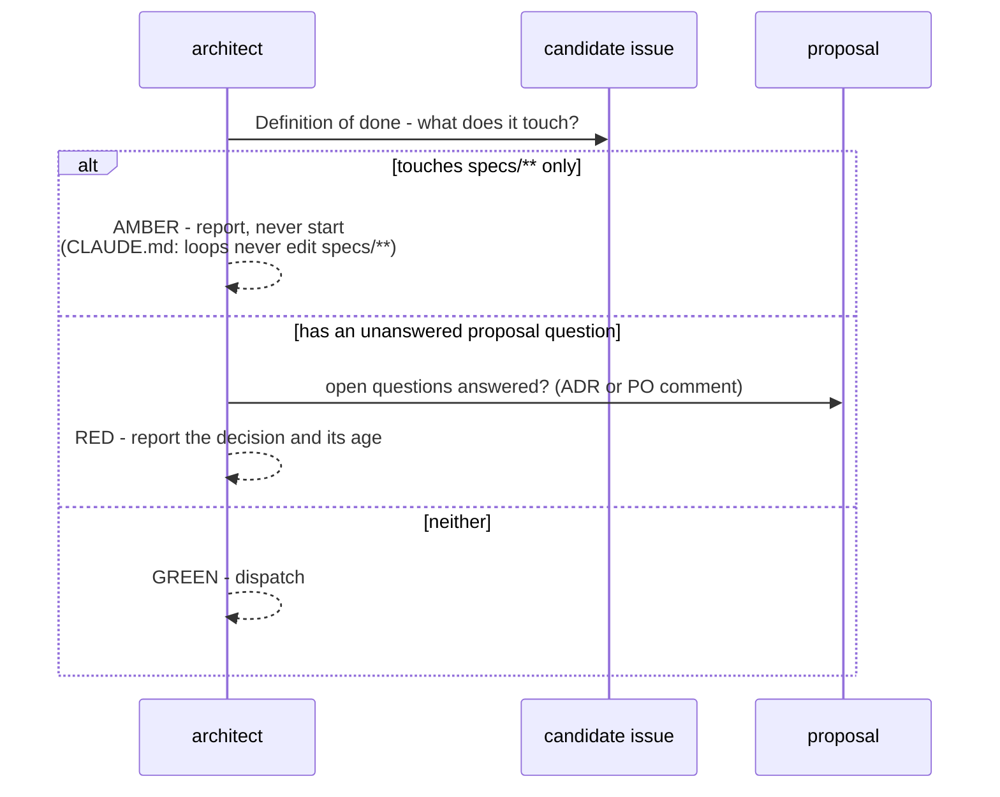

# PROP-20260726-193000 — Continuous development loop: architect dispatcher + bounded execution

- **Status**: Proposed
- **Date**: 2026-07-26
- **Tracking issue**: [#210 "Continuous development loop: architect dispatcher + bounded execution runs"](https://github.com/TheCaptainCompany/captain-food/issues/210)
- **Realized by**: _(filled at completion)_

---

## 1. Context

### What exists

| Piece | State |
|---|---|
| `make night-loop` | `validate generate` — **does no feature work at all**; explicitly "NEVER edits specs/**" |
| `make budgeted-loop` | wraps night-loop in a 30 min/week guard (`.claude/loop-budget.json`, ADR-0014) |
| Agents | `generator`, `reviewer`, `observability-agent` — **no planner/dispatcher** |
| Claim protocol | claim → branch → draft PR → supervised auto-merge (ADR-20260720-233000 + amendments) |
| Stale-claim reaper | hourly workflow releasing claims silent >24h |
| `stop-gate.sh` | blocks turn completion unless validate + generated artifacts are in step |
| Permissions allowlist | already covers `gh issue/pr/run`, `git`, `make`, `cargo` |
| `architecture-review.yml` | daily review at 07:00 Europe/Paris (landed 2026-07-26) |

So the scaffolding for a loop is largely present. **The two missing pieces are the decision of what to
work on, and an execution run that actually writes code.**

### The constraint that shapes everything

CLAUDE.md, non-negotiable:

> *"DSL source files (`specs/**`) are **never** modified by autonomous/execution loops — only plan mode
> proposes DSL changes, with approval."*

And ADR-0032 completeness: a new command also needs its event, error, rule, behaviour test and story
step — **all in `specs/**`**. So "add a mutation" is almost never autonomously executable. This is not
a flaw; it is the guarantee that keeps the model coherent. But it bounds what a loop can do, and that
bound must be designed for rather than discovered.

### The lane finding

Classifying all 40 issues from the 2026-07-26 review:

| Lane | Issues | Count |
|---|---|---|
| 🟢 **GREEN** — no `specs/**` change | #176, #179, #183, #189, #190, #191, #193, #172 (service-fee half), #169 (the two cheap validator rules), #195 (docs half) | **~8–10** |
| 🟠 **AMBER** — needs `specs/**` | #166, #167, #168, #170, #171, #173, #174, #175, #177, #178, #180, #181, #182, #184, #185, #186, #187, #188, #192, #194, #196, #197 | ~22 |
| 🔴 **RED** — proposal decision unanswered | most of AMBER | — |

Two things follow, and they point in opposite directions:

**The good news.** The green lane maps almost exactly onto the **Urgent/High foundation tier** —
#176 and #179 and #189 and #190 are Urgent; #191, #193, #183 are High. A loop can start on the
highest-value work in the backlog **without any rule change and without touching `specs/**` once**.

**The bad news.** The runway is about eight items long. After that the loop stalls — not for want of
capacity, but because **~28 open questions across the eight proposals have no answers**. The decision
queue is the bottleneck, not the coding. Any honest design has to say so, because the instinct will be
to add more loop capacity when the actual fix is to answer four questions.

## 2. Recommended approach

**Two agents, one bounded run, one item at a time.**

1. **`architect`** (landed at `.claude/agents/architect.md`) — read-only dispatcher. Reads `Priority` +
   row order from the Project, claim state, dependencies, and proposal decisions; classifies the lane;
   returns exactly one ready item with branch, scope, DoD and the one risk. Never claims, never
   implements, **never re-prioritises**.
2. **`executor`** — takes one dispatch and runs the documented protocol unchanged: claim → branch →
   draft PR (`Closes #NN`) → implement → `make rust` → ready + auto-merge → supervise to MERGED.
3. **Cadence** — a scheduled workflow, same shape as `architecture-review.yml`. **One item per run.**
   Not a long-running process: a bounded run that ends in a merged PR or an honest failure comment is
   auditable, restartable, and cannot drift.

The architect running *separately from and before* the executor is the important structural choice: a
dispatch that is never executed leaves no branch, no claim, no debris. Fusing them would mean every
"nothing ready" run still had to unwind a claim.

## 3. Decisions surfaced

### D1 — Does the loop merge to `main` autonomously? **(the whole risk surface)**

`main` → CI-built image → deploy hook → Render production. **An autonomous merge is an autonomous
production deploy.**

| Option | Pros | Cons |
|---|---|---|
| **PR-only: loop opens a ready PR, a human merges** ✅ **recommended to start** | Full speed on the expensive part (writing + testing the code); a human sees every production change; trivially reversible | Requires a daily human pass; PRs queue up if you are away |
| Auto-merge, green-lane only | True continuity; CI is a real gate (build + test + validate + drift) | CI does not catch *wrong-but-green*; a bad merge deploys to production unattended |
| Auto-merge everything | Maximum autonomy | Combines the above with `specs/**` risk — not compatible with the CLAUDE.md rule anyway |

Recommendation: **start PR-only**, and revisit after ~10 merged PRs of observed quality. The cost of
being wrong is asymmetric — a queued PR costs a day; a bad unattended deploy costs trust with the
first real restaurants. Note also that [#191](https://github.com/TheCaptainCompany/captain-food/issues/191)
(no telemetry) and [#193](https://github.com/TheCaptainCompany/captain-food/issues/193) (single
instance) mean a bad deploy is currently **both undiagnosable and un-rollbackable except by redeploy** —
which is a strong argument for letting the loop *fix those two first* before it is trusted to deploy.

### D2 — Does the loop ever touch `specs/**`?

| Option | Pros | Cons |
|---|---|---|
| **Green-lane only; AMBER items are reported, never started** ✅ **recommended** | Honours the non-negotiable rule exactly; zero risk to the model's coherence | ~22 of 40 issues untouchable by the loop |
| A "spec proposal" run — the loop drafts the DSL diff on a branch, PO approves, a second run executes | Unblocks AMBER without breaking the rule (the human is still the approver) | A new gate to design and trust; the draft can be subtly wrong in ways CI passes |
| Relax the rule | Everything becomes executable | Discards the guarantee the whole operating model rests on. Not recommended at any speed |

Recommendation: **green-lane only now**; consider the spec-proposal run once the loop has a track
record. The DSL is the one asset where a silent wrong edit is expensive to detect.

### D3 — Budget and cadence

`.claude/loop-budget.json` is **1800s = 30 min/week**, which cannot execute a single issue.

| Option | Pros | Cons |
|---|---|---|
| **Raise to a deliberate weekly ceiling; one execution run per day** ✅ **recommended** | Predictable spend; ~5 items/week is faster than the decision queue can feed it anyway | Requires picking a number, i.e. an explicit cost decision |
| Keep 30 min/week | No spend change | The loop cannot do anything — it would skip every run |
| No budget | Maximum throughput | ADR-0014 exists precisely because there is no native cap; removing it removes the only backstop |

The cadence argument matters more than the number: **there is no point running the executor more often
than the decision queue is refilled.** One run/day already outpaces the current supply of ready work.

### D4 — Concurrency

| Option | Pros | Cons |
|---|---|---|
| **One item in flight** ✅ **recommended** | No file collisions; the claim protocol's main failure mode disappears; each run is auditable | Slower in theory — irrelevant while the queue is decision-bound |
| Several in parallel | Higher throughput | The architect must guarantee disjoint file sets; concurrent sessions already exist (this is what the claim protocol was written for) |

### D5 — What happens when nothing is ready?

Recommendation: the run **reports and exits cheaply** — and, crucially, **names the decision it is
blocked on and who owes it**. A loop that silently no-ops teaches you nothing; a loop that says
*"blocked 6 runs on PROP-20260726-165000 D1 (payout posture)"* is doing the most useful thing it can.

## 4. Mockups

### 4.1 Architect output — a dispatch

```
NEXT: #176 "Outbound Stripe calls carry no Idempotency-Key"
LANE: GREEN
WHY:  top unclaimed item in the Urgent bucket; no specs/** change; no open decision
BRANCH: 176-stripe-idempotency-key
TOUCHES: crates/adapters/stripe/src/outbound.rs, crates/application/src/process_managers/refund.rs
SCOPE: deterministic Idempotency-Key on create-intent + refund. Nothing else.
DONE WHEN:
  - both outbound calls send a deterministic key; unit test pins the derivation
  - a simulated timeout + saga re-run produces exactly one Stripe refund
  - make rust green, make validate 0 errors, check-drift clean
RISK: the key must derive from the refund DECISION, not the call — a per-call UUID
      would pass tests and defeat the purpose.
```

### 4.2 Architect output — nothing ready

```
NOTHING READY

BLOCKED:
  #173 "There is no way to pay a restaurant"  — RED: PROP-20260726-165000 D1
        (payout posture) unanswered — 6 runs. This blocks #172, #174, #175.
  #184 "Allergens do not exist in the model"  — AMBER: needs scalars/entities/events
        + RED: PROP-20260726-165500 D1 (allergen vocabulary) unanswered
  #180 "Opening hours are never enforced"     — AMBER: needs a new errors.yaml entry

IN FLIGHT:
  #158 "Customer credit-balance ledger" — claimed 3h ago, PR #206

NOTE: the green lane is empty. The queue is decision-bound, not capacity-bound.
```

That last line is the output that actually changes behaviour.

### 4.3 The daily digest

```
+--------------------------------------------------+
| Captain.Food - loop, 2026-08-02                   |
+--------------------------------------------------+
|  merged   #176 idempotency key         PR #211    |
|  open     #179 GraphQL hardening       PR #212    |
|           -> ready for your review                |
|  skipped  budget: 22 of 180 min used this week    |
+--------------------------------------------------+
|  BLOCKED ON YOU (4 decisions, oldest 6 days):     |
|   PROP-165000 D1  payout posture      -> #173     |
|   PROP-165000 D2  capture timing      -> #175     |
|   PROP-165500 D1  allergen vocabulary -> #184     |
|   PROP-170000 D3  erasure strategy    -> #194     |
+--------------------------------------------------+
```

## 5. Sequence diagrams

### 5.1 One bounded run

```mermaid
sequenceDiagram
    participant W as Scheduled workflow
    participant A as architect (read-only)
    participant GH as GitHub (issues / Project / PRs)
    participant E as executor
    participant CI as ci workflow
    participant H as Human (D1)

    W->>A: what is next?
    A->>GH: Priority + row order, claims, open PRs, proposals
    alt nothing ready
        A-->>W: NOTHING READY + blocked list + who owes each decision
        W-->>H: digest (no branch, no claim, no debris)
    else dispatch
        A-->>W: NEXT #NN, lane GREEN, branch, scope, DoD
        W->>E: execute this one item
        E->>GH: label status/in-progress + claim comment
        E->>GH: branch NN-slug + draft PR "Closes #NN"
        E->>E: implement; make rust
        E->>GH: mark ready
        CI-->>GH: build + test + validate + drift
        alt D1 = PR-only (recommended)
            E-->>H: ready for review
        else D1 = auto-merge
            E->>GH: enable auto-merge, supervise to MERGED
        end
    end
```

### 5.2 Where the loop must stop



## 6. Alternatives considered

| Approach | Pros | Cons |
|---|---|---|
| **Separate architect + executor, one item per scheduled run** ✅ **recommended** | Auditable; no debris on a no-op run; matches the existing claim protocol and the review workflow already landed | Two agents to maintain |
| One fused agent that picks and builds in the same run | Simpler to write | Every "nothing ready" run still claims and unwinds; harder to reason about failures |
| Long-running process on a machine | True continuity | Needs a host; dies with the machine; no audit trail per item; conflicts with the multi-session claim protocol |
| Keep working items by hand | Full control | The thing the product owner explicitly wants to stop doing |

## 7. Verification plan

- **Dry-run the architect first.** Run it read-only against the live board for several days and check
  its picks by hand *before* any executor exists. A dispatcher that picks wrong is worse than none.
- The executor's first three runs are reviewed line by line regardless of D1.
- The claim protocol is respected exactly: no item is worked while carrying another session's
  `status/in-progress`; the reaper is not raced.
- `specs/**` is untouched by every executor run — assert it in the workflow (`git diff --name-only`
  against `specs/` must be empty) rather than trusting the prompt.
- Budget guard enforced and `.claude/loop-budget.json` committed each run (ADR-0014).
- An ADR records the autonomy posture chosen in D1–D5.

## 8. Open questions for the product owner

1. **D1** — PR-only, or auto-merge to `main` (= auto-deploy to production)? (recommended: PR-only to
   start; revisit after ~10 merged PRs, and preferably after
   [#191](https://github.com/TheCaptainCompany/captain-food/issues/191)/[#193](https://github.com/TheCaptainCompany/captain-food/issues/193)
   make a bad deploy diagnosable)
2. **D2** — green-lane only, or add a gated spec-proposal run? (recommended: green-lane only now)
3. **D3** — what weekly budget ceiling, and one execution run per day? (recommended: yes to daily;
   the ceiling is your cost call)
4. **D4** — one item in flight? (recommended: yes)
5. **D5** — confirm the no-op run reports the blocking decision and its age.
6. **The real question behind all of these:** the loop has ~8 items of runway. Are you willing to
   answer the ~28 open proposal questions at roughly the rate the loop consumes them? If not, the
   loop will idle and the constraint was never engineering capacity.

## 9. Refs

`.claude/agents/architect.md` · `.claude/agents/generator.md`, `reviewer.md` · `docs/claude/loops.md` ·
ADR-0014 · ADR-20260720-233000 / -20260721-042018 / -20260721-044613 (claim protocol) ·
`docs/BACKLOG.md` · `Makefile` (`night-loop`, `budgeted-loop`) · `.claude/hooks/stop-gate.sh` ·
`.github/workflows/architecture-review.yml` ·
[#210](https://github.com/TheCaptainCompany/captain-food/issues/210)
