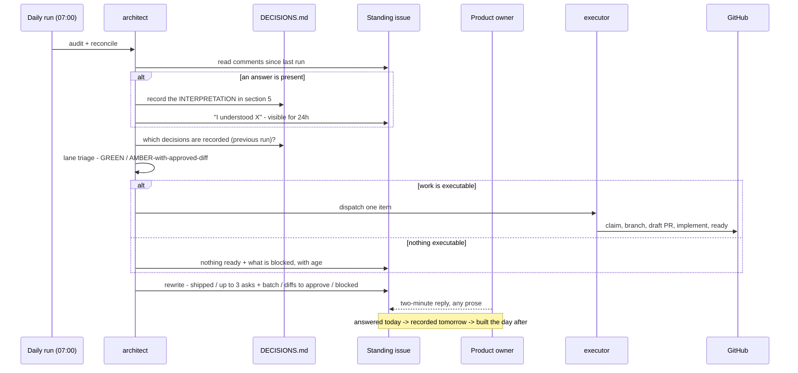

# PROP-20260726-201500 — Daily decision cycle: audit → ask → record → implement

- **Status**: Superseded — the daily ask-cycle is replaced by the consent-based ensemble decision mechanism, [ADR-20260808-144738](../adr/ADR-20260808-144738-product-ownership-lives-in-the-team-no-pm-agent.md) (recorded in the 2026-08-08 register sweep, ADR-20260808-171056)
- **Date**: 2026-07-26
- **Tracking issue**: [#211 "Daily decision cycle: audit → ask the blocking questions → implement what is unblocked"](https://github.com/TheCaptainCompany/captain-food/issues/211)
- **Supersedes**: the always-on framing in [PROP-20260726-193000](PROP-20260726-193000-continuous-development-loop.md), whose D1–D4 are **deferred** (product owner, 2026-07-26)
- **Realized by**: _(filled at completion)_

---

## 1. Context

The product owner's proposal, in their words: *audit every day; ask me the most important questions
that need answering to allow implementation for the day; then implement the subjects that can be
done; repeat the next day.*

The instinct is right and it attacks the correct constraint. The 2026-07-26 review established that
**the bottleneck is the decision queue, not engineering capacity** — 62 open decisions across 11
`Proposed` proposals ([DECISIONS.md](DECISIONS.md)). A daily audit that reports but never asks leaves
that queue exactly where it was. Putting the ask inside the cycle is what makes the loop self-feeding
rather than a report nobody acts on.

What already exists: the daily audit (07:00 Europe/Paris, `architecture-review.yml`), the architect
(audit → file → dispatch), the executor and a dormant `dev-loop.yml`, the decision register, and the
approval gate that keeps unapproved proposals out of dispatch.

What is missing is the **ask**, the **answer capture**, and an honest treatment of what implementation
can actually reach.

## 2. The three corrections

### 2.1 Implement-then-ask, not ask-then-implement

Answers arrive asynchronously — hours or days after 07:00. A run that asks at 07:00 and implements at
07:05 implements nothing, every day, forever.

Each run therefore:

1. **reads answers given since the last run** and records them;
2. **implements what those answers (recorded on a previous run) unblocked**;
3. **asks the next batch**.

The cycle time for one decision is two days, not two minutes — and that is correct, not a defect.

### 2.2 A recorded-interpretation window

A prose answer ("yes, Connect") has to become a structured decision. Misreading it means building the
wrong architecture, and the misreading would only surface once the code exists.

So the run **records its interpretation in `DECISIONS.md` §5 and stops**. Implementation happens on the
*next* run. That gives a 24-hour window in which *"I understood you to mean X"* is visible, in writing,
before anything is built. It costs a day and removes the only failure mode that is expensive to undo.

### 2.3 The second gate — the one that would stall the cycle silently

**Verified against the backlog:** all six §1 high-leverage decisions target issues that require
`specs/**` changes.

| Decision | Unblocks | Which touches | Lane after the answer |
|---|---|---|---|
| Payout posture | [#173](https://github.com/TheCaptainCompany/captain-food/issues/173) | `entities.yaml` | 🟠 AMBER |
| Capture timing | [#175](https://github.com/TheCaptainCompany/captain-food/issues/175) | `scalars.yaml`, `actors.yaml` | 🟠 AMBER |
| GDPR erasure | [#194](https://github.com/TheCaptainCompany/captain-food/issues/194) | `commands.yaml`, `events.yaml` | 🟠 AMBER |
| Allergen model | [#184](https://github.com/TheCaptainCompany/captain-food/issues/184) | `scalars.yaml`, `entities.yaml`, `events.yaml` | 🟠 AMBER |
| Acceptance timeout | [#167](https://github.com/TheCaptainCompany/captain-food/issues/167) | `commands.yaml`, `events.yaml`, `rules.yaml` | 🟠 AMBER |
| Screens input source | [#169](https://github.com/TheCaptainCompany/captain-food/issues/169) | screens DSL | 🟠 AMBER (partly) |

**Answering the most valuable decisions moves work from 🔴 RED to 🟠 AMBER — not to 🟢 GREEN.** And
AMBER is precisely what autonomous runs may never touch (CLAUDE.md, non-negotiable).

Meanwhile the *batch-approvable* §2 decisions unblock the green lane:
[#189](https://github.com/TheCaptainCompany/captain-food/issues/189),
[#191](https://github.com/TheCaptainCompany/captain-food/issues/191),
[#193](https://github.com/TheCaptainCompany/captain-food/issues/193).

So the cycle as proposed would ask the important questions, receive the answers, and then still not be
able to implement most of them — spending the product owner's attention for no throughput. **There are
two gates, and the cycle only works if both are addressed.**

## 3. Recommended approach

Extend the daily ask to cover **DSL diffs as well as decisions**. The run drafts the `specs/**` change,
the product owner approves it in the same two-minute ritual, and the next run executes it.

This is [PROP-20260726-193000](PROP-20260726-193000-continuous-development-loop.md) D2 option 2, and it
fits this cycle far better than it fitted the always-on loop: the approval was going to be a daily
ritual anyway, so adding "and approve this diff" costs the product owner almost nothing while
preserving the plan-mode guarantee exactly — **a human approves every DSL change**. Nothing is
weakened; the approval simply gets a delivery mechanism.

The daily run then has three kinds of output:

| Output | Needs | Executed |
|---|---|---|
| 🟢 GREEN work | nothing | same run |
| 🟠 AMBER work | an approved **DSL diff** | next run after approval |
| 🔴 RED work | an answered **decision**, then a DSL diff | two runs later |

## 4. Decisions surfaced

### D1 — Where the ask lands

| Option | Pros | Cons |
|---|---|---|
| **One standing GitHub issue, rewritten daily** ✅ **recommended** | Readable and answerable on a phone (where the product owner already reads the board); one URL to bookmark; the edit history is the audit trail; no new tooling or credential | Rewriting loses the previous day's text unless it is archived in a comment |
| A new issue each day | Each day is permanently addressable; notifications per day | 365 issues/year of noise in a backlog that is meant to be the work queue |
| Comments on each affected tracking issue | Context sits with the work | The product owner has to visit N issues to answer N questions — the opposite of a two-minute ritual |
| Email / push digest | Arrives without being fetched | Answering by email needs parsing and a new inbound channel; GitHub already has the identity and the audit trail |

### D2 — What counts as an answer

| Option | Pros | Cons |
|---|---|---|
| **A comment on the standing issue, in any prose, re-stated by the next run before use** ✅ **recommended** | Zero friction — "A", "yes to all of §2", "Connect but revisit in 6 months" all work; the interpretation window (§2.2) catches misreadings | Needs the interpretation step to be genuinely enforced, not skipped when the answer looks obvious |
| A strict syntax (`/decide PROP-165000 D1 = connect`) | Unambiguous; parseable | Puts the burden on the human to serve the machine; one typo and the decision is lost |
| Reactions / checkboxes on a task list | One tap | Cannot express "yes but"; and the nuance is usually where the value is |

The recommendation is deliberate: **make it effortless to answer and expensive to misinterpret**,
rather than the reverse.

### D3 — How many questions per day

| Option | Pros | Cons |
|---|---|---|
| **Up to 3, plus one batch block** ✅ **recommended** | Answerable in two minutes; the batch block clears the 16 trivial ones in a single "yes" | Three a day means ~2 weeks to clear the queue |
| Everything, every day | Fastest possible clearing | 22 questions is not a ritual, it is a chore; it will be skipped, and a skipped ritual is worse than none |
| One | Trivially answerable | Too slow to matter |

Ordering is by **leverage** — how much the answer unblocks — which is already how `DECISIONS.md` §1–§3
is ranked. Never re-ask an answered question.

### D4 — What happens when nothing is answered for several days

| Option | Pros | Cons |
|---|---|---|
| **Keep implementing GREEN work; escalate the ask with its age** ✅ **recommended** | The cycle keeps producing; the age is the signal that the constraint is the product owner, stated plainly and without nagging | Requires the report to be honest in a way that may be uncomfortable to read |
| Stop asking after N days | Quiet | The queue silently becomes permanent |
| Escalate by another channel (push/email) | Harder to ignore | Adds a channel to build; the age line in the daily digest is usually enough |

### D5 — Does the cycle merge to `main`?

Unchanged from PROP-20260726-193000 D1: **PR-only**, deferred. `main` → CI image → deploy hook →
production, so an autonomous merge is an autonomous deploy, and today
[#191](https://github.com/TheCaptainCompany/captain-food/issues/191) (no telemetry) plus
[#193](https://github.com/TheCaptainCompany/captain-food/issues/193) (single instance) mean a bad
deploy would be undiagnosable. Revisit after those two land — which the green lane can deliver.

## 5. Mockup — the standing issue, one morning

```
+----------------------------------------------------------+
|  Daily decisions - Captain.Food            #212  (pinned) |
|  updated 07:04, 2026-08-04                                |
+----------------------------------------------------------+
|  SHIPPED SINCE YESTERDAY                                  |
|    #189 projection position gap        PR #221  merged    |
|    #191 OpenTelemetry runtime          PR #222  ready ->  |
|                                        needs your merge   |
+----------------------------------------------------------+
|  I NEED FROM YOU (2 min)                                  |
|                                                           |
|  1. Payout posture - Stripe Connect, or Captain as        |
|     merchant of record?                    [PROP-165000 D1]|
|     My recommendation: Connect, separate charges &        |
|     transfers. Unblocks #173, #172, #174.                 |
|     >> Reply "1: connect" or "1: merchant" or ask me      |
|                                                           |
|  2. Allergen model - controlled 14-category enum with an  |
|     explicit "not declared" state?         [PROP-165500 D1]|
|     Legal blocker (EU FIC 1169/2011). Unblocks #184.      |
|     >> Reply "2: yes" or tell me what to change           |
|                                                           |
|  3. BATCH - 16 decisions where the standard answer is the |
|     recommendation (DECISIONS.md section 2).              |
|     >> Reply "3: yes to all" to clear them                |
|                                                           |
|  APPROVE THIS DSL DIFF?                     [#167]        |
|     +12 -0 in commands.yaml, events.yaml, rules.yaml      |
|     Adds OrderAcceptanceTimedOut + its rule and test.     |
|     >> git diff in PR #223 (draft). Reply "diff 167: ok"  |
+----------------------------------------------------------+
|  BLOCKED ON YOU                                           |
|    GDPR erasure strategy    [PROP-170000 D3]   6 days     |
|    Capture timing           [PROP-165000 D2]   6 days     |
+----------------------------------------------------------+
|  I UNDERSTOOD YESTERDAY'S ANSWER AS:                      |
|    "yes to all of section 2" -> 16 decisions recorded in  |
|    DECISIONS.md section 5. Implementation starts tomorrow.|
|    Correct me today if that is wrong.                     |
+----------------------------------------------------------+
```

That last block is §2.2 made visible — the 24-hour window where a misreading is cheap to fix.

## 6. Sequence diagram



## 7. Alternatives considered

| Approach | Pros | Cons |
|---|---|---|
| **Ask + record + implement, with the interpretation window and DSL diffs in the ritual** ✅ **recommended** | Attacks both gates; keeps the plan-mode guarantee intact; the ritual is genuinely two minutes | Two-day cycle per decision; the standing issue must be maintained honestly |
| Ask only, implement nothing (today's state) | Zero risk | The queue never clears; the audit becomes a report nobody acts on |
| Implement only, never ask (PROP-193000 as written) | Simple | ~8 items of runway, then permanent idle |
| Ask and implement in the same run | Matches the product owner's literal description | Implements nothing, every day — answers are asynchronous |

## 8. Verification plan

- **Dry-run the ask for a week before anything implements.** The standing issue is written daily and
  the product owner answers; nothing is built. Confirms the questions are answerable in two minutes and
  the interpretations are correct.
- Then enable GREEN implementation only.
- Then, separately, enable DSL-diff drafting — still requiring explicit per-diff approval.
- Assert, in CI, that no run modified `specs/**` without an approved diff reference (the `dev-loop.yml`
  freeze check already fails the job on any `specs/**` change; the diff path needs its own gate).
- Never re-ask an answered question — a regression test on the register.
- Budget guard enforced per ADR-0014.

## 9. Open questions for the product owner

1. **D1** — one standing pinned issue as the surface? (recommended: yes)
2. **D2** — free-prose answers, re-stated by the next run before use? (recommended: yes)
3. **D3** — up to 3 questions plus one batch block per day? (recommended: yes)
4. **D4** — keep implementing GREEN work and escalate the ask with its age? (recommended: yes)
5. **D5** — **the one that decides whether this works at all:** do DSL diffs join the daily approval
   ritual? Without it the cycle asks the important questions and then cannot act on the answers.
6. Start with a **week of ask-only**, before any implementation?

## 10. Refs

[DECISIONS.md](DECISIONS.md) · [PROP-20260726-193000](PROP-20260726-193000-continuous-development-loop.md) ·
`.claude/agents/architect.md`, `executor.md` · `.github/workflows/architecture-review.yml`,
`dev-loop.yml` · CLAUDE.md (`specs/**` freeze; prioritisation is a product-owner decision) · ADR-0014 ·
[#211](https://github.com/TheCaptainCompany/captain-food/issues/211)
