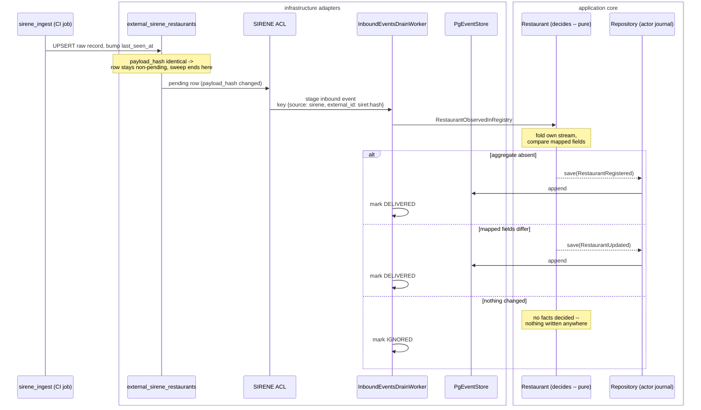
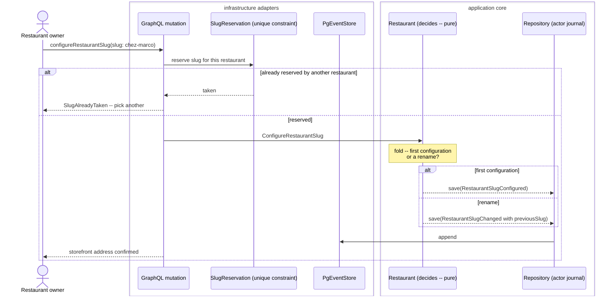
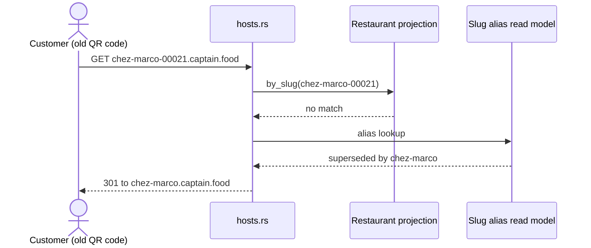
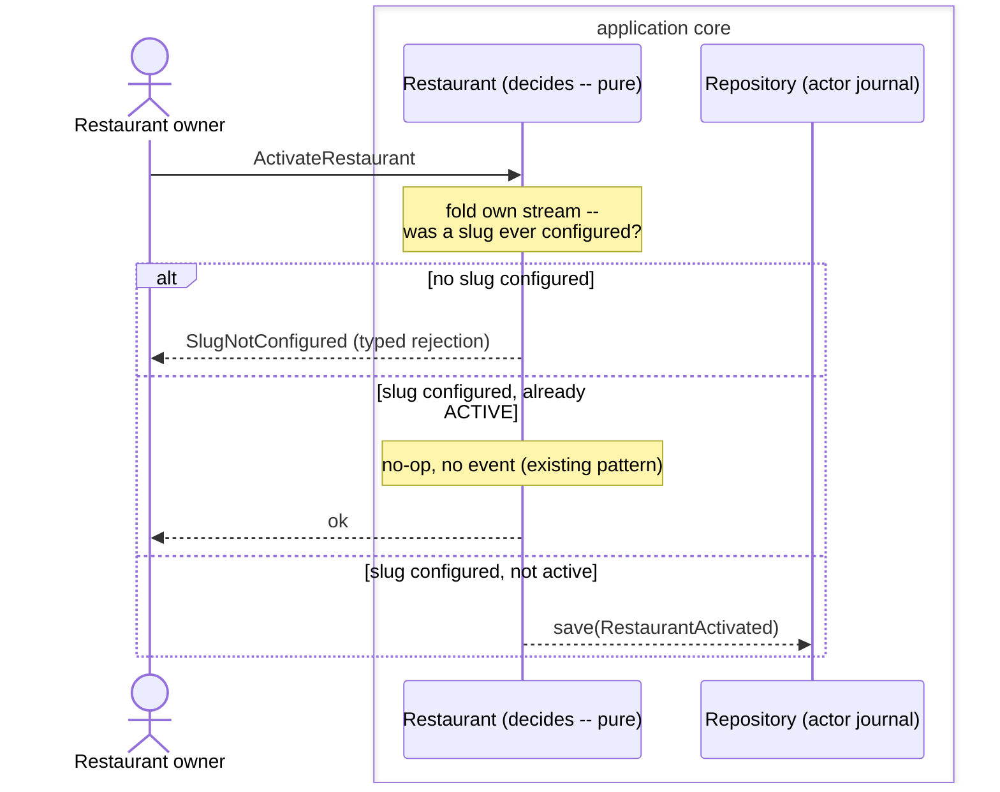

# PROP-20260728-004616 — Slug becomes a lifecycle, SIRENE becomes an inbound event

- **Status**: **Approved** — all six decisions answered by the product owner on 2026-07-28 (D1 in
  session, D2–D6 via the approval prompt), recorded in
  [ADR-20260728-011344](../adr/ADR-20260728-011344-slug-lifecycle-and-sirene-inbound-events.md) and in
  [DECISIONS.md §5](DECISIONS.md). **D4 was answered against the recommendation** — see §5 D4 below;
  the answer is `RestaurantRegistered` **only**, with the aggregate deciding record/ignore/update, which
  is stricter than either option offered. Per the honest-residuals rule this file is **not** rewritten to
  match: the decision lives in the header, the register and the ADR.
- **Date**: 2026-07-28
- **Tracking issue**: [#220 "Slug lifecycle + SIRENE as inbound event: a failed INSERT is the idempotency mechanism, and INSEE updates are silently dropped"](https://github.com/TheCaptainCompany/captain-food/issues/220)
- **Realized by**: ADR-20260728-011344 · PRs per §10 _(in progress)_

---

## TL;DR

A Supabase "depleting Disk IO Budget" alert led to a trace of the SIRENE write path. The IO was the
symptom. Underneath it:

1. **A failed INSERT is the idempotency mechanism.** `register_restaurant` never rehydrates the
   aggregate — it hard-codes `expected_version = 0` and lets a `UNIQUE` violation decide whether the
   restaurant already exists. ~200k deliberate constraint violations per weekly sweep, each leaving a
   dead tuple in the largest table.
2. **INSEE updates are silently dropped.** There is no `UpdateRestaurant` in the SIRENE worker at all.
   A renamed établissement conflicts, is swallowed as success, and the change is discarded.
3. **The write path asks the read side, unindexed.** A JSONB containment query with no GIN index,
   once per staged SIRET — a full sequential scan of the `Restaurant` projection, ~200k times a sweep.

All three trace back to one decision: **the slug is derived at seeding time.** This proposal removes
that decision, in two coupled changes — slug first, because the second is unsafe without it.

| | change | why it is first |
|---|---|---|
| **A** | Slug leaves `RestaurantRegistered` and becomes its own lifecycle (`RestaurantSlugConfigured` / `RestaurantSlugChanged`) | Fixing the update path *without* this turns an INSEE rename into a live-storefront rename |
| **B** | SIRENE stops being a command and becomes an inbound event, with `IGNORED` / `DUPLICATE` recorded on `inbound_events` | The aggregate decides, so nothing is written for a no-op — and the status column becomes the sweep report |

---

## 1. The problem

### 1.1 A failed INSERT is the idempotency mechanism

`register_restaurant` ends with:

```rust
idempotent_on_existing(Repository::new(store).save(&stream_name, 0, &[event], actor).await)
```
`crates/application/src/commands.rs:365`

It never loads the stream. `expected_version = 0` is hard-coded, so the question *"does this
restaurant already exist?"* is answered by Postgres:

```rust
if is_unique_violation(&e) { return Err(version_conflict(stream_name, expected_version)) }
```
`crates/infrastructure/src/persistence/event_store.rs:81-85`

and then laundered into success:

```rust
fn idempotent_on_existing(result: Result<i64, DomainError>) -> Result<(), DomainError> {
    match result {
        Ok(_) => Ok(()),
        Err(e) if is_version_conflict(&e) => Ok(()),
        Err(e) => Err(e),
    }
}
```
`crates/application/src/commands.rs:160-166`

Postgres inserts the heap tuple **first** and detects the unique violation during index insertion, so
each "no-op" writes a tuple, touches indexes, consumes a `position` identity value, and aborts. At
~200k SIRETs per weekly sweep that is ~200k dead tuples in `domain_events` and its three indexes, plus
the autovacuum work to clean them — days of IO after the sweep ends, for an outcome that is by
definition *no change*.

**This is an outlier, not the house style.** Ten lines below, the correct pattern:

```rust
if state.status == RestaurantStatus::ACTIVE { return Ok(()) }
```
`crates/application/src/commands.rs:376-378` (`activate_restaurant`)

The aggregate folds its own stream, decides, and writes nothing. `update_restaurant`,
`resolve_reclamation` and `consume_customer_credit` all `require_*` first.

**Blast radius — six sites use the constraint as the decision:**

| site | handler | consequence |
|---|---|---|
| `commands.rs:365` | `register_restaurant` | SIRENE: ~200k conflicts/week, updates dropped |
| `commands.rs:269` | `register_restaurant_account` | same pattern, low volume |
| `commands.rs:2594` | `create_catalog` | same |
| `commands.rs:2172` | `place_replacement_order` | same |
| `commands.rs:2382` | payment-intent create (`Repository::create`) | same |
| `commands.rs:3074` | `verify_phone` | returns `VerifyPhoneOutcome { created: true }` **after** a swallowed conflict — an existing customer reported as newly created |

The last is a live customer flow, not a batch job.

### 1.2 INSEE updates are silently dropped

There is **no `UpdateRestaurant` anywhere in the SIRENE worker** — `grep` returns zero hits in
`crates/infrastructure/src/integrations/sync_sirene_worker.rs`.

The path for a changed établissement: the ingest refreshes `payload` and bumps `last_seen_at`
(`crates/sirene_ingest/src/staging.rs:71-77`), the row re-pends, the worker builds a
`RegisterRestaurant`, the append conflicts, the conflict is swallowed as success, the row is marked
processed. **The mirror updates. The domain never does.** Because a swallowed conflict is
indistinguishable from a successful write, nothing ever surfaced this.

### 1.3 The write path asks the read side, unindexed

```rust
"SELECT {} FROM restaurant WHERE external_identifiers @> $1 LIMIT 1"
```
`crates/infrastructure/src/persistence/restaurant.rs:39-43`

Two problems. **Architecturally**, the write path is asking the *query* side — an eventually-consistent
projection — to make a write decision. Given the projector's frozen checkpoints, that answer can be
stale in exactly the situation the check exists to handle.

**Operationally**, `external_identifiers` is `JSONB` with **no GIN index**: there is no `gin` anywhere
in `specs/generated/schema.generated.sql`, and the only indexes on that table are
`restaurant_account_id` and `listing_status` (`:481-482`). So `@> $1` is a sequential scan of the whole
`Restaurant` table — every row, including its `address` / `opening_hours` / `tags` / `location` JSONB
columns — executed **once per staged SIRET**. Quadratic, and almost certainly the dominant IO consumer
during a sweep.

The fix is not to add the GIN index. It is to stop asking.

### 1.4 The root cause: the slug is derived at seeding time

```rust
let slug = if base.is_empty() { format!("restaurant-{nic}") } else { format!("{base}-{nic}") };
```
`crates/infrastructure/src/integrations/sirene.rs:215-216` → `chez-marco-00021`

Four consequences:

- **Nobody would choose it.** The slug is the tenant host (`{slug}.captain.food`, wildcard DNS). No
  merchant signing up wants `chez-marco-00021.captain.food`.
- **We reserve ~200k hostnames** in an identity namespace, for businesses that never opted in — and a
  branded host implies a partnership that does not exist.
- **The collisions are systematic.** The NIC suffix only disambiguates *within* a company (it is the
  establishment number, and `00019` / `00021` are the common first-establishment values). Generic names
  on common NICs collide across different SIREN: `boulangerie-00019` is not a rare event. That is the
  605-row `SlugAlreadyTaken` storm — the derivation, not bad luck.
- **It derives identity from a mutable third-party field.** INSEE's `denominationUsuelle` changes.
  Today that change is discarded by the swallowed conflict, which is *accidentally* protective.

**Hence the coupling**: fixing §1.2 without fixing §1.4 turns an INSEE rename into a request to rename
a live storefront — breaking printed menus, QR codes, SEO, and the GBP "order online" link.

### 1.5 The conflated concept

One `Slug` is doing two jobs:

| | listing path | storefront slug |
|---|---|---|
| what | marketplace address of a prospect listing | the tenant host |
| chosen by | derived from open data | the owner, during onboarding |
| stability | may change freely | permanent once live |
| uniqueness | collision-tolerant (suffix it) | a real invariant |
| scope | ~200k rows | the claimed ones only |

---

## 2. The model

### 2.1 Slug as a lifecycle

`RestaurantRegistered` **drops `slug`**. The slug arrives through its own events:

- **`RestaurantSlugConfigured`** — first configuration. The storefront comes into existence.
- **`RestaurantSlugChanged`** — a rename, carrying **`previousSlug`** (business data, not envelope).

Per ADR-0041 the acting user and timestamp are envelope metadata on `domain_events.user_id` /
`occurred_at`, so *who chose this address and when* needs no payload fields.

Why a separate event rather than `Option<Slug>` on `RestaurantRegistered`: an optional field conflates
"not chosen yet" with "has none", forces every consumer to handle null, and leaves the moment of
choosing with no record and nothing for a policy to react to.

### 2.2 Why `previousSlug` is load-bearing

`crates/server/src/hosts.rs:131` resolves the incoming `Host` header via `by_slug` against the
projection. The instant a slug changes, the old host 404s — and by then it is printed on menus, encoded
in QR codes, indexed by Google, and configured as the GBP order link.

`previousSlug` feeds a **slug-alias read model** so `hosts.rs` can serve a 301 from the old host.
Folding history would also yield it, but host resolution is on every request and must not fold.

This implies a second invariant: **a released slug is not reusable** (or only after a long quarantine).
Otherwise a competitor claims the old address and the redirect sends customers to them.

### 2.3 What this does to the invariants

| invariant | today | after |
|---|---|---|
| slug uniqueness | cross-aggregate, enforced via an eventually-consistent projection + unindexed JSONB scan | `slug TEXT NULL UNIQUE` — Postgres permits multiple NULLs, so the **database** enforces it over exactly the claimed set |
| no activation without a slug | does not exist | **aggregate-local**: `activate_restaurant` folds its own stream and sees whether `RestaurantSlugConfigured` happened |
| released slug not reusable | does not exist | write-side reservation (see D3) |

The cross-aggregate invariant that caused this entire investigation stops existing in that form.

### 2.4 SIRENE as an inbound event

CLAUDE.md's own rule: *if the originator can be told "no" → command. If they are stating a fact that
has already occurred → inbound event.* INSEE cannot be told no — which is exactly why today's
"rejections" are dropped to `eprintln!`. A rejection nobody receives was never a rejection.

So: route SIRENE through `inbound_events`, not `command_journal`.

**The dedupe key gets fixed for free.** `inbound_events` has `UNIQUE (source, external_id)`
(`specs/database/tables/journals.yaml:69`) — a **stable** key. `command_journal`'s `message_id` is
`UUIDv5(command type, SIRET, last_seen_at)` (`sync_sirene_worker.rs:87-88`), deliberately versioned, so
it cannot dedupe across sweeps: every SIRET produces a fresh journal row every week, on a table with
six secondary indexes and a 90-day retention. `external_id = {siret}:{payload_hash}` gives one row per
genuine version, idempotent forever.

**The machinery already exists.** The drain worker already distinguishes the aggregate's decision:

```rust
Ok(RecordOutcome::Recorded)        => Ok(false),
Ok(RecordOutcome::AlreadyRecorded) => Ok(true),
```
`crates/infrastructure/src/integrations/inbound_drain_worker.rs:177-179`

The aggregate decides, no constraint is consulted, nothing is written for a no-op. The only gap: both
outcomes call `mark_delivered` (`:139-144`), and the distinction survives solely as an in-process
counter. The spec even codifies the loss — *"an already-recorded no-op still DELIVERs"*
(`journals.yaml:48`).

So the change is: extend `InboundEventStatus` (`specs/scalars.yaml:581-583`, today
`[RECEIVED, DELIVERED, FAILED]`) with `IGNORED` and `DUPLICATE`, and persist the decision the aggregate
is already making. A value is being thrown away one line before the database.

### 2.5 Two comparisons, two homes

The worker must not consult the read side (§1.3). But there are **two** different comparisons, and only
one belongs to the aggregate:

| comparison | question | home | why |
|---|---|---|---|
| `payload_hash` changed? | *Has this external record changed since we mirrored it?* | ACL / staging table | A fact about INSEE. No domain knowledge. Stops us staging 200k identical inbound rows a week. |
| mapped fields differ? | *Is this a meaningful change to the Restaurant?* | the fold | A domain question. Only the aggregate can answer it. |

Not a contradiction: the first is mirror hygiene, entirely inside `external_sirene_restaurants`, no
boundary crossed. The second is judgement. Hash the **ACL-relevant fields**, not the raw payload — if
INSEE carries a `dateDernierTraitement`-style timestamp, raw `jsonb` equality would never match and the
check would buy nothing.

### 2.6 What the aggregate needs in order to decide

`RestaurantState` (`crates/domain/src/restaurant.rs:23-41`) carries `status`, `order_acceptance`,
`listing_status`, `listing_claimed`, `gbp_order_url`, `slug`, `display_name`, `ref`. It does **not**
carry address, contact, location, opening hours or cuisine category — precisely the fields INSEE
changes.

So "nothing changed" is currently unanswerable inside the domain. **Widening `RestaurantState` (and
having `apply` fold `RestaurantUpdated` into those fields) is the precondition for everything else.**
Pure domain change, no infrastructure.

### 2.7 The closure path stays a command

Detect-by-absence is *our inference* from a missing row — absence is not a statement by INSEE. And it
**can** be refused: `NON_PARTNER` prospects auto-close, partners are flagged for manual review, not
closed. So `MarkRestaurantClosed` remains a command. This asymmetry should be explicit in the ADR, not
accidental.

This keeps the CLAUDE.md contrast case coherent: `ImportCatalog` stays a command *because we orchestrate
it and can reject it via ACL validation*. HubRise import passes the "can be told no" test. INSEE fails
it. Absence-inferred closure passes it again.

---

## 3. Sequence diagrams

### 3.1 SIRENE ingestion → inbound event → aggregate decision



Contrast with today: no `command_journal` row, no `RegisterRestaurant`, no aborted INSERT, no
`by_external_identifier` scan.

### 3.2 Owner configures the storefront slug (a real command, refusable)



The rejection now reaches a human who can pick another address. That is the difference a command makes.

### 3.3 Host resolution after a rename



Without `previousSlug` on the rename event, this read model can only be built by folding history — the
wrong shape for a per-request hot path.

### 3.4 Activation gated by the slug (aggregate-local invariant)



No read model consulted. This is what an invariant in the right scope looks like.

---

## 4. Screen mockups

### 4.1 Onboarding — choose your storefront address (`ConfigureRestaurantSlug`)

```
+--------------------------------------------------------------+
|  Onboarding -- step 3 of 5            [Chez Marco, Tours]     |
+--------------------------------------------------------------+
|                                                              |
|  Your storefront address                                     |
|                                                              |
|  This is the web address customers will use. It goes on       |
|  your menus and your Google listing, so choose carefully --   |
|  changing it later means old links must redirect.             |
|                                                              |
|   +------------------------------+                            |
|   |  chez-marco                  | .captain.food              |
|   +------------------------------+                            |
|    [ OK ] available                                           |
|                                                              |
|  Suggestions:  chez-marco  |  chez-marco-tours                |
|                                                              |
|                        [ Back ]     [ Confirm address ]      |
+--------------------------------------------------------------+
```

- text field + availability indicator → `query restaurantSlugAvailable(slug)`
- **Confirm address** → `mutation configureRestaurantSlug` → `RestaurantSlugConfigured`
- taken → `SlugAlreadyTaken`, interpolated from `errors.yaml` (`en`/`fr`)

### 4.2 Onboarding — activation blocked without an address

```
+--------------------------------------------------------------+
|  Onboarding -- step 5 of 5            [Chez Marco, Tours]     |
+--------------------------------------------------------------+
|                                                              |
|  Go live                                                     |
|                                                              |
|  (!) You have not chosen a storefront address yet.            |
|      Customers cannot reach your restaurant without one.      |
|                                                              |
|      [ Choose my address ]  -> step 3                        |
|                                                              |
|  [ Go live ]  (disabled)                                     |
+--------------------------------------------------------------+
```

The control is disabled rather than rendered-and-dead (CLAUDE.md: *a control that renders but does
nothing is worse than no control*). The write side rejects `SlugNotConfigured` independently — the UI
state is a courtesy, not the guarantee.

### 4.3 Back office — change the storefront address (`RestaurantSlugChanged`)

```
+--------------------------------------------------------------+
|  Settings > Storefront                [Chez Marco, Tours]     |
+--------------------------------------------------------------+
|                                                              |
|  Current address                                             |
|    chez-marco.captain.food                                   |
|                                                              |
|  Change to                                                   |
|   +------------------------------+                            |
|   |  chez-marco-tours            | .captain.food              |
|   +------------------------------+                            |
|    [ OK ] available                                           |
|                                                              |
|  (!) What happens when you change it                          |
|      - chez-marco.captain.food will redirect here             |
|      - printed menus and QR codes keep working                |
|      - your Google 'Order online' link is updated             |
|      - the old address stays reserved to you                   |
|                                                              |
|  Previous addresses                                          |
|    chez-marco.captain.food     -> redirects here             |
|                                                              |
|                        [ Cancel ]   [ Change address ]       |
+--------------------------------------------------------------+
```

- **Change address** → `mutation configureRestaurantSlug` → `RestaurantSlugChanged { previousSlug }`
- **Previous addresses** → the slug-alias read model, so the owner can see the redirects are live

### 4.4 Marketplace — an unclaimed listing has no storefront

```
+--------------------------------------------------------------+
|  captain.food / tours / chez-marco-00021                     |
+--------------------------------------------------------------+
|  Chez Marco                                    [ Not yet     |
|  12 rue Nationale, 37000 Tours                   on Captain ] |
|                                                              |
|  Listed from public business data (INSEE SIRENE).             |
|  This restaurant has not joined Captain.Food yet.             |
|                                                              |
|  [ I own this restaurant -- claim it ]                       |
+--------------------------------------------------------------+
```

The path (`/tours/chez-marco-00021`) is collision-tolerant and **not** a host. Nothing is reserved in
the tenant namespace. Claiming leads to §4.1, where the owner picks the real address.

### 4.5 Admin — SIRENE sweep report (the observability payoff)

```
+--------------------------------------------------------------+
|  System > Integrations > SIRENE                              |
+--------------------------------------------------------------+
|  Last sweep    2026-07-27 03:00 UTC   dept 1-37 of 101       |
|  Mirror rows   198 412                                        |
|                                                              |
|  Inbound events, this sweep                                   |
|    DELIVERED (created)      1 204                             |
|    DELIVERED (updated)        318                             |
|    IGNORED   (no change)   196 890                            |
|    FAILED                       0    [ retry ]               |
|                                                              |
|  Previous sweep: 2 041 created / 402 updated / 195 969 ignored |
+--------------------------------------------------------------+
```

This is a `GROUP BY status` over `inbound_events`. Today the equivalent number is
`summary.registered`, whose own doc comment says it counts *"new prospects AND idempotent replays of
known SIRETs"* (`sync_sirene_worker.rs:126`) — i.e. the system cannot distinguish "registered 200,000
restaurants" from "did nothing 200,000 times".

---

## 5. Decisions this proposal asks the product owner to make

### D1 — Naming of the rename event

**Decided in session:** the pair is `RestaurantSlugConfigured` + `RestaurantSlugReconfigured`.
Recorded here with the alternative, since the file is the historical record.

| option | pros | cons |
|---|---|---|
| `RestaurantSlugConfigured` + **`RestaurantSlugReconfigured`** ← chosen | Reads unmistakably as a pair, same concern twice; the product owner's stated preference | No `*Reconfigured` precedent in `events.yaml` |
| `RestaurantSlugConfigured` + `RestaurantSlugChanged` | Matches the house convention for a scalar changing — `RestaurantAcceptanceModeChanged` (`:224`), `RestaurantListingStatusChanged` (`:317`), `CustomerPhoneChanged` (`:728`) | Loses the visible pairing |
| One `RestaurantSlugConfigured` for both | Fewest events to wire in actors.yaml/tests/rules | The rename carries an obligation the first configuration does not (redirect + reservation) — a policy would have to re-derive which case it is |

`*Configured` itself has precedent: `RestaurantGoogleBusinessProfileOrderLinkConfigured`
(`specs/events.yaml:333`).

### D2 — When is the slug chosen?

| option | pros | cons |
|---|---|---|
| **Between claim and activation, gated by "no activation without a slug"** ← recommended | Keeps `ActivateRestaurant` a pure lifecycle transition rather than a form submission; the owner can secure their address before going live; the gate is aggregate-local | One more onboarding step to design |
| At claim (part of `ClaimListing`) | Fewest steps | Conflates proving ownership with choosing branding; a claimant who is not ready must still pick |
| At activation (as an `ActivateRestaurant` field) | No separate step at all | Makes activation a form; an owner cannot reserve their address ahead of launch; re-activation would have to re-send it |

### D3 — How is slug uniqueness enforced on the write side?

| option | pros | cons |
|---|---|---|
| **Write-side reservation table with a real `UNIQUE` constraint** ← recommended | The database is the arbiter, race-free, no projection involved; naturally holds released slugs so a rename's old address stays reserved | One new table + a release/quarantine policy |
| Keep `by_slug` against the projection | Zero new machinery; the column is `UNIQUE` so it is an index probe, not a scan | Same boundary crossing as the check we are removing; eventually consistent, so two simultaneous claims can both pass |
| Rely only on the projection's `UNIQUE` column | No application check at all | The failure surfaces as a projector error after the event is already recorded — the customer is told success |

### D4 — What does the ACL stage as the inbound event?

| option | pros | cons |
|---|---|---|
| **A registry fact (`RestaurantObservedInRegistry`) + a policy that decides listing** ← recommended | Honest: INSEE's fact and our decision to list are different things; the policy is where prospection rules belong | A new event and a policy to wire; more validator surface (rules, tests, story steps) |
| Stage `RestaurantRegistered` / `RestaurantUpdated` directly | Reuses existing events; smallest diff | An inbound "event" that is really our decision; the ACL ends up choosing between two events, which is a domain decision in an adapter |

### D5 — Migration of existing derived slugs

| option | pros | cons |
|---|---|---|
| **Null the slug on all `NON_PARTNER` rows, keep it for claimed ones** ← recommended | Releases ~200k reserved hostnames; matches the new model exactly | Any external link to a seeded subdomain breaks (there should be none — nothing was published) |
| Keep derived slugs, stop deriving new ones | No migration | Leaves the collision history and 200k reserved hosts in place; two generations of listing behaviour forever |
| Move derived slugs into the listing path only | Preserves any incoming SEO on those paths | Needs the path model built before the migration can run |

### D6 — Is the `IGNORED` / `DUPLICATE` split worth two statuses?

| option | pros | cons |
|---|---|---|
| **Both** ← recommended | `IGNORED` = aggregate decided nothing changed; `DUPLICATE` = same `(source, external_id)` re-staged. Different causes, different fixes | Two enum values to wire through scalars/views/tests |
| Only `IGNORED` | Simpler | A redelivery and a genuine no-op look identical — which is the ambiguity we are removing |
| Neither (keep collapsing into `DELIVERED`) | No spec change | Leaves the observability gap that made the disk-IO alert our first notification |

---

## 6. Read model + queries

- `Restaurant.slug` → **nullable**, keeps `UNIQUE` (`specs/generated/schema.generated.sql:460`).
  Postgres allows multiple NULLs in a unique index, so ~200k unclaimed rows coexist while uniqueness is
  enforced over exactly the configured set.
- **New**: slug-alias read model (`previous_slug` → `restaurant_id` + current slug), fed by
  `RestaurantSlugReconfigured`. Read by `hosts.rs` on a miss.
- **New query**: `restaurantSlugAvailable(slug)` for the onboarding field (PUBLIC-safe: it leaks only
  whether an address is free, which the 404 already reveals).
- `inbound_events` status breakdown for the admin surface (§4.5).

---

## 7. Completeness obligations (ADR-0032)

Every new message/event/error needs a behaviour test with its `rules:` link, and every new
mutation/query needs a story step. Concretely:

- **Events**: `RestaurantSlugConfigured`, `RestaurantSlugReconfigured`, `RestaurantObservedInRegistry`
  (D4) — payloads in `events.yaml`, wired in `actors.yaml`.
- **Command**: `ConfigureRestaurantSlug` in `commands.yaml`, with `throws: SlugAlreadyTaken` and (new)
  `SlugNotConfigured` for activation.
- **Rules**: slug uniqueness among configured storefronts; no activation without a configured slug; a
  released slug is not reusable; an unchanged registry record produces no event.
- **Tests**: happy path + rejection for each rule, both directions of the test↔rule link.
- **Stories**: an owner step for §4.1 and §4.3, an admin step for §4.5.
- **API + screens**: the mutation and query in `api.yaml`, added to the `restaurant_backoffice`
  actions/resolvers allowlists, with translation keys in the surface sidecar.
- **Scalars**: `InboundEventStatus` gains `IGNORED`, `DUPLICATE`.

`make validate` must stay at 0 errors.

---

## 8. Observability

There is currently **no telemetry in the workspace at all** — no `opentelemetry`, no
`tracing-subscriber`, no `/metrics` in any `Cargo.toml` or in `crates/server/src/lib.rs`. The contracts
in `specs/observability.yaml` are specified and nothing emits against them, and there is no
`sirene-sync` contract (the `prospection` one at `:315` covers `RecordProspectContact` only).

So the notification channel for this class of defect was an email from the database vendor. Minimum
set, smallest-first:

1. **Stop conflating outcomes** — the `inbound_events` status split (§4.5) is the durable, queryable
   report, with no telemetry stack required.
2. **Count every swallowed version conflict.** A conflict is never "nothing": it is either a
   bulk-replay pathology or genuine contention on a hot aggregate (which will happen on `Order-*` at
   peak). Alarm on rate, not occurrence.
3. **A `sirene-sync` observability contract** in `specs/observability.yaml` — the project's own rule is
   that every critical workflow has one, and this one writes to the event store from a background loop
   with nobody watching.
4. **Two DB numbers, weekly**: `n_dead_tup` on `domain_events` (`pg_stat_user_tables`) and the
   `command_journal` row count. Either would have shown this long before the disk-IO budget did.

---

## 9. Relationship to what exists

- **Reverses part of ADR-0045** (SIRENE → `RegisterRestaurant` through the command path). Needs an ADR
  in the realizing change. The distinguishing test survives intact: HubRise `ImportCatalog` stays a
  command because we orchestrate it and can reject it; INSEE cannot be told no; absence-inferred
  closure can be refused and stays a command (§2.7).
- **Independent of** [#218 "[watchdog] sirene-sync France sweep still exceeds the 90-min CI budget after #216 (reaches dept 37/101, needs ~4h)"](https://github.com/TheCaptainCompany/captain-food/issues/218) — that is INSEE API pacing, this is the write path. Both touch the same job.
- **Shares surface with** [#193 "The system cannot run more than one instance: no leader election on the in-process projector/saga/timer workers"](https://github.com/TheCaptainCompany/captain-food/issues/193) (indexing and worker IO) and [#190 "Projection health is unobservable and unrepairable: `/projector` lag is structurally always 0, and poison events are dropped with no reprojection tooling"](https://github.com/TheCaptainCompany/captain-food/issues/190) (the projector's frozen checkpoints are what make the stale-projection read in §1.3 more than theoretical).
- **Separate from** the projector's own IO pathology (six groups re-scanning the event log every 1.5s
  because their checkpoints only advance on matched events). That is a distinct fix in
  `crates/infrastructure/src/projection/worker.rs` and belongs with #190.

---

## 10. Decomposition into sub-issues (created on approval)

1. **Widen `RestaurantState`** so the aggregate can decide "unchanged" — pure `crates/domain`, no
   infrastructure. Precondition for everything else.
2. **Slug lifecycle, spec half** — events, command, errors, rules, tests, story steps, api, screens,
   translations. Spec-only, straight to `main` per the operating model.
3. **Slug lifecycle, code half** — fold, projection nullable-unique, reservation table, alias read
   model, `hosts.rs` 301, migration.
4. **SIRENE inbound-event conversion** — ACL stages to `inbound_events`, `payload_hash` on staging,
   `IGNORED`/`DUPLICATE` persisted, `by_external_identifier` call and slug derivation deleted.
5. **Delete `idempotent_on_existing`** across the remaining five sites, conflict counted and retried
   rather than swallowed — including the `verify_phone` `created: true` fiction.
6. **Observability** — `sirene-sync` contract, conflict counter, the two DB checks.

---

## 11. Considered alternatives (whole-proposal level)

| alternative | why it lost |
|---|---|
| **Add the GIN index and move on** | Makes the wrong query fast. The write path still consults an eventually-consistent projection to make a write decision, and the aborted INSERTs and dropped updates remain. |
| **Keep the command, add a worker-side pre-check on the read model** (the first thing proposed in session) | Hard-codes a domain decision into an adapter, and keeps the write path depending on projector freshness. Rejected by the product owner, correctly. |
| **Keep the command, make `RegisterRestaurant` declarative (upsert semantics)** | Works, and was the leading option before the command/event reframing. But it leaves an unrejectable "command", and `*Registered` stops meaning "first time" for every consumer. |
| **`ON CONFLICT DO NOTHING` in the event store** | Avoids the transaction abort and yields `rows_affected == 0` to branch on, but speculative insertion still leaves a dead tuple — and it keeps the decision in the adapter rather than the aggregate. Worth keeping as the race arbiter *behind* a fold-first decision, not as the mechanism. |
| **Do nothing until launch** | Every element gets more expensive with scale, and a storefront address becomes immovable the moment it is on a real menu or a real Google listing. Before the first partner goes live, this is nearly free. |
