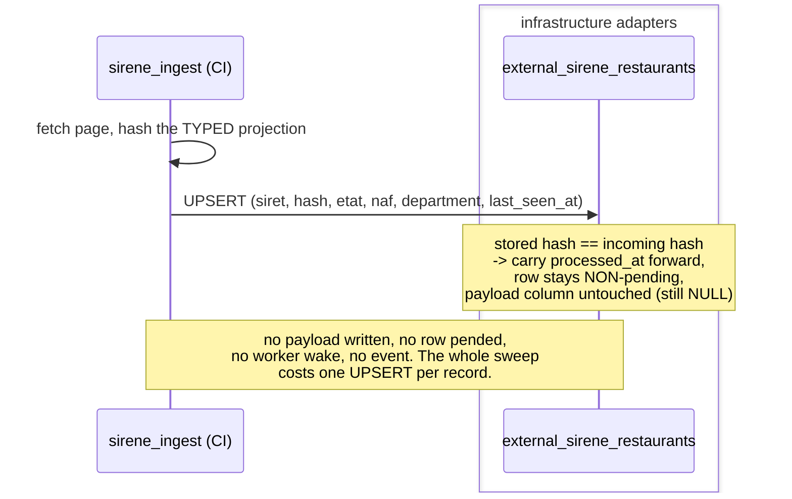
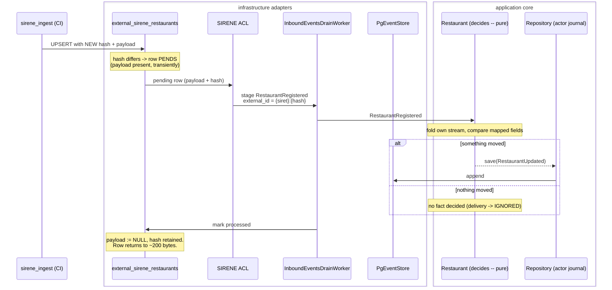
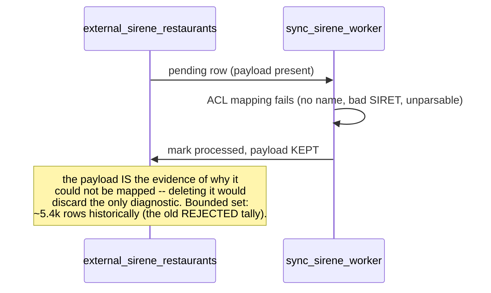

# PROP-20260728-120931 — The SIRENE mirror's payload is TRANSIENT; the hash is what persists

- **Status**: Proposed
- **Date**: 2026-07-28
- **Tracking issue**: [#231 "The SIRENE mirror stores verbatim INSEE payloads (~1.8 kB/row) to read 5 fields — it is 77% of the database and blocks national coverage"](https://github.com/TheCaptainCompany/captain-food/issues/231)
- **Realized by**: _(filled at completion)_

---

## TL;DR

`external_sirene_restaurants` keeps the **verbatim INSEE record forever** so it can read five fields out
of it. Measured on production today: **655 MB for 339k rows — 77% of the whole database** — at
department **37 of 101**, on a **2 GB disk with ~580 MB free**.

The proposal, in one line: **keep the payload only while the row is pending, drop it once the row has
been successfully translated, and keep the hash forever as the change-detection key.**

At steady state almost every row is processed, so the table collapses to
`siret + payload_hash + etat/naf/department + timestamps` ≈ **~200 bytes/row**. Only genuinely-changed
rows hold a payload, and only until the worker drains them.

| | today | proposed |
|---|---:|---:|
| per row | ~1.8 kB | ~200 B |
| at 339k rows (dept 1–37) | 655 MB | **~90 MB** |
| projected full France | ~2 GB | **~250 MB** |

This is the change that makes national coverage affordable — [#218](https://github.com/TheCaptainCompany/captain-food/issues/218) paced the sweep correctly, but pacing does not create disk.

---

## 1. The problem, measured

Live numbers from the production database, 2026-07-28:

| table | rows | size | share |
|---|---:|---:|---:|
| `external_sirene_restaurants` | 339,077 | **655 MB** | **77%** |
| `domain_events` | 116,276 | 128 MB | 15% |
| `restaurant` | 116,100 | 45 MB | 5% |
| `prospectionpipeline` | 116,100 | 14 MB | 2% |

Disk: **2 GB total, 1.42 GB used** (850 MB database + 410 MB WAL + 160 MB system), Free plan, project
already flagged *exceeding usage limits*. A `VACUUM FULL` on this table failed with
`No space left on device`.

The WAL is **not** the lever — no replication slots pin it, no archiver failures, and it sits inside the
configured `max_wal_size = 1024 MB` as a recycled reservation. Both levers to shrink it (`CHECKPOINT`,
`ALTER SYSTEM`) are permission-denied on this plan, and shrinking it would force more frequent
checkpoints, i.e. *more* disk IO — the budget that triggered
[#220](https://github.com/TheCaptainCompany/captain-food/issues/220) in the first place.

**What the payload is actually used for.** The ACL
(`crates/infrastructure/src/integrations/sirene.rs`) reads exactly five things:

- `siret`
- name (enseigne → denomination usuelle → denomination fallbacks)
- address
- `activitePrincipaleEtablissement` (NAF)
- `etatAdministratifEtablissement`

Everything else in the record is stored and never read. The `sirene_ingest` wire types
(`crates/sirene_ingest/src/wire.rs`) already deserialize only that stable business subset — which is
precisely why [#226](https://github.com/TheCaptainCompany/captain-food/pull/226)'s `payload_hash` hashes the *typed projection* rather than the raw
JSON.

---

## 2. The model

### 2.1 The payload has a lifetime; the hash does not

Today both are permanent. The insight (product owner, this session) is that they have **different
lifetimes**:

- the **payload** is an input to translation — needed from the moment INSEE reports a change until the
  worker has turned it into a domain fact, and never again;
- the **hash** is the change-detection key — needed forever, because every future sweep compares
  against it.

So:

```
ingest sees a record
  └─ hash matches stored hash?  ── yes ─→ nothing changed. Row stays non-pending.
                                          No payload written. (the ~99% case at steady state)
                                └─ no  ─→ write payload + new hash, re-pend the row.

worker drains a pending row
  └─ translates it (ACL → inbound event → aggregate decides)
  └─ marks processed  ─→ payload := NULL, hash retained
```

### 2.2 Why "store only the hash" cannot be literal

The obvious reading — never store the payload at all — does not work, and it is worth stating why so
nobody re-proposes it:

- the **on-app worker** reads `payload` to run the ACL. With no payload there is nothing to translate.
- the **CI ingest crate cannot translate instead**: ADR-0045 deliberately keeps domain logic out of it
  so the version-sensitive ACL runs only on the deployed server. That was the fix for the retired
  direct-write binary's version-skew hazard, and it should not be undone to save disk.

Hence *transient*, not *absent*.

### 2.3 What survives payload deletion

Nothing else depends on the raw record, which is what makes this safe:

| concern | reads | unaffected? |
|---|---|---|
| detect-by-absence | `last_seen_at`, `etat` | ✅ separate columns |
| department partitioning / sweep ordering (#218) | `department`, `last_seen_at` | ✅ separate columns |
| change detection | `payload_hash` | ✅ that is the point |
| pending predicate | `processed_at`, `last_seen_at` | ✅ unchanged |
| ACL translation | `payload` | ✅ present exactly when pending |

### 2.4 What is genuinely lost

**Replay and backfill.** `integration_staging.yaml` justifies raw retention for "dedupe, verification
provenance, replay/backfill". After this change, an ACL that learns to read a *new* INSEE field cannot
re-translate from the mirror — it must re-fetch from INSEE.

The case for accepting it: INSEE is the system of record, the mirror is a cache of it, and since #218
the sweep is stalest-first and budgeted, so a full re-fetch happens naturally across runs rather than
needing a special operation. The case against: a re-fetch is ~4 hours of quota-paced API calls and
depends on INSEE being available and unchanged.

This is D5 below — it is the one real trade in the proposal and it deserves an explicit answer rather
than being absorbed silently.

---

## 3. Sequence diagrams

### 3.1 The steady-state sweep — the ~99% case



### 3.2 A record that actually changed



### 3.3 The unmappable row — payload deliberately retained



---

## 4. Screen mockups

**None — this proposal has no user-facing surface.** It changes what a staging table retains; no screen
reads `external_sirene_restaurants` (it is adapter-owned and deliberately not a GraphQL `reads` target,
per `integration_staging.yaml`).

The one place a human observes this pipeline is the admin SIRENE panel sketched in
[PROP-20260728-004616](PROP-20260728-004616-slug-lifecycle-and-sirene-inbound-events.md) §4.5, which reads
`inbound_events` status counts — **unchanged by this proposal**. Recorded here explicitly rather than
omitted, per the mockups-required rule: the honest answer is that there is nothing to draw.

---

## 5. Decisions this proposal asks the product owner to make

### D1 — What does the mirror retain?

| option | pros | cons |
|---|---|---|
| **Payload transient (NULL after successful processing), hash permanent** ← recommended, and the product owner's proposal | Smallest steady state (~200 B/row, ~90 MB today / ~250 MB full France). Keeps **verbatim** fidelity for exactly the rows being translated, so the ACL never reads a lossy projection. Nothing else depends on the payload (§2.3) | Replay/backfill needs a re-fetch (D5) |
| Store the mapped fields permanently, drop raw (the original #231 sketch) | Also small (~250 B/row); replay possible for the *mapped* fields | The ACL would read a projection made by an older ingest — reintroducing exactly the version-skew ADR-0045 removed. Strictly worse than the above |
| Keep raw forever (today) | Full replay/backfill; no migration | 655 MB → ~2 GB at full coverage. Does not fit the disk on this plan or the next |
| Keep raw for a bounded window (e.g. 30 days) | Compromise: recent replay stays possible | A window is the worst of both at this scale — a weekly sweep touches every row, so a 30-day window retains ~4 sweeps' worth of payloads and saves little |

### D2 — Hash algorithm and encoding

| option | pros | cons |
|---|---|---|
| **Keep SHA-256, switch storage hex text → `bytea`** ← recommended | Already implemented and tested (#226). `bytea` halves it, 64 B → 32 B (~11 MB at current rows) | A migration touches the column anyway, so this is free to include |
| Switch to MD5 | 16 B as `bytea`; another ~5 MB | Re-implements and re-tests working code for a rounding error against the ~575 MB the payload change saves. Collision risk is irrelevant here either way — nobody is crafting INSEE records to collide |
| Leave as SHA-256 hex text | Zero work | Wastes 32 B/row for no reason while we are already migrating the table |

**Naming note:** keep the column `payload_hash`, **not** `payload_md5`. Naming a column after an
algorithm pins the schema to it — changing algorithm later would cost a migration purely to rename.

### D3 — Unmappable / failed rows

| option | pros | cons |
|---|---|---|
| **Keep the payload for rows that could not be mapped** ← recommended | The payload is the only evidence of *why* INSEE's record was unusable. Bounded set (~5.4k historically) | A small permanent tail of full payloads (~10 MB) |
| Null it like any other processed row | Uniform rule, marginally smaller | Throws away the diagnostic exactly where it is needed. A silent unmappable row with no evidence is how a systematic mapping bug hides |

### D4 — Migration strategy on a disk with ~580 MB free

> **⚠️ The hash must be recomputed BEFORE any payload is dropped.** Every existing row carries the
> sentinel `payload_hash = 'unhashed-pre-20260728'` from #226's backfill — a deliberate
> matches-nothing value. If payloads are nulled while that sentinel stands, the next sweep sees a hash
> mismatch on all 339k rows, re-pends every one of them and re-writes all 655 MB, defeating the change
> entirely. So the one-shot compaction is: **for each row — parse payload → compute real hash → store
> hash → null payload**, in that order, batched.
>
> That ordering also constrains WHERE it can run. Parsing the payload to hash it is the ingest crate's
> typed projection (`sirene_ingest::wire`), and deciding whether a row is *unmappable* (D3 — those keep
> their payload) is the ACL, which lives only on the deployed server (ADR-0045). A compaction that runs
> in CI can hash but cannot classify, so it would strip the diagnostic payloads D3 exists to preserve.
>
> Note also that a plain `VACUUM` makes the freed space **reusable but does not return it to the OS** —
> the file stays 655 MB. What actually reclaims disk is a `VACUUM FULL` *after* compaction, which
> becomes affordable precisely because the live data is then ~90 MB rather than 620 MB (the earlier
> attempt failed with `No space left on device` needing ~620 MB of headroom).


| option | pros | cons |
|---|---|---|
| **Batched `UPDATE … SET payload = NULL` in chunks, with a `VACUUM` between batches** ← recommended | Works within the headroom available; no table rewrite; can be paused/resumed | Slow (339k rows); leaves bloat until vacuumed, so it must interleave rather than vacuum once at the end |
| Single `UPDATE` over the whole table | One statement | Generates ~655 MB of dead tuples and a large WAL burst on a disk that has already returned `No space left on device`. Likely to fail outright |
| New table + swap | Clean, no bloat | Needs free space equal to the *new* table — feasible (~90 MB) but requires a schema swap and a deploy window |
| Let it drain naturally (only new sweeps null payloads) | Zero migration risk | The existing 655 MB never goes away, which is the entire point |

### D5 — Replay/backfill posture *(the substantive one)*

| option | pros | cons |
|---|---|---|
| **Accept re-fetch from INSEE when a new field is needed** ← recommended | INSEE is the system of record; the mirror is a cache. Since #218 a full re-fetch is a normal paced operation, not a special one | ~4h of quota-paced calls, and depends on INSEE availability. A field INSEE has since *changed* cannot be recovered as it was |
| Keep a raw archive elsewhere (object storage) | Full replay retained, off the database disk | New infrastructure and a new retention/GDPR surface for company data, to serve a hypothetical |
| Do not change retention (reject this proposal) | No trade at all | National coverage stays unaffordable |

---

## 6. Completeness obligations (ADR-0032)

No new commands, events, errors, mutations or queries — this is a storage-shape change behind an
existing adapter. What it does need:

- `specs/database/tables/integration_staging.yaml`: `payload` becomes nullable with its lifetime
  documented; `payload_hash` type change (D2); the retention note rewritten (it currently says
  "NO RETENTION … detect-by-absence needs the complete row set" — still true of *rows*, no longer true
  of *payloads*, and that distinction is exactly what a future reader will trip on).
- A migration (D4) + `REQUIRED_SCHEMA_VERSION` bump.
- Ingest: the UPSERT stops writing `payload` when the hash matches.
- Worker: `mark_processed` nulls the payload on success, keeps it on unmappable (D3).
- Tests: a processed row retains its hash and loses its payload; an unchanged record does not re-pend
  and writes no payload; an unmappable row keeps its payload.
- Measured before/after size on production, recorded in `docs/STATUS.md`.

## 7. Considered alternatives (whole-proposal level)

| alternative | why it lost |
|---|---|
| **Upgrade the Supabase plan** | Buys room without changing the ratio — still storing ~9× what is read, and still scanning ~9× the pages. Worth doing anyway for the Nano compute (0.5 GB RAM is why this table never stays cached), but it is not a fix |
| **Compress the payload column** | Postgres already TOAST-compresses large `jsonb`; the 1.8 kB/row figure is *after* that |
| **Keep V0 scope (department 37 only)** | Fits today and needs no work, but defers the question until national discovery matters — and the sweep is now capable of national coverage, so the constraint would be storage rather than a decision |
| **Clean up WAL instead** | Investigated and rejected on evidence: no slots pinning it, no archiver failures, both shrink levers permission-denied, and shrinking it trades disk for the IO budget that was already alerting. It is ~410 MB against a 655 MB table that triples |
