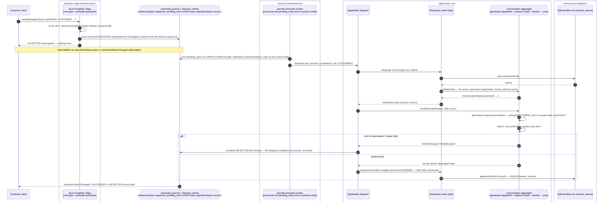

# PROP-20260728-135632 — Aggregate state as spec: declared, event-lineaged, and the ground `requires:` stands on

- **Status**: Proposed
- **Date**: 2026-07-28
- **Tracking issue**: [#235 "Write-side per-instance authorization: actors must check the acting principal against the instance (and stop trusting claimed roles)"](https://github.com/TheCaptainCompany/captain-food/issues/235)
- **Extends / corrects**: [PROP-20260726-171500 "Write-side per-instance authorization"](PROP-20260726-171500-write-side-per-instance-authorization.md) — the product-owner correction on
  [#235](https://github.com/TheCaptainCompany/captain-food/issues/235) (2026-07-28: *"the actor can by
  itself check the rule because he has the state to help him"*) moved the write-side check from
  `ScopeMembership` to **aggregate state**; this proposal designs the DSL that makes that check
  declarable and generatable.
- **Realized by**: _(filled at completion)_

---

## 1. Context

[#235](https://github.com/TheCaptainCompany/captain-food/issues/235) established that the write-side
per-instance check belongs **in the aggregate, against its own folded state** (strongly consistent by
construction), and sketched a `requires:` block on the actor inbox:

```yaml
requires:
  participant: true      # rejected: "participant" is Conversation-specific; codegen would have to GUESS
  asRole: authorRole     # rejected: hides the anti-forgery rule behind a name
```

The design conversation (resumed here from claude.ai) replaced that with an explicit shape — an
equality between the **envelope** and either **state** or **command**, over three namespaces
(`actor.*`, `state.*`, `command.*`):

```yaml
requires:
  acting:                      # actor.id must equal the state field mapped to the actor's ROLE
    CUSTOMER:   state.customerId
    RESTAURANT: state.restaurantId
    ADMIN:      any            # exemption stated, never implied
  claims:                      # payload fields pinned to a verified envelope value (anti-forgery)
    authorRole: actor.role
```

That shape immediately exposed the missing foundation, which is the product-owner directive this
proposal answers:

> **We need to declare the state in the spec for a more strongly typed DSL. We need to indicate,
> like the projection, what property will be filled by what event's property.**

Today aggregate state exists **only as hand-written Rust** (`crates/domain/src/conversation.rs`
`ConversationState`, `order.rs` `OrderState`, …). The spec knows nothing about it, so:

- `requires.acting.CUSTOMER: state.customerId` would reference something the **validator cannot
  resolve** — an unresolvable reference in a DSL whose whole point is checkable `$ref`s.
- The fold itself is unverifiable: nothing proves `ConversationState` folds what its events carry
  (and indeed it folds **no participants at all** — consequence A of #235).
- Codegen cannot scaffold handlers with the check "actor.id == state.customerId" if `state` is not
  a spec-level object.

The repo already has both halves of the answer, in two places that this proposal unifies:

| Existing precedent | What it proves |
|---|---|
| `actors.yaml` `lifecycle:` (ADR-20260720-004419) | An aggregate's fold-relevant structure can be **declared on the actor** and generated into `crates/domain/src/generated/lifecycles.rs` |
| `projection_views.yaml` `columns.<name>.from:` (ADR-0039) | Per-field **event-property lineage** (`from: [$ref …/properties/x]`), with fold **modes inferred from the lineage shape** (scalar-latest, occurrence, derive) |

An aggregate's state **is a fold** — the same kind of object as a projection, differing only in
where it runs (write-side rehydration vs read model) and in needing two modes projections don't
(sets with removal, presence flags). So the DSL should say so, with the same vocabulary.

## 2. The DSL

### 2.1 `state:` on the aggregate (new block, sibling of `lifecycle:`)

```yaml
<Actor>:
  type: aggregate
  state:                # the actor's private folded state — DECLARED, typed, event-lineaged
    <fieldName>:
      type: <$ref scalars.yaml | boolean | …>   # same typing rules as projection columns
      from: [ <event(-property) $refs> ]        # the lineage: which event property fills it
      nullable: true                            # optional: absent until a carrying event arrives
      mode: latest | flag | set | count         # optional: inferred from the lineage shape
      removedBy: [ <event-property $refs> ]     # set/count modes: the removal/decrement lineage
      note: "…"                                 # optional: which invariant this field serves
```

Fold modes — **the same inference rule as projections** (`mode` optional, derived from `from`):

- **`latest`** (default): `from` refs point at `/properties/`; the newest carrying event wins.
  Set-once fields (property carried only by the birth event) fall out automatically — the exact
  rule projections already use for `scalar-latest`.
- **`flag`**: `from` refs are **whole events** (no `/properties/`) and `type` is boolean — presence
  of any such event sets it `true`. The boolean analog of projections' `occurrence`.
- **`set`** (explicit): an accumulating set. `of:` gives the element type (one `$ref`, or a named
  map for composite elements — element properties are read off the carrying event's payload by
  name); `from:` adds, `removedBy:` removes.
- **`count`** (explicit; added 2026-07-30 — the product owner's `messageCount++` example): an
  integer incremented once per carrying-event occurrence (`from` refs are whole events);
  `removedBy:` decrements. Where a `set` already exists, prefer its size; `count` is for tallies
  whose members need not be retained.

`status` is **deliberately not declarable in `state:`** — it already has a source of truth, the
`lifecycle:` block. The generated state struct includes `status` whenever a lifecycle is declared;
declaring it twice is a validation error (`st-status-duplicated`). One field, one owner.

### 2.2 `requires:` on the inbox entry, referencing the declared state

```yaml
    - message: { $ref: 'commands.yaml#/PostMessage' }
      requires:
        acting:
          CUSTOMER:   state.customerId       # actor.id (domain identity) == folded customerId
          RESTAURANT: state.restaurantId
          ADMIN:      any                    # explicit exemption — a decision, written down
        claims:
          authorRole: actor.role             # payload field pinned to the verified envelope
      emits:  [{ $ref: 'events.yaml#/MessagePosted' }]
      throws: [ … ]
```

Semantics (all fail-closed):

- `acting` keys are `UserType` values; the value is a `state.<field>` path or the keyword `any`.
  **A role with no entry is denied** — adding a role to the mutation's `roles:` in `api.yaml`
  without adding it here fails, visibly, at validation time.
- `claims` keys are command-payload properties; the value is an envelope path (`actor.role`,
  `actor.id`). The generated check rejects with `RoleMismatch` when they differ.
- Failing `acting` rejects with `NotAParticipant` (new `errors.yaml` entries per #235's DoD).

### 2.3 The fold is generated INTO the actor — `apply(state, event)` methods on the aggregate

> **Amended 2026-07-28 (product-owner objection, same principle as D4):** the first draft had the
> Repository folding "via generated states.rs" — the state build would live **outside the actor**,
> so unit tests of the actor would never execute it. The fold is the actor's own behaviour and must
> be testable AS the actor.

Codegen therefore emits, **on the aggregate itself** (the shape the hand-written aggregates and the
`crates/domain` `Aggregate` trait already have — generation replaces them at parity, it does not
invent a new contract):

- one **`apply` per (state, received event)** pair, derived from that event's `state:` lineage —
  e.g. `ConversationState apply(ConversationState state, MessagePosted e)` appends `e.messageId`
  to `messageIds` and nothing else, because that is all `MessagePosted` carries lineage for;
- **`fold(events)`** = the birth event's constructor + the left-fold of `apply` — the existing
  `Aggregate` trait contract (`None` until the birth event, exactly like today's hand-written
  `conversation.rs::fold`).

The emission can still land in `generated/states.rs` as a file, but its content is `impl` blocks
**on the actor types** — the Repository calls `Conversation::fold(events)`, the actor's own method,
and holds no fold logic of its own. Actor unit tests then exercise the state build directly (events
in, state fields asserted), which is also what makes the `requires` negatives ordinary actor tests
(D4): one test surface — the actor — covers fold, authorization, and invariants.

### 2.4 `principals:` — the role → domain-identity type map (file header, declared once)

`state.customerId` is a `CustomerId`; the actor envelope today carries an auth `sub`
(consequence B of #235: comparing those value spaces would silently never match). The validator
needs to know, per role, **which scalar the resolved domain identity is**:

```yaml
# actors.yaml header
principals:
  CUSTOMER:           { id: { $ref: 'scalars.yaml#/CustomerId' } }
  RESTAURANT:         { id: { $ref: 'scalars.yaml#/RestaurantId' } }
  RESTAURANT_ACCOUNT: { id: { $ref: 'scalars.yaml#/RestaurantAccountId' } }
  RIDER:              { id: { $ref: 'scalars.yaml#/RiderId' } }
```

Now `acting.CUSTOMER: state.customerId` is **type-checked end to end**: the state field's `type`
must equal `principals.CUSTOMER.id`, and the state field's lineage must resolve to event properties
of that same scalar. A typo'd field, a role matched against the wrong id, or a state field the
aggregate never folds — all become validation errors, not production allow/deny bugs.

## 3. Worked example — Conversation, in full

Requires one event change (consequence A of #235): `ConversationOpened` gains
`customerId` (`nullable: true` — guest orders have no customer), mirroring how `OrderPlaced`
already carries both `restaurantId` and nullable `customerId`.

```yaml
Conversation:
  type: aggregate
  state:
    customerId:
      type: { $ref: 'scalars.yaml#/CustomerId' }
      from: [{ $ref: 'events.yaml#/ConversationOpened/properties/customerId' }]
      nullable: true      # guest order → no customer participant; acting.CUSTOMER then denies
      note: "The participant `requires.acting.CUSTOMER` authorizes against."
    restaurantId:
      type: { $ref: 'scalars.yaml#/RestaurantId' }
      from: [{ $ref: 'events.yaml#/ConversationOpened/properties/restaurantId' }]
      note: "The participant `requires.acting.RESTAURANT` authorizes against."
    customerChatEnabled:
      type: boolean
      from: [{ $ref: 'events.yaml#/ConversationOpened/properties/customerChatEnabled' }]
      note: "CustomerChatDisabled gate."
    messageIds:
      mode: set
      of: { $ref: 'scalars.yaml#/ConversationMessageId' }
      from: [{ $ref: 'events.yaml#/MessagePosted/properties/messageId' }]
      note: "MessageAlreadyPosted idempotency guard."
    adminInvited:
      type: boolean
      mode: flag
      from: [{ $ref: 'events.yaml#/AdminInvitedToConversation' }]
    mutedRoles:
      mode: set
      of: { $ref: 'scalars.yaml#/ConversationAuthorRole' }
      from:      [{ $ref: 'events.yaml#/ParticipantMuted/properties/mutedRole' }]
      removedBy: [{ $ref: 'events.yaml#/ParticipantUnmuted/properties/mutedRole' }]
      note: "ParticipantNotMuted guard."
    translations:
      mode: set
      of:
        messageId: { $ref: 'scalars.yaml#/ConversationMessageId' }
        locale:    { $ref: 'scalars.yaml#/Locale' }
      from: [{ $ref: 'events.yaml#/MessageTranslationAdded' }]   # element keys read by name off the payload
      note: "TranslationAlreadyRecorded idempotency guard."
  receives:
    - message: { $ref: 'commands.yaml#/OpenConversation' }
      # birth command — no instance exists yet, nothing to authorize against: exempt by shape
      emits: [{ $ref: 'events.yaml#/ConversationOpened' }]
      throws: [{ $ref: 'errors.yaml#/ConversationAlreadyOpen' }]
    - message: { $ref: 'commands.yaml#/PostMessage' }
      requires:
        acting:
          CUSTOMER:   state.customerId
          RESTAURANT: state.restaurantId
          RIDER:      state.riderId        # ← only once Conversation folds a rider participant;
                                           #   until then this line is ABSENT and RIDER is denied
          ADMIN:      any
        claims:
          authorRole: actor.role
      emits: [{ $ref: 'events.yaml#/MessagePosted' }]
      throws:
        - { $ref: 'errors.yaml#/ConversationNotFound' }
        - { $ref: 'errors.yaml#/NotAParticipant' }
        - { $ref: 'errors.yaml#/RoleMismatch' }
        - { $ref: 'errors.yaml#/CustomerChatDisabled' }
        - { $ref: 'errors.yaml#/MessageAlreadyPosted' }
```

Note what the declared state buys beyond authorization: every hand-written `ConversationState`
field turns out to be the ground of a **declared error** (`MessageAlreadyPosted`,
`ParticipantNotMuted`, `TranslationAlreadyRecorded`, `CustomerChatDisabled`). The state block makes
the fold that backs each `throws` entry inspectable — the `note:` fields close the loop the same
way `tests.yaml` ↔ `rules.yaml` do.

And it generalises with no special cases — `Order` (excerpt):

```yaml
Order:
  type: aggregate
  state:
    restaurantId:
      type: { $ref: 'scalars.yaml#/RestaurantId' }
      from: [{ $ref: 'events.yaml#/OrderPlaced/properties/restaurantId' }]
    customerId:
      type: { $ref: 'scalars.yaml#/CustomerId' }
      from: [{ $ref: 'events.yaml#/OrderPlaced/properties/customerId' }]
      nullable: true
    deliveryRated:
      type: boolean
      mode: flag
      from: [{ $ref: 'events.yaml#/OrderRated' }]
  receives:
    - message: { $ref: 'commands.yaml#/AcceptOrder' }
      requires:
        acting:
          RESTAURANT: state.restaurantId
          ADMIN:      any
```

## 4. Decisions surfaced

### D1 — Where the state declaration lives

| Option | Pros | Cons |
|---|---|---|
| **`state:` block on the aggregate in `actors.yaml`** ✅ recommended | State is the actor's *private* fold — actor-model semantics put it with the actor; sits beside `lifecycle:` (the precedent) and beside the `requires:` that consumes it; one file to read an aggregate's whole contract | `actors.yaml` grows (~+40 lines per aggregate) |
| New `specs/state.yaml` | Keeps `actors.yaml` lean; parallel to `projection_views.yaml` | Splits one actor across two files; every `requires:` resolves cross-file; invites treating state as a read model, which it is not |
| Extend `entities.yaml` aggregates | "Aggregate" already appears there | entities.yaml is the *shape* catalog (HubRise-aligned API/domain types); folded state is a different thing with different fields (guards, flags, idempotency sets) — merging them muddies both |

### D2 — Lineage vocabulary: reuse the projection conventions, or invent actor-specific ones?

| Option | Pros | Cons |
|---|---|---|
| **Same conventions as `projection_views.yaml`** (`from:` lineage, mode inferred from lineage shape, same typing rules) **+ two actor-only modes (`set`, `flag`)** ✅ recommended | One mental model for every fold in the system; the validator logic (resolve `$ref`, type-match property vs field) already exists for projections and is reused; the product-owner directive verbatim ("like the projection") | `set`/`flag` exist only on the actor side — the vocabularies are siblings, not identical |
| Invent a dedicated actor-state DSL | Could model richer folds (maps, counters) day one | Two lineage languages to learn and validate; divergence guaranteed; no current aggregate needs more than latest/flag/set |
| Declare state fields *without* lineage (just name + type) | Smallest diff | Fails the directive; the validator could check `requires` references resolve but not that the aggregate can actually *fold* the field — the #235 consequence-A hole (`customerId` never carried by any event) would survive |

### D3 — How deep the first landing generates

| Option | Pros | Cons |
|---|---|---|
| **Generate the state structs + the actor's `apply`/`fold` methods (§2.3, emitted like `lifecycles.rs`) and port `Conversation` to them as the pilot; other aggregates adopt under an `st-missing` warning** ✅ recommended | No declared-vs-hand-written drift for the pilot; proves the whole chain (DSL → fold → `requires` check) on the aggregate #235's holes live in; incremental adoption is the proven `lifecycle` playbook (`lc-missing`) | The pilot PR touches domain + application code, not just specs |
| Validate-only first (declare state, check `requires` refs; folds stay hand-written) | Spec-only change, straight to `main` | The declaration can silently diverge from the Rust fold — a strongly-typed DSL whose types are *aspirational* is worse than none; postpones the actual #235 fix |
| Generate everything for every aggregate at once | No warning period | Big-bang port of five+ hand-written folds in one change; high regression surface at exactly the layer that guards money-moving commands |

### D4 — Where the generated `requires` check runs

> **Amended 2026-07-28 (product-owner objection):** the first draft recommended the application
> dispatch. The product owner rejected it: *a check outside the actor cannot be covered by unit
> tests that test the actor* — the behaviour-test kind #235's DoD relies on (given events → when
> command → thrown error) would never execute it, and the aggregate's tests would prove nothing
> about authorization. #235's own framing agrees ("authorization is just one more invariant over
> that same state"), as does the 2026-07-25 decision ("for the write side the actors are
> responsible to do these business security checks"). Recommendation flipped accordingly.

| Option | Pros | Cons |
|---|---|---|
| **Inside the actor: codegen emits the precondition into the aggregate's generated handler entry — `handle(cmd, state, actor)` runs the `requires` check, then calls the hand-written decide** ✅ recommended (amended) | The actor is the authority **in its tests too**: `NotAParticipant`/`RoleMismatch` negatives are ordinary command tests against the aggregate, exactly as #235's DoD assumes; pure and trivially unit-testable (state + command + actor in, error out); the generated wrapper makes bypass impossible — the hand-written decide is unreachable without passing the check | The domain layer needs the actor identity as an explicit **input value** (an `ActorIdentity` value object — pure data, no infra); the envelope doctrine must stay sharp: the actor is an input to decide, never a payload field folded into events (ADR-0041 unchanged) |
| In the application dispatch, after rehydration, before the handler | One generated site outside domain code; hand-written handlers untouched | **A check the actor's unit tests never execute** — testing the aggregate proves nothing about authorization, and the DoD's "ordinary command tests" would silently test around the hole; splits "who may" from "what happens" across two layers |
| Inside each hand-written handler | Closest to the other invariants | Reintroduces the exact failure mode being fixed: 82 opportunities to forget, invisibly |
| At the GraphQL edge against `ScopeMembership` | Cheapest rejection | Rejected by the product-owner correction on #235 — projection lag rejects legitimate commands (open-then-post); the edge check is [#233](https://github.com/TheCaptainCompany/captain-food/issues/233)'s complementary *pre-filter*, never the authority |

### D5 — Where the role → domain-id binding is declared

| Option | Pros | Cons |
|---|---|---|
| **`principals:` map in the `actors.yaml` header** ✅ recommended | Sits with its only consumer (`requires.acting`); one place; makes the type-check rule (`state field type == principal id type`) mechanical | A second authz-adjacent vocabulary in actors.yaml (after `requires` itself) |
| In `scalars.yaml` beside `UserType` | Near the enum it annotates | scalars.yaml holds types, not bindings between types; nothing else there points across files |
| Implicit naming convention (`CUSTOMER` ⇒ `CustomerId`) | Zero DSL | `RESTAURANT_ACCOUNT` ⇒ `RestaurantAccountId` works until the day one doesn't; a convention the validator applies silently is a rule nobody can read |

## 5. Validator rules (new, `st-*` / `req-*`, all in the single `make validate` gate)

| Rule | Severity | What it proves |
|---|---|---|
| `st-from-unresolved` | error | Every lineage `$ref` resolves into `events.yaml` (event, or event property) |
| `st-event-foreign` | error | Every carrying event is emitted by (or delivered to) THIS aggregate — same rule `lifecycle` already enforces |
| `st-type-mismatch` | error | The state field's `type` equals the type of every `from`/`removedBy` property |
| `st-status-duplicated` | error | `state:` does not redeclare what `lifecycle:` owns |
| `req-state-unknown` | error | Every `state.<field>` in a `requires` resolves to a declared state field |
| `req-principal-type` | error | The state field matched by `acting.<ROLE>` has the type `principals.<ROLE>.id` |
| `req-claim-unknown` | error | Every `claims` key is a property of the command's payload |
| `req-role-alien` | error | Every `acting` key is a `UserType` value and appears in the `roles:` of the api.yaml mutation(s) bound to this command (and conversely: a mutation role with no `acting` entry and no `any` is flagged — fail-closed both ways) |
| `req-missing` | error | Every received **command** whose payload carries an existing-instance id declares `requires:` or an explicit exemption (birth commands exempt by shape) — #235's "an unscoped write must be as inexpressible as an unscoped read" |
| `st-missing` | warning | An aggregate with hand-written state but no `state:` block — the incremental-adoption nudge, exactly like `lc-missing` |

## 6. Sequence diagram — PostMessage under the generated check

> **Amended 2026-07-28 (product-owner corrections, third round — the execution-model gap is tracked
> as [#242 "Write path: command_journal becomes the consumed queue — a worker executes commands in position order, and journal completion commits in the SAME transaction as the event append"](https://github.com/TheCaptainCompany/captain-food/issues/242)):**
> (1) completing the `command_journal` row after processing (SUCCEEDED/REJECTED/FAILED) is shown —
> it is the **application dispatch's responsibility**; (2) GraphQL journals the command and returns
> **ACCEPTED, nothing more** — it never calls the dispatch; a **worker** consumes `command_journal`
> and `inbound_events` **prioritized by position** and calls the dispatch; the client follows via
> the `operationStatus` query or the `operationStatusChanged` subscription; (3) the `domain_events`
> append and the journal completion commit in **ONE SQL transaction** — no window where events
> landed but the journal reports otherwise. Today's code diverges on (2) resolver-side spawn and
> (3) completion outside the append's transaction — that gap is #242's scope, not this proposal's.
>
> **Queue mechanism directed (2026-07-28, recorded on #242):** `command_journal` and
> `inbound_events` share ONE auto-increment `position` (a common sequence), and a UNION view
> (`pending_work`) over the two pending sets — ordered by that shared position — is what the worker
> consumes, one row at a time into the application dispatch.
>
> **Superseded later the same day**: the product owner unified the two tables into ONE
> `inbound_messages` mailbox addressed by `(actor_type, actor_id)`, with per-actor-type/partition
> workers — the write path becomes an actor mailbox. The full design (including the actor-runtime
> decision) moved to its own proposal:
> [PROP-20260728-152752 "The write path becomes an actor mailbox"](PROP-20260728-152752-actor-mailbox-write-path.md).
> This section's diagram remains correct on everything inside the application core (fold,
> `requires`, decide, atomic completion); the delivery legs are refined there.



<a href="https://mermaid.live/view#pako:eNqNVttu4zYQ_ZWBX6pgtUm7KPogFCkMRVjEaLLZOGkeusWCFscyu5KoklQuTf3vnRGpm-MC9YtsmTNz5sw5I70uci1xkcDC4l8t1jleKFEYUX2pgT6idbpuqw0a_7sRxqlcNaJ2kIKwkLbW6QoN5KXC2vlTG_0MH41odp9_BZQFQqTqrRHWmTZ3rcETf-ww4Uc6TimXz201C_95Y87OI6NLhEI4hHfQGFVzUAkGrS5bp3QdkmIt30Jdcd5cV5Wo5dc_dWtqCn0Hqt7olu7gI0G3vozdCYMSGm0VZ4WelhgaSq3q4uuTNt_g_vry0zU8KnyKQTdoBB9eO-FaC5YK5H2TzAVHoLH_k4YHBrsKIHNd25b59Tk8xnDTgtvhHBYDorZG-NpINIfUMCbRNKXKO9hUxOBxLMum6UYyOSyVbYTLd8cDbrHRHMFXgqDNC0RPRtHUrJL_1fGyKDot6fqRaPJlRFEY5HH7lgusmWSaDAN_OdvqUtIEDU1HkQYg32H-jW5IzKkOfGk_fP_Dj9CMLM-an88BhBSNo8rH0WVrBndTZKySNbVEenYapK6EqoN2pkX81_T9-TkJOuFRuCu0VhQYddO4lDH7aqfNLUk6gfR-fffpKruNO9Qffgq5KLhPQayo7QusHu5iL_hHnFhgwALUee2UI8p7W17KWbZVQq1bNK43A9xmaXb5W3ZB2pRYNdpRBti8QOURM9ZBS1ujq05ywSO9NSYlqEaawDJNs5s7Svo6pNn3I6m125FcoRo0d01FQVOPkMYE0C8SoAGX-smSosUbg1FZ0pU2h3-kO1EXDKzd2Nyohv_xNR588zU-u7lhjH6CyJtZb0kbbgdhP9jYm4fyER8Ha-EkJpxCVUC0dIx0lgcnNiWOFck2yeCXKK948DkJ6FXJBMYR0VBnQtgHQimckrCTEhr77kWyAeYu2TIJXlQ-hk9TULbmEEFUOLpUvfBC4mz9fkjs9TsLJjsmzL-Mgrj72XGnXQPfWTgwZGRpArQku4iTcGXiui-hn6IY607b4Onhaz4hxDthP4HV0zkQwb0xH1HeGsPFON34HPDkda2QKmSJ0c1oxBgC3K6bkxFeiBibGxZMY5DWrvROCHxQNAnp935ufyQ-36mSQGEkIV_mdOwMfnlTq9ORpWslT8e10CfwCbtnXwgVpWMT-d0_WVNnLAZWPx8eN1kgveOOnLa8mYT8A1zqStlqvtA9d-xFXTUlEsm32SpLO0ejMdqk9M6wn6qiF_kQ4Z9NwUoxAZ4JDUuLYQeqv1EeRxtWedQt8QTC6HiKs4iJSax4xEGzy-uLEX__zF_f02rKLqiRAP7TdQZres9wRtSW59lvjAMzkchpbUC0Qdpe0pOvjRusQSvk830WebvFB1ocnj2rsCCP761kAo98fYzzRQwLEhJte0nvbK8LwlF1b28St6It3WK__xeEjE-z" target="_blank" rel="noopener noreferrer">Open this diagram with pan and zoom on mermaid.live — on github.com use Ctrl/Cmd+click or middle-click to get a NEW tab (GitHub strips target=_blank)</a> —
regenerate this link (snippet in docs/claude/mermaid.md) whenever the fenced block above changes.

## 7. Mockups — the user-visible surface is a refusal

**UC-1 — a customer posting into a stranger's conversation** (today: succeeds; after: denied).
Storefront order-tracking chat, `{slug}.captain.food`:

```
┌──────────────────────────────────────────────┐
│ Order #A1B2 — Conversation                   │
│──────────────────────────────────────────────│
│ 🍕 Le Napoli   Your order is being prepared  │
│ …                                            │
│──────────────────────────────────────────────│
│ [ You are not a participant in this          │
│   conversation.                    (⚠) ]     │  ← errors.yaml#/NotAParticipant,
│                                              │    messages.en/fr, via translations pipeline
│ [ message box — disabled ]          [Send]   │
└──────────────────────────────────────────────┘
   action: postMessage → REJECTED before the handler runs
```

**UC-2 — a customer forging `authorRole: RESTAURANT` / `visibility: INTERNAL`** (the #130 split
defeated today): no UI ever offers this — the refusal surfaces only to a crafted request, as a
GraphQL error `RoleMismatch`. The staff back-office thread stays free of forged staff notes;
nothing changes visually for legitimate users — which is the point.

## 8. Spec changes this requires (plan-mode approval, then the pilot PR)

1. `events.yaml`: `ConversationOpened` + `customerId` (nullable) — consequence A of #235.
2. `errors.yaml`: `NotAParticipant`, `RoleMismatch` (+ `rules.yaml` links, `tests.yaml` negatives —
   the ones #235 lists as failing today).
3. `actors.yaml`: header `principals:` map + field-meaning doc; `state:` + `requires:` on
   `Conversation` (pilot); other aggregates follow under `st-missing`.
4. `tools/codegen-rs`: the `st-*`/`req-*` validator rules; the state emitter — struct + per-event
   `apply(state, event)` + `fold` as methods ON the actor (§2.3); `requires` precondition emitter;
   documentation emitter section (state table per actor).
5. `crates/`: port `Conversation` to the generated state; generate the `requires` precondition into
   the aggregate's handler entry (the actor runs the check — D4 as amended, so the negatives are
   ordinary actor unit tests); extend `Actor` with the resolved domain identity (shared with #144's
   edge resolution).
6. Write-path execution model (independent of this proposal's DSL scope): resolvers journal +
   return ACCEPTED only; a worker consumes `command_journal` + `inbound_events` by position and
   calls the dispatch; event append + journal completion in one SQL transaction — tracked as
   [#242 "Write path: command_journal becomes the consumed queue — a worker executes commands in position order, and journal completion commits in the SAME transaction as the event append"](https://github.com/TheCaptainCompany/captain-food/issues/242).

## 9. Verification plan

- `make rust` green: all `st-*`/`req-*` rules firing on deliberately broken fixtures (codegen tests).
- Behaviour-test negatives that **fail on today's main**: cross-participant post; forged
  `authorRole`; RIDER posting while Conversation folds no rider (denied-by-absence).
- Drift gate: `states.rs` regenerated byte-identical in CI (the existing `check-drift` covers it).
- The #235 audit table (post/accept/reject/reclamation/refund paths) re-run against the `req-missing`
  rule — every hole either declared or explicitly exempted.

## 10. Alternatives considered and rejected earlier in the thread

- `requires: { participant: true, asRole: authorRole }` — rejected: "participant" is not a concept
  codegen can resolve per aggregate (an Order has a customer and a restaurant; a Reclamation has a
  claimant); `asRole` hides the anti-forgery equality. Both are the same shape — an equality between
  envelope and state/command — which is what `acting`/`claims` states explicitly.
- Checking writes against `ScopeMembership` — rejected on #235 (product-owner correction):
  projection lag rejects legitimate commands; the aggregate's fold is the write model and has no lag
  by construction. The edge pre-filter remains [#233](https://github.com/TheCaptainCompany/captain-food/issues/233)'s
  complementary concern.
