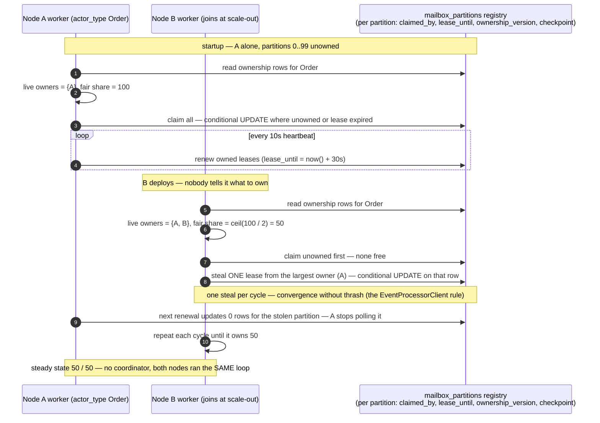
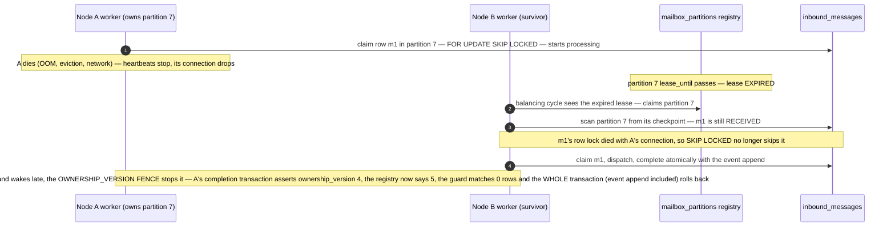
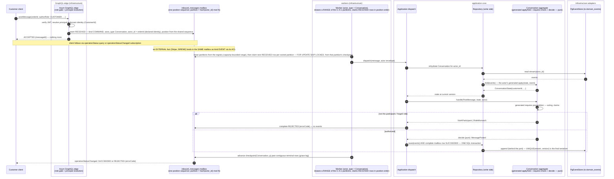

# PROP-20260728-152752 — The write path becomes an actor mailbox: `inbound_messages` replaces both journals, partitioned workers deliver to the actors

- **Status**: Proposed
- **Date**: 2026-07-28
- **Tracking issue**: [#242 "Write path: command_journal becomes the consumed queue — a worker executes commands in position order, and journal completion commits in the SAME transaction as the event append"](https://github.com/TheCaptainCompany/captain-food/issues/242)
- **Supersedes**: the union-view mechanism recorded on #242 (2026-07-28) — the product owner unified
  the two tables instead of unioning them.
- **Companion**: [PROP-20260728-135632 "Aggregate state as spec"](PROP-20260728-135632-aggregate-state-as-spec.md)
  — the actor's *inside* (declared state, generated `apply`/`fold`, `requires`); this proposal is the
  actor's *outside* (how messages reach it, durably and in order).
- **Realized by**: _(filled at completion)_

---

## 1. Context — the directives, and what they add up to

From the 2026-07-28 product-owner design session (continuing #242):

1. **One table, `inbound_messages`, replaces `command_journal` AND `inbound_events`** — everything
   the write path receives is one kind of thing: a message to an actor.
2. **`position` matters for the CHECKPOINT** — the consumption axis, not just a priority.
3. **Every message names the actor it concerns**: `actor_type` + `actor_id`.
4. **One worker per actor type, potentially per partition** — parallelism by partitioning the
   keyspace, never within one aggregate instance.

Put together, this is not "a queue in front of handlers" — it is the **actor model, realized on
Postgres**. `inbound_messages` is the durable mailbox; `(actor_type, actor_id)` is the actor
address; the partition is the dispatcher's shard; the per-instance ordering guarantee is the
actor's single-threaded illusion. The `receives:` inbox that `actors.yaml` has declared all along
becomes a **runtime** object, not just a codegen source.

The theory grounding (the names the product owner invoked):

- **Evans**: the aggregate is the consistency boundary — the unit that must see its invariants
  serialized. Everything here exists to give each `(actor_type, actor_id)` exactly one thread of
  control at a time, and to keep that machinery **outside the domain**: the pure
  `fold`/`requires`/`decide` from the companion proposal never learns what delivered its message.
- **Vernon**: aggregates map naturally onto actors — small, referenced by id, communicating
  asynchronously; between aggregates, eventual consistency via process managers. His operational
  warning (*Reactive Messaging Patterns*): distribution means **at-least-once delivery + idempotent
  receivers**, never exactly-once transport. We already hold both ends: `message_id` dedupe at the
  mailbox, fold-level dedupe in the aggregate.
- **Greg Young**: you do not need an actor framework to get a single writer — **optimistic
  concurrency on the stream is the serializer** (`UNIQUE(stream_name, version)` already is). The
  log is the truth; queues and checkpoints are delivery mechanics and caches. Partitioned
  competing consumers are a *throughput* device, not a *correctness* device — correctness lives in
  the version check and in idempotency.

That last point is the crux of the framework question in §4/D2.

## 2. The `inbound_messages` mailbox

One row = one message to one actor. Declared in `specs/database/tables/journals.yaml` (replacing
the two current tables there):

| column | type | meaning |
|---|---|---|
| `position` | `bigint` from ONE sequence, unique, NULL until due for scheduled rows | the checkpoint/consumption axis — assigned at insert for immediate rows, at PROMOTION for scheduled ones (§3.4) |
| `message_id` | `uuid` PK | idempotency identity: the client's acceptance handle (commands), UUIDv5 of `(source, external_id)` (inbound facts) |
| `kind` | enum `COMMAND` \| `EVENT` \| `MESSAGE` | can the sender be told "no"? (the request/report split, now a column) — `MESSAGE` = a plain note, typically a reminder to self (§3.4): neither rejectable nor a business fact |
| `actor_type` | text | the addressed actor — **validated against the `actors.yaml` catalog** |
| `actor_id` | `uuid` | the addressed instance (= stream id) |
| `partition` | `smallint` | `hash(actor_id) mod N` per actor type — stamped at insert so consumption filters cheaply |
| `message_type` | text | `PostMessage`, `PaymentCaptured`… — **validated: in that actor's `receives:`** |
| `payload` | `jsonb` | the commands.yaml / events.yaml body |
| `channel` | enum | GRAPHQL \| WORKER \| EXTERNAL |
| `user_id`, `user_type`, `correlation_id`, `cause_id` | envelope | ADR-0041 — the acting principal and causality chain |
| `status` | enum | `SCHEDULED` → (`CANCELLED` \| promotion) → `RECEIVED` → `SUCCEEDED` \| `REJECTED` \| `FAILED` \| `IGNORED` \| `DUPLICATE` (merges both tables' vocabularies + the reminder lifecycle §3.4) |
| `scheduled_at` | `timestamptz`, NULL | reminders/scheduled operations: eligible only once due (§3.4) |
| `error`, `received_at`, `completed_at` | | rejection payload + timestamps |

What each old table contributed: `command_journal` brings the acceptance-first contract
(`operationStatus` reads `kind = COMMAND` rows by `message_id` — the API contract does not move);
`inbound_events` brings the source/external-id dedupe and the IGNORED/DUPLICATE outcomes. The
retention sweep (#18) and stale-RECEIVED sweep carry over unchanged in spirit.

**The addressing needs one new DSL fact.** To stamp `actor_type`/`actor_id` at insert, codegen must
know, per message, **which payload property is the aggregate identity**. Today that is implicit
(handlers read `cmd.order_id` by convention). The aggregate declares it once:

```yaml
Conversation:
  type: aggregate
  identity: orderId        # the payload property every received message carries as actor_id
  state: …
```

Validator: every message in `receives:` has the `identity` property in its payload (or the message
declares its own override); its scalar type is the aggregate's id type. This closes the loop with
the companion proposal: `identity` is to *addressing* what `state:` lineage is to *folding* —
nothing left for a handler to know by convention.

**The partition count is declared on the actor too** (product-owner refinement, 2026-07-28):

```yaml
Order:
  type: aggregate
  identity: orderId
  mailbox:
    partitions: 100      # keyspace WIDTH for this actor type — see below: workers own RANGES of it
```

`partitions` is the **keyspace width**, not the worker count — fixed and deliberately wide (default
100), because changing it re-maps every `actor_id` and is a drain-then-resize migration, while
*worker* scaling never touches it (D3/D6). The DSL is the single source: codegen emits the constant
into the generated GraphQL dispatch and the adapter ACLs (both stamp
`partition = hash(actor_id) mod N` at insert), seeds the partition registry (§3), and the validator
checks `1 ≤ partitions ≤ smallint` and that the value never silently changes between generations
(a diff in the generated constant is a reviewable, deliberate act).

One correctness detail the stamping forces: the hash must be **stable and documented** — the same
`actor_id` must land in the same partition from every writer, every language, every deploy. Rust's
default hasher (SipHash with per-process random keys) is disqualified by design; use a fixed,
boring function over the uuid bytes (e.g. CRC32C, or the uuid's low 64 bits) `mod N`, named in the
generated code and never changed without a keyspace migration.

### 2.1 The typed actor client — the ONLY door to the mailbox (product-owner directive, 2026-07-30)

No layer touches `inbound_messages` directly, in either direction — not GraphQL, not the adapter
ACLs, not process managers. Codegen emits **one strongly-typed client per actor type** (it has
everything it needs in `actors.yaml`: `receives` → the send overloads, `identity` → the
constructor parameters, `mailbox.partitions` + the frozen hash → the partition stamp):

```rust
// generated from actors.yaml — the clean entry point for the client layer
let conversation = ConversationClient::for_order(order_id);      // identity params, strongly typed
conversation.send(Envelope::new(post_message, principal)).await?;        // -> ACCEPTED {message_id}
conversation.schedule(Envelope::new(post_message, principal), at).await?; // -> SCHEDULED (§3.4)
```

- **`send` knows every column** — kind (from the message's catalog file), `actor_type`,
  `actor_id` (extracted via the declared `identity`), `partition` (the frozen hash), envelope
  fields, payload serialization, the idempotent-insert semantics (PK replay / payload-hash
  conflict). The caller cannot fill a column wrong because the caller cannot see columns.
- **The inbox is enforced by the type system**: a `ConversationClient` exposes
  `send(Envelope<PostMessage>)`, `send(Envelope<EscalateToAdmin>)`, … and nothing else — sending
  a message the actor does not `receive` is a **compile error**, not a runtime rejection.
- **Status reads are symmetric**: a generic `OperationStatusClient` (`status(message_id)` /
  `watch(message_id)`) backs the `operationStatus` query and the `operationStatusChanged`
  subscription — nobody SELECTs the table either.
- A GraphQL resolver collapses to three generated lines: build the client from the input's
  identity, `send`, return the acceptance. The worker-side channels (HubRise enricher, SIRENE
  ACL, PM emissions) use the same clients with `channel: WORKER | EXTERNAL` — one insertion
  logic, centralized, generated.
- **Process managers get clients too** (D5): a PM that `receives:` a command is directly
  addressable from GraphQL through its own generated client — an actor is an actor.

## 3. Consumption: partitions, ordering, checkpoint

- **Workers own partition RANGES, not single partitions** (product-owner refinement, 2026-07-28):
  with `partitions: 100`, one worker instance serves the whole range 0–99; two instances split it
  (0–49 / 50–99); ten split it again — the Kafka consumer-group shape. The mechanism is a
  **partition registry**: `mailbox_partitions` with one row per `(actor_type, partition)`, seeded
  from the DSL's `partitions` count, each row carrying the partition's **checkpoint**, its
  **lease** (`claimed_by`, `lease_until`), and its **`ownership_version`** (the fencing counter — §3.1). A worker starts with an actor type and a capacity,
  acquires leases on unclaimed-or-expired partition rows up to capacity, heartbeats to renew, and
  processes each owned partition with
  `WHERE actor_type = T AND partition = P AND status = RECEIVED ORDER BY position`
  (rows claimed `FOR UPDATE SKIP LOCKED`). A crashed worker's leases expire and are picked up by
  the survivors — rebalancing and failover with no coordinator, which also answers #193's
  single-flight concern for this path.
- **The guarantee that matters**: all messages for one `actor_id` hash to one partition, so one
  aggregate instance is processed by exactly one worker at a time, in position order — the actor's
  single-threaded illusion. Across aggregates: no ordering promised (Vernon/Young: don't promise
  what nothing should depend on). The ultimate guard stays `UNIQUE(stream_name, version)` — even a
  partitioning bug cannot double-write a stream; it can only cause a retryable conflict.
- **Checkpoint** per `(actor_type, partition)`: advances past a position only when every row at or
  below it in that partition is terminal — it bounds the scan, it does not define truth
  (per-row `status` does). One honest caveat, inherited from any sequence-based position:
  `nextval` order is *assignment* order, not *commit visibility* order, so a row can appear below
  an already-advanced checkpoint. Three mitigations, all cheap: inserts are their own tiny
  transactions (the GraphQL insert and the ACL staging insert already are — milliseconds of
  window); the checkpoint advance applies a small grace lag; a periodic below-checkpoint audit
  sweeps anything that slipped (paranoia, expected to find nothing). Greg Young's framing: the log
  is the truth, the checkpoint is a cache — treat it like one.
### 3.1 The lease protocol — how partitions dispatch themselves across nodes

**The pattern is lease-based partition load balancing.** It is exactly what **Azure Event Hubs'
`EventProcessorClient`** (formerly *Event Processor Host*) does: every consumer node declares its
presence by writing **ownership records into a shared store** — blobs in a storage container
there, rows in `mailbox_partitions` here — and the "dispatching" that seems automatic is each node
independently running the **same greedy balancing loop** against that store. No coordinator
assigns anything; balance is emergent. (Kafka reaches the same end differently — a broker-side
group coordinator runs the assignment — which is precisely the component this design avoids
needing. The lease idea itself is Gray & Cheriton's, and it also underpins Orleans' grain
placement and Service Fabric's partition ownership.)

The loop every node runs, each cycle (~10s):

1. **Read** all ownership rows for its actor type.
2. **Count live owners** = distinct `claimed_by` with an unexpired `lease_until` (a node "declares
   its presence" simply by holding fresh leases — there is no separate membership table).
3. **Fair share** = `ceil(partitions / live owners incl. self)`.
4. If it owns **less** than fair share: claim **unowned or expired** rows first; if none are free,
   **steal ONE** lease from the largest owner — one per cycle, the EventProcessorClient rule that
   makes rebalancing converge instead of thrash.
5. **Renew** (heartbeat) the leases it holds; **release** down to fair share if over.

Every claim/steal/renew is one **conditional UPDATE** — `SET claimed_by = me, lease_until =
now() + 30s WHERE partition = P AND (claimed_by IS NULL OR lease_until before now() OR claimed_by
= me)` — so Postgres row atomicity is the referee: of two nodes grabbing the same lease, one
updates one row, the other updates zero and moves on.

#### Claiming and rebalancing — a second node joins

<a href="https://mermaid.live/view#pako:eNqVVE1v2zAM_SuETw7mtW63HhpsBew12GltsY9bgUCWmVirLHqU3NQo-t9H2_maOwxYDkkk8pGPj6SeI00lRnOIPP5q0Wm8NmrNqr53IB_VBnJtXSCP50ZxMNo0ygXIQHm4EbT82xA_IEOsdCBehq5BuOUSefYalu9h-R72k4zzoAJ4rSy-pTb8Bfh18bmH1srYgp6WgykYEiDj2vjA3YeCT6_iRiLujXPQVpkay2XRJWBReVy2LhibAG0csq9Ms3yUX_FNQFeoHxoh0-cfGdxQQCDxgCwRBnPwQWK3Ddy35-nZ-14FSw4TOOKTnpxcXkLr-gzlGCZ7e3U1wBlVeUgNTBsPK-JRroNvNgdrHnHrCR_hOXtJYKUMg68Uo9ycpekk9lCq8LE7cppcOXBSFn7cXWffF7CpUNBbbiCJB00AnxrDO7KWqAGUmjtJ4qFCKa1AFUbrpByHGxiDDZE8xEcqC03JFM_gDbxL_bap6MqptvlcpqHExlLnd-QdFVR2ENBaDyYIcxmQQH2yEZ7_h6a9b_5a0wTyqawajY1FWziF85mcL9JJtlHlnYIrwz4cKDuEFSNOID6gdOD2ZrFVe8VUQ6gQrOI1Cn6gBHE2-0fnyAlEJJDyXsk3jmaffUzV74DutMWjeOK47hccNiZUsmISjZWvIO6JLB7RhTsmjd4Tf7JGjsCtxdlkxhw-hbHrkqZtShWk5elB8z6YD2TRHTbisCtiaTw0ZK1xa2nqH81hbGTIAJWutuTHGTKDPn7fieOVzEdxZU5kL-X6ou-bfO0bIpUTl8YpeZgSKChUclkKZ1ZuIPst-7IYJj5KIKqR5X0p5T18jsRYDy9jiSvV2hC9vPwGadOznA" target="_blank" rel="noopener noreferrer">Open this diagram with pan and zoom on mermaid.live — on github.com use Ctrl/Cmd+click or middle-click to get a NEW tab (GitHub strips target=_blank)</a>



#### Failover — a node dies mid-flight

<a href="https://mermaid.live/view#pako:eNptVGFP4kAQ_SuTflGTXiIXL5fwwQSknkSkBD29DyZk2I6wYbvb29mCxPjfnW1B5Ty-UNh9b957M9OXRLmCki4kTH9rsooGGhcey0cL8sE6OFuXc_Lt7wp90EpXaAP0ABnGgpanjfMr8nDsNpbbS0E7Cz9PvsL677D-O4xrv9Zr5_9zfZr9ioAStZm759k7N4Onhebgt18xN00NbeeutsWsJGZcED_a9mbv2_n5Tb8LyqAuwbsNlB25_Fk2PNbfTztncJlP4fdk0LvL4PZ6OIFRfnGdDfanHAQhdr1TUkLbRcs_doHArcVXryvRFJoYjvP8JgVaaxULpGApRO8ne6olCdWcUOg4uCoFLU_KWUsNAArvKv6XXqLpHqg2hEyz2gZt5H9mKbzjb04g-zMZTrNBy9OXGBqGORq0SuSD2ipDwCS4sCSg50p7KnbgHVOT2kGPP-hiqqzwMMon78rWzpLUqnJaGrTjirlHw9oYMXORDe_34j5M9tPIWnaOuGmVcWoVIy1go8MSekefY0qB3UGjrBOAXQgNr3QlIxEOxbYjUHZSoeQKg1qmQldWhqQ8BldqhcZs21pNJGsS-VhVZIsv3U6FUT_FbZDpc1Zwt3e90Uh0oBW9uJJcDQZKG6r8YZxNb6-Gk9m9fA_zMVxm44us6X9Uug-ptdhoioEGj5axnYrY4jiBsnXkeamrmejgeHLW1tiviASxAcYtw4_2YFGjL2SpxLGIOo3RcqMyHj5c5aPsoNDxZ9-yK8rUBRUnAjOGZYDUKkkhKcnLmhbyMnlJhKdsXisFPWFtQvL6-gbMenqp" target="_blank" rel="noopener noreferrer">Open this diagram with pan and zoom on mermaid.live — on github.com use Ctrl/Cmd+click or middle-click to get a NEW tab (GitHub strips target=_blank)</a>



#### The steal window — dual BELIEF is allowed, dual AUTHORITY is fenced

A fair question the join diagram raises: between B's steal and A's next renewal (up to one
heartbeat, ~10s), **both nodes believe they own the partition — is that a split brain?** Dual
*belief*, yes, and it is inherent to every lease-balanced system: Azure Event Hubs has exactly
this window during rebalancing. What must never exist is dual *authority* — two nodes both able
to **commit** work for the same partition. Two mechanisms close it:

1. **The `ownership_version` fence** — a *fencing token*. (Renamed from "epoch" on 2026-07-30,
   product-owner directive: "epoch" reads as a date. Same thing Azure Event Hubs calls the
   *epoch* and Kafka the *generation*.)

   > `ownership_version` is an **ownership counter, not a timestamp**: an integer the database
   > increments each time the partition changes hands (created = 0, A claims = 1, B steals = 2,
   > …). Bigger = more recent owner. A counter on purpose: node clocks can skew, and only an
   > integer equality can sit as an atomic guard inside the completion UPDATE. Hotel-key-card
   > analogy: re-coding the lock at check-in — the previous guest still holds a card, but the
   > door no longer opens; the registry row is the door, `ownership_version` is the lock code.

   `mailbox_partitions` carries an `ownership_version bigint` incremented on **every
   ownership change** — a steal, a takeover of an expired lease, any claim. A worker memorizes the
   `ownership_version` it acquired. The completion transaction — the SAME one that appends
   `domain_events` and flips the message row — includes the guard
   `UPDATE mailbox_partitions SET checkpoint = … WHERE actor_type = T AND partition = P AND
   ownership_version = {mine}`; **0 rows matched aborts the whole transaction, append included**.
   A stale owner can poll, rehydrate, even decide — it can no longer *commit*. Authority changes
   hands at the exact instant of the steal, atomically, in the store; the loser finds out at its
   next write, not at its next heartbeat.
2. **Head-of-line consumption within a partition.** `SKIP LOCKED` is for competing over the
   *lease*, not over *messages inside an owned partition*: if a new owner skipped a locked head
   (a message the stale owner still holds) and processed the next one, a single aggregate's
   messages could commit out of position order. So within a partition the worker always takes the
   **lowest pending position** and, if that row is locked, **waits briefly** (bounded
   `lock_timeout`) instead of skipping — the lock it is waiting on dies with the stale owner's
   fenced rollback or dropped connection. Skipping is only ever legal across *different*
   partitions.

With those two, the safety story is layered, on purpose: the **lease** bounds double-belief to a
heartbeat, the **`ownership_version` fence** makes stale authority impossible at the transaction boundary, the
**head-of-line rule** preserves per-aggregate order through a takeover, and beneath everything the
**stream version check + the aggregate's idempotency** stand as the last line — correctness never
rests on the lease alone (Young's rule again: the serializer is the version check; everything
above it is throughput machinery).

- **Completion is the dispatch's** (#242 DoD unchanged): the `domain_events` append and the
  `inbound_messages` status flip commit in ONE SQL transaction; the `OperationStatusBus` publish
  happens post-commit, worker-side.

### 3.2 The tables, in full

Everything this proposal touches, as DDL sketches (the final DDL is GENERATED from
`specs/database/tables/journals.yaml` — ADR-0037; enum columns store TEXT verbatim,
ADR-20260728-170000):

**`inbound_messages` — the mailbox** (NEW; replaces `command_journal` + `inbound_events`):

```sql
CREATE SEQUENCE inbound_messages_position_seq;

CREATE TABLE inbound_messages (
    message_id      uuid        PRIMARY KEY,       -- idempotency identity (client handle | UUIDv5(source, external_id))
    position        bigint      UNIQUE                -- NULL while SCHEDULED: assigned at insert for
                                DEFAULT nextval('inbound_messages_position_seq'),  -- immediate rows, at PROMOTION when due (3.4)
    kind            text        NOT NULL,          -- 'COMMAND' | 'EVENT'
    actor_type      text        NOT NULL,          -- an actors.yaml actor (validated)
    actor_id        uuid        NOT NULL,          -- the addressed instance = stream id
    partition       smallint    NOT NULL,          -- stable_hash(actor_id) mod N, stamped at insert
    message_type    text        NOT NULL,          -- 'PostMessage' | 'PaymentCaptured' | ... (validated)
    payload         jsonb       NOT NULL,
    channel         text        NOT NULL,          -- 'GRAPHQL' | 'WORKER' | 'EXTERNAL'
    user_id         uuid            NULL,          -- envelope (ADR-0041)
    user_type       text            NULL,
    correlation_id  uuid        NOT NULL,
    cause_id        uuid            NULL,
    status          text        NOT NULL DEFAULT 'RECEIVED',
                                -- SCHEDULED -> (CANCELLED | RECEIVED) ; RECEIVED -> SUCCEEDED | REJECTED | FAILED | IGNORED | DUPLICATE
    scheduled_at    timestamptz     NULL,          -- reminders / scheduled operations (3.4)
    error           jsonb           NULL,          -- {code, context} on REJECTED / FAILED
    received_at     timestamptz NOT NULL DEFAULT now(),
    completed_at    timestamptz     NULL
);

-- the drain index: exactly what a worker pass scans
CREATE INDEX idx_inbound_messages_drain
    ON inbound_messages (actor_type, partition, position)
    WHERE status = 'RECEIVED';
-- per-instance history: everything ever sent to one actor (support/debug)
CREATE INDEX idx_inbound_messages_actor
    ON inbound_messages (actor_id, position);
-- the scheduler index: due reminders awaiting promotion (3.4)
CREATE INDEX idx_inbound_messages_due
    ON inbound_messages (scheduled_at)
    WHERE status = 'SCHEDULED';
-- the Reminders-companion load: one actor's pending reminders, read before every handle (3.4)
CREATE INDEX idx_inbound_messages_pending_reminders
    ON inbound_messages (actor_id)
    WHERE status = 'SCHEDULED';
```

**`mailbox_partitions` — the registry** (NEW; one row per `(actor_type, partition)`, seeded from
the DSL's `mailbox.partitions` — checkpoint, lease and fence in the same row):

```sql
CREATE TABLE mailbox_partitions (
    actor_type         text        NOT NULL,       -- 'Order', 'Conversation', ...
    partition          smallint    NOT NULL,       -- 0 .. partitions-1
    ownership_version  bigint      NOT NULL DEFAULT 0,  -- fencing counter (§3.1) — NOT a date
    claimed_by         text            NULL,       -- worker instance id; NULL = unowned
    lease_until        timestamptz     NULL,       -- past or NULL = claimable
    checkpoint         bigint      NOT NULL DEFAULT 0,  -- every row at or below it is terminal
    PRIMARY KEY (actor_type, partition)
);
```

**`domain_events` — existing, UNCHANGED** (`specs/database/tables/eventstore.yaml`). Shown only
for its two join points with the mailbox: an appended event's `cause_id` = the mailbox row's
`message_id` (causality chain), and `UNIQUE (stream_name, version)` remains the final serializer
beneath everything in §3.1.

**Dropped**: `command_journal` and `inbound_events` — backfilled into `inbound_messages` in
`received_at` order, then removed (§8.6).

### 3.3 Worked examples — the data in every scenario

Shared cast: order `5b1e…c421`, whose `stable_hash mod 100 = 37`; customer `9acd…77f2`;
worker instances `w-A` / `w-B` on the `Conversation` lanes.

**S1 — happy-path command** (`postMessage`, the §5 diagram). After the GraphQL edge accepts
(client already holds `ACCEPTED {messageId: aaaa…0001, status: PENDING}`):

| message_id | position | kind | actor_type | actor_id | partition | message_type | channel | status | error |
|---|---|---|---|---|---|---|---|---|---|
| `aaaa…0001` | 18402 | COMMAND | Conversation | `5b1e…c421` | 37 | PostMessage | GRAPHQL | **RECEIVED** | — |

Worker `w-A` claims it; the aggregate authorizes and decides; ONE transaction then writes all
three of these:

| table | change |
|---|---|
| `domain_events` | + row `stream_name = Conversation-5b1e…c421`, `version = 4`, `event_type = MessagePosted`, `cause_id = aaaa…0001` |
| `inbound_messages` | `aaaa…0001` → `status = SUCCEEDED`, `completed_at = 19:42:07` |
| `mailbox_partitions` | `(Conversation, 37)`: `checkpoint 18401 → 18402` — guarded by `AND ownership_version = 1` |

`operationStatus(aaaa…0001)` → `SUCCEEDED`.

**S2 — rejected command** (the #235 negative: a *different* customer posts into that thread):

| message_id | position | kind | message_type | status | error |
|---|---|---|---|---|---|
| `bbbb…0002` | 18403 | COMMAND | PostMessage | **REJECTED** | `{ "code": "NotAParticipant", "context": { "orderId": "5b1e…c421" } }` |

**No `domain_events` row.** `operationStatus(bbbb…0002)` → `REJECTED`, `errorCode NotAParticipant`.
The rejection is a recorded fact about the attempt, not about the order.

**S3 — duplicate command redelivery** (client retries `aaaa…0001` with the same payload): the
insert hits the `message_id` PK → **no new row, nothing re-executed**; the edge replays the
acceptance from the existing row (now `SUCCEEDED`). Same payload hash = idempotent replay; a
DIFFERENT payload under the same id = `Conflict`, never dispatched.

**S4 — inbound EXTERNAL fact** (Stripe reports the capture; nobody can tell Stripe "no"):

| message_id | position | kind | actor_type | actor_id | partition | message_type | channel | user_type | status |
|---|---|---|---|---|---|---|---|---|---|
| `cccc…0003` = UUIDv5(stripe, `evt_1Q7…`) | 18404 | EVENT | Order | `5b1e…c421` | 37 | PaymentCaptured | EXTERNAL | EXTERNAL | RECEIVED → **SUCCEEDED** |

Same mailbox, same mechanics — the Order-lane worker delivers it, the aggregate records the fact,
`cause_id = cccc…0003` on the appended event. A Stripe **redelivery** of the same webhook derives
the same UUIDv5 → PK hit → no new row (S3's shape). A different delivery carrying an
already-recorded fact → the aggregate says "already have it" → row completed **DUPLICATE**.

**S5 — inbound fact that changes nothing** (SIRENE re-reports an unchanged établissement):

| message_id | kind | actor_type | message_type | status |
|---|---|---|---|---|
| `dddd…0004` = UUIDv5(sirene, `{siret}:{payload_hash}`) | EVENT | Restaurant | RestaurantRegistered | **IGNORED** |

The aggregate folded its stream, compared, decided nothing follows — nothing appended, the
delivery recorded `IGNORED` (the ADR-20260728-011344 D6 outcome, kept).

**S6 — the registry through claim, steal, fence, crash** — `(Conversation, 37)` over time:

| t | what happens | claimed_by | ownership_version | lease_until | checkpoint |
|---|---|---|---|---|---|
| t0 | seeded from the DSL (`partitions: 100`) | — | 0 | — | 0 |
| t1 | `w-A` claims (startup, fair share 100/1) | w-A | **1** | t1+30s | 0 |
| t2 | `w-A` processes S1, heartbeats renew | w-A | 1 | renewed | 18402 |
| t3 | `w-B` joins, steals partition 37 | w-B | **2** | t3+30s | 18402 |
| t4 | stalled `w-A` tries to complete position 18404 with guard `ownership_version = 1` → **0 rows → whole transaction rolls back** (no event, no status flip) | w-B | 2 | … | 18402 |
| t5 | `w-B` claims 18404 (lock freed by t4's rollback), completes with guard `= 2` ✓ | w-B | 2 | … | 18404 |
| t6 | `w-B` crashes; lease expires unrenewed | w-B | 2 | **expired** | 18404 |
| t7 | survivor `w-A` claims the expired lease | w-A | **3** | t7+30s | 18404 |

**S7 — the checkpoint deciding what to scan** — partition 37's rows:

| position | status | |
|---|---|---|
| 18402 | SUCCEEDED | ≤ checkpoint — never scanned again |
| 18403 | REJECTED | terminal too |
| 18404 | **RECEIVED** | ← holds the checkpoint at 18403 |
| 18405 | SUCCEEDED | terminal, but the checkpoint cannot pass 18404 |

Checkpoint = 18403 (largest position with *everything at or below it* terminal). The worker scans
`position > 18403 AND status = 'RECEIVED'` → finds 18404. When 18404 completes, the checkpoint
jumps straight to 18405. A late-visible row *below* the checkpoint (the §3 anomaly) is what the
periodic below-checkpoint audit exists for — expected count: 0.

### 3.4 Reminders — an actor schedules a message to itself, the edge schedules an operation for later (product-owner directive, 2026-07-30)

A **reminder is simply a mailbox row with a `scheduled_at`** — the actor's future self is just one
more sender. This replaces bespoke timer machinery we already run (the delivery-offer timeout
worker's ranked-walk ticks, the PM timer loops #193 worries about) with ONE mechanism, observable
in SQL, riding the same ordering/lease/fence rails as everything else.

- **The third `kind`: `MESSAGE`.** A reminder's content is not necessarily a command (nobody to
  reject) nor an event (no fact occurred) — often it is a plain note to self
  (`CheckPreparationDelay`). Scheduling itself is **orthogonal**: a `COMMAND` can also carry
  `scheduled_at` (the client-facing `schedule(...)`), and `operationStatus` shows it `SCHEDULED`
  until execution.
- **Aggregate/PM API — pure, intent-based**: `remind(message, in: Duration)` /
  `remind(message, at: DateTime)` do not insert anything; they **collect intents**, and `decide`
  returns them alongside the events. The dispatch persists reminders **in the SAME transaction**
  as the append and the completion — a decided reminder is exactly as durable as a decided event,
  and the domain stays free of I/O.
- **Lifecycle and the checkpoint (the subtle part)**: a future-dated row must neither hold the
  checkpoint back for hours nor be missed beneath it. So a scheduled row is born
  `status = SCHEDULED` **with `position = NULL`** — it does not exist on the consumption axis
  yet. A cheap **promotion pass** (the due index: `scheduled_at <= now() AND status =
  'SCHEDULED'`) stamps a **fresh `position = nextval(...)`** and flips the row `RECEIVED`.
  Checkpoint semantics stay untouched, and a reminder due at 20:05 orders among the 20:05
  traffic — which is what "later" means.
- **Guarantees**: fires at-or-after `scheduled_at`, never before; accuracy = promotion cadence
  (the poll safety net, plus an optional per-partition next-due wakeup); at-least-once like every
  delivery — reminder handlers are idempotent like every other handler.
- **Cancellation and replacement**: `remind` returns the `message_id`; for one-per-purpose
  reminders derive it deterministically (`UUIDv5(actor_id, "prep-delay-check")`) so re-reminding
  *replaces* (upsert of `scheduled_at`) and cancelling completes the row `SCHEDULED → CANCELLED`.
  An aggregate whose situation resolves early (order marked READY) just cancels — or lets the
  reminder fire and decides nothing (an `IGNORED` completion), both correct.
- **The `Reminders` companion — the actor SEES its pending reminders** (product-owner refinement,
  2026-07-30): when the dispatch prepares a message, it loads — alongside the folded state — the
  actor's pending reminders (`SCHEDULED` rows for this `actor_id`), and passes them in:
  `handle(cmd, state, actor, reminders)`. The actor can enumerate what is waiting
  (`reminders.pending()`, typed) and decide `reminders.cancel(remind)` exactly as it decides
  `reminders.remind(…)` — **both are pure intents**, executed by the dispatch. The in-memory
  collection is a *loaded working view* for the decision, never a second source of truth: the
  table is the truth, so a crash between deliveries loses nothing, and the hot-aggregate cache
  (D2's evolution valve) may later keep the view warm exactly as it keeps the fold warm.
- **Cancel-vs-promotion race, resolved by construction**: `cancel` is an
  `UPDATE … SET status = 'CANCELLED' WHERE message_id = $id AND status = 'SCHEDULED'` inside the
  actor's completion transaction. If the promotion pass already flipped the row `RECEIVED`
  (it came due in the same instant), the cancel matches 0 rows — harmless: the reminder will be
  *delivered*, the actor folds its (now updated) state, sees the situation resolved, decides
  nothing, and the row completes `IGNORED`. Per-actor single-threading makes this the only
  possible interleaving, and both outcomes are correct.
- **One transaction, all four effects** (product-owner directive, restated as the invariant): the
  `domain_events` append, the handled row's status flip, the **insertion of newly decided
  reminders**, and the **cancellation of revoked ones** commit together or not at all — all under
  the same `ownership_version` guard. A decision's outputs are indivisible: no order can end up
  accepted with its delay-check reminder lost, and no cancelled reminder can survive its
  cancelling decision.

**S8 — worked example.** `Order 5b1e…c421` is accepted at 19:50; the aggregate decides
`OrderAccepted` **and** `remind(CheckPreparationDelay, in: 15 min)`:

| message_id | position | kind | actor_type | message_type | scheduled_at | status |
|---|---|---|---|---|---|---|
| `eeee…0005` = UUIDv5(`5b1e…`, `prep-delay-check`) | **NULL** | MESSAGE | Order | CheckPreparationDelay | 20:05 | **SCHEDULED** |

At 20:05 the promotion pass stamps `position = 19288`, status → `RECEIVED`; the Order-lane worker
delivers it; the aggregate folds its stream and decides: kitchen already marked READY at 20:01 →
nothing follows, row completes `SUCCEEDED` with no event — or still not ready →
`OrderPreparationDelayed` appended (the operator alert the ETA promise needs), same one-transaction
completion as any message.

## 4. Decisions surfaced

### D1 — One table vs two journals + union view

| Option | Pros | Cons |
|---|---|---|
| **One `inbound_messages` table** ✅ directed | One identity scheme, one status vocabulary, one retention/sweep/checkpoint mechanism; the mailbox concept made literal — `kind` is a column, not a table split; simpler DSL (one table decl); `operationStatus` unchanged (reads `kind = COMMAND`) | Migration of two live tables; the widest rows (command payloads) and the narrowest (stock ticks) share one heap; per-kind indexes needed |
| Two tables + `pending_work` UNION view (previous #242 comment) | No migration; per-table specialization kept | Two identity schemes and two status vocabularies forever; every consumer feature (claim, checkpoint, retention) built twice; the view can only *discover*, never *claim* |
| Keep the spawn model | Zero work | Rejected in #242 — crash-lost work, no backpressure, non-atomic completion |

### D2 — The actor runtime: build on Postgres, adopt a Rust actor framework, or an external platform?

The product owner's question, answered with the three names' own logic. The decisive facts:
**correctness does not need a framework here** (the stream version check serializes writers; the
mailbox gives durability and order), so a framework buys only *in-memory state residency and
sub-millisecond dispatch* — which matter at thousands of messages/second, while Tours-peak
(Friday 19:00–21:30) is single-digit. And V0 runs ONE instance on Render with no leader election
(#193) — a distributed actor cluster has nothing to distribute over yet.

| Option | Pros | Cons |
|---|---|---|
| **Postgres-native mailbox + partitioned workers ("the actor model as a schema, not a framework")** ✅ recommended | Zero new infrastructure (Supabase already there); durable mailbox for free — most actor frameworks bolt persistence ON, here it is the foundation; at-least-once + idempotency already built; scales by adding worker replicas and raising N partitions (Kafka-consumer-group semantics without Kafka); everything observable with SQL; domain stays pure (Evans); the serializer is the version check (Young) | Every message pays a rehydration fold (mitigable later: an in-worker hot-aggregate cache keyed by `actor_id`, invalidated on version conflict — virtual-actor behaviour without a framework); dispatch latency is queue-poll latency (the existing nudge pattern keeps it near-zero) |
| Rust actor framework with clustering — `ractor`(+cluster), `coerce`, `kameo` | True in-memory actors; sharding/location transparency; Vernon-style supervision trees | The Rust distributed-actor ecosystem is **young and thin**: cluster features experimental or single-maintainer; betting the money path on a niche runtime; brings cluster membership/split-brain ops to a team that today runs one container; persistence still ends in Postgres — the mailbox table gets built anyway |
| External actor platform — Orleans (virtual actors), Akka/Pekko, Dapr sidecar actors, Cloudflare Durable Objects | Orleans is the gold standard of virtual actors; Dapr is language-neutral (works from Rust over gRPC) | Polyglot or sidecar ops against ADR-0034's full-stack-Rust posture; a second runtime to deploy, monitor, upgrade; V0 hosting (one Render image + Supabase) has no room for it; Durable Objects couples the write path to one edge vendor |
| Durable-execution engines — Temporal, Restate (virtual objects ARE keyed single-writers, decent Rust SDK) | Restate's model matches this design closely; retries/timers built in | Another stateful service to run (or a SaaS dependency on the order path); the journal/event-store split blurs — two logs of truth; migration lock-in at the layer hardest to leave |

**Evolution valve** (the part that makes "build on Postgres" safe rather than naive): the worker
consumes through two ports — `Mailbox` (claim/complete) and the application dispatch. If scale
ever demands a framework or Restate-class runtime, it replaces the *transport behind those ports*;
the domain (`fold`/`requires`/`decide`) and the DSL do not move. Revisit trigger, measurable:
rehydration p99 or acceptance→execution lag breaching the checkout SLO at peak (#16's metrics).

#### D2.1 Field study — Proto.Actor, read at source (2026-07-30, product-owner request)

Both repos (asynkron/protoactor-dotnet, protoactor-go) were cloned and their cluster code read.
The study **confirms D2** and contributed three refinements now folded into §3/§3.1.

What Proto.Actor does: virtual actors placed by **hashing identities over the live member set**
(.NET partition mode: consistent-hash ring, 50 vnodes/member; Go and .NET activator mode:
rendezvous/HRW), membership from external providers (k8s/Consul/etcd/seed) + 300ms gossip,
**in-memory mailboxes only**, at-most-once transport with request-level retry and an opt-in
in-memory dedup window.

What it lacks — and concedes in its own code — on exactly the properties a paid-order path needs:

- **No durable mailbox anywhere** in either repo (grep for inbox/outbox/at-least-once: zero hits);
  a dead member's queued messages are silently lost (`endpoint_writer` dead-letters on a nil
  stream). Durability is our foundation, their non-goal.
- **No identity-level fencing.** Go has none at all — the `StorageLookup`/`SpawnLock` interface is
  dead code with no implementation; double activation is structurally possible and the cluster
  README says "alpha, not production ready". .NET partition mode *repairs* duplicates after the
  fact (`ResolveDuplicateActivations`: "this kind of double-activation should not happen in normal
  operations"); its test harness comments that duplicated activation "is by design". The DB-backed
  mode (Redis/Mongo) is closest to us — CAS + TTL lock + commit-time lock re-check then poison —
  but uses a GUID lock, not a monotonic counter like our `ownership_version`.
- **No concurrency guard in persistence**: `PersistEvent` has no version check at all — the exact
  place our `UNIQUE(stream_name, version)` turns a double-activation into a loud conflict, theirs
  lets two grains silently diverge.

What we adopted from it (the parts they got right):

1. **The ownership fence must cancel in-flight work in-process, not only fence at commit.** .NET's
   `ClusterTopology.TopologyValidityToken` is a cancellation token minted per topology change;
   every rebalance loop is linked to it. Ours: a failed lease renewal / observed `ownership_version` bump aborts
   the worker's dequeue/processing loops immediately — the commit-time fence stays the guarantee,
   the cancellation keeps the stale worker from wasting a full batch to find out.
2. **Rebalance = pause only NEW claims, keep draining what you hold, readiness keys + timeout,
   then proceed anyway.** .NET parks only unknown identities during handover, gossips
   `reb:ready`/`reb:done` per topology hash, and proceeds after 10s without consensus. Same shape
   for lease handoff — with the difference that our proceed-anyway is *actually safe*, because the
   old owner's writes are fenced by `ownership_version`; theirs are not.
3. **The routing function is a frozen compatibility contract, separate from placement policy.**
   Their `RendezvousFast` header warns that any modification "would result in duplicate parallel
   activations". Ours: `hash(actor_id) mod N` is pinned and versioned (§2), while *which worker
   claims which lease* stays a swappable policy (capacity now; locality/load-aware/drain-mode
   later) — their `IMemberStrategy` split, kept.

Also noted for the hot-aggregate cache (evolution valve): their passivation is nothing more than
a `ReceiveTimeout` → stop decorator per kind — idle eviction by timer, no cluster machinery; and
their dedup rule "the deduplication window has to be longer than the retry window" is what our
durable `message_id` uniqueness gives unconditionally.

### D3 — Parallelism shape

| Option | Pros | Cons |
|---|---|---|
| **Per-`actor_type` workers owning partition RANGES over a fixed-wide keyspace (`partitions: 100` in the DSL), `partition = hash(actor_id) mod N`** ✅ directed | Per-instance ordering by construction; per-type isolation (a Catalog import storm cannot starve Order acceptance — the ETA/notify path, the product's worst failure mode, gets its own lane); worker scaling re-divides ranges and NEVER touches N — no keyspace re-map on scale-out | Hot single aggregate still bounds at one lane (correct — that is the aggregate's own serialization); 100 checkpoint/lease rows per actor type to maintain (trivial); changing N itself remains a drain-then-resize migration — which is why it starts wide |
| One global worker | Simplest; total order everywhere | One slow Catalog import delays a paid Order's acceptance — unacceptable at peak |
| Per-instance workers (one per actor_id) | Maximum parallelism | Thousands of idle claimers; the partition IS this, amortized |

### D4 — Checkpoint semantics (the `position` directive, made safe)

| Option | Pros | Cons |
|---|---|---|
| **Terminal-watermark + grace lag + below-checkpoint audit** ✅ recommended | Bounds every scan; per-row status stays the truth so nothing is ever *lost* to the anomaly; audit is a cheap `count(*)` expected 0 | The anomaly window exists (ms) and must be documented, not wished away |
| Pure watermark (`position` alone defines consumed) | Simplest mental model | A late-committing insert below the watermark is **silently never processed** — a paid-order message lost to a race is the exact failure CLAUDE.md calls the worst |
| No checkpoint, status-scan only | No anomaly at all | Scans grow with table size until retention (#18) trims; the directive names the checkpoint explicitly |

### D5 — Process managers are first-class mailbox actors (amended 2026-07-30, product-owner directive)

> *"All things said for the actors concern also the process manager — it's possible to call a
> process manager directly from GraphQL if needed."*

Not "by shape, eventually" — **by design, uniformly**. Everything in this proposal reads "actor"
as *aggregate OR process manager*:

- **Addressing**: `actor_type` may name a PM (`PlaceOrderProcess`, `RefundProcess` — the
  validator already checks against the whole `actors.yaml` catalog); the PM's catalog entry gains
  the same `identity:` and `mailbox.partitions` declarations.
- **Typed clients**: generated for PMs too. A PM's `receives:` may include **commands**, so
  GraphQL can target a saga directly (`RefundProcessClient::for_order(id).send(Envelope<…>)`)
  when a use case calls for it — same compile-time inbox enforcement, same acceptance +
  `operationStatus` contract.
- **Reminders**: PMs are the *primary* customer — saga timeouts ARE reminders
  (`remind(EscalateDeliveryOffer, in: 30s)` replaces the bespoke timeout worker), with the same
  `Reminders` companion and cancel semantics (§3.4).
- **The one-transaction invariant, PM variant**: a PM appends no stream of its own — its
  decision's effects are the **pm_state save** + the handled row's status flip + new/cancelled
  reminders, committed together under the partition's `ownership_version` guard; its outbound
  commands go through the same typed clients as everyone else's (each becoming its own mailbox
  row, `cause_id` chaining back).

What remains sequenced (not descoped): **migrating today's in-process PM reactions** (the runner
subscribed to local events) onto mailbox delivery — done after the Order/Conversation lanes prove
the claim/checkpoint/lease mechanics, so the saga that moves money is never the guinea pig.

### D6 — How workers acquire their partition ranges

| Option | Pros | Cons |
|---|---|---|
| **Lease rows in the partition registry** (`mailbox_partitions.claimed_by / lease_until / ownership_version`, heartbeat renewal; the checkpoint table doubles as the lease table) ✅ recommended | No coordinator, no new infrastructure; crash → lease expiry → automatic takeover by survivors; scaling out = new instance leases whatever is free; the registry is also the ops surface (§6 monitor reads it); resolves #193's single-flight need for this path | Lease/heartbeat tuning (too short = flapping, too long = slow takeover — start 30s lease / 10s heartbeat); the steal window means bounded dual belief — rendered harmless by the `ownership_version` fence in the completion transaction (§3.1), never by trust in the clock |
| Static ranges from deployment config (env: `MAILBOX_RANGES=Order:0-49`) | Dead simple; deterministic | No failover — a dead instance's range goes dark until a human redeploys; config drift between replicas is silent double-ownership risk (caught only by SKIP LOCKED and the version check) |
| Advisory locks taken per pass, no standing ownership | No lease bookkeeping at all | With 100 partitions × several types, every pass is a lock-shopping spree; ownership churn defeats the hot-aggregate cache (D2's evolution valve) which needs stable placement |

## 5. Sequence diagram — PostMessage through the mailbox

<a href="https://mermaid.live/view#pako:eNqNVtFu4zYQ_JWFXyqjzuXuUPTBaAM4ihr4LnZytnPpwwEBLdIycRKpkpSTXJp_75CSLNl1geYlic1dzs7OjPQ6SDUXgzENrPirEioVV5JlhhXfFOGHVU6rqlgLU_9fMuNkKkumHMXELMWVdboQhtJcCuXqU2v9TNeGldsvNyR4JiiSamOYdaZKXWXEsD523PAax9Fy8lwVB-W_rc35RWR0LihjTtDPVBqpfFFORlidV05q1TQViv8b6uzSN5ZqrSvFHwthLcuEpYLJHFjr_loJKrWVvhe1ZIzqNuGz32nL7DZiqdPmUfIhFZrTfNiN_KTNd2Hs_5z2wUN6CCXUNHUvpcA1sVY79GFhqhpcLpgFYEaLyfw6Ib0htxX0_t27-dmHDqIdYQ1MFpYWSZxMvyZXZPSTH7ybTBsuzDFXHj0ry1ym4VJKtRGnUU_KMuyod5hLWzKXbk8XLESpfYX_DQjavFD0ZCTWaCX_L24mWRbE1SOCWJYZ4fdfM5IJJQz-4wH4y_lG5xzKMFichCgo3Yr0Oz7gIsU99K36-P7DL1R2-zgY_nBjxDgrHW4-jS5ZenB3WbKD4pcYCQJ3mriGntSj8J_a_iX1n_HZxQUUPvarcLNaglHYxpSPvNG22iyg8THF98vV7SxZjALqj782vVDctgArcvNCnx5Wo9oBO9HzxB4LYXIFaYDy1qdTftBtdjnG7FYY10mmoeq7VJzi29lsMr8Cvk6g_a20X0gO3TbDUATOc2awmvb-4agT4MboIqjXbsOZ1modLOCKxzSJ4-RuBTyvjV-n_K3FprTbSpXBga1O5xqK0sBF8cgPVccRQRW5d8BOMtKlFwwgLB1zlSVcCzFqc_xFvGUq88CqtU2NLP03x5f4K5ii5M9VsphPbmgDGihaOhxHZiyni2SeDClnigf3-XGXk1nSJo7XT-A3-ZrMVwGddHBVfFNf9NCsJti-5--OPFhBQq_YbMpKloLjsxBuwG08fDCOY6rOA1Li2R1kAmFk0k8Kx7uAa8j943ZB93dXk1VCy8_TO7q5jT8nkEBzN3NdyU-Nz0ot2-z30JEO430sRM36GqnAEjuRg_JGhziLCp8OYwy1feHe1IfO36CqlVld5I-jKln6GoZVOfwqumiuTyXLs33r2pUH1QiZsRcIjxrLtgR4fkMrjHcUM5GFRDBKqGgnyLLunj5wLyfxmu6d1_r5rQejZSv0JXCbVsZ45foue-HVJAXAECfPRXTXhciIGlABcw9UU9GNsA_H0ohUK36wdlTDUu0TpHn85857LTDST8BzvxPvEf9Q7kKyYSIMBK9M7nolf5MPt5m0xeGzoh4tWFYXZS7AwiL5lMTB-cIYbWK8oPScf7BKkcMfdXbKH4KfhtI8AqIQ_mNqaPMMHlT0hGjZTuxVgfzrsLUG9h5a3iOikqsuMm_nsAxeWhwsaD2f7f6ONAsp4cFA0VpsfQgEdrVxewHez6df7pOoVvWolcKQpA1nN1Ih5RHakuWY2hw9z9rwYHzHkKs9h0aH0V0OsVQLyWmEdFZpZCIeekXoHt4bIrwIokHOskZVs8smnE9H5rhHCTx7ao-DEQ1gBtDI8dL5OsA8RXj95GLDqtwN3t7-AVgHiNs" target="_blank" rel="noopener noreferrer">Open this diagram with pan and zoom on mermaid.live — on github.com use Ctrl/Cmd+click or middle-click to get a NEW tab (GitHub strips target=_blank)</a> —
regenerate this link (snippet in docs/claude/mermaid.md) whenever the fenced block below changes.



## 6. Mockups

Client surfaces do not change (`MutationAcceptance` + `operationStatus` are the existing ADR-20260720-015500
contract). The new user-visible surface is operational — the admin lane monitor the partitioned
mailbox makes possible:

```
┌──────────────────────────────────────────────────────────────┐
│ Write path — mailbox lanes                    (ADMIN, live)  │
│──────────────────────────────────────────────────────────────│
│ actor_type    part  pending  oldest    checkpoint   worker   │
│ Order           0       2     1.2s     184 220     alive ✓   │
│ Conversation    0       0       —      184 219     alive ✓   │
│ Catalog         0      37    48.0s     183 990     alive ✓   │  ← import storm, isolated lane
│ Restaurant      0       1     0.4s     184 218     alive ✓   │
│──────────────────────────────────────────────────────────────│
│ below-checkpoint audit: 0 rows (last run 15:20)              │
└──────────────────────────────────────────────────────────────┘
   reads: SELECT actor_type, partition, count(*), min(received_at) … GROUP BY 1,2
```

The Catalog backlog no longer touches the Order lane — the peak-Friday property the partition
split exists for.

## 7. Verification plan

- Behaviour tests: per-instance ordering (two commands, one aggregate → applied in position
  order); cross-partition independence (Catalog backlog does not delay an Order message);
  idempotent redelivery (same `message_id` → DUPLICATE, no double-apply); crash between claim and
  completion → row re-claimed after the stale sweep, and the version check makes the retry safe.
- Fencing tests (§3.1): a stalled owner completing after a steal → its transaction rolls back,
  append included (`ownership_version` mismatch); takeover with a locked head-of-line row → the new owner waits
  and preserves position order for that aggregate, never skips within the partition.
- The atomicity test #242 demands: kill between append and complete is IMPOSSIBLE by construction
  (one transaction) — asserted by a test that fails if they ever split into two.
- Checkpoint audit metric wired into the observability contract (#16 family):
  `mailbox_below_checkpoint_rows` expected 0.
- `operationStatus`/`operationStatusChanged` contract tests unchanged and green across the swap.

## 8. What this changes, where

1. `specs/database/tables/journals.yaml`: `inbound_messages` replaces the two tables (plan-mode).
2. `specs/actors.yaml`: the `identity:` declaration per aggregate, and the `mailbox.partitions`
   keyspace width (plan-mode; validator rules `id-missing`/`id-not-in-payload`,
   `mb-partitions-range`).
3. `tools/codegen-rs`: validation (actor_type/message_type/identity against the catalog); the
   generated GraphQL dispatch inserts mailbox rows instead of spawning.
4. `crates/infrastructure`: the partitioned worker (generalizing `InboundEventsDrainWorker`);
   the `mailbox_partitions` registry (checkpoint + lease per `(actor_type, partition)`, seeded
   from the DSL width); lease acquisition/heartbeat/takeover (D6); claim/checkpoint/audit;
   `OperationStatusBus` publish moves post-commit.
5. `crates/application`: dispatch completes the mailbox row in the append's transaction.
6. Migration: backfill both old tables into `inbound_messages` in `received_at` order, then drop.

## 9. Alternatives considered and rejected

- **Union view over two journals** (this proposal's direct predecessor, recorded on #242):
  rejected by the product owner in favour of one table — see D1.
- **Kafka/Redpanda as the mailbox**: real partitioned log, but a second stateful system V0 cannot
  operate, and Postgres already gives durability + SKIP LOCKED claiming + transactional completion
  with the event append — the one property Kafka cannot offer here (no shared transaction with
  `domain_events`).
- **Adopting a distributed actor framework now**: see D2 — correctness doesn't need it, V0 scale
  doesn't justify it, and the port boundary keeps the door open at the moment metrics say
  otherwise.
- **Protobuf for message/event payloads** (product-owner question after D2.1, 2026-07-30):
  assessed, not adopted. Proto.Actor needs protobuf because its messages cross *process
  boundaries in flight* with no durable store — a polyglot binary wire contract is its
  foundation. Ours cross a *durable store* with no process boundary, and the store's queryable
  format is load-bearing: the `View_*` projections are SQL folds over `payload` **jsonb**
  properties (ADR-0039) — binary payloads would break the read-model architecture outright — and
  the mailbox's everything-debuggable-with-SELECT property (§6 monitor, support queries, the
  per-sweep reports) is a design feature, not an accident. Schema evolution, protobuf's other
  gift, is already owned by the DSL + validator. Protobuf **is** in the stack where it fits:
  OTLP telemetry ships over HTTP/protobuf (`crates/telemetry`, ADR-20260729-183000) — high-volume
  machine-to-machine wire, no human ever SELECTs it. The one future slot: if the evolution valve
  (D2) ever moves the transport off Postgres onto a networked runtime, the serialization decision
  reopens *behind the typed-client port* — and would be made then, not pre-paid now.
