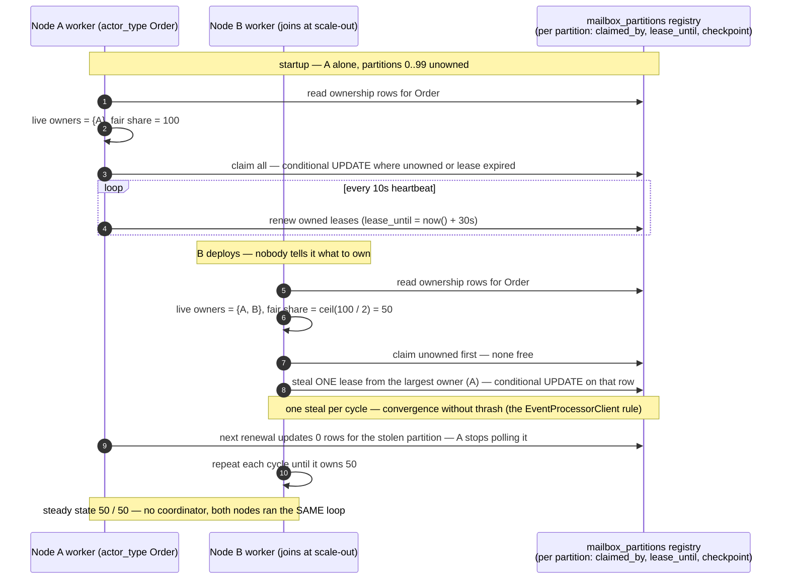
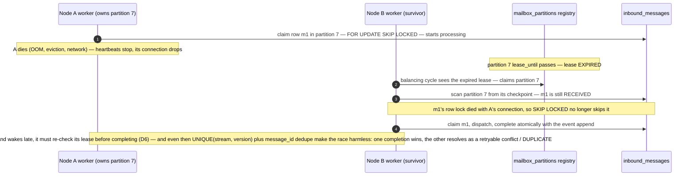
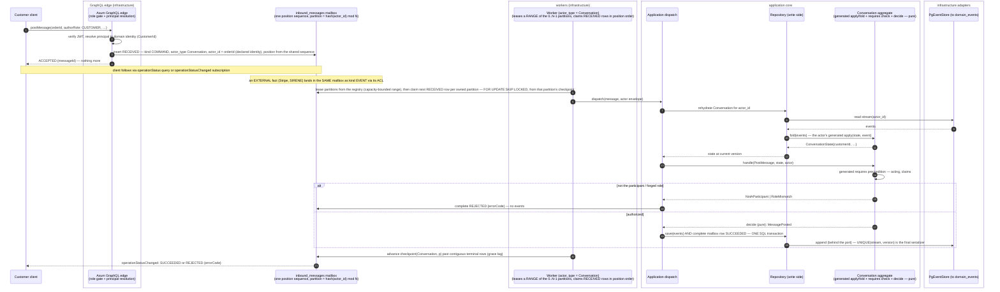

# PROP-20260728-152752 — The write path becomes an actor mailbox: `inbound_messages` replaces both journals, partitioned workers deliver to the actors

- **Status**: Proposed
- **Date**: 2026-07-28
- **Tracking issue**: [#242 "Write path: command_journal becomes the consumed queue — a worker executes commands in position order, and journal completion commits in the SAME transaction as the event append"](https://github.com/TheCaptainCompany/captain-food/issues/242)
- **Supersedes**: the union-view mechanism recorded on #242 (2026-07-28) — the product owner unified
  the two tables instead of unioning them.
- **Companion**: [PROP-20260728-135632 "Aggregate state as spec"](PROP-20260728-135632-aggregate-state-as-spec.md)
  — the actor's *inside* (declared state, generated `apply`/`fold`, `requires`); this proposal is the
  actor's *outside* (how messages reach it, durably and in order).
- **Realized by**: _(filled at completion)_

---

## 1. Context — the directives, and what they add up to

From the 2026-07-28 product-owner design session (continuing #242):

1. **One table, `inbound_messages`, replaces `command_journal` AND `inbound_events`** — everything
   the write path receives is one kind of thing: a message to an actor.
2. **`position` matters for the CHECKPOINT** — the consumption axis, not just a priority.
3. **Every message names the actor it concerns**: `actor_type` + `actor_id`.
4. **One worker per actor type, potentially per partition** — parallelism by partitioning the
   keyspace, never within one aggregate instance.

Put together, this is not "a queue in front of handlers" — it is the **actor model, realized on
Postgres**. `inbound_messages` is the durable mailbox; `(actor_type, actor_id)` is the actor
address; the partition is the dispatcher's shard; the per-instance ordering guarantee is the
actor's single-threaded illusion. The `receives:` inbox that `actors.yaml` has declared all along
becomes a **runtime** object, not just a codegen source.

The theory grounding (the names the product owner invoked):

- **Evans**: the aggregate is the consistency boundary — the unit that must see its invariants
  serialized. Everything here exists to give each `(actor_type, actor_id)` exactly one thread of
  control at a time, and to keep that machinery **outside the domain**: the pure
  `fold`/`requires`/`decide` from the companion proposal never learns what delivered its message.
- **Vernon**: aggregates map naturally onto actors — small, referenced by id, communicating
  asynchronously; between aggregates, eventual consistency via process managers. His operational
  warning (*Reactive Messaging Patterns*): distribution means **at-least-once delivery + idempotent
  receivers**, never exactly-once transport. We already hold both ends: `message_id` dedupe at the
  mailbox, fold-level dedupe in the aggregate.
- **Greg Young**: you do not need an actor framework to get a single writer — **optimistic
  concurrency on the stream is the serializer** (`UNIQUE(stream_name, version)` already is). The
  log is the truth; queues and checkpoints are delivery mechanics and caches. Partitioned
  competing consumers are a *throughput* device, not a *correctness* device — correctness lives in
  the version check and in idempotency.

That last point is the crux of the framework question in §4/D2.

## 2. The `inbound_messages` mailbox

One row = one message to one actor. Declared in `specs/database/tables/journals.yaml` (replacing
the two current tables there):

| column | type | meaning |
|---|---|---|
| `position` | `bigint` from ONE sequence, unique | the checkpoint/consumption axis — a single total order over every write intent |
| `message_id` | `uuid` PK | idempotency identity: the client's acceptance handle (commands), UUIDv5 of `(source, external_id)` (inbound facts) |
| `kind` | enum `COMMAND` \| `EVENT` | can the sender be told "no"? (the CLAUDE.md request/report split, now a column) |
| `actor_type` | text | the addressed actor — **validated against the `actors.yaml` catalog** |
| `actor_id` | `uuid` | the addressed instance (= stream id) |
| `partition` | `smallint` | `hash(actor_id) mod N` per actor type — stamped at insert so consumption filters cheaply |
| `message_type` | text | `PostMessage`, `PaymentCaptured`… — **validated: in that actor's `receives:`** |
| `payload` | `jsonb` | the commands.yaml / events.yaml body |
| `channel` | enum | GRAPHQL \| WORKER \| EXTERNAL |
| `user_id`, `user_type`, `correlation_id`, `cause_id` | envelope | ADR-0041 — the acting principal and causality chain |
| `status` | enum | `RECEIVED` → `SUCCEEDED` \| `REJECTED` \| `FAILED` \| `IGNORED` \| `DUPLICATE` (merges both tables' vocabularies) |
| `error`, `received_at`, `completed_at` | | rejection payload + timestamps |

What each old table contributed: `command_journal` brings the acceptance-first contract
(`operationStatus` reads `kind = COMMAND` rows by `message_id` — the API contract does not move);
`inbound_events` brings the source/external-id dedupe and the IGNORED/DUPLICATE outcomes. The
retention sweep (#18) and stale-RECEIVED sweep carry over unchanged in spirit.

**The addressing needs one new DSL fact.** To stamp `actor_type`/`actor_id` at insert, codegen must
know, per message, **which payload property is the aggregate identity**. Today that is implicit
(handlers read `cmd.order_id` by convention). The aggregate declares it once:

```yaml
Conversation:
  type: aggregate
  identity: orderId        # the payload property every received message carries as actor_id
  state: …
```

Validator: every message in `receives:` has the `identity` property in its payload (or the message
declares its own override); its scalar type is the aggregate's id type. This closes the loop with
the companion proposal: `identity` is to *addressing* what `state:` lineage is to *folding* —
nothing left for a handler to know by convention.

**The partition count is declared on the actor too** (product-owner refinement, 2026-07-28):

```yaml
Order:
  type: aggregate
  identity: orderId
  mailbox:
    partitions: 100      # keyspace WIDTH for this actor type — see below: workers own RANGES of it
```

`partitions` is the **keyspace width**, not the worker count — fixed and deliberately wide (default
100), because changing it re-maps every `actor_id` and is a drain-then-resize migration, while
*worker* scaling never touches it (D3/D6). The DSL is the single source: codegen emits the constant
into the generated GraphQL dispatch and the adapter ACLs (both stamp
`partition = hash(actor_id) mod N` at insert), seeds the partition registry (§3), and the validator
checks `1 ≤ partitions ≤ smallint` and that the value never silently changes between generations
(a diff in the generated constant is a reviewable, deliberate act).

One correctness detail the stamping forces: the hash must be **stable and documented** — the same
`actor_id` must land in the same partition from every writer, every language, every deploy. Rust's
default hasher (SipHash with per-process random keys) is disqualified by design; use a fixed,
boring function over the uuid bytes (e.g. CRC32C, or the uuid's low 64 bits) `mod N`, named in the
generated code and never changed without a keyspace migration.

## 3. Consumption: partitions, ordering, checkpoint

- **Workers own partition RANGES, not single partitions** (product-owner refinement, 2026-07-28):
  with `partitions: 100`, one worker instance serves the whole range 0–99; two instances split it
  (0–49 / 50–99); ten split it again — the Kafka consumer-group shape. The mechanism is a
  **partition registry**: `mailbox_partitions` with one row per `(actor_type, partition)`, seeded
  from the DSL's `partitions` count, each row carrying BOTH the partition's **checkpoint** and its
  **lease** (`claimed_by`, `lease_until`). A worker starts with an actor type and a capacity,
  acquires leases on unclaimed-or-expired partition rows up to capacity, heartbeats to renew, and
  processes each owned partition with
  `WHERE actor_type = T AND partition = P AND status = RECEIVED ORDER BY position`
  (rows claimed `FOR UPDATE SKIP LOCKED`). A crashed worker's leases expire and are picked up by
  the survivors — rebalancing and failover with no coordinator, which also answers #193's
  single-flight concern for this path.
- **The guarantee that matters**: all messages for one `actor_id` hash to one partition, so one
  aggregate instance is processed by exactly one worker at a time, in position order — the actor's
  single-threaded illusion. Across aggregates: no ordering promised (Vernon/Young: don't promise
  what nothing should depend on). The ultimate guard stays `UNIQUE(stream_name, version)` — even a
  partitioning bug cannot double-write a stream; it can only cause a retryable conflict.
- **Checkpoint** per `(actor_type, partition)`: advances past a position only when every row at or
  below it in that partition is terminal — it bounds the scan, it does not define truth
  (per-row `status` does). One honest caveat, inherited from any sequence-based position:
  `nextval` order is *assignment* order, not *commit visibility* order, so a row can appear below
  an already-advanced checkpoint. Three mitigations, all cheap: inserts are their own tiny
  transactions (the GraphQL insert and the ACL staging insert already are — milliseconds of
  window); the checkpoint advance applies a small grace lag; a periodic below-checkpoint audit
  sweeps anything that slipped (paranoia, expected to find nothing). Greg Young's framing: the log
  is the truth, the checkpoint is a cache — treat it like one.
### 3.1 The lease protocol — how partitions dispatch themselves across nodes

**The pattern is lease-based partition load balancing.** It is exactly what **Azure Event Hubs'
`EventProcessorClient`** (formerly *Event Processor Host*) does: every consumer node declares its
presence by writing **ownership records into a shared store** — blobs in a storage container
there, rows in `mailbox_partitions` here — and the "dispatching" that seems automatic is each node
independently running the **same greedy balancing loop** against that store. No coordinator
assigns anything; balance is emergent. (Kafka reaches the same end differently — a broker-side
group coordinator runs the assignment — which is precisely the component this design avoids
needing. The lease idea itself is Gray & Cheriton's, and it also underpins Orleans' grain
placement and Service Fabric's partition ownership.)

The loop every node runs, each cycle (~10s):

1. **Read** all ownership rows for its actor type.
2. **Count live owners** = distinct `claimed_by` with an unexpired `lease_until` (a node "declares
   its presence" simply by holding fresh leases — there is no separate membership table).
3. **Fair share** = `ceil(partitions / live owners incl. self)`.
4. If it owns **less** than fair share: claim **unowned or expired** rows first; if none are free,
   **steal ONE** lease from the largest owner — one per cycle, the EventProcessorClient rule that
   makes rebalancing converge instead of thrash.
5. **Renew** (heartbeat) the leases it holds; **release** down to fair share if over.

Every claim/steal/renew is one **conditional UPDATE** — `SET claimed_by = me, lease_until =
now() + 30s WHERE partition = P AND (claimed_by IS NULL OR lease_until before now() OR claimed_by
= me)` — so Postgres row atomicity is the referee: of two nodes grabbing the same lease, one
updates one row, the other updates zero and moves on.

#### Claiming and rebalancing — a second node joins

<a href="https://mermaid.live/view#pako:eNqVVMtu20AM_BVCJxlVEyVtDjHaAFJj9NQk6OMWwFitaGub1VLlruIIQf69lORXlaJAfRC8j-EMh-Q-R5pKjOYQefzVotN4bdSaVX3vQH6qDeTaukAe143iYLRplAuQgfJwI2j5tyF-QIZY6UC8DF2DcMsl8uw1LN_D8j3sJxnnQQXwWll8S234C_Dr4nMPrZWxBT0th6NgSICMa-MDdx8KPr2KG4m4P5yDtsrUWC6LLgGLyuOydcHYBHSF-qER5p5spLuhgECPEiBLhG4OPkigtoH79jw9e9-nbMlhAkfk6cnJ5SW0jjYOyzFM9vbqaoAzqhL6A_aVaYBp42FFPHpzuJvNwZpH3N6Ej_CcvSSwUobBV4pRds7SdBJ7yEv02J04Ta4cNCkLP-6us-8L2FQo6K02EOLBAMCnxvBOrCVqACXnTkg8VCipFajCeDpJx-EGxmBDJA_xkaUiU5jiGbyBd6nfVhBdOfU2n0vpS2wsdX4n3lFBZQcBrfVggiiXbgjUk43w_D887e_mrz1NIJ_aqtHYWLyFUzifyfoinbCNLu8cXBn24SDZIawYcQLxAaUCtzeLrdsrphpChWAVr1HwgySIs9k_KkdOIGKBpPfKvrE1e_aRqm943WmLR_Hk4rqfZtiYUMk8STRWvoK4F7J4RBfumDR6T_zJGlkCtxZnkx5z-BTGqgtN25QqSMnTg-d9MB_IojtMxGFW5KTx0JC1xq2lqH8Uh7GRJgNUutqKH3vIDP74fSWORzIfzZU-kbmU7Yu-bvLZF0QyJy6NU_IKJVBQqGSzFM2s3CD2W_ZlMXR8lEBUI8tjUsrj9xzJYT08gyWuVGtD9PLyG1vVrAw" target="_blank" rel="noopener noreferrer">Open this diagram with pan and zoom (mermaid.live, opens a new tab)</a>



#### Failover — a node dies mid-flight

<a href="https://mermaid.live/view#pako:eNptVNtu2kAQ_ZWRX0IkRy1V1Uo8RILgVigkUBKqPkRC4_UAK_bW3TUkivLvmbWBhKZ-sHyZc-bMmZl9zoStKOtBFuhvTUbQUOLKo34wwBfW0Zpal-Tbd4c-SiEdmgh9wAC3jOannfUb8tCxOxPaoCitge_nH2GDI2xwhIXab-XW-v-Ez4qfCaBRqtI-Lo7cATytZIj-6SPmpskhTWlrUy00hYArCg-mjexfXF7eDHogFEoN3u5Adzn4vWx4qL987n6FH5MZzKfD_n0Bd9ejKYwnV9fF8PA3REZwud4KTiHNquW_tZHAbrmufo-tqSQF6EwmNznQVoqUIAdDMdV-fqBaE1OVhEwXonU5SH4S1hhqAFB568K_9GxN70S1Igy0qE2Uir-HwIn3_M0fKP5MR7Ni2PIM2IaGoUSFRrB8EE9CEQRiXFwT0KOTnqo9eM_UuHbS4ze65GoQeGrl0lvdlrMmsXFWcoP2XMn3VLBUiou5Kka_D-LeihzkiVV3z0LTKmXFJllawU7GNfTP3tuUQ7AnjTKWAWbFNGEjHY9EPBXbjoDu5kwZHEaxzplOO0WcHqPVUqBST22uxpItsXx0jkz1ods5M8pl2gaePmsYd3ffH49ZBxrWixv2VWGk1F3QdYg8wheNK40_rc0lLa2ng4rUlc7w23FOElHSkMQYmN-Ofs2LDi8Boc6BRQR24Rycqnlj2rFfyAoqqmpHvEMbaqrwKAjW6LXimB5LfcvHLdtJE_ImzvLNs8hg1Za1c1XIb7xyWKoEMUvFAw2fYDifjkdXvCZZDpkmz9ta8ZnynDGBbk6XipZYq5i9vLwCyjt9Pg" target="_blank" rel="noopener noreferrer">Open this diagram with pan and zoom (mermaid.live, opens a new tab)</a>



The safety story is layered, on purpose: the **lease** prevents sustained double-ownership, the
**row claim** prevents concurrent delivery of one message, and the **stream version check + the
aggregate's idempotency** make even the residual stall-race harmless — correctness never rests on
the lease alone (Young's rule again: the serializer is the version check; everything above it is
throughput machinery).

- **Completion is the dispatch's** (#242 DoD unchanged): the `domain_events` append and the
  `inbound_messages` status flip commit in ONE SQL transaction; the `OperationStatusBus` publish
  happens post-commit, worker-side.

## 4. Decisions surfaced

### D1 — One table vs two journals + union view

| Option | Pros | Cons |
|---|---|---|
| **One `inbound_messages` table** ✅ directed | One identity scheme, one status vocabulary, one retention/sweep/checkpoint mechanism; the mailbox concept made literal — `kind` is a column, not a table split; simpler DSL (one table decl); `operationStatus` unchanged (reads `kind = COMMAND`) | Migration of two live tables; the widest rows (command payloads) and the narrowest (stock ticks) share one heap; per-kind indexes needed |
| Two tables + `pending_work` UNION view (previous #242 comment) | No migration; per-table specialization kept | Two identity schemes and two status vocabularies forever; every consumer feature (claim, checkpoint, retention) built twice; the view can only *discover*, never *claim* |
| Keep the spawn model | Zero work | Rejected in #242 — crash-lost work, no backpressure, non-atomic completion |

### D2 — The actor runtime: build on Postgres, adopt a Rust actor framework, or an external platform?

The product owner's question, answered with the three names' own logic. The decisive facts:
**correctness does not need a framework here** (the stream version check serializes writers; the
mailbox gives durability and order), so a framework buys only *in-memory state residency and
sub-millisecond dispatch* — which matter at thousands of messages/second, while Tours-peak
(Friday 19:00–21:30) is single-digit. And V0 runs ONE instance on Render with no leader election
(#193) — a distributed actor cluster has nothing to distribute over yet.

| Option | Pros | Cons |
|---|---|---|
| **Postgres-native mailbox + partitioned workers ("the actor model as a schema, not a framework")** ✅ recommended | Zero new infrastructure (Supabase already there); durable mailbox for free — most actor frameworks bolt persistence ON, here it is the foundation; at-least-once + idempotency already built; scales by adding worker replicas and raising N partitions (Kafka-consumer-group semantics without Kafka); everything observable with SQL; domain stays pure (Evans); the serializer is the version check (Young) | Every message pays a rehydration fold (mitigable later: an in-worker hot-aggregate cache keyed by `actor_id`, invalidated on version conflict — virtual-actor behaviour without a framework); dispatch latency is queue-poll latency (the existing nudge pattern keeps it near-zero) |
| Rust actor framework with clustering — `ractor`(+cluster), `coerce`, `kameo` | True in-memory actors; sharding/location transparency; Vernon-style supervision trees | The Rust distributed-actor ecosystem is **young and thin**: cluster features experimental or single-maintainer; betting the money path on a niche runtime; brings cluster membership/split-brain ops to a team that today runs one container; persistence still ends in Postgres — the mailbox table gets built anyway |
| External actor platform — Orleans (virtual actors), Akka/Pekko, Dapr sidecar actors, Cloudflare Durable Objects | Orleans is the gold standard of virtual actors; Dapr is language-neutral (works from Rust over gRPC) | Polyglot or sidecar ops against ADR-0034's full-stack-Rust posture; a second runtime to deploy, monitor, upgrade; V0 hosting (one Render image + Supabase) has no room for it; Durable Objects couples the write path to one edge vendor |
| Durable-execution engines — Temporal, Restate (virtual objects ARE keyed single-writers, decent Rust SDK) | Restate's model matches this design closely; retries/timers built in | Another stateful service to run (or a SaaS dependency on the order path); the journal/event-store split blurs — two logs of truth; migration lock-in at the layer hardest to leave |

**Evolution valve** (the part that makes "build on Postgres" safe rather than naive): the worker
consumes through two ports — `Mailbox` (claim/complete) and the application dispatch. If scale
ever demands a framework or Restate-class runtime, it replaces the *transport behind those ports*;
the domain (`fold`/`requires`/`decide`) and the DSL do not move. Revisit trigger, measurable:
rehydration p99 or acceptance→execution lag breaching the checkout SLO at peak (#16's metrics).

### D3 — Parallelism shape

| Option | Pros | Cons |
|---|---|---|
| **Per-`actor_type` workers owning partition RANGES over a fixed-wide keyspace (`partitions: 100` in the DSL), `partition = hash(actor_id) mod N`** ✅ directed | Per-instance ordering by construction; per-type isolation (a Catalog import storm cannot starve Order acceptance — the ETA/notify path, the product's worst failure mode, gets its own lane); worker scaling re-divides ranges and NEVER touches N — no keyspace re-map on scale-out | Hot single aggregate still bounds at one lane (correct — that is the aggregate's own serialization); 100 checkpoint/lease rows per actor type to maintain (trivial); changing N itself remains a drain-then-resize migration — which is why it starts wide |
| One global worker | Simplest; total order everywhere | One slow Catalog import delays a paid Order's acceptance — unacceptable at peak |
| Per-instance workers (one per actor_id) | Maximum parallelism | Thousands of idle claimers; the partition IS this, amortized |

### D4 — Checkpoint semantics (the `position` directive, made safe)

| Option | Pros | Cons |
|---|---|---|
| **Terminal-watermark + grace lag + below-checkpoint audit** ✅ recommended | Bounds every scan; per-row status stays the truth so nothing is ever *lost* to the anomaly; audit is a cheap `count(*)` expected 0 | The anomaly window exists (ms) and must be documented, not wished away |
| Pure watermark (`position` alone defines consumed) | Simplest mental model | A late-committing insert below the watermark is **silently never processed** — a paid-order message lost to a race is the exact failure CLAUDE.md calls the worst |
| No checkpoint, status-scan only | No anomaly at all | Scans grow with table size until retention (#18) trims; the directive names the checkpoint explicitly |

### D5 — Do process managers join the mailbox?

Yes, by shape — a PM is an actor with an inbox of events (`actors.yaml` already says so) — but
**not in this change's scope**. Today PMs react in-process; moving their deliveries into
`inbound_messages` (kind = EVENT, actor_type = the PM) unifies retries/observability and is the
natural follow-up once the Order/Conversation lanes prove the mechanics. Recorded as a follow-up,
not silently deferred.

### D6 — How workers acquire their partition ranges

| Option | Pros | Cons |
|---|---|---|
| **Lease rows in the partition registry** (`mailbox_partitions.claimed_by / lease_until`, heartbeat renewal; the checkpoint table doubles as the lease table) ✅ recommended | No coordinator, no new infrastructure; crash → lease expiry → automatic takeover by survivors; scaling out = new instance leases whatever is free; the registry is also the ops surface (§6 monitor reads it); resolves #193's single-flight need for this path | Lease/heartbeat tuning (too short = flapping, too long = slow takeover — start 30s lease / 10s heartbeat); a paused-then-resumed worker (GC-style stall) must re-check its lease before completing work it started |
| Static ranges from deployment config (env: `MAILBOX_RANGES=Order:0-49`) | Dead simple; deterministic | No failover — a dead instance's range goes dark until a human redeploys; config drift between replicas is silent double-ownership risk (caught only by SKIP LOCKED and the version check) |
| Advisory locks taken per pass, no standing ownership | No lease bookkeeping at all | With 100 partitions × several types, every pass is a lock-shopping spree; ownership churn defeats the hot-aggregate cache (D2's evolution valve) which needs stable placement |

## 5. Sequence diagram — PostMessage through the mailbox

<a href="https://mermaid.live/view#pako:eNqNVtFu4zYQ_JWFXyqjzuXuUPTBaAM4ihr4LnZytnPpwwEBLdIycRKpkpSTXJp_75CSLNl1geYlic1dzs7OjPQ6SDUXgzENrPirEioVV5JlhhXfFOGHVU6rqlgLU_9fMuNkKkumHMXELMWVdboQhtJcCuXqU2v9TNeGldsvNyR4JiiSamOYdaZKXWXEsD523PAax9Fy8lwVB-W_rc35RWR0LihjTtDPVBqpfFFORlidV05q1TQViv8b6uzSN5ZqrSvFHwthLcuEpYLJHFjr_loJKrWVvhe1ZIzqNuGz32nL7DZiqdPmUfIhFZrTfNiN_KTNd2Hs_5z2wUN6CCXUNHUvpcA1sVY79GFhqhpcLpgFYEaLyfw6Ib0htxX0_t27-dmHDqIdYQ1MFpYWSZxMvyZXZPSTH7ybTBsuzDFXHj0ry1ym4VJKtRGnUU_KMuyod5hLWzKXbk8XLESpfYX_DQjavFD0ZCTWaCX_L24mWRbE1SOCWJYZ4fdfM5IJJQz-4wH4y_lG5xzKMFichCgo3Yr0Oz7gIsU99K36-P7DL1R2-zgY_nBjxDgrHW4-jS5ZenB3WbKD4pcYCQJ3mriGntSj8J_a_iX1n_HZxQUUPvarcLNaglHYxpSPvNG22iyg8THF98vV7SxZjALqj782vVDctgArcvNCnx5Wo9oBO9HzxB4LYXIFaYDy1qdTftBtdjnG7FYY10mmoeq7VJzi29lsMr8Cvk6g_a20X0gO3TbDUATOc2awmvb-4agT4MboIqjXbsOZ1modLOCKxzSJ4-RuBTyvjV-n_K3FprTbSpXBga1O5xqK0sBF8cgPVccRQRW5d8BOMtKlFwwgLB1zlSVcCzFqc_xFvGUq88CqtU2NLP03x5f4K5ii5M9VsphPbmgDGihaOhxHZiyni2SeDClnigf3-XGXk1nSJo7XT-A3-ZrMVwGddHBVfFNf9NCsJti-5--OPFhBQq_YbMpKloLjsxBuwG08fDCOY6rOA1Li2R1kAmFk0k8Kx7uAa8j943ZB93dXk1VCy8_TO7q5jT8nkEBzN3NdyU-Nz0ot2-z30JEO430sRM36GqnAEjuRg_JGhziLCp8OYwy1feHe1IfO36CqlVld5I-jKln6GoZVOfwqumiuTyXLs33r2pUH1QiZsRcIjxrLtgR4fkMrjHcUM5GFRDBKqGgnyLLunj5wLyfxmu6d1_r5rQejZSv0JXCbVsZ45foue-HVJAXAECfPRXTXhciIGlABcw9UU9GNsA_H0ohUK36wdlTDUu0TpHn85857LTDST8BzvxPvEf9Q7kKyYSIMBK9M7nolf5MPt5m0xeGzoh4tWFYXZS7AwiL5lMTB-cIYbWK8oPScf7BKkcMfdXbKH4KfhtI8AqIQ_mNqaPMMHlT0hGjZTuxVgfzrsLUG9h5a3iOikqsuMm_nsAxeWhwsaD2f7f6ONAsp4cFA0VpsfQgEdrVxewHez6df7pOoVvWolcKQpA1nN1Ih5RHakuWY2hw9z9rwYHzHkKs9h0aH0V0OsVQLyWmEdFZpZCIeekXoHt4bIrwIokHOskZVs8smnE9H5rhHCTx7ao-DEQ1gBtDI8dL5OsA8RXj95GLDqtwN3t7-AVgHiNs" target="_blank" rel="noopener noreferrer">Open this diagram with pan and zoom (mermaid.live, opens a new tab)</a> —
regenerate this link (snippet in docs/claude/mermaid.md) whenever the fenced block below changes.



## 6. Mockups

Client surfaces do not change (`MutationAcceptance` + `operationStatus` are the existing ADR-20260720-015500
contract). The new user-visible surface is operational — the admin lane monitor the partitioned
mailbox makes possible:

```
┌──────────────────────────────────────────────────────────────┐
│ Write path — mailbox lanes                    (ADMIN, live)  │
│──────────────────────────────────────────────────────────────│
│ actor_type    part  pending  oldest    checkpoint   worker   │
│ Order           0       2     1.2s     184 220     alive ✓   │
│ Conversation    0       0       —      184 219     alive ✓   │
│ Catalog         0      37    48.0s     183 990     alive ✓   │  ← import storm, isolated lane
│ Restaurant      0       1     0.4s     184 218     alive ✓   │
│──────────────────────────────────────────────────────────────│
│ below-checkpoint audit: 0 rows (last run 15:20)              │
└──────────────────────────────────────────────────────────────┘
   reads: SELECT actor_type, partition, count(*), min(received_at) … GROUP BY 1,2
```

The Catalog backlog no longer touches the Order lane — the peak-Friday property the partition
split exists for.

## 7. Verification plan

- Behaviour tests: per-instance ordering (two commands, one aggregate → applied in position
  order); cross-partition independence (Catalog backlog does not delay an Order message);
  idempotent redelivery (same `message_id` → DUPLICATE, no double-apply); crash between claim and
  completion → row re-claimed after the stale sweep, and the version check makes the retry safe.
- The atomicity test #242 demands: kill between append and complete is IMPOSSIBLE by construction
  (one transaction) — asserted by a test that fails if they ever split into two.
- Checkpoint audit metric wired into the observability contract (#16 family):
  `mailbox_below_checkpoint_rows` expected 0.
- `operationStatus`/`operationStatusChanged` contract tests unchanged and green across the swap.

## 8. What this changes, where

1. `specs/database/tables/journals.yaml`: `inbound_messages` replaces the two tables (plan-mode).
2. `specs/actors.yaml`: the `identity:` declaration per aggregate, and the `mailbox.partitions`
   keyspace width (plan-mode; validator rules `id-missing`/`id-not-in-payload`,
   `mb-partitions-range`).
3. `tools/codegen-rs`: validation (actor_type/message_type/identity against the catalog); the
   generated GraphQL dispatch inserts mailbox rows instead of spawning.
4. `crates/infrastructure`: the partitioned worker (generalizing `InboundEventsDrainWorker`);
   the `mailbox_partitions` registry (checkpoint + lease per `(actor_type, partition)`, seeded
   from the DSL width); lease acquisition/heartbeat/takeover (D6); claim/checkpoint/audit;
   `OperationStatusBus` publish moves post-commit.
5. `crates/application`: dispatch completes the mailbox row in the append's transaction.
6. Migration: backfill both old tables into `inbound_messages` in `received_at` order, then drop.

## 9. Alternatives considered and rejected

- **Union view over two journals** (this proposal's direct predecessor, recorded on #242):
  rejected by the product owner in favour of one table — see D1.
- **Kafka/Redpanda as the mailbox**: real partitioned log, but a second stateful system V0 cannot
  operate, and Postgres already gives durability + SKIP LOCKED claiming + transactional completion
  with the event append — the one property Kafka cannot offer here (no shared transaction with
  `domain_events`).
- **Adopting a distributed actor framework now**: see D2 — correctness doesn't need it, V0 scale
  doesn't justify it, and the port boundary keeps the door open at the moment metrics say
  otherwise.
