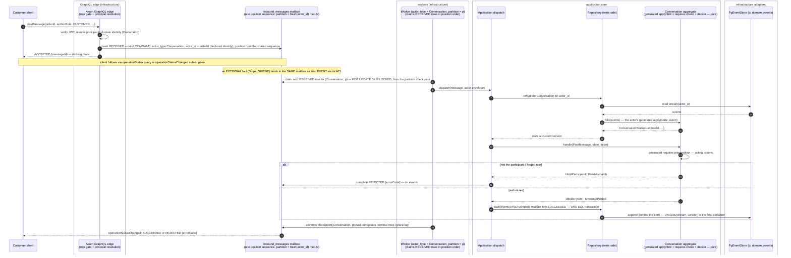

# PROP-20260728-152752 — The write path becomes an actor mailbox: `inbound_messages` replaces both journals, partitioned workers deliver to the actors

- **Status**: Proposed
- **Date**: 2026-07-28
- **Tracking issue**: [#242 "Write path: command_journal becomes the consumed queue — a worker executes commands in position order, and journal completion commits in the SAME transaction as the event append"](https://github.com/TheCaptainCompany/captain-food/issues/242)
- **Supersedes**: the union-view mechanism recorded on #242 (2026-07-28) — the product owner unified
  the two tables instead of unioning them.
- **Companion**: [PROP-20260728-135632 "Aggregate state as spec"](PROP-20260728-135632-aggregate-state-as-spec.md)
  — the actor's *inside* (declared state, generated `apply`/`fold`, `requires`); this proposal is the
  actor's *outside* (how messages reach it, durably and in order).
- **Realized by**: _(filled at completion)_

---

## 1. Context — the directives, and what they add up to

From the 2026-07-28 product-owner design session (continuing #242):

1. **One table, `inbound_messages`, replaces `command_journal` AND `inbound_events`** — everything
   the write path receives is one kind of thing: a message to an actor.
2. **`position` matters for the CHECKPOINT** — the consumption axis, not just a priority.
3. **Every message names the actor it concerns**: `actor_type` + `actor_id`.
4. **One worker per actor type, potentially per partition** — parallelism by partitioning the
   keyspace, never within one aggregate instance.

Put together, this is not "a queue in front of handlers" — it is the **actor model, realized on
Postgres**. `inbound_messages` is the durable mailbox; `(actor_type, actor_id)` is the actor
address; the partition is the dispatcher's shard; the per-instance ordering guarantee is the
actor's single-threaded illusion. The `receives:` inbox that `actors.yaml` has declared all along
becomes a **runtime** object, not just a codegen source.

The theory grounding (the names the product owner invoked):

- **Evans**: the aggregate is the consistency boundary — the unit that must see its invariants
  serialized. Everything here exists to give each `(actor_type, actor_id)` exactly one thread of
  control at a time, and to keep that machinery **outside the domain**: the pure
  `fold`/`requires`/`decide` from the companion proposal never learns what delivered its message.
- **Vernon**: aggregates map naturally onto actors — small, referenced by id, communicating
  asynchronously; between aggregates, eventual consistency via process managers. His operational
  warning (*Reactive Messaging Patterns*): distribution means **at-least-once delivery + idempotent
  receivers**, never exactly-once transport. We already hold both ends: `message_id` dedupe at the
  mailbox, fold-level dedupe in the aggregate.
- **Greg Young**: you do not need an actor framework to get a single writer — **optimistic
  concurrency on the stream is the serializer** (`UNIQUE(stream_name, version)` already is). The
  log is the truth; queues and checkpoints are delivery mechanics and caches. Partitioned
  competing consumers are a *throughput* device, not a *correctness* device — correctness lives in
  the version check and in idempotency.

That last point is the crux of the framework question in §4/D2.

## 2. The `inbound_messages` mailbox

One row = one message to one actor. Declared in `specs/database/tables/journals.yaml` (replacing
the two current tables there):

| column | type | meaning |
|---|---|---|
| `position` | `bigint` from ONE sequence, unique | the checkpoint/consumption axis — a single total order over every write intent |
| `message_id` | `uuid` PK | idempotency identity: the client's acceptance handle (commands), UUIDv5 of `(source, external_id)` (inbound facts) |
| `kind` | enum `COMMAND` \| `EVENT` | can the sender be told "no"? (the CLAUDE.md request/report split, now a column) |
| `actor_type` | text | the addressed actor — **validated against the `actors.yaml` catalog** |
| `actor_id` | `uuid` | the addressed instance (= stream id) |
| `partition` | `smallint` | `hash(actor_id) mod N` per actor type — stamped at insert so consumption filters cheaply |
| `message_type` | text | `PostMessage`, `PaymentCaptured`… — **validated: in that actor's `receives:`** |
| `payload` | `jsonb` | the commands.yaml / events.yaml body |
| `channel` | enum | GRAPHQL \| WORKER \| EXTERNAL |
| `user_id`, `user_type`, `correlation_id`, `cause_id` | envelope | ADR-0041 — the acting principal and causality chain |
| `status` | enum | `RECEIVED` → `SUCCEEDED` \| `REJECTED` \| `FAILED` \| `IGNORED` \| `DUPLICATE` (merges both tables' vocabularies) |
| `error`, `received_at`, `completed_at` | | rejection payload + timestamps |

What each old table contributed: `command_journal` brings the acceptance-first contract
(`operationStatus` reads `kind = COMMAND` rows by `message_id` — the API contract does not move);
`inbound_events` brings the source/external-id dedupe and the IGNORED/DUPLICATE outcomes. The
retention sweep (#18) and stale-RECEIVED sweep carry over unchanged in spirit.

**The addressing needs one new DSL fact.** To stamp `actor_type`/`actor_id` at insert, codegen must
know, per message, **which payload property is the aggregate identity**. Today that is implicit
(handlers read `cmd.order_id` by convention). The aggregate declares it once:

```yaml
Conversation:
  type: aggregate
  identity: orderId        # the payload property every received message carries as actor_id
  state: …
```

Validator: every message in `receives:` has the `identity` property in its payload (or the message
declares its own override); its scalar type is the aggregate's id type. This closes the loop with
the companion proposal: `identity` is to *addressing* what `state:` lineage is to *folding* —
nothing left for a handler to know by convention.

## 3. Consumption: partitions, ordering, checkpoint

- **One worker per `actor_type`, N partitions per type** (N=1 to start; a config knob, not a
  schema change). Worker `(actor_type, partition)` consumes
  `WHERE actor_type = T AND partition = P AND status = RECEIVED ORDER BY position` — claiming rows
  `FOR UPDATE SKIP LOCKED`, single-flight per partition across instances (#193's constraint,
  answered by the claim itself).
- **The guarantee that matters**: all messages for one `actor_id` hash to one partition, so one
  aggregate instance is processed by exactly one worker at a time, in position order — the actor's
  single-threaded illusion. Across aggregates: no ordering promised (Vernon/Young: don't promise
  what nothing should depend on). The ultimate guard stays `UNIQUE(stream_name, version)` — even a
  partitioning bug cannot double-write a stream; it can only cause a retryable conflict.
- **Checkpoint** per `(actor_type, partition)`: advances past a position only when every row at or
  below it in that partition is terminal — it bounds the scan, it does not define truth
  (per-row `status` does). One honest caveat, inherited from any sequence-based position:
  `nextval` order is *assignment* order, not *commit visibility* order, so a row can appear below
  an already-advanced checkpoint. Three mitigations, all cheap: inserts are their own tiny
  transactions (the GraphQL insert and the ACL staging insert already are — milliseconds of
  window); the checkpoint advance applies a small grace lag; a periodic below-checkpoint audit
  sweeps anything that slipped (paranoia, expected to find nothing). Greg Young's framing: the log
  is the truth, the checkpoint is a cache — treat it like one.
- **Completion is the dispatch's** (#242 DoD unchanged): the `domain_events` append and the
  `inbound_messages` status flip commit in ONE SQL transaction; the `OperationStatusBus` publish
  happens post-commit, worker-side.

## 4. Decisions surfaced

### D1 — One table vs two journals + union view

| Option | Pros | Cons |
|---|---|---|
| **One `inbound_messages` table** ✅ directed | One identity scheme, one status vocabulary, one retention/sweep/checkpoint mechanism; the mailbox concept made literal — `kind` is a column, not a table split; simpler DSL (one table decl); `operationStatus` unchanged (reads `kind = COMMAND`) | Migration of two live tables; the widest rows (command payloads) and the narrowest (stock ticks) share one heap; per-kind indexes needed |
| Two tables + `pending_work` UNION view (previous #242 comment) | No migration; per-table specialization kept | Two identity schemes and two status vocabularies forever; every consumer feature (claim, checkpoint, retention) built twice; the view can only *discover*, never *claim* |
| Keep the spawn model | Zero work | Rejected in #242 — crash-lost work, no backpressure, non-atomic completion |

### D2 — The actor runtime: build on Postgres, adopt a Rust actor framework, or an external platform?

The product owner's question, answered with the three names' own logic. The decisive facts:
**correctness does not need a framework here** (the stream version check serializes writers; the
mailbox gives durability and order), so a framework buys only *in-memory state residency and
sub-millisecond dispatch* — which matter at thousands of messages/second, while Tours-peak
(Friday 19:00–21:30) is single-digit. And V0 runs ONE instance on Render with no leader election
(#193) — a distributed actor cluster has nothing to distribute over yet.

| Option | Pros | Cons |
|---|---|---|
| **Postgres-native mailbox + partitioned workers ("the actor model as a schema, not a framework")** ✅ recommended | Zero new infrastructure (Supabase already there); durable mailbox for free — most actor frameworks bolt persistence ON, here it is the foundation; at-least-once + idempotency already built; scales by adding worker replicas and raising N partitions (Kafka-consumer-group semantics without Kafka); everything observable with SQL; domain stays pure (Evans); the serializer is the version check (Young) | Every message pays a rehydration fold (mitigable later: an in-worker hot-aggregate cache keyed by `actor_id`, invalidated on version conflict — virtual-actor behaviour without a framework); dispatch latency is queue-poll latency (the existing nudge pattern keeps it near-zero) |
| Rust actor framework with clustering — `ractor`(+cluster), `coerce`, `kameo` | True in-memory actors; sharding/location transparency; Vernon-style supervision trees | The Rust distributed-actor ecosystem is **young and thin**: cluster features experimental or single-maintainer; betting the money path on a niche runtime; brings cluster membership/split-brain ops to a team that today runs one container; persistence still ends in Postgres — the mailbox table gets built anyway |
| External actor platform — Orleans (virtual actors), Akka/Pekko, Dapr sidecar actors, Cloudflare Durable Objects | Orleans is the gold standard of virtual actors; Dapr is language-neutral (works from Rust over gRPC) | Polyglot or sidecar ops against ADR-0034's full-stack-Rust posture; a second runtime to deploy, monitor, upgrade; V0 hosting (one Render image + Supabase) has no room for it; Durable Objects couples the write path to one edge vendor |
| Durable-execution engines — Temporal, Restate (virtual objects ARE keyed single-writers, decent Rust SDK) | Restate's model matches this design closely; retries/timers built in | Another stateful service to run (or a SaaS dependency on the order path); the journal/event-store split blurs — two logs of truth; migration lock-in at the layer hardest to leave |

**Evolution valve** (the part that makes "build on Postgres" safe rather than naive): the worker
consumes through two ports — `Mailbox` (claim/complete) and the application dispatch. If scale
ever demands a framework or Restate-class runtime, it replaces the *transport behind those ports*;
the domain (`fold`/`requires`/`decide`) and the DSL do not move. Revisit trigger, measurable:
rehydration p99 or acceptance→execution lag breaching the checkout SLO at peak (#16's metrics).

### D3 — Parallelism shape

| Option | Pros | Cons |
|---|---|---|
| **Per `(actor_type, partition)` workers, partition = `hash(actor_id) mod N`** ✅ directed | Per-instance ordering by construction; per-type isolation (a Catalog import storm cannot starve Order acceptance — the ETA/notify path, the product's worst failure mode, gets its own lane); N is a knob | Hot single aggregate still bounds at one lane (correct — that is the aggregate's own serialization); rebalancing N re-maps partitions (drain-then-resize, or consistent hashing later) |
| One global worker | Simplest; total order everywhere | One slow Catalog import delays a paid Order's acceptance — unacceptable at peak |
| Per-instance workers (one per actor_id) | Maximum parallelism | Thousands of idle claimers; the partition IS this, amortized |

### D4 — Checkpoint semantics (the `position` directive, made safe)

| Option | Pros | Cons |
|---|---|---|
| **Terminal-watermark + grace lag + below-checkpoint audit** ✅ recommended | Bounds every scan; per-row status stays the truth so nothing is ever *lost* to the anomaly; audit is a cheap `count(*)` expected 0 | The anomaly window exists (ms) and must be documented, not wished away |
| Pure watermark (`position` alone defines consumed) | Simplest mental model | A late-committing insert below the watermark is **silently never processed** — a paid-order message lost to a race is the exact failure CLAUDE.md calls the worst |
| No checkpoint, status-scan only | No anomaly at all | Scans grow with table size until retention (#18) trims; the directive names the checkpoint explicitly |

### D5 — Do process managers join the mailbox?

Yes, by shape — a PM is an actor with an inbox of events (`actors.yaml` already says so) — but
**not in this change's scope**. Today PMs react in-process; moving their deliveries into
`inbound_messages` (kind = EVENT, actor_type = the PM) unifies retries/observability and is the
natural follow-up once the Order/Conversation lanes prove the mechanics. Recorded as a follow-up,
not silently deferred.

## 5. Sequence diagram — PostMessage through the mailbox

[Open this diagram with pan and zoom (mermaid.live)](https://mermaid.live/view#pako:eNqNVtFu4zYQ_JWFXyqjPqQ9FH0w2gCOzB58Fzs-y77cwwEBLdISEYlUScpJmubfb0lRluRzgeYlscNdzs7OjPQ6ShXjoymMDP-75jLlc0EzTctvEvCH1lbJutxz3XyuqLYiFRWVFmKgBuLaWFVyDWkhuLTNqb16hg-aVvnnW-As4xAJedDUWF2nttZ83Bw7b_gBj2PL2XNdDsr_2Our60irgkNGLYefodJCuqICNDeqqK1QMjTlkv0IdXnjGgu5V7VkDyU3hmbcQElFgVib_kpyqJQRrhe0ZEyaNv67PyGnJo9oapV-EGwMpWKwGncjPyn9yLX5n9PeO0j3vgRCU_tScbwmVvKIfai7dQigGjdY04KK0sCGxGTxhcxBqyc3Xodfacb1OSMOI62qQqS-NaRK88vYZlXlN9E7zISpqE3zywUbXilX4X4jBKVfIHrSApdlBPsvBmZZ5iXUGxdolmnuttwMmnHJNX5iHvjL1UEVDPevcT0CVw9pztNH_ILxFO-Bb_X7X379DaqO9cHww70AZbSyePNldCRx4NYZOaKuExwJZWwVMIWqkQ_cfWv6lzR_xu-ur1HHU7cKu2yEFvltLNjE2SlXeoNKnkK8S7Z3S7KZeNTvfw-9sLhtgayIwwt8vN9OGp0feU_5JyyAk0uUCFLeunHBBt2WN1Oc3XBtO8kEqh6FZBDfLZez1RzxdTIcirAVPWowDAMRcl5Qjatp7x9POgEetCrB5rj_3J9pDdXBQlzxFGZxTNZbxPMaXLlgby02qWwuZIY-a3W6UqgohbggnrihmtABVEXhHHAUFFTlBIMQEkttbQCvRTEqff6POKcyc8DqvUm1qNx_zi9xV1AJ5OuWbFazWzggDRAlFo9jMiSLDVmRMRRUMu8-N24yW5I2V5x-PL_kC1ltPTph0VXxbXPRfViNdzNI_mwHjsaxMBnOwmDckvPX3QZ26_lsSyD5tFjD7V38ieAKT8R3ueFNUinRxrO7F609PXk6CtyHPaOej7xAvoKI8CxWOGtPUYf5C3OOHNrWQW010hS541hFEldDkWeLv8ouPZtTJHl3at1YalCNCTF122VR8Fs7vRvQt_rJwFlGRAb3i6P4inaCLOvu6QN3WuCv6ck2rRnfejBatnxfoBbSWmsnO9flpJqGJA8YlcUKHq27BJhAAOUx90CFim6EU7JVmqdKsmaDYWqsRj9MGsEEpmhhnVG6lYf4unI7cQJ3z80u4QITfiAU-mzdK_kXXDIthSmHQd-M5pWqyqrgyMKGfCSxty3XWukY3yF6th2skheGh-AT_3B2GUrI78gn9xQCbY7BQUVPiIYe-UkVGF4dttZ9zkLJDvOFzLu8u1uhX_C9wmoqjeOz3d-ZZlFKmOoQ7XnuHOzZVdqeBLhbLT7vSNSoetJKYQzC-LMHITGiMXEFLXBqffYwap1P2ZFiKPYc-qPfK3xi4XCYsFmtMNDwiVX67v6hH-G7GjYoaBZUtbwJyXo576Y9StCzl_Y4msAIzYA0MnwvfB3hPKV_Q2T8QOvCjt7evgNZ72eJ) —
regenerate this link (snippet in docs/claude/mermaid.md) whenever the fenced block below changes.



## 6. Mockups

Client surfaces do not change (`MutationAcceptance` + `operationStatus` are the existing ADR-20260720-015500
contract). The new user-visible surface is operational — the admin lane monitor the partitioned
mailbox makes possible:

```
┌──────────────────────────────────────────────────────────────┐
│ Write path — mailbox lanes                    (ADMIN, live)  │
│──────────────────────────────────────────────────────────────│
│ actor_type    part  pending  oldest    checkpoint   worker   │
│ Order           0       2     1.2s     184 220     alive ✓   │
│ Conversation    0       0       —      184 219     alive ✓   │
│ Catalog         0      37    48.0s     183 990     alive ✓   │  ← import storm, isolated lane
│ Restaurant      0       1     0.4s     184 218     alive ✓   │
│──────────────────────────────────────────────────────────────│
│ below-checkpoint audit: 0 rows (last run 15:20)              │
└──────────────────────────────────────────────────────────────┘
   reads: SELECT actor_type, partition, count(*), min(received_at) … GROUP BY 1,2
```

The Catalog backlog no longer touches the Order lane — the peak-Friday property the partition
split exists for.

## 7. Verification plan

- Behaviour tests: per-instance ordering (two commands, one aggregate → applied in position
  order); cross-partition independence (Catalog backlog does not delay an Order message);
  idempotent redelivery (same `message_id` → DUPLICATE, no double-apply); crash between claim and
  completion → row re-claimed after the stale sweep, and the version check makes the retry safe.
- The atomicity test #242 demands: kill between append and complete is IMPOSSIBLE by construction
  (one transaction) — asserted by a test that fails if they ever split into two.
- Checkpoint audit metric wired into the observability contract (#16 family):
  `mailbox_below_checkpoint_rows` expected 0.
- `operationStatus`/`operationStatusChanged` contract tests unchanged and green across the swap.

## 8. What this changes, where

1. `specs/database/tables/journals.yaml`: `inbound_messages` replaces the two tables (plan-mode).
2. `specs/actors.yaml`: the `identity:` declaration per aggregate (plan-mode; validator rule
   `id-missing`/`id-not-in-payload`).
3. `tools/codegen-rs`: validation (actor_type/message_type/identity against the catalog); the
   generated GraphQL dispatch inserts mailbox rows instead of spawning.
4. `crates/infrastructure`: the partitioned worker (generalizing `InboundEventsDrainWorker`);
   claim/checkpoint/audit; `OperationStatusBus` publish moves post-commit.
5. `crates/application`: dispatch completes the mailbox row in the append's transaction.
6. Migration: backfill both old tables into `inbound_messages` in `received_at` order, then drop.

## 9. Alternatives considered and rejected

- **Union view over two journals** (this proposal's direct predecessor, recorded on #242):
  rejected by the product owner in favour of one table — see D1.
- **Kafka/Redpanda as the mailbox**: real partitioned log, but a second stateful system V0 cannot
  operate, and Postgres already gives durability + SKIP LOCKED claiming + transactional completion
  with the event append — the one property Kafka cannot offer here (no shared transaction with
  `domain_events`).
- **Adopting a distributed actor framework now**: see D2 — correctness doesn't need it, V0 scale
  doesn't justify it, and the port boundary keeps the door open at the moment metrics say
  otherwise.
