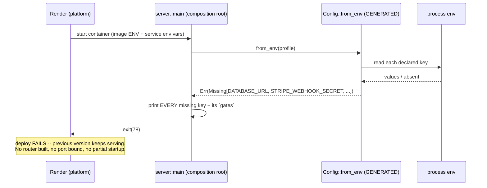
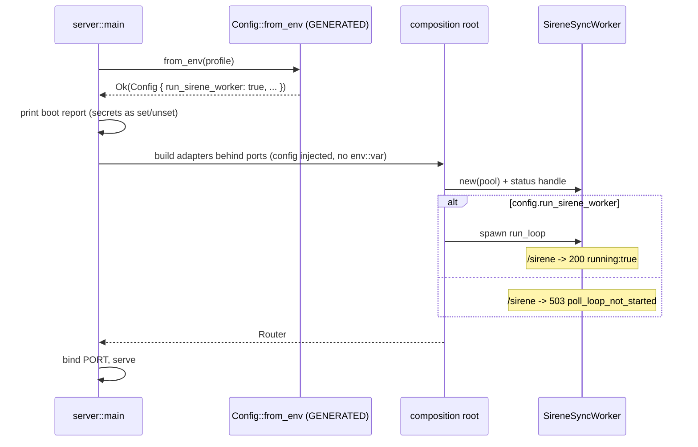

# PROP-20260729-004500 — Configuration is declared in the DSL and validated at startup

- **Status**: **Approved** (partially) — product owner, in-session 2026-07-29: *"Fail-fast: approved"*.
  **D2** (which keys become hard requirements) and **D5** (warn-only for one deploy, then enforce) are
  approved as recommended. **D1** (per-profile required-ness) and **D3** (explicit `APP_PROFILE`) are
  taken as recommended — fail-fast without them would prevent any local run lacking a full production
  secret set, so they are entailed by making the approved mechanism workable, not separate choices.
  **D4** (`/config` endpoint) is **deferred** to a follow-up to keep the realizing change scoped to the
  approved mechanism.
- **Date**: 2026-07-29
- **Tracking issue**: [#246 "Declare the app's configuration in specs/, validate it at startup, and refuse to boot when a required key is missing"](https://github.com/TheCaptainCompany/captain-food/issues/246)
- **Realized by**: _(filled at completion)_

## Context

Configuration is the one part of this system with **no source of truth**. `specs/` governs the domain,
the API surface, the screens and the observability contracts. The ~21 environment variables the app
actually reads are declared nowhere — they exist only as inline `std::env::var` calls scattered through
the composition root, plus a partial, stale mirror in a `render.yaml` that is not applied.

The cost of that gap, measured over a single evening (2026-07-28):

| symptom | detail |
|---|---|
| A toggle with no home | `RUN_SIRENE_WORKER` gates the SIRENE drain, defaults **OFF**, and is set in no file, no manifest, and (apparently) not in the Render dashboard. 6,649 department-37 rows sat `PENDING` for 4h. |
| Answering "is it running?" | Took a code read, three `curl`s and an elimination argument. Fixed for workers by [#244](https://github.com/TheCaptainCompany/captain-food/issues/244) (`/sirene`), but only for workers. |
| A ghost variable | `API_SECRET` is configured on the Render service, read by nothing, never in git history, not a Render platform variable. |
| A stale mirror | `render.yaml` documents 9 variables; the code reads ~21. It also documents `HUBRISE_ACCESS_TOKEN`, retired in code. |
| Silent degradation | No `AUTH_SESSION_KEY` → login quietly becomes anonymous-only. No `STRIPE_WEBHOOK_SECRET` → webhook verification fails closed, so **a captured payment never reaches the domain**. |

That last row is the one that matters most in this product: `CLAUDE.md` names *"a paid order that nobody
is told about"* as the worst failure mode there is, and today a single unset variable produces exactly
it, at boot, with no signal beyond one line on stderr.

## Recommended approach

**Declare configuration in the DSL; generate the reader; fail fast on what is missing.**

### 1. `specs/configuration.yaml` — the declaration

```yaml
keys:
  DATABASE_URL:
    type: string
    secret: true
    required: [production, staging]      # optional in dev → in-memory/offline paths
    gates: "Postgres pool: event store, read models, every worker."
  RUN_SIRENE_WORKER:
    type: bool
    default: false
    gates: "SIRENE staging drain (ADR-0045). OFF pauses registry-driven prospect creation."
  STRIPE_WEBHOOK_SECRET:
    type: string
    secret: true
    required: [production]
    gates: "Stripe webhook signature verification. Unset => 503 => PaymentCaptured never lands."
```

Each key carries its **type**, **required-ness per profile**, **default**, `secret: true` (presence is
reported, the value never is), and — load-bearing — **`gates`**: what breaks without it. That string is
what turns a failure message from `missing RUN_SIRENE_WORKER` into something an operator can act on at
00:40 without reading Rust.

### 2. Codegen → a typed config struct

`Config::from_env()` is generated: one parse, one place, typed fields. The composition root reads
`config.run_sirene_worker` instead of calling `env::var` inline. The lenient `env_flag` parsing from
[#244](https://github.com/TheCaptainCompany/captain-food/issues/244) moves into the generated reader,
so every `bool` key gets it for free.

### 3. Fail-fast, reporting **all** missing keys

```
FATAL: 3 required configuration keys are missing (profile: production)

  DATABASE_URL           Postgres pool: event store, read models, every worker.
  STRIPE_WEBHOOK_SECRET  Stripe webhook signature verification. Unset => 503 =>
                         PaymentCaptured never lands.
  AUTH_SESSION_KEY       AES-256-GCM key for parked auth sessions (32 bytes, hex or
                         base64). Unset => session cookies unavailable, auth
                         anonymous-only.

Set them in the service environment and redeploy. Nothing was started.
```

All of them, not the first — an operator fixes one variable per deploy cycle otherwise. Then exit
non-zero.

### 4. A boot report of what DID resolve

```
config: profile=production, 18 keys resolved
  RUN_SIRENE_WORKER      = true            (env)
  RUN_PROJECTOR          = true            (default)
  DATABASE_URL           = set             (env, secret)
  STRIPE_SECRET_KEY      = set [test mode] (env, secret)
```

Secrets report `set`/`unset`, never a value. Stripe additionally reports **mode**, derived from the
`sk_test_` / `sk_live_` prefix — so *"is production actually live?"* stops being an assumption.

### 5. Derived artifacts — the drift ends here

The same declaration emits the `render.yaml` env manifest, the CI-sync list (GitHub secrets → Render
API), and the documented inventory. A key exists in exactly one place; everything else is generated.
`API_SECRET` becomes visibly undeclared instead of invisibly pointless.

## Why fail-fast does not contradict ADR-0043

ADR-0043 has the app **start and report `503`** when the DB schema is behind. That looks like the
opposite of refusing to boot. The distinguishing rule:

> **Missing configuration cannot self-heal → refuse to start.
> An unavailable dependency can → start, report `503`, keep probing.**

A schema-behind DB resolves itself the moment CI applies the migration; the app must be alive to notice.
An absent `AUTH_SESSION_KEY` will never appear on its own — staying up only serves degraded traffic.

**Deploy safety makes this strictly better on Render**: a container that exits fails the deploy, and the
**previous version keeps serving**. Today a misconfigured deploy replaces a working one and silently
degrades; with fail-fast it cannot take over at all.

## Screen mockups

**Not applicable — no screens.** This is a startup/ops concern with no SDUI surface: the actors are the
operator reading stdout and CI reading an exit code. The two "screens" are the terminal outputs in §3
and §4 above, and the optional `/config` endpoint in D4. Recorded explicitly rather than skipped, per
the proposal checklist.

## Sequence diagrams

### Boot with a missing required key (the fail-fast path)



### Boot with configuration complete



Both are infrastructure-only by construction: `domain` and `application` never read configuration —
the composition root injects it behind ports, so the dependency rule (ADR-0035) holds.

## Decisions surfaced

### D1 — Required-ness model

| option | pros | cons |
|---|---|---|
| **Per-profile `required: [production, staging]`** ✅ **recommended** | Production cannot boot misconfigured; dev/CI still start with a partial secret set; the spec states the difference instead of folklore | Needs a profile input (`APP_PROFILE`, defaulting to `development`) — one more key, and a wrong profile weakens the gate |
| Always required | Simplest rule, no profile concept | Nobody can run the server locally without every Stripe/Supabase/HubRise secret — pushes people to fake values, which is worse |
| Never required (warn only) | Zero risk of a boot loop | Exactly today's behaviour; the directive is specifically to stop the app |

### D2 — Which currently-degrading keys become hard requirements in production

| key | today when absent | proposed |
|---|---|---|
| `STRIPE_WEBHOOK_SECRET` | webhook `503` → **captured payment never reaches the domain** | **required** — this is the worst failure mode in the product |
| `AUTH_SESSION_KEY` | login silently anonymous-only | **required** — a storefront that cannot log a customer in is not serving |
| `DATABASE_URL` | `/health` `503`, no persistence | **required** |
| `SUPABASE_URL` / `SUPABASE_PUBLISHABLE_KEY` | identity fail-closed | **required** |
| `STRIPE_SECRET_KEY` | payment gateway fail-closed | **required** |
| `INTERNAL_TRIGGER_TOKEN` | drain ping `503` (poll still works) | optional — degrades latency, not correctness |
| `EXTERNAL_API_TOKENS`, `HUBRISE_*` | feature unavailable | optional |
| `RUN_*` | documented default | optional with default |

Pro: every silent-degradation path in the table's top half becomes impossible in production.
Con: the first deploy after this lands **will fail** if any of them is genuinely unset — which is the
point, but it must be sequenced deliberately (see the verification plan).

### D3 — Where the profile comes from

| option | pros | cons |
|---|---|---|
| **`APP_PROFILE` env key, default `development`** ✅ **recommended** | Explicit, greppable, declared like everything else; dev is safe by default | A production service that forgets to set it silently gets dev leniency |
| Infer from `RENDER` platform var | No new key; Render always injects it | Ties the profile to one host; local prod-like runs impossible |
| Infer from `sk_live_` / DB host | No new key | Magic, and wrong the moment modes are mixed during a switch-over |

### D4 — A `/config` endpoint?

| option | pros | cons |
|---|---|---|
| **Yes, presence-only** ✅ **recommended** | Same one-curl answer `/sirene` just proved valuable; makes "is `RUN_SIRENE_WORKER` set?" answerable without dashboard access | One more unauthenticated ops surface; must never leak values |
| No | Nothing to leak | The boot report is only visible in logs, which is exactly what was unavailable at 00:40 on a phone |

Presence-only means: key name, `set`/`unset` for secrets, literal value for non-secrets (the `RUN_*`
toggles), the resolved profile, and the Stripe mode. No secret value is ever rendered.

### D5 — Rollout sequencing

| option | pros | cons |
|---|---|---|
| **Warn-only for one deploy, then enforce** ✅ **recommended** | The first deploy reports exactly what production is missing without taking anything down; enforcement lands with the list already fixed | Two deploys instead of one |
| Enforce immediately | One step | If production is missing a key today (likely — `AUTH_SESSION_KEY` is unverified), the deploy fails and the cause is a change we just shipped |

## Verification plan

1. Codegen tests: every declared key appears in the generated struct; a spec key with no `gates` fails
   validation (an unexplained key is not declared, it is merely listed).
2. Unit tests on the generated reader: missing-required collects **all** keys (not the first); secrets
   never appear in any rendered output — asserted by scanning the report for the value; type/parse
   errors are reported as clearly as absences.
3. A drift test in the same family as `makefile_recipe_lines_are_ascii`: **every `env::var` / `env_flag`
   call site in `crates/**` corresponds to a declared key**. This is what stops the inventory rotting
   again — the failure mode that produced this proposal.
4. Warm-run on production in warn-only mode (D5): the boot report becomes the authoritative answer to
   *"what is actually configured?"*, including whether `RUN_SIRENE_WORKER` and `AUTH_SESSION_KEY` are set.
5. Then enforce, and confirm a deliberately-broken deploy fails while the previous version keeps serving.

## Alternatives considered

| alternative | why it lost |
|---|---|
| **`.env.example` + documentation** | Hand-maintained, unenforced, drifts — precisely how `render.yaml` reached 9-of-21 with a retired entry. |
| **A `figment`/`config`-crate layered loader in Rust only** | Solves typed parsing but leaves the declaration in code, so `render.yaml`, the CI-sync list and the docs stay hand-written and still drift. The DSL is the only place that generates all four. |
| **Validate in CI instead of at startup** | CI cannot see the Render service's actual env; only the process itself knows what it received. CI validation is additive, not a substitute. |
| **Keep silent degradation, add alerting** | Detects after the fact what fail-fast prevents outright, and needs alerting infrastructure that does not exist yet. |
