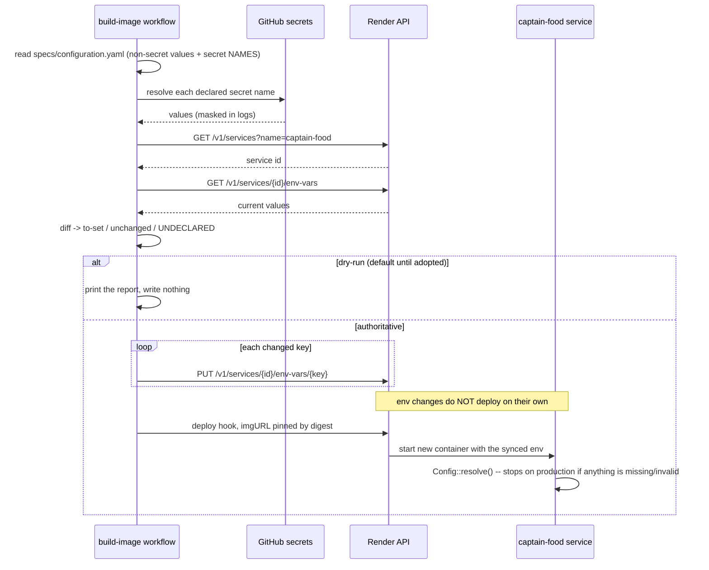

# PROP-20260729-014500 — CI owns the Render service configuration

- **Status**: Proposed
- **Date**: 2026-07-29
- **Tracking issue**: [#248 "CI owns the Render service configuration: sync specs/configuration.yaml + repo secrets to the service, never the dashboard"](https://github.com/TheCaptainCompany/captain-food/issues/248)
- **Realized by**: _(filled at completion)_
- **Builds on**: [#246](https://github.com/TheCaptainCompany/captain-food/issues/246) / ADR-20260729-010500 (the declaration this makes authoritative)

## Context

[#246](https://github.com/TheCaptainCompany/captain-food/issues/246) gave configuration a **declaration**.
It did not give it an **owner**: the values are still typed by hand into the Render dashboard.

That is not a theoretical gap. The production boot log of 2026-07-28 reads:

```
sirene sync worker: PAUSED (issue #220) — poll loop not started; set RUN_SIRENE_WORKER=true to resume
```

`RUN_SIRENE_WORKER` was never set. 6,649 department-37 rows have sat `PENDING` since, the mirror's
payloads are unreleased, and establishing *why* consumed an evening. In the same dashboard sits
`API_SECRET`, which no code has ever read. Neither fact was visible from the repository.

**A declaration nothing enforces is documentation.** CI enforcing it is what makes the spec true.

## Recommended approach

`specs/configuration.yaml` becomes the deployment manifest as well as the declaration, and a CI step
pushes it to the service before the existing digest-pinned deploy.

### What lives where

| | where the value lives | why |
|---|---|---|
| **Non-secret** (`RUN_*`, `APP_PROFILE`, `PORT`, `WEB_ASSETS_DIR`) | the spec, per profile — **baked into the image** if D5 is taken | reviewed in a PR; git history explains *why* a pipeline was paused, and baking makes the digest determine behaviour |
| **Secret** (DB, Stripe, Supabase, HubRise, tokens) | GitHub repo secrets; the spec names only the KEY to read | never in the repo, never in the image (the GHCR package is public) |

A `deploy:` block per key, so the manifest is part of the same declaration the reader is generated from:

```yaml
RUN_SIRENE_WORKER:
  type: bool
  deploy:
    production: "true"          # a one-line, reviewed PR resumes the drain

STRIPE_SECRET_KEY:
  secret: true
  deploy:
    from_secret:
      staging:    STRIPE_SECRET_KEY_TEST
      production: STRIPE_SECRET_KEY_PROD   # mode is a DEPLOY choice; the app stays mode-agnostic
```

### Mechanism — every piece already proven in this repo

1. **Resolve the service** — `GET /v1/services?name=captain-food`, exactly as `render-status.yml` and
   `prod-smoke.sh` already do with the existing `RENDER_API_KEY`.
2. **Upsert each declared key** — `PUT /v1/services/{id}/env-vars/{key}`.
3. **Deploy** — the existing hook, pinned by digest.

Render's API documents that env changes **do not deploy automatically** (*"you must call the deploy
API… irrespective of the `autoDeploy` option"*), so sync-then-deploy has no race with `autoDeploy: false`.

4. **Drift report** — list dashboard keys absent from the spec, and declared keys whose deployed value
   differs. `API_SECRET` surfaces on the first run.

## Screen mockups

**Not applicable — no screens.** The actors are CI and an operator reading a job log. The interface is
the drift report, shown in the dry-run output below.

```
render-config-sync (dry-run) — service captain-food (srv-…), profile production

  WOULD SET    RUN_SIRENE_WORKER            true            (spec)         [currently: unset]
  WOULD SET    APP_PROFILE                  production      (spec)         [currently: unset]
  unchanged    RUN_PROJECTOR                true            (spec)
  unchanged    DATABASE_URL                 <secret>        (repo secret)
  WOULD SET    STRIPE_SECRET_KEY            <secret>        (STRIPE_SECRET_KEY_PROD)
  UNDECLARED   API_SECRET                                   [on the service, in no spec]

  3 change(s), 1 undeclared. Dry-run: nothing was written.
```

## Sequence diagram



The app-side half is unchanged: the generated reader still validates at startup, so a sync that pushes
a malformed value is caught by the same gate — and on production the container exits, the deploy fails,
and the previous version keeps serving.

## Decisions surfaced

### D1 — Write mode

| option | pros | cons |
|---|---|---|
| **Upsert only** (`PUT …/env-vars/{key}`) ✅ **recommended to start** | Cannot delete anything; a dashboard-only key survives; safe while the manifest is still incomplete | Drift persists — it is reported, not corrected |
| Replace-all (`PUT …/env-vars`) | True IaC: the service becomes exactly the spec, drift impossible | **Deletes every undeclared key on first run.** With the manifest days old and secrets not yet bootstrapped, that is a production outage in one call |
| Upsert + explicit `DELETE` for keys marked `retired:` | Corrects drift deliberately, one reviewed key at a time | More machinery; a two-step dance for each removal |

Recommendation: **upsert now, revisit replace-all once the drift report has been empty for several
deploys.** The safe ordering is the same one #238 taught: never remove what CI does not yet write.

### D2 — Dry-run first?

| option | pros | cons |
|---|---|---|
| **Dry-run default, flipped by a workflow input** ✅ **recommended** | This workflow **cannot be tested outside CI** — there is no local `RENDER_API_KEY`, so its first real run is against production. A dry-run makes that first run observable | One extra manual step before it is authoritative |
| Authoritative immediately | Fewer steps | An untested workflow's first action is rewriting live production config |

### D3 — Secret bootstrap ordering

| option | pros | cons |
|---|---|---|
| **Sync non-secrets first; secrets once copied into GitHub** ✅ **recommended** | Unblocks `RUN_SIRENE_WORKER` immediately (the actual pain) with zero secret-handling risk | Two phases |
| Everything at once | One change | Requires copying ~8 secrets before anything works; a mistyped `DATABASE_URL` fails the deploy (safely, but noisily) |

### D4 — `RENDER_API_KEY` becomes a write credential

| option | pros | cons |
|---|---|---|
| **Reuse the existing account key** ✅ **recommended** | Already present and already account-scoped, so the exposure exists today; nothing new to store | CI can now rewrite production config — a real escalation, mitigated by main-only runs and the post-deploy `/health` + `prod-smoke` gates |
| A second, service-scoped key | Least privilege | Render API keys are account-scoped; there is no narrower token to issue |

### D5 — Where non-secret values live: baked into the image, or service env?

Raised by the product owner (2026-07-29): *"Is it possible to configure the deployment not the render
service?"* — the more principled instinct, and one the recommendation above had quietly skipped.

**What the platform allows.** Render's deploy API accepts only `clearCache`, `commitId`, `imageUrl`
and `deployMode` — **no env field**. A deploy always runs with the *service's* stored environment
variables, so there is no per-deploy override. The only way to attach configuration to the deployment
itself is to **bake it into the image** (`ARG`/`ENV`), which the build already does for
`CAPTAIN_BUILD_VERSION`.

**The hard constraint.** The GHCR package is **public** (it must be, so Render can pull it without
credentials — `render.yaml`). A baked `ENV` is world-readable via `docker pull` + `docker history`.
So secrets can never be baked, whatever the merits. This decision is only about the NON-secret values.

| option | pros | cons |
|---|---|---|
| **Hybrid: bake non-secrets, sync secrets** ✅ **recommended** | Config becomes part of the immutable artifact: content-addressed with the digest, so a rollback restores the exact config that shipped with that build. No mutable service state for toggles, therefore no drift to detect. Runtime env still overrides image `ENV`, so a dashboard var remains an emergency lever | Flipping a toggle needs a rebuild + redeploy (minutes) rather than an edit. Two mechanisms to understand instead of one |
| Everything through service env (as originally proposed) | One mechanism; a toggle flip is seconds | Config is mutable state *outside* the artifact: a rollback restores the old code with the NEW config, which is precisely the combination nobody tested |
| Everything baked | Fully immutable, one mechanism | **Impossible** — public image, so secrets would be published |

**Why the rollback argument decides it.** Deploys here are digest-pinned specifically so production never
runs an ambiguous artifact. Leaving toggles in mutable service state re-opens that ambiguity by the back
door: `sha-abc123` deployed today and re-deployed next month can behave differently, and nothing records
why. Baking the non-secrets closes it — the digest then determines behaviour completely, except for
secrets, which cannot change behaviour, only enable it.

**Cost, stated plainly**: pausing a pipeline becomes a PR + build (~minutes) instead of a dashboard edit.
For a flag whose entire job is to stop a production pipeline, being reviewed and recorded is the
feature — and the runtime override survives for the case where minutes are too slow.

## Verification plan

1. Dry-run on `main` → the report names `RUN_SIRENE_WORKER` as `WOULD SET` and `API_SECRET` as
   `UNDECLARED`. That output alone is the first repo-visible answer to "what is production configured with".
2. Land the non-secrets — by baking them into the image if D5 is taken, else by flipping the sync to
   authoritative for those keys — and confirm the boot log shows `sirene sync worker: running
   in-process` and `/sirene` returns `200`.
3. Confirm the department-37 rows drain (`SYNCED`, payloads released) — the end-to-end proof.
4. Bootstrap secrets into GitHub, extend the sync, confirm `/health` stays green across a deploy.
5. Only then consider replace-all (D1).

## Alternatives considered

| alternative | why it lost |
|---|---|
| **Re-adopt the Render Blueprint** (`render.yaml` as real IaC) | It was retired on 2026-07-21 because Blueprint sync fought the digest-pinned hook deploys and kept resetting `image.url`. Re-adopting reopens that conflict. |
| **Bake everything into the Docker image** | The GHCR package is **public** — a baked `ENV` secret is world-readable via `docker history`. Viable for non-secret toggles only, which is no longer an aside: it is **D5**, raised by the product owner and recommended as a hybrid. |
| **Keep the dashboard, add a CI drift *check*** | Detects the problem without fixing it: someone still has to hand-edit, and the check goes red until they do. |
| **A `.env` file committed and read at boot** | Secrets in the repo. Non-starter. |
