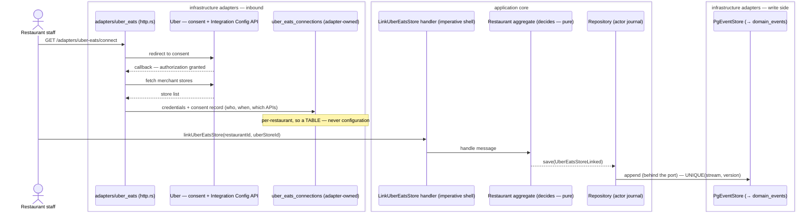
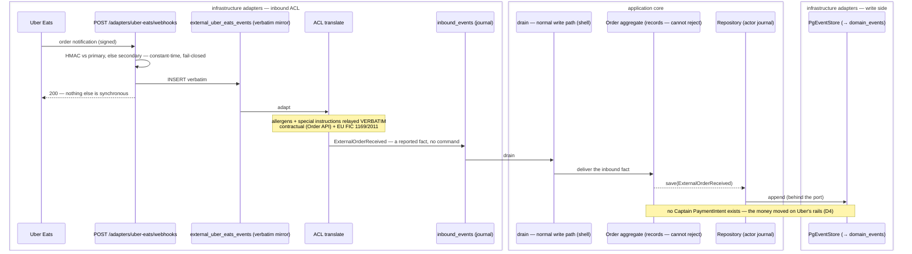
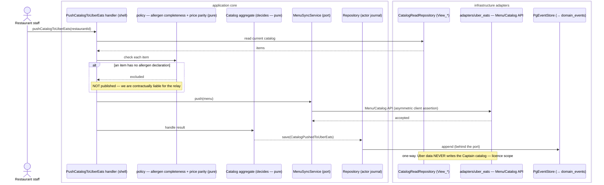
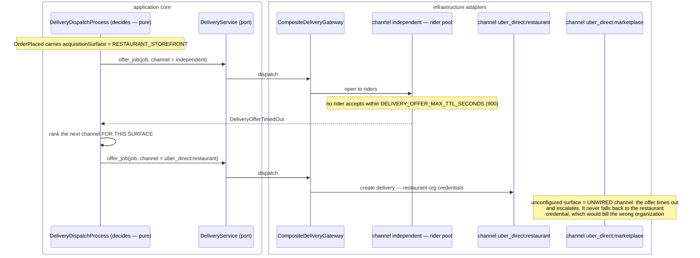

# PROP-20260730-032306 — Uber Eats Marketplace integration, and per-surface Uber Direct credentials

- **Status**: Proposed (partially approved — see §3; D2/D6 decided in session, recorded by ADR-20260730-032306)
- **Date**: 2026-07-30
- **Tracking issue**: [#260 "Epic: Uber Eats Marketplace integration (order centralization + menu sync) and per-surface Uber Direct credentials"](https://github.com/TheCaptainCompany/captain-food/issues/260)
- **Realized by**: _(filled at completion)_

---

## 1. Context

On 2026-07-30 the product owner registered **Captain Food Restaurant** on the Uber developer
dashboard against the **Eats Marketplace** API suite, accepted the API Licensing Agreement with all
seven APIs selected, and generated webhook signing keys. That is a real commercial commitment to an
integration that **exists nowhere in the specs**.

What the repo contains today, verified:

| Thing | Where | Status |
|---|---|---|
| Uber Eats **price comparison** | ADR-0022/0023/0024/0025/0030, `entities.yaml#/UberComparison` | ✅ shipped — a *display* feature, per-cuisine mark-up coefficients |
| Uber **Direct** delivery adapter | `crates/adapters/uber_direct`, [#57 "Uber Eats (Uber Direct) delivery-partner adapter"](https://github.com/TheCaptainCompany/captain-food/issues/57) | ✅ merged; 7 `UBER_DIRECT_*` keys declared (`configuration.yaml:677-744`), symmetric `client_secret` auth, no Uber app registered against it |
| Uber **Eats Marketplace** integration | — | ❌ nothing: no spec, no ADR, no adapter, no config |

So this proposal covers the new integration, plus two things it forces into the open.

**The catalog would flow outbound for the first time.** Today catalog data only ever flows *in*
(HubRise → `ImportCatalog` through the ACL). Pushing a menu *to* Uber Eats reverses the direction and
raises menu ownership.

**An Uber-originated order breaks an assumption about money.** `OrderPlaced` today implies a Captain
Stripe PaymentIntent, and the VAT/receipt and payment-agent posture assume Captain handled the funds.
An order arriving from Uber Eats was already accepted and already paid, on Uber's rails.

### 1.1 What the agreement obliges us to

Read from the API Licensing Agreement as accepted (Provider entity: *Caring Hope Foundation*, RNA
W372020229 — see D7), all seven APIs selected:

- **Order API** — *"the Provider is wholly responsible for correctly relaying all information provided
  in such Order API between Uber and Merchant systems, including but not limited to allergy
  information and special instructions."* Combined with EU FIC 1169/2011 (already a named legal
  precondition in `CLAUDE.md`, not a backlog item), allergen fidelity becomes contractual **and**
  regulatory. An ACL that silently drops an allergen field is a breach of both.
- **Reporting API** — the Provider warrants that *each* merchant expressly authorized the access.
  That is a recorded, per-restaurant consent artifact, not merely possession of a token.
- **Integration Configuration API** — merchant-authorized provisioning of locations onto Order/Menu
  APIs, "on an ongoing basis until … explicitly terminates". A revocation path is part of the model,
  not an afterthought.
- **Licence scope** — data reaches us to serve that merchant *on Uber*. It must not seed the Captain
  marketplace catalog. This is an ACL design constraint, enforced by direction of flow, not by intent.

---

## 2. Recommended approach

Four slices, in dependency order. Each is independently shippable and independently useful.

### Slice A — the verbatim inbound mirror (smallest useful thing)

`POST /adapters/uber-eats/webhooks`: verify HMAC over the raw body against **either** signing key
(constant-time, fail-closed), write the body verbatim into a new `external_uber_eats_events` staging
table, return 200. No ACL, no domain translation.

This is the established two-layer inbox (ADR-0045, ADR-20260720-015400) already run twice
(`external_stripe_events`, `external_hubrise_callbacks`). Shipping it first means Uber's *Verify
Integration* step passes and **no event is lost** while the translation layer is designed. It is also
the only slice needed before the dashboard webhook can be safely enabled.

### Slice B — merchant consent and store provisioning

`GET /adapters/uber-eats/connect` → Uber consent → callback, mirroring the HubRise connect flow
([#20](https://github.com/TheCaptainCompany/captain-food/issues/20), ADR-20260721-100601). Stores the
per-restaurant Uber **store id** plus the **consent record** (who authorized, when, which APIs) in a
new adapter-owned `uber_eats_connections` table.

Per-restaurant values cannot live in `configuration.yaml` — config is per-deployment, and this scales
with restaurants. That is exactly the `hubrise_connections` precedent.

### Slice C — outbound menu / store push

`Catalog`/`Menu`/`Store` APIs, driven by a command (`PushCatalogToUberEats`) so it is rejectable and
auditable. One-way: Captain/HubRise → Uber. Never Uber → Captain catalog (§1.1 licence scope).

### Slice D — inbound order relay

Uber-originated orders drained from the mirror through the ACL as **inbound events** (facts, not
commands — the marketplace already accepted them; we cannot say no; `CLAUDE.md` request/report rule).
Gated on D4, because the representation of a non-Captain-paid order is an open decision.

### Slice E — per-surface Uber Direct credentials

Independent of A–D but sharing the credential model: record the **acquisition surface** on the order
and key the delivery channel by it.

---

## 3. Decisions

### D1 — Build the Eats integration directly, or layer on HubRise?

HubRise *is* a POS↔marketplace middleware: it already syncs menus to Uber Eats and Deliveroo, and
`specs/integrations/hubrise.md` §4.5 records that it already carries a restaurant's Uber Eats menu
prices (the source for `basis: REAL` comparisons).

| Option | Pros | Cons |
|---|---|---|
| **A. Direct Uber Eats integration** ✅ *(chosen — the app is registered)* | Reaches restaurants with no POS and no middleware — precisely the independent-restaurant segment Captain targets. No dependency on HubRise's roadmap or pricing. Full control of allergen fidelity, which we are now contractually liable for. | N integrations to build and certify (Deliveroo next). We own menu-conflict semantics. Uber verification/approval is an external gate. |
| B. Layer on HubRise | One integration, already built and connected. Their certifications, their channel coverage. | Only reaches restaurants already on HubRise. We inherit their roadmap and pay per location. Allergen liability still ours contractually, but the relay is not — the worst split. |
| C. Both (HubRise where connected, direct otherwise) | Best coverage. | Two code paths for one capability, and two answers to "who owns this menu" per restaurant. Defer until A is real. |

### D2 — Which Uber organization is billed for a Direct dispatch? **DECIDED: A**

| Option | Pros | Cons |
|---|---|---|
| **A. Captain opens two orgs** ✅ *(product owner, 2026-07-30)* | Clean separation of storefront vs marketplace delivery cost, straight from Uber's own invoices. No internal apportionment to defend. | Two Uber contracts and credential sets to keep alive. Makes Captain a principal for the storefront delivery leg → touches the payment-agent posture (a French legal precondition). Credential must be chosen per order. |
| B. Each restaurant opens its own | Captain stays out of the delivery money flow entirely — simplest legally. | Credentials become per-tenant (`uber_direct_connections`), N onboardings, and most independents will not do it. |
| C. Captain opens one org, attributes internally | One credential set, no prefix, no second negotiation. `deliveryJobId` is already the read-back reference so Uber's per-delivery records reconcile to our orders exactly. | Attribution becomes our reporting problem rather than Uber's invoice. |

*C was recommended and A was chosen; recorded rather than re-litigated. Note A still needs the
surface on the order (D3), so nothing in D3 is contingent on this.*

### D3 — Where does the acquisition surface live?

Dispatch runs in `DeliveryDispatchProcess` on a spawned task **after** the mutation has answered
`PENDING` (acceptance-first, ADR-20260720-015500). The `Host` header is gone by then.

| Option | Pros | Cons |
|---|---|---|
| **A. A field on `OrderPlaced`** ✅ *recommended* | It is a fact about the order, true forever, folded like any other. Available to dispatch, to reporting, to the receipt. Survives replay. | Event payload change → plan mode, ADR-0032 completeness (test + rule). |
| B. On the `Cart`, inherited at checkout | Captures it at the earliest point. | Carts persist indefinitely (`CartStatus.OPEN`); a cart built on one surface and checked out on another would lie. |
| C. Derived at dispatch from the tenant middleware | No spec change. | Impossible — the request is over. Would require threading a request-scoped value into a background task, i.e. inventing a second, weaker order record. |
| D. A projection column only | No event change. | A projection is derived state; you cannot derive what was never recorded. |

### D4 — How is a marketplace-originated order represented? **OPEN**

An Uber Eats order has no Captain PaymentIntent, yet `OrderPlaced` implies one.

| Option | Pros | Cons |
|---|---|---|
| **A. A distinct `ExternalOrderReceived` event on the Order stream** ✅ *recommended* | Honest: a different fact with different provenance. Payment invariants stay strict on `OrderPlaced`. Sales-channel reporting falls out naturally. | New event + fold arms; every `OrderPlaced` consumer must be audited for the sibling case. |
| B. Make the payment fields nullable on `OrderPlaced` | Smallest diff. | Weakens the invariant for *every* order to accommodate a minority — the classic way a money guarantee erodes. |
| C. Synthesize a zero-amount Captain payment | No consumer changes. | Fabricates a financial record that never happened. Unacceptable for VAT/receipts. |

Also open within D4: VAT and receipt responsibility on an Uber-originated order, and whether it
appears in Captain's own revenue reporting at all.

### D5 — Who owns the menu when three systems can edit it? **OPEN**

| Option | Pros | Cons |
|---|---|---|
| **A. HubRise authoritative when connected, else Captain** ✅ *recommended* | Matches reality: the POS is the operational source of truth. One writer per restaurant, decided by a fact we already store. | Two configurations to reason about. |
| B. Captain always authoritative | One rule; simplest push. | Overwrites POS edits — the restaurant's own tills lose. |
| C. Last-write-wins across all three | No coordination. | Silent divergence; unresolvable support calls. |
| D. Per-restaurant explicit choice | Honest about heterogeneity. | A setting most restaurants cannot answer meaningfully. |

**Price parity is part of D5.** Restaurants routinely mark up their Uber Eats menu to absorb Uber's
commission, and ADR-0024's comparison coefficients are calibrated on that assumption. Pushing Captain
prices to Uber Eats unchanged would undercut the restaurant's own Uber pricing on its behalf *and*
invalidate the comparison feature's basis. A per-channel price adjustment is likely required before
Slice C ships.

### D6 — Uber app authentication. **DECIDED: asymmetric**

| Option | Pros | Cons |
|---|---|---|
| **A. Asymmetric (application id + key id + private key)** ✅ *(product owner, 2026-07-30)* | No shared secret; the private key never leaves us; nothing replayable if Uber's store leaks. Key id enables rotation. | Retires `UBER_DIRECT_CLIENT_SECRET`/`SCOPE` and the existing OAuth2 token manager in `crates/adapters/uber_direct`. PEM handling needs care (base64 at rest — see §6). |
| B. Symmetric `client_secret` | Already implemented. | A shared secret both parties hold. |

### D7 — Is the Provider entity on the agreement the operating entity? **OPEN — needs legal input**

The agreement was signed by **Caring Hope Foundation**, RNA W372020229 — a French *association loi
1901*. The platform is developed under `TheCaptainCompany`.

- An Uber API licence follows the entity. If the association holds the licence and a different entity
  operates the platform and earns commission, the access sits outside the licence — a termination
  right, and a problem for liability and VAT.
- A loi-1901 association running a commissioned marketplace raises its own tax/status questions.

Not an engineering decision; flagged here because `CLAUDE.md` requires French legal preconditions to
be surfaced rather than deferred silently, and because a future session cannot infer it.

---

## 4. Screen mockups

### UC-1 — Restaurant connects Uber Eats (`restaurant_backoffice`, RESTAURANT_ACCOUNT)

```
┌─ Sales channels ─────────────────────────────────────────────┐
│                                                              │
│  Captain.Food storefront          ● Live                     │
│  pizza-mario.captain.food                                    │
│                                                              │
│  HubRise (POS)                    ● Connected                │
│  Le Comptoir · 2 locations              [ Manage ]           │
│                                                              │
│  Uber Eats                        ○ Not connected            │
│  Sync your menu and receive Uber orders here.                │
│                                   [ Connect Uber Eats ]      │
│                                     → uberEatsConnect        │
│                                                              │
│  Deliveroo                        ○ Not available yet         │
└──────────────────────────────────────────────────────────────┘
```

### UC-2 — Consent and store mapping (after Uber callback)

```
┌─ Connect Uber Eats ──────────────────────────────────────────┐
│  ✓ Authorized as Le Comptoir (Uber account #4471…)            │
│                                                              │
│  Map your Uber stores to your Captain restaurants:            │
│                                                              │
│   Uber store              →  Captain restaurant              │
│   ┌──────────────────────┐   ┌──────────────────────┐        │
│   │ Le Comptoir – Tours  │ → │ le-comptoir       ▾  │        │
│   │ Le Comptoir – Joué   │ → │ (do not sync)     ▾  │        │
│   └──────────────────────┘   └──────────────────────┘        │
│                                                              │
│  ☑ I authorize Captain.Food to access my Uber reporting data  │
│     (required by Uber for financial reports)                  │
│                                                              │
│                            [ Cancel ]  [ Confirm mapping ]    │
│                                          → linkUberEatsStore  │
└──────────────────────────────────────────────────────────────┘
```

The checkbox is not decoration — it is the Reporting API warranty (§1.1), and its grant is what
`uber_eats_connections` records.

### UC-3 — Menu push with the price-parity warning (Slice C, gated on D5)

```
┌─ Uber Eats · Menu ───────────────────────────────────────────┐
│  Source of truth: HubRise (your POS)                          │
│  Last pushed: 2026-07-30 11:04 · 84 items · 3 skipped         │
│                                                              │
│  ⚠ 3 items skipped — no allergen declaration                   │
│     Uber requires allergen info for distance selling.          │
│     [ Review the 3 items ]                                    │
│                                                              │
│  ⚠ Your Uber prices are 28% above your Captain prices.         │
│     Pushing will overwrite them. Keep an Uber price uplift?    │
│     ( ) Push Captain prices as-is                              │
│     (•) Keep current uplift  [ 28 ]%                           │
│                                                              │
│                        [ Push menu to Uber Eats ]             │
│                          → pushCatalogToUberEats              │
└──────────────────────────────────────────────────────────────┘
```

The allergen block is a hard gate, not a warning to dismiss: we are contractually liable for relaying
allergen data (§1.1), so an item without it must not be published.

### UC-4 — Order list showing provenance (RESTAURANT)

```
┌─ Today's orders ─────────────────────────────────────────────┐
│  #1043  19:12  Captain (storefront)  22,40 €  ● Preparing     │
│  #1044  19:14  Uber Eats             18,90 €  ● Accepted      │
│  #1045  19:15  Captain (marketplace) 31,00 €  ● New           │
│                                          [ Accept ] [ Reject ]│
└──────────────────────────────────────────────────────────────┘
```

One list, provenance visible. This is the surface field of D3 and the channel of D4 becoming
operationally useful: staff must know an Uber order cannot be refunded through Captain.

### UC-5 — Connection health (ADMIN)

```
┌─ Uber Eats integration ──────────────────────────────────────┐
│  App: Captain Food Restaurant (TEST)   Suite: Eats Marketplace│
│  Signing keys: primary ✓  secondary ✓ (rotation ready)        │
│                                                              │
│  Webhooks (24h)   received 412 · verified 412 · rejected 0    │
│  Mirror backlog   0 undrained                                 │
│  Connections      7 restaurants · 1 consent revoked           │
└──────────────────────────────────────────────────────────────┘
```

---

## 5. Sequence diagrams

Drawn per `docs/claude/mermaid.md`: the actor **decides** (pure), facts are saved **through the
`Repository`**, and `PgEventStore` is the one adapter behind it. Layers grouped with `box`.

### F1 — Merchant consent and store provisioning (Slice B)



### F2 — Inbound Uber order: mirror, then drain as a FACT (Slices A + D)



### F3 — Outbound menu push (Slice C)



### F4 — Surface-aware Direct dispatch (Slice E)



---

## 6. Configuration

Five keys for the Eats app, declared **in the change that lands the adapter** — not before, so the
drift gate stays meaningful in both directions (declared-with-no-reader is drift too):

```
UBER_EATS_APPLICATION_ID          UBER_EATS_SIGNING_KEY
UBER_EATS_KEY_ID                  UBER_EATS_SIGNING_KEY_SECONDARY   (optional -- rotation overlap)
UBER_EATS_PRIVATE_KEY             (secret, base64)
```

- **No surface prefix.** The `_RESTAURANT_`/`_MARKETPLACE_` split exists only for Direct, where it
  selects which Uber organization is billed. Eats is one app, one relationship.
- **No `CUSTOMER_ID`.** Eats addresses locations by store id, which is per-restaurant → the
  `uber_eats_connections` row. Config is per-deployment; anything scaling with tenants is a table.
- **The private key is base64 at rest.** A raw multi-line PEM is mangled inconsistently by the Render
  dashboard, Actions secrets, Docker `--env` and k8s, and the `\n`-vs-newline ambiguity fails at
  *first signature* — asynchronously, during dispatch — while the boot report still reads `set`. A
  `Base64PrivateKey` scalar (base64 charset, decodes to a parseable key) makes the validator reject a
  pasted PEM or a truncated copy up front.
- **Signing keys are ours to generate**: 256 bits from a CSPRNG, hex (`^[0-9a-f]{64}$`), two distinct
  values. The verifier accepts either — that is what makes rotation possible without dropping
  webhooks, and dropping an Uber webhook means an order nobody is told about.
- **No `KEY_ALG`**: RS256 vs ES256 is derivable from the key material, so a declared algorithm is
  only a second source of truth that can contradict the first.
- Direct's keys (`UBER_DIRECT_RESTAURANT_*`, later `_MARKETPLACE_*`) land with Slice E, retiring
  `UBER_DIRECT_CLIENT_SECRET` and `UBER_DIRECT_SCOPE` (D6).

---

## 7. Verification plan

**Slice A** — HMAC accepted on primary; accepted on secondary; rejected on neither (fail-closed);
rejected on a tampered body; mirror row written verbatim and byte-identical; duplicate delivery
idempotent by Uber event id. Observability contract for the ingestion path (`specs/observability.yaml`).

**Slice B** — consent record persisted with grantor and timestamp; revocation marks the connection
inactive and stops pushes; a store mapped to no restaurant is never synced.

**Slice C** — an item without an allergen declaration is **not** published (a `rules.yaml` rule with a
behaviour test, so the contractual obligation cannot silently regress); one-way flow asserted — no
code path writes the Captain catalog from Uber data.

**Slice D** — an Uber order becomes an order without a Captain PaymentIntent and without fabricating
one; allergens and special instructions survive translation byte-for-byte; refund attempts through
Captain are refused with a clear reason.

**Slice E** — an order carries its surface through to dispatch; a storefront order dispatches on the
restaurant credential; a marketplace order with no marketplace credential **times out and escalates**
rather than dispatching on the restaurant credential.

All slices: `make validate` 0 errors, ADR-0032 completeness (every command/event/error exercised by a
test with a `rules:` link, every new mutation/query reached by a story step).

---

## 8. What is explicitly NOT in scope

- Deliveroo. Same shape, deliberately after Uber Eats proves it.
- The Uber Eats **price-comparison** feature (ADR-0022/0023/0024/0025/0030) — untouched, though D5
  must not invalidate its `basis: REAL` assumption.
- Registering the second Uber organization (marketplace Direct). Storefront first, per D2.
- Uber Direct availability in Tours, which is an external gate on Slice E having any value. Avelo37
  ([#28](https://github.com/TheCaptainCompany/captain-food/issues/28)) and CoopCycle
  ([#58](https://github.com/TheCaptainCompany/captain-food/issues/58)) are the plausible primaries for
  a Tours V0; Uber Direct is the overflow third.
