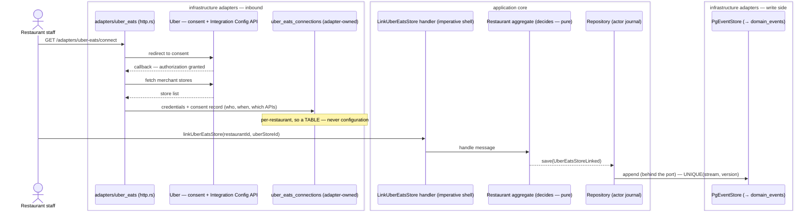
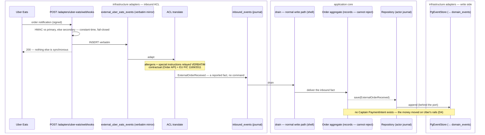
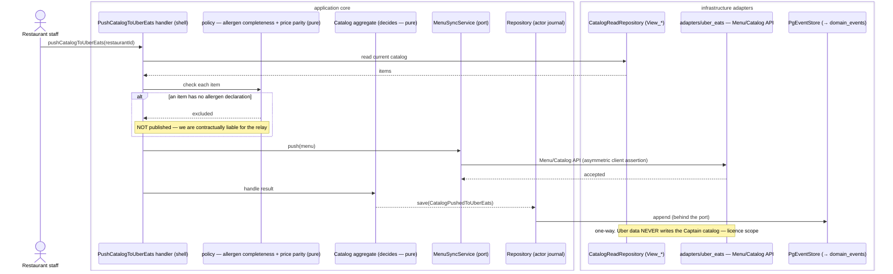
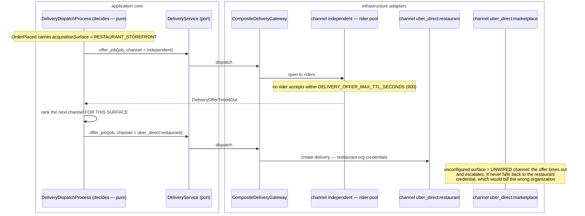
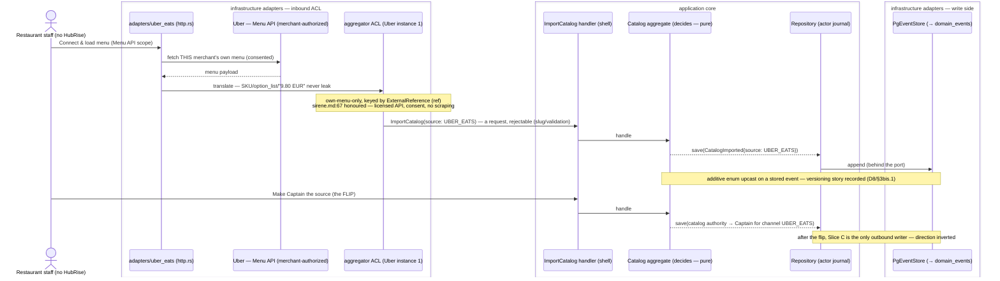

# PROP-20260730-032306 — Uber Eats Marketplace integration, and per-surface Uber Direct credentials

- **Status**: Proposed (partially approved — see §3; D2/D6 decided 2026-07-30, D1/D3/D4/D5/D7 answered 2026-08-08; **D8/D9/D10 opened by the 2026-08-13 founder directive — see §1.2 and §3**)
- **Date**: 2026-07-30 (living; refined 2026-08-13 — founder directive on aggregator catalog/order sync and the onboarding wedge)
- **Tracking issue**: [#260 "Epic: Uber Eats Marketplace integration (order centralization + menu sync) and per-surface Uber Direct credentials"](https://github.com/TheCaptainCompany/captain-food/issues/260)
- **Realized by**: _(filled at completion)_

---

## 1. Context

On 2026-07-30 the product owner registered **Captain Food Restaurant** on the Uber developer
dashboard against the **Eats Marketplace** API suite, accepted the API Licensing Agreement with all
seven APIs selected, and generated webhook signing keys. That is a real commercial commitment to an
integration that **exists nowhere in the specs**.

What the repo contains today, verified:

| Thing | Where | Status |
|---|---|---|
| Uber Eats **price comparison** | ADR-0022/0023/0024/0025/0030, `entities.yaml#/UberComparison` | ✅ shipped — a *display* feature, per-cuisine mark-up coefficients |
| Uber **Direct** delivery adapter | `crates/adapters/uber_direct`, [#57 "Uber Eats (Uber Direct) delivery-partner adapter"](https://github.com/TheCaptainCompany/captain-food/issues/57) | ✅ merged; 7 `UBER_DIRECT_*` keys declared (`configuration.yaml:677-744`), symmetric `client_secret` auth, no Uber app registered against it |
| Uber **Eats Marketplace** integration | — | ❌ nothing: no spec, no ADR, no adapter, no config |

So this proposal covers the new integration, plus two things it forces into the open.

**The catalog would flow outbound for the first time.** Today catalog data only ever flows *in*
(HubRise → `ImportCatalog` through the ACL). Pushing a menu *to* Uber Eats reverses the direction and
raises menu ownership.

**An Uber-originated order breaks an assumption about money.** `OrderPlaced` today implies a Captain
Stripe PaymentIntent, and the VAT/receipt and payment-agent posture assume Captain handled the funds.
An order arriving from Uber Eats was already accepted and already paid, on Uber's rails.

### 1.1 What the agreement obliges us to

Read from the API Licensing Agreement as accepted (Provider entity: *Caring Hope Foundation*, RNA
W372020229 — see D7), all seven APIs selected:

- **Order API** — *"the Provider is wholly responsible for correctly relaying all information provided
  in such Order API between Uber and Merchant systems, including but not limited to allergy
  information and special instructions."* Combined with EU FIC 1169/2011 (already a named legal
  precondition in `CLAUDE.md`, not a backlog item), allergen fidelity becomes contractual **and**
  regulatory. An ACL that silently drops an allergen field is a breach of both.
- **Reporting API** — the Provider warrants that *each* merchant expressly authorized the access.
  That is a recorded, per-restaurant consent artifact, not merely possession of a token.
- **Integration Configuration API** — merchant-authorized provisioning of locations onto Order/Menu
  APIs, "on an ongoing basis until … explicitly terminates". A revocation path is part of the model,
  not an afterthought.
- **Licence scope** — data reaches us to serve that merchant *on Uber*. It must not seed the Captain
  marketplace catalog. This is an ACL design constraint, enforced by direction of flow, not by intent.

---

## 2. Recommended approach

Four slices, in dependency order. Each is independently shippable and independently useful.

### Slice A — the verbatim inbound mirror (smallest useful thing)

`POST /adapters/uber-eats/webhooks`: verify HMAC over the raw body against **either** signing key
(constant-time, fail-closed), write the body verbatim into a new `external_uber_eats_events` staging
table, return 200. No ACL, no domain translation.

This is the established two-layer inbox (ADR-0045, ADR-20260720-015400) already run twice
(`external_stripe_events`, `external_hubrise_callbacks`). Shipping it first means Uber's *Verify
Integration* step passes and **no event is lost** while the translation layer is designed. It is also
the only slice needed before the dashboard webhook can be safely enabled.

### Slice B — merchant consent and store provisioning

`GET /adapters/uber-eats/connect` → Uber consent → callback, mirroring the HubRise connect flow
([#20](https://github.com/TheCaptainCompany/captain-food/issues/20), ADR-20260721-100601). Stores the
per-restaurant Uber **store id** plus the **consent record** (who authorized, when, which APIs) in a
new adapter-owned `uber_eats_connections` table.

Per-restaurant values cannot live in `configuration.yaml` — config is per-deployment, and this scales
with restaurants. That is exactly the `hubrise_connections` precedent.

### Slice C — outbound menu / store push

`Catalog`/`Menu`/`Store` APIs, driven by a command (`PushCatalogToUberEats`) so it is rejectable and
auditable. One-way: Captain/HubRise → Uber. Never Uber → Captain catalog (§1.1 licence scope).

### Slice D — inbound order relay

Uber-originated orders drained from the mirror through the ACL as **inbound events** (facts, not
commands — the marketplace already accepted them; we cannot say no; `CLAUDE.md` request/report rule).
Gated on D4, because the representation of a non-Captain-paid order is an open decision.

### Slice E — per-surface Uber Direct credentials

Independent of A–D but sharing the credential model: record the **acquisition surface** on the order
and key the delivery channel by it.

### Slice F — inbound catalog bootstrap (the onboarding wedge, added 2026-08-13)

A **one-time, consented pull** of a restaurant's own Uber Eats menu (licensed Menu API, restaurant
authorization from Slice B) into `CatalogImported{source: UBER_EATS}`, followed by an explicit,
recorded **flip** to Captain-as-source, after which Slice C's push runs forward. It reuses the
`ExternalReference`/`ref` idempotency doctrine (the HubRise import key, `SKU`/`option_list` never
leaking past the ACL) with the aggregator as the second import source. Gated on D8 (the flip's model),
D7 (entity/licence), and — because a bootstrapped restaurant then receives external orders — on D9.
The **aggregator ACL is written once** (Uber Eats instance 1, Deliveroo instance 2, D1's direct
model), never Uber-specific. This is the direction-inversion lifecycle of §3bis.2 made shippable.

---

## 3. Decisions

### D1 — Build the Eats integration directly, or layer on HubRise?

HubRise *is* a POS↔marketplace middleware: it already syncs menus to Uber Eats and Deliveroo, and
`specs/integrations/hubrise.md` §4.5 records that it already carries a restaurant's Uber Eats menu
prices (the source for `basis: REAL` comparisons).

| Option | Pros | Cons |
|---|---|---|
| **A. Direct Uber Eats integration** ✅ *(chosen — the app is registered)* | Reaches restaurants with no POS and no middleware — precisely the independent-restaurant segment Captain targets. No dependency on HubRise's roadmap or pricing. Full control of allergen fidelity, which we are now contractually liable for. | N integrations to build and certify (Deliveroo next). We own menu-conflict semantics. Uber verification/approval is an external gate. |
| B. Layer on HubRise | One integration, already built and connected. Their certifications, their channel coverage. | Only reaches restaurants already on HubRise. We inherit their roadmap and pay per location. Allergen liability still ours contractually, but the relay is not — the worst split. |
| C. Both (HubRise where connected, direct otherwise) | Best coverage. | Two code paths for one capability, and two answers to "who owns this menu" per restaurant. Defer until A is real. |

### D2 — Which Uber organization is billed for a Direct dispatch? **DECIDED: A**

| Option | Pros | Cons |
|---|---|---|
| **A. Captain opens two orgs** ✅ *(product owner, 2026-07-30)* | Clean separation of storefront vs marketplace delivery cost, straight from Uber's own invoices. No internal apportionment to defend. | Two Uber contracts and credential sets to keep alive. Makes Captain a principal for the storefront delivery leg → touches the payment-agent posture (a French legal precondition). Credential must be chosen per order. |
| B. Each restaurant opens its own | Captain stays out of the delivery money flow entirely — simplest legally. | Credentials become per-tenant (`uber_direct_connections`), N onboardings, and most independents will not do it. |
| C. Captain opens one org, attributes internally | One credential set, no prefix, no second negotiation. `deliveryJobId` is already the read-back reference so Uber's per-delivery records reconcile to our orders exactly. | Attribution becomes our reporting problem rather than Uber's invoice. |

*C was recommended and A was chosen; recorded rather than re-litigated. Note A still needs the
surface on the order (D3), so nothing in D3 is contingent on this.*

### D3 — Where does the acquisition surface live?

Dispatch runs in `DeliveryDispatchProcess` on a spawned task **after** the mutation has answered
`PENDING` (acceptance-first, ADR-20260720-015500). The `Host` header is gone by then.

| Option | Pros | Cons |
|---|---|---|
| **A. A field on `OrderPlaced`** ✅ *recommended* | It is a fact about the order, true forever, folded like any other. Available to dispatch, to reporting, to the receipt. Survives replay. | Event payload change → plan mode, ADR-0032 completeness (test + rule). |
| B. On the `Cart`, inherited at checkout | Captures it at the earliest point. | Carts persist indefinitely (`CartStatus.OPEN`); a cart built on one surface and checked out on another would lie. |
| C. Derived at dispatch from the tenant middleware | No spec change. | Impossible — the request is over. Would require threading a request-scoped value into a background task, i.e. inventing a second, weaker order record. |
| D. A projection column only | No event change. | A projection is derived state; you cannot derive what was never recorded. |

### D4 — How is a marketplace-originated order represented? **OPEN**

An Uber Eats order has no Captain PaymentIntent, yet `OrderPlaced` implies one.

| Option | Pros | Cons |
|---|---|---|
| **A. A distinct `ExternalOrderReceived` event on the Order stream** ✅ *recommended* | Honest: a different fact with different provenance. Payment invariants stay strict on `OrderPlaced`. Sales-channel reporting falls out naturally. | New event + fold arms; every `OrderPlaced` consumer must be audited for the sibling case. |
| B. Make the payment fields nullable on `OrderPlaced` | Smallest diff. | Weakens the invariant for *every* order to accommodate a minority — the classic way a money guarantee erodes. |
| C. Synthesize a zero-amount Captain payment | No consumer changes. | Fabricates a financial record that never happened. Unacceptable for VAT/receipts. |

Also open within D4: VAT and receipt responsibility on an Uber-originated order, and whether it
appears in Captain's own revenue reporting at all.

### D5 — Who owns the menu when three systems can edit it? **OPEN**

| Option | Pros | Cons |
|---|---|---|
| **A. HubRise authoritative when connected, else Captain** ✅ *recommended* | Matches reality: the POS is the operational source of truth. One writer per restaurant, decided by a fact we already store. | Two configurations to reason about. |
| B. Captain always authoritative | One rule; simplest push. | Overwrites POS edits — the restaurant's own tills lose. |
| C. Last-write-wins across all three | No coordination. | Silent divergence; unresolvable support calls. |
| D. Per-restaurant explicit choice | Honest about heterogeneity. | A setting most restaurants cannot answer meaningfully. |

**Price parity is part of D5.** Restaurants routinely mark up their Uber Eats menu to absorb Uber's
commission, and ADR-0024's comparison coefficients are calibrated on that assumption. Pushing Captain
prices to Uber Eats unchanged would undercut the restaurant's own Uber pricing on its behalf *and*
invalidate the comparison feature's basis. A per-channel price adjustment is likely required before
Slice C ships.

### D6 — Uber app authentication. **DECIDED: asymmetric**

| Option | Pros | Cons |
|---|---|---|
| **A. Asymmetric (application id + key id + private key)** ✅ *(product owner, 2026-07-30)* | No shared secret; the private key never leaves us; nothing replayable if Uber's store leaks. Key id enables rotation. | Retires `UBER_DIRECT_CLIENT_SECRET`/`SCOPE` and the existing OAuth2 token manager in `crates/adapters/uber_direct`. PEM handling needs care (base64 at rest — see §6). |
| B. Symmetric `client_secret` | Already implemented. | A shared secret both parties hold. |

### D7 — Is the Provider entity on the agreement the operating entity? **OPEN — needs legal input**

The agreement was signed by **Caring Hope Foundation**, RNA W372020229 — a French *association loi
1901*. The platform is developed under `TheCaptainCompany`.

- An Uber API licence follows the entity. If the association holds the licence and a different entity
  operates the platform and earns commission, the access sits outside the licence — a termination
  right, and a problem for liability and VAT.
- A loi-1901 association running a commissioned marketplace raises its own tax/status questions.

Not an engineering decision; flagged here because `CLAUDE.md` requires French legal preconditions to
be surfaced rather than deferred silently, and because a future session cannot infer it.

### D8 — The bootstrap-then-flip source-of-truth lifecycle (no HubRise, existing Uber Eats). **OPEN — opened 2026-08-13**

D5 decided ownership across Captain / HubRise / Uber for the **steady state** ("HubRise authoritative
when connected, else Captain"). It did **not** model the wedge's **transient** case: a restaurant with
no HubRise whose menu currently lives on Uber Eats, which Captain seeds from and then supersedes. This
is a lifecycle decision, not a re-litigation of D5 — it slots **underneath** it (once flipped, the
restaurant is a "Captain authoritative" restaurant and D5's steady state applies).

| Option | Pros | Cons |
|---|---|---|
| **A. Bootstrap-then-flip: one-time consented pull → recorded flip → Captain pushes forward** ✅ *recommended (matches the directive, and "final vision first")* | One writer at every instant; the flip is an explicit recorded fact, replayable. Honours sirene.md:67 (licensed Menu API, own menu, consent). Generalises `source` to a data-driven aggregator set. Converts the exact no-HubRise segment into a Captain-upstream merchant. | Requires the flip to be modelled as a first-class transition ("Captain is now source for channel X"); the bootstrap is downstream of D7 (licence) and D9 (money). |
| B. Continuous two-way sync Captain ↔ Uber | "Always in sync" with no manual flip. | Two writers per restaurant → silent divergence, unresolvable support calls (D5 option C, already rejected). Contradicts one-writer-per-aggregate. |
| C. Uber stays authoritative, Captain read-only mirror | No push to build. | Defeats the wedge — the whole point is Captain *becomes the source*; leaves the storefront a shadow of Uber. |

The flip is where the direction inverts, so it is the load-bearing modelling decision: recommend a
recorded `CatalogSourceAuthorityChanged`-style fact (name is the team's) that moves authority to
Captain for that channel, after which Slice C is the only writer outbound.

### D9 — Money, merchant-of-record and VAT/receipt for a pre-paid external order. **OPEN — the still-open half of D4**

D4's 2026-08-08 answer settled only the **event shape** (distinct `ExternalOrderReceived`, `OrderPlaced`'s
payment fields stay non-nullable). D4's own text left open "VAT and receipt responsibility on an
Uber-originated order, and whether it appears in Captain's own revenue reporting at all." The directive
reaffirms external orders flow, so this must be answered before Slice D/F carry real money. An Uber
Eats order was **already accepted and already paid on Uber's rails** — Captain never touched the funds
and issues no PaymentIntent.

| Option | Pros | Cons |
|---|---|---|
| **A. Informational record only — Uber is merchant of record; no Captain receipt, no Captain settlement, excluded from Captain GMV/commission** ✅ *recommended* | Legally cleanest: Captain is a menu/order **relay** for that channel, not a payment agent — keeps the payment-agent posture (§1 / the SASU Connect path) untouched by external orders. No fabricated financial record (D4 rejected synthesizing one). VAT/receipt liability stays with Uber and the restaurant, where the money actually moved. | The restaurant's consolidated P&L view must come from a **read projection** labelled "settled by Uber", not from treating the flow as Captain revenue. |
| B. Reportable revenue in the restaurant's consolidated view, flagged non-Captain-settled | One number for the restaurant across channels. | Risks implying Captain handled money it never held — a VAT/receipt trap. Achievable as A + a projection anyway, so B's benefit needs no MoR change. |
| C. Captain charges a platform fee on external orders | New revenue line. | Introduces a second money flow and a merchant-of-record question on a pre-paid order; defer — not a V0 concern. |

Recommend **A**, with B's useful half delivered as a tenant-scoped read projection (a business metric
is a projection — [ADR-20260811-014129](../adr/ADR-20260811-014129-a-business-metric-is-a-projection-and-every-reference-is-a-ref.md))
labelled by settlement channel, never by moving merchant-of-record. This is an **obligation map, not
legal clearance** (legal-specialist): counsel confirms MoR on the Uber-settled leg.

### D10 — Is the onboarding wedge in V0-Tours scope, or post-V0? **OPEN — scope call for the founder/team**

| Option | Pros | Cons |
|---|---|---|
| A. Full wedge in V0-Tours (bootstrap + external-order relay + push) | Attacks the no-HubRise cold-start at launch, the exact target segment. | Stacks external gates onto the V0 critical path — Uber Marketplace certification, the D7 SASU/licence transfer, **and** D9 resolved — while §35 puts the V0 keystone at the local-first deploy walk. |
| **B. Post-V0: prove storefront + HubRise path first; design the aggregator SHAPE now so Deliveroo and the wedge are rows, not rewrites** ✅ *recommended* | Keeps the V0 critical path free of Uber's external gates; still books the design (data-driven `source`, one aggregator ACL) so the wedge is cheap when its gates clear. "Final vision first" is satisfied by shaping now, shipping when unblocked. | Leaves the no-HubRise segment un-served at the Tours launch. |

Recommend **B**: the *shape* is team-owned spec work worth doing now (it makes Deliveroo a row); the
*wedge shipping* waits on D7, D9 and Uber certification, none of which the team can clear this side of
the deploy keystone. **This is a recommendation, not a re-ranking** — #260 stays where the team's
Project ordering has it.

---

## 3bis. Founder directive (2026-08-13) — the onboarding wedge and the aggregator shape

Verbatim, two sentences (relayed to the whole team per
[ADR-20260812-143619](../adr/ADR-20260812-143619-the-founder-is-the-founder-and-every-founder-message-goes-to-the-whole-team.md);
`Consulted:` block in §9):

> "Uber Eats and later Deliveroo will be used for the sync of catalog and external orders."
>
> "Will be used also for the onboarding in case there is no hubrise but already an integration with
> uber eats we can load the existing catalog and then be the source of uber eats."

### 3bis.1 What the first sentence confirms (not new)

Catalog **and** order sync through Uber Eats now, Deliveroo later. This is the substance of Slices C
(outbound menu push) and D (inbound order relay), and D1 already chose the **direct** integration.
The one durable instruction it adds is the **shape**: Uber Eats and Deliveroo are two **instances of
one aggregator-integration model**, not two bespoke code paths. It must be **data-driven** the way
delivery channels already are — `DeliveryChannelKey` (`specs/delivery/scalars.yaml:42`) makes a new
courier "a catalog row + an adapter, not an enum edit (#60)"; the aggregator side wants the same, so
Deliveroo becomes an `AggregatorChannel` row + an ACL, never an Uber-shaped rewrite. This generalises
the existing `source` field: `CatalogImported.source` today is an **inline enum `[HUBRISE, MANUAL]`**
(`specs/catalog/events.yaml:227`, `specs/catalog/commands.yaml:228`), not a `$ref` — extending it to
carry aggregator provenance is (a) a **stored-event enum extension** on an emitted event, i.e. an
additive **upcast with a recorded versioning story** (Young: immutable contracts), and (b) under
"every reference is a `$ref`" ([ADR-20260811-014129](../adr/ADR-20260811-014129-a-business-metric-is-a-projection-and-every-reference-is-a-ref.md))
a candidate to become a dedicated `CatalogSource` scalar so the value set is declared once. Both are
**team-owned spec work** (not a founder decision); named here so the executor sees the migration and
the scalar together.

### 3bis.2 What the second sentence adds — genuinely new: the onboarding wedge

The second sentence is **not** a sync feature. It is a **two-sided cold-start play** for the segment
Captain most wants and least reaches: independent restaurants that **never adopted HubRise** but
already sell on Uber Eats. The lifecycle is a **direction inversion over time**:

```
  PULL (bootstrap, one-time)      →   FLIP (recorded transition)   →   PUSH (steady state)
  load the restaurant's existing      "Captain is now the source       Captain → Uber Eats
  Uber Eats menu to seed its          of truth for channel X"          (and later Deliveroo)
  Captain catalog
  CatalogImported{source:UBER_EATS}                                    CatalogPushedToUberEats
```

Business-lens (business-specialist): this lowers the single highest onboarding cost — re-keying a
full menu — to near zero for a real segment, then converts that restaurant into a Captain-upstream
merchant that pushes forward. The menu already lives somewhere; we bootstrap from where it is, then
become its source. That is a legitimate adoption lever, and it is why the founder frames Uber Eats as
an **onboarding** channel, not only a sync channel.

### 3bis.3 The bootstrap pull must be reconciled with a recorded no-go — and it is

`specs/integrations/sirene.md:67` records, verbatim, a hard constraint: **"No scraping of aggregators
(Uber Eats/Deliveroo) and no importing third-party menus/photos without the restaurant's consent."**
The founder's "load the existing catalog" is legitimate **only** on the licensed side of that line:

- **Licensed** — the restaurant, who **owns its own menu**, authorizes Captain through Uber's
  **Menu API** (the same per-merchant consent artifact Slice B already models for the Reporting API),
  and Captain reads **that merchant's own menu** to seed **that merchant's own Captain catalog**. This
  is consented, first-party, API-mediated. It honours sirene.md:67.
- **Forbidden** — scraping the Uber Eats storefront, or reading merchant A's menu/photos to populate
  Captain's general marketplace catalog. This is exactly the sirene.md:67 no-go and the §1.1 licence
  scope ("data reaches us to serve that merchant *on Uber*; it must not seed the Captain marketplace
  catalog"). Direction of flow enforces it: bootstrap writes **only** the authorising restaurant's own
  catalog, asserted by test.

The distinction is the whole line between the directive and the no-go: **consent + licensed Menu API +
own-menu-only**, never scraping and never cross-merchant seeding.

### 3bis.4 The wedge is downstream of two already-open gates

The bootstrap cannot ship before: (a) **D7's entity path** — the Marketplace agreement was signed by
Caring Hope Foundation, and the licence follows the entity; the SASU transfer/novation the counsel
packet already tracks ([ADR-20260808-195315](../adr/ADR-20260808-195315-customer-brief-answers.md))
gates any merchant-consent flow under that licence; and (b) **the money posture (D9 below)** for the
external orders the same restaurant will then receive. Sequencing, not blocking — recorded so the
value-method ranking (§3, D10) is honest about the external gates.

---

## 4. Screen mockups

### UC-1 — Restaurant connects Uber Eats (`restaurant_backoffice`, RESTAURANT_ACCOUNT)

```
┌─ Sales channels ─────────────────────────────────────────────┐
│                                                              │
│  Captain.Food storefront          ● Live                     │
│  pizza-mario.captain.food                                    │
│                                                              │
│  HubRise (POS)                    ● Connected                │
│  Le Comptoir · 2 locations              [ Manage ]           │
│                                                              │
│  Uber Eats                        ○ Not connected            │
│  Sync your menu and receive Uber orders here.                │
│                                   [ Connect Uber Eats ]      │
│                                     → uberEatsConnect        │
│                                                              │
│  Deliveroo                        ○ Not available yet         │
└──────────────────────────────────────────────────────────────┘
```

### UC-2 — Consent and store mapping (after Uber callback)

```
┌─ Connect Uber Eats ──────────────────────────────────────────┐
│  ✓ Authorized as Le Comptoir (Uber account #4471…)            │
│                                                              │
│  Map your Uber stores to your Captain restaurants:            │
│                                                              │
│   Uber store              →  Captain restaurant              │
│   ┌──────────────────────┐   ┌──────────────────────┐        │
│   │ Le Comptoir – Tours  │ → │ le-comptoir       ▾  │        │
│   │ Le Comptoir – Joué   │ → │ (do not sync)     ▾  │        │
│   └──────────────────────┘   └──────────────────────┘        │
│                                                              │
│  ☑ I authorize Captain.Food to access my Uber reporting data  │
│     (required by Uber for financial reports)                  │
│                                                              │
│                            [ Cancel ]  [ Confirm mapping ]    │
│                                          → linkUberEatsStore  │
└──────────────────────────────────────────────────────────────┘
```

The checkbox is not decoration — it is the Reporting API warranty (§1.1), and its grant is what
`uber_eats_connections` records.

### UC-3 — Menu push with the price-parity warning (Slice C, gated on D5)

```
┌─ Uber Eats · Menu ───────────────────────────────────────────┐
│  Source of truth: HubRise (your POS)                          │
│  Last pushed: 2026-07-30 11:04 · 84 items · 3 skipped         │
│                                                              │
│  ⚠ 3 items skipped — no allergen declaration                   │
│     Uber requires allergen info for distance selling.          │
│     [ Review the 3 items ]                                    │
│                                                              │
│  ⚠ Your Uber prices are 28% above your Captain prices.         │
│     Pushing will overwrite them. Keep an Uber price uplift?    │
│     ( ) Push Captain prices as-is                              │
│     (•) Keep current uplift  [ 28 ]%                           │
│                                                              │
│                        [ Push menu to Uber Eats ]             │
│                          → pushCatalogToUberEats              │
└──────────────────────────────────────────────────────────────┘
```

The allergen block is a hard gate, not a warning to dismiss: we are contractually liable for relaying
allergen data (§1.1), so an item without it must not be published.

### UC-4 — Order list showing provenance (RESTAURANT)

```
┌─ Today's orders ─────────────────────────────────────────────┐
│  #1043  19:12  Captain (storefront)  22,40 €  ● Preparing     │
│  #1044  19:14  Uber Eats             18,90 €  ● Accepted      │
│  #1045  19:15  Captain (marketplace) 31,00 €  ● New           │
│                                          [ Accept ] [ Reject ]│
└──────────────────────────────────────────────────────────────┘
```

One list, provenance visible. This is the surface field of D3 and the channel of D4 becoming
operationally useful: staff must know an Uber order cannot be refunded through Captain.

### UC-5 — Connection health (ADMIN)

```
┌─ Uber Eats integration ──────────────────────────────────────┐
│  App: Captain Food Restaurant (TEST)   Suite: Eats Marketplace│
│  Signing keys: primary ✓  secondary ✓ (rotation ready)        │
│                                                              │
│  Webhooks (24h)   received 412 · verified 412 · rejected 0    │
│  Mirror backlog   0 undrained                                 │
│  Connections      7 restaurants · 1 consent revoked           │
└──────────────────────────────────────────────────────────────┘
```

### UC-6 — Onboarding wedge: a no-HubRise restaurant bootstraps from Uber Eats (Slice F, gated on D8)

```
┌─ Set up your menu ───────────────────────────────────────────┐
│  You don't have a POS (HubRise) connected. Start faster:      │
│                                                              │
│  ○ I already sell on Uber Eats                                │
│    Load your existing menu from Uber Eats, then edit it here. │
│                                   [ Connect & load menu ]     │
│                                     → uberEatsConnect (Menu API scope) │
│                                                              │
│  ○ Build my menu from scratch                                 │
└──────────────────────────────────────────────────────────────┘
        │  (after consent + one-time pull)
        ▼
┌─ Menu loaded from Uber Eats ─────────────────────────────────┐
│  ✓ 84 items imported · 3 need an allergen declaration         │
│                                                              │
│  From now on, Captain.Food is the source of truth for this    │
│  menu. Changes you make here are pushed to Uber Eats.         │
│     [ Review 3 items ]        [ Make Captain the source ]     │
│                                 → flip authority (D8)         │
└──────────────────────────────────────────────────────────────┘
```

The "Make Captain the source" button is the **flip** of D8 — an explicit, recorded transition, not a
silent default. Until it is pressed the import is a draft; after it, Slice C pushes forward. The
allergen count is the same hard gate as UC-3 (contractual + EU FIC 1169/2011).

---

## 5. Sequence diagrams

Drawn per `docs/claude/mermaid.md`: the actor **decides** (pure), facts are saved **through the
`Repository`**, and `PgEventStore` is the one adapter behind it. Layers grouped with `box`.

### F1 — Merchant consent and store provisioning (Slice B)



### F2 — Inbound Uber order: mirror, then drain as a FACT (Slices A + D)



### F3 — Outbound menu push (Slice C)



### F4 — Surface-aware Direct dispatch (Slice E)



### F5 — Onboarding bootstrap: one-time consented pull, then the flip (Slice F, gated on D8)



Note that the bootstrap is `ImportCatalog` (a **command**, orchestrated and rejectable — same as the
HubRise import), **not** an inbound event: Captain chooses to pull, generates slugs, and can be told
"no". The inbound-event path (📥, no command) is reserved for **orders**, which already happened (F2 /
Slice D). The two directions of the wedge use two different doctrines on purpose.

---

## 6. Configuration

Five keys for the Eats app, declared **in the change that lands the adapter** — not before, so the
drift gate stays meaningful in both directions (declared-with-no-reader is drift too):

```
UBER_EATS_APPLICATION_ID          UBER_EATS_SIGNING_KEY
UBER_EATS_KEY_ID                  UBER_EATS_SIGNING_KEY_SECONDARY   (optional -- rotation overlap)
UBER_EATS_PRIVATE_KEY             (secret, base64)
```

- **No surface prefix.** The `_RESTAURANT_`/`_MARKETPLACE_` split exists only for Direct, where it
  selects which Uber organization is billed. Eats is one app, one relationship.
- **No `CUSTOMER_ID`.** Eats addresses locations by store id, which is per-restaurant → the
  `uber_eats_connections` row. Config is per-deployment; anything scaling with tenants is a table.
- **The private key is base64 at rest.** A raw multi-line PEM is mangled inconsistently by the Render
  dashboard, Actions secrets, Docker `--env` and k8s, and the `\n`-vs-newline ambiguity fails at
  *first signature* — asynchronously, during dispatch — while the boot report still reads `set`. A
  `Base64PrivateKey` scalar (base64 charset, decodes to a parseable key) makes the validator reject a
  pasted PEM or a truncated copy up front.
- **Signing keys are ours to generate**: 256 bits from a CSPRNG, hex (`^[0-9a-f]{64}$`), two distinct
  values. The verifier accepts either — that is what makes rotation possible without dropping
  webhooks, and dropping an Uber webhook means an order nobody is told about.
- **No `KEY_ALG`**: RS256 vs ES256 is derivable from the key material, so a declared algorithm is
  only a second source of truth that can contradict the first.
- Direct's keys (`UBER_DIRECT_RESTAURANT_*`, later `_MARKETPLACE_*`) land with Slice E, retiring
  `UBER_DIRECT_CLIENT_SECRET` and `UBER_DIRECT_SCOPE` (D6).

### 6.1 Two declared Uber apps → which credential SET carries which capability (founder directive, 2026-08-13)

Founder, verbatim (relayed to the whole team per
[ADR-20260812-143619](../adr/ADR-20260812-143619-the-founder-is-the-founder-and-every-founder-message-goes-to-the-whole-team.md);
Consulted line in §9):

> "We going to have configuration keys for the declared product on uber eats called:
> - captain food restaurant => this will concern catalog orders and delivery (uber direct) for the restaurant
> - captain food marketplace => delivery (uber direct) only"

There are **two declared apps/products on the Uber developer dashboard**, and capability attaches to
the app, so the config-key sets group by app:

| Declared Uber app | Eats Marketplace API (catalog + orders) | Uber Direct (delivery) | Credential sets |
|---|---|---|---|
| **Captain Food Restaurant** | ✅ yes — this app is the one registered on the Eats Marketplace suite (ADR line 18) | ✅ `uber_direct:restaurant` | `UBER_EATS_*` (§6, asymmetric app auth) **+** `UBER_DIRECT_RESTAURANT_*` (D6) |
| **Captain Food Marketplace** | ❌ **none** — no catalog, no orders | ✅ `uber_direct:marketplace` | `UBER_DIRECT_MARKETPLACE_*` **only** |

So the **Eats Marketplace API credentials (`UBER_EATS_*`, catalog + orders) bind to the *Captain Food
Restaurant* app**, alongside that app's restaurant-surface Uber Direct org. The *Captain Food
Marketplace* app is **delivery-only** — it carries the marketplace-surface Uber Direct org and nothing
else. This is exactly consistent with D2/D5 (two Direct orgs keyed by acquisition surface, ADR
Decision 5) and with §6's "Eats is one app, one relationship" — that one app is now **named**: Captain
Food Restaurant. The delivery half is already partly realized (`UBER_DIRECT_*` in
`specs/delivery/configuration.yaml:108-181`, pre-D6 symmetric, to be split into
`_RESTAURANT_`/`_MARKETPLACE_` asymmetric at Slice E); **what is new here is only the binding of the
`UBER_EATS_*` set to the Restaurant app**, and this section RECORDS that structure — the actual
`configuration.yaml` keys land under a later executor slice, not here.

> ⚠️ **"Marketplace" is overloaded THREE ways — do not wire this backwards.** (a) Uber's **Eats
> Marketplace *API*** product = catalog + orders; (b) Captain's **marketplace delivery *org*** =
> `uber_direct:marketplace`; (c) the founder's **declared app *Captain Food Marketplace***. ADR
> Decision 1's phrase *"`UBER_EATS_*` is the Marketplace app (order centralization + menu sync)"* uses
> sense (a) — "the app on the Eats **Marketplace API** suite" — which per ADR line 18 is **Captain
> Food Restaurant**. Read carelessly it looks like sense (c) and would wire catalog + orders to the
> *Captain Food Marketplace* app — **the exact inverse of the directive**. The rule, unmissable:
> **catalog + orders live on the RESTAURANT app; the MARKETPLACE app is delivery-only.** This is a
> **clarification of ambiguous prose, not a decision reversal** — no decided row (D2/D5/D6) ever
> assigned catalog/orders to a *Captain Food Marketplace* app, and this section contradicts none of
> them.

### 6.2 Test and prod keys, and per-order mode selection — "test directly on production" (founder directive, 2026-08-13)

Founder, verbatim: *"We going to have test and prod keys to be able to test directly on production."*
This **restates a recorded 2026-07-29 directive** already live in the tree —
`specs/delivery/configuration.yaml:94-107`: *"do like for the stripe, have both environment keys"*,
with today's deliberate state being **both profiles → `_TEST` on purpose** until a live Uber app
exists (a test app exercised with test keys on production), and *"when the live app arrives,
production flips to `_PROD` here and nowhere else."* That it had to be re-stated is itself a data
point for the AR-1 unrealized-directive sweep (ADR-20260813-233418): **#257 is recorded-but-unbuilt**,
which is exactly the class the sweep surfaces.

**Two mechanisms, and the directive means the second** (the config distinguishes them, `:103-107`):

1. **Test keys on production** (built today): both deploy profiles resolve to the `_TEST` secret, so
   production runs the test credential. This is done.
2. **Choosing the credential per ORDER** — a test order on a live restaurant — which *"needs both
   sets loaded at once"*. This is
   **[#257 "Stripe mode becomes a DOMAIN property, not a deployment one: hold both key pairs and
   select per order"](https://github.com/TheCaptainCompany/captain-food/issues/257)**. #257 is
   **Stripe-first** — its own quoted directive: *"Test keys and prod keys for stripe will live inside
   the config to allow us to test on production. The fact that we use prod or test keys is based on the
   customer or restaurant test mode, not on the environment"* — and the Uber Direct config comment
   (`:106-107`) references it as **the same pattern extended to Uber Direct**. So the per-order-mode
   design is **one order-mode driving BOTH integrations identically** (Stripe *and* Uber Direct), not
   two independent selectors. The founder's *"test directly on production"* = mechanism 2 = the
   realization of #257. **#257 supersedes [#254](https://github.com/TheCaptainCompany/captain-food/issues/254)**
   (the go-live switch) per #257's body. This section **records the founder confirmation**; it does
   **not** re-spec #257 (its mockups/sequence diagrams live in #257's own proposal).

**External gate, stated so no one blocks the wrong thing:** the #257 **mechanism** (both sets loaded,
mode chosen per order) is **buildable now with the existing test credentials** — it needs no live
keys. The real **PROD credential set** is externally gated: a live Uber-approved app is downstream of
**D7** (SASU / licence / Provider entity) and Uber certification. So build the selector now against
test creds; wire the `_PROD` secret when the live app lands. **But** — see D11 — #257 states
*"implementation should not start before the mixed-mode rule is decided"*, so the founder-owed policy
below gates the build even though the credentials do not.

#### Guardrail 1 — one order-mode source of truth (a rule) driving a mixed-mode POLICY that is a FOUNDER DECISION (D11, OPEN)

Two things were conflated in my first pass, and #257 forces them apart:

- **(a) WHERE the mode lives — a rule, one right answer.** The mode is a property of the **order**,
  chosen **once**, and **coherent across every integration that order touches** — a test order runs
  **test Stripe AND test Uber Direct together**, never a test courier on a real charge. Stripe's mode
  is readable from the key (`sk_test_`/`sk_live_`, `mode_of: stripe`); **Uber Direct keys carry no such
  marker** (`configuration.yaml:103-105`), so coherence cannot be reconstructed after the fact — it is
  **decided at the order and carried**. Recommended, under existing doctrine: mode is a **fact on the
  order**, frozen at placement and folded, the *same* pattern D3 set for `acquisitionSurface` (not
  derivable at dispatch — acceptance-first, the request context is gone when the saga runs). #544's
  capture leg and #257's selector read that **one** field. This half is a **RULE** (`rules.yaml`,
  pinned by a test under ADR-20260813-233418 AR-2) — no arbitration.

- **(b) WHICH mode wins when the two sides DISAGREE — a founder decision, not a rule.** A **test
  customer ordering from a LIVE restaurant** (or the reverse) has no single "right" resolution: the
  four candidate policies trade money-safety against test realism against a customer-visible rejection.
  **My first pass silently pre-decided this as "either-side-test ⇒ order-test" (≈ #257 option 1) and
  wrongly classified it a rule.** That was made blind to #257, which presents it explicitly as a
  founder decision with a four-option table and states *"implementation should not start before the
  mixed-mode rule is decided — it is the one that can cost a restaurant real food."* **It is therefore
  reopened as an OPEN founder-owed decision — D11 (§11 of `DECISIONS.md`) — and it BLOCKS #257
  implementation.** The rule in (a) still holds regardless of which option D11 picks; only the
  mixed-mode resolution is open.

#### Guardrail 2 — a test-mode order in production must be observable (a contract, not a founder decision)

With per-order selection the mode is **no longer readable from the deploy profile**, and Uber keys
carry no marker — so unless the **order records and exposes which mode it ran**, a test order is
**invisible in production**. The order must carry its mode (Guardrail 1's field serves both), and a
**test-mode order in prod must be countable and alertable**: an unexpected volume of `mode=test`
orders on a live restaurant, or a `mode=live` order that dispatched on a test courier, is an incident.

- **Classification:** this is an **observability contract** (`specs/observability.yaml` territory) —
  recommend the shape (`orders_by_mode{mode}` foldable, with an alert on live/test incoherence and on
  test-order volume in prod), **do not build it here**. It is the gap the config comment already names
  (nothing can report Uber's mode); named as a **missing contract**, team-owned, no founder input due.

**Verdict on the config-key structure: clarification / advance, not a reversal.** The directive moves
the recorded *"both profiles → `_TEST` on purpose"* state toward its **already-anticipated** next step
(*"when the live app arrives, production flips to `_PROD`"*) and confirms #257 as the per-order
mechanism. **Separately**, the mixed-mode resolution is a **genuine open founder decision (D11)** that
#257 itself flags and that gates #257's build — surfaced to the founder in parallel; when answered, D11
closes and Guardrail 1(a)'s coherence rule is confirmed or adjusted to match the chosen option.

---

## 7. Verification plan

**Slice A** — HMAC accepted on primary; accepted on secondary; rejected on neither (fail-closed);
rejected on a tampered body; mirror row written verbatim and byte-identical; duplicate delivery
idempotent by Uber event id. Observability contract for the ingestion path (`specs/observability.yaml`).

**Slice B** — consent record persisted with grantor and timestamp; revocation marks the connection
inactive and stops pushes; a store mapped to no restaurant is never synced.

**Slice C** — an item without an allergen declaration is **not** published (a `rules.yaml` rule with a
behaviour test, so the contractual obligation cannot silently regress); one-way flow asserted — no
code path writes the Captain catalog from Uber data.

**Slice D** — an Uber order becomes an order without a Captain PaymentIntent and without fabricating
one; allergens and special instructions survive translation byte-for-byte; refund attempts through
Captain are refused with a clear reason.

**Slice E** — an order carries its surface through to dispatch; a storefront order dispatches on the
restaurant credential; a marketplace order with no marketplace credential **times out and escalates**
rather than dispatching on the restaurant credential.

All slices: `make validate` 0 errors, ADR-0032 completeness (every command/event/error exercised by a
test with a `rules:` link, every new mutation/query reached by a story step).

---

## 8. What is explicitly NOT in scope

- Deliveroo. Same shape, deliberately after Uber Eats proves it.
- The Uber Eats **price-comparison** feature (ADR-0022/0023/0024/0025/0030) — untouched, though D5
  must not invalidate its `basis: REAL` assumption.
- Registering the second Uber organization (marketplace Direct). Storefront first, per D2.
- Uber Direct availability in Tours, which is an external gate on Slice E having any value. Avelo37
  ([#28](https://github.com/TheCaptainCompany/captain-food/issues/28)) and CoopCycle
  ([#58](https://github.com/TheCaptainCompany/captain-food/issues/58)) are the plausible primaries for
  a Tours V0; Uber Direct is the overflow third.
- **Shipping the onboarding wedge (Slice F) inside V0-Tours** — recommended post-V0 (D10, option B):
  the aggregator *shape* (data-driven `source`, one ACL) is team-owned spec work worth booking now so
  Deliveroo and the wedge are rows not rewrites, but the wedge *shipping* waits on D7 (licence/SASU),
  D9 (money posture) and Uber Marketplace certification — none clearable this side of the deploy
  keystone (§35). Recommendation only; #260's Project rank is the team's.

---

## 9. Consulted (mob briefing on the 2026-08-13 founder directive — ADR-20260812-143619)

Every lens invited; "nothing in my lens" is a complete one-line answer.

- **business-specialist**: The wedge is a real cold-start lever — re-keying a full menu is the single
  highest onboarding cost, and bootstrapping from where the menu already lives collapses it for the
  no-HubRise segment. Unit economics: external orders carry Uber's commission on the restaurant P&L
  we surface; Captain takes no cut on them under D9-A, so surface them "settled by Uber", never as
  Captain revenue.
- **legal-specialist**: (a) The bootstrap reconciles cleanly with sirene.md:67 **only** on the
  licensed Menu API + restaurant's own authorization + own-menu-only path (§3bis.3); scraping or
  cross-merchant seeding stays a no-go. (b) On a pre-paid external order Uber is merchant of record —
  D9-A keeps Captain off the payment-agent hook for that leg; this is obligation-mapping, not
  clearance, and pairs with the SASU/Connect posture and D7. No lens output is legal advice.
- **graphql-architect**: `source` generalises to a data-driven aggregator set; the outbound push and
  the flip need API surface in the catalog scope; direction of flow (own-catalog-only) is the ACL
  invariant, asserted by test. The `CatalogImported.source` inline enum → `CatalogSource` scalar is
  the "every reference is a `$ref`" tidy-up to land with the migration.
- **ux-designer**: The wedge journey (connect Uber Eats → see menu loaded → press "Make Captain the
  source") is UC-6; the flip must be an explicit button, never a silent default — a live control that
  silently changed authority would be the "control that does nothing / does the wrong thing" trap.
- **dba**: The `ExternalReference`/`ref` idempotency doctrine extends to a second import source
  cleanly (dual-source keyed by `ref`); external orders and bootstrapped catalogs each need their own
  verbatim mirror + idempotency key, mirroring `external_hubrise_callbacks`.
- **observability**: Two contracts the wedge needs and does not yet have — **external-order ingestion
  lag** (mirror→ExternalOrderReceived) and **catalog-sync drift** between Captain and the aggregator
  after the flip. Named as missing `specs/observability.yaml` contracts, not yet written.
- **payments / capture-boundary (holub-style, first failing test)**: The capture-on-delivered leg
  (#544) must key on the presence of a **Captain authorization/PaymentIntent**, never fire on every
  `OrderDelivered` — an external order reaches `MarkOrderDelivered` too. First failing test to write
  when Slice D lands: "an `ExternalOrderReceived` order marked delivered triggers **no** capture." See
  the boundary note in the run report; #544's branch carries no capture code yet, so this is a
  reviewer check for #545, not a current defect.

**Consulted addendum — the 2026-08-13 config-structure follow-up (§6.1):**

- **config / topology lens**: The two-declared-apps mapping is a **clarification, not a reversal** —
  checked against ADR Decision 1 (line 26-27), Decision 5 (line 47-50) and the decided D2/D6: "the
  Marketplace app" in Decision 1 means the app on the Eats **Marketplace API** suite (Captain Food
  Restaurant, ADR line 18), and no decided row ever bound catalog/orders to a *Captain Food
  Marketplace* app. Recorded the three-way "marketplace" disambiguation so an executor cannot wire it
  backwards. Nothing in the ACL direction changes, so no new mockup/sequence needed.
- **graphql-architect / legal / ux / dba / observability / payments**: Nothing in my lens — this is a
  credential-set-to-app binding, no domain, money, screen or contract shape moves.

**Consulted addendum — the 2026-08-13 test/prod-keys follow-up (§6.2):**

- **config / topology lens**: *"test and prod keys to test directly on production"* **restates** the
  recorded 2026-07-29 directive (`configuration.yaml:94-107`) and confirms **#257** as the per-order
  credential-selection mechanism — **clarification/advance, not a reversal**: it moves the recorded
  *"both → `_TEST` on purpose"* state to its already-anticipated `_PROD` flip. Mechanism buildable now
  on test creds; the PROD credential set is externally gated on D7 + Uber certification.
- **payments / capture-boundary lens**: mode coherence splits in two. The **SoT half** — a test order
  must never trigger a real Stripe capture; #544's capture leg and #257's selector share **one
  order-mode SoT** (a fact on the order, D3 precedent) — is a **rule** (AR-2). The **mixed-mode half**
  (test customer × live restaurant) is a **FOUNDER decision (D11)**, not a rule — **corrected after
  #257 was read**: my first pass pre-decided it ≈ option 1 and mis-classified it. #257 says
  implementation must not start before it is decided, so D11 **blocks #257**.
- **observability lens**: per-order mode is unreadable from the profile and Uber keys carry no marker,
  so a **test-mode order in prod is invisible** unless the order exposes its mode — a **missing
  observability contract** (`orders_by_mode{mode}` + incoherence alert), recommended not built.
- **legal / ux / dba / graphql-architect**: Nothing in my lens.
