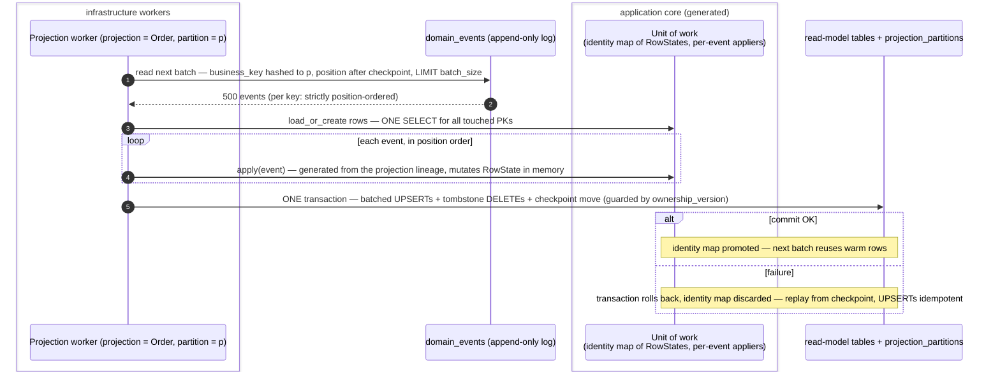

# PROP-20260730-230803 — Projection runtime: batched unit-of-work commits, business-key partitioned lanes, spec-declared targets

- **Status**: Proposed
- **Date**: 2026-07-30
- **Tracking issue**: [#267 "Projection runtime: batched unit-of-work commits, business-key partitioned lanes, spec-declared targets (Postgres / Redis)"](https://github.com/TheCaptainCompany/captain-food/issues/267)
- **Companion**: [PROP-20260728-152752 "The write path becomes an actor mailbox"](PROP-20260728-152752-actor-mailbox-write-path.md)
  — same patterns (batch, partition, checkpoint, per-key ordering), applied to the read side; the
  two runtimes deliberately rhyme so one mental model covers both.
- **Realized by**: _(filled at completion)_

---

## 1. Context — the directives

From the 2026-07-30 product-owner design session (read-side counterpart of #242):

1. **Projectors process a GROUP of events in memory and commit the changes in ONE transaction per
   batch** — load the affected read-model rows (or build them if absent), apply every change in
   memory, save once. Batch of 100–1000 events, **configured in the spec** within memory limits.
2. **Partition the projection processing** — while **respecting chronological order per business
   key**, a key **defined in the spec at the event level** and **saved in a `domain_events`
   column `business_key`**.
3. **`ScopeMembership` should be a Redis projection** — authorization membership must be quickly
   available; being a projection (rebuildable from the log), the database copy may be unnecessary.

Today's projector (`crates/infrastructure/src/projection/worker.rs`) is a single in-process drain
applying events one at a time — one transaction per event, no partitioning, Postgres only. Fine
for V0 idle traffic; the wrong shape for a Friday-peak backfill or a full rebuild.

## 2. The generated unit-of-work — the "Entity Framework" question, answered

**Do we have an EF-like ORM? No — and we should not adopt one.** SQLx is deliberately not an ORM
(compile-time-checked SQL, no change tracking), and the Rust ORM landscape (SeaORM, Diesel) has
nothing with EF's change-tracker maturity. But the *need* behind the question — "represent the
table structure, load or build row states, generate the saving SQL" — is better served here than
EF serves it, because **the DSL already knows everything an ORM would have to discover**:
`projection_tables.yaml` declares every column, PK, type and `from` lineage. So codegen emits,
per projection table, the two Fowler patterns EF is made of:

- an **identity map**: `rows: HashMap<Pk, RowState>` — `load_or_create(pk)` fetches the row once
  per batch (one `SELECT … WHERE pk = ANY($batch_pks)` up front, not per event) or starts a fresh
  default for rows that do not exist yet;
- a **unit of work**: every event in the batch mutates the in-memory `RowState` through generated
  per-event appliers (the projection lineage, same generation discipline as the actors'
  `apply`); `flush()` then emits **batched UPSERTs** (`INSERT … ON CONFLICT (pk) DO UPDATE`,
  multi-row VALUES) plus tombstone DELETEs, **and the checkpoint move, in ONE transaction**.

Typed by the spec, tested like any generated artifact, zero runtime reflection, no new
dependency. An ORM would re-derive at runtime what the codegen knows at generation time.

**Transactions saved**: 500 events touching 120 distinct rows = 1 SELECT + 1 transaction
(~122 statements batched) instead of 500 transactions. The fsync count — the projector's dominant
cost — drops by the batch factor.

## 3. Partitioned lanes, ordered per business key

- **The DSL fact**: every event gains a `businessKey:` — the payload property whose value orders
  it against its siblings. **Default: the emitting aggregate's `identity`** (companion proposal),
  so the declaration is only written when it differs; the validator enforces existence + type
  (`bk-missing` only fires when there is no identity to default to, `bk-not-in-payload`,
  `bk-type`).
- **The column**: `domain_events.business_key uuid NOT NULL` — stamped by the append
  infrastructure from the payload (envelope-style, like `correlation_id`), backfilled by
  migration from each event type's declared property, indexed `(business_key, position)`.
- **The lanes**: projector workers partition by `hash(business_key) mod N` — the same frozen-hash
  rule, keyspace width and lease/checkpoint registry pattern as the mailbox
  (`projection_partitions` mirrors `mailbox_partitions`, including `ownership_version`). **All
  events of one business key land in one lane → applied in `position` order; across keys, no
  promise** — the exact guarantee the read model needs and not one bit more.
- **Checkpoint** per `(projection, partition)`, committed inside the batch's transaction — a
  crash replays at most one batch, and the UPSERTs are idempotent re-applied (fold semantics).

## 4. Configuration lives in the spec (ADR-20260729-010500 posture)

Structural facts go in the DSL (`businessKey` on events, `target` on projections); **runtime
tuning goes in `specs/configuration.yaml`**, declared and validated like every other knob:

```yaml
projections:
  batch_size:        { default: 500,  min: 100, max: 1000 }   # events per unit-of-work flush
  batch_memory_mb:   { default: 64 }                          # flush early if the identity map outgrows this
  partitions:        { default: 16 }                          # lane keyspace width (fixed-wide, like the mailbox)
```

(The same file gains the activation-expiry knobs the mailbox proposal §3.5 now references:
`actors.activation_idle_seconds` global default, overridable per actor in `actors.yaml`.)

## 5. Decisions surfaced

### D1 — How the row mapping is built

| Option | Pros | Cons |
|---|---|---|
| **Generated identity-map + unit-of-work from the DSL lineage** ✅ recommended | The spec is already the schema registry — no drift possible; typed appliers per event; batched SQL emitted once at codegen time; zero new dependencies | The generator grows an emitter (bounded: the lineage semantics already exist for the SQL-view fold) |
| Adopt an ORM (SeaORM/Diesel) | Familiar EF-ish surface | Runtime re-derivation of what the DSL knows; Rust ORMs lack EF-grade change tracking anyway; a schema truth *competing with the spec* — the exact drift the operating model forbids |
| Keep per-event transactions | No work | One fsync per event; a rebuild of 1M events = 1M transactions — hours for no reason |

### D2 — Business-key default

| Option | Pros | Cons |
|---|---|---|
| **Default = the emitting aggregate's `identity`; declare `businessKey:` only on divergence** ✅ recommended | Zero boilerplate for the 90% case; the divergent cases (e.g. a per-restaurant digest fed by Order events keyed on `restaurantId`) become visible, deliberate declarations | Two places to look (identity, then override) — mitigated by the generated docs showing the resolved key per event |
| Explicit on every event | Uniform | ~80 redundant declarations that can silently diverge from `identity` |
| No column — derive at read time from payload | No migration | Every projector pass re-parses payloads to route; the lane hash needs an indexed column to scan cheaply |

### D3 — `ScopeMembership` target: Redis, Postgres, or declared-per-projection?

| Option | Pros | Cons |
|---|---|---|
| **A `target: postgres \| redis` attribute on each projection; `ScopeMembership` declared `redis` — served from Postgres until Redis enters the stack** ✅ recommended | The product owner is right on the shape: membership is ideal Redis material — tiny values, O(1) set lookups on every scoped query, no joins, and **rebuildable from the log so Redis-loss = rebuild, not data loss**; the `target` attribute makes the projector emitter pluggable and the flip a config-grade change; V0 avoids adding a second stateful system for Tours-scale traffic a PG index serves in microseconds | Until the flip, scoped reads keep the PG round-trip (measured fine today); two emitter backends to maintain once Redis lands |
| Redis-only now | Fastest possible authorization reads immediately | A new stateful system (run, secure, EU-pin per ADR-0042) for V0's single-digit RPS; every SQL read-model query must fetch scopes from Redis first and inject them (`WHERE x = ANY($scopes)`) — a two-store read path bought before any latency evidence demands it |
| Postgres forever | One store | Concedes the product-owner's point — at scale, per-request membership lookups ARE the hottest, simplest-shaped reads in the system; Redis (already candidate as the D7 placement cache) will be in the stack anyway |

Note the write side is untouched either way: #235's checks run against **aggregate state**, never
`ScopeMembership` — the correction that started this whole thread stands.

## 6. Sequence diagram — one projection batch

<a href="https://mermaid.live/view#pako:eNp9VN1P2zAQ_1dOfWq1VmPT9lJtvKwRQjCooBUvSNHFubRebV9mO5QO8b_vnKQfTBN5aePEv89zXgaKSxpMYRDod0NO0UzjyqN9dCAXNpFdYwvy3X3Bz6Bd5TFE36jYeIIt-w350D1PV40-aqVrdBEeAAPMPf8iFTW7_mUY1sel73DrS_Ljbl-_VI86PHJl9-cUdJYl1JItapfTE7kYYIh1LS9P2JkdGF6NjnrlidEKW2TFoni4IkceI5Wj_6tecqt76XQErlrR3wr_8XyoSyHTcQcW6_Tkjrf3UYCCqCc_abV0fJLIexbmF4nAE5YTK_kbiFgYCvABjsnkh0Ak3A7iYXJ-Psum7UZw9ByhwKjW8Nh8Pvv0BYomaEch5BvawRrDmkqIDLWo49BFi1WU_NWa1KZm7eIYri9_Xi46nDzoP9QxzbKJcD1M4evZGewzFo8g0FOQ9rWKkvQed8Kpw0OgSaeEOJUmsMzZ50oURwLP27AXe3uTwX12nf1YQMUe0EgI3KikeX7Vj5NhroFQHLYSxjJ7Ryst5bHAA2fKfzdsN4z2ZIfGofJsIa7pJGgwkhquaAy2ads89Jr4LFn2u3-6TGTzi2lrInp0ATukfREpTSFbzu-zu0WqNbItgpwlkmSvs0WW1o4tgOWnNJcNiqcSih3wVgSHta7zJ_kV6D5ZNFGG2FqZzNuro_kbFrGC4dPsjpOyN6MqXi0n972-k9Hx1ARxvEVv23p6oyYQVKiNnPD3WE69ezYmCKrajN-ylzqozlhP76k2uOuqOB3FfVyy29bC5eIh9sEYBpa8HPlSPlYvA2nQtp-tkipsTBy8vv4FvZie7w" target="_blank" rel="noopener noreferrer">Open this diagram with pan and zoom on mermaid.live — on github.com use Ctrl/Cmd+click or middle-click to get a NEW tab (GitHub strips target=_blank)</a>



## 7. Mockup — the projection lanes join the ops monitor

```
┌──────────────────────────────────────────────────────────────┐
│ Read side — projection lanes                  (ADMIN, live)  │
│──────────────────────────────────────────────────────────────│
│ projection      part  lag(evts)  batch  checkpoint  target   │
│ Order             0       12      500     184 220   postgres │
│ Restaurant        0        0      500     184 220   postgres │
│ ScopeMembership   0        3      500     184 219   redis    │  ← declared target
│──────────────────────────────────────────────────────────────│
│ rebuild Order: ~1.2M events / 500 per txn = ~2 400 commits   │
└──────────────────────────────────────────────────────────────┘
```

## 8. What this changes, where

1. `specs/events.yaml`: `businessKey:` where it diverges from the aggregate identity (plan-mode).
2. `specs/database/tables/eventstore.yaml`: the `business_key` column + `(business_key, position)`
   index (plan-mode) + backfill migration.
3. `specs/database/tables/projection_tables.yaml`: the `target:` attribute (default `postgres`).
4. `specs/configuration.yaml`: the `projections.*` knobs (+ `actors.activation_idle_seconds`).
5. `tools/codegen-rs`: `bk-*` validator rules; the unit-of-work emitter; docs emitter (resolved
   business key per event; target per projection).
6. `crates/infrastructure`: partitioned projection worker over the registry pattern;
   Redis emitter when the target flips.

## 9. Verification plan

- Ordering under concurrency: two lanes, interleaved keys — one key's rows always reflect its
  events in `position` order (property test).
- Crash mid-batch: replay from checkpoint is byte-identical (UPSERT idempotency test).
- Batch-factor measurement in CI's Postgres: 10k-event rebuild, transactions counted =
  `ceil(10k / batch_size)`.
- Memory bound respected: identity map flushes early at `batch_memory_mb` (synthetic wide-row
  test).
