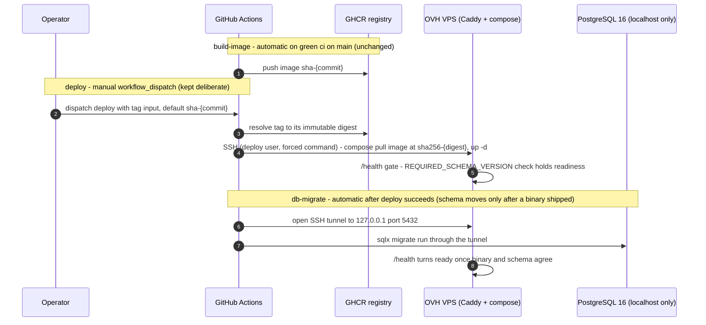
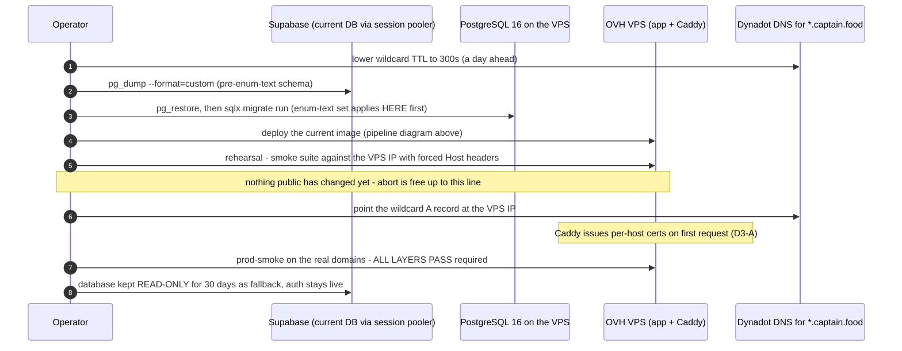

# PROP-20260730-234500 — Migration to an OVH VPS: app + Postgres colocated, Supabase kept for identity

- **Status**: Proposed — awaiting product-owner scope choices on D1–D5 below.
- **Tracking issue**: [#269 "Migrate hosting to an OVH VPS: app + Postgres colocated, Supabase kept for identity only"](https://github.com/TheCaptainCompany/captain-food/issues/269)
- **Decision already taken**: the *destination* is decided —
  [ADR-20260730-233749](../adr/ADR-20260730-233749-hosting-moves-to-ovh-vps.md) (product-owner
  directive: OVH VPS, app + Postgres colocated, Supabase identity-only, Scaleway excluded). This
  proposal carries the *how*: runtime layout, deploy pipeline, TLS, sequencing, backups.
- **Related**: [ADR-20260730-051500](../adr/ADR-20260730-051500-isolate-build-deploy-migrate.md)
  (build/deploy/migrate isolation — kept), [ADR-20260730-135741](../adr/ADR-20260730-135741-live-host-serves-no-content.md)
  (marketplace 204 — removed at the end of this migration), ADR-0043 (migrations out-of-band — kept),
  ADR-0015 (Supabase Auth wrapped — unchanged).

## Why now

Split-cloud hosting failed on both meters in the same week: Render's free tier is paused (100 GB
outbound bandwidth exhausted) and Supabase's 5 GB/month database egress cap was being approached —
production is effectively DOWN today. The structural cause is topology: app and database in
different clouds means every SQLx read crosses a metered public boundary. One EU OVH VPS
(traffic unmetered by policy, verified 2026-07-30) removes both meters, and a localhost-only
Postgres matches the post-incident security posture: the database is not network-reachable at all.

## Target topology

One **VPS-1** (2 vCPU, 4 GB RAM, 40 GB local NVMe, 500 Mbit/s unmetered, €4.57 TTC/mo) in
**Gravelines or Strasbourg**, Debian stable, running:

- **Caddy** — ports 80/443, TLS termination for `*.captain.food`, reverse proxy to the app.
- **The Axum binary** (the existing GHCR image, unchanged) — in-process projector and workers as today.
- **PostgreSQL 16** — bound to `127.0.0.1`/unix socket only. Never exposed.
- **Supabase keeps identity only** (phone-OTP/magic-link, ADR-0015): auth traffic is far below the
  free tier's egress cap once the database moves off it.

What does **not** change: the GraphQL surface, Host-header multi-tenant routing (ADR-0036), the
GHCR build pipeline, migrations-out-of-band (ADR-0043), Honeycomb EU telemetry (ADR-20260729-183000),
and `tools/smoke/prod-smoke.sh` (it already accepts `SUPABASE_URL`/`SUPABASE_SECRET_KEY` directly,
so the Render-API credential path just falls away).

**Screen mockups: none — deliberately.** This migration changes no UI surface, screen, resolver or
action; every audience host renders exactly as before behind the same domains. (Stated explicitly to
satisfy the proposal completeness rule rather than silently omitting it.)

## Decisions to approve

### D1 — Runtime layout on the box

| Option | Pros | Cons |
|---|---|---|
| **A. App in Docker (compose), Postgres native (PGDG apt)** *(recommended)* | Reuses the GHCR image pipeline untouched, digest-pinned rollback kept. Postgres gets the boring path: distro security patching via unattended-upgrades, data directly on the NVMe, standard `pg_upgrade` story | Two management planes (compose + systemd) |
| B. Everything in compose (Postgres containerized) | One management plane, versions pinned in one file | DB data path through Docker volumes, engine upgrades restart the DB, Docker daemon becomes a dependency of the *data*, not just the app |
| C. Everything native (binary via systemd, no Docker) | Smallest stack, no Docker at all | Abandons the existing image pipeline — deploys become binary shipping, rollback loses the digest-pinned story (ADR-20260721-175411) |

### D2 — Deploy mechanism (keeps the three-stage isolation of ADR-20260730-051500)

| Option | Pros | Cons |
|---|---|---|
| **A. `deploy` workflow SSHes in: `compose pull image@sha256-{digest}` + `up -d`, `db-migrate` runs sqlx-cli through an SSH tunnel after deploy succeeds** *(recommended)* | Same shape as today: build automatic, deploy manual + digest-pinned, migrate only after deploy. Rollback = dispatch with an older tag. One new secret pair (SSH key + host) replaces the Render hook | CI holds an SSH key to production (scoped: dedicated deploy user, forced-command restricting it to the deploy script) |
| B. Auto-pull agent on the box (watchtower-style) | No CI-to-box credential | Violates the manual-deploy directive — deploys stop being deliberate, digest pinning is lost |
| C. Pull-based GitOps agent (k3s/flux) | Declarative | A Kubernetes control plane to serve one binary on one box — overkill at V0 |

### D3 — TLS for the `*.captain.food` wildcard

| Option | Pros | Cons |
|---|---|---|
| **A. Caddy on-demand TLS: per-host certs issued on first request, gated by an `ask` endpoint the server already can answer (`classify_host` + tenant lookup)** *(recommended)* | No DNS-provider API dependency, no zone-wide credential stored on the box (security posture), new tenant subdomains just work | First request to a brand-new host pays cert issuance (~1–2 s once per host), Let's Encrypt rate limits (a non-issue at Tours scale) |
| B. Wildcard cert via DNS-01 (acme.sh + Dynadot API) | One cert covers every host, zero per-host issuance | A credential able to rewrite the whole DNS zone lives on the box — exactly what the post-incident posture avoids. Dynadot API support in acme.sh must be verified first |
| C. Cloudflare free in front (universal SSL, proxy) | Hides the origin IP, free CDN/caching absorbs bandwidth | Adds a third party processing ALL customer traffic (GDPR processor + trust surface — counter to the reason we're consolidating), TLS terminates outside our box |

### D4 — Sequencing: where does the pending enum-text release land?

The enum-text schema conversion is merged but not applied anywhere
(ADR-20260730-051500 follow-up). Two ways to sequence it:

| Option | Pros | Cons |
|---|---|---|
| **A. Straight to the VPS: dump Supabase (old schema), restore on the VPS, run `sqlx migrate` there — enum-text applies on the new box. Render is never revived** *(recommended)* | One move instead of two. Production is down TODAY — reviving Render just to retire it buys nothing. The full rehearsal (restore + migrate + smoke against the VPS by IP) happens before any DNS change | New schema and new host change together — mitigated by the pre-cutover rehearsal being the *complete* production stack, not a partial one |
| B. Revive Render first (deploy + migrate + smoke per the ADR follow-up), then migrate hosting | Validates enum-text in the known environment | Requires un-pausing Render (wait for the bandwidth cycle or pay), does deploy + migrate + smoke twice, and keeps burning the meters that caused this |

### D5 — Off-box backup destination (nightly encrypted `pg_dump`)

Premium VPS backup (€1.10 HT/mo, 7 rolling days, same provider) is taken in all options; this
decision is the *second, off-provider* copy. Dumps are `age`-encrypted on the box with a public
key; the private key lives only in the product owner's password manager — the destination never
holds anything readable.

| Option | Pros | Cons |
|---|---|---|
| **A. The LWS server (already paid for the year)** *(recommended)* | €0 marginal, provider-diverse (OVH + LWS), and encrypted blobs demand almost no trust in LWS — a good use for a machine you don't otherwise like | Needs SFTP/scp access confirmed, and a calendar note for the LWS renewal date (backups silently dying with the contract is the failure mode) |
| B. Backblaze B2 (10 GB free) | Free, S3-compatible, `rclone` support | One more account/third party |
| C. Cloudflare R2 (10 GB free, free egress) | Free, free restore egress | Same, plus Cloudflare re-enters the picture after being avoided in D3 |
| D. OVH Object Storage | Same console | Same provider as the VPS — an OVH account compromise takes both copies (violates the off-provider principle) |

## Sequence diagrams

### Deploy pipeline on the VPS (D1-A + D2-A — the ADR-20260730-051500 stages, re-targeted)


<a href="https://mermaid.live/view#pako:eNp1lNtO20AQhl9l5Kugxm2hhUq5QEIQJUgtMYmaq0povJ7YK_bEHqBRlHdnfIhKS5pcZGPPfPP_M2PvMmEryiaQBXpKZATdSKw96l8G-IMpWpN0Sb7_79BHKaRDE2FRAAZYOPIY7ZH7s3l7fybjPJVwJaK0JhyLul52ce2vp1qG6Lfvw9bFqqu2nnfH0TVW1RY-gLDa2UAn7zOKWZtQ2BBrT6v773B6ASNlBaqGr4E1ajtk3dlIYJ_Js4hxq2MCZZKqyqXGmiDvuqCRyZwFTCMDQrZnjdLAKBnRoKmpGnizeX552XNcCg30mNBgvmO5Wsb9v3UXBdedQEVO2S0X1GgSKnix_nGj7MtDJYPDKBoYPZKLHKdk2bb94HtRdBWZcAgcUC8yNhCxBmlcimO-vMGk4hExb0R7ClY9U5cXLcgY2IJOEUtFXKGmEN_k8DgmsFrNYTTUTIH8GDbWC6ra-bCZ6oRNDaPinig19AQ7JWfnF_mu5-7HkBzkVc9n9KHAp4ZQsZeaTTNrOb3_ebuc3jysrufTH1cP6-lydbu4A9GQeITGqiqwDaykoRCOTLmYca_KXMva98A_I8ZN5JjBS0hCEDFsFBitETQTQrc8QyBCKQ16Dm2kc3_vQKfcOl6Xtj8xGUOq7ejp2bePn_l7Cs76COdfv5y9yWq1hSf1Gw7qfDIQG29TzbNsaAD9t0UxedO737JQQQeBPAYYXGC7xNkYMk2ed7ji53-XMVp3b4JhSbL9_hURR13b" target="_blank" rel="noopener noreferrer">Open this diagram with pan and zoom (mermaid.live, opens a new tab)</a>

### Data migration and DNS cutover (D4-A — rehearse first, cut over once)


<a href="https://mermaid.live/view#pako:eNptU2Fr2zAQ_SuHP6VbXDoK-xBYIV1COwiNV5dCYTAu0sUWlSX1JLcNpf99J7sdoWm-xJbvPb179-6lUF5TMYMi0kNPTtHCYMPY_XEgP-yTd323IR7fA3IyygR0CdYVYIR1IMbkP_len-fvdR9wg5FgonpmkvPFOTwahEgxGu8geG-Jjw7x1UXGVz6mhqn-vYJv30HqU0twW9WH9XI4CLq9HB4nGAJ8hZ-o9e4T9sXVUL3YOdR-fN16hi_HCkNC44633usRtq7KszMpmIH1T8TwZKxWyBpublaQPJyenES5DjTuAFtCfbSHq89nEJq_uu8ClKVc0WH6ofqYfAeTwFSS-Fsmek4QVUsd7oOriwHMJOVM09y7g_hgn6EzMqREwL2DyR4FJZC-raEIl8vrJWwNx7RPKdbMQFOwfjdY-T4V02EjQwomkDWOQI8xANz4RzogYJI-OaKFEmLn7wlib0QONmJdTO9Dgl-VuJXabK0iDZcyTMgOEceR8soLSm5gIZ8O1M6n1rgGQr-xRkErQ1ItukbgO-muzIpY9EbYMhH0IY9AIBGy7o8TC964Uc7_qc1FvfLygPs6P8oZtAzhkatiL35K0Ms2N6CIU8xRHMwVNlkc-Z8sTsv5gVOBvS5Hi97CyyS2ad9lp6Sd-WoFq_nd8rqGal7XA51h0h8ypDGNe3RPIcH1cr4o11eruyG0pyc5ezHneYvWblDdT_PqthBTPrfmkYopFB1J-oyWbX8pREk37L2mLfY2Fa-v_wBs51Yl" target="_blank" rel="noopener noreferrer">Open this diagram with pan and zoom (mermaid.live, opens a new tab)</a>

### Nightly off-box backup (D5)

```mermaid
sequenceDiagram
    autonumber
    participant TIMER as systemd timer (nightly 04:15 Europe Paris)
    participant PG as PostgreSQL 16 (localhost)
    participant BOX as VPS (age public key only)
    participant OFF as Off-box destination (D5 choice)
    TIMER->>PG: pg_dump --format=custom
    TIMER->>BOX: age-encrypt the dump (private key lives OFF the box)
    TIMER->>OFF: upload captain-food-{date}.dump.age, prune older than 30 days
    Note over OFF: monthly restore drill - decrypt + pg_restore into a scratch container, row-count spot check
```
<a href="https://mermaid.live/view#pako:eNptUktvFDEM_ivWnAaxU7WCchiJHlAfQgJ2oRXigIS8iXcmahKHxFkYrfa_45mFA9DcEud7-LMPjWFLTQ9Foe-VoqFrh0PG8DWCHqzCsYYt5dM9YRZnXMIo8PD2_c0nwAJlKkLBgrhAGdrohlH8BOcv-4tLuKmZE8EGsyvP_ifZ3M0MGy4yZLr_-A4uXkHr2aAf9e0JwJv1lxnxeXMPLQ4EqW69M_BIE3D00xOI9e3tjFjvdt2Wf4KlIi6iOI7QXl-CGdkZ-o1beuqurjZ3PaThm60hQdftOAeU16YW4fD3R7XTg_roNLo8JQEZCRZYm7Lbo9Bizbs9lcXJXFcb_-hppYeaPKMFg0nQRVVl2x2sUhzPZsYzlVlByjUSsLcatYwY4cU5WJzKie8DqyDvtbYwBo4y6iiy9sxZjWXnPXSawcns87nJP0UXhQGhmIxiRjCKVRuUV5D5R2e4apYlsWhiZB6bFTQ67oDO6vYcGu0rLHtkaYfVS3M8_gLE_ctU" target="_blank" rel="noopener noreferrer">Open this diagram with pan and zoom (mermaid.live, opens a new tab)</a>

## Phased plan

**Phase 0 — provision + harden** (no production impact)
- Order VPS-1, Gravelines (or Strasbourg), newest Debian in the funnel; enable the Premium backup option.
- Hardening baseline (the post-incident posture): key-only SSH + non-root sudo user + dedicated
  `deploy` user with forced command; ufw allowing 22/80/443 only; fail2ban; unattended-upgrades;
  Postgres 16 (PGDG) bound to localhost, `scram-sha-256`, one app role with least privilege.
- Install Caddy (on-demand TLS config + `ask` endpoint), Docker + compose plugin.
- Lower the Dynadot wildcard TTL to 300 s.

**Phase 1 — pipeline** (repo work, PR-reviewed)
- New `deploy` path: teach `.github/workflows/deploy.yml` the VPS target (SSH pull + up), retire the
  Render hook call; `db-migrate` switches from the Supabase URL to the SSH tunnel.
- Secrets: `VPS_SSH_KEY`, `VPS_HOST`, `VPS_DATABASE_URL` (tunnel-local); retire `RENDER_API_KEY`
  usage in workflows and smoke docs.

**Phase 2 — data + rehearsal** (production still untouched — it is down anyway)
- `pg_dump` from Supabase (session pooler), `pg_restore` on the VPS, `sqlx migrate run` (the pending
  enum-text set `20260730043000`–`0436` applies here first).
- Deploy the current image via the new pipeline; run the smoke layers against the VPS IP with forced
  `Host` headers. Fix until green. **Abort is free up to here.**

**Phase 3 — cutover**
- Point the Dynadot wildcard A record at the VPS; watch Caddy issue certs; run `prod-smoke` on the
  real domains until `ALL LAYERS PASS`; send a Stripe test webhook and verify the inbound drain.
- Set the Supabase database read-only (fallback for 30 days); Supabase Auth stays live.

**Phase 4 — post-cutover**
- Repurpose UptimeRobot: `/ping` + `/health` on `api.captain.food` (keep-warm is obsolete — no
  spin-down on a VPS); alerts to the product owner.
- Enable the nightly backup timer (D5) and run the first restore drill immediately, not in a month.
- Remove the marketplace 204 mitigation (delete the `HostRoute::Live` arm + its test,
  per [ADR-20260730-135741](../adr/ADR-20260730-135741-live-host-serves-no-content.md)) — bandwidth
  is no longer metered.
- Decommission: delete the Render service, drop the Supabase database objects after the 30-day
  fallback window, update `STATUS.md` and close
  [#269 "Migrate hosting to an OVH VPS: app + Postgres colocated, Supabase kept for identity only"](https://github.com/TheCaptainCompany/captain-food/issues/269).

## Costs

| Item | €/month |
|---|---|
| VPS-1 (12-month commitment, TTC) | 4.57 |
| Premium backup (7 rolling days, TTC) | 1.32 |
| Off-box backups (D5-A, LWS already paid) | 0 |
| Supabase (identity only, free tier) | 0 |
| **Total** | **≈ 5.89** |

Replaces: Render free tier (paused, was $0 but failing) + Supabase DB usage (was $0 but capped).
The upgrade trigger to VPS-2 (+€4.08) is evidence-based: p99 checkout latency at Friday/Saturday
peak, Postgres working set past ~3 GB, or disk pressure past ~30 GB.

## Rollback

- **Before Phase 3**: nothing public changed; stop at any point, no cleanup beyond the VPS itself.
- **After Phase 3**: DNS back to Render is NOT a rollback path (the service is paused) — the
  realistic posture is fix-forward on the VPS, with the read-only Supabase database as the data
  fallback and the 7-day VPS backups + nightly dumps as the recovery ladder. This is acceptable
  precisely because production is already down: the cutover starts from zero traffic, not from a
  live service at risk.

## Acceptance (issue closes when all hold)

1. `prod-smoke` `ALL LAYERS PASS` against the VPS behind the real domains (L1–L4, TEST-mode money).
2. A restore drill has actually recovered a nightly dump into a scratch Postgres.
3. UptimeRobot green on `/ping` + `/health` for 48 h; a deliberate deploy + rollback dispatch each
   verified once.
4. Render service deleted; Supabase project shows auth traffic only.
5. `STATUS.md` updated; the 204 mitigation removed (or explicitly deferred by the product owner).
