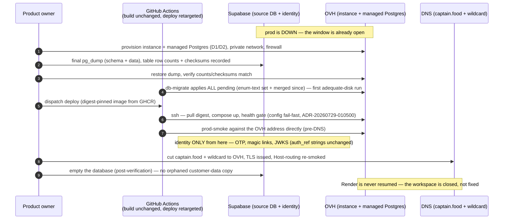

# PROP-20260731-061609 — OVH migration: compute + PostgreSQL leave Render/Supabase, identity stays

- **Status**: Proposed (the DESTINATION is decided — ADR-20260731-061609; this proposal carries the
  HOW: offering choices, cutover plan, and what supersedes what)
- **Date**: 2026-07-31
- **Tracking issue**: [#271 "Migrate hosting to OVH: app compute + PostgreSQL leave Render/Supabase; Supabase retained for identity only"](https://github.com/TheCaptainCompany/captain-food/issues/271)
- **Realized by**: _(filled at completion)_

---

## 1. Context

See ADR-20260731-061609 for the decision and the incident trail (Render: build cap, bandwidth
exhaustion → prod still down, disk; Supabase: Disk-IO budget, storage economics). This proposal
decides the OVH shape and the cutover. The standing constraint set: EU/France data residency
(ADR-0042, strengthened), the isolated build → manual deploy → migrate pipeline
(ADR-20260730-051500 — shape kept), wildcard `*.captain.food` multi-tenancy (Host-header routing),
Friday-peak as the sizing question, and V0's operational reality: a one-container app + one
Postgres, run by a team of one product owner plus agents.

## 2. Decisions surfaced

### D1 — Compute shape on OVH

| Option | Pros | Cons |
|---|---|---|
| **OVH Public Cloud instance (small, e.g. b3-8-class) running the container via docker compose + systemd** ✅ recommended | Matches what the app IS today (one container + workers in-process); fixed, low monthly cost, no per-GB egress surprises (the exact failure mode leaving Render); trivially scriptable deploy (SSH: pull digest, restart); snapshot-able | Host OS is ours to patch (unattended-upgrades + minimal surface); no autoscaling (irrelevant at V0 — and #193 caps us at one instance anyway until the mailbox leases land) |
| **Not OVH at all — Clever Cloud (French PaaS, Paris region)** — raised by the product owner 2026-08-05, and **choosing it REOPENS ADR-20260731-061609**, whose destination is otherwise settled | **Deletes the host layer entirely**, and with it most of [PROP-20260805-181926](PROP-20260805-181926-host-provisioning-and-configuration-ownership.md): no OS to patch, no cloud-init, no OpenTofu, no WireGuard, no block volumes, no WAL archiving to build — only its D7 survives. Deploys a Docker image, so the GHCR + digest-pinned pipeline largely carries over. **Managed PostgreSQL with daily backups (7-day retention) included on paid plans, and PITR via pgBackRest on request** — which is precisely the work self-hosting makes ours. Strongest **sovereignty** posture on this page: data in France, European jurisdiction, explicitly outside the Cloud Act, against a Supabase that is US-owned. For a team of one product owner plus agents, not operating a Postgres server is the whole argument | **We just left a PaaS, and the Render failure modes were egress exhaustion, build caps and disk** — whether Clever Cloud meters egress the same way is THE question to settle before anything else, and it was not established here. Cost is above 2 x d2-2: an app instance plus a paid database plan, and the **free DEV database plan carries NO backups** (since 2025-10-01), so it is a trap for the same reason the Supabase free tier is. Exact plan prices were NOT verified — use the vendor's price estimator, not a secondary source (this proposal has already been bitten once by third-party spec tables). Less control than an instance, which is the point and also the risk |
| OVH Managed Kubernetes | The playbook's someday-K8s posture; rolling deploys | A control plane to operate for ONE pod; cost and complexity out of proportion; the mailbox/lease work (#242) is what makes multi-instance meaningful — adopt k8s when instances > 1 matters |
| OVH VPS | Cheapest — the **2027 VPS-2 is 4 vCores / 8 GB RAM / 75 GB NVMe at EUR 7.21 HT/month** (EUR 8.65 TTC), so a two-host split costs ~EUR 14.42 HT/month. CPU and RAM comfortably cover V0 | Three cons, checked 2026-08-05 against the live product page while the product owner was pricing a 2-VPS split. **(a) No private network.** The VPS feature list is vCores, RAM, NVMe, backup, unlimited traffic and PUBLIC bandwidth — nothing else; every vRack document scopes the feature to Public Cloud, Hosted Private Cloud and Bare Metal, VPS absent throughout. An app-VPS + database-VPS pair therefore carries Postgres traffic **over public IPs**, forcing an internet-exposed database holding paid orders and customer PII behind nothing but TLS and an IP allowlist. **(b) The included backup is "sauvegarde automatisée 1 jour"** — a VM-level snapshot with ONE DAY of retention. Corruption unnoticed for 24 h is unrecoverable, and a VM snapshot of a running Postgres is not PITR: the event log wants WAL archiving, which is ours to build. **(c) 75 GB is a hard ceiling** for an append-only event log plus projections plus WAL plus the temp space a migration needs — and this project has already lost a release to exactly that ([#264 "fix: split the enum-text migration so it fits production's disk"](https://github.com/TheCaptainCompany/captain-food/pull/264)), which is part of why we are leaving the current platform. **(a) is now CONFIRMED, not a suspicion**: the vRack product page enumerates its compatible families — Bare Metal dedicated servers, Hosted Private Cloud, Public Cloud, Additional IP, Enterprise File Storage, Load Balancer — and **VPS appears in none of them**, so a VPS cannot join a vRack and cannot share a private network with a Public Cloud instance either. **That inverts the usual advice**: with no private network available, splitting app and database across two VPS makes the posture WORSE than co-locating them, because a single host keeps Postgres on a unix socket with zero internet exposure while a split forces it onto a public IP. A two-VPS split is therefore only defensible with a self-built encrypted overlay (**WireGuard**, Postgres bound to the tunnel interface and never to the public IP) — cheap and standard, but it is ours to run and monitor |

### D2 — The domain database

| Option | Pros | Cons |
|---|---|---|
| **OVH Public Cloud Databases for PostgreSQL (managed), smallest HA-capable plan, same region as the instance** ✅ recommended | Managed backups/PITR, patching, metrics; private network to the app instance; the database is the one component where self-managing risks the money path | Monthly cost above self-hosted; plan ceilings exist (but published and upgradeable, not a hobby-tier budget that silently throttles) |
| Self-hosted PostgreSQL on a SECOND Public Cloud instance | Cheapest by a wide margin — the product owner priced **2 x d2-2 at EUR 5.71 each (EUR 11.42/month)**, under two VPS-2 AND with the native private network VPS cannot have, which is what makes this shape viable at all. Managed PostgreSQL was ruled out on cost (product owner, 2026-08-05) | Backups/PITR/patching become our pager — **WAL archiving to object storage is mandatory, not a follow-up**, since no VM-level snapshot can recover an event log. **But measure that against the real baseline, not against managed**: the Supabase FREE plan we run today includes **no automatic backups and no PITR at all** (confirmed on the pricing page, 2026-08-05), so building WAL archiving is a strict IMPROVEMENT on the current posture rather than a regression — the event log is unprotected right now. Three sizing facts checked 2026-08-05: **d2-2 is 1 vCore / 2 GB RAM / 25 GB NVMe** (a third of a VPS-2, and 25 GB is well under the disk ceiling that already cost us [#264](https://github.com/TheCaptainCompany/captain-food/pull/264)); the Discovery range is **shared-vCPU**, so Friday peak competes with neighbours; and **resize is an upscale-only ratchet with downtime** — a classic-model instance must be stopped to change flavor and can never move to a smaller disk. **The disk answer is a block-storage volume, not a bigger flavor**: putting the Postgres data directory on an attached volume lets storage grow independently, and keeps the D4 disposable-host posture intact for the database host too, since the data survives the instance |
| Keep Supabase DB, move only compute | No data migration | Rejected by the decision itself — the Disk-IO budget and storage economics ARE the exhausted limitation |

### D3 — Cutover sequencing (prod is already down — use it)

| Option | Pros | Cons |
|---|---|---|
| **Straight cutover now: final Supabase dump → restore on OVH → apply ALL pending migrations (enum-text set + whatever has merged) → deploy image → smoke → DNS** ✅ recommended | The outage window is already paid for; Render is never touched again; the enum-text release lands on infrastructure with adequate disk (the #264 constraint evaporates); one migration story instead of two | No parallel-run safety net — mitigated by: V0 has no live traffic during the outage, the dump/restore is verifiable offline (row counts + checksums per table), and the log is append-only (a re-dump delta is trivial if anything trickled) |
| Restore Render first, migrate later | "Two smaller steps" | Pays Render again to resurrect a platform we are leaving; applies enum-text twice-risk; re-opens traffic only to interrupt it again |
| Logical replication for zero-downtime | No window needed | Ceremony for a system that is DOWN; publication/slot setup against a hobby-tier source that throttles IO is its own incident |

### D4 — Deploy pipeline retargeting

| Option | Pros | Cons |
|---|---|---|
| **Keep `deploy.yml`'s shape (manual dispatch, digest-pinned, `tag` rollback input); the job SSHes to the instance: `docker pull ghcr.io/...@digest && compose up -d`; `db-migrate` keeps following `deploy`** ✅ recommended | ADR-20260730-051500's guarantees survive verbatim (a bad config cannot replace a working deploy; migrate only after deploy); GHCR stays the artifact truth; rollback = redeploy old digest | An SSH key becomes a repo secret (deploy-only user, forced-command hardened) |
| OVH API-driven redeploy | No SSH | More moving parts for the same outcome at one instance; revisit with k8s |

## 3. What supersedes what

- `render-config-sync.yml` + `specs/generated/render-config-sync.json` → retired (config still
  rides the artifact per ADR-20260729-020000; the per-profile `deploy:` blocks in
  `specs/configuration.yaml` re-declare suppliers).
- STATUS's "once the Render workspace is restored" runbook → replaced by the cutover runbook (§5).
- #242 slice 3 prod-gate → "OVH cutover complete".
- Supabase project: database emptied after the final verified dump; auth configuration untouched
  (OTP templates, OVH SMS hook PROP-20260724-233605, JWKS URL unchanged in config).

## 4. Sequence diagram — the cutover

<a href="https://mermaid.live/view#pako:eNp9VO9rG0cQ_VcGfZLIXS2LtiGiGOwIbFpjCSs0FAJhtDt3t-hud7s_rIiQ_z1vJSsxtlt9OU63b-a9N2_260g5LaM5jaL8m8UqWRhuAw-fLOHHOTmbh42E47vnkIwynm2i1ZI40io4nVUit7OvHbq-KYeuTbrJG7pUyTgb_9iEs4vxJpteU7aqY9uKrkiL792egiQOrSTRk5fl1lel3Dp73nAUGkeXgxJaXNEbMlpsMmn_Cmz594FGeYyNjYmhE4iBLaM1rVxMbZD4CnJxty7I8hgr9omN_aVxTgO9A3_FodA84u5cEnIPEkCzQq85eZhDBvDlxzv6lGfT818pdQKo1W5XvnAfhPWenJfHKqtlfXFxQj-YCMfofzjTeHF-tphNKhw3DwwGVtLOhW1FjQmy475_Und9Ncfflnvy7WedBw8LVScDo7LmxCiTeNMLBdBTLtsU8QUn1DbmIWI4ygUt-jlVEEkuCJWSFcEC0-wf8Wc_0QMn1R2h1zcnqN7Ug0HiwJy97w0kXd7eEvzQxrY0FuSvTvIlUZRUDJBQ9EcDPyYnUyE1JmKNDKNQrU3cUshPHb0urUz0hcIpamNtWhCvvbEWJc0AZ6kJbgC99_eT50xj7E79fO57OqIr6By8QxozpHfCfeqoLXLGytnGtNSw6euGy9HLxX09m85-n76dvaun59PfptMXbUpo6ji4LQxpuYz-kJlDhrWG0xGdMYjUQ4EPUiOck5cJnP9YCFre3f5z1NUJhvSoYflhVWEkrVHUG7uNFf358S_EHDvffQ7SUEwBE4g_d3TyxE80nZPKif5jKyi5QrmiD7drBD3msuI3CG0dXE5lsmB-UKmf5VMGD85Fcknkcc99AR5iZRSXS-TH5K0jFzz4YYAqI4XIR12AGIvfP7elMDowv0e88I4NtFI-wNY8oMTTJcUSIS_YOpxSPSYMBdYlhO2L6FFFI7Qa2Gjcnl9HQAyHe1RLw7lPo2_fvgO9Ecgk" target="_blank" rel="noopener noreferrer">Open this diagram with pan and zoom on mermaid.live — on github.com use Ctrl/Cmd+click or middle-click to get a NEW tab (GitHub strips target=_blank)</a>



## 5. Mockup — the cutover runbook as the operator sees it

```
┌────────────────────────────────────────────────────────────────┐
│ OVH cutover — runbook state                        (STATUS.md) │
│────────────────────────────────────────────────────────────────│
│ [1] provision instance + managed PG (D1/D2)          ⏳        │
│ [2] final Supabase dump + checksums                  ⏳        │
│ [3] restore on OVH, counts/checksums verified        ⏳        │
│ [4] db-migrate: 20260730043000..0436 + newer         ⏳        │
│ [5] deploy (digest sha-…), health gate green          ⏳        │
│ [6] prod-smoke vs OVH address                        ⏳        │
│ [7] DNS + wildcard TLS cut, Host-routing smoked      ⏳        │
│ [8] Supabase DB emptied (auth kept)                  ⏳        │
│ gate: #242 slice 3 unblocks after [7]                          │
└────────────────────────────────────────────────────────────────┘
```

## 6. Verification plan

- Dump/restore integrity: per-table row counts + `md5(string_agg(...))` checksums equal on both
  sides before anything else proceeds.
- The config fail-fast report (ADR-20260729-010500) is the deploy's health gate — a missing OVH-era
  value stops the container, the deploy fails visibly, nothing silently degrades.
- `prod-smoke` green pre-DNS (direct address) AND post-DNS (Host-header tenant routing, wildcard
  TLS).
- Identity re-smoked end to end: phone OTP (OVH SMS hook), magic link, #112 cookie pickup —
  proving the Supabase-identity-only split holds.
- Honeycomb EU still receiving (telemetry never gated the boot — ADR-20260729-183000 — but the
  cutover must not silently lose it either).
