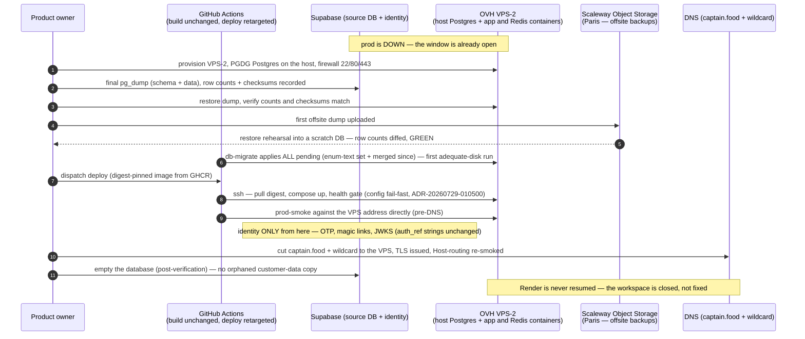

# PROP-20260731-061609 — OVH migration: one box for app + PostgreSQL + Redis, Supabase keeps identity

- **Status**: Approved (product owner, 2026-08-04 — the single-box shape; D1/D2 revised from the
  managed-database shape first proposed on 2026-07-31, see ADR-20260804-171030). D3/D4 unchanged
  and still pending execution.
- **Date**: 2026-07-31 (last revised 2026-08-04 — this file is a LIVING document, history in `git log -p`)
- **Tracking issue**: [#271 "Migrate hosting to OVH: app compute + PostgreSQL leave Render/Supabase; Supabase retained for identity only"](https://github.com/TheCaptainCompany/captain-food/issues/271)
- **Realized by**: _(filled at completion)_

---

## 1. Context

See ADR-20260731-061609 for the destination decision and the incident trail (Render: build cap,
bandwidth exhaustion → prod still down, disk; Supabase: Disk-IO budget, storage economics). This
proposal decides the OVH shape and the cutover.

Two facts arrived after the first draft and reshaped D1/D2:

1. **A hard deadline.** The Supabase organization is over its Free-Plan egress quota and projects are
   restricted from **30 Aug 2026**. The cutover is the fix, not a nice-to-have — colocating app and
   database removes the egress category entirely (every DB round-trip becomes loopback traffic).
2. **The budget is the binding constraint.** The product owner has no appetite for the ~€160/month
   the managed-HA shape costs pre-revenue. The original D2 recommendation was written before that
   was on the table.

The standing constraint set is otherwise unchanged: EU/**France** data residency (ADR-0042,
strengthened by ADR-20260731-061609), the isolated build → manual deploy → migrate pipeline
(ADR-20260730-051500 — shape kept), wildcard `*.captain.food` multi-tenancy (Host-header routing),
Friday-peak as the sizing question, and V0's operational reality: a one-container app + one
Postgres, run by a team of one product owner plus agents.

Measured load, for sizing honesty: idle outbound was **~21 MB/hour (~15 GB/month sustained)** and the
last full month landed at **4.18 GB** (PROP-20260802-200416). Render's free allowance was 5 GB —
the allowance sat *below the idle baseline*. That is the whole Render/Supabase failure in one line.

## 2. Decisions surfaced

### D1 — Compute shape

Screened 2026-08-04 across six providers. The decisive filter is not price, it is **permission to
run a process**: shared hosting sells capacity to serve PHP, a VPS sells the right to run your own
long-running binary. Captain.Food IS a long-running binary — an Axum server with in-process mailbox
workers parked on Postgres `LISTEN/NOTIFY` (ADR-20260802-200416).

| Option | Monthly (HT) | Pros | Cons |
|---|---|---|---|
| **OVH VPS-2 — 4 vCore, 8 GB, 75 GB NVMe, unmetered traffic, France** ✅ **CHOSEN** (product owner, 2026-08-04, 12-month term) | **€7.21** | Cheapest credible option that is ALSO French, so ADR-0042's French strengthening survives untouched, unmetered egress (no allowance to exhaust — the exact Render failure mode), root + Docker, daily automated snapshot included. 8 GB comfortably holds Postgres + Redis + the app at V0 volume | 75 GB and 8 GB leave less margin than VPS-3 on the two dimensions that have already bitten us (RAM, and disk after #264). Mitigated by the upgrade path below, not by hoping |
| OVH VPS-3 — 6 vCore, 12 GB, 100 GB NVMe | €10.40 | More headroom on exactly those two dimensions | €3.19/month for capacity that can be bought later, in place, at the moment it is actually needed. Pre-paying it is the one move that is hard to undo |
| OVH Public Cloud `b3-8` + 100 GB volume | ~€26 | Same ecosystem as OVH managed databases if we later split the DB out | 3.6x the price for 2 vCores and no more RAM than VPS-2, buying an upgrade path we have decided not to take yet |
| Hetzner CX32 — 4 vCore, 8 GB, 80 GB | ~€8.50 | Excellent hardware per euro, 20 TB traffic included | **Germany/Finland only** — walks back ADR-0042's French strengthening for a NEGATIVE saving, since VPS-2 is cheaper still. Also no managed-PostgreSQL path at Hetzner at all, so the later escape hatch would mean changing provider again |
| Scaleway DEV1-L + 100 GB block | ~€41 | French (Paris), cheap Object Storage, DEV-tier managed PG available | Instance prices exclude storage and block is €0.0949/GB/month — the disk alone adds ~€9.50. Loses on price to VPS-2 by more than 5x |
| Bare metal — Scaleway Dedibox Start-2-L / Start-9-M | €25–40 + one month install fee | No noisy neighbours, dramatically better €/GB of RAM at scale | Recovery is a *hardware intervention* (hours, and the rebuild is ours) where a VPS reboots elsewhere in minutes. No snapshots to roll back a bad migration. Solves a capacity problem we do not have. **Revisit when RAM is the binding constraint, not price** |
| Shared hosting — LWS WordPress Performance (already paid), o2switch Cloud | €7–16 | Cheapest on paper, huge advertised RAM | **Structurally impossible**: no root, no Docker, no systemd, and o2switch's CGV explicitly prohibit running daemons or any binary the host did not provide. LWS gives MySQL only. See §7 for the screening rule this earned |

**Region**: Gravelines (GRA) or Strasbourg (SBG) — French, per ADR-0042 as strengthened.
**OS**: Debian 13 (trixie), plain image. PostgreSQL **16** installed explicitly from PGDG — Debian 13's
default is 17, and `ci.yml` runs `postgres:16-alpine`, so taking the default would validate migrations
against a version production does not run.

**Why the smaller tier is the sound buy — the upgrade path is asymmetric.** OVH VPS upgrades happen
in place from the Control Panel: data preserved, **IP unchanged** (which matters, since DNS, TLS and
the deploy target are all pinned to it), effective immediately. Downgrading is *not* in place — it
means a new plan, a data transfer and a cancellation. So under-buying costs one click to fix and
over-buying costs a migration. Buy the floor, climb on signal:

| Signal | Action |
|---|---|
| Disk above **70%** of 75 GB | Upgrade before the partition work becomes urgent — a disk upgrade needs the filesystem expanded manually, which is a planned-window job, not an incident job |
| Sustained RAM pressure (swap in use, cache-hit ratio falling) | Upgrade vCores/RAM — friction-free, no partition work |

After any RAM upgrade, **raise `shared_buffers` / `effective_cache_size` and restart**: they are
static configuration, so PostgreSQL will otherwise ignore memory you are paying for.

Two constraints on that ladder: available upgrades depend on the range and model, and OVH does not
offer in-place moves **across generations** (a VPS 2026 service cannot become a VPS 2027 one). When a
generation retires, moving is the same procedure as a downgrade — which is another reason D6's restore
drill earns its keep: the backup story *is* the migration story.

### D2 — The domain database

**Revised 2026-08-04.** The 2026-07-31 recommendation was OVH Public Cloud Databases for PostgreSQL
on the smallest HA-capable plan (~€140/month for the pair). It is superseded on budget grounds: the
project is pre-revenue, pre-launch, and has no live traffic. Paying ~13x the compute cost to avoid
running a `pg_dump` cron is not defensible at this stage.

| Option | Monthly (HT) | Pros | Cons |
|---|---|---|---|
| **PostgreSQL on the same box, installed on the HOST (PGDG apt), data on the VPS NVMe** ✅ recommended | €0 | Removes the whole cross-provider egress category (DB round-trips become loopback — the 30 Aug quota problem dissolves), no plan ceiling to silently throttle, one machine to reason about, `unattended-upgrades` patches it | **Backups, PITR and patching become our pager** — accepted knowingly, and paid for by D6. A disk incident takes app AND log down together. No HA |
| OVH Public Cloud Databases, smallest HA-capable plan | ~€140 | Managed backups/PITR, patching, metrics, real failover | 13x the compute cost, pre-revenue. This is the right answer LATER, and the reason D1 keeps us at OVH |
| Scaleway managed PostgreSQL, DEV tier | ~€28 + storage | Managed backups and patching for a third of OVH's price | DEV tiers have **no HA at all** — so it buys managed operations, not availability. HA starts around €160 on PRO tiers. Splits the DB back across a network boundary, reintroducing the egress category we are leaving |
| Keep Supabase DB, move only compute | — | No data migration | Rejected by ADR-20260731-061609 itself — the Disk-IO budget and storage economics ARE the exhausted limitation, and the 30 Aug restriction lands on it |

### D3 — Cutover sequencing (prod is already down — use it)

| Option | Pros | Cons |
|---|---|---|
| **Straight cutover now: final Supabase dump → restore on the VPS → apply ALL pending migrations (enum-text set + whatever has merged) → deploy image → smoke → DNS** ✅ recommended | The outage window is already paid for, Render is never touched again, the enum-text release lands on infrastructure with adequate disk (the #264 constraint evaporates), one migration story instead of two | No parallel-run safety net — mitigated by: V0 has no live traffic during the outage, the dump/restore is verifiable offline (row counts + checksums per table), and the log is append-only (a re-dump delta is trivial if anything trickled) |
| Restore Render first, migrate later | "Two smaller steps" | Pays Render again to resurrect a platform we are leaving, applies enum-text twice-risk, re-opens traffic only to interrupt it again |
| Logical replication for zero-downtime | No window needed | Ceremony for a system that is DOWN. Publication/slot setup against a hobby-tier source that throttles IO is its own incident |

### D4 — Deploy pipeline retargeting

| Option | Pros | Cons |
|---|---|---|
| **Keep `deploy.yml`'s shape (manual dispatch, digest-pinned, `tag` rollback input). The job SSHes to the VPS: `docker pull ghcr.io/...@digest` then `compose up -d`. `db-migrate` keeps following `deploy`** ✅ recommended | ADR-20260730-051500's guarantees survive verbatim (a bad config cannot replace a working deploy, migrate only after deploy), GHCR stays the artifact truth, rollback = redeploy old digest | An SSH key becomes a repo secret (deploy-only user, forced-command hardened) |
| OVH API-driven redeploy | No SSH | More moving parts for the same outcome at one instance, revisit with k8s |

### D5 — Process topology on the box: what is containerised and what is not

The rule is **system of record on the host, rebuildable in a container** — not "Docker good" or
"Docker bad".

| Component | Placement | Rationale |
|---|---|---|
| **PostgreSQL** | **Host** (PGDG apt, systemd, `/var/lib/postgresql`) | System of record. `domain_events` IS the business |
| **App** | **Container** (digest-pinned GHCR image, `network_mode: host`) | Replaced on every release — that is the entire deploy model |
| **Redis** | **Container** | A projection/cache target ([#267 "Projection runtime: batched unit-of-work commits, business-key partitioned lanes, spec-declared targets (Postgres / Redis)"](https://github.com/TheCaptainCompany/captain-food/issues/267)). Losing it costs a rebuild from the log, not data |

| Option for PostgreSQL | Pros | Cons |
|---|---|---|
| **Host install via PGDG apt** ✅ recommended | The app's deploy verb is `docker compose up -d` on every release and the database must survive every one of them — keeping Postgres outside Docker makes `compose down -v` and `docker volume prune` **unable to reach the event log** (the CLAUDE.md "compiler first" instinct applied to ops). `unattended-upgrades` patches it, `pg_upgradecluster` handles majors, `pg_dump`/`pg_basebackup`/WAL archiving are version-matched and already present | One more thing installed outside the image. The app container must reach a host-local socket |
| Postgres as a compose service | One `compose up` provisions everything, version parity with CI by image tag | The database sits in the blast radius of every deploy and every disk-pressure cleanup. Disk pressure is not hypothetical here — #264 already had to split a migration to fit production's disk. Version parity is achievable with a pinned apt repo anyway (CI uses PG16, this container runs a host-installed PG16) |

**Wiring**: Postgres binds `127.0.0.1` only, the app container runs `network_mode: host`, so
`DATABASE_URL` stays `postgres://…@127.0.0.1:5432/…` with no NAT hop and no exposed port. The
firewall then needs 22/80/443 only. `db-migrate` is unaffected — same URL either way.

### D6 — Backups: the price of D2

Self-hosting the event log means the backup IS the durability story. This decision is what makes D2
acceptable rather than reckless.

| Option | Pros | Cons |
|---|---|---|
| **Nightly `pg_dump` to Scaleway Object Storage (Paris), retained offsite. WAL archiving for PITR is PHASE 2** ✅ recommended | **Different provider from the compute**, so an OVH account/region problem does not take the backups with it, while the data stays in France. €0.008/GB/month one-zone and 750 GB free for 90 days — call it ~€1/month. S3-compatible, so it works from any box | One more credential set to declare in `specs/configuration.yaml`. Restore is manual |
| OVH Object Storage | One provider, one invoice | Backups in the same failure domain as the machine they protect. Strictly weaker for the same money |
| The VPS's included daily snapshot only | Free, already there | A VM snapshot of a running Postgres is crash-consistent at best and offers **no PITR**. It protects against losing the machine, not against a migration we regret or a table we truncate. **Not a database backup** — it complements D6, it does not replace it |

**The rehearsal is part of the decision, not a follow-up**: a backup that has never been restored is
not a backup. Runbook step [3b] restores the dump into a scratch database and diffs row counts
before the DNS cut is allowed to proceed.

### D7 — TLS and DNS (resolves the "does DNS move?" question)

Render terminated TLS and ran ACME via a `_acme-challenge.captain.food` CNAME to its own verifier.
On our own box both jobs become ours. The realized zone (ADR-0036 amendment 2026-07-18) carries the
**marketing site** as well — apex 301-forwards to `join`, which is on GitHub Pages — so the zone is
not ours to churn casually.

| Option | Pros | Cons |
|---|---|---|
| **Phase 1: HTTP-01 for the named reserved hosts, Caddy, no DNS API at all** ✅ recommended | Certificates issue the moment DNS points at the box. Zero dependency on any DNS provider's API, so the cutover window carries no ACME risk. Stock `caddy:2-alpine`, no custom build | Does not cover `{slug}.captain.food` tenants — fine while none are live, and a hard blocker before onboarding |
| **Phase 2: wildcard `*.captain.food` via DNS-01, by DELEGATING `_acme-challenge` to an automatable zone** ✅ recommended, before tenant onboarding | Leaves the zone (and therefore marketing) exactly where it is — one CNAME is the entire blast radius. One certificate covers every tenant | Needs a Caddy build carrying `caddy-dns/ovh`, and a **separate** OVH API credential: consumer keys are bound to authorised routes and the SMS keys have no `/domain/zone/*` rights (ADR-20260730-032306) |
| Move the whole zone to OVH | One provider | Re-implements the apex 301 forward, which is a *registrar* feature and not a DNS record — rebuilding the marketing entry point during a migration window, for no gain over delegation |
| Per-tenant certificates on demand | No wildcard needed | Let's Encrypt caps issuance at **50 certificates per registered domain per week**, globally across accounts. The ceiling arrives at 50 new restaurants in a week — precisely when onboarding is succeeding |

Cutover consequence: `_acme-challenge.captain.food` must be **deleted** at step [7]. Left in place it
delegates validation to Render's verifier and our own issuance fails for a reason whose error message
points nowhere useful.

## 3. What supersedes what

- D2's managed-database recommendation (2026-07-31) → superseded by the single-box shape on budget
  grounds (ADR-20260804-171030). The managed database is the intended destination *later*, which is
  why D1 keeps us on OVH rather than taking Hetzner's marginally cheaper box.
- D1's rejection of OVH VPS (2026-07-31) → **withdrawn**. It read "Public Cloud instances are barely
  more and sit in the same ecosystem as the managed DB" — the load-bearing clause was the managed
  DB. With the database on the box there is no ecosystem to stay inside, and the premium buys
  nothing.
- `render-config-sync.yml` + `specs/generated/render-config-sync.json` → retired (config still rides
  the artifact per ADR-20260729-020000, the per-profile `deploy:` blocks in
  `specs/configuration.yaml` re-declare suppliers).
- STATUS's "once the Render workspace is restored" runbook → replaced by the cutover runbook (§5).
- #242 slice 3 prod-gate → "OVH cutover complete".
- Supabase project: database emptied after the final verified dump, auth configuration untouched
  (OTP templates, OVH SMS hook PROP-20260724-233605, JWKS URL unchanged in config).

## 4. Sequence diagram — the cutover

<a href="https://mermaid.live/view#pako:eNp1Ve9vGkcU_Fee-ATqXUyom6aosmSXCJRagCBKVClStOy-u9tyt7vZH3FQlP-9s5yxke36AwZu37yZefOWHwNpFQ-mNAj8NbGRPNOi9qL7bAh_IkVrUrdj3392wkcttRMm0npFItDaW5VkJHtnXjo0X-RDcx0XaUfXMmprwp87f3E13CXdKkpGNsLUrApS7Fp7IM9R-Jojq9FzuO1NhtsmJ3YiMA2DTV4yzW7oF9KKTdTx8ELZx_U2160-LvLbctIzaGyACrzUngMAhHMkjKINKx1IWhOFhqjwAuDq5v2RiBQt34kDrXb_MkzYRutFzT38WnjAfE6T8etLslUVdGTaCblP7iXI2fLIMf8bSuFy71eVtQrE7uCUFD4b0tctLaDsN_YwpICiKTmMgdButvq0PPWMDaPUKHuXn4jWs1AHso7vUdar8urqVP1NB8ymt6eg9Xw2f7QG32es7FdBlfaQ3LY0mVy8HV9cXv56hra9meKAES25-otKncOIZMOdgAolohgV5EFH2mRithzP5D6kLmDs0nrF6ik19IepTBmsIEjW1eFUn4f1iNCJKJuzcswok_EY8sn9I6OEmImHTjhV4vB69djKc8PCB4jQJloSFKTP2Dlm99aeiVC6qnJ855t375Y95nxxYq92ZaexTuiNdLUaZl7f3hJGoLSpachYrjLy90iBI_zoGNFXFDQWcXRq1msA5a8JQCXCuSefzoc4X6CVDu7I8n6PhkrXEFQ6bQwgdYdgUuVtB3p_bUZPmYbQnPq5hOn21QVUds5i1RLchy1tbKjOcobYj0rXVAndlpXIR69nm3IynrwZ_z75oxy_Hv82Hj9rk3Nahs7uYUiNiENYjtZxQZXCBLKhyEJsocB5LrEPo-ehnz5sO62Wt__0uhrG8O41rD6sCySi1pJabfahoPef_sZm4UJrvniuKESPCYTHC2h05ieaTkmmSP-ziIRY3NMu6MPtFvsVUg7BAitSeptini7YH5WqJwvCnQPvXJ9Xor_IXC48pltLkW_Jh-kbS9Y7cMQQZUJCkZEyF2I07vDUmszoyH6DiOEzFt9wfgBrUweI87vB-j0yg_szX3ctpgwFxkYE7jurQUEDtOqEVvh5-DFARXf8oVBcidTGwc-f_wGKkxB5" target="_blank" rel="noopener noreferrer">Open this diagram with pan and zoom on mermaid.live — on github.com use Ctrl/Cmd+click or middle-click to get a NEW tab (GitHub strips target=_blank)</a>



## 5. Mockups

> The executable form of this section is **[docs/runbooks/ovh-cutover.md](../runbooks/ovh-cutover.md)**,
> and the host configuration it drives is **[`deploy/`](../../deploy/)**. The mockups below fix the
> shape; the runbook is what the operator actually follows.

### 5.1 The cutover runbook as the operator sees it

```
┌────────────────────────────────────────────────────────────────┐
│ OVH cutover — runbook state                        (STATUS.md) │
│────────────────────────────────────────────────────────────────│
│ [1]  provision VPS-2, host Postgres, firewall        ⏳        │
│ [2]  final Supabase dump + checksums                 ⏳        │
│ [3]  restore on the VPS, counts/checksums verified    ⏳        │
│ [3b] offsite dump + RESTORE REHEARSAL green          ⏳ (gates [7]) │
│ [4]  db-migrate: 20260730043000..0436 + newer        ⏳        │
│ [5]  deploy (digest sha-…), health gate green         ⏳        │
│ [6]  prod-smoke vs VPS address                       ⏳        │
│ [7]  DNS + wildcard TLS cut, Host-routing smoked     ⏳        │
│ [8]  Supabase DB emptied (auth kept)                 ⏳        │
│ gate: #242 slice 3 unblocks after [7]                          │
└────────────────────────────────────────────────────────────────┘
```

### 5.2 The nightly backup report the operator wakes up to

```
┌────────────────────────────────────────────────────────────────┐
│ captain.food — nightly backup            2026-08-05 03:14 UTC │
│────────────────────────────────────────────────────────────────│
│ pg_dump              OK    412 MB     00:01:47                 │
│ upload -> scaleway   OK    s3://cf-backups/2026-08-05.dump.gz  │
│ WAL archive          OK    lag 00:00:04                        │
│ retention            OK    30 dailies kept, 1 pruned           │
│ last restore drill   2026-08-01  (13 days to next, due 08-18)  │
│────────────────────────────────────────────────────────────────│
│ domain_events rows   1 284 907    checksum a91f…  matches src  │
└────────────────────────────────────────────────────────────────┘
```

## 6. Verification plan

- Dump/restore integrity: per-table row counts + `md5(string_agg(...))` checksums equal on both
  sides before anything else proceeds.
- **Restore rehearsal (step [3b]) is a hard gate on the DNS cut** — the offsite dump is restored
  into a scratch database and row counts diffed. An unrehearsed backup does not count as one.
- The config fail-fast report (ADR-20260729-010500) is the deploy's health gate — a missing
  OVH-era value stops the container, the deploy fails visibly, nothing silently degrades.
- `prod-smoke` green pre-DNS (direct address) AND post-DNS (Host-header tenant routing, wildcard TLS).
- Identity re-smoked end to end: phone OTP (OVH SMS hook), magic link, #112 cookie pickup — proving
  the Supabase-identity-only split holds.
- Honeycomb EU still receiving (telemetry never gated the boot — ADR-20260729-183000 — but the
  cutover must not silently lose it either).
- Post-cutover egress observed for one week against the ~15 GB/month pre-cutover baseline. The
  expectation is a collapse to customer-facing traffic only. If it does not collapse, the colocation
  premise is wrong and we learn it in week one rather than at the next quota.

## 7. The screening rule this earned

Two paid hosting products were evaluated (and one bought for a year) before the disqualifying
property was noticed. It is not price, RAM or disk — it is **permission to run a process**. Before
looking at a single number, ask:

1. Do I get **root**?
2. Can I run **my own compiled binary**, permanently, listening on a port?
3. Can I **install and control PostgreSQL** myself — not "a database is available"?

Any "no" and it is web hosting, whatever the advertised specs say. LWS WordPress Performance and
o2switch Cloud both fail (1) and (2) — o2switch's CGV prohibit daemons and non-provided binaries
outright — while advertising 300 GB SSD and 48 GB RAM respectively. Recorded operationally in
[docs/claude/sessions.md](../claude/sessions.md).

## 8. Drawbacks — why we might regret the whole thing

- **One box is one failure domain.** App, event log and cache die together. D6 bounds the data loss,
  it does not bound the downtime — recovery is "provision a new VPS and restore", measured in hours.
- **We now own a database pager.** Patching, vacuum behaviour, disk growth, connection limits and
  backup verification are ours. The 2026-07-31 draft called this out as the reason NOT to do it, and
  that reasoning was sound — it is being overridden by budget, deliberately and reversibly.
- **No HA, and honestly none of the affordable options had it.** Scaleway's cheap tier is
  single-node too. HA starts around €140–160/month everywhere. We are not buying availability at any
  price we can afford, so we are buying recoverability instead.
- **A later split back to a managed database is a migration**, not a config change — dump, restore,
  re-point, re-smoke. D1 keeps us at OVH specifically so that migration is same-provider.
- **Shared vCores** mean no performance floor at Friday peak. At V0 volume this is theoretical, but
  it is the first thing to suspect if checkout latency degrades under load.

## 9. Unresolved questions

- **What triggers buying the managed database back?** Name the signal now (sustained IO wait? a
  restore drill that fails? first real revenue?) so the decision is not made in an incident.
- **GDPR reach into backups.** Offsite dumps contain customer personal data, so an erasure request
  must reach them or the retention window must be short enough to bound the exposure. This
  intersects PROP-20260726-170000 (event-log integrity, evolution and erasure) and is NOT resolved
  by this proposal.
- **Redis at cutover or deferred?** Nothing reads it until #267's projection targets land. Deferring
  keeps the cutover smaller.
- ~~**Does DNS stay at LWS or move to OVH?**~~ **RESOLVED (D7)**: the zone does not move. Only
  `_acme-challenge` is delegated, when phase-2 wildcard TLS is needed. Open sub-question: the zone's
  actual authority is disputed in the record — ADR-0036 says Dynadot, the LWS invoice implies LWS.
  `dig NS captain.food` before the window settles it.
- **Retention policy for the dumps** — 30 dailies is the placeholder in §5.2, not a decision.
