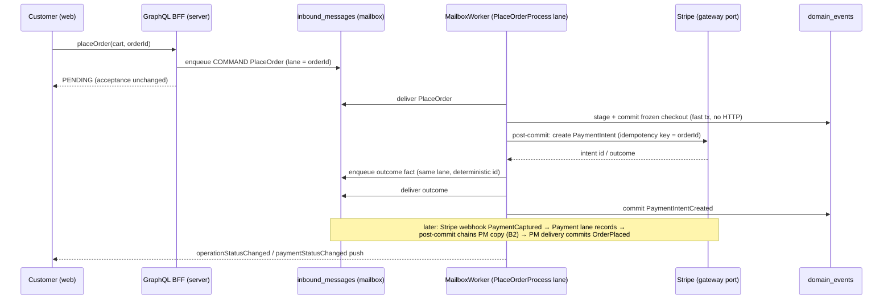
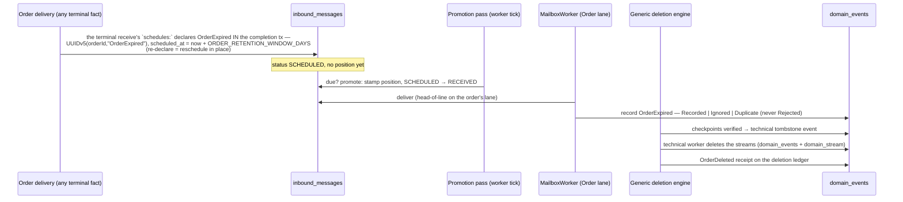

# PROP-20260731-195500 — Runtime D: PM mailboxes, typed reminders, and the deletion DSL

- **Status**: Approved (product-owner, 2026-07-31; decisions recorded in
  [ADR-20260731-203000](../adr/ADR-20260731-203000-runtime-d-choices-a2-b2-c2.md) and
  [ADR-20260731-214500](../adr/ADR-20260731-214500-deletion-dsl-declarative-generic-engine.md))
- **Date**: 2026-07-31 (living document — this is the CURRENT state of the design; prior states
  are in this file's git history, per ADR-20260801-020000)
- **Tracking issue**: [#272 "Runtime D: PM mailboxes (placeOrder/refund flip), reminders machinery, activations — continuation of #242"](https://github.com/TheCaptainCompany/captain-food/issues/272)
- **Realized by**: [PR #273 "Runtime D — PM mailboxes (two-phase payment delivery), typed reminders, activations"](https://github.com/TheCaptainCompany/captain-food/pull/273)
  (branch `272-runtime-d-pm-mailboxes-reminders`)

**Context**: [PROP-20260728-152752](PROP-20260728-152752-actor-mailbox-write-path.md) §3.4 ·
[ADR-20260731-120825](../adr/ADR-20260731-120825-actor-messages-typed-inside-the-actor.md) ·
[ADR-20260731-150500](../adr/ADR-20260731-150500-reminders-reschedule-in-place.md) ·
[ADR-20260731-153000](../adr/ADR-20260731-153000-gdpr-expiry-as-scheduled-actor-message.md) ·
[ADR-20260731-160000](../adr/ADR-20260731-160000-order-erasure-tombstone-then-stream-deletion.md) ·
[ADR-20260731-122500](../adr/ADR-20260731-122500-the-mailbox-is-the-only-door.md) ·
the [#270 review](https://github.com/TheCaptainCompany/captain-food/pull/270#issuecomment-5144774638)

## Why

Runtime C made the mailbox the door for every aggregate command and every inbound webhook fact.
Three mutations remain outside it — `placeOrder`, `approveRefund`, `denyRefund` — because their
owners are process managers, and their flip crosses the one boundary the mailbox has not crossed
yet: **an external HTTP call (Stripe) in the delivery path**. Reminders (`scheduled_at` rows) and
GDPR deletion are approved machinery that needed a runtime and a spec surface. This proposal
carries all of it.

## Use cases

- **UC1 — Checkout (the ETA-bearing flow)**: customer submits `placeOrder`; the mutation answers
  PENDING immediately (unchanged acceptance contract); the PlaceOrderProcess validates, prices,
  creates the Stripe PaymentIntent and freezes the checkout (`PaymentIntentCreated`); the
  `PaymentCaptured` webhook fact materializes the Order (`OrderPlaced`). Peak: Friday/Saturday
  19:00–21:30 — nothing in the flip may hold DB transactions across Stripe latency at peak.
- **UC2 — Refund decision**: restaurant/admin approves or denies a pending refund; approval
  drives the Stripe refund; the `PaymentRefunded` fact closes the saga idempotently.
- **UC3 — GDPR order deletion (the deletion pilot)**: an Order reaching a terminal state starts
  its retention clock; when due, the recorded `OrderExpired` fact drives the generic engine's
  journey (checkpoint-verified → tombstone → stream deletion → `OrderDeleted` receipt on the
  ledger). The engine ships GATED (`RUN_DELETION_ENGINE` default false); what remains for
  [#194 "GDPR erasure"](https://github.com/TheCaptainCompany/captain-food/issues/194): the
  per-projection tombstone folds of `OrderExpired` (parked under `nonProjectedEvents` until
  then) and the gate's default flip (its own one-line ADR after staging smoke).
- **UC4 — The leaving restaurant (second pilot, rides when prioritized)**: the owner requests
  deletion (refusable command), gets a cooling window with an undo, and the restaurant's
  dependent aggregates die through the propagation tree.

## The DSL (decided shape — ADR-20260731-214500)

Three per-actor sections; all references are typed `$ref`s — bare string paths are barred and
MIGRATED (branch `f25b964`): actor `identity` is `{ $ref: '#/<Actor>/state/<field>' }` (the ref
implicitly declares the stream key, so no explicit `state:` entry is needed for it, and the
validator proves every received command's payload carries the field), `requires.acting` values
are the same state-field `$ref`s (`any` stays a keyword), and a declared reminder identity is a
validator error (derived):

- **`reminders:`** — typed self-messages: `payload` (a `$ref` into events.yaml — FACT vocabulary);
  the identity is DERIVED, never declared (`UUIDv5(actorId, reminderName)`, one pending
  occurrence — declaring it is a validator error, `reminder-identity-declared`); reschedule
  in-place (re-declaring postpones the SAME row; `SCHEDULED → CANCELLED` stays the explicit
  withdrawal).
- **`schedules:`** on a `receives` entry — the declaration that handling this message schedules a
  reminder, alongside `emits`/`throws`: the handler's third observable effect, asserted by the
  generated behaviour tests (schedule, reschedule, cancel).
- **`deletion:`** — the GDPR surface: `triggers` (each `on:` event `$ref`s + optional `after:`
  window as a `$ref` into configuration.yaml + optional `cancelled_on:` undo facts + typed
  `match:` for propagation) and `receipt:` (the business fact recorded on the deletion ledger —
  pseudonymous references only). Propagation is **child-declared**: a sub-actor lists the
  parent's receipt fact in its own `triggers.on`; the dependency tree emerges from the
  declarations and the validator proves it acyclic. Read models need no declaration — each
  projection folds the deletion fact and removes its own rows.

```yaml
Restaurant:
  receives:
    - message: { $ref: 'commands.yaml#/RequestRestaurantDeletion' }     # refusable — the owner can be told no
      emits:  [{ $ref: 'events.yaml#/RestaurantDeletionRequested' }]
      throws: [{ $ref: 'errors.yaml#/RestaurantHasOpenOrders' }]        # later: UnsettledInvoices (concept TBD)
    - message: { $ref: 'commands.yaml#/CancelRestaurantDeletion' }      # the undo, during the cooling window
      emits:  [{ $ref: 'events.yaml#/RestaurantDeletionCancelled' }]
      throws: [{ $ref: 'errors.yaml#/NoPendingDeletion' }]
  deletion:
    triggers:
      - on: [{ $ref: 'events.yaml#/RestaurantDeletionRequested' }]
        after: { $ref: 'configuration.yaml#/RESTAURANT_DELETION_COOLING_PERIOD' }
        cancelled_on: [{ $ref: 'events.yaml#/RestaurantDeletionCancelled' }]
    receipt: { $ref: 'events.yaml#/RestaurantDeleted' }

Catalog:
  deletion:
    triggers:
      - on: [{ $ref: 'events.yaml#/RestaurantDeleted' }]        # the tree edge: dies with its restaurant
        match:
          event: { $ref: 'events.yaml#/RestaurantDeleted/properties/restaurantId' }
          state: { $ref: '#/Catalog/state/restaurantId' }
    receipt: { $ref: 'events.yaml#/CatalogDeleted' }

Order:                       # the IMPLEMENTED pilot (#272 D2, ADR-20260801-010134): the window
  reminders:                 # rides the REMINDER because the elapsed retention must be a
    OrderExpired:            # RECORDED, foldable business fact (ADR-20260731-160000 §2) — the
      payload: { $ref: 'events.yaml#/OrderExpired' }        # deletion trigger reacts to the fact
      after: { $ref: 'configuration.yaml#/keys/ORDER_RETENTION_WINDOW_DAYS' }
      reschedule: in-place
  receives:
    # the four terminal receives each declare, alongside emits/throws:
    #   schedules: [{ $ref: '#/Order/reminders/OrderExpired' }]
    - message: { $ref: '#/Order/reminders/OrderExpired' }
      emits: [{ $ref: 'events.yaml#/OrderExpired' }]        # record semantics — never Rejected
  deletion:
    triggers:
      - on: [{ $ref: 'events.yaml#/OrderExpired' }]
        match:               # typed self-match — the identity field, implicitly declared
          event: { $ref: 'events.yaml#/OrderExpired/properties/orderId' }
          state: { $ref: '#/Order/state/orderId' }
    receipt: { $ref: 'events.yaml#/OrderDeleted' }
```

The two trigger kinds split by whether an intermediate business fact exists
(ADR-20260801-010134): `after:` ON A DELETION TRIGGER is for pure-delay journeys whose cause is
already recorded (the Restaurant cooling window above); when the elapsed window must itself
become a foldable fact (Order's expiry — projections tombstone by folding it), the window rides
a declared REMINDER and the deletion trigger consumes the recorded fact.

**One generic deletion engine** (infrastructure, written once, parameterized by the generated
`DELETION_POLICIES` table) runs the decided journey for every declaring actor: verify projection
checkpoints past the fact → honor the window → append the technical tombstone event → the
technical worker deletes the stream from `domain_events` + `domain_stream` → record the receipt.
No per-aggregate erasure PMs; a bespoke PM stays the escape hatch for aggregates needing custom
steps (e.g. a bookkeeping export before stream deletion).

## Decision D-A — where the Stripe call lives in a mailbox delivery (DECIDED: A2)

| | Option | Pros | Cons |
|---|---|---|---|
| A1 | Call Stripe inside the fenced transaction | Simplest; one atomic outcome | External HTTP inside a Postgres tx: connection held for Stripe's latency exactly at peak; a timeout aborts the delivery and the retry re-calls Stripe; pool exhaustion amplifies under load |
| **A2 ✓** | **Two-phase delivery**: delivery 1 validates/prices and commits the frozen checkout fast; a post-commit step calls Stripe (idempotency key = `orderId`) and enqueues the outcome as a fact on the same lane; delivery 2 records `PaymentIntentCreated` | No HTTP inside any tx (peak-safe); retry-safe by construction (idempotency key + mailbox pk dedupe); every step a supervisable mailbox row; matches the webhook ACL pattern | One extra mailbox hop per checkout; the frozen checkout lives in the PM state store between deliveries |
| A3 | Keep the spawned task for the gateway leg | Smallest diff | A non-mailbox execution leg survives (against ADR-20260731-122500); unfenced, invisible to supervision — the #270 review's orphaned-work class returns |

## Decision D-B — who receives the Stripe facts (DECIDED: B2)

| | Option | Pros | Cons |
|---|---|---|---|
| B1 | Keep as-is (Payment lane records; saga runner reacts off the log) | Zero routing change | The PM reaction stays unfenced and invisible; two delivery mechanisms forever |
| **B2 ✓** | **Chain**: Payment lane records (unchanged); the delivery's post-commit hook enqueues a PM-addressed copy on the order's lane (`UUIDv5(orderId, factType)`, cause-chained); the saga runner retires | Both consumers durable, fenced, ordered per order; stream ownership untouched; causality visible | One extra row per payment fact; a (nudged, ~immediate) chain hop before order materialization |
| B3 | Facts go only to the PM lane; the PM writes the Payment stream | One row | Moves Payment record semantics into the PM; cross-stream appends re-create the foreign-writer conflicts the #270 review closed |

## Sequence — UC1 under A2 + B2



## Sequence — UC3 (deletion pilot)



## Supervision surface (mockup — extends the existing `/system/mailbox` page)

```
┌─ /system/mailbox ────────────────────────────────────────────────────────┐
│ Actor type          Lane  Owner      Pending  Scheduled  Oldest pending  │
│ Order                 17  w-812-a3f2       0         41   —              │
│ PlaceOrderProcess     04  w-812-a3f2       2          0   19:41:03       │
│ Payment               29  w-812-a3f2       0          0   —              │
│  ▸ Scheduled on Order-…c421:  deletion  due 2036-07-31  (reschedulable)  │
└──────────────────────────────────────────────────────────────────────────┘
```

No new screens: the lanes page already shows `scheduled` counts; the per-lane scheduled-row
drill-down is declared as a `gaps` entry until its query exists.

## Drawbacks

- The two-phase A2 checkout adds a mailbox hop and a PM-state hand-off to the hottest flow —
  more moving parts to observe and tune at peak than the single spawned task it replaces.
- The declarative `deletion:` engine trades per-aggregate flexibility for uniformity; bespoke
  erasure needs (bookkeeping export) must consciously opt out via a hand-written PM.
- The DSL grows three sections and seven validator rules — spec surface the team must learn.

## Unresolved questions

- Retention windows per data category (legal/product input; configuration layer) — including
  whether the financial skeleton is exported before phase 2 or survives via a longer window.
- Occurrence-scoped reminder identity for REPEATING reminders (ADR-20260731-150500 §2 leaves it
  open until a real use case).
- Customer-account-level deletion (identity, files, Supabase side) — decision C's remaining
  scope; the mechanism here may generalize, not assumed.
- The `UnsettledInvoices` rejection awaits the invoicing concept (noted, no development).

## Appendix — the validated `PlaceOrderProcess` / `RefundProcess` entries

Gate-green against `main` (0 validator errors). Lands in actors.yaml only WITH the D-A wiring
(the generated addressing flips the three mutations the moment these exist).

```yaml
PlaceOrderProcess:
  type: process-manager
  identity: { $ref: '#/PlaceOrderProcess/state/orderId' }
  mailbox:
    partitions: 100          # keyspace WIDTH (workers lease ranges of it) -- PROP-20260728-152752 s2
  description: >
    The checkout saga (ADR-0004, acceptance-first ADR-20260720-015500): PlaceOrder validates the
    cart against the live catalog, prices server-side, creates the Stripe PaymentIntent and
    freezes the checkout as PaymentIntentCreated -- the ORDER IS NOT PLACED YET. The order
    materializes only when Stripe reports the capture: the PaymentCaptured reaction
    re-materializes the frozen checkout from PaymentIntentCreated's log (no external store) and
    emits OrderPlaced idempotently. A PaymentFailed reaction records the outcome on the process
    state; the customer retries by resubmitting checkout.
  receives:
    - message: { $ref: 'commands.yaml#/PlaceOrder' }
      emits:
        - { $ref: 'events.yaml#/PaymentIntentCreated' }
      throws:
        - { $ref: 'errors.yaml#/CartNotFound' }
        - { $ref: 'errors.yaml#/CartNotOpen' }
        - { $ref: 'errors.yaml#/CartEmpty' }
        - { $ref: 'errors.yaml#/RestaurantNotFound' }
        - { $ref: 'errors.yaml#/RestaurantPaused' }
        - { $ref: 'errors.yaml#/CannotOrderTestRestaurant' }
        - { $ref: 'errors.yaml#/DeliveryAddressRequired' }
        - { $ref: 'errors.yaml#/OutsideDeliveryArea' }
        - { $ref: 'errors.yaml#/PriceMismatch' }
        - { $ref: 'errors.yaml#/PriceUnresolvable' }
        - { $ref: 'errors.yaml#/PaymentDeclined' }
    - message: { $ref: 'events.yaml#/PaymentCaptured' }
      emits:
        - { $ref: 'events.yaml#/OrderPlaced' }
      effect: "Inbound Stripe fact: re-materialize the frozen checkout and place the order, idempotently (a redelivered capture is a no-op)."
    - message: { $ref: 'events.yaml#/PaymentFailed' }
      emits: []
      effect: "Inbound Stripe fact: the failure lands on the process state; the customer's resubmit is the retry."

RefundProcess:
  type: process-manager
  identity: { $ref: '#/RefundProcess/state/orderId' }
  mailbox:
    partitions: 100          # keyspace WIDTH (workers lease ranges of it) -- PROP-20260728-152752 s2
  description: >
    The refund saga: records the staff decision on an OPEN refund (RefundOpened is emitted by the
    order-lifecycle commands -- RejectOrder, CancelOrder -- not by this saga's receives), drives
    the Stripe refund on approval, and closes idempotently when Stripe reports the PaymentRefunded
    fact. Approval and denial are restaurant/admin decisions on a pending refund; anything else is
    RefundNotPending.
  receives:
    - message: { $ref: 'commands.yaml#/ApproveRefund' }
      emits: [{ $ref: 'events.yaml#/RefundApproved' }]
      throws:
        - { $ref: 'errors.yaml#/RefundNotPending' }
    - message: { $ref: 'commands.yaml#/DenyRefund' }
      emits: [{ $ref: 'events.yaml#/RefundDenied' }]
      throws:
        - { $ref: 'errors.yaml#/RefundNotPending' }
    - message: { $ref: 'events.yaml#/PaymentRefunded' }
      emits: []
      effect: "Inbound Stripe fact: close the refund saga idempotently."
```
