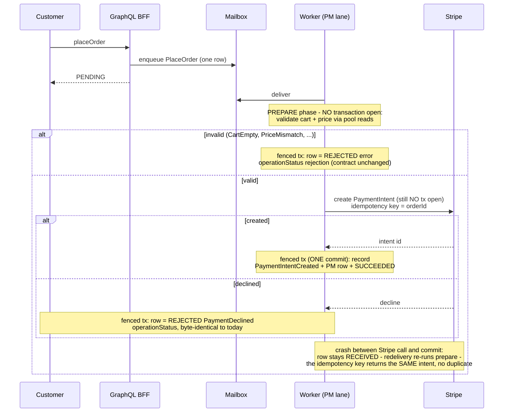
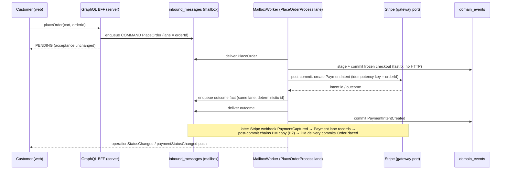
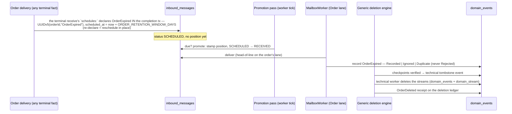

# PROP-20260731-195500 — Runtime D: PM mailboxes, typed reminders, and the deletion DSL

- **Status**: Approved (product-owner, 2026-07-31; decisions recorded in
  [ADR-20260731-203000](../adr/ADR-20260731-203000-runtime-d-choices-a2-b2-c2.md) and
  [ADR-20260731-214500](../adr/ADR-20260731-214500-deletion-dsl-declarative-generic-engine.md))
- **Date**: 2026-07-31 (living document — this is the CURRENT state of the design; prior states
  are in this file's git history, per ADR-20260801-020000)
- **Tracking issue**: [#272 "Runtime D: PM mailboxes (placeOrder/refund flip), reminders machinery, activations — continuation of #242"](https://github.com/TheCaptainCompany/captain-food/issues/272)
- **Realized by**: [PR #273 "Runtime D — PM mailboxes (two-phase payment delivery), typed reminders, activations"](https://github.com/TheCaptainCompany/captain-food/pull/273)
  (branch `272-runtime-d-pm-mailboxes-reminders`)

**Context**: [PROP-20260728-152752](PROP-20260728-152752-actor-mailbox-write-path.md) §3.4 ·
[ADR-20260731-120825](../adr/ADR-20260731-120825-actor-messages-typed-inside-the-actor.md) ·
[ADR-20260731-150500](../adr/ADR-20260731-150500-reminders-reschedule-in-place.md) ·
[ADR-20260731-153000](../adr/ADR-20260731-153000-gdpr-expiry-as-scheduled-actor-message.md) ·
[ADR-20260731-160000](../adr/ADR-20260731-160000-order-erasure-tombstone-then-stream-deletion.md) ·
[ADR-20260731-122500](../adr/ADR-20260731-122500-the-mailbox-is-the-only-door.md) ·
the [#270 review](https://github.com/TheCaptainCompany/captain-food/pull/270#issuecomment-5144774638)

## Why

Runtime C made the mailbox the door for every aggregate command and every inbound webhook fact.
Three mutations remain outside it — `placeOrder`, `approveRefund`, `denyRefund` — because their
owners are process managers, and their flip crosses the one boundary the mailbox has not crossed
yet: **an external HTTP call (Stripe) in the delivery path**. Reminders (`scheduled_at` rows) and
GDPR deletion are approved machinery that needed a runtime and a spec surface. This proposal
carries all of it.

## Use cases

- **UC1 — Checkout (the ETA-bearing flow)**: customer submits `placeOrder`; the mutation answers
  PENDING immediately (unchanged acceptance contract); the PlaceOrderProcess validates, prices,
  creates the Stripe PaymentIntent and freezes the checkout (`PaymentIntentCreated`); the
  `PaymentCaptured` webhook fact materializes the Order (`OrderPlaced`). Peak: Friday/Saturday
  19:00–21:30 — nothing in the flip may hold DB transactions across Stripe latency at peak.
- **UC2 — Refund decision**: restaurant/admin approves or denies a pending refund; approval
  drives the Stripe refund; the `PaymentRefunded` fact closes the saga idempotently.
- **UC3 — GDPR order deletion (the deletion pilot)**: an Order reaching a terminal state starts
  its retention clock; when due, the recorded `OrderExpired` fact drives the generic engine's
  journey (checkpoint-verified → tombstone → stream deletion → `OrderDeleted` receipt on the
  ledger). The engine ships GATED (`RUN_DELETION_ENGINE` default false); what remains for
  [#194 "GDPR erasure"](https://github.com/TheCaptainCompany/captain-food/issues/194): the
  per-projection tombstone folds of `OrderExpired` (parked under `nonProjectedEvents` until
  then) and the gate's default flip (its own one-line ADR after staging smoke).
- **UC4 — The leaving restaurant (second pilot, rides when prioritized)**: the owner requests
  deletion (refusable command), gets a cooling window with an undo, and the restaurant's
  dependent aggregates die through the propagation tree.

## The DSL (decided shape — ADR-20260731-214500)

Three per-actor sections; all references are typed `$ref`s — bare string paths are barred and
MIGRATED (branch `f25b964`): actor `identity` is `{ $ref: '#/<Actor>/state/<field>' }` (the ref
implicitly declares the stream key, so no explicit `state:` entry is needed for it, and the
validator proves every received command's payload carries the field), `requires.acting` values
are the same state-field `$ref`s (`any` stays a keyword), and a declared reminder identity is a
validator error (derived):

- **`reminders:`** — typed self-messages: `payload` (a `$ref` into events.yaml — FACT vocabulary);
  the identity is DERIVED, never declared (`UUIDv5(actorId, reminderName)`, one pending
  occurrence — declaring it is a validator error, `reminder-identity-declared`); reschedule
  in-place (re-declaring postpones the SAME row; `SCHEDULED → CANCELLED` stays the explicit
  withdrawal).
- **`schedules:`** on a `receives` entry — the declaration that handling this message schedules a
  reminder, alongside `emits`/`throws`: the handler's third observable effect, asserted by the
  generated behaviour tests (schedule, reschedule, cancel).
- **`deletion:`** — the GDPR surface: `triggers` (each `on:` event `$ref`s + optional `after:`
  window as a `$ref` into configuration.yaml + optional `cancelled_on:` undo facts + typed
  `match:` for propagation) and `receipt:` (the business fact recorded on the deletion ledger —
  pseudonymous references only). Propagation is **child-declared**: a sub-actor lists the
  parent's receipt fact in its own `triggers.on`; the dependency tree emerges from the
  declarations and the validator proves it acyclic. Read models need no declaration — each
  projection folds the deletion fact and removes its own rows.

```yaml
Restaurant:
  receives:
    - message: { $ref: 'commands.yaml#/RequestRestaurantDeletion' }     # refusable — the owner can be told no
      emits:  [{ $ref: 'events.yaml#/RestaurantDeletionRequested' }]
      throws: [{ $ref: 'errors.yaml#/RestaurantHasOpenOrders' }]        # later: UnsettledInvoices (concept TBD)
    - message: { $ref: 'commands.yaml#/CancelRestaurantDeletion' }      # the undo, during the cooling window
      emits:  [{ $ref: 'events.yaml#/RestaurantDeletionCancelled' }]
      throws: [{ $ref: 'errors.yaml#/NoPendingDeletion' }]
  deletion:
    triggers:
      - on: [{ $ref: 'events.yaml#/RestaurantDeletionRequested' }]
        after: { $ref: 'configuration.yaml#/RESTAURANT_DELETION_COOLING_PERIOD' }
        cancelled_on: [{ $ref: 'events.yaml#/RestaurantDeletionCancelled' }]
    receipt: { $ref: 'events.yaml#/RestaurantDeleted' }

Catalog:
  deletion:
    triggers:
      - on: [{ $ref: 'events.yaml#/RestaurantDeleted' }]        # the tree edge: dies with its restaurant
        match:
          event: { $ref: 'events.yaml#/RestaurantDeleted/properties/restaurantId' }
          state: { $ref: '#/Catalog/state/restaurantId' }
    receipt: { $ref: 'events.yaml#/CatalogDeleted' }

Order:                       # the IMPLEMENTED pilot (#272 D2, ADR-20260801-010134): the window
  reminders:                 # rides the REMINDER because the elapsed retention must be a
    OrderExpired:            # RECORDED, foldable business fact (ADR-20260731-160000 §2) — the
      payload: { $ref: 'events.yaml#/OrderExpired' }        # deletion trigger reacts to the fact
      after: { $ref: 'configuration.yaml#/keys/ORDER_RETENTION_WINDOW_DAYS' }
      reschedule: in-place
  receives:
    # the four terminal receives each declare, alongside emits/throws:
    #   schedules: [{ $ref: '#/Order/reminders/OrderExpired' }]
    - message: { $ref: '#/Order/reminders/OrderExpired' }
      emits: [{ $ref: 'events.yaml#/OrderExpired' }]        # record semantics — never Rejected
  deletion:
    triggers:
      - on: [{ $ref: 'events.yaml#/OrderExpired' }]
        match:               # typed self-match — the identity field, implicitly declared
          event: { $ref: 'events.yaml#/OrderExpired/properties/orderId' }
          state: { $ref: '#/Order/state/orderId' }
    receipt: { $ref: 'events.yaml#/OrderDeleted' }
```

The two trigger kinds split by whether an intermediate business fact exists
(ADR-20260801-010134): `after:` ON A DELETION TRIGGER is for pure-delay journeys whose cause is
already recorded (the Restaurant cooling window above); when the elapsed window must itself
become a foldable fact (Order's expiry — projections tombstone by folding it), the window rides
a declared REMINDER and the deletion trigger consumes the recorded fact.

**One generic deletion engine** (infrastructure, written once, parameterized by the generated
`DELETION_POLICIES` table) runs the decided journey for every declaring actor: verify projection
checkpoints past the fact → honor the window → append the technical tombstone event → the
technical worker deletes the stream from `domain_events` + `domain_stream` → record the receipt.
No per-aggregate erasure PMs; a bespoke PM stays the escape hatch for aggregates needing custom
steps (e.g. a bookkeeping export before stream deletion).

## Decision D-A — where the Stripe call lives in a mailbox delivery (DECIDED: A2, realized as R2 prepare-outside-tx — ADR-20260801-023000)

The STRATEGY: no HTTP inside any transaction, retry-safety via the Stripe idempotency key
(= `orderId`), every step supervisable. The REALIZATION (product-owner, 2026-08-01,
[ADR-20260801-023000](../adr/ADR-20260801-023000-a2-realizes-as-prepare-phase-single-delivery.md)):
**R2 — ONE delivery with a PREPARE phase**: validate/price and call Stripe BEFORE the fenced
transaction opens, then commit `PaymentIntentCreated` + PM row + verdict atomically. A sync
decline commits as the same `REJECTED PaymentDeclined` operation rejection as today — the client
contract stays byte-identical. R1 (literal two deliveries) was rejected because the decline could
then only surface on `paymentStatus`, a contract change.

### The two realizations, as sequences

**R1 — literal A2 (two deliveries) — REJECTED** (the decline can no longer reject the operation):

```mermaid
sequenceDiagram
    participant C as Customer
    participant G as GraphQL BFF
    participant M as Mailbox
    participant W as Worker (PM lane)
    participant S as Stripe
    C->>G: placeOrder
    G->>M: enqueue PlaceOrder (row 1)
    G-->>C: PENDING
    W->>M: deliver row 1
    Note over W: fenced tx 1 - validate cart, price,<br/>freeze checkout - COMMIT fast<br/>row 1 = SUCCEEDED (already terminal)
    W->>S: AFTER commit (spawned leg): create PaymentIntent<br/>idempotency key = orderId
    alt intent created
        S-->>W: intent id
        W->>M: enqueue outcome fact (row 2, same lane)
        W->>M: deliver row 2
        Note over W: fenced tx 2 - record PaymentIntentCreated,<br/>open PM row - COMMIT
    else DECLINED synchronously
        S-->>W: decline
        Note over W,C: row 1 already SUCCEEDED - operationStatus can<br/>never say REJECTED; the decline surfaces only on<br/>paymentStatus = CONTRACT CHANGE vs today
    end
```

**R2 — prepare-outside-tx, single delivery — CHOSEN ✓** (contract byte-identical):



| | Option | Pros | Cons |
|---|---|---|---|
| A1 | Call Stripe inside the fenced transaction | Simplest; one atomic outcome | External HTTP inside a Postgres tx: connection held for Stripe's latency exactly at peak; a timeout aborts the delivery and the retry re-calls Stripe; pool exhaustion amplifies under load |
| **A2 ✓** | **Two-phase delivery**: delivery 1 validates/prices and commits the frozen checkout fast; a post-commit step calls Stripe (idempotency key = `orderId`) and enqueues the outcome as a fact on the same lane; delivery 2 records `PaymentIntentCreated` | No HTTP inside any tx (peak-safe); retry-safe by construction (idempotency key + mailbox pk dedupe); every step a supervisable mailbox row; matches the webhook ACL pattern | One extra mailbox hop per checkout; the frozen checkout lives in the PM state store between deliveries |
| A3 | Keep the spawned task for the gateway leg | Smallest diff | A non-mailbox execution leg survives (against ADR-20260731-122500); unfenced, invisible to supervision — the #270 review's orphaned-work class returns |

## Decision D-B — who receives the Stripe facts (DECIDED: B2, realized in-tx — ADR-20260801-053000)

| | Option | Pros | Cons |
|---|---|---|---|
| B1 | Keep as-is (Payment lane records; saga runner reacts off the log) | Zero routing change | The PM reaction stays unfenced and invisible; two delivery mechanisms forever |
| **B2 ✓** | **Chain**: Payment lane records (unchanged); a PM-addressed copy is enqueued on the order's lane, cause-chained; the saga runner's Stripe-fact triggers retire | Both consumers durable, fenced, ordered per order; stream ownership untouched; causality visible | One extra row per payment fact; a (nudged, ~immediate) chain hop before order materialization |
| B3 | Facts go only to the PM lane; the PM writes the Payment stream | One row | Moves Payment record semantics into the PM; cross-stream appends re-create the foreign-writer conflicts the #270 review closed |

**Realization** ([ADR-20260801-053000](../adr/ADR-20260801-053000-b2-chain-rides-the-completion-transaction.md),
two refinements over the sketch): the chain hop rides the **recording transaction itself**, not a
post-commit hook — a post-commit enqueue leaves a crash window in which the payment fact is
durable but its saga hop is lost (the recorded-payment-nobody-acts-on failure); only the wake-up
nudge stays post-commit. And the chain identity is
`UUIDv5(orderId, "{factType}:{causing mailbox row id}")` — stable under webhook redelivery (the
causing row's id is itself deterministic), while two DISTINCT same-type facts on one order (a
second attempt's `PaymentFailed`, a second partial refund's settlement) each keep their own hop,
where the sketched `UUIDv5(orderId, factType)` would silently swallow the second. The runner's
retirement is scoped to D-B: PlaceOrderProcess leaves it whole; RefundProcess keeps its
refund-OPENING order-fact legs until their own runtime item; full retirement at the default flip.

## Sequence — UC1 under A2 + B2



## Sequence — UC3 (deletion pilot)



## Supervision surface (mockup — extends the existing `/system/mailbox` page)

```
┌─ /system/mailbox ────────────────────────────────────────────────────────┐
│ Actor type          Lane  Owner      Pending  Scheduled  Oldest pending  │
│ Order                 17  w-812-a3f2       0         41   —              │
│ PlaceOrderProcess     04  w-812-a3f2       2          0   19:41:03       │
│ Payment               29  w-812-a3f2       0          0   —              │
│  ▸ Scheduled on Order-…c421:  deletion  due 2036-07-31  (reschedulable)  │
└──────────────────────────────────────────────────────────────────────────┘
```

No new screens: the lanes page already shows `scheduled` counts; the per-lane scheduled-row
drill-down is declared as a `gaps` entry until its query exists.

## Drawbacks

- The two-phase A2 checkout adds a mailbox hop and a PM-state hand-off to the hottest flow —
  more moving parts to observe and tune at peak than the single spawned task it replaces.
- The declarative `deletion:` engine trades per-aggregate flexibility for uniformity; bespoke
  erasure needs (bookkeeping export) must consciously opt out via a hand-written PM.
- The DSL grows three sections and seven validator rules — spec surface the team must learn.

## Realization state (D3 — landed on PR #273; the D-slice work orders are complete)

The #270 review's deferred runtime findings and PROP-20260728-152752 §3.5's activations are on
the branch, each gate-then-stabilize:

- **Fair-share lane rebalancing** (was: `steal_lane` test-only — a first instance claimed every
  lane and renewed forever, a second idled). When a worker's pass claims nothing, it takes a
  live-ownership census and, while below `floor(total/instances)` with a live peer above it,
  steals ONE lane from the largest owner — fresh census per steal, bounded per pass. Stop-at-
  the-floor makes the loop converge to a ±1 spread without ping-pong; the victim's stale belief
  fences exactly like an expiry takeover. Proven by the cluster fixture
  (`crates/actor_runtime/tests/rebalance.rs` — ADR-20260730-234918 ports 1–3: convergence while
  the victim is ALIVE, then a hard-crash expiry takeover, with exactly-once + per-actor order +
  per-identity completeness accounting throughout, and the port-5 probe self-test).
- **Activations, gated `ACTOR_ACTIVATIONS` default false** (§3.5): deliveries fold the
  delivered actor's own stream (`{actor_type}-{actor_id}`) through a shared held-state cache —
  fill on load, promotion strictly POST-COMMIT (apply-after-commit), invalidation on a lost
  `UNIQUE(stream_name, version)` race (the never-wrong signal), lane loss drops the partition's
  holdings (the worker's `LaneEvents` seam), idle expiry + LRU byte bound from configuration
  (`ACTOR_ACTIVATION_IDLE_SECONDS` / `ACTOR_ACTIVATION_MAX_MEMORY_MB`), per-actor
  `mailbox.activations` overrides in actors.yaml (validated, emitted as `ACTOR_ACTIVATIONS`).
  Cross-lane writers (a PM leg appending `OrderPlaced`) invalidate held copies on commit.
  Surrogate-keyed lanes (`Payment-<intentId>`) never match the scoped name and stay uncached.
  Correctness never depends on the cache; OFF is byte-identical to pre-D3. The micro-mailbox and
  batched turns stay deferred per §3.5's own sequencing (the partition lane is single-threaded —
  they become load-bearing only with intra-partition concurrency, a later throughput knob).
- **Standalone adapter workers, gated `RUN_MAILBOX_WORKERS` default false** (was: adapters ACK
  200 while facts pile up RECEIVED with the monolith down). Each adapter binary can run the
  monolith-identical fleet for exactly the lanes its ingestor feeds (stripe: Payment + the two
  PM lanes its B2-chained copies land on; delivery partners: DeliveryJob; hubrise:
  RestaurantAccount/Restaurant/Catalog). OFF by default because the status/event buses are
  in-process — a fact delivered by the adapter process never reaches the monolith's push
  subscribers (polls unaffected); cross-process fan-out (Postgres LISTEN/NOTIFY) is the recorded
  follow-up that would dissolve the trade-off.
- **Birth id-minting unified at the doors**: a DECLARED identity property that is missing or
  unparsable now fails the GraphQL mutation at the door (the worker-channel enqueue helper's
  existing rule) instead of silently minting a random lane id that breaks per-aggregate
  serialization; only actors declaring NO identity property mint an addressing-only lane id.

## Realization state (D1 — landed on PR #273, GATED)

The flip is IMPLEMENTED behind **`PM_MAILBOX_DELIVERY`** (configuration.yaml, default false —
gate-then-stabilize; the default flip is its own one-line ADR after staging smoke). One gate
controls all three moving parts so the two worlds never interleave:

- **Resolvers**: the generated PM resolvers (placeOrder/approveRefund/denyRefund) carry BOTH
  arms and pick per request — mailbox delivery through the PREPARE phase
  (ADR-20260801-023000: the UNCHANGED application handler runs against staging stores with no
  transaction open, Stripe idempotency keys `intent:{orderId}` / `refund:{intent}:{amount}`;
  ONE fenced commit flushes events + PM row + verdict), or the legacy journal+spawn.
- **Chaining**: the Payment lane chains the Stripe facts to the PM lanes in the recording
  transaction (Decision D-B realization above).
- **Runner**: the saga runner drops exactly the Stripe-fact triggers.

`command_journal` retirement is sequenced reads-first as planned: `operationStatus` has read
mailbox-then-journal since Runtime C, the gated-off legacy arm still writes the journal, and the
DROP (with the journal sweep's retirement) rides the default-flip deploy.
`command_completion_ms` is emitted on BOTH arms (the mailbox delivery's post-commit observer —
which also lit it back up for every Runtime-C-flipped command).

Three hardening points from the independent multi-lens review of the branch (payments lens):

- **Deterministic gateway refusals are terminal.** The Stripe adapter classifies
  `invalid_request_error`/`idempotency_error` 4xx as a terminal FAILED on both arms (a
  `Repository`-classed outcome would retry a mailbox head row forever — one bogus
  `paymentMethodId` per partition could wedge every checkout lane). Transient classes (5xx,
  rate-limit, transport) stay retry-in-place on the mailbox arm.
- **The flip cannot lose in-flight saga hops.** At every startup with the gate ON, a backfill
  pass enqueues PM-addressed copies of all Stripe facts past the saga runner's group checkpoints
  (deterministic ids `UUIDv5(lane, "{factType}:{event id}")`, idempotent under restart and under
  record-time double-coverage — the legs absorb duplicates). A `PaymentCaptured` the runner
  accepted but never reacted to is therefore delivered after the flip, and gate ROLLBACK stays
  sound for the mirror reason.
- **Cross-arm duplicate identity.** Each gated resolver arm consults the OTHER acceptance store
  by `messageId` first and replays its terminal status as `duplicate: true` (payload-hash
  mismatch = the same synchronous Conflict as same-store dedupe) — a client retry across a gate
  transition can never re-execute a committed command in either direction.

The backfill is SEQUENCED before the saga runner's first tick (inside the runner's own task) —
that tick could otherwise advance `pm:RefundProcess` past an un-reacted `PaymentRefunded` before
the backfill read the checkpoint (re-verification residual). Two accepted noise items ride until
the DEFAULT-FLIP deploy and belong in its one-line ADR's checklist: the backfill's id namespace
(`{factType}:{event id}`) differs from record-time chaining's (`{factType}:{recording row id}`),
so post-flip facts still past the frozen checkpoints get one extra idempotent hop per restart
(absorbed IGNORED, same lane, ordering holds); and the frozen `pm:PlaceOrderProcess` checkpoint
makes the startup scan grow with post-flip history — the default-flip deploy retires the runner
groups and advances/drops those checkpoints, ending both.

## Unresolved questions

- ~~A2's realization shape~~ — RESOLVED 2026-08-01 as R2
  ([ADR-20260801-023000](../adr/ADR-20260801-023000-a2-realizes-as-prepare-phase-single-delivery.md),
  see Decision D-A) and IMPLEMENTED (see Realization state).

- Retention windows per data category (legal/product input; configuration layer) — including
  whether the financial skeleton is exported before phase 2 or survives via a longer window.
- Occurrence-scoped reminder identity for REPEATING reminders (ADR-20260731-150500 §2 leaves it
  open until a real use case).
- Customer-account-level deletion (identity, files, Supabase side) — decision C's remaining
  scope; the mechanism here may generalize, not assumed.
- The `UnsettledInvoices` rejection awaits the invoicing concept (noted, no development).

## Appendix — the `PlaceOrderProcess` / `RefundProcess` entries (LANDED in actors.yaml, PR #273)

Landed together with the D-A wiring and the gated resolvers, as required (the generated
addressing flips the three mutations the moment these exist — the gate makes that flip a
request-time choice instead of an outright cutover).

```yaml
PlaceOrderProcess:
  type: process-manager
  identity: { $ref: '#/PlaceOrderProcess/state/orderId' }
  mailbox:
    partitions: 100          # keyspace WIDTH (workers lease ranges of it) -- PROP-20260728-152752 s2
  description: >
    The checkout saga (ADR-0004, acceptance-first ADR-20260720-015500): PlaceOrder validates the
    cart against the live catalog, prices server-side, creates the Stripe PaymentIntent and
    freezes the checkout as PaymentIntentCreated -- the ORDER IS NOT PLACED YET. The order
    materializes only when Stripe reports the capture: the PaymentCaptured reaction
    re-materializes the frozen checkout from PaymentIntentCreated's log (no external store) and
    emits OrderPlaced idempotently. A PaymentFailed reaction records the outcome on the process
    state; the customer retries by resubmitting checkout.
  receives:
    - message: { $ref: 'commands.yaml#/PlaceOrder' }
      emits:
        - { $ref: 'events.yaml#/PaymentIntentCreated' }
      throws:
        - { $ref: 'errors.yaml#/CartNotFound' }
        - { $ref: 'errors.yaml#/CartNotOpen' }
        - { $ref: 'errors.yaml#/CartEmpty' }
        - { $ref: 'errors.yaml#/RestaurantNotFound' }
        - { $ref: 'errors.yaml#/RestaurantPaused' }
        - { $ref: 'errors.yaml#/CannotOrderTestRestaurant' }
        - { $ref: 'errors.yaml#/DeliveryAddressRequired' }
        - { $ref: 'errors.yaml#/OutsideDeliveryArea' }
        - { $ref: 'errors.yaml#/PriceMismatch' }
        - { $ref: 'errors.yaml#/PriceUnresolvable' }
        - { $ref: 'errors.yaml#/PaymentDeclined' }
    - message: { $ref: 'events.yaml#/PaymentCaptured' }
      emits:
        - { $ref: 'events.yaml#/OrderPlaced' }
      effect: "Inbound Stripe fact: re-materialize the frozen checkout and place the order, idempotently (a redelivered capture is a no-op)."
    - message: { $ref: 'events.yaml#/PaymentFailed' }
      emits: []
      effect: "Inbound Stripe fact: the failure lands on the process state; the customer's resubmit is the retry."

RefundProcess:
  type: process-manager
  identity: { $ref: '#/RefundProcess/state/orderId' }
  mailbox:
    partitions: 100          # keyspace WIDTH (workers lease ranges of it) -- PROP-20260728-152752 s2
  description: >
    The refund saga: records the staff decision on an OPEN refund (RefundOpened is emitted by the
    order-lifecycle commands -- RejectOrder, CancelOrder -- not by this saga's receives), drives
    the Stripe refund on approval, and closes idempotently when Stripe reports the PaymentRefunded
    fact. Approval and denial are restaurant/admin decisions on a pending refund; anything else is
    RefundNotPending.
  receives:
    - message: { $ref: 'commands.yaml#/ApproveRefund' }
      emits: [{ $ref: 'events.yaml#/RefundApproved' }]
      throws:
        - { $ref: 'errors.yaml#/RefundNotPending' }
    - message: { $ref: 'commands.yaml#/DenyRefund' }
      emits: [{ $ref: 'events.yaml#/RefundDenied' }]
      throws:
        - { $ref: 'errors.yaml#/RefundNotPending' }
    - message: { $ref: 'events.yaml#/PaymentRefunded' }
      emits: []
      effect: "Inbound Stripe fact: close the refund saga idempotently."
```
