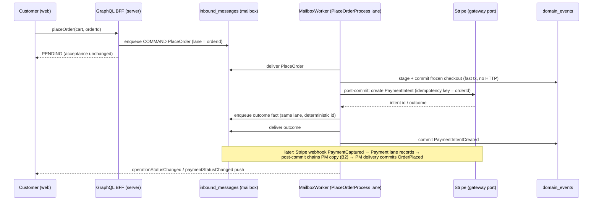
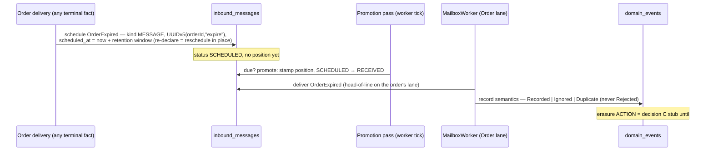

# PROP-20260731-195500 — Runtime D: PM mailboxes, typed reminders, and the last non-mailbox door

**Status**: APPROVED (product-owner, in-session 2026-07-31) — choices **D-A = A2** (two-phase
payment delivery), **D-B = B2** (chained PM facts), **D-C = C2** (event-lineage reminder
triggers); recorded in [ADR-20260731-203000](../adr/ADR-20260731-203000-runtime-d-choices-a2-b2-c2.md).
**REFINED post-approval** (same day, product owner) by
[ADR-20260731-214500](../adr/ADR-20260731-214500-deletion-dsl-declarative-generic-engine.md) —
see the "Post-approval refinements" section at the end; where they differ, the refinements govern.
**Tracking issue**: [#272 "Runtime D: PM mailboxes (placeOrder/refund flip), reminders machinery, activations — continuation of #242"](https://github.com/TheCaptainCompany/captain-food/issues/272)
**Realizing PR**: [#273 "Runtime D — PM mailboxes (two-phase payment delivery), typed reminders, activations"](https://github.com/TheCaptainCompany/captain-food/pull/273) (branch `272-runtime-d-pm-mailboxes-reminders`)
**Context**: [PROP-20260728-152752](PROP-20260728-152752-actor-mailbox-write-path.md) §3.4 ·
[ADR-20260731-120825](../adr/ADR-20260731-120825-actor-messages-typed-inside-the-actor.md) (messages typed inside the actor) ·
[ADR-20260731-150500](../adr/ADR-20260731-150500-reminders-reschedule-in-place.md) (reschedule in place) ·
[ADR-20260731-153000](../adr/ADR-20260731-153000-gdpr-expiry-as-scheduled-actor-message.md) (the `OrderExpired` pilot, amended: a FACT, never a command) ·
[ADR-20260731-122500](../adr/ADR-20260731-122500-the-mailbox-is-the-only-door.md) (the only door) ·
the [#270 review](https://github.com/TheCaptainCompany/captain-food/pull/270#issuecomment-5144774638) and
[fix summary](https://github.com/TheCaptainCompany/captain-food/pull/270#issuecomment-5145108766)

## Why this proposal

Runtime C made the mailbox the door for every aggregate command and every inbound webhook fact.
Three mutations remain outside it — `placeOrder`, `approveRefund`, `denyRefund` — because their
owners are process managers, and their flip crosses the one boundary the mailbox has not crossed
yet: **an external HTTP call (Stripe) in the delivery path**. Reminders (`scheduled_at` rows) are
approved machinery with no runtime. Both land here. Two design points genuinely need a
product-owner choice; everything else is already decided by the ADRs above and simply executes.

## Use cases

- **UC1 — Checkout (the ETA-bearing flow)**: customer submits `placeOrder`; the mutation answers
  PENDING immediately (unchanged acceptance contract); the PlaceOrderProcess validates, prices,
  creates the Stripe PaymentIntent, freezes the checkout (`PaymentIntentCreated`); the
  `PaymentCaptured` webhook fact materializes the Order (`OrderPlaced`). Peak: Friday/Saturday
  19:00–21:30 — nothing in the flip may hold DB transactions across Stripe latency at peak.
- **UC2 — Refund decision**: restaurant/admin approves or denies a pending refund; approval
  drives the Stripe refund; the `PaymentRefunded` fact closes the saga idempotently.
- **UC3 — GDPR order expiry (reminders pilot)**: an Order reaching a terminal state schedules the
  FACT `OrderExpired` for itself at `terminal time + retention window`; the promotion pass
  delivers it when due; recording is a STUB until decision C's erasure action
  ([#194 "GDPR erasure"](https://github.com/TheCaptainCompany/captain-food/issues/194)) lands.

## Spec deltas (already validated shapes)

1. **`PlaceOrderProcess` / `RefundProcess` actors.yaml entries** — the gate-green draft is parked
   in [this #270 comment](https://github.com/TheCaptainCompany/captain-food/pull/270#issuecomment-5146597037)
   (real catalogued errors; `PlaceOrder` emits only `PaymentIntentCreated`, `OrderPlaced` comes
   from the `PaymentCaptured` reaction). Landing it flips the three mutations via the generated
   addressing — so it lands only WITH the D-A wiring below, never alone.
2. **Typed reminders inside the actor** (ADR-20260731-120825, shape per the pilot):

   > ⚠️ **SUPERSEDED — kept verbatim as the approval-time record.** The governing shape renamed
   > `messages:` → `reminders:`, moved the trigger onto the firing receive as `schedules:`, and
   > folded the expiry pilot into the `deletion:` block — see
   > [Post-approval refinements](#post-approval-refinements-2026-07-31-product-owner--adr-20260731-214500)
   > and [ADR-20260731-214500](../adr/ADR-20260731-214500-deletion-dsl-declarative-generic-engine.md).

```yaml
Order:
  messages:                        # per-actor typed self-messages — no messages.yaml catalog
    OrderExpired:
      payload: { $ref: 'events.yaml#/OrderExpired' }   # FACT vocabulary (ADR-153000 §1a)
      schedule:
        when: <see decision D-C>                        # the declared trigger
        identity: 'UUIDv5(orderId, "expire")'           # one pending expiry per order
        reschedule: in-place                            # ADR-20260731-150500
  receives:
    - message: { $ref: '#/Order/messages/OrderExpired' }
      emits: [{ $ref: 'events.yaml#/OrderExpired' }]
      effect: "Record semantics: Recorded, or Ignored/Duplicate when already expired — never Rejected."
```

   Plus the validator rules `message-without-receive` / `receive-without-message` (strong typing =
   handler-proof, the product-owner requirement the ADR quotes) and the codegen for per-actor
   message payload structs.

## Decision D-A — where does the Stripe call live in a mailbox delivery?

The fenced completion transaction commits handler effects + row flip + checkpoint atomically. The
legacy spawn leg creates the PaymentIntent OUTSIDE any DB transaction. Options:

| | Option | Pros | Cons |
|---|---|---|---|
| A1 | **Call Stripe inside the fenced transaction** | Simplest; one delivery = one atomic outcome; no new states | External HTTP inside a Postgres tx: connection held for Stripe's latency (hundreds of ms, worse at peak — exactly UC1's danger window); a Stripe timeout aborts the delivery, the retry re-calls Stripe → duplicate-intent risk rests entirely on idempotency keys; pool exhaustion amplifies under load |
| A2 | **Two-phase delivery**: delivery 1 validates/prices/stages `PaymentIntentRequested`-style state and commits fast; a post-commit step calls Stripe with idempotency key = `orderId` and enqueues the outcome as an inbound-style fact on the same lane; delivery 2 records `PaymentIntentCreated` | No HTTP inside any tx; retry-safe by construction (the Stripe idempotency key makes the call replayable; the mailbox pk dedupes the outcome fact); every step durable and visible on the supervision lanes; matches the ACL pattern the webhook side already uses | More moving parts (one extra mailbox hop per checkout); the frozen-checkout state needs a home between the two deliveries (the PM state store already exists for exactly this) |
| A3 | **Hybrid — keep the spawn for the gateway leg only**: the mailbox delivery does validation + staging, then spawns the Stripe call exactly as today; the spawn enqueues the completion | Smallest diff from today's proven code | Keeps a non-mailbox execution leg alive (the door stays ajar — against ADR-20260731-122500's direction); the spawned task is invisible to the supervision lanes and unfenced (the #270 review's C1/C3 class of orphaned work returns) |

**Recommendation: A2.** It is the only option that is simultaneously peak-safe (no HTTP in tx),
retry-safe (idempotency key + pk dedupe), and fully inside the door (every step is a mailbox row
the supervision page can show). A1 is acceptable only if measured Stripe P99 stays well under the
pool's comfort at peak — which we cannot promise on a Friday night.

## Decision D-B — who receives the Stripe facts: the Payment lane, the PM lane, or both?

Today `PaymentCaptured`/`PaymentFailed`/`PaymentRefunded` route to the **Payment** aggregate's
lane (recording), and the saga runner reacts off the event log. The PM spec declares reactions.
Options:

| | Option | Pros | Cons |
|---|---|---|---|
| B1 | **Keep as-is** (fact → Payment lane records; saga runner keeps reacting) | Zero routing change; proven | The PM reaction stays outside the mailbox (unfenced, invisible); two delivery mechanisms forever |
| B2 | **Chain**: fact → Payment lane records (unchanged); the delivery's post-commit hook enqueues a PM-addressed copy on the PM's order lane (cause-chained, deterministic id `UUIDv5(orderId, factType)`) | Both consumers durable, fenced, ordered per order; the Payment record stays authoritative; the saga runner retires; causality visible (`cause_id` chain) | One extra row per payment fact; the chain hop adds (nudged, ~immediate) latency to order materialization |
| B3 | **Re-address**: fact goes ONLY to the PM lane; the PM records into the Payment stream itself | One row, one delivery | The Payment aggregate's record semantics move into the PM (blurs aggregate ownership); cross-stream append from a PM delivery re-introduces exactly the foreign-writer version conflicts the #270 review's C4 closed |

**Recommendation: B2.** It retires the last unfenced reaction path without moving stream
ownership, and the extra row is the price of visibility — the same trade every other flow already
pays.

## Decision D-C — how formal is the reminder trigger (`schedule.when`)?

> ⚠️ **SUPERSEDED — kept verbatim as the approval-time record.** C2 was approved, then refined:
> the trigger list became `schedules:` declared on the firing receive (same information, at the
> handler, testable per receive) — see
> [Post-approval refinements](#post-approval-refinements-2026-07-31-product-owner--adr-20260731-214500)
> and [ADR-20260731-214500](../adr/ADR-20260731-214500-deletion-dsl-declarative-generic-engine.md).

| | Option | Pros | Cons |
|---|---|---|---|
| C1 | **Prose** (`when: "Order reaches a terminal state"`) | Zero DSL work | Not machine-checkable; drifts like all prose |
| C2 | **Event-lineage refs** (`on: [events.yaml#/OrderDelivered, events.yaml#/OrderCancelled, …]` — schedule declared when any listed event is recorded) | Machine-checkable (validator proves every `on` event exists and is emitted by this actor's lineage); the codegen can emit the scheduling call at exactly those append sites; reads like the views' `from` lineage the spec already uses | The terminal-state SET must be spelled out (but that is a feature: the spec names exactly which facts start the retention clock) |
| C3 | **State-predicate DSL** (`when: state.status in [DELIVERED, CANCELLED, …]`) | Closest to the domain meaning | A new expression language for one field; the `requires` DSL precedent shows even small predicate languages grow validators and edge cases |

**Recommendation: C2.** Same design language as the rest of the spec (lineage refs), cheap to
validate, and it gives the emitter concrete hook points.

## Sequence — UC1 under A2 + B2 (hexagonal-faithful)



## Sequence — UC3 (reminder pilot)



## Supervision surface (mockup — extends the existing `/system/mailbox` page)

```
┌─ /system/mailbox ────────────────────────────────────────────────────────┐
│ Actor type          Lane  Owner      Pending  Scheduled  Oldest pending  │
│ Order                 17  w-812-a3f2       0         41   —              │
│ PlaceOrderProcess     04  w-812-a3f2       2          0   19:41:03       │
│ Payment               29  w-812-a3f2       0          0   —              │
│  ▸ Scheduled on Order-…c421:  OrderExpired  due 2036-07-31  (reschedulable) │
└──────────────────────────────────────────────────────────────────────────┘
```

No new screens: the lanes page already shows `scheduled` counts (#270 added its index); the only
addition is the per-lane scheduled-row drill-down, declared as a `gaps` entry until its query
exists.

## Deliberately not decided here

The erasure ACTION (decision C, [#194](https://github.com/TheCaptainCompany/captain-food/issues/194)),
the retention windows per data category (legal/product input, referential layer), lane rebalancing
across instances, and the observability-contract rewrite's content (it MUST ship in the same
change as the flip — the #270 review showed `command_completion_ms` goes dark otherwise — but its
shape follows the existing contract format and needs no choice here).

## Post-approval refinements (2026-07-31, product owner — ADR-20260731-214500)

The design session continued after approval; these decisions REFINE the approved shape above
(the original text is kept as the historical record — this section governs where they differ):

1. **Naming**: the per-actor self-message section is **`reminders:`** (not `messages:`); the
   data-removal block is **`deletion:`** (product owner considered and declined both `erasure:`
   and `dies:` — "deletion" is the term a DPO/auditor greps for, and it matches the
   `*Deleted`/`*DeletionRequested` event vocabulary).
2. **C2 is superseded by `schedules:` on receives**: the reminder trigger is declared on the
   `receives` entry that fires it (`schedules: [{ $ref: '#/<Actor>/reminders/<Name>' }]`),
   alongside `emits`/`throws` — the handler's third observable effect, so generated behaviour
   tests assert scheduling and rescheduling per receive.
3. **`deletion:` block** replaces the D-C-era expiry sketch: `triggers` (each `on:` event
   `$ref`s + optional `after:` **`$ref` into configuration.yaml** — never a bare string —
   + optional `cancelled_on:` + typed `match:`), and `receipt:` (the business fact recorded on
   the deletion ledger — pseudonymous references only, per ADR-20260731-160000 §6).
4. **Propagation = the child declares how it dies**: a sub-actor lists the parent's `receipt`
   fact in its own `triggers.on` — the dependency tree EMERGES from declarations; the validator
   builds it and proves acyclicity. No parent-side cascade list; read models need no declaration
   (each projection folds the deletion fact and removes its rows).
5. **`match:` is strongly typed** — `$ref` to the triggering event's property AND `$ref` to the
   child actor's state property; the engine enumerates child instances through the child's
   projection. Bare string paths are barred, and the two legacy string dialects
   (`requires.acting: state.customerId`, `identity: orderId`) are scheduled for the same
   `$ref` normalization in D2.
6. **The undo**: `cancelled_on` facts cancel the pending scheduled deletion
   (`SCHEDULED → CANCELLED`, the explicit transition ADR-20260731-150500 kept separate from
   reschedule). Pilot: `CancelRestaurantDeletion` during the cooling window.
7. **One generic deletion engine** (refines ADR-20260731-160000 §4): the decided journey —
   projection-checkpoint verification → grace window → technical tombstone event → technical
   worker deletes the stream from `domain_events` + `domain_stream` → receipt — is implemented
   once, parameterized by the declarations; per-aggregate erasure PMs are not written (escape
   hatch: a bespoke PM remains possible).
8. **Second pilot — the leaving restaurant**: `RequestRestaurantDeletion` is a refusable COMMAND
   (throws e.g. `RestaurantHasOpenOrders`; a future `UnsettledInvoices` slots in when the
   invoicing concept exists — noted, no development yet) emitting the FACT
   `RestaurantDeletionRequested`; no `delete:` flag ever appears on a receive — deletion
   semantics live only in the `deletion:` block.

### Final DSL shape (governing)

```yaml
Restaurant:
  receives:
    - message: { $ref: 'commands.yaml#/RequestRestaurantDeletion' }
      emits:  [{ $ref: 'events.yaml#/RestaurantDeletionRequested' }]
      throws: [{ $ref: 'errors.yaml#/RestaurantHasOpenOrders' }]
    - message: { $ref: 'commands.yaml#/CancelRestaurantDeletion' }
      emits:  [{ $ref: 'events.yaml#/RestaurantDeletionCancelled' }]
      throws: [{ $ref: 'errors.yaml#/NoPendingDeletion' }]
  deletion:
    triggers:
      - on: [{ $ref: 'events.yaml#/RestaurantDeletionRequested' }]
        after: { $ref: 'configuration.yaml#/RESTAURANT_DELETION_COOLING_PERIOD' }
        cancelled_on: [{ $ref: 'events.yaml#/RestaurantDeletionCancelled' }]
    receipt: { $ref: 'events.yaml#/RestaurantDeleted' }

Catalog:
  deletion:
    triggers:
      - on: [{ $ref: 'events.yaml#/RestaurantDeleted' }]        # the tree edge: dies with its restaurant
        match:
          event: { $ref: 'events.yaml#/RestaurantDeleted/properties/restaurantId' }
          state: { $ref: '#/Catalog/state/restaurantId' }
    receipt: { $ref: 'events.yaml#/CatalogDeleted' }

Order:
  deletion:
    triggers:
      - on: [{ $ref: 'events.yaml#/OrderDelivered' }, { $ref: 'events.yaml#/OrderCancelled' }]
        after: { $ref: 'configuration.yaml#/ORDER_RETENTION_WINDOW' }
    receipt: { $ref: 'events.yaml#/OrderDeleted' }
```

## Appendix — the validated `PlaceOrderProcess` / `RefundProcess` entries (canonical copy)

Gate-green against `main` (0 validator errors); previously parked in a PR #270 comment — moved
here because the repo, not GitHub, is the record. Lands in actors.yaml only WITH the D1 wiring
(the generated addressing flips the three mutations the moment these exist).

```yaml
PlaceOrderProcess:
  type: process-manager
  identity: orderId
  mailbox:
    partitions: 100          # keyspace WIDTH (workers lease ranges of it) -- PROP-20260728-152752 s2
  description: >
    The checkout saga (ADR-0004, acceptance-first ADR-20260720-015500): PlaceOrder validates the
    cart against the live catalog, prices server-side, creates the Stripe PaymentIntent and
    freezes the checkout as PaymentIntentCreated -- the ORDER IS NOT PLACED YET. The order
    materializes only when Stripe reports the capture: the PaymentCaptured reaction
    re-materializes the frozen checkout from PaymentIntentCreated's log (no external store) and
    emits OrderPlaced idempotently. A PaymentFailed reaction records the outcome on the process
    state; the customer retries by resubmitting checkout.
  receives:
    - message: { $ref: 'commands.yaml#/PlaceOrder' }
      emits:
        - { $ref: 'events.yaml#/PaymentIntentCreated' }
      throws:
        - { $ref: 'errors.yaml#/CartNotFound' }
        - { $ref: 'errors.yaml#/CartNotOpen' }
        - { $ref: 'errors.yaml#/CartEmpty' }
        - { $ref: 'errors.yaml#/RestaurantNotFound' }
        - { $ref: 'errors.yaml#/RestaurantPaused' }
        - { $ref: 'errors.yaml#/CannotOrderTestRestaurant' }
        - { $ref: 'errors.yaml#/DeliveryAddressRequired' }
        - { $ref: 'errors.yaml#/OutsideDeliveryArea' }
        - { $ref: 'errors.yaml#/PriceMismatch' }
        - { $ref: 'errors.yaml#/PriceUnresolvable' }
        - { $ref: 'errors.yaml#/PaymentDeclined' }
    - message: { $ref: 'events.yaml#/PaymentCaptured' }
      emits:
        - { $ref: 'events.yaml#/OrderPlaced' }
      effect: "Inbound Stripe fact: re-materialize the frozen checkout and place the order, idempotently (a redelivered capture is a no-op)."
    - message: { $ref: 'events.yaml#/PaymentFailed' }
      emits: []
      effect: "Inbound Stripe fact: the failure lands on the process state; the customer's resubmit is the retry."

RefundProcess:
  type: process-manager
  identity: orderId
  mailbox:
    partitions: 100          # keyspace WIDTH (workers lease ranges of it) -- PROP-20260728-152752 s2
  description: >
    The refund saga: records the staff decision on an OPEN refund (RefundOpened is emitted by the
    order-lifecycle commands -- RejectOrder, CancelOrder -- not by this saga's receives), drives
    the Stripe refund on approval, and closes idempotently when Stripe reports the PaymentRefunded
    fact. Approval and denial are restaurant/admin decisions on a pending refund; anything else is
    RefundNotPending.
  receives:
    - message: { $ref: 'commands.yaml#/ApproveRefund' }
      emits: [{ $ref: 'events.yaml#/RefundApproved' }]
      throws:
        - { $ref: 'errors.yaml#/RefundNotPending' }
    - message: { $ref: 'commands.yaml#/DenyRefund' }
      emits: [{ $ref: 'events.yaml#/RefundDenied' }]
      throws:
        - { $ref: 'errors.yaml#/RefundNotPending' }
    - message: { $ref: 'events.yaml#/PaymentRefunded' }
      emits: []
      effect: "Inbound Stripe fact: close the refund saga idempotently."
```
