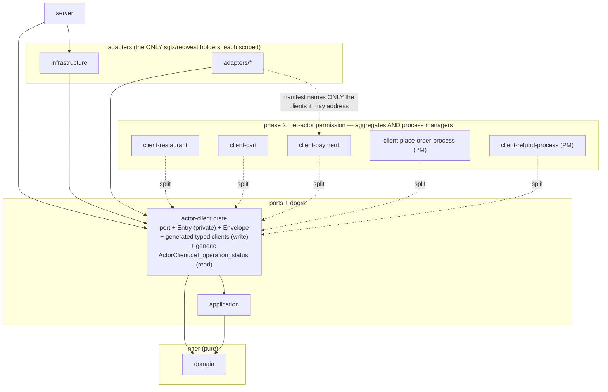
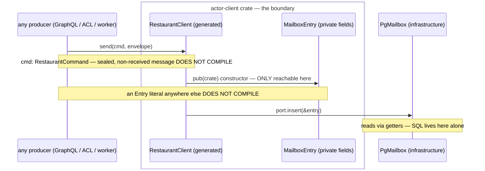

# PROP-20260802-130500 — Isolation by construction: strong boundaries as the defense against the easy path

- **Status**: Approved — D1–D6 all decided (product owner, 2026-08-02; D6 deferred to its own
  change, against the recommendation). Phases deliver under #290, each gated independently.
- **Date**: 2026-08-02
- **Tracking issue**: [#290 "Actor-client crate isolation (PROP-20260728-152752 D9): compiler-enforced door, then per-actor crates"](https://github.com/TheCaptainCompany/captain-food/issues/290)
- **Origin**: product-owner directive, 2026-08-02 — *"I want to have the more isolation as possible to
  strongly boundary everything and protect bad AI behavior that could use easy path instead of the
  right one."* Precedent: the product owner's C# DDD + actor-model practice — one assembly per actor
  client, one per actor implementation; the assembly is the boundary.
- **Realized by**: _(filled per phase)_

---

## TL;DR

Most of this codebase is written and modified by AI sessions. An AI under objective pressure takes
the **shortest path that makes its test pass** — and today several shortcuts compile fine: nine
crates hold `sqlx` (any of them can bypass every domain rule with one query), the mailbox door is
closed by a *textual* guard an alias evades, and review is the only thing standing between a
generated resolver and a hand-built row. This proposal makes the right path the ONLY path that
compiles: the crate becomes the permission, `Cargo.toml` becomes the capability allowlist, and the
enforcement hierarchy moves everything one level up — from prose to gate, from gate to compiler.

**The principle, stated once:** a rule an AI can violate silently is a review burden forever; a rule
that fails compilation is free forever. Buy compile-time enforcement wherever it is for sale.

---

## 1. The threat model, honestly

Not malice — *optimization*. An agent asked to "make the drain faster" or "fix this test" will, with
some probability, reach for whatever is in scope: a direct `INSERT INTO inbound_messages`, an ad-hoc
`SELECT` against a table an ADR says nobody reads, a `MailboxEntry { .. }` literal. Every such reach
that compiles is a latent incident plus a review obligation. This is not hypothetical in this repo —
all found by review or audit, none by the compiler:

- The generated GraphQL resolvers hand-built `MailboxEntry` inline for weeks — the layer *furthest*
  from the "only door" directive, shipped by codegen, caught only when a human asked
  ([#289](https://github.com/TheCaptainCompany/captain-food/pull/289)).
- `makefile_recipe_lines_are_ascii` — the guard CLAUDE.md celebrates — silently lost its `#[test]`
  attribute and ran never; rustc only warns ([#292](https://github.com/TheCaptainCompany/captain-food/pull/292)).
- The new door guard is textual: `use … as` aliasing walks straight past it (its own doc says so).
- The `#270` five-lens review found six criticals in fully-gated work.

**The enforcement hierarchy** this proposal climbs (each level catches what the one below misses,
and costs review nothing once installed):

| level | example here | an AI bypasses it by… |
|---|---|---|
| 1. prose rule | "the mailbox is the only door" (ADR) | never reading it |
| 2. review | the #289 catch | reviewer fatigue / not being run |
| 3. executable gate | the door guard, `make validate` | aliasing, a new crate, a lost `#[test]` |
| 4. **compiler** | sealed `receives` traits | **changing the boundary crate itself — visible in any diff** |
| 5. process/credential | CI-only `DATABASE_URL`, limited DB roles | not at all from inside the process |

Levels 4–5 are the only ones an agent cannot cross *silently*: the crossing itself is a loud,
reviewable act (a `Cargo.toml` edit, a boundary-crate diff, a credential change).

## 2. Current state, measured (2026-08-02)

| boundary | today | level |
|---|---|---|
| domain purity (no outward deps) | `domain` depends on nothing | **4** ✅ |
| what an actor receives | sealed `{Actor}Command`/`{Actor}Fact` traits ([#288](https://github.com/TheCaptainCompany/captain-food/pull/288)) | **4** ✅ |
| the write door (who may build a mailbox row) | `pub(crate)` constructors + textual guard ([#292](https://github.com/TheCaptainCompany/captain-food/pull/292)) | 3 |
| who may address which actor | anyone depending on `infrastructure` gets all 16 clients | 1 |
| the read door (`operationStatus`) | repo traits; nothing stops a raw SELECT | 1 |
| **who may run SQL at all** | **`sqlx` in NINE crates** — server, all five adapters, actor_runtime, sirene_ingest, infrastructure | **1** |
| who may reach the network | `reqwest` in ten crates | 1 |
| event-store append | `PgEventStore` public; any infra-dependent code can append | 1 |
| `specs/**` frozen for execution | hooks + operating model | 3/5 |

The pattern: the boundaries we built THIS WEEK are level 3–4; everything older is level 1. And the
biggest hole is the last mile — the typed door is sealed while nine crates can walk around the whole
building with raw SQL.

## 3. Target topology

<a href="https://mermaid.live/view#pako:eNqNU8Fu2zAM_RVCp3Stk67YqRgKBO5ua2cUvQzxULASYwuwJZWS0wVF_720PWMO2gXTIYjF98j3SOpFaW9IXYKqGEMN99elAzmxexwvSmWdI4ZF6JhOSjWG-2N8i9aN3-TMO17wnCKcCs5znBMxhMZqTNY7yLKrg0T9WeebUqFOnjPdWHIJNGOir4-8uuqTSs5vLvFeNLHdSeRkuNlR48OIOoWKRLSEDKR9kN8xUYTFM1shzFFWw7ovlg-QZUXpQfLwoO8hJkyd0JjQiPtf_xA8XM98HelKjZHg4hKkRDaY7P-1Nsa-HWV3cf75C2BVMVUiP8L69hoCe00xQosOKzpsZn63Gb1lTCK2Y3RJVC6jaElLUbXOZ-B8AmvkI7BiggXct3QkYVHIqCZsg5oyz0aMTYoXxc3YtY_pdzM607Zz5n-YH7UVDYYkrYFFqgl-3H7_CfGp-b1ienqWvkDtG9EVz4BQ1xC1TNgcbLN1W8aYuNNJFn2Y51ypRGygzd9Cq0_TNryXRbyTFzOPza4OC_0JD9nFqziRIdttL9lhK_MfrPSepg22SfZgD2iMDFxWAfrW5IU6A9XKIqE18ppflFDa4V0b2mLXJPX6-gaMLz6h" target="_blank" rel="noopener noreferrer">Open this diagram with pan and zoom on mermaid.live — on github.com use Ctrl/Cmd+click or middle-click to get a NEW tab (GitHub strips target=_blank)</a>

One sequence, the whole contract:

<a href="https://mermaid.live/view#pako:eNp9UltLKzEQ_ivDPsgWWm_41AdB1qUIte3R8yL4Mk2m22A2WSfJeor438-k24KomLeQ7zZf5r1QXlMxhSLQayKn6NZgw9g-O5DTIUejTIcuwk01BwyAbgcde50UMZQzxm77Zw5n--czePP8Qjwa2Gv_D1BFzxNlDYmEYowEz-ny_OIK4pYEkZxG3g34r45V9nugEDGx3KtBpGzIURbSo59pdabdo7HiX7vIOyg7Nn223hiyOhx45PT3KVezzF41Bz6Uxm0YQ-SkYmI6UGXYyfV1NYUgIqVq9VjUerK-OyIWXux8Lx0JdixIAU0_D-PbFp0-lhEILYmK827CpMj0pKGlELAhuF3Wj7BY_oVqeb-6m9eDQyUJ6il0aV3uex2B8m4I6vmou1zMn4AJ1RbXlmBLTD_lEx10MJRlTZR6bf7ot4wHsuG3DKuZhPAcT40LxLE8oSzzrYYMkyA6QG8QGoriEo4xH2WFrMwc9gkBrXdUjKFoiVs0WvbzvZB9afebqmmDycbi4-M_0PXl1Q" target="_blank" rel="noopener noreferrer">Open this diagram with pan and zoom on mermaid.live — on github.com use Ctrl/Cmd+click or middle-click to get a NEW tab (GitHub strips target=_blank)</a>

## 4. Mockups

None — no user-facing surface; this proposal changes who may compile what. Recorded per the
mockups-required rule: there is nothing to draw.

## 5. Decisions

### D1 — The client door becomes a crate *(DECIDED — PROP-20260728-152752 D9, 2026-08-02)*

Option B chosen: dedicated `actor-client` crate (entry private, constructors `pub(crate)`, generated
clients co-resident), phased to per-actor client crates. Recorded there; restated here only so this
proposal is the one map of the whole isolation program.

**Scope of "per actor" (product-owner directive, 2026-08-02): every actor in actors.yaml — the
process managers included.** The catalog today is 14 aggregates + 2 process managers
(`PlaceOrderProcess`, `RefundProcess`), and the generated clients already treat them uniformly
(`PlaceOrderProcessClient` and `RefundProcessClient` exist alongside the aggregate clients). The
crate split keeps that symmetry at every phase: **phase 2 emits one client crate per process
manager** exactly as per aggregate, and **phase 3 (D2) one implementation crate per process
manager**. A PM is the actor most worth isolating, not least: it is the only actor that REACTS to
other actors' events, so it is where a shortcut would most naturally reach across boundaries — its
crate manifest naming exactly the clients it may address (phase 2 mechanics) is the compile-time
form of its checkpoint discipline.

### D2 — Per-actor IMPLEMENTATION crates (the phase-3 endpoint) *(DECIDED — option (a), product owner, 2026-08-02)*

| Option | Pros | Cons |
|---|---|---|
| **(a) Handler crates per actor — aggregates AND process managers** (`actor-restaurant` = its command handlers + fold; `actor-place-order-process` = its event reactions + checkpoint fold + reminder handlers; `domain` types stay one crate) ✅ recommended | The C# topology; an actor's change rebuilds one small crate; a handler reaching into another actor's internals becomes a manifest edit, not an import; codegen already knows each actor's handler set | ~16 generated crates + manifests; cross-actor domain VALUE types stay shared (correct — they are the published language) |
| (b) Full vertical slices (domain types split per actor too) | Maximal isolation | Breaks the ubiquitous-language single `domain` — `Money`, `OrderId` used by all; forces a shared-kernel crate anyway; highest churn for the least marginal enforcement |
| (c) Stop at clients (no implementation split) | Zero cost | The implementation side keeps level-1 boundaries; an AI editing `application` can still touch every actor's handlers in one place |

### D3 — `Cargo.toml` as the capability allowlist (the biggest win available) *(DECIDED — adopt in phase 1, product owner, 2026-08-02)*

`cargo-deny` (or workspace `[bans]`) with an explicit, justified allowlist per capability crate:
`sqlx` only in `{infrastructure, actor_runtime, sirene_ingest, adapters/* (their OWN staging tables,
ADR-0045), server (the /health schema probe — or better, move it behind a port and delete the
exception)}`; `reqwest` only in `{adapters/*, sirene_ingest, telemetry, infrastructure, web}`.
Every entry carries a WHY comment; CI-gated.

| Option | Pros | Cons |
|---|---|---|
| **Adopt in #290 phase 1** ✅ recommended | Closes the side door the typed clients cannot see: "add sqlx to server and just query the table" becomes a CI-red `Cargo.toml` diff — the loudest, most reviewable act an agent can perform; cheap (one config + CI step); documents WHO holds each capability and why | The allowlist must be maintained; server's `/health` probe needs an exception or a port refactor |
| Adopt only after phase 2 | Less churn now | Months during which every crate can still bypass every door with one query |
| Rely on review | Nothing to build | Level 2. The threat model is precisely that this fails silently |

### D4 — The read door: the generic `ActorClient` with `get_operation_status` *(shape DECIDED — product-owner directive, 2026-08-02)*

The #284 tail, resequenced into phase 1 (it lands in the new crate once, not twice): one generic,
actor-agnostic **`ActorClient`** exposing **`get_operation_status(message_id)`** (and `watch`) —
the ONLY read path over `inbound_messages`, same private-type mechanics as the write door; the door
guard grows a read arm (SELECTs of the table outside `infrastructure`) until D3 makes it moot.

The shape follows the data (product-owner directive, 2026-08-02): **operation status is generic to
all operations** — `message_id` is globally unique and the status is an envelope-level outcome
(PENDING/SUCCEEDED/REJECTED/…), carrying nothing actor-specific — so reading it through a per-actor
client like `RestaurantClient` would be inappropriate, and a name like `OperationStatusClient`
overstates it into a second concept. The split is: **per-actor typed clients = the write side**
(send/record/schedule/cancel — where WHICH actor matters at compile time); **the one generic
`ActorClient` = the read side** (where it does not).

| Option | Pros | Cons |
|---|---|---|
| **One generic `ActorClient.get_operation_status`, in the actor-client crate, phase 1** ✅ decided shape | Symmetric with §2.1 ("nobody SELECTs the table either"); matches the data — status is actor-agnostic, keyed by `message_id` alone; one type to hold the read capability | Slightly bigger phase 1 |
| `get_operation_status` on each per-actor typed client | Send door and status in one object | Inappropriate per the directive: pretends a generic read is actor-specific; 16 copies of one capability |
| Keep repo traits as today | No work | The read side stays level 1 while the write side is level 4 — the asymmetry invites the shortcut |

### D5 — Cross-crate test fixtures without reopening the door *(DECIDED — feature + CI check, product owner, 2026-08-02)*

The drift guards and mem doubles need to build entries; `#[cfg(test)]` does not cross crates.

| Option | Pros | Cons |
|---|---|---|
| **A `test-fixtures` cargo feature on the client crate, with a CI check that no release artifact enables it** ✅ | Explicit, greppable, deniable by cargo-deny in release graphs | A feature is opt-in-able by mistake; hence the CI check is part of the option, not optional |
| `#[doc(hidden)] pub` constructor | Simplest | A hidden pub is still pub — exactly the easy path this proposal exists to remove |

### D6 — The lint floor (cheap, workspace-wide) *(DECIDED — later, separately; against the recommendation, product owner, 2026-08-02)*

Workspace `[lints]`: `unreachable_pub = deny` in boundary crates (a `pub` nobody outside uses is an
open door someone WILL use), `unsafe_code = forbid` outside FFI crates, plus `cargo-machete` in CI
(an unused dependency is an unheld capability someone can silently start using). The recommendation
was to adopt with phase 1; the product owner decided it lands **as its own change after phase 1** —
tracked on #290's checklist so it does not silently drop.

## 6. Phasing (extends #290's checklist; each phase gates independently)

1. **Phase 1**: `actor-client` crate (D1) + the generic `ActorClient` read door (D4) + capability allowlist (D3)
   + `test-fixtures` mechanism (D5). Behavior frozen by the existing drift guards;
   the textual door guard stays as the tripwire on the boundary itself. The lint floor (D6) follows
   as its own change (product-owner decision, 2026-08-02).
2. **Phase 2**: per-actor client crates — one per aggregate AND one per process manager (16 today),
   manifests codegen-emitted; an adapter's `Cargo.toml` names exactly the actors it may address.
3. **Phase 3**: per-actor handler crates per D2(a) — again one per aggregate and one per process
   manager — individually costed before committal; it reshapes application/domain codegen and is a
   program, not a slice.
4. C4 (`specs/architecture/`) updated per phase; every new boundary gets its guard demoted to
   tripwire only when the compiler takes over, never removed.

## 7. Considered and rejected (whole-proposal level)

| alternative | why it lost |
|---|---|
| "Write better AI instructions instead" | Level 1. Instructions are exactly what the shortcut ignores; this whole proposal exists because prose does not bind |
| A single mega-guard test scanning for every rule | Level 3 forever, and the guard itself just demonstrated it can silently stop running |
| OS/process isolation per actor (microservices) | Level 5, but pays network partitions, deployment topology and observability costs V0 cannot justify; the mailbox already gives the serialization boundary microservices would |
