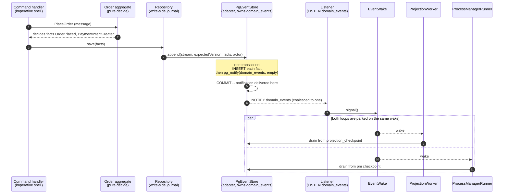
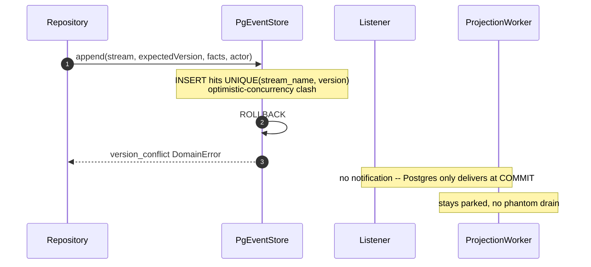
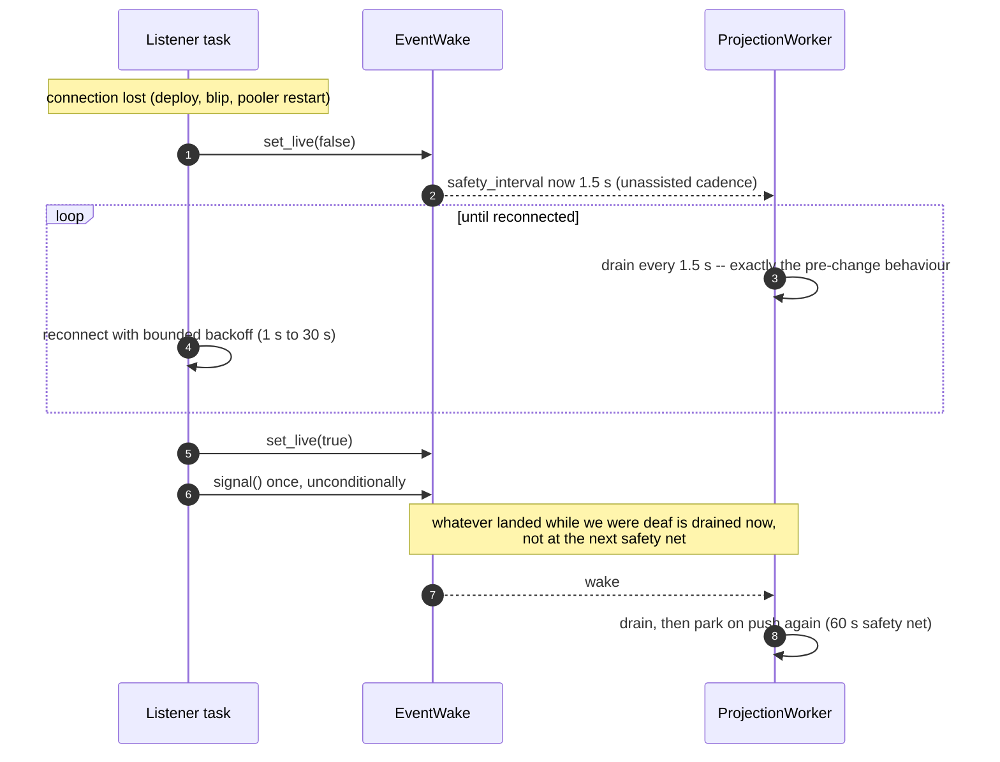

# PROP-20260802-200416 — Push the drain loops from Postgres NOTIFY instead of polling every 1.5 s

- **Status**: Approved (product-owner, 2026-08-02 — "Yes, go ahead and build it")
- **Date**: 2026-08-02
- **Tracking issue**: [#300 "Push the drain loops from Postgres NOTIFY instead of polling every 1.5s"](https://github.com/TheCaptainCompany/captain-food/issues/300)
- **Realized by**: ADR-20260802-200416

## Context

A Render bandwidth alert (70 % of the 5 GB free allowance) was initially attributed to the uptime
monitor hitting `live.captain.food/`, which server-renders the marketplace home. The monitor was
switched from `GET` to `HEAD` to zero the response body.

Measurement showed that diagnosis was wrong, and the switch saved almost nothing.

Render's own breakdown for the month:

| Bucket | Usage | Share |
|---|---|---|
| HTTP Responses (all customer-facing traffic) | 210 MB | 5 % |
| Service-Initiated (the app's own outbound) | 3.97 GB | **95 %** |

Brotli is already enabled, so the home page is 4.9 KB on the wire, not the 23 KB uncompressed —
the monitor was a rounding error either way. The 95 % is the application talking to Supabase.

### Where it goes

Two background loops poll `domain_events`, each every 1.5 s, each paying `1 + 2 × groups` queries
per pass:

| Loop | Groups | Queries/tick | Queries/hour |
|---|---|---|---|
| `ProjectionWorker` | 8 registry groups | 17 | 40,800 |
| `ProcessManagerRunner` | 5 process managers | 11 | 26,400 |
| `InboundEventsDrainWorker` (2 s) | — | 2 | 3,600 |
| Health heartbeat (30 s) | — | 1 | 120 |
| **Total** | | | **≈70,900** |

**1.7 million queries a day at zero orders.** At a conservative ~300 bytes sent per round trip that
is ~21 MB/hour, which matches the flat baseline on the Render graph almost exactly. The write
payloads are *not* the driver: the whole SIRENE write path (journal + event + row upsert, ~2.3 KB per
restaurant across ~76,000 rows processed) accounts for under 250 MB.

Two aggravating factors:

- Pinging every 30 s **defeats Render's free-tier spin-down**, so the loops run 24/7 rather than in
  15-minute bursts. Sustained, 21 MB/hour is ~15 GB/month. The month landed at 4.18 GB only because
  the instance slept through much of it.
- The SIRENE France sweep is live (227,706 rows staged, 151,772 pending, 33 of ~101 departments), so
  the loops are also the hot path for a large pipeline, not merely idle-spinning.

### The insight that makes this cheap

The system already has a durable queue: `domain_events` is an append-only log and
`projection_checkpoint` is the consumer offset. **Nothing is ever lost by a missed signal** — the
next drain reads from the checkpoint and catches up. So the loops do not need durable *delivery*;
they need a **wake signal**. That is exactly what `NOTIFY` is, and it costs a few bytes.

Half the mechanism already exists: `PgEventStore::append` publishes every committed append to an
in-process `EventBus`. Only the GraphQL subscription resolvers consume it — the two loops burning the
bandwidth ignore it and poll. The cost of that mismatch is visible in the subscription resolver,
which receives its push instantly and then polls the read model up to 12 × 250 ms waiting for the
projector to notice the same event it already knows about.

## Decision surface

### Decision 1 — how the wake signal reaches the drain loops

| Option | Pros | Cons |
|---|---|---|
| **(a) Keep polling, head-gate only** | Smallest possible change (~20 lines); no new connection; no new failure mode | Still ~2,400 queries/hour/loop floor; latency unchanged at up to 1.5 s; does not address the cause |
| **(b) Subscribe the loops to the existing in-process `EventBus`** | Free; zero new connections; zero schema change; works today | Only sees appends made by *this process* — silently breaks when the projector graduates to its own worker (`bin/projector.rs`, already the documented plan) or if a second instance runs. A dead end that fails quietly |
| **(c) ✅ Postgres `LISTEN`/`NOTIFY`, raised app-side in the append transaction** | Works in-process *and* out-of-process; survives the Background Worker split; no extension, no trigger, no exposed endpoint, no secret; keeps ADR-0040 intact | Needs one dedicated session-mode connection; fire-and-forget, so a safety-net poll is still mandatory |
| **(d) `pg_net` / Supabase Database Webhooks (DB calls the app over HTTP)** | Can wake a *sleeping* instance, which `LISTEN` cannot | Requires an `AFTER INSERT` trigger — a head-on violation of ADR-0040; still fire-and-forget, so no reliability gain; a full HTTP request per event (~13/sec during the sweep) vs a few bytes; the database must store a credential to call the app; inverts the dependency direction |
| **(e) `pgmq` durable queue** | True durable delivery, survives a disconnected consumer | Rebuilds a queue we already own — `domain_events` + `projection_checkpoint` is that queue. Pure added machinery |

**Chosen: (c)**, with (a) folded in as a cheap complement on the fallback path.

Option (d) deserves the explicit rejection because it is the intuitive reading of "push from the
database". The decisive argument is our own rule: ADR-0040 keeps projection and business logic *out*
of the database. `pg_notify` raised from `PgEventStore::append` is transport, in Rust we control;
a webhook is a trigger by construction.

### Decision 2 — what happens when push is unavailable

| Option | Pros | Cons |
|---|---|---|
| **(a) Drop the poll entirely, trust `NOTIFY`** | Cheapest possible | `NOTIFY` has no replay. A deploy or blip during a commit silently stops projections **forever** — a paid order nobody is told about, the worst failure mode in the domain lens. Unacceptable |
| **(b) Fixed slow poll (60 s) regardless** | Simple | If the listener is down, order confirmation silently gets a minute slower. Degrades the money path without saying so |
| **(c) ✅ Adaptive: slow (60 s) while the listener is confirmed live, fast (1.5 s) whenever it is not** | Losing push degrades to *exactly today's behaviour* and never past it; the fallback is self-healing | One extra piece of state (`is_live`) to keep honest |

**Chosen: (c).** This is what makes the change a pure optimisation: the worst case is the status quo.

### Decision 3 — what the signal carries

| Option | Pros | Cons |
|---|---|---|
| **(a) The event payload** | Drain could skip a read | 8 KB `NOTIFY` payload cap; duplicates the log; the drain must re-read from its checkpoint anyway |
| **(b) The position** | Slightly more debuggable | Distinct payloads **do not coalesce**, so a 3-event append queues 3 wakes |
| **(c) ✅ Empty** | Postgres coalesces identical notifications within a transaction, so a multi-event append wakes the drains **once**; nothing to keep in sync | Log line is less informative (mitigated: the drain logs what it found) |

**Chosen: (c).**

## Screen mockups

**Not applicable — this change has no user interface.** It touches only the write path
(`PgEventStore::append`) and two background loops. No screen, resolver, action or translation key is
added or changed, so `specs/screens/**` is untouched. Recording the absence explicitly rather than
inventing wireframes, per the honest-residuals rule.

The one user-visible consequence is latency: order-status updates and saga reactions land in
milliseconds rather than up to 1.5 s later, on screens that already exist.

## Sequence diagrams

### Flow 1 — a command's events wake both drain loops (the happy path)

The two facts produce **one** wake, not two — the empty payload coalesces them inside the
transaction. Both loops receive it: a single listener fans out to every waiter, so the saga does not
silently keep its old latency while only projections get faster.

### Flow 2 — the append rolls back (nobody is woken)

Raising the notify *inside* the transaction is what buys this. A post-commit notify would leave a
window in which we could crash having written events no listener ever heard about.

### Flow 3 — the listener drops (degrade to polling, then self-heal)

Two guards close the replay gap that `NOTIFY` leaves: the fast fallback while down, and the
unconditional signal on reconnect.

## Expected effect

| | Before | After |
|---|---|---|
| Idle queries/hour (both loops) | ~70,900 | ~120 |
| Idle outbound to Supabase | ~21 MB/hour | negligible |
| Time to notice a committed event | up to 1.5 s | milliseconds |
| Behaviour with push unavailable | — | identical to before |

The latency line matters as much as the cost line: `PlaceOrderProcess` is on the money path, and the
subscription resolver's 12 × 250 ms wait for the projector largely disappears.

## Constraints this change pins down

- **Session-mode connection required.** `LISTEN` works on Supabase's *session* pooler (port 5432,
  what `render.yaml` specifies) and on a direct connection. It silently delivers **nothing** through
  the *transaction* pooler (6543). A future "switch poolers for connection limits" would kill push
  without an error — hence the ADR, and hence the fast-poll fallback that keeps such a mistake
  merely expensive rather than fatal.
- **One dedicated connection.** `PgListener` cannot share the pool (`max_connections(5)`), so the
  listener takes its own. One listener serves both loops rather than one each.
- **The safety-net poll is not optional**, and neither is the reconnect drain.

## Verification plan

- Unit tests over the wake primitive: liveness switches the interval both ways, a signal raised while
  a loop is *busy* (not parked) is still observed, every waiter sees every signal, the loop holds its
  cadence if the sender is dropped.
- Integration tests against a real Postgres proving the three `NOTIFY` properties the design rests on,
  each of which fails **silently** if untrue: delivered on COMMIT, **not** delivered on ROLLBACK,
  and identical empty-payload notifications coalescing to a single wake within one transaction.
- The existing DB-backed write-path tests must stay green with `pg_notify` in the append transaction.

## Out of scope (recorded, not fixed here)

Two findings surfaced by the same investigation, both filed for separate work:

- **The weekly SIRENE re-ingest replays everything.** `crates/sirene_ingest/src/staging.rs` bumps
  `last_seen_at` on every row on every run, and pending means `processed_at < last_seen_at`, so all
  227k staged rows re-pend and re-run through the write path even when nothing changed. Fixing it
  needs an ACL-version constant so a deliberate bump can still force a full re-drain — a design
  decision that deserves its own proposal.
- **Supabase storage is the nearer wall.** The database is at 570 MB against the 500 MB free limit
  (`external_sirene_restaurants` alone is 400 MB) with 33 of ~101 departments loaded. Full France
  projects to roughly 1.7 GB. That is a plan/scope decision for the product owner, not a technical fix.
