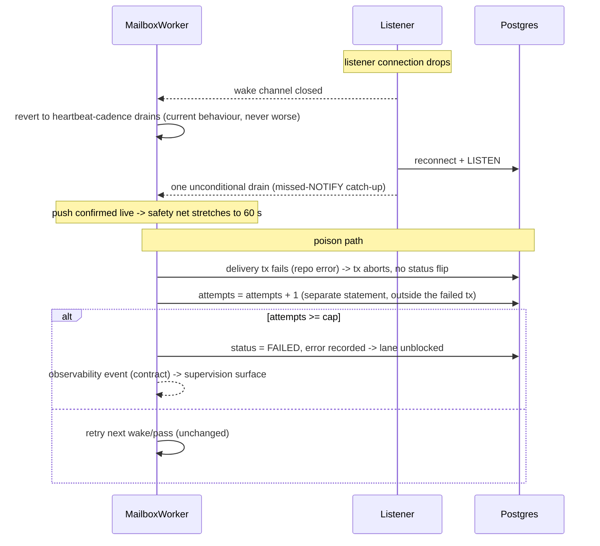

# PROP-20260802-223522 — Push-driven mailbox: NOTIFY everywhere, idle gate, poison policy

- **Status**: Approved (product owner, in-session "Perfect go ahead", 2026-08-02; ADR-20260802-224532; D1–D5 as recommended, unresolved questions copied to #313)
- **Date**: 2026-08-02
- **Tracking issue**: [#313 "Push-driven mailbox: pg_notify on inbound_messages, idle lane gate, poison policy (PROP-20260802-223522)"](https://github.com/TheCaptainCompany/captain-food/issues/313)
- **Realized by**: (pending)

## Context

[#301 "feat(#300): push the drain loops from Postgres NOTIFY instead of polling every 1.5s"](https://github.com/TheCaptainCompany/captain-food/pull/301)
(ADR-20260802-200416) made the `domain_events` consumers push-driven and cut their idle cost
~600×. The post-merge audit found the **actor mailbox is the same pattern, bigger**, plus two
neighbouring defects the audit surfaced. This proposal applies the push approach to everything
that still polls, and fixes what the audit found on the way:

1. **Idle polling.** Every `MailboxWorker` pass costs one `SELECT` per owned lane even when the
   lane is empty (`drain_lane` filters on `status='RECEIVED'` alone), every 10 s, un-gated
   ("ALWAYS running when a DB is configured"). At the original width 100 that was ~580k idle
   queries/hour; [PR #312 "feat: mailbox keyspace width 100 → 5"](https://github.com/TheCaptainCompany/captain-food/pull/312)
   (ADR-20260802-220402) cut it 20× to ~29k/hour as an interim mitigation. Still ~240× the
   post-#301 `domain_events` cost, and it multiplies per process under `RUN_MAILBOX_WORKERS`.
2. **Cross-process wake gap.** The enqueue-side accelerator is an in-process `tokio::sync::Notify`
   (`worker.rs` `nudge`) — it cannot cross processes. A standalone adapter (Stripe, HubRise,
   CoopCycle, Uber Direct, Avelo37) that records a webhook fact wakes nobody: the fact waits out
   the monolith's heartbeat, **up to 10 s on the money path** (a Stripe capture feeding
   `PlaceOrderProcess`). The SIRENE worker solves this by hand with an HTTP ping
   (`POST /internal/sirene/drain`); nothing else does.
3. **Silent infinite retry (poison-by-infrastructure).** A delivery whose repository query fails
   inside the completion transaction aborts the whole transaction — **including the status
   flip** — so `complete_fenced` returns `Err(Db)`, the drain logs a warn and retries the same
   row forever. No error lands on the row, no attempt counter exists, nothing alerts. Found
   2026-08-02 (a missing table produced a row stuck `RECEIVED` with zero recorded evidence;
   docs/claude/sessions.md entry). In production the same shape fires on any transient-turned-
   permanent infrastructure error and silently blocks the lane behind it — **head-of-line means
   one poisoned row stalls every actor hashed to that lane**.

`pg_notify` was proven by #301: delivered at COMMIT, nothing on ROLLBACK, same-payload
notifications coalesce within a transaction, crosses process boundaries, and requires the
session-mode pooler we already mandate (ADR-20260802-200416).

## Decisions

### D1 — Wake transport for mailbox delivery

| Option | Pros | Cons |
|---|---|---|
| **A. `pg_notify` on enqueue, inside the insert transaction (CHOSEN)** | Crosses processes (fixes the adapter gap for free); commit-atomic (rolled-back enqueue wakes nobody); coalesces; one mechanism shared with #301's `event_wake`; no new infra | Needs a LISTEN connection per worker process; session-pooler constraint (already mandated) |
| B. Keep the in-process `Notify`, add SIRENE-style HTTP pings between processes | No new DB mechanics | N ping endpoints × M processes wiring; auth for internal endpoints; still polling as primary for the monolith; the exact hand-rolled shape #301 replaced |
| C. Keep polling, tune the heartbeat down | No code | Latency × cost trade-off is a dead end: 1 s heartbeat ≈ 290k queries/h at width 5 |

The enqueue door is already unique (`PgMailbox` behind the typed clients + the mailbox-entry
codegen test), so the notify lands in **one** place: `PgMailbox`'s insert(s), same transaction.
The standalone adapters get push **with zero adapter changes** — their `PgMailbox` inserts carry
the same notify, and the monolith's listener hears it.

### D2 — Channel topology

| Option | Pros | Cons |
|---|---|---|
| **A. One channel `inbound_messages`, payload = `actor_type` (CHOSEN)** | One LISTEN connection per process; per-actor-type coalescing (Postgres dedupes identical (channel, payload) pairs in a transaction); each worker filters on its own type — no thundering herd across types | Payload parsing (trivial) |
| B. One channel per actor type (16 channels) | No filtering needed | 16 LISTENs per process; registry churn when actors are added; no benefit — LISTEN wake-ups are cheap to filter |
| C. Empty payload, wake everyone | Simplest | Every enqueue wakes all 16 workers → 16 claim+drain passes for one message; recreates the cost push was meant to remove |

### D3 — Idle gate on the drain pass

Even push-driven, the safety-net pass must not pay per-lane SELECTs on an idle system.

| Option | Pros | Cons |
|---|---|---|
| **A. One "lanes with work" query per pass: `SELECT DISTINCT partition FROM inbound_messages WHERE actor_type=$1 AND status='RECEIVED'` — drain only those (CHOSEN)** | Pass cost is 1 query when idle regardless of width; uses the existing partial index `idx_inbound_messages_drain`; exact (no false negatives) | One extra query when lanes DO have work (amortized by the batch it unlocks) |
| B. `MAX(position)` head-gate per actor type (as #301 did for `domain_events`) | Symmetric with #301 | `position` is global across types — one busy actor type un-gates all 16; and SCHEDULED→RECEIVED promotion moves rows without new positions post-promotion edge cases |
| C. None (status quo) | — | The reason this proposal exists |

Idle cost per pass drops from `lanes` queries to 1 per actor type: ~29k/h → **~6k/h at the 10 s
heartbeat, ~1k/h once the safety net stretches to 60 s under confirmed push** (matching #301's
posture: 60 s net while the listener is live, revert to the current cadence whenever it is not,
one unconditional drain on reconnect). Combined with #301: **the idle platform goes from ~650k
queries/hour (pre-#301) to ~1–2k/hour**, and every delivery — command or adapter fact — starts
on commit instead of on a timer.

**Lease renewal stays on the timer.** The heartbeat pass does double duty today (drain + `beat`).
Push replaces the *drain trigger*, never the *lease clock*: `beat` keeps running at
`heartbeat_seconds` unconditionally, or fencing dies with the listener.

### D4 — Poison policy (attempts cap)

| Option | Pros | Cons |
|---|---|---|
| **A. `attempts` counter on `inbound_messages`; on delivery error increment OUTSIDE the failed transaction; at cap (default 5) flip to `FAILED` with the error recorded (CHOSEN)** | Lane unblocks (head-of-line stall bounded); evidence lands on the row (`error`, `attempts`); terminal `FAILED` is already a status the supervision surface shows; cap is config (worker-toggle pattern) | A transient outage longer than `cap × cadence` can fail rows that would have succeeded — mitigated by the cap counting only *delivery* attempts (a lane that cannot even be claimed does not consume attempts) |
| B. Infinite retry (status quo) | Never gives up on a recoverable error | One poisoned row silently stalls its whole lane forever, invisibly — the audit's finding; unacceptable for a paid-order path |
| C. Dead-letter table | Clean separation | New table + requeue tooling for what `status='FAILED'` + the existing lanes screen already express |

A `FAILED`-by-cap row is an **operator event**: it must appear in the observability contract
(`specs/observability.yaml`, mailbox workflow) and on the supervision screen — a paid order
stalled by a poisoned lane is exactly the "who gets told?" failure mode the domain lens names.

### D5 — Gating

Per "gate, then stabilize": new behaviour ships behind config, flip-to-default is its own
recorded decision. `RUN_EVENT_PUSH` stays what it is (the `domain_events` listener). The mailbox
push gets its own toggle (declared in `specs/configuration.yaml`, worker-toggle pattern, default
`true` with the automatic degradation-to-poll below it, mirroring how `RUN_EVENT_PUSH` shipped);
the attempts cap gets `MAILBOX_MAX_DELIVERY_ATTEMPTS` (default 5, `0` = today's infinite retry,
the rollback lever).

## Sequence diagrams

### 1. Command enqueue → push wake → fenced delivery (in-process, acceptance-first)

```mermaid
sequenceDiagram
    participant R as GraphQL resolver (BFF)
    participant MB as PgMailbox (infrastructure)
    participant PG as Postgres
    participant L as MailboxWakeListener (LISTEN)
    participant W as MailboxWorker (Cart)
    participant AGG as Cart aggregate (domain, pure)

    R->>MB: enqueue AddCartLine (typed client)
    MB->>PG: BEGIN; INSERT inbound_messages; pg_notify('inbound_messages','Cart'); COMMIT
    R-->>R: return PENDING acceptance (unchanged)
    PG-->>L: NOTIFY delivered at COMMIT
    L-->>W: wake (actor_type = Cart)
    W->>PG: lanes-with-work (1 query) -> [p3]
    W->>PG: drain lane 3 (batch SELECT)
    W->>AGG: decide (fold stream, pure)
    AGG-->>W: events | rejection
    W->>PG: complete_fenced: append + status flip + checkpoint, ONE tx (ownership_version fence)
    W-->>R: StatusBusObserver -> operationStatus terminal
```

### 2. Adapter fact → cross-process wake (the gap D1 closes)

```mermaid
sequenceDiagram
    participant S as Stripe
    participant AD as stripe-webhook (standalone process)
    participant PG as Postgres
    participant L as Monolith listener
    participant W as Payment worker (monolith)
    participant PM as PlaceOrderProcess

    S->>AD: POST /adapters/stripe/webhooks (capture)
    AD->>PG: BEGIN; mirror raw; INSERT inbound_messages (Payment fact); pg_notify('inbound_messages','Payment'); COMMIT
    Note over AD: today: in-process nudge wakes NOBODY here -> fact waits <= 10 s
    PG-->>L: NOTIFY (crosses the process boundary)
    L-->>W: wake (Payment)
    W->>PG: drain -> record fact, chain PM copy (same completion tx, Runtime D1)
    W-->>PM: PM lane woken the same way -> saga reacts on commit
```

### 3. Degradation and poison (the two safety paths)



## Screen mockup — backoffice mailbox supervision (existing `mailboxLanes`, extended)

The admin lanes screen (Runtime B) gains the poison evidence; controls map to the existing
`mailboxLanes` query — no new mutation in this proposal (requeue-after-fix is an unresolved
question below).

```
+-- Mailbox lanes ------------------------------------------------------------+
| actor type   lane  owner        lease    checkpoint  pending  attempts>1    |
| Payment       2    w-1234-ab3f  live 8s      412        0         -         |
| PlaceOrder…   0    w-1234-ab3f  live 8s      398        1         -         |
| Cart          3    w-1234-ab3f  live 8s      377        2   ! 1 row @4      |
|                                                                             |
| ! FAILED (poison) last 24h: 1                                               |
|   Cart p3 pos 379  AddCartLine  attempts 5                                  |
|   error: relation "catalog" does not exist          [copy correlation id]   |
+-----------------------------------------------------------------------------+
```

## Drawbacks

- **A second listener dependency.** Two LISTEN connections per process (`domain_events` +
  `inbound_messages`) deepen the session-pooler coupling; a pooler-mode mistake now degrades two
  subsystems at once (both degrade to polling — but that failure must be visible, not silent:
  the listener-down state belongs in the observability contract).
- **The attempts cap converts some transient failures into terminal `FAILED`s** that need a
  human (or a future requeue tool). Bounded and visible beats unbounded and invisible, but it IS
  new operational surface.
- **Schema migration** (`attempts SMALLINT NOT NULL DEFAULT 0`) on the hottest table, plus
  emitter work in `specs/database/tables/journals.yaml` — the DSL, not just the SQL, changes.
- More code on the most safety-critical path we have; the #270-style multi-lens review applies.

## Unresolved questions

1. **Requeue tooling**: after an operator fixes the cause, is flipping `FAILED → RECEIVED` a new
   admin mutation (command catalog + story step + test, per ADR-0032) or a documented SQL
   runbook for now?
2. **Cap value and counting**: 5 total delivery attempts, no backoff — or exponential spacing
   between attempts (needs a `next_attempt_at` column)? Proposal starts with the simple counter.
3. **Alerting**: does a poison `FAILED` page (Honeycomb trigger on the observability event) or
   only surface on the supervision screen? Peak-hour stakes say page for `Payment` /
   `PlaceOrderProcess` lanes at least.
4. **`RUN_MAILBOX_WORKERS` adapters**: with push live, does the adapter-side worker fleet
   (monolith-downtime insurance) stay default-off, or become the recommended posture now that
   its idle cost is ~nil?

## Verification plan

- Integration tests mirroring `event_wake` for the mailbox channel: delivered on COMMIT, NOT on
  ROLLBACK, per-actor-type coalescing (one wake for a multi-insert transaction).
- Idle-cost assertion: an idle worker pass issues exactly 1 lanes-with-work query + 1 beat.
- Cross-process test: enqueue via a second pool connection (simulating an adapter process),
  assert the worker delivers without waiting for the heartbeat.
- Poison test: a handler that fails with a repo error N times — row flips `FAILED` at the cap
  with the error recorded, the lane's NEXT row delivers (head-of-line unblocked); with cap 0,
  today's behaviour (executable regression guard for the rollback lever).
- Listener-kill test: stop the listener, assert cadence reverts; reconnect, assert the
  unconditional catch-up drain.
