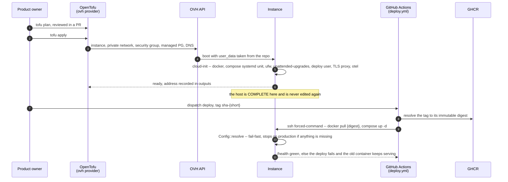
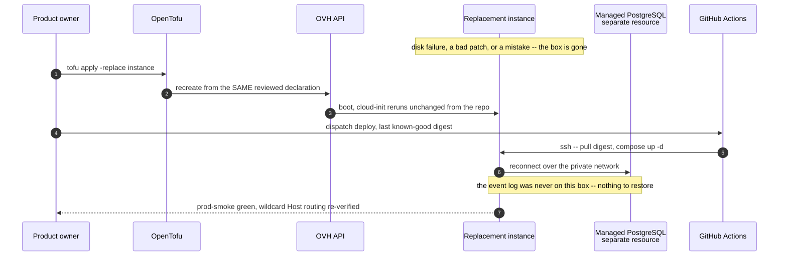
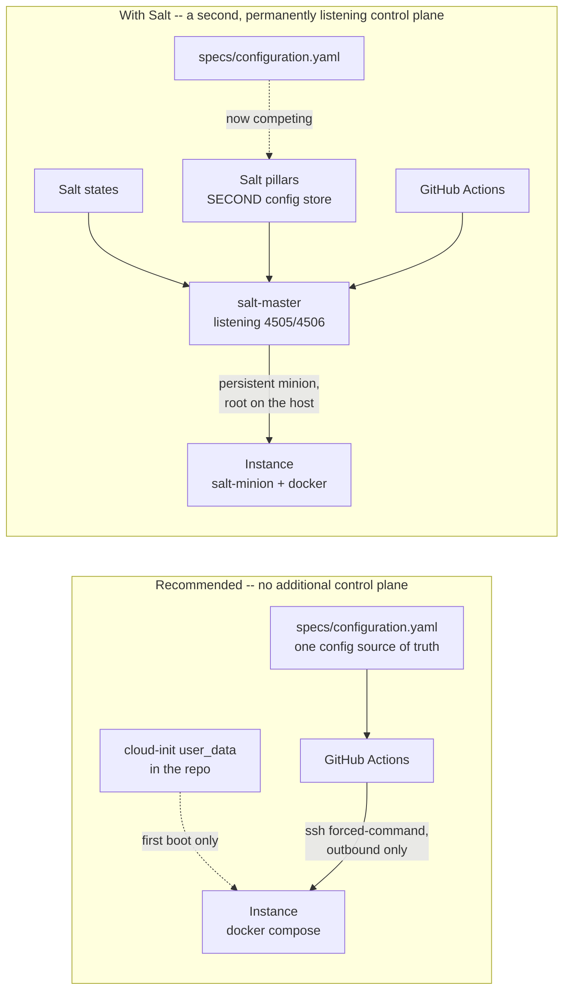

# PROP-20260805-181926 — Who owns the OVH host: provisioning IaC and host configuration (SaltStack evaluated)

- **Status**: Proposed
- **Date**: 2026-08-05
- **Tracking issue**: [#349 "Who owns the OVH host: provisioning IaC + host configuration (SaltStack evaluated)"](https://github.com/TheCaptainCompany/captain-food/issues/349)
- **Realized by**: _(filled at completion)_
- **Builds on**: [#271 "Migrate hosting to OVH"](https://github.com/TheCaptainCompany/captain-food/issues/271) / ADR-20260731-061609 (the migration this decision serves) · PROP-20260729-014500 / ADR-20260729-020000 (application configuration already has an owner — this proposal must not take it back)
- **Concerns**:
  - [ ] cutover-not-blocked: no part of this may delay the OVH cutover — production is down today, and D6 exists to keep IaC adoption strictly behind it.

---

## 1. Context

The question arrived as *"SaltStack seems to be an interesting solution — is it useful for our
project?"*. It is a live question, and it is live for exactly one reason.

ADR-20260731-061609 moves hosting to OVH, and [PROP-20260731-061609 §D1](PROP-20260731-061609-ovh-migration.md)
puts the application on an **OVH Public Cloud instance running the container under docker compose +
systemd**. That is the first time in this project's life that **we own a host OS**. On Render, nothing
about the machine was ours — no kernel, no package set, no firewall, no SSH. From the cutover onward,
three questions have to have an answer that lives in the repository:

1. Which OVH resources exist, with what shape?
2. What is installed and running on that box, and who put it there?
3. How is either reproduced when it is gone?

Today the answer to all three is *nobody has decided*. A grep for `saltstack`, `ansible`, `terraform`,
`pulumi`, `nixos` and `cloud-init` across `specs/**`, `docs/**` and `.github/**` returns **zero hits**.
So this is a genuinely open decision, not a re-litigation of one.

**State at the time of writing** (it matters for D6): the cutover has **not happened**. Render is
suspended (ADR-20260805-070138), production is down, and `.github/workflows/deploy.yml` still targets
Render. The outage window described in PROP-20260731-061609 §3 is still open.

### Why this is not a small question

This project has already been burned — twice, expensively — by infrastructure knowledge living
outside the repository:

- `RUN_SIRENE_WORKER` was set in **no file and no dashboard**. 6,649 department-37 rows sat `PENDING`,
  and establishing *why* consumed an evening (PROP-20260729-014500).
- `API_SECRET` sat configured on the live service and was **read by no code**. Neither fact was
  visible from the repository.
- `render.yaml` itself carries the epitaph in its own header: *"STATUS: DOCUMENTATION, NOT APPLIED"*
  — the Blueprint was retired and the live service moved into the dashboard, where nothing reviews it.

Hand-clicking an OVH instance and hand-installing docker on it recreates that failure **one layer
deeper**, and this time the unrecorded thing is not an environment variable — it is the machine. That
is the argument this proposal is really about. SaltStack is one candidate answer to a question worth
asking.

---

## 2. The question is two layers, not one

"Do we need SaltStack?" conflates layers that have different owners, different risks, and different
best answers. Separating them is most of the work:

| Layer | The question it answers | Owned today? | Does Salt address it? |
|---|---|---|---|
| **A — Infrastructure provisioning** | *Which resources exist*: instance flavor and region, private network, security group/firewall, the managed PostgreSQL plan, DNS records for `captain.food` + the `*.captain.food` wildcard, object storage | **No — nothing** | **No.** Salt configures machines that already exist. It has cloud modules, but provisioning is not what it is for. |
| **B — Host configuration** | *What is installed and running on the box*: docker engine, the compose unit under systemd, firewall rules, unattended-upgrades, the deploy user, TLS/reverse proxy, the OTel collector | **No — nothing** | **Yes.** This is Salt's actual job. |
| **C — Application configuration** | The ~21 environment variables the app reads | **Yes, strongly** — `specs/configuration.yaml`, a codegen'd typed reader, scalar-pattern validation at startup, a drift test asserting every `env::var` call site is declared, and per-profile `deploy:` suppliers | Yes, via pillars — **and that is a problem, not a feature.** See D3. |

Two observations that decide most of what follows:

- **Most of the unmanaged risk is in layer A, and Salt covers none of it.** The question as asked
  points at the layer that matters least for us.
- **Layer C is closed, and must stay closed.** Any tool that brings its own configuration store is
  competing with a source of truth that already has a codegen, a validator and a drift test behind it.

---

## 3. Sizing the problem honestly

Every option below costs more than the problem if the problem is small. So, concretely, what does the
host need?

```
docker engine + compose plugin
a systemd unit that runs `docker compose up -d` and restarts on boot
ufw / OVH security group: 22 (deploy key only), 80, 443 -- nothing else
unattended-upgrades for security patches
a `deploy` user with an SSH forced-command (per PROP-20260731-061609 D4)
a reverse proxy terminating TLS for captain.food + *.captain.food wildcard
the OTel collector shipping to Honeycomb EU
log rotation
```

That is **eight items**, roughly **80 lines** of declarative configuration, set once, changed a
handful of times a year. One instance. One managed database that is configured through OVH's API and
console, not by any configuration-management tool at all.

For scale context on the other side: [#193](https://github.com/TheCaptainCompany/captain-food/issues/193)
caps us at one instance, and multi-instance only becomes meaningful when
[#242](https://github.com/TheCaptainCompany/captain-food/issues/242)'s mailbox leases and fencing land.
We are not sizing for a fleet, and PROP-20260731-061609 D1 already rejected managed Kubernetes on
exactly this ground: *"a control plane to operate for ONE pod"*.

---

## 4. Decisions surfaced

### D1 — Layer A: how infrastructure is provisioned

| Option | Pros | Cons |
|---|---|---|
| **OpenTofu with the `ovh/ovh` provider** ✅ **recommended** | The machine, the network, the firewall, the managed PG plan and the DNS records become **reviewed files in this repo** — the precise gap that produced the `RUN_SIRENE_WORKER` evening, closed one layer down. Provider is official, actively maintained, and OVHcloud documents Terraform/OpenTofu as a supported path. `tofu plan` is a **drift report**, the same instrument PROP-20260729-014500 chose for config. Rebuild-after-loss becomes a command instead of an archaeology exercise. Fully open-source under Linux Foundation stewardship — no BSL exposure, unlike Terraform after 1.5 | A second toolchain and language (HCL) for a team of one plus agents. State must live somewhere real (D5). ~150 lines and about a day to write and import |
| Hand-clicked OVH console | Zero learning cost, fastest to the cutover | **This is the Render dashboard again, verbatim.** The instance flavor, the security-group rules and the PG plan exist only in one person's browser history. Rebuild after loss is reconstruction from memory during an incident. The repo already ran this experiment and wrote down what it cost |
| Shell scripts against the OVH API | No new tool, uses `curl`, fits the existing workflow idiom | Imperative: scripts create, they do not converge or report drift. Every script must hand-roll idempotency, and the ones that matter run once a year and rot silently in between |
| Pulumi | Real languages instead of HCL | **No first-class Rust support**, so it would introduce TypeScript or Python — a third ecosystem in a deliberately full-Rust codebase (ADR-0034/0035). The OVH coverage runs through the Terraform provider bridge anyway, so it is the same provider with an extra layer |
| Ansible's OVH modules | One tool for layers A and B | Ansible is a configuration tool doing provisioning as a sideline: weaker state tracking, no real plan/diff, thinner OVH resource coverage than the dedicated provider |

### D2 — Layer B: how the host is configured

| Option | Pros | Cons |
|---|---|---|
| **cloud-init `user_data`, rendered from the repo** ✅ **recommended** | Exactly sized to §3: the eight items are ~80 declarative lines. **No agent, no master, no daemon, no new port, no new credential.** Runs at first boot, which is the only moment a disposable host needs configuring (D4). Native to OVH Public Cloud and to every other cloud, so it does not lock the migration in. Passed to the instance by OpenTofu, so layers A and B are one `tofu apply` | Not a convergence tool: changing the host means rebuilding it. That is a feature under D4 and a real constraint if D4 goes the other way. Debugging a failed first boot means reading `/var/log/cloud-init-output.log` over SSH |
| **Ansible** — the named escape hatch, not now | Agentless: pushes over SSH, so it adds **no** daemon and no listening port. Far the largest ecosystem and the most likely thing an agent or a new contributor already knows. Converges an existing host without rebuilding it. The natural upgrade the day D4's premise breaks | For **one** host whose entire configuration is eight items, it is a control repo, an inventory, roles and a second YAML dialect to buy a capability we do not yet need. Playbooks that run twice a year drift from reality and are discovered broken at the worst moment |
| **SaltStack** ❌ **rejected** | Genuinely excellent at what it is for: persistent minions, event-driven reactors and beacons, and remote execution measured at ~30× Ansible's speed at 1,000 nodes | Every one of those advantages is a **fleet** advantage, and we have one node. It adds a master/minion control plane — a daemon and a new attack surface — to the box terminating payment traffic. Its pillar system would become a second configuration store next to `specs/configuration.yaml`. Its stewardship is consolidating into Broadcom's private-cloud suite. Full argument in D3 |
| **NixOS**, optionally with the host config generated from the DSL | The best *conceptual* fit on this page, and it deserves to be said plainly: a fully declarative host with atomic rollback is the same doctrine the app already runs on — immutable artifact, digest-pinned, rollback by redeploying the previous one. Whole-system generations make "roll the host back" a real operation, which no other option here offers, and it is a genuine answer to the incident objection. **Generating it from a spec is technically easy** — Nix reads structured data natively via `builtins.fromJSON`, so no Nix emitter is needed at all | **The ecosystem cost is not removed by codegen — see D7**, which is where this argument is actually settled: codegen encapsulates *authoring*, not *operating*, and a host DSL would be a single-target passthrough with none of the fan-out that earns the repo's other emitters. Independently, **OVH offers no first-class NixOS image**: it is reached by `nixos-infect` over a running Debian, `nixos-anywhere`/kexec, or a custom image upload — fine as considered work, bad as something learned while production is down. Deferred on **bootstrap risk and D7**, not on authoring effort |
| Hand-run shell script on the box | Nothing to learn | Indistinguishable from hand-clicking, plus a false sense of rigour because a file exists. Nothing guarantees the file was the thing that ran, or ran completely |
| Docker Compose file only, nothing else | Minimal, and the compose file is needed regardless | Answers only "what containers run", not "what is docker installed on". The other seven items of §3 stay unowned |

### D3 — SaltStack specifically: adopt or reject

**Recommendation: reject**, on five independent grounds. Any one is arguable; together they are not
close.

**1 — The scale advantage is the entire value proposition, and it does not apply.**
Salt's documented edge over the alternatives is throughput at fleet scale: persistent ZeroMQ minions
executing asynchronously, benchmarked around 30× faster than Ansible at 1,000 nodes. That is a real
and impressive engineering achievement. We have **one** node, capped at one by
[#193](https://github.com/TheCaptainCompany/captain-food/issues/193) until #242's leases land. We would
pay the full complexity and none of the benefit — the same trade PROP-20260731-061609 D1 already
refused for Kubernetes. Salt's module coverage is also roughly 50 to Ansible's 400+, so on the *other*
axis it is behind.

**2 — It adds a root-equivalent control plane to the box that terminates payment traffic.**
Master/minion means `salt-master` listening on ZeroMQ **4505/4506**, holding credentials that command
every minion as root. CVE-2020-11651 is the canonical demonstration of what that costs when it goes
wrong: the master's `ClearFuncs` class failed to validate method calls, so a **remote, unauthenticated**
attacker with network reach to those ports could steal the master's root authentication key, read and
write anywhere on its filesystem, and execute arbitrary commands on every minion. It was exploited in
the wild by cryptominers within days of disclosure and is in CISA's KEV catalog.

The point is *not* "Salt is insecure" — that CVE is six years old and long patched, and every tool has
a history. The point is **architectural**: master/minion is a permanently listening, permanently
privileged control channel, and it is a class of attack surface that agentless push and first-boot
cloud-init simply do not have. Our threat model is a single box holding the append-only order log and
the Stripe path, operated by one product owner. That profile cannot staff a control plane whose
compromise is total. Salt can run masterless (`salt-ssh`, `salt-call --local`), which removes this
objection entirely — but masterless Salt is Ansible with a smaller ecosystem, so it wins nothing.

**3 — Its pillars would become a second source of truth for configuration.**
`specs/configuration.yaml` is not a config file; it is a spec with a codegen'd typed reader, per-key
scalar-pattern validation at startup, `gates:` prose printed in the fail-fast report, per-profile
`deploy:` suppliers, and a drift test that fails the build when `crates/**` reads a variable the spec
does not declare. Salt pillars are a configuration store that would sit beside it. **Two configuration
stores is the specific thing this project most consistently refuses** — it is the whole premise of
"the YAML DSL is the source of truth, everything else is generated". Adopting Salt without using
pillars means adopting Salt for a fraction of Salt.

**4 — It is a convergence tool, and our doctrine is immutability.**
The deployment posture here is unusually strict and deliberately so: images are pinned by
**immutable digest**, never a moving tag; non-secret configuration is **baked into the image** so the
digest determines behaviour completely; rollback is redeploying a previous digest. PROP-20260729-014500
D5 chose that specifically because *"config is mutable state outside the artifact: a rollback restores
the old code with the NEW config, which is precisely the combination nobody tested."*

Salt's model is the opposite: a long-lived mutable host, continuously re-converged toward a desired
state. Adopting it would reintroduce at the OS layer exactly the ambiguity D5 just closed at the
application layer — the same box on the same digest behaving differently depending on when it last
converged and what state it converged from.

**5 — The stewardship trend points away from us.**
Salt came to Broadcom through the VMware acquisition. The public repositories have been moving under
`broadcom.com`; POP and Idem — the projects that were to be Salt's next generation — are unmaintained
and slated for archiving; and the commercial line is now VMware Cloud Foundation SaltStack, supported
through October 2028, aimed squarely at private-cloud compliance for enterprises with a VMware
footprint. Broadcom does continue to sponsor the open-source project, and it is not abandoned. But a
tool whose centre of gravity is consolidating into an enterprise private-cloud suite is a poor
five-year bet for a French food-delivery startup with no VMware footprint and one Linux VM.

**When this decision should be revisited — a real trigger, not a formality.**
Salt's sweet spot is a large fleet of long-lived nodes needing event-driven reaction. There is a
plausible Captain.Food future that looks exactly like that: **restaurant-side hardware**. If we ever
put a tablet, a KDS screen or a receipt printer in each partner restaurant, that is hundreds to
thousands of nodes we do not physically reach, needing push updates, health beacons and reactive
remediation — and Salt's beacons/reactor system is genuinely strong there. **That is a different
problem from "who configures our server", and it should be decided on its own merits when it exists.**
This rejection is scoped to the hosting question.

### D4 — Host posture: rebuild or converge

This is the decision that makes D2 easy, so it is worth stating separately.

| Option | Pros | Cons |
|---|---|---|
| **The host is disposable — rebuild, never converge** ✅ **recommended** | Consistent with the doctrine the app already runs on. Configuration drift becomes structurally impossible rather than detected-and-corrected: nothing edits the host, so nothing diverges. Recovery from *any* host-level problem is one path, exercised on every change, instead of a rare untested path. The database is a **separate managed resource** (PROP-20260731-061609 D2), so destroying the instance never risks the event log — this option is only affordable because that decision was made correctly | A configuration change means a rebuild plus a redeploy (minutes) instead of an edit (seconds). Any host state not in the declaration is genuinely lost, so the declaration has to be complete — which is the point, but it bites the first time |
| Converge a long-lived host | A change is seconds. Familiar to anyone with traditional ops experience | Reintroduces mutable state outside the artifact (D3 §4). The host accumulates history no file records, and "rebuild it" becomes the scary untested path precisely when it is needed |

The peak question, asked of this the way CLAUDE.md asks it of everything: **Friday 19:00–21:30, the
box is sick — what happens?** Under rebuild, the answer is one command producing a known-good host in
minutes, with the order log untouched on a separate managed resource. Under converge, the answer is
diagnosis on a live host during the revenue peak. Rebuild is also the posture that makes an unattended
security patch safe to take, because a bad patch is undone by replacement rather than by rescue.

### D5 — Where OpenTofu state lives

Not a detail: state files contain resource attributes, and for a managed database that includes
generated credentials. Getting this wrong is a secret leak.

| Option | Pros | Cons |
|---|---|---|
| **OVH Object Storage, S3-compatible backend, with the lock file committed** ✅ **recommended** | State is off every laptop and off the repo, in the EU, beside the infrastructure it describes. Supports locking, so a CI run and a human cannot apply simultaneously. `.terraform.lock.hcl` **is** committed — provider versions pinned and reviewed, which is the same digest-pinning instinct the deploy pipeline already runs on | One more bucket and one more credential to bootstrap. The classic chicken-and-egg: the bucket holding the state cannot itself be managed by that state |
| Commit `terraform.tfstate` to the repo | Trivially simple, versioned by git | **Secret leak.** The repo is public and the GHCR package with it. Non-starter, exactly as *"a `.env` file committed and read at boot"* was in PROP-20260729-014500 |
| Local state on one machine only | Nothing to set up | Single point of loss, no locking, and it re-privatises the knowledge this whole proposal exists to make public. If the laptop dies, so does the ability to plan |

### D6 — Sequencing: this must not block the cutover

Production is **down now**. The gating instinct here is the repo's own "gate, then stabilize".

| Option | Pros | Cons |
|---|---|---|
| **cloud-init first (it is the box), cut over, then `tofu import` the live resources** ✅ **recommended** | The cutover needs a configured host regardless, so cloud-init is on the critical path either way and nothing is wasted. IaC adoption happens against **real, running, known-good** resources — importing describes what demonstrably works, rather than betting the restoration of production on freshly-written HCL. Restores service in the already-open window | Between cutover and import, layer A is undocumented — the exact gap this proposal opposes. Time-boxed and tracked on the issue, not left to drift |
| Full OpenTofu before the cutover | Layer A never has an undocumented moment | Blocks restoring production on learning HCL, with no running system to check the result against. A `tofu apply` bug becomes a *second* outage on top of the first |
| Never adopt OpenTofu, cloud-init only | Cheapest | Leaves layer A permanently in the console — the failure this proposal exists to prevent. Halves the recommendation and keeps the half that covers less risk |

### D7 — Is the host configuration GENERATED from the DSL, and if so, from what?

Raised by the product owner (2026-08-05): *"Why don't we use NixOS — based on the spec in YAML you can
generate it, so I don't need to know this ecosystem myself because it's encapsulated in the codegen."*
It lands on the softest objection on this page: "ecosystem cost" is a weak reason to reject anything in
a repository whose entire operating model is *the YAML DSL is the source of truth, everything else is
generated*. D2's NixOS row has been rewritten accordingly — the authoring argument is conceded.

**But codegen encapsulates authoring, not operating.** The generated artifact is what runs, and it is
what fails. When the host does not come up at 20:30 on a Friday, the error is a Nix evaluation error
about a module option, and the fix loop is *read the generated Nix → map it back to the spec → change
the emitter → regenerate → redeploy*. That is longer than editing a file, and the repo's own rule
("never hand-edit generated output") closes the shortcut deliberately. NixOS's atomic generation
rollback is a real and partial answer — roll back rather than hand-fix — but rollback restores the
old state, it does not ship the new change.

**The test that decides it is derivable from this repo's own emitters: semantic level and fan-out.**
`entities.yaml` declares `Order` once and generates a SQL view, a GraphQL type, a Rust struct and
documentation — the YAML speaks *food delivery*, several levels above any of its outputs, and one
declaration reaches four targets. That gap is what earns the codegen. A `specs/host.yaml` would speak
NixOS-module-options-in-YAML: same semantic level as its output, one target, no fan-out. It would be
the repo's first emitter with **no abstraction gain** — a lossy passthrough carrying all of Nix's
concepts with none of Nix's expressiveness, where reaching an unsupported option means extending the
emitter instead of writing a line.

**Two supporting facts, both cutting against a bespoke Nix emitter.** The Nix ecosystem generates
config *from* Nix (`pkgs.formats.yaml.generate`, `generators.toYAML`), not the reverse — and where
structured data does drive NixOS, the idiomatic path is `builtins.fromJSON`, i.e. Nix **reads** the
data. So a Nix emitter in `tools/codegen-rs` is the expensive way to do this, and the cheap way still
leaves a hand-written Nix module alive — the ecosystem is not encapsulated either way. And: **if
codegen removes the authoring cost, it removes it for cloud-init too.** Generation therefore does not
differentially favour NixOS; NixOS still has to win on its own merits, which is D2's job, not D7's.

| Option | Pros | Cons |
|---|---|---|
| **Derive host artifacts from the specs that ALREADY exist** ✅ **recommended** | This is the durable idea in the question. `specs/configuration.yaml` already knows every env var and which profile supplies it, `specs/observability.yaml` knows we ship to Honeycomb EU, `services.yaml` and the C4 know what containers exist and what is exposed. Generating the compose file, the firewall port list and the collector config from **those** has real fan-out, and makes the infrastructure **structurally unable to drift** from the app's own declaration — the exact class of bug this whole proposal exists to prevent, now closed by construction rather than by a report. Entirely **target-independent**: it works for cloud-init today and NixOS later | Emitters to write and keep honest. The mapping from "declared in `api.yaml`" to "port open in the firewall" needs care — over-derive it and a spec edit silently changes the security posture, which wants its own gate |
| A new hand-written `specs/host.yaml` that emits the host config | One obvious place to look. Matches the shape of the question as asked | The passthrough problem above: same semantic level as its output, single target, no fan-out. Buys a YAML dialect and an emitter, and pays for both, to avoid learning a config format we would still have to debug |
| No generation — cloud-init is a reviewed file in the repo | Zero machinery. ~80 lines a human or an agent reads directly, and the thing that runs is the thing you read, which is worth a great deal during an incident | The env-var list and the exposed-port list are then duplicated between the specs and the host file, and nothing detects them diverging. Acceptable at eight items, less so as the surface grows |

**Recommendation: derive from the existing specs, do not invent a host DSL — and treat the host target
as a separate, later, reversible choice.** Once the infrastructure artifacts are derived from specs,
switching the emitter's target from cloud-init to NixOS is a contained change with a working system to
compare against. That is the "gate, then stabilize" shape applied to the host layer, and it converts
NixOS from a bet taken during an outage into an ordinary follow-up.

---

## 5. Screen mockups

**No end-user screens.** This proposal adds no command, no query, no `View_*` and no screen — the
actors are an operator and CI, so there is nothing for `specs/screens/**` to declare. The interfaces
that do exist are operator-facing, and both are shown below.

**The drift report — `tofu plan` as the layer-A equivalent of the config drift report:**

```
tofu plan -- captain-food/prod (backend: ovh-s3, state locked)

  no changes    ovh_cloud_project_kube            -- (none declared)
  no changes    ovh_cloud_project_network_private captain-prod-net
  ~ update      ovh_cloud_project_instance        captain-prod-app
                  flavor_name: "b3-8" -> "b3-16"          # Friday-peak sizing, PR #NNN
  ! DRIFT       openstack_networking_secgroup_rule ingress-5432
                  present on OVH, declared in no file      # opened by hand, 2026-08-0X

  1 to change, 1 undeclared. Nothing applied.
```

That last line is the whole point: a firewall rule someone opened by hand during an incident becomes
**visible in a diff** instead of becoming permanent folklore.

**The host-rebuild runbook, as the operator sees it:**

```
┌────────────────────────────────────────────────────────────────┐
│ Host lost -- rebuild drill                          (STATUS.md) │
│────────────────────────────────────────────────────────────────│
│ [1] tofu apply -replace=...instance.app          ~2 min        │
│ [2] cloud-init reruns from the repo (8 items)    ~3 min        │
│ [3] dispatch deploy, previous known-good digest  ~2 min        │
│ [4] config fail-fast gate green, /health 200     ~1 min        │
│ [5] prod-smoke, Host-header tenant routing       ~2 min        │
│ order log: UNTOUCHED -- managed PG is a separate resource      │
│ target: back in service in under 15 minutes, no archaeology    │
└────────────────────────────────────────────────────────────────┘
```

---

## 6. Sequence diagrams

### 6.1 — Host lifecycle: provision, configure, deploy



### 6.2 — The rebuild drill: the host is lost



### 6.3 — What Salt would add, drawn for contrast



The contrast is the argument: the recommended shape has one configuration source of truth and no
inbound control channel. The Salt shape adds a listening privileged daemon and a rival config store,
in exchange for throughput at a node count we do not have.

---

## 7. Drawbacks — why we might regret the whole thing

Distinct from the per-option cons above: these are the costs of the **winning** recommendation.

- **Two new tools for a team of one plus agents.** HCL and cloud-init are each modest, but the repo
  already carries Rust, a YAML DSL, a codegen, Leptos/WASM, an actor runtime and a spec validator.
  Every ecosystem added is one more thing a session must be correct about at 00:40.
- **`tofu plan` drift is only checked if someone runs it.** Unlike `make validate`, nothing here is
  wired into a blocking gate on day one. Left un-automated it decays into the documentation-not-applied
  state `render.yaml` reached — the failure this proposal is arguing against, arriving by a different
  road. A scheduled `plan`-only CI job is the obvious remedy and is listed as an unresolved question
  rather than smuggled into scope.
- **Rebuild-not-converge is a real constraint, not a free win.** It is right for a stateless app
  container in front of a managed database. The first time something genuinely stateful wants to live
  on that host, D4 has to be reopened rather than quietly violated.
- **Little of this is validator-enforced.** CLAUDE.md prefers executable over prose, and the D1/D2 core
  produces prose plus HCL. The codegen governs `specs/**` and cannot see OVH, so the enforcement
  available there is `tofu plan` in CI — weaker than a compiler, and it should be described that way
  rather than oversold. **D7 is the partial answer** and the reason it is worth taking: deriving the
  compose file, the port list and the collector config from specs that already exist puts the host
  back inside the codegen's reach, where drift becomes impossible instead of merely reported.
- **We may be wrong about scale.** If Captain.Food grows past Tours faster than expected and #242's
  leases land early, multi-instance arrives sooner than this proposal assumes. That does not
  resurrect Salt (Ansible or Kubernetes would be the successors), but it does shorten cloud-init's
  useful life.

---

## 8. Unresolved questions

Copied to the tracking issue's checklist on approval, per the README.

1. **Reverse proxy and wildcard TLS**: Caddy (automatic ACME, trivial wildcard) versus Traefik versus
   nginx + certbot. Wildcard `*.captain.food` needs a DNS-01 challenge, so the choice is coupled to
   where DNS is hosted and which provider credential the box gets.
2. **Does `tofu plan` run in CI on a schedule**, reporting drift the way `render-status.yml` reports
   service health? Recommended yes, plan-only, never apply — but it needs OVH credentials in CI, which
   is its own escalation decision (the D4 of PROP-20260729-014500, one layer down).
3. **Who applies?** Human-only `tofu apply` from a laptop, or a manually-dispatched workflow mirroring
   `deploy.yml`'s posture? The pipeline-isolation doctrine (ADR-20260730-051500) suggests the latter.
4. **Object-storage bootstrap**: the state bucket cannot be managed by the state it holds. Created by
   hand once and documented, or a tiny separate local-state root module?
5. **Does the OTel collector run on the host or in the compose stack?** Compose keeps it inside the
   digest-pinned artifact and out of cloud-init, which argues for compose.
6. **Migration-era secret handling**: the managed PG credential is generated by OVH and consumed by
   GitHub secrets. Does OpenTofu write it, or does a human copy it once? Writing it means CI can read
   the database password from state.

---

## 9. Alternatives considered (whole-proposal level)

| Alternative | Why it lost |
|---|---|
| **Adopt SaltStack** — the question as asked | Five independent grounds in D3: the scale advantage needs ~1,000 nodes and we have one, it adds a permanently listening root-equivalent control plane to the box terminating payment traffic, its pillars become a second config store beside `specs/configuration.yaml`, its convergence model contradicts the immutable-artifact doctrine PROP-20260729-014500 D5 just established, and its stewardship is consolidating into Broadcom's VMware private-cloud suite. Revisit **only** for a restaurant-hardware fleet, which is a different problem |
| **Adopt Ansible now instead of cloud-init** | Agentless, so it avoids Salt's central objection, and it is the right answer at 3+ hosts. At one host with eight configuration items it buys convergence we have decided (D4) we do not want. Named as the explicit escape hatch with a stated trigger rather than rejected |
| **Adopt NixOS** (optionally generating its config from the DSL) | The best conceptual match to the repo's own doctrine — declarative hosts with atomic generation rollback, which is a real answer to the incident objection. The "encapsulate it in the codegen" argument (D7) correctly kills the *authoring*-cost rejection, and is conceded. What remains is that codegen does not encapsulate **operating** a stack, that a host DSL would be a single-target passthrough with none of the fan-out earning the repo's other emitters, and that **OVH has no first-class NixOS image** — `nixos-infect`/`nixos-anywhere`/custom upload is a poor thing to learn while production is down. Deferred on bootstrap risk and sequencing, **not** on effort, and reachable later as a contained emitter-target swap once D7 lands |
| **OVH Managed Kubernetes**, which would subsume both layers | Already rejected in PROP-20260731-061609 D1 — a control plane for one pod. Nothing here changes that, and #193's one-instance cap still holds |
| **Do nothing; configure the host by hand at cutover** | The Render dashboard one layer deeper. The repo has already paid for this lesson twice (`RUN_SIRENE_WORKER`, `API_SECRET`) and written both costs down |
| **Re-adopt `render.yaml` as real IaC** | Moot — ADR-20260731-061609 closes the Render workspace rather than fixing it. Render is never resumed |
