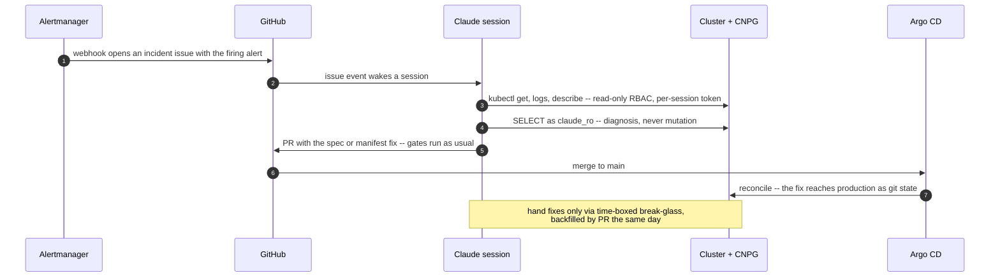
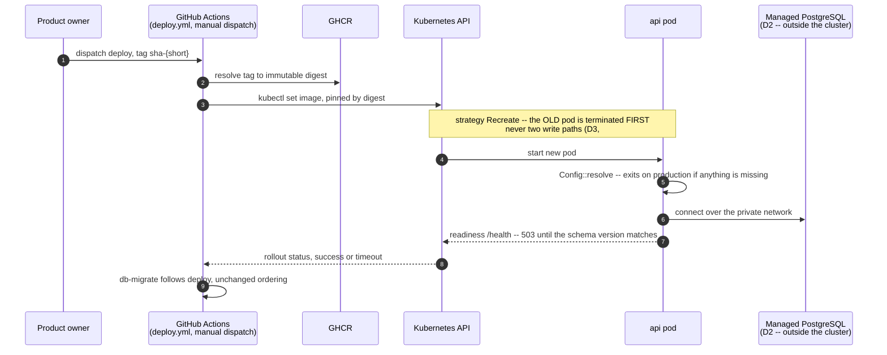
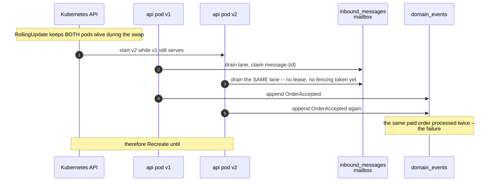

# PROP-20260806-223656 — Kubernetes as the deployment substrate (reopening the destination)

- **Status**: **Approved** (product owner, 2026-08-06/07, D1–D7 all answered in-session, closed with
  *"D3 and D5 yes, start clean, move the NS to OVH"*) — recorded by
  [ADR-20260807-002705](../adr/ADR-20260807-002705-hosting-ovh-mks-cnpg-gitops.md), which supersedes
  ADR-20260806-151122 (Clever Cloud, reopened). Unresolved questions copied to
  [#271](https://github.com/TheCaptainCompany/captain-food/issues/271)'s checklist per the README.
- **Date**: 2026-08-06
- **Tracking issue**: [#271 "Migrate hosting to Clever Cloud: app compute + PostgreSQL leave Render/Supabase; Supabase retained for identity only"](https://github.com/TheCaptainCompany/captain-food/issues/271)
- **Realized by**: _(filled at completion)_
- **Concerns**:
  - [x] rolling-deploys-blocked-by-193: **resolved 2026-08-07** — D3 is answered: `strategy: Recreate` until [#242](https://github.com/TheCaptainCompany/captain-food/issues/242) lands, pinned in the generated Deployment with [#193](https://github.com/TheCaptainCompany/captain-food/issues/193) linked.
  - [x] database-placement-unresolved: **resolved 2026-08-06** — the product owner chose in-cluster CNPG explicitly, with the operability conditions (≥3 nodes, required anti-affinity, WAL archiving, executed restore drills) carried as part of the answer, not inherited by default.
  - [x] prod-is-down: **resolved 2026-08-07** — D6 is answered: the product owner explicitly accepts the outage window (*"it was a crash test"*); the cluster is built directly, with no interim restore. The remaining data question (restore the dump vs start clean) is carried in D6's note and §6.
  - [x] agent-access-shape: **resolved 2026-08-06** — the product owner chose the recommended mechanism (*"Of course gitops"*): GitOps as the only change path, read access for diagnostics, fixes as repo changes; practices in §2b.

---

## 1. Why this is reopened

ADR-20260806-151122 chose Clever Cloud one day ago, and its decisive argument was operational
capacity: *"a team of one product owner plus agents should not be operating a PostgreSQL server."*

**That argument rested on a premise about the operator that was wrong.** The product owner has run
Kubernetes professionally at a previous company (stated 2026-08-06). Familiarity is precisely what
converts "operational surface" into "routine", so the largest weight in that decision was
mis-specified. Reopening is the correct response to a corrected premise, not churn.

Three further arguments were raised, and each is independently sound — they are recorded here because
none of them appeared in the original ADR:

- **Ingress as a lightweight API gateway.** The architecture is *role = path* (`/{role}/graphql`) plus
  multi-tenant `Host` routing over `*.captain.food`. An ingress terminates TLS, issues the wildcard
  certificate via cert-manager, routes by host and path, and keeps the application off the public
  internet. A reverse proxy is needed for wildcard TLS **regardless of destination**, so this is a
  capability we must buy somewhere.
- **Lock-in.** The earlier dismissal ("a Dockerfile, env vars and a connection string") was true of the
  app alone and **under-weighted the trajectory**: adopting Clever Tasks for jobs, Cellar for
  attachments and their add-ons for Redis compounds coupling over time. Kubernetes manifests are
  materially more portable.
- **Manifests are declarative, reviewable, version-controlled — and a far better codegen target than
  any PaaS console.** This is the strongest fit with the repo's own doctrine and it strengthens
  **[PROP-20260805-181926](PROP-20260805-181926-host-provisioning-and-configuration-ownership.md) D7**:
  a PaaS cannot accept generated deployment descriptors, a cluster can.

## 2. Decisions surfaced

### D1 — Kubernetes, or the PaaS decided yesterday?

| Option | Pros | Cons |
|---|---|---|
| **OVH Managed Kubernetes (MKS)** ✅ **recommended if D1 goes to k8s** | Control plane **free for life**; **egress free**, including to the internet and (since Jan 2026) object storage — the axis that ended Render, and better than Clever Cloud's metered Cellar bandwidth; mature, GA, not beta; same provider already used for the SMS hook | Worker nodes + **Public Cloud Load Balancer** are billed separately, so ~EUR 18+/month before the database — above the EUR 9.75 Clever Cloud selection. Managed PostgreSQL at OVH was ruled out on cost 2026-08-05, so D2 reopens as a real question |
| Clever Kubernetes Engine (CKE) | Managed, sovereign, integrates with Clever Cloud managed Postgres and Cellar, so D2 answers itself; `clever k8s` CLI | **Public beta** since 2026-04-27 — the wrong risk profile for the system holding paid orders, on a platform being adopted *because* two previous platforms' ceilings bit us |
| Clever Cloud PaaS (the ADR-20260806-151122 decision) | Cheapest verified (EUR 9.75 for an under-specced pair), managed Postgres with backups + PITR, zero infrastructure to operate, **10 TB/month free egress** | Deepening ecosystem coupling (Tasks, Cellar, add-ons); no ingress layer of our own; deployment descriptors cannot be generated from the specs |
| Defer — restore prod on the PaaS, decide later | Fastest path out of the current outage; the digest-pinned image runs unchanged on either, so moving later is a redeploy, not a migration | Two setups instead of one; risks becoming permanent by inertia |

**D1 ANSWERED 2026-08-07 (product owner: *"MKS of course"*): OVH Managed Kubernetes** — the
recommended option: GA (vs CKE's public beta), free control plane, free egress including object
storage, same provider as the SMS hook and the vRack.

### D2 — Where does PostgreSQL live? (**the hard one**)

| Option | Pros | Cons |
|---|---|---|
| **Managed PostgreSQL alongside the cluster** ✅ **recommended** | The event log is the one asset that cannot be re-derived, and stateful workloads are where Kubernetes is hardest. Backups/PITR/patching stay someone else's job — and measured against today's Supabase free tier, which has **no backups at all**, this is the single largest reliability gain available | Reopens the cost question closed on 2026-08-05, when OVH managed PostgreSQL was ruled out on price. May force a provider split (OVH cluster + a managed database elsewhere) |
| In-cluster PostgreSQL via an operator (e.g. CloudNativePG) | One platform, one bill; the operator genuinely automates backups, failover and PITR | Puts **paid orders and the append-only event log** on the hardest part of Kubernetes, operated solo. A storage-class or node-drain mistake is unrecoverable in a way a stateless pod never is |
| **Self-managed PostgreSQL on a Public Cloud INSTANCE attached to the same vRack** — the shape that reconciles cost pressure with the network requirement | Cheaper than managed while keeping the private network: **MKS supports vRack** (choose the private network at cluster creation; every node gains an `eth1` on it, and pod-to-pod plus private traffic routes through it), and a Public Cloud instance can sit on that same network. Block storage attaches for the data directory, so disk grows independently and the instance stays disposable | Backups/WAL archiving are ours (see the free-tier baseline above — still an improvement). One more machine to patch. Reserve `10.2.0.0/16` (pods), `10.3.0.0/16` (services) and `172.17.0.0/16` (Docker) — OVH documents these as non-compliant with vRack and they produce incoherent overlay behaviour |
| PostgreSQL on a **VPS** beside the cluster (product owner, 2026-08-06: *"Kubernetes for the apps and vps-2 for Postgres?"*) | VPS-2 is the best specs-per-euro on the table — 4 vCores / 8 GB / 75 GB at EUR 7.21, well above a d2-2 | **The VPS cannot join the vRack** (confirmed: the vRack page lists Bare Metal, Hosted Private Cloud, Public Cloud, Additional IP, Enterprise File Storage and Load Balancer — VPS in none), so the database would sit on a **public IP** or behind a WireGuard tunnel we run. Worse in a way specific to clusters: **egress comes from NODE IPs, which are dynamic** — a node replaced by an upgrade, a scale event or autohealing silently breaks an IP allowlist, and stable egress needs a custom gateway, i.e. more machinery. Same instinct as the row above, wrong vehicle |
| Clever Cloud managed Postgres + OVH cluster | Keeps the good database story while taking the cluster | Two vendors, two bills, **cross-provider network latency on every query** — the private-network property that ruled out two VPS applies here with force |

**D2 ANSWERED 2026-08-06 (product owner, in-session: *"Postgres on Kubernetes"*, after the operability
conditions were put on the table): PostgreSQL runs IN-CLUSTER via CloudNativePG** — with the conditions
that made it defensible carried as part of the answer, not as optional extras: **≥3 worker nodes with
REQUIRED pod anti-affinity** (a single-node "cluster of pods" is one failure domain with extra steps),
**continuous WAL archiving to object storage**, and **a scheduled, executed restore drill**. The
operator-capacity objection is closed by D7's access model plus the wake-up loop in §2b.

### D3 — Deploy strategy while [#193](https://github.com/TheCaptainCompany/captain-food/issues/193) caps us at one instance

A rolling update deliberately runs the **old and new pods simultaneously**. That is exactly what #193
forbids until [#242](https://github.com/TheCaptainCompany/captain-food/issues/242)'s leases and
fencing land: two write-path instances means two projectors and two mailbox drains on the money path.
**The headline benefit of Kubernetes is therefore unavailable at V0** — health and liveness probes
still work and are a real gain, but zero-downtime rollout is not.

| Option | Pros | Cons |
|---|---|---|
| **`strategy: Recreate` until #242 lands** ✅ **recommended** | Correct by construction — never two write paths. Honest about the constraint rather than discovering it as double-processed orders | Brief downtime per deploy: the same as today, so no regression, but no improvement either |
| `RollingUpdate` with `maxSurge: 0`, `maxUnavailable: 1` | Uses the native mechanism; one replica at a time | At **one** replica this degenerates to Recreate with extra ceremony |
| `RollingUpdate` now, rely on the mailbox to be safe | The benefit immediately | **Unsafe**: it presumes the fencing #242 exists to build. This is precisely the "oversell and un-accepted orders" failure the domain lens warns about |

**D3 ANSWERED 2026-08-07 (product owner: *"D3 … yes"*): `Recreate` until #242, as recommended.**

### D4 — Ingress and wildcard TLS

| Option | Pros | Cons |
|---|---|---|
| **ingress-nginx + cert-manager, DNS-01 wildcard for `*.captain.food`** ✅ **recommended** | Standard, well-documented, provider-portable. Terminates TLS, routes by `Host` (multi-tenancy) and by path (`/{role}/graphql`), keeps pods unexposed. Solves wildcard TLS, which is required on **every** option including the PaaS | Another component to upgrade. DNS-01 needs a DNS-provider credential in-cluster |
| Traefik | Ingress + gateway features in one, good defaults | A second config idiom to learn beside the manifests |
| Cloud LB straight to the service | Fewest moving parts | No host/path routing, no central TLS, pods effectively exposed — loses the reason for wanting ingress |

**D4 ANSWERED 2026-08-07 (product owner: *"Ingress yes!"*): ingress-nginx + cert-manager, DNS-01
wildcard.** The queried con, unpacked (it had been stated too tersely): a `*.captain.food` wildcard
certificate can only be issued via the DNS-01 challenge — Let's Encrypt demands a token written into
a TXT record on the zone — and renewal is every ~60 days, done by cert-manager unattended, so
**cert-manager must hold an API credential for whoever HOSTS the DNS zone**, in-cluster, sealed
(§2b practice 7) and scoped as narrowly as the provider allows.

**Zone-host correction (product owner, 2026-08-07): the DNS provider is DYNADOT, not OVH** — and
**no Dynadot cert-manager solver exists**, built-in or community (checked 2026-08-07). Three ways
through, one recommended:

| Option | Pros | Cons |
|---|---|---|
| **Move zone HOSTING to OVH DNS — nameserver change only, Dynadot stays the registrar** ✅ recommended | One provider and one EU jurisdiction for cluster + DNS (the sovereignty posture that has run through every hosting decision); the community `cert-manager-webhook-ovh` solver exists; the cutover must touch DNS anyway (`*.captain.food` → the MKS Load Balancer), so the NS change rides work already planned; DNS becomes API-drivable for D5-generated records later | An NS migration to sequence carefully (propagation, low TTLs first); the OVH solver is community-maintained, not core |
| CNAME-delegate ONLY the challenge: `_acme-challenge.captain.food` → a zone at a solvable provider (cert-manager follows CNAMEs) | Smallest change — Dynadot keeps hosting everything else | A second, standing DNS dependency whose only job is the challenge; renewal now depends on two providers being correct |
| Write a custom Dynadot webhook against their API | Everything stays at Dynadot | Bespoke certificate-critical infrastructure, maintained by us alone — the worst fit for this team, and renewal is the thing that fails at 4am two months after everyone forgot it exists |

**Sub-decision ANSWERED 2026-08-07 (product owner: *"move the NS to OVH"*): zone hosting moves to
OVH DNS**, Dynadot remains the registrar. Sequencing: drop the zone TTLs at Dynadot first, replicate
the records at OVH, then switch the nameservers — before the wildcard record is pointed at the MKS
Load Balancer.

### D5 — Are the manifests generated from the specs?

**D5 ANSWERED 2026-08-07 (product owner: *"D5 yes"*): the manifests are generated.**

**D5 addendum — deployment topology (product owner directives, 2026-08-07, two rounds — this section
is the CURRENT state per the living-document rule; the phased single-image version it replaces is in
this file's git history)**: *"1 replica per web app including the adapters, 1 replica per actor type,
1 replica per worker including the projector — depending on the workload I will scale the replica"*;
front offices (live marketplace + `{slug}` storefronts) split from back offices (restaurants, riders,
system); *"directly the most split possible, to avoid AI errors due to facility"* — and, on review,
the product owner **rejected the same-image-everywhere design**: env vars gate routing, not
capability, so one image would have kept runtime isolation while losing compile-time isolation,
scoped deploys (under `Recreate`, one image means a rider-UI change restarts the Order drain), and
per-pod attack surface.

- **Surfaces get their own BIN CRATES and IMAGES** — `fo-marketplace` (captain.food), `fo-storefront`
  (`{slug}.captain.food`), `bo-restaurant`, `bo-rider`, `bo-admin`, `adapters` (webhooks +
  `/external`) — each linking ONLY the crates its surface needs, enforced by the cargo-deny
  capability allowlist. This extends **PROP-20260802-130500 (isolation by construction) from crates
  to binaries**: the wrong coupling becomes unspellable, not just unrouted. One cargo-chef cook →
  N thin runtime images copying different binaries, so the build cost is marginal.
- **Every actor and process manager gets its own bin and image too** — named **`actor-{type}`**
  (aggregates) and **`pm-{name}`** (process managers), the emitter deriving names from
  `actors.yaml`/`processmanager.yaml` (product owner naming directive, 2026-08-07). *This replaces
  the earlier "one worker image via `DRAIN_ACTOR_TYPES`" exception, whose premise the domain split
  below removes*: with per-scope domain crates, `actor-order`'s closure genuinely differs from
  `actor-catalog`'s, so per-actor images stop being split theater. **`DRAIN_ACTOR_TYPES` is
  cancelled before it was built** — an `actor-order` bin that only LINKS the Order handler can only
  drain Order lanes: the scoping moved from an env var to the linker (compiler-first,
  ADR-20260803-234035); a runtime assertion (worker refuses a lane not its type) stays as belt.
  **`projector` and `bam` keep their own bins** (distinct C4 containers).
- **The domain layer splits into per-scope GENERATED crates** (product owner directive, 2026-08-07:
  *"split the domain like events commands business entities scalars in different crates by business
  scope to avoid updating every pods for a small change on an event or a command"*): the codegen
  emits `domain-{scope}` crates (scope = the aggregate, per `actors.yaml`/`entities.yaml`
  membership) plus a small **kernel** crate (Money, Address, shared scalars), with the crate
  dependency graph **derived from the spec's `$ref` edges** — the spec's coupling becomes the
  compile-and-deploy coupling, mechanically, never hand-designed. A **new validator rule fails on
  cross-scope `$ref` CYCLES** (crates need a DAG), which doubles as spec hygiene. Honest limits,
  recorded so they never surprise: **kernel changes still ripple everything** (correctly — Money
  touches everyone), and **cross-scope PMs legitimately span scopes** (`pm-place-order` links
  ordering + payment, so a payment event change rebuilds it — real coupling made visible is the
  feature, not a leak). Combined with the determinator gate, blast radius drops from "all pods" to
  "the pods whose scopes the change provably touches".
- **The deploy LEDGER is git** (product owner, 2026-08-07: *"remember for easy rollback what has
  been deployed"*): the pins path holds `{digest, source_hash}` per image, every deploy writes ONE
  structured pin-bump commit (`deploy: actor-order=sha-abc123 fo-storefront=sha-def456`), so
  `git log -- <pins path>` IS the deployment history — the role Render's deploy-event log used to
  play (ADR-20260721-175411's "version-of-record"), now in the repository. **Per-image rollback =
  `git revert` of that image's pin change**; Argo's own history is secondary, never authoritative.
- **The safety boundary is unchanged by any of this**: surface pods scale freely NOW (mutations only
  INSERT into the mailbox); one worker per actor type is safe WITHOUT
  [#242](https://github.com/TheCaptainCompany/captain-food/issues/242) (disjoint types = disjoint
  lanes, contention-free by construction); **two workers on the SAME type requires #242's leases** —
  the hot type at Friday peak is `Order`, so #242 is the direct unlock for the scaling wanted.
  Projector and BAM stay singletons (advisory lock, PROP-20260726-170500 D3).
- **Structural consequence**: `c4-l2.yaml`'s single `api` container splits into the real container
  list — a SOURCE-DSL change (the product-owner directive is the decision; mechanics via the normal
  spec edit + validator, with the `realizes:` actor mappings moving to the worker container). The
  [#349](https://github.com/TheCaptainCompany/captain-food/issues/349) emitter then derives bin
  crates ↔ Dockerfile targets ↔ Deployments from C4 + `actors.yaml` as one chain; `deploy.yml`
  becomes a matrix of per-surface digest pins, which also buys per-surface rollback.
- **CI builds and deploys ONLY what changed** (product owner directive, 2026-08-07) — a REQUIREMENT,
  not an optimization, because without it the split un-delivers itself: Rust builds are not
  bit-reproducible, so an unconditional rebuild mints a NEW digest for IDENTICAL source, every pin
  bumps, and under `Recreate` every Deployment restarts — the Order drain pausing for a rider CSS
  change, the exact failure the per-surface split exists to prevent. Therefore the skip keys on
  **source, not digest**: per image, hash the bin's crate CLOSURE (`cargo metadata` gives the graph;
  hash the tracked files of those crates + `Cargo.lock` + `rust-toolchain.toml` + the Dockerfile
  stage + the wasm-bundle inputs for surface images), record the hash on the published image (OCI
  annotation), and skip build → publish → pin-bump when it matches the last published one. Precedent
  exists: `build-image.yml` already carries a "decide whether the deployable image changed" step for
  the single image — this generalizes it to a per-image matrix. Honest corollary: a `Cargo.lock`
  bump or a shared-crate (`domain`, generated code) change ripples every closure and legitimately
  rebuilds everything — that is correctness, not a bug in the detection.
  **Detection protocol (settled with the product owner, 2026-08-07; refined same day — the
  affected-set computation is a LIBRARY, not hand-rolled)** — *fail open to REBUILDING, never to
  skipping* (a false "changed" costs one useless restart; a false "unchanged" ships stale
  production silently): (1) **the affected-package set comes from the `determinator` crate**
  (guppy project — built for Diem's monorepo, maintained by the cargo-nextest author): given the
  file changes between two commits it computes which workspace packages are affected, **with our
  fail-open rule built in** (a changed file belonging to no package ⇒ rebuild everything) and
  **Cargo build simulations including feature sets** — catching feature-unification changes a
  file-closure hash would miss. This answers the product owner's hand-maintained-list worry
  directly: the file→package mapping is cargo's own resolver via a maintained library; our layer
  adds only the bin-crate → image mapping (from the C4, completeness-tested) and the global inputs
  (`rust-toolchain.toml`, the Dockerfile, `build-image.yml`, the `web` closure for surface
  images). Per-bin hashing over **git blob shas** (`git ls-tree`) remains the recorded-state
  format; (1b) **reproducibility hygiene is adopted as the complementary VERIFIER, not the gate**
  (the product owner's C#-style timestamp normalization, in Rust form: `trim-paths` /
  `--remap-path-prefix`, `SOURCE_DATE_EPOCH`, buildx `rewrite-timestamp`) — it stabilizes digests
  only AFTER paying the build, so it cannot replace the source gate, but once digests are stable,
  **a digest that drifts while the source hash did not is a nondeterminism alarm for free**;
  (2) the last-published hash lives **in the GitOps pin
  file** — each pin becomes `{digest, source_hash}`, so the compare is repo-vs-repo, atomic with
  the pin and auditable in git log (the OCI annotation is kept as forensic belt); (3) the skip is
  **two-level**, preserving ADR-20260730-051500's isolation: `build-image` (auto) builds/publishes
  only hash-changed images via one shared cargo-chef cook fanning to the changed final stages;
  `deploy` (manual dispatch) writes only hash-changed pins in ONE commit, so Argo syncs once and
  restarts only those Deployments; (4) **completeness is a codegen TEST**: every bin crate maps to
  exactly one image and back — a new bin without a mapping is a build failure, not a workload that
  silently never deploys. Net effect: a docs commit builds and restarts nothing; a single-surface
  change builds one image and restarts one pod, and the Order drain never blinks.
  **Node budget CONFIRMED (product owner, 2026-08-07: "Ok for your config")**: d2-8 + d2-4 + LB S
  = €38.04/mo ex-VAT — the entry rung for the full-split topology (6× d2-2 was examined and
  rejected: d2-2 does not appear in the MKS worker-flavor catalog, per-node overhead would eat
  ~30% of usable RAM across six 1-vCPU nodes for MORE money, and node count does not protect
  singletons — replicas do, and replicas wait on #242; granularity comes from per-flavor node
  POOLS later).
- **Bills**: per-pod sqlx pools become small DECLARED values (2–3; pgbouncer as the later escape
  hatch); the full shape wants two nodes from day one — **d2-8 + d2-4 + LB S ≈ €38.04/mo ex-VAT**
  (within ADR-20260807-114122's ladder; the single-d2-8 €26.60 rung is too snug for ~25 pods). The
  bin/router split is real pre-cutover work and now PRECEDES cluster creation in the product owner's
  ordering.

**Recommended: yes — this is the strongest argument for a cluster.** `specs/configuration.yaml` already
declares every env var and its per-profile supplier, `specs/observability.yaml` declares the telemetry
contract, and `c4-l2.yaml` declares the containers. Emitting Deployments, Services, the Ingress and the
env blocks from those makes the cluster **structurally unable to drift from the specs**, which no PaaS
console can offer. This is PROP-20260805-181926 D7 with a target that actually fits: manifests are
declarative data, which is what this codegen is good at.

### D7 — How does the agent operate the cluster? (product owner: *"full access to the Kubernetes cluster"*)

The product owner has offered to grant the assistant full cluster access so it can act as production
admin (2026-08-06). The intent is right — someone must be able to *do* the work — but the mechanism
matters more than the permission, for a reason this repository has already paid for.

**Access was never the gap; continuity was.** Credentials do not make an agent awake. If the primary
fails at 03:00 and no session is running, a cluster-admin kubeconfig in a vault changes nothing. A
scheduled routine narrows this — it gives detection and even remediation at the polling interval — but
it is monitoring with automated action, not a pager, and it puts an LLM's judgement on the money path
unsupervised.

**The stronger objection is that imperative access recreates the exact failure that started this
migration.** A cluster fixed by hand at 03:00 is state that exists in **no file** — which is
`RUN_SIRENE_WORKER` set in no file and no dashboard (6,649 rows PENDING, an evening to diagnose), and
`API_SECRET` configured on a service and read by nothing. This repo's entire doctrine is that
hand-edited runtime state is the bug. A `kubectl edit` on production is the Render dashboard with a
better CLI.

| Option | Pros | Cons |
|---|---|---|
| **GitOps: the agent proposes manifest changes as PRs, a controller (Argo CD / Flux) reconciles the cluster** ✅ **recommended** | The agent's "access" becomes **the repository** — auditable, reviewable, revertible, and already governed by the gates. Perfectly consistent with the operating model, and **D5 is what makes it work**: manifests generated from the specs mean the cluster cannot drift from the DSL. Every production change has a diff and an author. Rollback is `git revert` | A controller to install and keep current. Emergency changes take a PR round-trip unless break-glass exists (below) |
| Standing cluster-admin kubeconfig for the agent | Fastest possible action; nothing to build | Largest blast radius available, held permanently, by an actor with a **demonstrated** error rate — in the single session that produced this proposal: wrong VPS-2 specs taken from a secondary source, a `rust-cache` config that would have keyed a broken cache, a monitor whose `\|\| true` guards made total failure look like progress, and a `git reset --hard` that discarded its own uncommitted work. Every one was recoverable because the target was docs and CI. The same error rate against `kubectl delete pvc` is not |
| Read-mostly RBAC + narrow writes (`get`/`list`/`log`/`describe`/`rollout restart`/`scale`) | Covers most real diagnosis and much of the remediation; small blast radius; complements GitOps rather than competing | Cannot fix what needs a manifest change — which is the point: those go through the PR path |
| No runtime access at all | Zero risk | Blind. Diagnosis without logs and events is guesswork, and that helps nobody |

**Recommendation: GitOps for change + read-mostly RBAC for diagnosis + an explicit, short-lived
break-glass credential for incidents**, granted per-incident rather than held. Deletion rights over
`PersistentVolumeClaim`, `StatefulSet` and namespaces stay **outside** the standing role whatever else
is granted — those are the operations with no undo, and D2's database lives behind them.

**D7 ANSWERED 2026-08-06 (product owner, in-session: *"Of course gitops, for the diagnostics you will
have access to the Kubernetes cluster and Postgres on Kubernetes. From that you will be able to make
the change in the repo to fix the production"*)**: the recommended shape as stated — GitOps as the only
change path, cluster + database READ access for diagnosis, fixes land as repository changes. The
operating practices this implies are §2b.

## 2b. The agent-admin operating loop — practices that make D7 real

The product owner's vision: the assistant diagnoses production directly and repairs it **through the
repository**. These are the practices that make that work, each one line of "why" attached:

1. **Manifests are generated, and Argo CD (or Flux) reconciles them** (D5). Spec → generated manifest
   → cluster, with self-heal on: the cluster cannot drift from git, and git cannot drift from the
   specs (`check-drift`). Never hand-edit generated manifests — the emergency path is break-glass
   (below), backfilled the same day.
2. **CI commits the image digest; the controller deploys it.** `deploy.yml` keeps its manual-dispatch
   posture but its action becomes: resolve tag → digest, commit the digest bump to the GitOps path.
   Rollback is `git revert`. ADR-20260730-051500's isolation and digest pinning survive verbatim.
3. **CNPG with the full discipline, none of it optional**: 3 instances across ≥3 nodes with
   *required* anti-affinity; **quorum-synchronous replication** for the event log (an async replica
   can acknowledge a paid order the primary then loses); barman WAL archiving to OVH Object Storage
   (EU, egress-free); storage class `reclaimPolicy: Retain`; a PodDisruptionBudget; superuser
   disabled, app access via managed roles.
4. **The restore drill is scheduled, not aspirational.** A weekly job restores the latest backup into
   a scratch namespace and verifies row counts + checksums, filing an issue on failure — plus an alert
   on WAL-archive age. A backup that has never been restored is a hope, not a backup.
5. **The agent's read path is short-lived and audited**: a per-session ServiceAccount token (TokenRequest
   with expiry), a ClusterRole limited to `get`/`list`/`watch` + logs + events, a **`claude_ro`
   SELECT-only Postgres role** for data diagnosis, and k8s audit logging on. No standing write access,
   no superuser port-forward.
6. **Break-glass is an event, not a credential**: a time-boxed RoleBinding the product owner applies
   per incident; every use ends with a backfill PR and a sessions.md/postmortem entry the same day —
   otherwise the fix is `RUN_SIRENE_WORKER` again.
7. **Secrets are sealed, because the repo is public**: Sealed Secrets (encrypt-to-cluster-key, safe in
   a public repo; back the sealing key up offline — losing the cluster must not mean losing every
   secret), or External Secrets later. The config fail-fast gate (ADR-20260729-010500) is unchanged
   and still catches a bad value at boot.
8. **Alerts wake sessions, and they alert on SYMPTOMS**: checkout latency, order-acceptance lag,
   WAL-archive age, cert expiry — not CPU. Alertmanager → webhook → GitHub issue → a session picks it
   up with the read path of (5). Deploy and failover events join `specs/observability.yaml` so the
   contract covers them.
9. **`strategy: Recreate` is pinned in the generated Deployment** with
   [#193](https://github.com/TheCaptainCompany/captain-food/issues/193) linked in a comment, flipped
   only by a spec change once [#242](https://github.com/TheCaptainCompany/captain-food/issues/242)
   lands (D3).
10. **A runbook is trusted only after it has been executed once** — failover, restore, node
    replacement — with the date of last execution recorded in the runbook's header.



### D6 — Sequencing, with production down

| Option | Pros | Cons |
|---|---|---|
| **Restore service on the simplest path first, build the cluster deliberately after** ✅ **recommended** | The digest-pinned image runs unchanged on either, so this is a redeploy and not a second migration. Standing up a cluster, DNS, wildcard TLS, secrets and a database restore **simultaneously, under outage pressure** is where avoidable mistakes happen | Two setups; risk the interim becomes permanent (mitigated by this proposal + the tracking issue) |
| Build the cluster now, cut over once | One destination, one setup, no throwaway work — defensible given real k8s fluency | Every unknown lands at once, while the store is shut |

**D6 ANSWERED 2026-08-07 (product owner, AGAINST the recommendation — recorded as such): build the
cluster now, cut over once.** *"I don't care about prod on Render and Supabase, it was a crash test —
now I know better what I need and it's Kubernetes."* There is no interim restore; the MKS cluster IS
the restoration path, and the outage window is explicitly accepted rather than raced.
**One question this raises for the cutover plan** (PROP-20260731-061609 §D3 assumed final dump →
restore): does *"crash test"* extend to the **data** — is the Supabase dump restored into CNPG, or
does production start from an empty schema with all migrations applied fresh? Starting clean deletes
the dump/restore/checksum work entirely, but it is a data-erasure decision only the product owner can
make. Carried as an unresolved question.

## 3. Screen mockups

**No end-user screens** — this proposal adds no command, query, `View_*` or screen, so there is nothing
for `specs/screens/**` to declare. The operator-facing surface is the deploy and its failure mode:

```
$ kubectl rollout status deploy/api -n captain-prod
Waiting for deployment "api" rollout to finish: 0 of 1 updated replicas are available...

  strategy   Recreate            # D3 -- NOT RollingUpdate: #193 forbids two write paths
  image      ghcr.io/thecaptaincompany/captain-food@sha256:<digest>   # pinned, never a moving tag
  readiness  /health             # schema-version gate: 503 until db-migrate lands
  liveness   /ping
  ingress    *.captain.food -> api:8080   (TLS: cert-manager, DNS-01 wildcard)

deployment "api" successfully rolled out
```

A failed config resolve is the same gate as today (ADR-20260729-010500): the container exits, the
rollout fails visibly, and — because Recreate has already removed the old pod — **the service is down
until it is fixed**. That is a genuine regression versus a PaaS's health-gated swap, and it is the
price of D3's correctness. Worth stating plainly rather than discovering.

## 4. Sequence diagrams

### 4.1 — Deploy on the cluster, digest-pinned, Recreate



### 4.2 — Why RollingUpdate is unsafe before #242



## 5. Drawbacks — why we might regret the whole thing

- **It reverses a one-day-old decision.** Reopening on a corrected premise is right, but a destination
  that changes twice in two days while production is down is itself a risk. D6 exists to contain it.
- **The database question gets *harder*, not easier.** Managed PostgreSQL was ruled out on cost; a
  cluster does not supply one. D2 may end in a provider split or a cost the PaaS did not impose.
- **The headline benefit is deferred.** Rolling deploys — the most cited reason to want Kubernetes —
  cannot be used until #242. What is gained on day one is ingress, probes, portability and generated
  manifests, not zero-downtime rollout.
- **More components to keep current**: ingress controller, cert-manager, the node pool, and each Helm
  chart installed. Convenient to install is not the same as free to own.
- **Cost floor rises** from EUR 9.75 to roughly EUR 18+/month before the database, for a system with
  no live traffic.

## 6. Unresolved questions

Copied to the tracking issue's checklist on approval.

1. ~~Does "crash test" extend to the DATA?~~ **ANSWERED 2026-08-07 (product owner: *"start clean"*)**:
   production starts from an empty schema with all migrations applied fresh — **no dump restore**. The
   crash-test data is discarded by explicit decision; the Supabase database is emptied at decommission
   (GDPR posture), with no copy made first. The dump/restore/checksum workstream is deleted.
2. **Node pool sizing and price** — PRICED 2026-08-07 (#358, from OVH's public order catalog,
   monthly ex-VAT), with a fact the proposal did not know: **MKS now has two plans** — Free
   (€0 control plane, 99.5% SLO, shared etcd capped at 400 MB) and Standard (€0.09/h ≈
   €65.70/mo, 99.9% SLA 1-AZ / 99.99% 3-AZ, dedicated etcd 8 GB). The workload's request
   budget is ≈8.5 Gi (CNPG ×3, Argo CD, ingress, cert-manager, OTel, api, system pods):

   | Trio | vCPU/RAM per node | Nodes/mo | + LB S | Fit |
   |---|---|---|---|---|
   | d2-4 ×3 | 2 vCPU / 4 GB | €34.32 | €40.32 | ~9 Gi allocatable — no headroom for the database |
   | **d2-8 ×3** ✅ | 4 vCPU / 8 GB | €61.80 | **€67.80** | ~19 Gi allocatable — comfortable |
   | b3-8 ×3 | 2 vCPU / 8 GB (hourly-only) | ≈€112 | ≈€118 | dedicated-perf tier V0 does not need |

   Recommendation: **Free plan + d2-8 trio + LB S ≈ €67.80/mo ex-VAT** — the paid orders live
   on CNPG (worker nodes), not the control plane, and a control-plane pause does not stop
   running pods. Standard adds €65.70/mo for control-plane SLA alone. Plan/region/flavor
   chosen live by the product owner in the #358 session; execution record:
   [docs/runbooks/mks-bootstrap.md](../runbooks/mks-bootstrap.md).
3. Does the OTel collector run as a cluster DaemonSet/Deployment, or stay in the app process?
4. Secret management: plain `Secret` objects, Sealed Secrets, or an external store? The GHCR image is
   public, so nothing may be baked (PROP-20260729-014500 D5 still binds).
5. Where does `sync-worker` run — a `CronJob`, or does it stay a GitHub Actions schedule as `c4-l2.yaml`
   specifies? Domain deadlines stay in the actor runtime regardless (PROP-20260731-061609 D1 note).
6. Does D5's manifest generation land before or after the first cutover?

## 7. Alternatives considered

| Alternative | Why it lost (or did not) |
|---|---|
| **Keep ADR-20260806-151122 as decided (Clever Cloud PaaS)** | Still the cheapest verified option with the best database story and 10 TB free egress. It loses only if the operator-capacity premise is wrong — which it was. Retained as D1's fallback, not deleted |
| **Kubernetes with in-cluster PostgreSQL** | Rejected as a default in D2: the event log is the one asset that cannot be re-derived |
| **Self-managed k3s on an instance** | Cheaper than MKS and still Kubernetes, but re-acquires the host OS that PROP-20260805-181926 exists to govern — every con in that proposal returns, plus a control plane |
| **Wait for #242, then decide** | Coherent, and would make D3 moot — but production is down now and the destination question cannot wait for a mailbox-runtime milestone |
