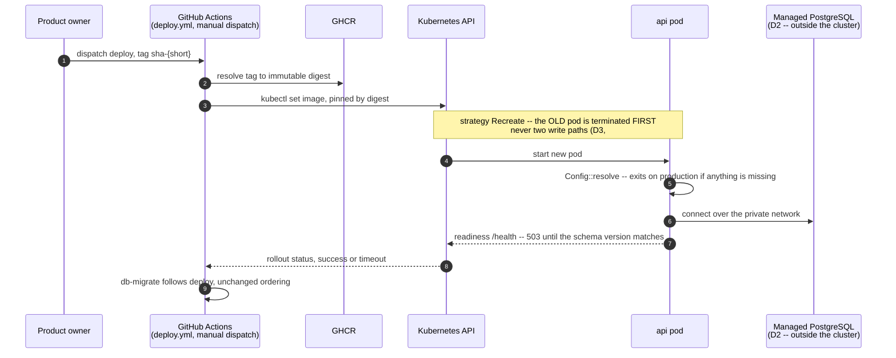
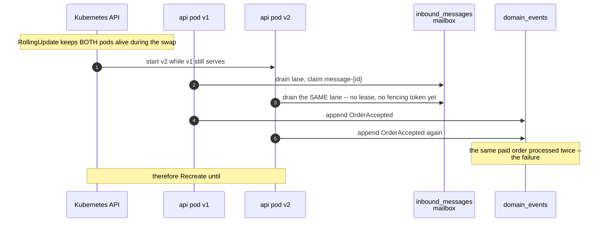

# PROP-20260806-223656 — Kubernetes as the deployment substrate (reopening the destination)

- **Status**: Proposed — reopens [ADR-20260806-151122](../adr/ADR-20260806-151122-hosting-destination-is-clever-cloud-not-ovh.md) (Clever Cloud), at the product owner's direction, 2026-08-06
- **Date**: 2026-08-06
- **Tracking issue**: [#271 "Migrate hosting to Clever Cloud: app compute + PostgreSQL leave Render/Supabase; Supabase retained for identity only"](https://github.com/TheCaptainCompany/captain-food/issues/271)
- **Realized by**: _(filled at completion)_
- **Concerns**:
  - [ ] rolling-deploys-blocked-by-193: the headline benefit cannot be used until [#242](https://github.com/TheCaptainCompany/captain-food/issues/242)'s leases land — a rolling update runs two write-path instances at once, which is exactly what [#193](https://github.com/TheCaptainCompany/captain-food/issues/193) forbids. Approving must state which deploy strategy V0 uses in the meantime.
  - [ ] database-placement-unresolved: an event log holding paid orders must not land in-cluster by default. D2 must be answered explicitly, not inherited.
  - [ ] prod-is-down: the cutover window is an outage. D6 must say whether the cluster is built now or after service is restored.

---

## 1. Why this is reopened

ADR-20260806-151122 chose Clever Cloud one day ago, and its decisive argument was operational
capacity: *"a team of one product owner plus agents should not be operating a PostgreSQL server."*

**That argument rested on a premise about the operator that was wrong.** The product owner has run
Kubernetes professionally at a previous company (stated 2026-08-06). Familiarity is precisely what
converts "operational surface" into "routine", so the largest weight in that decision was
mis-specified. Reopening is the correct response to a corrected premise, not churn.

Three further arguments were raised, and each is independently sound — they are recorded here because
none of them appeared in the original ADR:

- **Ingress as a lightweight API gateway.** The architecture is *role = path* (`/{role}/graphql`) plus
  multi-tenant `Host` routing over `*.captain.food`. An ingress terminates TLS, issues the wildcard
  certificate via cert-manager, routes by host and path, and keeps the application off the public
  internet. A reverse proxy is needed for wildcard TLS **regardless of destination**, so this is a
  capability we must buy somewhere.
- **Lock-in.** The earlier dismissal ("a Dockerfile, env vars and a connection string") was true of the
  app alone and **under-weighted the trajectory**: adopting Clever Tasks for jobs, Cellar for
  attachments and their add-ons for Redis compounds coupling over time. Kubernetes manifests are
  materially more portable.
- **Manifests are declarative, reviewable, version-controlled — and a far better codegen target than
  any PaaS console.** This is the strongest fit with the repo's own doctrine and it strengthens
  **[PROP-20260805-181926](PROP-20260805-181926-host-provisioning-and-configuration-ownership.md) D7**:
  a PaaS cannot accept generated deployment descriptors, a cluster can.

## 2. Decisions surfaced

### D1 — Kubernetes, or the PaaS decided yesterday?

| Option | Pros | Cons |
|---|---|---|
| **OVH Managed Kubernetes (MKS)** ✅ **recommended if D1 goes to k8s** | Control plane **free for life**; **egress free**, including to the internet and (since Jan 2026) object storage — the axis that ended Render, and better than Clever Cloud's metered Cellar bandwidth; mature, GA, not beta; same provider already used for the SMS hook | Worker nodes + **Public Cloud Load Balancer** are billed separately, so ~EUR 18+/month before the database — above the EUR 9.75 Clever Cloud selection. Managed PostgreSQL at OVH was ruled out on cost 2026-08-05, so D2 reopens as a real question |
| Clever Kubernetes Engine (CKE) | Managed, sovereign, integrates with Clever Cloud managed Postgres and Cellar, so D2 answers itself; `clever k8s` CLI | **Public beta** since 2026-04-27 — the wrong risk profile for the system holding paid orders, on a platform being adopted *because* two previous platforms' ceilings bit us |
| Clever Cloud PaaS (the ADR-20260806-151122 decision) | Cheapest verified (EUR 9.75 for an under-specced pair), managed Postgres with backups + PITR, zero infrastructure to operate, **10 TB/month free egress** | Deepening ecosystem coupling (Tasks, Cellar, add-ons); no ingress layer of our own; deployment descriptors cannot be generated from the specs |
| Defer — restore prod on the PaaS, decide later | Fastest path out of the current outage; the digest-pinned image runs unchanged on either, so moving later is a redeploy, not a migration | Two setups instead of one; risks becoming permanent by inertia |

### D2 — Where does PostgreSQL live? (**the hard one**)

| Option | Pros | Cons |
|---|---|---|
| **Managed PostgreSQL alongside the cluster** ✅ **recommended** | The event log is the one asset that cannot be re-derived, and stateful workloads are where Kubernetes is hardest. Backups/PITR/patching stay someone else's job — and measured against today's Supabase free tier, which has **no backups at all**, this is the single largest reliability gain available | Reopens the cost question closed on 2026-08-05, when OVH managed PostgreSQL was ruled out on price. May force a provider split (OVH cluster + a managed database elsewhere) |
| In-cluster PostgreSQL via an operator (e.g. CloudNativePG) | One platform, one bill; the operator genuinely automates backups, failover and PITR | Puts **paid orders and the append-only event log** on the hardest part of Kubernetes, operated solo. A storage-class or node-drain mistake is unrecoverable in a way a stateless pod never is |
| Clever Cloud managed Postgres + OVH cluster | Keeps the good database story while taking the cluster | Two vendors, two bills, **cross-provider network latency on every query** — the private-network property that ruled out two VPS applies here with force |

### D3 — Deploy strategy while [#193](https://github.com/TheCaptainCompany/captain-food/issues/193) caps us at one instance

A rolling update deliberately runs the **old and new pods simultaneously**. That is exactly what #193
forbids until [#242](https://github.com/TheCaptainCompany/captain-food/issues/242)'s leases and
fencing land: two write-path instances means two projectors and two mailbox drains on the money path.
**The headline benefit of Kubernetes is therefore unavailable at V0** — health and liveness probes
still work and are a real gain, but zero-downtime rollout is not.

| Option | Pros | Cons |
|---|---|---|
| **`strategy: Recreate` until #242 lands** ✅ **recommended** | Correct by construction — never two write paths. Honest about the constraint rather than discovering it as double-processed orders | Brief downtime per deploy: the same as today, so no regression, but no improvement either |
| `RollingUpdate` with `maxSurge: 0`, `maxUnavailable: 1` | Uses the native mechanism; one replica at a time | At **one** replica this degenerates to Recreate with extra ceremony |
| `RollingUpdate` now, rely on the mailbox to be safe | The benefit immediately | **Unsafe**: it presumes the fencing #242 exists to build. This is precisely the "oversell and un-accepted orders" failure the domain lens warns about |

### D4 — Ingress and wildcard TLS

| Option | Pros | Cons |
|---|---|---|
| **ingress-nginx + cert-manager, DNS-01 wildcard for `*.captain.food`** ✅ **recommended** | Standard, well-documented, provider-portable. Terminates TLS, routes by `Host` (multi-tenancy) and by path (`/{role}/graphql`), keeps pods unexposed. Solves wildcard TLS, which is required on **every** option including the PaaS | Another component to upgrade. DNS-01 needs a DNS-provider credential in-cluster |
| Traefik | Ingress + gateway features in one, good defaults | A second config idiom to learn beside the manifests |
| Cloud LB straight to the service | Fewest moving parts | No host/path routing, no central TLS, pods effectively exposed — loses the reason for wanting ingress |

### D5 — Are the manifests generated from the specs?

**Recommended: yes — this is the strongest argument for a cluster.** `specs/configuration.yaml` already
declares every env var and its per-profile supplier, `specs/observability.yaml` declares the telemetry
contract, and `c4-l2.yaml` declares the containers. Emitting Deployments, Services, the Ingress and the
env blocks from those makes the cluster **structurally unable to drift from the specs**, which no PaaS
console can offer. This is PROP-20260805-181926 D7 with a target that actually fits: manifests are
declarative data, which is what this codegen is good at.

### D6 — Sequencing, with production down

| Option | Pros | Cons |
|---|---|---|
| **Restore service on the simplest path first, build the cluster deliberately after** ✅ **recommended** | The digest-pinned image runs unchanged on either, so this is a redeploy and not a second migration. Standing up a cluster, DNS, wildcard TLS, secrets and a database restore **simultaneously, under outage pressure** is where avoidable mistakes happen | Two setups; risk the interim becomes permanent (mitigated by this proposal + the tracking issue) |
| Build the cluster now, cut over once | One destination, one setup, no throwaway work — defensible given real k8s fluency | Every unknown lands at once, while the store is shut |

## 3. Screen mockups

**No end-user screens** — this proposal adds no command, query, `View_*` or screen, so there is nothing
for `specs/screens/**` to declare. The operator-facing surface is the deploy and its failure mode:

```
$ kubectl rollout status deploy/api -n captain-prod
Waiting for deployment "api" rollout to finish: 0 of 1 updated replicas are available...

  strategy   Recreate            # D3 -- NOT RollingUpdate: #193 forbids two write paths
  image      ghcr.io/thecaptaincompany/captain-food@sha256:<digest>   # pinned, never a moving tag
  readiness  /health             # schema-version gate: 503 until db-migrate lands
  liveness   /ping
  ingress    *.captain.food -> api:8080   (TLS: cert-manager, DNS-01 wildcard)

deployment "api" successfully rolled out
```

A failed config resolve is the same gate as today (ADR-20260729-010500): the container exits, the
rollout fails visibly, and — because Recreate has already removed the old pod — **the service is down
until it is fixed**. That is a genuine regression versus a PaaS's health-gated swap, and it is the
price of D3's correctness. Worth stating plainly rather than discovering.

## 4. Sequence diagrams

### 4.1 — Deploy on the cluster, digest-pinned, Recreate



### 4.2 — Why RollingUpdate is unsafe before #242



## 5. Drawbacks — why we might regret the whole thing

- **It reverses a one-day-old decision.** Reopening on a corrected premise is right, but a destination
  that changes twice in two days while production is down is itself a risk. D6 exists to contain it.
- **The database question gets *harder*, not easier.** Managed PostgreSQL was ruled out on cost; a
  cluster does not supply one. D2 may end in a provider split or a cost the PaaS did not impose.
- **The headline benefit is deferred.** Rolling deploys — the most cited reason to want Kubernetes —
  cannot be used until #242. What is gained on day one is ingress, probes, portability and generated
  manifests, not zero-downtime rollout.
- **More components to keep current**: ingress controller, cert-manager, the node pool, and each Helm
  chart installed. Convenient to install is not the same as free to own.
- **Cost floor rises** from EUR 9.75 to roughly EUR 18+/month before the database, for a system with
  no live traffic.

## 6. Unresolved questions

Copied to the tracking issue's checklist on approval.

1. **D2's real cost**: price OVH managed PostgreSQL with adequate disk against the cluster, and against
   Clever Cloud's managed plan. This is the number that decides D1 as much as any architectural point.
2. Node pool shape and count — one node is a single point of failure with a free control plane in front
   of it; two changes the economics again.
3. Does the OTel collector run as a cluster DaemonSet/Deployment, or stay in the app process?
4. Secret management: plain `Secret` objects, Sealed Secrets, or an external store? The GHCR image is
   public, so nothing may be baked (PROP-20260729-014500 D5 still binds).
5. Where does `sync-worker` run — a `CronJob`, or does it stay a GitHub Actions schedule as `c4-l2.yaml`
   specifies? Domain deadlines stay in the actor runtime regardless (PROP-20260731-061609 D1 note).
6. Does D5's manifest generation land before or after the first cutover?

## 7. Alternatives considered

| Alternative | Why it lost (or did not) |
|---|---|
| **Keep ADR-20260806-151122 as decided (Clever Cloud PaaS)** | Still the cheapest verified option with the best database story and 10 TB free egress. It loses only if the operator-capacity premise is wrong — which it was. Retained as D1's fallback, not deleted |
| **Kubernetes with in-cluster PostgreSQL** | Rejected as a default in D2: the event log is the one asset that cannot be re-derived |
| **Self-managed k3s on an instance** | Cheaper than MKS and still Kubernetes, but re-acquires the host OS that PROP-20260805-181926 exists to govern — every con in that proposal returns, plus a control plane |
| **Wait for #242, then decide** | Coherent, and would make D3 moot — but production is down now and the destination question cannot wait for a mailbox-runtime milestone |
