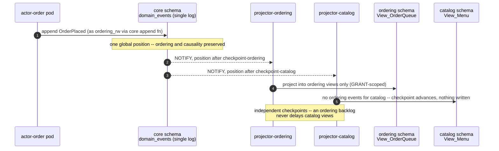

# PROP-20260807-174246 — One decomposition axis: spec folders, per-scope storage, per-scope projectors (screaming architecture)

- **Status**: Proposed
- **Date**: 2026-08-07
- **Tracking issue**: [#374 "One decomposition axis: spec folders per domain, schema-per-domain storage, per-domain projectors"](https://github.com/TheCaptainCompany/captain-food/issues/374)
- **Realized by**: _(filled at completion)_
- **Builds on**: PROP-20260806-223656 (Approved — per-surface/per-actor images, per-scope domain crates via [#373](https://github.com/TheCaptainCompany/captain-food/issues/373)) · ADR-20260807-002705 (MKS + CNPG + GitOps, **start clean**) · ADR-0032/0034 (the DSL is the source of truth)
- **Concerns**:
  - [ ] critical-path-growth: production is DOWN and every directive this week has grown the pre-cutover program. D7 exists to bound this; approving must accept its sequencing consequence explicitly.

---

## 1. Context — the product owner's directive, and what it completes

Product owner, 2026-08-07: spec folders **per business domain** plus a **common** folder, each holding
its own `events.yaml`, `commands.yaml`, `actors.yaml`, `entities.yaml` etc. — *"a business explicit
design… I think it's screaming architecture"* (correct name: Robert C. Martin's). Also: **a database
per business domain** (*"I'm thinking about OrderDb… help me find the right split"*), the same split
for `configuration.yaml`, **projectors per business domain or per database**, and the question *"can
we do cross-database query for admin reasons?"*.

This completes a chain built across 2026-08-06/07: per-surface images → per-actor images → per-scope
generated crates ([#373](https://github.com/TheCaptainCompany/captain-food/issues/373)). What was
missing was the TOP of the chain (the spec files themselves scream the domains) and the BOTTOM
(storage boundaries). After this proposal, ONE axis of decomposition runs the whole stack, every
layer derived from the one above it:

```
specs/{scope}/**  →  domain-{scope} crate  →  actor-{scope} image  →  {scope} schema  →  {scope} projector
```

A boundary violation is then visible (folder), unspellable (crate link), undeployable (image),
and unqueryable (GRANT) — the same wall, four times, all generated.

## 2. The scope list itself (the "right split" the product owner asked for)

Scopes should be **bounded contexts, not one-per-aggregate** — the evidence is the process managers:
a PM that spans aggregates is the spec telling us those aggregates belong to one business
conversation. Proposed split, from `actors.yaml`/`processmanager.yaml` coupling:

| Scope | Aggregates / PMs | Why this boundary |
|---|---|---|
| **ordering** | `Cart`, `Order`, `PlaceOrderProcess`, `CartBindingProcess`, `OrderErasureProcess` | Cart→Order is one conversation (the PMs prove it); the money path lives here |
| **catalog** | `Catalog` (+ products/offers/option lists) | HubRise-aligned, import-heavy, changes independently of orders |
| **network** | `RestaurantAccount`, `Restaurant`, `Prospect` (+ SIRENE inbound) | Restaurant lifecycle + prospection — the supply side |
| **customer** | `Customer` | Identity-adjacent, GDPR-erasure center of gravity |
| **delivery** | `DeliveryJob`, `DeliveryDispatchProcess` (+ rider surfaces) | Distinct partners, distinct SLAs |
| **payments** | `RefundProcess`, tips/ledger, Stripe ACL boundary | Integration-heavy; PMs here legitimately span into ordering |
| **comms** | Order conversations / messaging | Its own growth path (attachments, PROP-20260725-120055) |
| **common** | `Money`, `Address`, `TaxRate`, shared scalars, error catalog | The kernel — changes here ripple everywhere, correctly |

Cross-scope PM edges (e.g. `PlaceOrderProcess` → payments port) are DECLARED edges in the `$ref`
graph — allowed, DAG-checked, and visible. The [#373](https://github.com/TheCaptainCompany/captain-food/issues/373)
cycle rule now has a filesystem face: a ref from `specs/ordering/` into `specs/catalog/` is an edge
you can see in a diff.

## 3. Decisions surfaced

### D1 — Spec folders per scope + common

| Option | Pros | Cons |
|---|---|---|
| **`specs/{scope}/{events,commands,entities,actors,errors,tests,rules}.yaml` + `specs/common/`** ✅ | The design screams the business; folder graph = crate graph = deploy graph (one mental model); scope membership stops being implicit; per-scope diffs review cleanly | Big mechanical migration: loader + every `$ref` path + validator placement rules; one-time churn across all open work |
| Keep flat catalogs, add a `scope:` field per item | Tiny diff | The scream stays a whisper — membership is metadata nobody sees in a tree view; folder/crate/deploy graphs stay misaligned |

**Validator additions (the gates that make D1 real)**: an item defined in `specs/{scope}/` belongs to
that scope's actors (placement rule); cross-scope `$ref`s form a DAG (#373's rule, now
filesystem-visible); `common/` may not reference any scope (kernel purity).

### D2 — The storage split: what "a database per domain" should mean at V0 (**the hard one**)

Postgres facts that decide this: **cross-DATABASE joins are not native** (a connection sees one
database; `postgres_fdw`/`dblink` bolt them on, slowly, with their own operational surface), while
**cross-SCHEMA joins inside one database are plain SQL** — and schemas take per-role `GRANT`s, so
isolation is enforceable without losing queryability.

| Option | Pros | Cons |
|---|---|---|
| **Schema-per-scope in ONE CNPG database, per-scope ROLES** ✅ **recommended now** | Real, GRANT-enforced boundaries (each `actor-{scope}` pool connects as `{scope}_rw`, `search_path={scope},common` — DB-layer compiler-first); admin cross-scope queries are ordinary SQL under a read-only `admin_ro` spanning schemas; ONE backup/PITR timeline for the whole business (a cross-scope restore is consistent by construction); **start-clean makes this FREE at cutover** — no data migration, the schemas are just created; fits the 1 Gi CNPG budget | Shared physical resources (one buffer pool, one WAL) — a hot scope can pressure others until the next rung; "database per domain" purists will note it is one database |
| A DATABASE per scope in the CNPG cluster (`OrderDb`, …) | Stronger isolation optics | **Kills admin cross-scope SQL** (FDW required — slow joins, another moving part); N backup configs and N PITR timelines whose cross-restore is NOT mutually consistent; connection pools multiply per database; buys little real isolation while it is all one Postgres process anyway |
| A CLUSTER per scope | True resource + failure isolation | ~N× the memory of the single 1 Gi instance on a node budget just fought down to €38/mo; absurd at V0 — this is the LAST rung of the ladder, not the first |

**The ladder (consistent with every other ladder this week)**: schemas now → lift a hot scope to its
own database when contention is measured → own cluster when scale pays for it. Rungs are climbable
per-scope, and the per-scope ROLES mean application code never notices a lift (the connection string
changes, the SQL does not — provided cross-scope JOINs are confined to admin/BAM, which D4 enforces).

**D2 REVISED after product-owner pushback (2026-08-07: *"I don't like heavy responsibility or too
many responsibilities on one database… we will find a way to expose the data from graphql… I know
from experience that having a database with multiple purposes [ends badly]"*).** The experience is
the **integration-database antipattern** — and the subtler resource form of it (the money path and
analytics sharing one buffer pool) is real even with clean ownership. The pushback is accepted, and
it sharpens the design along a different axis than "one database per scope": **split by
RESPONSIBILITY first, because the two responsibilities have opposite recovery postures**:

| Database (same CNPG cluster) | Holds | Purpose — singular | Recovery posture |
|---|---|---|---|
| **`captain-core`** | `domain_events` + `inbound_messages` only | Be the truth | **Irreplaceable**: WAL archiving, PITR, the weekly rehearsed restore — all backup budget goes HERE, and only here, so backups are small and drills are fast |
| **`captain-views`** | All per-scope schemas of `View_*` + `admin` + `bam` | Serve reads | **Rebuildable**: restore = REPLAY from core. Excluded from backups entirely — backing up derived state is spending recovery budget on what regenerates itself |

**No native cross-database join is ever needed in this shape** — which is what makes it viable
despite Postgres's cross-DB limitation: projectors read core and write views on two connections;
GraphQL reads views only; **cross-scope exposure happens via projections and GraphQL composition**
(the product owner's instinct, and D4's design) — the admin surface reads its own consumer schema,
never joins across scopes. `admin_ro`/`claude_ro` cross-schema SQL is demoted from an application
path to **incident tooling**. Because no SQL ever crosses a scope boundary, lifting any scope's
schema — or all of `captain-views` — to its own database or cluster later is a connection-string
change, not a code change: the product owner's target end-state stays reachable by pure config,
paid for when measured contention or revenue says so.

### D3 — The event log stays SINGLE (in a `core` schema)

The product owner's split instinct is right for read models and state; the **append-only log is the
one thing that must not split yet**: global ordering underpins projector checkpoints, cross-scope PM
causality (`PlaceOrderProcess` reacting across ordering/payments), transactional enqueue beside the
mailbox, and the GDPR erasure path (ADR-20260731-160000) — all of it single-timeline today. Per-scope
logs are a real future (per-scope `domain_events` partitions are the intermediate), but splitting the
log now would re-derive Kafka's hardest problems on day one of a one-city launch. `core` holds
`domain_events` + `inbound_messages`; only infrastructure roles touch it.

### D4 — Projectors: per SCOPE, over the single log

One projector Deployment per scope (`projector-ordering`, …): consumes the single log **filtered to
its scopes' events**, maintains ONLY its schema's `View_*`, owns its OWN checkpoint. An ordering
backlog at Friday peak no longer delays catalog or network views; a projector bug replays one scope,
not the world. Views that genuinely need cross-scope data (admin dashboards, BAM) are **consumers,
not joiners**: they live in `admin`/`bam` schemas fed by their own projector, reading the log — never
cross-schema joins inside a scope's views (the validator's existing `view-fedby`/source rules extend
to enforce schema locality).

### D5 — `configuration.yaml` splits the same way

`specs/{scope}/configuration.yaml` for scope-owned keys (each actor image's generated `Config` reads
ONLY its scope's + common's keys — the fail-fast report shrinks to what the pod actually needs) +
`specs/common/configuration.yaml` for platform keys (DB, telemetry, identity). The drift test
(`env::var` ↔ declaration) now also catches a pod reading another scope's key.

### D6 — Admin cross-scope access (the product owner's question, answered)

**Yes — trivially, because D2 chose schemas**: `admin_ro` (SELECT-only, all scope schemas + `core`)
serves ad-hoc admin SQL and my `claude_ro` diagnosis role; the admin SURFACE (`bo-admin`) reads its
own `admin` schema views (D4), not raw cross-schema joins. If a scope is later lifted to its own
database (D2's ladder), `postgres_fdw` restores admin SQL at that rung's cost — one more reason the
lift happens only when measured contention pays for it.

### D8 — GraphQL per domain: federation at CODEGEN time, not a runtime router

Raised by the product owner (2026-08-07): *"creating a graphql per domain and merge them in one
graphql that will use the others"* — the approach is **GraphQL federation** (subgraphs → supergraph;
the older form was schema stitching) — *"it will remove the risk of AI making shortcuts because
everything is accessible."*

| Option | Pros | Cons |
|---|---|---|
| **Per-scope `specs/{scope}/api.yaml` fragments, composed by the CODEGEN into the per-role schemas** ✅ recommended | The shortcut risk lives at the spec/resolver layer here (the schema is GENERATED — nobody hand-edits SDL), and this closes it with validator rules: a fragment exposes only its scope's types; cross-scope references only along the `$ref` DAG; every composed field resolves to the owning scope's views/commands. Zero new runtime: no router hop on the Friday-peak path, no composition failures at 20:30, no entity-resolution N+1. Role = path serving is unchanged — a role's schema legitimately composes domains, in the generator, with provenance | Not "real" federation: no independent schema cadences (irrelevant with one spec repo), no polyglot subgraphs (irrelevant in a one-workspace system) |
| Runtime federation (async-graphql Federation v2 subgraph per scope + Apollo Router/Cosmo) | The industry-standard shape; independent deploy cadence per subgraph schema | Built for MANY TEAMS: a router on every query, N subgraph services on a €38/mo node budget, supergraph composition as a new CI failure class, N+1 entity resolution — all to enforce boundaries the spec/crate/GRANT walls already enforce. **Recorded trigger to adopt**: a second independent team, a polyglot service, or an external partner consuming a subgraph directly |
| One flat api.yaml as today | No migration | The API layer stays the one layer whose scope membership is implicit — the scream stops at the schema |

With D8 the AI-shortcut concern is closed by four walls at once: **visible** (fragment file),
**unspellable** (crate link), **unqueryable** (schema GRANT), **un-declarable** (validator-rejected
cross-scope field).

**D8 REVISED after product-owner pushback (2026-08-07: *"if we don't create a graphql per domain we
will over-responsible the graphql — too many entry points and access to many domains"*; the merge
approach he recalled is closest to SCHEMA STITCHING — a gateway that "uses the others using
graphql").** The responsibility argument is accepted — it is the integration-database antipattern at
the API layer, the same axis that revised D2 — and a CQRS fact makes his version far cheaper here
than classic federation costing suggested: **in this system, cross-domain composition already
happens in the PROJECTOR** (denormalized `View_*` embed cross-scope data at projection time), so the
query-time graph is a set of nearly flat per-domain trees, and **entity resolution / N+1 / dynamic
query planning — federation's real costs — simply do not arise**. Revised shape:

- **`graphql-{scope}` services, generated from `specs/{scope}/api.yaml`**: each single-purpose —
  queries read ONLY its scope's `captain-views` schema (GRANT-scoped role), mutations ONLY enqueue
  its scope's commands to the mailbox. One domain, one graph, one grant.
- **A thin generated GATEWAY per role path** (serving `/{role}/graphql` unchanged): **no database
  access, no business logic, no state** — it routes TOP-LEVEL fields to the owning subgraph from a
  **composition table emitted at codegen** (static stitching: no runtime discovery, no query
  planner; composition failures are build failures, not 20:30 incidents).
- **New validator rule guarding the cheapness**: a role schema's nested types must be intra-scope —
  cross-scope data appears only at top level or pre-joined in a projector-owned view. "Composition
  happens in the projector, not the query" becomes a gate, not a convention.
- The surface bins (`fo-*`, `bo-*`) serve assets/SSR and speak to their role's gateway; **no surface
  binary holds broad views access any more** — the product owner's "too many entry points" concern
  closed structurally.
- Cost: ~8 subgraph pods + gateways are small Rust bins (~64–96 Mi each); fits the two-node budget.
  The codegen-time-only option remains recorded above as the rejected-but-cheaper alternative.

### D7 — Sequencing against the cutover (the registered concern)

| Option | Pros | Cons |
|---|---|---|
| **Spec reorg (D1/D5) + schemas (D2/D3/D4) all PRE-cutover** ✅ recommended | Start-clean makes the storage split literally free (schemas are created, nothing migrated) — this window does not recur; the generator work (#373 + the emitters) has to touch every ref anyway, so one migration instead of two; the vision ships whole, per the product owner's stated preference | The pre-cutover program grows again (est. several more sessions); production stays down for all of it |
| Cutover on the current flat layout, reorg after | Shortest path to serving traffic | The storage split then requires a LIVE data migration — the exact work start-clean deletes; two spec migrations instead of one; an "intermediary" the product owner has explicitly rejected twice |

## 4. Screen mockups

**Not applicable — no end-user screens.** The operator surface is the schema layout and the grants:

```
captain (CNPG database)
├── core        domain_events · inbound_messages          [infra roles only]
├── common      (reference data if any)
├── ordering    View_OrderQueue · View_CartSummary …      [ordering_rw · projector-ordering]
├── catalog     View_Menu · View_ProductAvailability …    [catalog_rw  · projector-catalog]
├── network     View_RestaurantDirectory …                [network_rw  · projector-network]
├── customer / delivery / payments / comms                [{scope}_rw  · projector-{scope}]
├── admin       cross-scope views for bo-admin            [admin projector · admin_ro]
└── bam         business-activity views                   [bam projector]
```

## 5. Sequence diagram — per-scope projection over the single log



## 6. Drawbacks — why we might regret the whole thing

- **The pre-cutover program grows again.** Four directives in two days have turned "restore prod"
  into a platform re-architecture executed while the store is shut. Every piece is coherent; the sum
  is weeks. D7 and the registered concern exist so this is chosen, not drifted into.
- **Eight scopes is a bet on today's domain map.** Scope boundaries wrong = cross-scope refs
  everywhere = the DAG rule fights you. Mitigation: boundaries follow the PMs (the spec's own
  coupling evidence), and folder moves + regeneration are mechanical if a boundary must shift.
- **The kernel is a shared blast radius by design** — a `Money` change rebuilds and redeploys
  everything, and no split removes that honestly.
- **More generated surface** = more emitter code to keep correct; the validator rules (placement,
  DAG, schema locality) are the counterweight, per compiler-first.

## 7. Unresolved questions

1. Exact scope membership for edge cases: SIRENE mirror (network vs its own `ingest` scope), files
   (comms vs own scope), tips (payments vs ordering).
2. Migration tooling: per-schema migration directories vs one directory with schema-qualified DDL
   (db-migrate ordering with per-scope projectors).
3. Does `bam` stay one projector or split per scope too (its views are inherently cross-scope)?
4. The per-scope `Config` reader: one generated struct per bin (preferred) or a filtered view over
   one struct?

## 8. Alternatives considered

| Alternative | Why it lost |
|---|---|
| Keep flat specs, split only crates (#373 as-is) | The design stops screaming exactly at the layer humans read first; scope membership stays implicit in catalogs |
| True database-per-domain now (`OrderDb` …) | Kills admin SQL (the product owner's own requirement), N inconsistent PITR timelines, FDW as day-one infrastructure — the LAST rung taken first |
| Split the event log per scope now | Re-derives distributed-log ordering/causality problems at one-city scale; the log is the asset that must not be experimented on |
