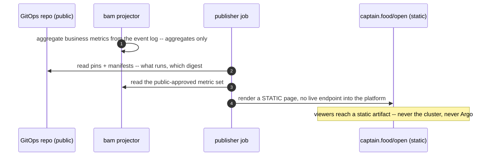

# PROP-20260807-190936 — Build in public: platform transparency as a product asset

- **Status**: Proposed
- **Date**: 2026-08-07
- **Tracking issue**: [#377 "Build in public: transparency levels, public status/dashboards, what stays closed"](https://github.com/TheCaptainCompany/captain-food/issues/377)
- **Realized by**: _(filled at completion)_
- **Concerns**:
  - [ ] pii-and-gdpr: nothing person-level ever becomes public — aggregates only, and the DPO-hat review of each exposed surface is part of realization, not an afterthought.
  - [ ] attack-surface: transparency exposes INFORMATION, never CONTROL or live operational endpoints.

## 1. Context

Product owner, 2026-08-07: *"I want to make the platform completely transparent for the people.
Kubernetes completely open. Because of transparency and also to show the strong quality of the
product — repercussions for recruitment, press, marketing, personal and company branding."*

This is the build-in-public strategy, and this repository is unusually well positioned for it:
**most of the transparency already exists as a side effect of the operating model.** The repo is
public; every decision is an ADR; every option space is a proposal; the deploy ledger is git
(`{digest, source_hash}` pins — who shipped what, when, forever); the manifests are generated and
public by construction (GitOps); CI is public. The initiative is therefore mostly about *curating a
front door* onto what exists, plus a small set of new public surfaces — and drawing the line
precisely.

## 2. The transparency levels

| Level | What | Status |
|---|---|---|
| **L1 — The record** (code, specs, ADRs, proposals, deploy ledger, CI, manifests) | Already public | ✅ exists — needs a front door (README curation, an "architecture tour" doc) |
| **L2 — Live health** | Public status page: uptime, incident history, post-incident reports (the sessions.md discipline, public-facing) | 📋 new — small |
| **L3 — Live business aggregates** | Public dashboard: orders/day, restaurants live, p95 checkout latency — **aggregates only, never person-level** | 📋 new — deliberate GDPR review per metric |
| **L4 — Cluster state, read-only** | Public read-only view of Deployments/versions/rollouts (e.g. a generated, sanitized state page — NOT the Argo UI itself) | 📋 new — the "Kubernetes completely open" ask, delivered as information |
| **✋ Never** | Cluster API/Argo UI/kubeconfigs (control), secrets (sealed but unlisted), person-level data (GDPR), Honeycomb raw traces (PII in payloads), webhook endpoints' internals | Closed by design |

The line, stated once: **transparency exposes information, never control.** "Kubernetes completely
open" is delivered as a continuously-published, sanitized view OF the cluster (generated from the
same GitOps state that is already public), not as network reach INTO it.

## 3. Mockup — the public front door

```
  captain.food/open                                    [Build in Public]
  ─────────────────────────────────────────────────────────────────────
  ● All systems operational          uptime 99.7% (30d)   incidents: 2
  ─────────────────────────────────────────────────────────────────────
  This week          orders 212 ▲    restaurants live 14   p95 checkout 480ms
  Running now        fo-storefront sha-4be9330 · actor-order sha-4be9330 · …
                     (the deploy ledger is public: github.com/…/deploy/pins)
  How it's built     8 domains · event-sourced · every decision is an ADR →
  Post-incidents     2026-08-02 mailbox poison loop — what broke, what we changed →
```

## 4. Flow — how the public view is produced (information, not access)



## 5. Decisions surfaced

| # | Decision | Recommendation |
|---|---|---|
| D1 | Levels adopted | L1–L4 as above; the ✋ row is non-negotiable |
| D2 | L3 metric set | Start with 3 (orders/day, restaurants live, p95 checkout); every addition gets a one-line GDPR note in the PR |
| D3 | L4 mechanism | A generated static state page from GitOps + a publisher job — never a proxied live UI |
| D4 | Sequencing | L1 front-door doc any time (docs-only); L2–L4 AFTER cutover — publishing the platform's health starts when there is a platform |

## 6. Drawbacks

- Public metrics cut both ways pre-PMF: 212 orders/week is a proud number to some audiences and a
  small one to others. The product owner is choosing the build-in-public bet with open eyes.
- Every public surface is a maintenance promise; a stale "open" page is worse than none.
- Post-incident reports take writing discipline — though sessions.md proves the habit exists.

## 7. Alternatives considered

| Alternative | Why it lost |
|---|---|
| Actually-open cluster access (public read-only kubeconfig / Argo UI) | Control-adjacent surface, CVE-of-the-week exposure, secrets metadata visible — transparency of INFORMATION achieves the goal without it |
| Transparency by blog posts only | Loses the "live and verifiable" quality that makes build-in-public credible — the ledger and status must be mechanical, not narrated |
