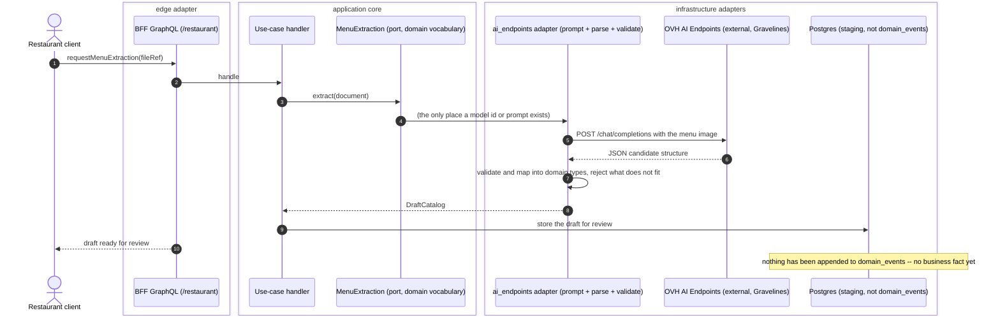
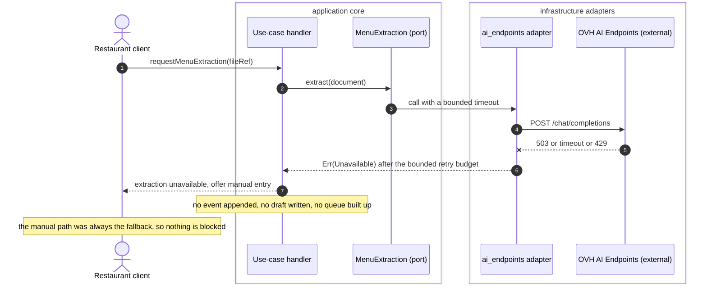

# PROP-20260807-202428 — AI inference is an enrichment at the edge, never a decider

- **Status**: Proposed
- **Date**: 2026-08-07
- **Tracking issue**: [#379 "Where may a model act? AI has no declared boundary, and the paid-order path must never depend on one"](https://github.com/TheCaptainCompany/captain-food/issues/379)
- **Realized by**: _(filled at completion — ADR + PR)_
- **Concerns**:
  - [ ] `data-residency-in-writing`: the AI Endpoints product page advertises *"worldwide availability (non-EU)"* for the base tier while the docs place the service in Gravelines (FR). Nothing leaves the cluster until OVH confirms the processing region and sub-processor list in the DPA, in writing.
  - [ ] `peak-blast-radius`: no inference call may exist on any path a customer can trigger between "pay" and "the restaurant is told" — this must be provable, not asserted.
- **Related**: [ADR-20260807-002705](../adr/ADR-20260807-002705-hosting-ovh-mks-cnpg-gitops.md) (OVH MKS is the substrate, so inference is same-account and same-region) · [ADR-20260803-234035](../adr/ADR-20260803-234035-compiler-first-a-check-is-the-fallback.md) (compiler first, a check is the fallback) · [PROP-20260802-130500](PROP-20260802-130500-isolation-by-construction.md) §1 (the enforcement hierarchy this borrows) · [PROP-20260807-202500](PROP-20260807-202500-menu-to-catalog-onboarding.md) (the first use case, [#380](https://github.com/TheCaptainCompany/captain-food/issues/380)) · [#184 "Allergens do not exist in the model"](https://github.com/TheCaptainCompany/captain-food/issues/184)

> Living document (ADR-20260801-020000) — it holds the CURRENT state of the design. History is in `git log -p` on this file.

---

## TL;DR

We are about to have a cheap, EU-resident, OpenAI-compatible inference API on the account we already
host on. The useful question is not *"can we call a model"* — it is *"where is a model allowed to be
wrong"*. This proposal answers that once, so every later use case inherits it instead of relitigating
it.

Five decisions, one sentence each:

- **D1** — take **OVHcloud AI Endpoints** as the inference provider, because it is same-account,
  EU-resident and OpenAI-compatible, and because switching costs nothing when the port is
  use-case-shaped.
- **D2** — **no generic `LlmPort`.** Each use case declares a narrow capability port in `application`
  (`MenuExtraction`, later `SemanticSearch`), and the model, the prompt and the vendor SDK live
  entirely inside one `crates/adapters/*` ACL — exactly the rule that keeps `SKU` and `"9.80 EUR"`
  out of the domain.
- **D3** — a **forbidden set** that a test enforces: nothing on the paid-order path, nothing that
  authors a legal declaration, nothing that produces the customer-facing ETA, no generated imagery of
  food.
- **D4** — inference is **best-effort**: every caller has a defined answer to "the model returned
  nothing", and no command's success ever depends on a model responding.
- **D5** — **zero content leaves the cluster until the DPA is read**, and what does leave is
  restaurant catalog content, never customer PII.

## 1. Context

### What is actually on offer

OVHcloud's `AI & Machine Learning` menu is two unrelated families:

| Product | What it is | Relevance |
|---|---|---|
| **AI Endpoints** | Serverless inference. ~40 open-weight models, **OpenAI-compatible REST**, pay-per-token, deployed from **Gravelines (FR)**, zero data retention, 99.5% SLA, 400 req/min base tier, a ~50% cheaper Batch tier | The only one worth anything to us now |
| **AI Notebooks / Training / Deploy** | GPU rental by the minute, bring your own Docker image, wired to OVH Object Storage | Nothing in V0 needs it. Revisit if we ever train an ETA model on our own event log |
| **Quantum (Emulators, QPUs)** | QPU access | Not applicable |

Price anchors that decide what is affordable: embeddings **€0.01/Mtoken** (`bge-m3`, multilingual),
`gpt-oss-20b` €0.04 in / €0.15 out, `Qwen2.5-VL-72B` (vision) €0.91, `Whisper-large-v3-turbo`
≈ €0.0000128/second. A restaurant menu costs **around one cent** to read.

### Why the boundary has to be decided before the first call

Three facts of this domain make an inference call something other than a library call:

1. **A paid order that nobody is told about is the worst failure mode there is.** A 99.5% SLA is
   ~3.6 hours of unavailability a month. That is unremarkable for onboarding and unacceptable
   between "pay" and "the restaurant is told".
2. **The ETA is the product.** It is a regression over our own `domain_events` (prep time by
   restaurant × hour × basket size), not a language task. A model asked to *guess* minutes is worse
   than a constant, because a constant is honest about being a constant.
3. **Some outputs are legal declarations, not content.** Under FIC 1169/2011 the restaurateur is the
   declarer of allergens. A model may help them fill the form; it may not *be* the declaration.
   [#184](https://github.com/TheCaptainCompany/captain-food/issues/184) is still deciding the model
   itself (open decision **D** in [DECISIONS.md](DECISIONS.md)), and this boundary must not
   pre-empt it — only fence it.

### What exists today

Nothing. `llm`, `inference`, `embedding` and `openai` return zero hits repo-wide; there is no port, no
adapter crate, no spec surface. The slate is clean, which is the cheapest moment to draw the line.

## 2. Recommended approach

```
application/                 port: trait MenuExtraction { async fn extract(&self, doc) -> Result<DraftCatalog> }
   ^                               (domain vocabulary only -- no prompt, no model id, no token)
   |
infrastructure/
crates/adapters/ai_endpoints/  the OpenAI-compatible HTTP client + prompt + response parsing
                               + the ACL that maps a model's JSON into DraftCatalog
```

The shape is deliberately the **HubRise shape**. HubRise does not get a generic `PosPort`; it gets an
ACL that turns `"9.80 EUR"` into `Money` and refuses to let the vendor's vocabulary past the boundary.
An inference provider is the same kind of neighbour, with one extra property: **its output is
untrusted by construction**, so the ACL is also a validator.

Everything ships behind an env toggle, default off, per gate-then-stabilize; flipping the default is a
separate one-line ADR after the gated form has been smoked.

## 3. Decisions surfaced

### D1 — Provider

| Option | Pros | Cons |
|---|---|---|
| **OVHcloud AI Endpoints** ✅ **recommended** | Same account and region as the cluster we just chose — no new non-EU sub-processor, no transfer assessment, one bill; OpenAI-compatible so the adapter is a plain HTTP client; zero data retention; cheap enough that cost never enters a product decision | Smaller model catalogue than the frontier vendors; 400 req/min base tier; a young product whose regional wording is currently ambiguous (see Concerns) |
| Mistral (EU, La Plateforme) | EU vendor, strong French-language models | A second vendor relationship, a second DPA, a second bill, for no capability we need |
| OpenAI / Anthropic direct | Best-in-class extraction quality | Non-EU processing to justify for restaurant content, a transfer assessment, and a dependency graph the hosting decision just spent three rounds simplifying |
| Self-host on **AI Deploy** or in-cluster | Total control, no per-token cost | GPU rental billed per minute plus the ops to keep it alive, for a workload measured in cents per month. Wrong shape at V0 |

Because D2 keeps the vendor inside one adapter crate, this decision is **cheap to reverse** — which is
itself the argument for taking the convenient option now.

### D2 — Port shape

| Option | Pros | Cons |
|---|---|---|
| **Narrow capability port per use case** ✅ **recommended** | `application` speaks `extract(menu) -> DraftCatalog`, never "chat"; prompts, model ids, tokens and retries stay in the adapter; each use case's failure mode is typed at its own boundary; swapping vendors touches one crate | One small port per use case instead of one shared one |
| A generic `LlmPort { complete(prompt) -> String }` | One abstraction for everything | Puts prompt engineering in the application layer and an untyped `String` where a domain type belongs. This is the `SKU`-leak failure in a new costume — it would let vendor vocabulary reach the core |
| Call the HTTP API from wherever it is needed | Fastest to write | No seam to test against, no seam to gate, no seam to swap. Violates the dependency rule outright |

### D3 — The forbidden set, and how it is enforced

The rule: **a model may propose to a human, or enrich a read model. It may never author a business
fact, a legal declaration, or a customer-facing promise.** Concretely forbidden:

| Forbidden | Why |
|---|---|
| Any call on the path from `PlaceOrder` to the restaurant being told | 99.5% and 400 req/min against Friday 19:00–21:30, where the failure mode is a paid order nobody sees |
| Producing or adjusting the customer-facing **ETA** | The ETA is the product, and it is a regression on our own log, not a language task |
| Authoring the **allergen declaration** | The restaurateur is the legal declarer (FIC 1169/2011). Pre-fill is a UI affordance; the declaration is a human act |
| Generated imagery of food | Showing a dish the kitchen never plated is misrepresentation and a reclamation generator |
| Anything that emits a domain event without a human or a deterministic rule in between | An event is a business fact. A model's opinion is not one |

| Enforcement option | Pros | Cons |
|---|---|---|
| **Cargo.toml capability allowlist — only `crates/adapters/*` may depend on the inference client** ✅ **recommended** | Rides the mechanism [PROP-20260802-130500](PROP-20260802-130500-isolation-by-construction.md) D3 already built and tests; a violation fails at the manifest, not at review; cheap and total for the *reachability* half | Does not by itself express "not on the order path" — that needs the port's absence from the order crates, which the same allowlist gives |
| A prose rule in CLAUDE.md | Free | Prose can be ignored. [#329](https://github.com/TheCaptainCompany/captain-food/issues/329) is the cautionary tale — 191 lines of scanner over a boundary types already held |
| A source-text scanner for the forbidden calls | Catches direct calls anywhere | The exact anti-pattern ADR-20260803-234035 was written against: a scanner where a manifest boundary already answers |

### D4 — Failure posture

| Option | Pros | Cons |
|---|---|---|
| **Best-effort: every caller declares its no-answer behaviour, and no command depends on inference** ✅ **recommended** | The provider can be down for a day and the platform sells food; degradation is visible and local | Every call site must design its empty state, which is work |
| Retry until it answers | Simple mental model | Turns a 3-hour vendor outage into a 3-hour queue backup, and a rate-limit into a self-inflicted DDoS |
| Fail the operation | Honest | Makes a restaurant's onboarding hostage to a third party for a feature that is pure convenience |

Concretely for the first use case: extraction unavailable means the upload screen says so and offers
manual entry — the same screen the restaurateur would otherwise have used.

### D5 — What is sent and what is kept

| Option | Pros | Cons |
|---|---|---|
| **Restaurant catalog content only, no customer PII, retention as short as the use case allows** ✅ **recommended** | A menu is public commercial information the restaurant already prints; the GDPR surface is close to nil | Requires each future use case to justify its payload rather than inheriting a blanket permission |
| Anything the use case finds convenient | No friction | The first use case that sends an order conversation ships customer PII to a processor nobody assessed |

The provider's zero-data-retention and no-training claims are load-bearing here and belong in the DPA,
not in a marketing page — hence the named concern.

## 4. Screen mockups

**Use case A — inference is unavailable (restaurant back office).** The degraded state is the one
that must be designed first, because D4 makes it routine rather than exceptional.

```
+----------------------------------------------------+
| Import your menu                                   |
+----------------------------------------------------+
|  (!) Automatic menu reading is unavailable right   |
|      now. You can still add your dishes yourself,  |
|      and try the import again later.               |
|                                                    |
|      [ Add dishes manually ]   [ Try again ]       |
+----------------------------------------------------+
```

Both controls are live: `Add dishes manually` navigates to the catalog editor
([#171](https://github.com/TheCaptainCompany/captain-food/issues/171)), `Try again` re-runs the
extraction. Nothing here renders a control bound to a gap — the CLAUDE.md rule that a control which
renders but does nothing is worse than no control.

**Use case B — spend and health (system back office).** Cost per extraction is cents, so the reason
to show it is not the money — it is that an unmetered third-party call is how a surprise bill and a
silent outage both arrive.

```
+----------------------------------------------------+
| AI inference                          [ enabled ]  |
+----------------------------------------------------+
| Provider   OVH AI Endpoints - Gravelines (FR)      |
| Capability menu_extraction          gate: ON       |
|            semantic_search          gate: OFF      |
+----------------------------------------------------+
| Last 30 days                                       |
|   calls          412      failures      3          |
|   p95 latency    4.1 s    rate-limited  0          |
|   spend          EUR 3.87                          |
+----------------------------------------------------+
```

Bound to the observability contract, not to a new aggregate — this is a read model over telemetry.

## 5. Sequence diagrams

**Flow 1 — an enrichment call, hexagon-faithful.** The port is called from the application layer, the
adapter owns the vendor, and the result reaches a human before it reaches the log.



**Flow 2 — the provider is down.** The point of the diagram is what does NOT happen: no retry storm,
no failed command, no partial write.



## 6. Drawbacks

Even if every decision above is right, we might regret the whole thing:

- **A new third-party dependency at exactly the moment the hosting decision simplified the graph.**
  ADR-20260807-002705 landed after three rounds of destination churn; adding a vendor two weeks later
  is a fair thing to be uncomfortable about.
- **Non-determinism enters the product.** Every extraction is a fresh sample; two runs over the same
  menu can differ. The review step contains it, but "it worked yesterday" stops being evidence.
- **The forbidden set is a promise about the future**, and the pressure to break it will come from a
  good idea ("just have it draft the ETA"), not a bad one. A manifest gate holds the reachability
  half; the judgement half stays human.
- **Cost is invisible until it is not.** A cent per menu is nothing; an unmetered loop is not.
  Metering is in the mockup for a reason.
- **A capability we build for onboarding tends to grow toward the order path**, which is precisely
  where it must never go.

## 7. Unresolved questions

- **U1** — Does the DPA place AI Endpoints processing in the EU for the base tier, and who are the
  sub-processors? (Named concern; blocks any real content leaving the cluster.)
- **U2** — Does the gate live in `specs/` (a spec-level `activations` entry, visible to the validator)
  or purely in runtime config? The screens DSL already gates client surfaces
  ([ADR-20260802-170059](../adr/ADR-20260802-170059-client-surface-is-spec-gated.md)) — consistency
  argues for the spec.
- **U3** — Do inference calls get an observability contract in `specs/observability.yaml`, or are they
  too peripheral to be a critical workflow? (The metering panel implies yes.)
- **U4** — Is there any case for the Batch tier at V0, or is everything interactive?
- **U5** — Does `RESTAURANT_ACCOUNT` get to trigger inference directly, or only `ADMIN` during an
  assisted onboarding? (Interacts with D5 of [PROP-20260807-202500](PROP-20260807-202500-menu-to-catalog-onboarding.md).)

## 8. Verification plan

- The Cargo.toml capability allowlist test is extended so the inference client is depended on by
  `crates/adapters/*` **only** — a violation fails `make rust`, not review.
- A behaviour test per capability covers the unavailable path: the command still succeeds, or fails
  cleanly with nothing written, per D4.
- `make validate` stays **0 errors and no new warning** against `main`'s baseline.
- No `specs/**` change lands from an execution loop — the port surface, if it becomes spec-visible
  (U2), is a plan-mode change with approval.
