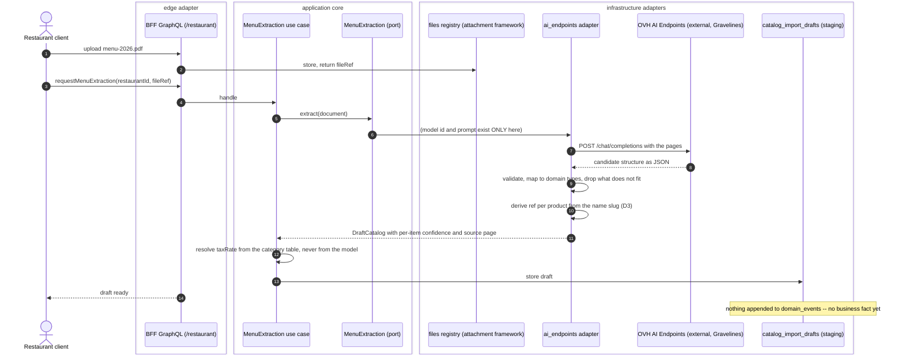
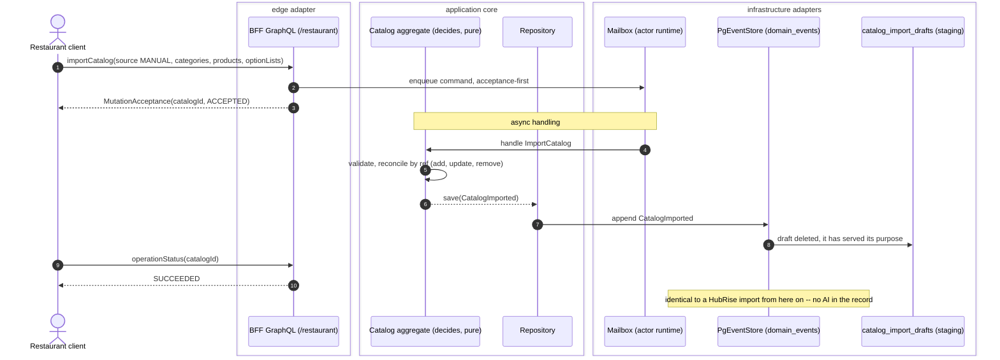

# PROP-20260807-202500 — From a printed menu to a catalog: assisted onboarding for restaurants without a POS

- **Status**: Proposed
- **Date**: 2026-08-07
- **Tracking issue**: [#380 "Onboarding stalls at the menu: a restaurant without HubRise must type its whole catalog by hand"](https://github.com/TheCaptainCompany/captain-food/issues/380)
- **Realized by**: _(filled at completion — ADR + PR)_
- **Concerns**:
  - [ ] `vat-is-not-guessable`: French catering VAT (10% / 20% / 5.5%) is a fiscal determination, not a menu attribute. The extraction must never populate `taxRate` from what a model infers.
  - [ ] `allergen-precedence`: no allergen pre-fill ships before [#184](https://github.com/TheCaptainCompany/captain-food/issues/184) decides the representation — a pre-fill into a model that does not exist would fix the wrong shape.
- **Depends on**: [PROP-20260807-202428 "AI inference is an enrichment at the edge, never a decider"](PROP-20260807-202428-ai-inference-boundary.md) ([#379](https://github.com/TheCaptainCompany/captain-food/issues/379)) — this is its first use case and inherits its boundary
- **Related**: [#171 "A restaurant cannot manage its own menu"](https://github.com/TheCaptainCompany/captain-food/issues/171) (the editor this hands off to) · [#134 "Generic file-attachment framework"](https://github.com/TheCaptainCompany/captain-food/issues/134) / [PROP-20260725-120055](PROP-20260725-120055-generic-file-attachment-framework.md) (where the uploaded menu lives) · [#184 "Allergens do not exist in the model"](https://github.com/TheCaptainCompany/captain-food/issues/184) · [PROP-20260726-165500](PROP-20260726-165500-catalog-compliance-and-merchandising.md) (catalog compliance) · [PROP-20260728-120931](PROP-20260728-120931-sirene-mirror-payload-is-transient.md) (the transient-staging precedent this borrows)

> Living document (ADR-20260801-020000) — it holds the CURRENT state of the design. History is in `git log -p` on this file.

---

## TL;DR

`ImportCatalog` already accepts `source: MANUAL` with a complete structured payload
(`specs/commands.yaml:660`). **Nothing produces that payload except HubRise.** For the V0 target —
independent restaurants and food trucks in Tours, most of them with no POS integration — onboarding
therefore means someone typing 40–80 dishes, prices, categories and option lists by hand into an
editor that [#171](https://github.com/TheCaptainCompany/captain-food/issues/171) says does not exist
yet.

The proposal, in one line: **a restaurateur uploads the menu they already have, a vision model drafts
the `ImportCatalog` payload, and the restaurateur reviews and confirms it.** The model never writes
the catalog — it drafts a command a human accepts, which is precisely what the HubRise ACL does from a
sync.

Cost: **around one cent per menu**. Time: hours to minutes. Risk: contained by the review step, which
is the same screen the restaurateur would have used anyway.

## 1. Context

| Fact | Evidence |
|---|---|
| `ImportCatalog` accepts `source: MANUAL` with categories, products and option lists | `specs/commands.yaml:660` |
| The only producer of that payload is the HubRise ACL | `crates/adapters/hubrise/` — no other caller |
| No screen binds any of the 13 catalog mutations | [#171](https://github.com/TheCaptainCompany/captain-food/issues/171), `specs/screens/*.yaml` |
| `Product.ref` (`ExternalReference`) is the idempotent import key | CLAUDE.md conventions; `specs/entities.yaml#/Product` |
| `Product.taxRate` is **required** | `specs/entities.yaml#/Product` `required` |
| Allergens do not exist anywhere in the model | [#184](https://github.com/TheCaptainCompany/captain-food/issues/184) — zero hits repo-wide |
| EU-resident vision inference costs €0.91/Mtoken | OVH AI Endpoints, `Qwen2.5-VL-72B` |

Two consequences shape the design. First, **`taxRate` being required** means an extraction cannot
produce a valid `Product` without a tax decision — and French catering VAT (10% food consumed
immediately, 20% alcohol, 5.5% certain packaged goods) is a fiscal determination that depends on the
service type, not something printed on a menu. Second, **`ref` being the idempotency key** means a
second extraction of the same menu either updates the first import or duplicates it, depending
entirely on how the ref is derived — and a restaurateur will re-upload, because that is what people do
when they change a price.

## 2. Recommended approach

Four steps, only the third of which is new machinery:

1. **Upload** — the menu (PDF, photo, or several photos) lands in the `files` registry from
   [#134](https://github.com/TheCaptainCompany/captain-food/issues/134), like every other attachment.
   No second pipeline.
2. **Extract** — the `MenuExtraction` port from
   [PROP-20260807-202428](PROP-20260807-202428-ai-inference-boundary.md) returns a `DraftCatalog`,
   with per-item confidence and the source page it came from.
3. **Stage** — the draft is written to a `catalog_import_drafts` table. It is **not** a domain event
   and **not** an aggregate: a draft is not a business fact, it is an ACL staging area, exactly as the
   SIRENE mirror's payload is transient staging
   ([PROP-20260728-120931](PROP-20260728-120931-sirene-mirror-payload-is-transient.md), approved).
   It is deleted once confirmed or abandoned.
4. **Review and confirm** — the restaurateur corrects the draft on screen and confirms, which issues
   the ordinary `importCatalog` mutation with `source: MANUAL`. From that point on the flow is the
   existing one: mailbox, `CatalogImported`, projections. Nothing downstream knows a model was
   involved.

**VAT is never extracted.** The model proposes a *category* (food / alcohol / packaged); the rate comes
from a deterministic table keyed by `(category, ServiceType)` and is shown to the restaurateur for
confirmation. **Allergens are not extracted at all** in the first slice — see D4.

## 3. Decisions surfaced

### D1 — Is the extraction a draft or an import?

| Option | Pros | Cons |
|---|---|---|
| **Draft for review, confirmed by the restaurateur** ✅ **recommended** | A model's output never becomes a business fact unreviewed; the confirm step is the catalog editor the restaurateur needs anyway; wrong prices are caught by the person who is liable for them | Needs a review screen and a staging table before any value is delivered |
| Direct import, correct afterwards | Fastest path to a live catalog | Publishes hallucinated prices and dishes to customers, then relies on someone noticing. In a marketplace a wrong price is a refund, a reclamation and a lost restaurant |
| Draft, auto-confirmed above a confidence threshold | Fewer clicks on the easy 80% | Confidence from a generative model is not calibrated probability. A threshold reads as rigour while providing none |

### D2 — Where the file and the draft live

| Option | Pros | Cons |
|---|---|---|
| **File in the `files` registry ([#134](https://github.com/TheCaptainCompany/captain-food/issues/134)); draft in a transient `catalog_import_drafts` table** ✅ **recommended** | Reuses the retention, storage and moderation framework instead of building a second one — the same argument [PROP-20260726-165500](PROP-20260726-165500-catalog-compliance-and-merchandising.md) makes for photos; the draft dies on confirm, so it never becomes state to migrate | Sequenced behind [#134](https://github.com/TheCaptainCompany/captain-food/issues/134) landing |
| Draft as an aggregate with its own events | Auditable, replayable | Fabricates a business fact out of an intermediate artifact and permanently enlarges the event log with something nobody will ever query |
| Everything client-side, nothing persisted | No new tables | A twenty-minute review lost to a closed tab; no way to resume, hand over, or have an admin help |

### D3 — What `ref` does an extracted product carry?

This is the decision that determines whether a re-upload updates the menu or doubles it.

| Option | Pros | Cons |
|---|---|---|
| **Deterministic ref derived from the product name slug, scoped to the catalog** ✅ **recommended** | Re-extracting the same menu updates in place, which is what a price change actually is; matches HubRise's idempotent-`ref` contract; readable in the database | Renaming a dish creates a new ref and orphans the old one — the review screen must show adds/updates/removals so the restaurateur sees it |
| A fresh identifier per extraction run | Trivially unique | Every re-upload duplicates the entire menu. This is the failure the `ref` convention exists to prevent |
| No ref (null, as HubRise allows) | Nothing to decide | Gives up idempotency for exactly the population most likely to re-upload |

### D4 — How far may the draft go on allergens?

**Blocked on [#184](https://github.com/TheCaptainCompany/captain-food/issues/184) / open decision
**D** in [DECISIONS.md](DECISIONS.md).** Listed here so it is not silently resolved by whoever
implements first.

| Option | Pros | Cons |
|---|---|---|
| **Extract nothing allergen-related in slice 1; the field stays "not declared"** ✅ **recommended** | Honest: "not declared" is exactly what it is, and [#184](https://github.com/TheCaptainCompany/captain-food/issues/184) has not decided the representation yet | The restaurateur still faces the 14-category form dish by dish, which is the tedious part |
| Pre-fill suggestions, restaurateur confirms per dish, undeclared until they do | Removes most of the typing while the human stays the declarer | A pre-filled checkbox invites click-through, and click-through on an allergen is how someone gets hurt. Needs a UI that makes confirmation an act, not a default |
| Extract and declare automatically | Fastest | The restaurateur is the legal declarer under FIC 1169/2011. This is not a product decision, it is a liability transfer to a model |

The recommendation is deliberately the conservative one **for slice 1 only**: option 2 is the likely
end state once [#184](https://github.com/TheCaptainCompany/captain-food/issues/184) lands the model
and the "not declared" state it specifies.

### D5 — Who may run an extraction, and what bounds it?

| Option | Pros | Cons |
|---|---|---|
| **`ADMIN` and `RESTAURANT_ACCOUNT`, rate-limited per restaurant, with a hard monthly ceiling** ✅ **recommended** | Self-serve onboarding is the point; the ceiling turns a runaway loop into a refusal instead of a bill | One more limit to configure and surface |
| `ADMIN` only, as an assisted-onboarding tool | Zero abuse surface, and early onboardings are hand-held anyway | Does not scale past the first dozen restaurants, which is where the value is |
| Unrestricted | Nothing to build | An unmetered third-party call reachable by any account holder |

## 4. Screen mockups

**Use case A — upload (restaurant back office, onboarding).**

```
+----------------------------------------------------+
| Add your menu                            step 2/4  |
+----------------------------------------------------+
|  Upload the menu you already have and we will      |
|  prepare your dish list. You check it before       |
|  anything goes live.                               |
|                                                    |
|   [ Choose a file ]   PDF or photo, up to 10 pages |
|   menu-2026.pdf                            3 pages |
|                                                    |
|   [ Read my menu ]        [ I will type it myself ]|
+----------------------------------------------------+
```

`Choose a file` -> the `files` registry ([#134](https://github.com/TheCaptainCompany/captain-food/issues/134)).
`Read my menu` -> `requestMenuExtraction`. `I will type it myself` -> the catalog editor
([#171](https://github.com/TheCaptainCompany/captain-food/issues/171)). Every control resolves to
something real.

**Use case B — review the draft.** The screen is a diff, not a form: the restaurateur needs to see
what will be added, changed and removed, because D3 makes a re-upload an update.

```
+------------------------------------------------------------+
| Check your menu                    32 dishes found  step 3/4|
+------------------------------------------------------------+
| BURGERS                                          6 dishes   |
|  + Burger Maison            9.50 EUR   food 10%    [edit]   |
|  + Burger Chevre           10.50 EUR   food 10%    [edit]   |
|  ! Burger du Chef              ? EUR   food 10%    [edit]   |
|      price unreadable on page 2 - please fill it in         |
| BOISSONS                                         9 dishes   |
|  + Biere pression 25cl       4.00 EUR   alcohol 20% [edit]  |
|                                                             |
| Allergens are not declared yet. You can add them after      |
| your menu is live, dish by dish.                            |
+------------------------------------------------------------+
| Source: menu-2026.pdf   [ view page 2 ]                     |
|                       [ Back ]   [ Publish my menu (32) ]   |
+------------------------------------------------------------+
```

`Publish my menu` -> `importCatalog(source: MANUAL, ...)`. **`Publish` is disabled while any `!` row
is unresolved** — a dish with no price cannot be sold, and the `taxRate` shown on every row is the
deterministic `(category, ServiceType)` lookup, never a model output.

**Use case C — a re-upload, three months later.**

```
+------------------------------------------------------------+
| Check your menu               updating an existing menu     |
+------------------------------------------------------------+
|   28 unchanged                                              |
|    3 price changes    Burger Maison  9.50 -> 10.00 EUR      |
|    1 new dish         Salade Cesar        11.00 EUR         |
|    2 no longer on the menu   Soupe du jour, Tarte Tatin     |
|         [ remove them ]  [ keep them, mark unavailable ]    |
+------------------------------------------------------------+
```

The second control matters: `UNAVAILABLE` and deleted are different things (availability vs
orderability), and a seasonal dish should not lose its history because it fell off one printing.

## 5. Sequence diagrams

**Flow 1 — upload to draft.** Nothing reaches `domain_events`: a draft is not a business fact.



**Flow 2 — confirm to catalog.** From the confirm onward this is the existing import path, unchanged.



## 6. Drawbacks

- **The value depends on two things that do not exist yet.** Without
  [#171](https://github.com/TheCaptainCompany/captain-food/issues/171)'s editor there is nowhere to
  correct a draft, and without [#134](https://github.com/TheCaptainCompany/captain-food/issues/134)
  there is nowhere to put the file. Built first, this is a feature with no screen.
- **The review step is the real work, and it is not glamorous.** A diff view with confidence, source
  pages and add/update/remove semantics is more UI than the extraction is engineering. If it is done
  badly the restaurateur will not trust the draft, and an untrusted draft is slower than typing.
- **Menus are adversarially hard documents.** Multi-column layouts, prices in a footnote, "supplément
  +2€", formulas ("entrée + plat 16€"), a handwritten daily board. The 80% case is easy and the last
  20% is where onboarding actually stalls.
- **Option lists are the hard part and the most valuable part.** Extracting dishes is easy; extracting
  `OptionList` min/max bounds ("choose 1 sauce, up to 3 toppings") correctly is not, and those bounds
  are enforced at write time — a wrong bound is a broken checkout, not a cosmetic error.
- **We take on a non-deterministic step in the one flow that decides whether a restaurant joins.** A
  bad first impression at onboarding is expensive in a market of a few hundred restaurants where they
  all talk to each other.

## 7. Unresolved questions

- **U1** — One-shot extraction, or two passes (structure first, then per-category enrichment)? Two
  passes is more accurate on long menus and costs roughly twice nothing; it is also twice the latency
  on a screen someone is watching.
- **U2** — Does the draft belong to the restaurant or to the session? (Determines whether an admin can
  pick up a half-finished onboarding — likely yes, which argues for the restaurant.)
- **U3** — What happens to `imageIds`? A menu photo contains dish photos, but cropping them out and
  presenting them as product images collides with the "no misrepresentation" rule only if they are
  not the restaurant's own. They are. Worth deciding rather than assuming.
- **U4** — Does the draft carry a HubRise-shaped `ExternalReference` namespace so a restaurant that
  later connects a POS reconciles cleanly, or is a manual ref permanently distinct?
- **U5** — Retention on the uploaded menu file: it is commercial content, not personal data, so
  [#18](https://github.com/TheCaptainCompany/captain-food/issues/18)'s windows may not apply as-is.

## 8. Verification plan

- A behaviour test per rule the slice adds, linked to `specs/rules.yaml` per ADR-0032: an extracted
  draft never appends a domain event; a confirm produces exactly one `CatalogImported`; a re-extraction
  of the same menu produces updates rather than duplicates (D3); `taxRate` on every imported product
  traces to the deterministic table.
- A story step reaches the new mutation, per the `op-uncovered-by-story` gate.
- The unavailable path is tested: extraction down leaves no draft, no event, and a screen that offers
  manual entry.
- `make validate` at **0 errors and no new warning** against `main`'s baseline (32 warnings today).
- Ships behind the gate from
  [PROP-20260807-202428](PROP-20260807-202428-ai-inference-boundary.md), default off.
