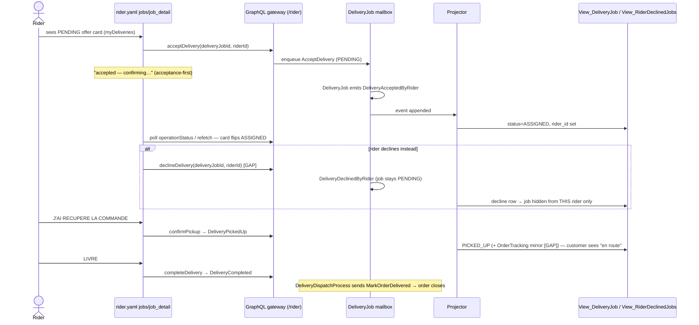
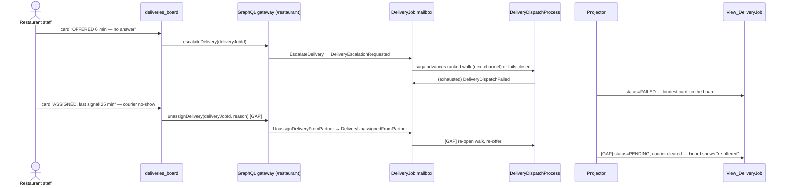

# PROP-20260808-141817 — The rider/delivery write surface: journeys, vocabulary verdict, and V0 slices

- **Status**: Proposed (awaiting product-owner approval)
- **Date**: 2026-08-08
- **Tracking issue**: [#348 "Epic: the rider/delivery write surface does not exist"](https://github.com/TheCaptainCompany/captain-food/issues/348)
- **Realized by**: _(filled at completion — the §6 slices land as claimable sub-issues)_
- **Author lens**: `ux-designer` agent journey derivation, session
  https://claude.ai/code/session_01AKgDqRbCcCxtUePWPRfxtp — the persona journeys below are the
  evidence base; every EXISTS/GAP mark carries a `file:line` cite verified on current `main`.
- **Concerns**:
  - [ ] **D3 naming decision**: generalizing `UnassignDeliveryFromPartner`/`DeliveryUnassignedFromPartner`
    to `DeliveryAssignmentReleased` renames an event — event vocabulary is a product-owner call, and
    it is cheapest now (no production events exist yet); must be decided before slice 6 lands.
  - [ ] **Slice-2 validator semantics**: crediting process-manager `send` steps as
    `command-no-mutation` coverage weakens the gate unless the credit REQUIRES the PM edge to
    actually exist and resolve in `actors.yaml`/`processmanager.yaml` (a checkable `$ref`, not a
    self-declared `internal: true` exemption). The safeguard: a command is only credited when at
    least one PM step demonstrably sends it; an annotation alone never suffices.
- **Related**: [PROP-20260726-172500 "Delivery execution: deliverability, the rider surface, run
  recovery"](PROP-20260726-172500-delivery-execution.md) (the earlier gap inventory this refines) ·
  the [#60 ranked-walk dispatch foundation](https://github.com/TheCaptainCompany/captain-food/issues/60)
  (ADR-20260721-161939) · the
  [#95 rider online/offline toggle](https://github.com/TheCaptainCompany/captain-food/issues/95) ·
  [#158 "Customer credit-balance ledger"](https://github.com/TheCaptainCompany/captain-food/issues/158) ·
  the [#159 no-charge replacement order](https://github.com/TheCaptainCompany/captain-food/issues/159)
  (ADR-20260726-171736) · ADR-0004 (commands derive from use cases; external facts are inbound
  events) · ADR-20260726-163737 §checkout-consume.

---

## TL;DR

The epic asks which of the 13 unreachable delivery commands and 11 unprojected delivery events are
missing product surface, and which are wrong vocabulary. Deriving the four persona journeys (rider,
restaurant, admin/dispatch, customer) answers it directly: **the wired offer/accept vocabulary is
canonical** — "assign" as a user action does not exist, "accept" does. Two command/event families
(`AssignDeliveryToPartner`, `UpdateDeliveryPartnerStatus`) are **retired**; one
(`UnassignDeliveryFromPartner`) is **promoted** into a real assignment-failure recovery journey; three
strays (`BindCartToCustomer`, `GrantCustomerCredit`, `PlaceReplacementOrder`) are a **validator blind
spot**, not missing surface. The epic decomposes into **8 value-ordered V0 slices** (+3 V1), of which
the first two (vocabulary deletion, validator PM-send credit) cost nothing and clear roughly a third
of `main`'s warning baseline before any surface is built. Two customer-anxiety one-liners hide inside
the epic and must not wait for the rider slices (§7).

**Basis (verified on current `main`, `make validate` = 0 errors / 43 warnings):** 13
`command-no-mutation` warnings and 11 relevant `event-not-projected` warnings, matching the epic.

Ground truth used:
- Commands: `specs/delivery/commands.yaml` (all 13 delivery-side exist)
- Events: `specs/delivery/events.yaml`; actor wiring + lifecycle: `specs/delivery/actors.yaml`
- Dispatch saga: `specs/delivery/processmanager.yaml` (ranked walk,
  [#60](https://github.com/TheCaptainCompany/captain-food/issues/60))
- Read model: `specs/database/projection_views.yaml:75-191` (View_DeliveryJob),
  `specs/database/tables/projection_tables.yaml:495-506` (OrderTracking delivery mirror)
- API: `specs/delivery/api.yaml`; screens: `specs/screens/rider.yaml`,
  `specs/screens/restaurant_backoffice.yaml:148-168`, `specs/screens/system.yaml`
- Stories: `specs/stories.yaml:215-234` (rider), `:193-199` (restaurant TrackDeliveries),
  `:284-289` (admin partner review)

## 1. The journeys

### 1a. RIDER — registration → shift → job → pickup → delivery → issue → earnings

The whole persona is one state machine; the next action is always the biggest thing on screen. Note
upfront: **the rider write path is half-wired** — accept/pickup/complete mutations exist
(`specs/delivery/api.yaml:91-104`) and are bound in `specs/screens/rider.yaml:41-43`, but the
bindings pass the wrong variables (`orderId` instead of `deliveryJobId` + `riderId` — 6 of main's
`action-*` warnings), and `riderId` is unobtainable because **no rider read model exists**.
Everything downstream inherits that hole.

| # | User sees / does | Screen | Query/Mutation | Command/Event | Read model |
|---|---|---|---|---|---|
| 1 | First run: signs in (Supabase, identity-only), fills name + phone, taps "Devenir livreur". Sees "accepted — confirming…" then the empty job list | **GAP** `rider.yaml` `onboarding` screen | **GAP** `registerRider` mutation | EXISTS `RegisterRider` → `RiderRegistered` (`delivery/commands.yaml:212`, `actors.yaml:190-193`) | **GAP** `View_Rider` (`RiderRegistered` feeds nothing) |
| 2 | Edits phone/display name | **GAP** `rider_profile` screen | **GAP** `updateRiderInfo` mutation | EXISTS `UpdateRiderInfo` → `RiderInfoUpdated` | **GAP** `View_Rider` |
| 3 | Taps the top-bar toggle: "Passer en ligne" ⇄ "Hors ligne". The toggle must RENDER current state | EXISTS toggle (`rider.yaml:45,59-63`) — but state is unrenderable | EXISTS `changeRiderStatus` (`delivery/api.yaml:86-89`); **GAP** `myRiderProfile` query to read status back | EXISTS `ChangeRiderStatus` → `RiderStatusChanged` (lifecycle `actors.yaml:177-188`) | **GAP** `View_Rider.status` — today the toggle is a write with no readable state, a live control bound to a half-gap |
| 4 | AVAILABLE, phone on handlebar: a new PENDING job appears — sound + full-screen card, pickup/dropoff/distance. Two buttons: ACCEPT (huge) / Decline (smaller) | EXISTS `jobs` screen (`rider.yaml:71-90`); **GAP** offer card layout + decline control | EXISTS `myDeliveries(status: PENDING)` (`api.yaml:52-58`); **GAP** push (subscription) — poll-only today, a 30 s poll at Friday 19:30 loses offers | — | EXISTS `View_DeliveryJob` (`[rider_id,status]` index, `projection_views.yaml:93`) |
| 5a | Taps ACCEPT → "accepted ✓ — confirming…" → job goes ASSIGNED, detail screen | EXISTS (`rider.yaml:90`) — **fix variables** | EXISTS `acceptDelivery` | EXISTS `AcceptDelivery` → `DeliveryAcceptedByRider` (`actors.yaml:99-104`) | EXISTS projected (`projection_views.yaml:83,111`) |
| 5b | Taps Decline → job leaves *their* list, stays PENDING for others | **GAP** control | **GAP** `declineDelivery` mutation | EXISTS `DeclineDelivery` → `DeliveryDeclinedByRider` (`actors.yaml:158-163`) | **GAP** — unprojected; without a per-rider decline record the same job re-renders to the rider who refused it, forever |
| 6 | At the restaurant, one thumb: "J'AI RÉCUPÉRÉ LA COMMANDE" (sticky bottom, full width) | EXISTS (`rider.yaml:107-109`) — **fix variables** | EXISTS `confirmPickup` | EXISTS `ConfirmPickup` → `DeliveryPickedUp` | EXISTS in View_DeliveryJob; **GAP in OrderTracking** — `DeliveryPickedUp` is absent from OrderTracking's fedBy (`projection_tables.yaml:497-501`), so the customer never sees the rider path move (see §1d) |
| 7 | At the door: "LIVRÉ" | EXISTS (`rider.yaml:110`) — **fix variables** | EXISTS `completeDelivery` | EXISTS `CompleteDelivery` → `DeliveryCompleted`; saga closes the order (`processmanager.yaml:240-257`) | EXISTS |
| 8 | Mid-delivery problem: one big "PROBLÈME" button → canned-reason chips ("Adresse introuvable", "Restaurant pas prêt", "Client injoignable") — **no free text on a bike**; chips fill the command's `issue` string | **GAP** issue sheet on `job_detail` | **GAP** `reportDeliveryIssue` mutation | EXISTS `ReportDeliveryIssue` → `DeliveryIssueReported` (`actors.yaml:124-128`) | **GAP** — unprojected, so a reported issue is a scream into the log: nobody's board shows it |
| 9 | End of shift: "Aujourd'hui: 7 courses, 12,50 € de pourboires" | **GAP** earnings glance | **GAP** `riderEarnings` query | — (fold of `DeliveryCompleted` + `OrderTipped`) | Partial: `View_DeliveryJob(rider_id, delivered_at)` + per-order `rider_tip_cents` (`projection_tables.yaml:648-652`) exist but nothing joins them for a rider |

**Unhappy paths:** decline cascade at peak — every independent rider declines: the job simply
**stays PENDING** (`DeliveryDeclineKeepsJobPending`, `delivery/rules.yaml:42`) and the `independent`
channel never "rejects", so the ranked walk never advances and **nobody is told**. The only guards
are the offer TTL (`DeliveryOfferTimedOut` advances the walk, `rules.yaml:30`) and the restaurant
noticing a PENDING job aging on the board. The board therefore MUST render job age and go loud past
a threshold; an ops stuck-jobs view is the backstop. Rider phone dies mid-delivery:
assignment-release journey, §1b step 4.

### 1b. RESTAURANT — the delivery board, Friday 19:30

Board exists (`restaurant_backoffice.yaml:148-168`) with two actions: escalate + self-dispatch
handover. Read at arm's length; every frequent action one tap on the card, zero navigation.

| # | User sees / does | Screen | Query/Mutation | Command/Event | Read model |
|---|---|---|---|---|---|
| 1 | Glance: cards colored by `DeliveryStatus`; PENDING shows age ("en attente depuis 6 min") and turns alarming past ~5 min; FAILED (dispatch exhausted) is the loudest state on the board | EXISTS board; **GAP** age/alarm treatment | EXISTS `restaurantDeliveries` (`api.yaml:60-67`) | fed by lifecycle events | EXISTS `View_DeliveryJob` |
| 2 | Assign to a partner: **NOT a journey step.** The restaurant never pushes a job at a partner — the [#60](https://github.com/TheCaptainCompany/captain-food/issues/60) ranked walk offers channels and the partner's *acceptance* (inbound, ACL) is what assigns. The restaurant's lever over a stuck *offer* is exactly one tap: "Passer au suivant" | EXISTS escalate (`restaurant_backoffice.yaml:166`) — **fix variables** (passes `orderId`, command wants `deliveryJobId`, warning on main) | EXISTS `escalateDelivery` | EXISTS `EscalateDelivery` → `DeliveryEscalationRequested` → saga advances (`processmanager.yaml:130-172`) | non-projected by design (`projection_views.yaml:51`) |
| 3 | Cancel a delivery (order refunded / customer collected) | **GAP** board control (story step exists, `stories.yaml:197`; the backoffice actions list has no `cancel_delivery`) | EXISTS `cancelDelivery` (`api.yaml:106-109`) | EXISTS `CancelDelivery` → `DeliveryCancelled` | EXISTS |
| 4 | **Assignment failure**: partner accepted at 19:40, courier never shows by 20:10 (or the accepted rider's phone died). Escalate is useless — the saga only advances an *outstanding offer* (`expect: process_status OFFERED`, `processmanager.yaml:144`); once ACCEPTED it skips benignly. Cancel kills a job whose order still needs delivering. One tap: "Libérer et relancer" → job back to PENDING, courier cleared, re-offered | **GAP** board control | **GAP** `unassignDelivery` mutation | EXISTS `UnassignDeliveryFromPartner` → `DeliveryUnassignedFromPartner` (ASSIGNED→PENDING edge, `actors.yaml:61,147-151`); **GAP**: no saga receiver re-opens the walk on it | **GAP** — unprojected: today the board would keep showing ASSIGNED after an unassign; the projection needs the Unassigned→PENDING derive + courier/rider clear |
| 5 | Issue badge on a card ("Adresse introuvable — 4 min"); tap → resolve with a canned outcome + note | **GAP** badge + resolve control | **GAP** `reportDeliveryIssue` / `resolveDeliveryIssue` mutations | EXIST `ReportDeliveryIssue`/`ResolveDeliveryIssue` (`actors.yaml:124-133`) | **GAP** issue columns on `View_DeliveryJob` |
| 6 | Self-dispatch handover confirm | EXISTS `mark_order_delivered` (`restaurant_backoffice.yaml:167`) | EXISTS | EXISTS | EXISTS |

**Unhappy path — partner webhook silence:** partner accepted, then no `DeliveryStatusUpdated` for
25 min. Inbound facts are ACL events (no user action to design), but the *absence* of one is a board
state: "dernier signal il y a 25 min" on the card (View_DeliveryJob has the timestamps to derive
staleness client-side) + the step-4 release action as the human recovery. Out of scope: automated
partner-silence timeouts (a worker concern, sibling of `DeliveryOfferTimeoutWorker`).

### 1c. ADMIN / dispatch — the escalation view

**Nothing exists.** No admin delivery screen (`system.yaml` is mailbox supervision only), no
cross-restaurant delivery query (`restaurantDeliveries` is restaurant-scoped; `delivery` is by
orderId), no admin story activity for delivery ops.

| # | User sees / does | Screen | Query/Mutation | Command/Event | Read model |
|---|---|---|---|---|---|
| 1 | Stuck-jobs queue: jobs PENDING > N min, ASSIGNED with stale signal, FAILED — sorted by age; open-issue queue beside it | **GAP** `system.yaml` `delivery_ops` screen | **GAP** `deliveryJobs` query (ADMIN, filters: status, minAge, hasOpenIssue) | — | EXISTS `View_DeliveryJob` + **GAP** issue columns |
| 2 | Repair a wedged job: force a status (e.g. rider forgot to tap LIVRÉ and went home — PICKED_UP→DELIVERED so the order closes and the customer stops watching a dead screen) | **GAP** control on `delivery_ops` | **GAP** `updateDeliveryStatus` mutation, **ADMIN-only** | EXISTS `UpdateDeliveryStatus` → `DeliveryStatusUpdated` (`actors.yaml:135-139`; the dynamic-target edges exist) | EXISTS — `DeliveryStatusUpdated` already projected (`projection_views.yaml:82,114`) |
| 3 | Resolve an issue no restaurant resolved by 21:00; release a dead assignment; cancel | same **GAP** screen | `resolveDeliveryIssue` / `unassignDelivery` (GAPs above); `cancelDelivery` EXISTS with ADMIN role | exist | per above |

**Unhappy path — issue with no resolver at 21:00:** `ResolveDeliveryIssue` is offered to restaurant
*and* admin; the ops issue queue (sorted by age, with the reporter's phone) is the guarantee an
issue is never only a support ticket. Ownership rule for this proposal: restaurant resolves
first-line; anything > 10 min old surfaces on the admin queue.

### 1d. CUSTOMER — where delivery state must surface (anxiety curve)

The customer never operates delivery; they must be *reassured* by it. Mapping each transition to a
mandated emission:

| Delivery fact | Customer must see | Today |
|---|---|---|
| `OrderPlaced` → `OrderAccepted` | "accepted ✓ — confirming…" then accepted | EXISTS (`restaurant_frontoffice.yaml:443-453` hero) |
| `PaymentFailed` | Checkout failure state + retry, cart intact | Plumbing EXISTS (`paymentStatusChanged`, `payments/api.yaml:169-181`); **GAP**: the checkout screen (`restaurant_frontoffice.yaml:392-421`) declares no FAILED state/copy |
| `DeliveryAcceptedByRider` / `ByPartner` | Courier name (+ phone) appears; ETA (`estimated_dropoff_at`) | Read model EXISTS (OrderTracking mirrors courier/ETA, `projection_tables.yaml:504`); **GAP**: `order_tracking` screen binds only `order.byId` — the `delivery` query (`api.yaml:44-50`, story step `TrackDelivery`, `stories.yaml:63`) is bound by NO customer screen; courier row and delivery ETA are invisible |
| `DeliveryPickedUp` (rider path) | "C'est en route" — the anxiety peak is READY→door | **GAP**: `DeliveryPickedUp` missing from OrderTracking fedBy (`projection_tables.yaml:497-501`); on the independent-rider path the customer's status jumps READY → DELIVERED with a 15–25 min silent hole. On the partner path `DeliveryStatusUpdated` covers it. This is the single worst customer-facing consequence of the epic |
| `DeliveryStatusUpdated(OUT_FOR_DELIVERY)` | same | EXISTS (read-side presentation status, `ordering/actors.yaml:68`) |
| `DeliveryCompleted` / `DELIVERED` | Delivered + rate/tip/survey | EXISTS |
| `DeliveryDispatchFailed` / open issue | Honest degraded ETA: "on cherche un livreur / petit contretemps" — never a silently frozen ETA | **GAP** (copy + binding; the data exists once issues are projected) |

## 2. Vocabulary verdict

The journeys answer the epic's question directly: **"assign" as a user action does not exist;
"accept" does.** Under [#60](https://github.com/TheCaptainCompany/captain-food/issues/60) the
*offer* is a saga port call (not an event), and commitment is the acceptance fact — inbound for
partners, command-driven for riders. A restaurant-pushed `AssignDeliveryToPartner` would mark a job
ASSIGNED that no courier agreed to carry: an un-accepted assignment, the marketplace's oversell
failure mode as an event type. **The wired vocabulary is canonical.** But "unassign" is NOT the
mirror of "assign" — it is the *release* step of a real recovery journey, and it survives on its
own.

Per warned event:

| Warned artifact | Verdict | Journey step (or why none) |
|---|---|---|
| `DeliveryAssignedToPartner` + cmd `AssignDeliveryToPartner` + edge `actors.yaml:60` | **RETIRE** (decision D1) | No journey pushes a job at a partner; offer = saga port call, commitment = `DeliveryAcceptedByPartner` (inbound). Manual phone-a-partner recovery is covered by ADMIN `UpdateDeliveryStatus` (PENDING→ASSIGNED edge exists, `actors.yaml:67`) |
| `DeliveryUnassignedFromPartner` + cmd `UnassignDeliveryFromPartner` | **KEEP** (recommend generalizing name to `DeliveryAssignmentReleased` / `unassignDelivery` — the rider no-show needs the identical step and the payload is already provider-agnostic: `deliveryJobId` + `reason`; decision D3) | §1b step 4 / §1c step 3: courier accepted then failed; escalate can't touch an ACCEPTED run, cancel kills a needed delivery. Needs: mutation, board/ops control, projection derive (→PENDING, clear courier/rider/partner_ref), saga receiver to re-open the walk |
| `DeliveryPartnerStatusUpdated` + cmd `UpdateDeliveryPartnerStatus` + 6 edges `actors.yaml:73-78` | **RETIRE** (decision D2) | A command wrapping an external fact — exactly what ADR-0004 forbids. The ACL already records the same fact directly as inbound `DeliveryStatusUpdated` (`actors.yaml:93-95` says so verbatim). Second vocabulary, zero journey |
| `DeliveryDeclinedByRider` + cmd `DeclineDelivery` | **KEEP** — distinct from `DeliveryRejectedByPartner` and both are legitimate: rider decline keeps the job PENDING in the rider pool (`rules.yaml:42`); partner rejection advances the ranked walk (`processmanager.yaml:85-128`). Different actor, different consequence, different event — a mapping, not a retirement | Rider §1a step 5b. Needs: `declineDelivery` mutation, decline control, per-rider decline read model (offer filtering) |
| `DeliveryIssueReported` / `DeliveryIssueResolved` | **KEEP** | §1a-8, §1b-5, §1c-3. Needs: two mutations, screens, projection |
| `RiderRegistered` / `RiderInfoUpdated` / `RiderStatusChanged` | **KEEP** | §1a steps 1–3. Needs: `View_Rider`, `registerRider`/`updateRiderInfo` mutations, `myRiderProfile` query, screens, story activity |
| `CustomerIdentified` | **KEEP event; declare `nonProjectedEvents` (category a)** | Saga trigger for `CartBindingProcess` (`ordering/processmanager.yaml:122-148`); the durable change lands via `CartBoundToCustomer`, which IS projected |
| `PaymentFailed` | **KEEP event; declare `nonProjectedEvents` (category a)** | Served transiently to the customer from the PlaceOrderProcess run row via `paymentStatus`/`paymentStatusChanged` — the declared PM-table exception (`payments/api.yaml:9-16`); ops sees it via the observability contracts (`observability.yaml:136,413`). No View needed; the real gap is checkout FAILED-state copy (§1d) |

Retiring the two families also deletes their errors mappings, tests, and 7 lifecycle edges — pure
spec deletion, journeys lose nothing.

## 3. The strays

| Stray | Journey it belongs to | Verdict |
|---|---|---|
| `BindCartToCustomer` | Returning-customer sign-in: `CustomerIdentified` → `CartBindingProcess` sends it per open cart (`ordering/processmanager.yaml:120-148`) | PM-internal by design — needs **no mutation ever**. The warning is a validator blind spot: `command-no-mutation` does not credit process-manager `send`/`deliver` steps as coverage. Fix the validator (count PM sends, or an explicit `internal: true` command marker — see the slice-2 Concern for why the PM-send form is the safe one), don't invent a user action |
| `GrantCustomerCredit` | Claim resolution GOODWILL_CREDIT: ReclamationProcess sends it (`ordering/processmanager.yaml:156,205`) | Same — PM-internal; validator fix |
| `PlaceReplacementOrder` | Claim resolution REPLACEMENT ([#159](https://github.com/TheCaptainCompany/captain-food/issues/159)); its own description says "NOT a public GraphQL mutation" (`ordering/commands.yaml:356`) | Same — PM-internal; validator fix |
| `ConsumeCustomerCredit` | **Genuinely unreached**: checkout credit application ([#158 "Customer credit-balance ledger"](https://github.com/TheCaptainCompany/captain-food/issues/158), ADR-20260726-163737 §checkout-consume). The customer's tap is "use my 4,50 € credit" on checkout; the consume must be atomic with payment, so the right shape is a `PlaceOrder` payload flag + a `PlaceOrderProcess` step sending `ConsumeCustomerCredit` — it *becomes* PM-internal, not a raw mutation (decision D5). `customerCredit` query + checkout toggle are the visible half | Own slice (rides the checkout flow, but the option space — flag on PlaceOrder vs pre-checkout mutation — needs its own arbitration) |
| `CustomerIdentified` | Sign-in/cart-binding (above) | `nonProjectedEvents` declaration, §2 |
| `PaymentFailed` | **Whose screen: the CUSTOMER's checkout, nobody else's.** Pre-order, no restaurant is involved (no order was placed — `TestPlaceOrderPaymentFailedPlacesNothing`); ops watches rate via telemetry, not a queue. Read model implied: none — the transient PM-run-row `PaymentIntent` already carries FAILED to the checkout page; the money-path blind spot is the missing FAILED *screen state* (copy + retry + "your cart is intact"), which today leaves the customer on a spinner at the exact peak of the anxiety curve | `nonProjectedEvents` + checkout failure-state addition to `restaurant_frontoffice.yaml` |

## 4. Decisions surfaced

Each decision carries per-option trade-offs, derived from the §1–§3 evidence; the recommended option
is marked. D1/D2/D4 follow directly from the journey derivation; D3 and the slice-2 semantics are
held as Concerns in the header.

### D1 — the `AssignDeliveryToPartner` family: retire vs keep for manual dispatch

| Option | Pros | Cons |
|---|---|---|
| **Retire the family** (command, `DeliveryAssignedToPartner`, edge `actors.yaml:60`) — **RECOMMENDED** | No journey references it: the offer is a saga port call and commitment is the partner's *acceptance* (inbound, ACL). An event asserting an assignment no courier agreed to carry is the marketplace's **oversell failure mode as an event type** — the un-accepted assignment loses both sides at once. Pure deletion: removes edges, errors mappings, tests and ~3 warnings; leaves ONE vocabulary for every later slice | Manual phone-a-partner recovery ("I called Avelo37, they said yes") must ride the ADMIN `updateDeliveryStatus` (the PENDING→ASSIGNED edge exists, `actors.yaml:67`) instead of a purpose-named command; a future push-dispatch product would need a fresh design, not a resurrection |
| Keep for manual dispatch | A named, semantically specific intent for phone-brokered assignment; a more legible audit trail than a generic status force | Keeps an event that asserts commitment nobody made; requires building mutation + screen + projection for a journey **no persona has**; retains the warnings and the second vocabulary that every later slice would then have to accommodate |

### D2 — `UpdateDeliveryPartnerStatus`: retire vs keep as a command-wrapped fact

| Option | Pros | Cons |
|---|---|---|
| **Retire** (command, `DeliveryPartnerStatusUpdated`, the 6 edges `actors.yaml:73-78`) — **RECOMMENDED** | A command wrapping an external fact is exactly what ADR-0004 forbids: a partner's status report already happened and cannot be rejected. The ACL already records the identical fact directly as inbound `DeliveryStatusUpdated` (`actors.yaml:93-95` says so verbatim). Deletes 6 lifecycle edges + warnings; one status vocabulary | If a human ever needs to transcribe a partner's phoned status, there is no partner-named command — but the ADMIN `updateDeliveryStatus` (slice 7) covers precisely that repair, with the acting user on the envelope (ADR-0041) as the audit trail |
| Keep as command-wrapped fact | An operator-invocable, validated entry point for partner facts | Duplicates the ACL path with **contradictory semantics** (a rejectable command vs a recorded fact) for the same event family; zero journey references it; keeps the second vocabulary and the warnings |

### D3 — `Unassign…` naming: keep as-is vs generalize to `DeliveryAssignmentReleased`

| Option | Pros | Cons |
|---|---|---|
| Keep `UnassignDeliveryFromPartner` / `DeliveryUnassignedFromPartner` as-is | Zero event-vocabulary churn; no actors/tests/errors rewiring; slice 6 ships sooner | The name lies for the rider no-show case — the identical release step is needed when the failed courier is an independent rider, and the payload is **already provider-agnostic** (`deliveryJobId` + `reason`); future readers will infer a partner-only path and be tempted to add a rider-flavoured twin event |
| **Generalize/rename to `DeliveryAssignmentReleased` (mutation `unassignDelivery`)** — **RECOMMENDED** | One release step for both courier kinds; the name matches the journey it serves ("Libérer et relancer" — release-and-reoffer, §1b step 4); prevents a duplicate rider event later; the rename is cheapest **now**, while no production events exist in the log | Renames an existing event + command (spec, tests, errors mapping churn); event vocabulary is a product-owner call — held as an unchecked Concern, to be decided before slice 6 |

### D4 — issue model: one open issue per job (V0) vs issue entities with ids/history

| Option | Pros | Cons |
|---|---|---|
| **One open issue per job** — `View_DeliveryJob` columns `open_issue`, `issue_reported_at`, cleared on resolve — **RECOMMENDED** | Matches the commands as specced: `ReportDeliveryIssue`/`ResolveDeliveryIssue` carry no `issueId`, so this is **the honest V0 model**, not a simplification of one; zero new aggregate or scalar; the board badge (§1b-5) and the ops issue queue (§1c) need nothing more; the event log still retains every report/resolve fact | No multi-issue history in the read model; a second report before resolution overwrites the first's surface (the events remain); issue-category analytics deferred |
| Issue entities with ids + history | Full audit surface, multiple concurrent issues per job, category analytics | Requires new scalars/entities and `issueId`-bearing command payloads **the journeys did not ask for**; heavier projection; V1 scope creep inside a V0 epic; the history already exists in `domain_events` if analytics wants it later |

### D5 — `ConsumeCustomerCredit`: PlaceOrder flag + PM step vs standalone pre-checkout mutation

| Option | Pros | Cons |
|---|---|---|
| **`PlaceOrder` payload flag + `PlaceOrderProcess` step sends `ConsumeCustomerCredit`** — **RECOMMENDED** (per ADR-20260726-163737 §checkout-consume) | Consume is **atomic with payment** — no credit burned on a failed or abandoned order; the customer's tap stays ONE tap ("use my 4,50 € credit" on checkout); the command becomes PM-internal, so slice 2's validator credit covers it honestly; no standalone money-adjacent mutation to authorize | Touches the `PlaceOrder` payload and the money-path saga — a high-stakes change (multi-lens review posture); the PM gains a step and its failure/compensation semantics must be specified |
| Standalone pre-checkout mutation | Simpler wiring — no `PlaceOrder` payload change, no saga edit | **Not atomic with payment**: a failed payment leaves credit consumed (or demands a compensating credit-refund flow, i.e. a second money mechanism); two round-trips at the exact peak of the checkout anxiety curve; adds a public mutation for an operation that should never be independently invocable |

## 5. Diagrams and mockups

### 5a. Sequence diagrams (hexagonal-faithful; acceptance-first splits shown)

Rider job lifecycle (accept → pickup → deliver, with decline):



Restaurant escalate / release-and-reoffer:



Issue report → resolve:

```mermaid
sequenceDiagram
  actor R as Rider
  participant S as job_detail issue sheet [GAP]
  participant G as Gateway
  participant M as DeliveryJob mailbox
  participant P as Projector
  participant V as View_DeliveryJob (open_issue) [GAP]
  participant O as system.yaml delivery_ops [GAP]
  R->>S: PROBLEME → chip "Adresse introuvable"
  S->>G: reportDeliveryIssue(deliveryJobId, riderId, issue) [GAP]
  G->>M: ReportDeliveryIssue → DeliveryIssueReported
  P->>V: open_issue set → board badge + ops issue queue row
  O->>G: resolveDeliveryIssue(deliveryJobId, resolution) [GAP]
  G->>M: ResolveDeliveryIssue → DeliveryIssueResolved
  P->>V: open_issue cleared; customer copy returns to normal ETA
```

### 5b. Screen mockups (per use case)

Rider offer card (gloves, sunlight, one hand):

```
+--------------------------------------+
|  NOUVELLE COURSE            0:27 ⏳  |
|  ┌────────────────────────────────┐  |
|  |  Chez Fatou  →  1,9 km        |  |
|  |  📍 12 rue Colbert (retrait)   |  |
|  |  🏠 8 pl. Plumereau (client)   |  |
|  └────────────────────────────────┘  |
|                                      |
|  ██████████████████████████████████  |
|  █         J'ACCEPTE  ✓           █  |
|  ██████████████████████████████████  |
|                                      |
|        [ Non merci ]                 |
+--------------------------------------+
```

Delivery board card (glance states left to right = severity):

```
| #A12  Chez Fatou → Plumereau                          |
|  ⏳ EN ATTENTE depuis 6 min   ▲ alarme > 5 min        |
|  [ Passer au suivant ]  [ Annuler ]                   |
|-------------------------------------------------------|
| #A09  ASSIGNEE — Karim (Avelo37) · signal il y a 25min|
|  ⚠ badge: courier silencieux                          |
|  [ Liberer et relancer ]  [ Signaler un souci ]       |
|-------------------------------------------------------|
| #A05  🔴 ECHEC DISPATCH (3 canaux) — action requise   |
|  [ Je livre moi-meme ]  [ Annuler la livraison ]      |
```

Ops issue/stuck queue (system.captain.food/delivery):

```
| STUCK JOBS                          | ISSUES OUVERTS               |
| #A12 PENDING 11min  Chez Fatou     | #A09 "Adresse introuvable"   |
|   [Force status v] [Release] [Cancel]|   4 min · rider: Karim 📞   |
| #B03 ASSIGNED 32min stale signal   |   [Resoudre…] [Appeler]      |
```

## 6. Slices (value-ordered, one slice = one claimable issue)

1. **`delivery-vocabulary-cleanup`** (foundation, deletion-only). Completes: nothing user-visible;
   makes every later slice build on one vocabulary. DSL: delete `AssignDeliveryToPartner`,
   `UpdateDeliveryPartnerStatus` (commands), `DeliveryAssignedToPartner`,
   `DeliveryPartnerStatusUpdated` (events), edges `actors.yaml:60,73-78`, their inbox entries,
   tests; add `CustomerIdentified` + `PaymentFailed` to `nonProjectedEvents` with rationale. NOT in
   it: any new surface. Removes ~6 warnings.
2. **`validator-credits-pm-sent-commands`** (foundation, tools/codegen-rs). `command-no-mutation`
   counts PM `send` steps (or honors `internal: true` — subject to the slice-2 Concern: the credit
   must require a resolvable PM edge, never an annotation alone). Clears `BindCartToCustomer`,
   `GrantCustomerCredit`, `PlaceReplacementOrder` honestly. NOT in it: `ConsumeCustomerCredit`
   (genuinely unreached).
3. **`rider-identity`** (foundation for every rider write). Completes §1a steps 1–3. DSL:
   `View_Rider` (fed by the 3 Rider events), `registerRider` + `updateRiderInfo` mutations,
   `myRiderProfile` query (RIDER; me-pattern), `rider.yaml` onboarding + profile screens,
   online-toggle state binding, story activity `rider.Onboard`, tests/rules links. **Also fixes the
   6 rider `action-*` variable warnings** (riderId now resolvable; pass `deliveryJobId`). NOT in
   it: admin rider roster/suspension UI
   ([#95](https://github.com/TheCaptainCompany/captain-food/issues/95) follow-up), earnings.
4. **`rider-decline`**. Completes §1a-5b. DSL: `declineDelivery` mutation (RIDER), decline control
   on the offer card, `View_RiderDeclinedJobs` (delivery_job_id, rider_id, declined_at;
   `myDeliveries` excludes), story step. NOT in it: decline-cascade automation (TTL walk already
   covers the channel level).
5. **`delivery-issue-lifecycle`**. Completes §1a-8, §1b-5, half of §1c. DSL: `reportDeliveryIssue`
   (RIDER, RESTAURANT, ADMIN) + `resolveDeliveryIssue` (RESTAURANT, ADMIN) mutations;
   `View_DeliveryJob` columns `open_issue`, `issue_reported_at` (cleared on resolve — the commands
   carry no issueId, so one open issue per job is the honest V0 model, decision D4); rider issue
   sheet (canned chips), board badge + resolve control, story steps. NOT in it: multi-issue
   history, comms/notifications.
6. **`assignment-failure-recovery`**. Completes §1b-4. DSL: `unassignDelivery` mutation
   (RESTAURANT, ADMIN) — with the rename decision (`DeliveryAssignmentReleased`, decision D3)
   surfaced as an option; projection derive `DeliveryUnassignedFromPartner → PENDING` + clear
   courier/rider/partner_ref; **saga receiver** re-opening the walk; board control;
   `cancel_delivery` board binding (existing mutation, missing action); story step. NOT in it:
   automated partner-silence detection.
7. **`ops-delivery-surface`**. Completes §1c. DSL: `deliveryJobs` query (ADMIN;
   status/minAge/hasOpenIssue), `updateDeliveryStatus` mutation (ADMIN only), `system.yaml`
   `delivery_ops` screen (stuck queue + issue queue), admin story activity `SuperviseDeliveries`.
   NOT in it: rider suspension UI.
8. **`customer-delivery-reassurance`**. Completes §1d. DSL: add `DeliveryPickedUp` to OrderTracking
   fedBy + `delivery_status` derive; bind `delivery.byOrder` on `order_tracking` (courier row,
   delivery ETA); checkout FAILED state + copy; degraded-ETA copy for FAILED/issue. NOT in it: live
   courier geolocation (post-V0).

V1 (out of the epic's V0 scope, recorded so they are not lost):

9. **`checkout-credit-consumption`** (V1). `ConsumeCustomerCredit` via PlaceOrder flag + PM step
   (decision D5); checkout toggle bound to `customerCredit`.
10. **`rider-earnings-glance`** (V1): `riderEarnings` query folding delivered jobs +
    `rider_tip_cents`.
11. **`rider-job-push`** (V1, peak-hour quality): jobs subscription replacing poll.

## 7. Sequencing and quick wins

**Bottom line:** the wired vocabulary wins; two command/event families
(`Assign…`/`PartnerStatus…`) are retired, one (`Unassign…`) is promoted into a real recovery
journey, and the epic decomposes into 8 V0 slices of which **two (vocabulary cleanup, validator
PM-send credit) cost nothing** — pure spec deletion plus a validator refinement — **and clear
roughly a third of main's warning baseline** (43 as of 2026-08-08; re-measure before comparing)
before any surface is built.

**The two highest-anxiety customer facts must not wait for the rider slices:**

- `DeliveryPickedUp` invisible on the rider path — a one-line addition to OrderTracking's fedBy
  (`projection_tables.yaml:497-501`) plus the `delivery_status` derive closes a 15–25 min silent
  hole at the customer's anxiety peak (READY→door).
- `PaymentFailed` with no checkout FAILED state — the plumbing exists
  (`payments/api.yaml:169-181`); the missing piece is the screen state (copy + retry + "your cart
  is intact"), which today leaves a paying customer on a spinner.

Both are one-line projection/screen fixes hiding inside a rider epic; ship them ahead of (or as the
first commits of) slice 8, independent of slices 3–7.

## 8. Drawbacks

Why we might regret the whole thing, distinct from per-option cons:

- Committing to the offer/accept vocabulary as canonical closes the door on any future
  push-dispatch product shape; resurrecting it would be a re-design, not an undo.
- Deletion-first (slice 1) means that if the D1/D2 verdicts turn out wrong, the specs come back
  from git history but their tests and edge wiring must be re-derived by hand.
- Eight slices of new surface across three audiences (rider, backoffice, system) is a real
  translation, story-map and behaviour-test maintenance load taken on at once.
- The D4 one-open-issue model will need a read-model migration if V1 wants issue history — accepted
  consciously, since the event log retains every fact.

## 9. Unresolved questions

Copied to the tracking issue's checklist on approval (README convention):

- The two header Concerns: the D3 rename (product-owner call on event vocabulary) and the slice-2
  validator-credit semantics (PM-edge-required safeguard).
- Board thresholds: PENDING alarm (~5 min) and courier-staleness (~25 min) — configuration keys
  (`specs/{scope}/configuration.yaml`, D5 doctrine) or fixed copy for V0?
- Peak-hour offer latency: is the V0 poll interval acceptable until slice 11's subscription, and
  what interval loses the fewest offers at Friday 19:30?
- Admin rider roster/suspension: stays a
  [#95](https://github.com/TheCaptainCompany/captain-food/issues/95) follow-up — confirm it is
  tracked there and not silently dropped from this epic.

## 10. Verification plan

- Every slice is a claimable issue landing through the standard flow: `make validate` at 0 errors,
  warning count/kinds diffed against a re-measured `main` baseline (never the numbers pinned
  above), `make rust` green, ADR-0032 completeness (new mutations get story steps; new
  commands/events get behaviour tests with `rules:` links).
- Slices 1–2 are measured by the warning delta itself: the retired families' and PM-internal
  commands' warnings disappear with **zero** new ones.
- Slice 8's customer-facing fixes are verified by the OrderTracking projection test (rider-path
  status shows PICKED_UP between READY and DELIVERED) and the checkout screen's FAILED state
  binding.
