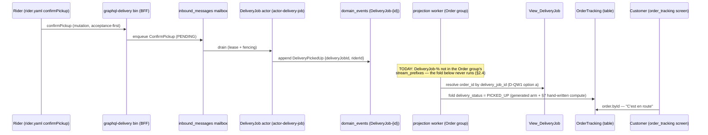

# PROP-20260808-233000 — Customer-anxiety quick wins: the exact spec diff (DeliveryPickedUp into OrderTracking + checkout FAILED state)

- **Status**: Proposed
- **Date**: 2026-08-08
- **Parent proposal**: [PROP-20260808-141817 "The rider/delivery write surface: journeys, vocabulary
  verdict, and V0 slices"](PROP-20260808-141817-rider-delivery-write-surface.md) (Approved
  2026-08-08; this document realizes its §1d/§7 quick wins only — the two customer-facing fixes the
  customer pulled ahead of slices 3–8, [ADR-20260808-230800 answer 3](../adr/ADR-20260808-230800-rider-delivery-slices-1-2-approved-and-applied.md))
- **Sibling document (the pattern)**: [PROP-20260808-221424 "Rider/delivery slices 1–2: the exact
  spec diff"](PROP-20260808-221424-rider-delivery-slices-1-2-spec-diff.md) (Approved + applied;
  slice 1 is on `main` as of commit `082ea22` — this diff was verified AGAINST that state)
- **Tracking issue**: [#348 "Epic: the rider/delivery write surface does not exist (24 of main's 32 validator warnings)"](https://github.com/TheCaptainCompany/captain-food/issues/348)
- **Author**: architect agent, session https://claude.ai/code/session_01CHREdBUBbUgT9HNyhkXSF7

---

> ## PREPARED — NOT APPLIED
>
> `specs/**` is frozen for autonomous loops (CLAUDE.md, non-negotiable). This document is the
> prepared exact diff for the two quick wins; **nothing in it is applied**. It returns to the
> customer for approval like the slice-1 diff did (ADR-20260808-230800 answer 3: "the prepared diff
> comes back for approval like slice 1"). Approval mechanics: §9.

**Why now — these are the two worst customer-facing moments in the product, and both are pre-rider
fixes.** On the independent-rider path the customer's order tracking jumps READY → DELIVERED with a
15–25 minute silent hole exactly at the anxiety peak (the food left the restaurant and the screen
says nothing). And a customer whose card fails at checkout is left on a spinner at the exact moment
money was almost taken — no failure copy, no retry, no "your cart is intact". Neither fix needs any
rider surface; both were hiding inside the rider epic (parent §7). The customer chose to pull them
ahead of slices 3–8.

## 1. Scope of this document

Exactly the parent's two quick wins (§1d rows `DeliveryPickedUp` and `PaymentFailed`, restated in
§7), nothing else:

- **Quick win 1 — `DeliveryPickedUp` into OrderTracking** (§2): the customer's order view moves
  when the rider collects the food. Spec: `specs/database/tables/projection_tables.yaml` only.
- **Quick win 2 — checkout FAILED state for `PaymentFailed`** (§3): failure copy + retry + "your
  cart is intact" on the storefront checkout screen. Spec:
  `specs/screens/restaurant_frontoffice.yaml` + its translations sidecar only.

Per proportionality (docs/proposals/README.md): the parent arbitrated the verdicts (per-option
pros/cons §4, sequence diagrams §5a, the checkout-FAILED and en-route mockups §5b); this child
exists because the customer must approve the *exact spec text*. It surfaces **one** new decision
the parent did not see — the OrderTracking delivery-mirror runtime feed (§2.4) — with per-option
trade-offs and a recommendation, because preparing the exact diff exposed it.

Every `file:line` below was verified by grep + read on the post-slice-1 `main` worktree
(commit `082ea22`, 2026-08-08).

## 2. Quick win 1 — `DeliveryPickedUp` into OrderTracking: the exact diff

### 2.1 What exists today (verified)

- The write side is complete: `ConfirmPickup` → `DeliveryPickedUp` exists end-to-end — command
  handler `crates/application/src/commands.rs:1304-1313`, lifecycle edge ASSIGNED → PICKED_UP
  (`specs/delivery/actors.yaml:62`), inbox entry (`actors.yaml:100`), fixture + behaviour tests
  (`specs/tests.yaml:446`, generated tests fold the full requested → accepted → picked-up →
  completed chain).
- `DeliveryPickedUp` **already feeds `View_DeliveryJob`** (`specs/database/projection_views.yaml:86`,
  status derive `:115`, `picked_up_at` `:177`) — so it produces **no `event-not-projected` warning
  today**, and this diff **clears no warning** (§5, stated so the delta is not oversold).
- `OrderTracking` (the customer's single canonical order read model,
  `specs/database/tables/projection_tables.yaml:474-693`) folds five delivery facts —
  `DeliveryAcceptedByPartner`, `DeliveryAcceptedByRider`, `DeliveryStatusUpdated`,
  `DeliveryCompleted`, `DeliveryDispatchFailed` (`:497-501`) — into `delivery_status` (`:672-681`).
  **`DeliveryPickedUp` is absent from both the `fedBy` list and the column's `from` lineage**: on
  the rider path the mirror can never show PICKED_UP. (On the partner path
  `DeliveryStatusUpdated(PICKED_UP)` covers it — `:677`.)

### 2.2 `specs/database/tables/projection_tables.yaml` — two insertions + one note

**(a)** `OrderTracking.fedBy` — insert between `DeliveryAcceptedByRider` (line 498) and
`DeliveryStatusUpdated` (line 499), mirroring `View_DeliveryJob`'s event order:

```diff
     - { $ref: 'events.yaml#/DeliveryAcceptedByPartner' }
     - { $ref: 'events.yaml#/DeliveryAcceptedByRider' }
+    - { $ref: 'events.yaml#/DeliveryPickedUp' }
     - { $ref: 'events.yaml#/DeliveryStatusUpdated' }
     - { $ref: 'events.yaml#/DeliveryCompleted' }
     - { $ref: 'events.yaml#/DeliveryDispatchFailed' }
```

**(b)** the `delivery_status` column's `from` lineage (lines 672-681) — same insertion point, plus
the note names the rider hop. This is the "derive" half of the parent's sentence: `delivery_status`
is a **computed column** (`projector: app`, line 475), so its per-event mapping lives in the
hand-written compute fn, not in a spec `derive:` map — the spec change is the lineage entry, and
§7 item 1 names the mandatory hand-written arm:

```diff
     delivery_status:
       type: { $ref: 'scalars.yaml#/DeliveryStatus' }
       from:
         - { $ref: 'events.yaml#/DeliveryAcceptedByPartner' }
         - { $ref: 'events.yaml#/DeliveryAcceptedByRider' }
+        - { $ref: 'events.yaml#/DeliveryPickedUp' }
         - { $ref: 'events.yaml#/DeliveryStatusUpdated' }
         - { $ref: 'events.yaml#/DeliveryCompleted' }
         - { $ref: 'events.yaml#/DeliveryDispatchFailed' }
       nullable: true
-      note: "Mirror of the order's DeliveryJob status (correlated by order_id); null for COLLECTION / before dispatch. DeliveryDispatchFailed (offer cap exhausted) mirrors FAILED (ADR-20260720-004556)."
+      note: "Mirror of the order's DeliveryJob status (correlated by order_id); null for COLLECTION / before dispatch. DeliveryPickedUp mirrors PICKED_UP on the rider path (the partner path reports it via DeliveryStatusUpdated); DeliveryDispatchFailed (offer cap exhausted) mirrors FAILED (ADR-20260720-004556)."
```

Both insertions are required **together**: a `fedBy` event no column maps from raises a NEW
`view-fedby-unused` warning (`tools/codegen-rs/src/validate/core.rs:556-569`), and a `from` entry
is what makes the generated dispatch arm call the fold
(`tools/codegen-rs/src/emit/projectors.rs:228-230`). One without the other is either a new warning
or dead spec.

### 2.3 What the spec diff mechanically produces

`make rust` regenerates `crates/application/src/generated/projectors.rs`: the
`project_order_tracking` dispatch (today `:294-363`, delivery arms `:351-355`, `DeliveryPickedUp`
falling through `_ => return state` at `:356`) gains

```rust
DomainEvent::DeliveryPickedUp(_) => { let mut row = state?; let v = c.delivery_status(Some(&row), env); row.delivery_status = v; Some(row) },
```

— mechanical, emitter-derived from `fedBy` + the column lineage. The hand-written compute fn it
calls is §7 item 1.

### 2.4 What the parent's "one-line addition" sentence missed: the mirror's runtime feed is dead

Preparing the exact diff forced reading the projection worker, and the finding outranks the diff:
**the entire OrderTracking delivery mirror — all five events already declared in `fedBy` — never
folds at runtime today.** Two independent breaks, both in code, both pre-existing:

1. **No worker drains `DeliveryJob-%` into OrderTracking.** The projector registry's Order group
   slices `stream_prefixes: &["Order-", "Payment-"]` only
   (`crates/infrastructure/src/projection/worker.rs:280-285`); delivery facts live on
   `DeliveryJob-{id}` streams (`crates/application/src/process_managers/mod.rs:93`). This is a
   KNOWN, documented open item — `docs/sagas.md:60`: "Projection worker never drains
   `DeliveryJob-%` streams — `OrderTracking.delivery_status` mirror columns spec'd but unfed" —
   not a new finding, but the quick win cannot deliver its customer outcome without closing it.
2. **Four of the six delivery payloads carry no `orderId` to key the row.** The cross-stream
   keying (`worker.rs:151-166`) resolves the OrderTracking row from the payload's `orderId` and
   skips-with-a-warn otherwise. Verified payloads: `DeliveryAcceptedByRider`
   (`specs/delivery/events.yaml:40-48`), `DeliveryPickedUp` (`:51-62`), `DeliveryCompleted`
   (`:65-74`), `DeliveryStatusUpdated` (`:200-218`) and `DeliveryAcceptedByPartner` (`:162-181`)
   carry **only `deliveryJobId`**; only `DeliveryRequested` (`:23`) and `DeliveryDispatchFailed`
   (`:99`) carry `orderId`.

So the spec diff is **necessary but not sufficient**: it is the contract and the replay-correct
fold, and the runtime wiring is application-layer work (GREEN lane — `crates/**` only) that the
applying change must carry (§7 items 2–3). The decision the wiring needs:

**Decision D-QW1 — how the worker keys a `DeliveryJob-%` event to its OrderTracking row**

| Option | Pros | Cons |
|---|---|---|
| **(a) Worker-side lookup — resolve `order_id` from `View_DeliveryJob` by `delivery_job_id`** — **RECOMMENDED** | No spec change, no event-contract change (stored events stay untouched — the Young discipline: payload shapes are immutable contracts, and not having to touch them is strictly cheaper); the job's birth fact `DeliveryRequested` already carries `orderId`, so the correlation is already durable in the log and the view; V0-cheap (one indexed view read per delivery event, `projection_views.yaml:100-103` has `order_id` indexed) | Adds a read dependency inside the projection fold path (worker → view over the same `domain_events` — a fold-scan per lookup at V0 scale, fine at Tours volume, revisit with the parent's slice-11 materialization); the lookup is invisible to the spec (an application deviation to record, like slice 1's) |
| (b) Add `orderId` to the four payloads (`DeliveryAcceptedByRider`, `DeliveryPickedUp`, `DeliveryCompleted`, `DeliveryStatusUpdated`) | Self-contained events (house pattern: `PaymentRefunded` carries `orderId` for the same reason); keying stays mechanical in the worker | A **wider `specs/**` diff** (4 event payloads + every fixture/test carrying them + the ACL and command handlers that build them) for data the log already holds one hop away; grows every future delivery event by convention; pre-production so still legal, but it is exactly the payload-enrichment reflex the envelope doctrine warns against — correlation the infrastructure can resolve is not business payload |

This document's diff **assumes option (a)** — which is why §2.2 is the whole spec change. If the
customer prefers (b), this file is rewritten (living document, ADR-20260801-020000) before any
application, and the diff grows to the four payloads.

### 2.5 The flow after application (hexagonal, rider path)



## 3. Quick win 2 — checkout FAILED state for `PaymentFailed`: the exact diff

### 3.1 What exists today (verified)

- **The plumbing is complete, exactly as the parent said**: `PaymentFailed` is recorded inbound
  from the Stripe webhook (`crates/infrastructure/src/mailbox/handler.rs:373,587-588`), the
  PlaceOrderProcess FAILED leg keeps the cart OPEN and places nothing
  (`docs/sagas.md:47`, behaviour test `TestPlaceOrderPaymentFailedPlacesNothing`), and the
  read-side home serves it: `paymentStatus` query (`specs/payments/api.yaml:83-96`) +
  `paymentStatusChanged` subscription (`:169-181`) expose the PM run row's terminal
  `CAPTURED`/`FAILED`. Slice 1 already declared `PaymentFailed` `nonProjectedEvents`
  (`specs/database/projection_views.yaml`, applied).
- **The checkout screen declares no FAILED state** (`specs/screens/restaurant_frontoffice.yaml`,
  screen `checkout`, lines 383-427): no failure copy, no retry, no mention of the intact cart.
- Two adjacent facts found on contact, folded into the diff honestly:
  - The checkout screen **already binds** `{{ payment_status.clientSecret }}` on the Stripe
    element (line 410) **without declaring `paymentStatus.byOrder` in its `data_requirements`**
    (line 391 lists only `cart.current, me.profile`). The diff declares the read the screen
    already performs.
  - The checkout action comment (lines 422-425) claims "the confirmation screen resolves
    paymentStatus.byOrder / subscribes paymentStatusChanged … for the outcome" — but the
    `order_tracking` screen declares **neither** (`data_requirements: [order.byId]` line 437,
    `subscription: orderStatusChanged` line 438). A spec comment claiming what no screen declares.
    The confirmation-page half stays with the parent's slice 8 (§4); this diff does not silently
    expand into it.

### 3.2 `specs/screens/restaurant_frontoffice.yaml` — the checkout screen

**(a)** Declare the payment-outcome read (line 391):

```diff
-    data_requirements: [cart.current, me.profile]
+    # paymentStatus.byOrder: the payment-outcome read this screen ALREADY performs (the Stripe
+    # element binds payment_status.clientSecret below) — now declared. Its orderId arg is the
+    # client-minted PlaceOrder.orderId (supplied by the page at dispatch time; /checkout has no
+    # route param — see the place_order action note).
+    data_requirements: [cart.current, me.profile, paymentStatus.byOrder]
```

**(b)** The FAILED state — insert after the `payment` checkout_section (line 410), before the
`sticky_bottom_bar` (line 411). Every component type is already in the file's
`component_registry` (`conditional_section` layout :137, `text` content :139, `button` inputs
:146); both actions are client-kind `navigate` (`actions:` :93), so no mutation wiring and no
`action-*` warning surface:

```diff
       - type: checkout_section
         title: { $ref: 'restaurant_frontoffice.translations.yaml#/checkout.payment' }
         content:
           - { type: stripe_express_checkout_element, id: stripe_payment, payment_intent_source: "{{ payment_status.clientSecret }}", on_confirm: { type: confirm_payment } }
+      # PAYMENT FAILED state (#348 quick win; PROP-20260808-141817 §1d/§3): the saga outcome
+      # PaymentFailed → run FAILED, nothing placed, the cart stays OPEN
+      # (TestPlaceOrderPaymentFailedPlacesNothing) — so the copy can promise "your cart is
+      # intact" truthfully. Shown when paymentStatus reports FAILED; retry re-enters checkout
+      # (fresh intent, same cart). Synchronous card declines are surfaced inline by Stripe
+      # Elements; this state is the async/webhook outcome the page previously answered with
+      # nothing (a spinner at the peak of the anxiety curve).
+      - type: conditional_section
+        id: payment_failed_state
+        visible_when: "payment_status.status == 'FAILED'"
+        content:
+          - { type: text, value: { $ref: 'restaurant_frontoffice.translations.yaml#/checkout.payment_failed.title' }, style: { size: xl, weight: bold, color: error } }
+          - { type: text, value: { $ref: 'restaurant_frontoffice.translations.yaml#/checkout.payment_failed.body' } }
+          - { type: button, id: retry_payment_btn, label: { $ref: 'restaurant_frontoffice.translations.yaml#/checkout.payment_failed.retry' }, variant: primary, full_width: true, action: { type: navigate, route: "/checkout" } }
+          - { type: button, id: back_to_cart_btn, label: { $ref: 'restaurant_frontoffice.translations.yaml#/checkout.payment_failed.back_to_cart' }, variant: outline, full_width: true, action: { type: navigate, route: "/cart" } }
       - type: sticky_bottom_bar
```

This realizes the parent's §5b mockup ("Paiement refusé / Votre carte n'a pas été débitée. Votre
panier est intact. / RÉESSAYER LE PAIEMENT / Revenir au panier"); the mockup's third control
("Changer de moyen de paiement") is subsumed by retry — re-entering checkout re-opens Stripe's
payment-method selection, and a third dead-weight button on a mobile failure sheet is noise.

### 3.3 `specs/screens/restaurant_frontoffice.translations.yaml` — four keys

Insert after `checkout.place_order` (lines 109-111), closing the `# ── checkout ──` block:

```diff
 checkout.place_order:
   params: { total: "formatted order total" }
   messages: { en: "Place order — {total}", fr: "Commander — {total}" }
+checkout.payment_failed.title: { messages: { en: "Payment failed", fr: "Paiement refusé" } }
+checkout.payment_failed.body:  { messages: { en: "Your card was not charged. Your cart is intact.", fr: "Votre carte n'a pas été débitée. Votre panier est intact." } }
+checkout.payment_failed.retry: { messages: { en: "Retry payment", fr: "Réessayer le paiement" } }
+checkout.payment_failed.back_to_cart: { messages: { en: "Back to cart", fr: "Revenir au panier" } }
```

All four are referenced by §3.2 only; the validator's screens pass proves each `$ref` resolves to
an entry with `messages` (`screen-translation-ref-unresolved`, `core.rs:1524-1533`) and that no
content ref escapes the translations scope (`screen-ref-out-of-scope`, `:1534-1539`).

### 3.4 The flow after application

```mermaid
sequenceDiagram
    participant C as Customer (checkout page, sdui:false)
    participant G as server bin (BFF, /customer/graphql)
    participant PM as PlaceOrderProcess (run row)
    participant S as Stripe (webhook)
    participant ACL as Stripe ACL (inbound)
    participant E as domain_events (Payment-{intentId})

    C->>G: placeOrder (acceptance-first; orderId client-minted)
    PM->>PM: create intent; clientSecret on run row
    C->>G: paymentStatus.byOrder (declared read) → clientSecret
    C->>S: Stripe Elements confirm
    S->>ACL: payment_intent.payment_failed
    ACL->>E: append PaymentFailed (inbound fact, no command)
    E->>PM: run → FAILED; cart stays OPEN (nothing placed)
    C->>G: paymentStatus.byOrder / paymentStatusChanged → status FAILED
    Note over C: payment_failed_state renders:<br/>copy + retry + "your cart is intact"
    C->>C: retry → /checkout (same cart, fresh intent)
```

## 4. What does NOT change (and why)

- **No event, command, error, rule, test or story changes.** Both quick wins are pure read-side
  (a projection lineage entry, a screen state). ADR-0032 completeness gates are untouched:
  `DeliveryPickedUp` keeps its existing tests; no new mutation/query means no new story step.
- **The delivery event payloads — untouched** under D-QW1 option (a) (§2.4). If (b) is chosen,
  this file is rewritten first.
- **The `order_tracking` (confirmation) screen — untouched.** Its missing payment read/subscription
  declaration and the courier-row binding (`delivery.byOrder`) are the parent's slice 8
  (`customer-delivery-reassurance`), which also owns the `rider.yaml:106` orphan binding and the
  degraded-ETA copy. The comment-vs-spec mismatch found in §3.1 is recorded there, not fixed here.
- **`View_DeliveryJob` — untouched** (already folds `DeliveryPickedUp`, including `picked_up_at`).
  The "Récupérée au restaurant 19:38" timestamp row in the parent's mockup reads
  `View_DeliveryJob.picked_up_at` via `delivery.byOrder` — slice 8, not this diff.
- **No new SQL schema.** `delivery_status` already exists on the `order_tracking` table; no column
  is added, so `schema.generated.sql` and migrations are unchanged. `views.generated.sql` is
  unchanged (OrderTracking is a table, not a fold view).
- **`specs/screens/` other audiences, `api.yaml`, `stories.yaml` — untouched.** Zero occurrences
  of the new state/keys outside the two files above.

## 5. Expected validator delta (against the NEW post-slice-1 baseline of 37 — re-measure on a pristine `main` before comparing)

Post-slice-1 baseline composition (from PROP-20260808-221424 §4, confirmed applied by
ADR-20260808-230800): `command-no-mutation` 11 · `event-not-projected` 7 ·
`action-missing-required-input` 10 · `action-unknown-input` 7 · `view-fedby-unused` 1 ·
`identity-property-not-on-command` 1 = **37**.

| Change | Warning kind | Delta |
|---|---|---|
| QW1: `DeliveryPickedUp` into fedBy + `delivery_status.from` | `event-not-projected` | **0** — `DeliveryPickedUp` already feeds `View_DeliveryJob` (`projection_views.yaml:86`), so it does NOT warn today and there is nothing to clear. Verified against the check (`core.rs:585`: any view's fedBy suffices) |
| QW1: same | `view-fedby-unused` | **0 new** — guaranteed by the paired `from` entry (§2.2); fedBy alone would have added one |
| QW2: checkout state + 4 translation keys | `action-*` | **0 new** — no mutation-bearing action is added (`navigate` is client-kind, exempt from the input checks at `core.rs:1417-1475`) |
| QW2: same | screens errors | **0** — all component types registered, all `$ref`s resolve, `paymentStatus.byOrder` is a declared file-level resolver (line 79), so `screen-unknown-resolver` cannot fire |
| **Total** | | **37 → 37, zero errors, zero new warnings** |

**This diff is honest about clearing nothing.** Its value is entirely customer-facing behaviour,
not warning count — unlike slices 1–2, whose value was partly the −8. The definition of done for
the applying change is therefore: 0 errors, warning histogram byte-identical to the re-measured
pristine baseline, `check-drift` clean after `make rust`.

**Revert cost**: trivial for the spec halves (`git revert`; no stored-event shape changes under
option (a), so the Young immutability clock never starts). The §7 worker wiring is additive code
with its own tests; reverting it re-opens the documented `docs/sagas.md:60` gap, nothing worse.

## 6. Deviations from the parent's quick-win sentences — found on contact with the specs

1. **"A one-line addition to OrderTracking's fedBy plus the `delivery_status` derive" is three
   things, not one** — the fedBy entry, the column `from` entry (without which the fedBy addition
   is a NEW `view-fedby-unused` warning and an empty generated arm), and a hand-written compute
   arm (§7 item 1), because `delivery_status` is an `projector: app` Complex column whose
   per-event mapping lives in Rust, not in a spec `derive:` map.
2. **The quick win's customer outcome does not ship with the spec diff at all** (§2.4): the
   OrderTracking delivery mirror has never folded at runtime — the Order projector group drains
   only `Order-%`/`Payment-%` (`worker.rs:282`), and four of six delivery payloads carry no
   `orderId` to key the row (`worker.rs:151-166` skips them). Known open item
   (`docs/sagas.md:60`), but the parent's §7 sentence implied a spec-only fix. The applying
   change must carry the worker extension (§7 items 2–3) or the customer sees nothing move.
3. **The checkout screen was already reading `paymentStatus` undeclared** (line 410 binds
   `payment_status.clientSecret` with no `data_requirements` entry) — the diff declares it rather
   than adding a parallel read.
4. **The checkout action comment promises confirmation-screen behaviour no screen declares**
   (lines 422-425 vs `order_tracking`'s 437-438) — recorded here for slice 8; a comment claiming
   a capability the spec lacks is exactly the class the slice-1 sweep (its §5) existed to catch.

None changes the parent's verdicts; items 1–2 change the *size and shape of the application*,
which is why they are written down before approval rather than discovered mid-apply.

## 7. Application sweep — the NON-spec files the applying session must touch

Slice 1's application found its prepared diff had missed emitter/hand-written code; this grep was
done NOW (`grep -rn` across `crates/**` hand-written + `tools/codegen-rs/src`, excluding
`*/generated/*`), on commit `082ea22`:

**Hand-written code (must be edited — application deviations, recorded like slice 1's):**

1. `crates/application/src/projectors/order_tracking.rs:146-157` — the `delivery_status` compute
   fn has **no `DeliveryPickedUp` arm**; it falls through `_ => prev`, so even with the generated
   dispatch arm the fold would keep ASSIGNED forever. Add:
   `DomainEvent::DeliveryPickedUp(_) => Some(DeliveryStatus::PICKED_UP),` (mirror of the
   `View_DeliveryJob` derive map, `projection_views.yaml:115`).
2. `crates/infrastructure/src/projection/worker.rs:280-285` — add `"DeliveryJob-"` to the Order
   group's `stream_prefixes` (one checkpoint, so payment and delivery facts stay ordered by
   global `position` — the same reasoning as the existing `Payment-%` slice, comment `:277-279`).
3. `crates/infrastructure/src/projection/worker.rs:146-172` — the OrderTracking keying branch:
   under D-QW1 option (a), resolve `order_id` from `View_DeliveryJob` by the payload's
   `deliveryJobId` for `DeliveryJob-%` events whose payload has no `orderId` (today they are
   skipped with a warn). `DeliveryDispatchFailed`/`DeliveryRequested` keep the payload path.
4. `crates/infrastructure/tests/order_projection.rs` — zero delivery coverage today (grep:
   `Delivery` = 0 hits). Add a fold test: seed `Order-%` (placed/accepted/ready) + `DeliveryJob-%`
   (requested/accepted-by-rider/picked-up), assert `delivery_status = 'PICKED_UP'` on the
   OrderTracking row — the mirror's first-ever runtime proof (pattern:
   `crates/infrastructure/tests/delivery_read_model.rs:135-232`).
5. `crates/web/src/checkout.rs` (and its renderer wiring) — the checkout page is `sdui: false`
   (a hand-written page honoring the spec contract): today **no code in `crates/web` renders a
   payment-FAILED state** (grep `FAILED` in `crates/web/src/*.rs`: only operation-status
   plumbing in `actions.rs`/`pending.rs`; `checkout.rs`'s bounded intent poll surfaces
   `IntentUnavailable`, not the FAILED copy). The page must render `payment_failed_state` from
   `paymentStatus.status == FAILED` (its poll + `subscriptions.rs` push already deliver the
   value). Frontend catch-up may land as a fast follower; the spec state is the contract either
   way — but say so in the applying PR, so the screen spec is not read as shipped UX.

**Generated artifacts (regenerated by `make rust` — never hand-edited):**

- `crates/application/src/generated/projectors.rs` (the new `DeliveryPickedUp` dispatch arm);
- `crates/web/src/generated/screens.rs` / `data_layer.rs` (checkout screen tree +
  data-requirements; `ResolverKey::PaymentStatusByOrder` already exists — no new key);
- `specs/generated/translations.generated.json` (the 4 keys);
- `specs/generated/documentation.generated.md` / `.html` and the `specs/database.md`
  GENERATED region (OrderTracking §, line 357);
- `specs/generated/schema.generated.sql` / `views.generated.sql` — expected **unchanged** (no
  column, no view change); if either drifts, stop and re-derive.

**Explicitly NOT in the sweep:** `tools/codegen-rs` — zero emitter/validator changes needed
(verified: the projectors emitter handles the new arm mechanically, `emit/projectors.rs:173-245`;
the screens validator needs nothing new). `migrations/**` — no schema change.

## 8. Sequencing

- Quick win 2 is independently applicable (screens + translations + web page only).
- Quick win 1's spec half is independently applicable and gate-green on its own (§5), but
  customer-visible only with §7 items 1–3; apply them as ONE change so the epic's headline fix is
  not spec theater. Neither quick win touches slices 3–8 files; no coordination with
  [#415 "Rider identity: View_Rider, register/update/profile surface, onboarding screens (#348 slice 3)"](https://github.com/TheCaptainCompany/captain-food/issues/415)
  is needed beyond ordinary non-concurrent dispatch on `worker.rs`.

## 9. Approval mechanics

- **To approve**: the customer replies (issue comment on
  [#348 "Epic: the rider/delivery write surface does not exist (24 of main's 32 validator warnings)"](https://github.com/TheCaptainCompany/captain-food/issues/348),
  or any recorded channel) approving this proposal — wholly, or per quick win (§2 and §3 are
  fully severable), and naming the D-QW1 option (§2.4; the recommendation is (a); silence on it
  with a whole-document approval is read as (a), since the prepared diff assumes it).
- **Application**: on approval, the applying session (plan mode, or the run itself if the
  customer again chooses immediate application as in ADR-20260808-230800 answer 5) applies the
  spec text exactly as written, carries the §7 hand-written items in the same change, runs the
  full `make rust` gate (0 errors; warning histogram identical to a re-measured pristine-`main`
  baseline per §5; `check-drift` clean), and lands it per the repo's workflow for code-bearing
  changes (this one touches `crates/**`, so: claim → branch → draft PR → ready+auto-merge,
  supervised to MERGED — not the spec-only direct push).
- **To reject or amend**: name the section; this file is rewritten (living document,
  ADR-20260801-020000) before any application. The applying session then flips this Status line,
  recording date, scope and the D-QW1 choice.
