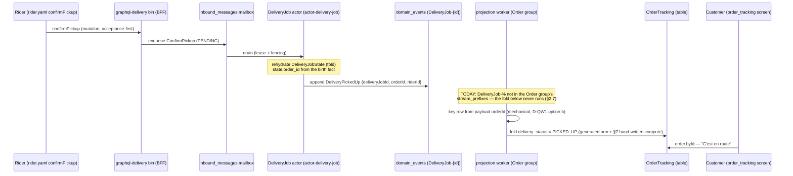

# PROP-20260808-233000 — Customer-anxiety quick wins: the exact spec diff (DeliveryPickedUp into OrderTracking + checkout FAILED state)

- **Status**: Proposed
- **Date**: 2026-08-08 (rewritten same night for D-QW1 option (b) — living document, ADR-20260801-020000)
- **Decision applied**: **D-QW1 was decided by the customer as option (b)** — `orderId` joins the four
  delivery event payloads — via the answer-sheet card recorded in
  [ADR-20260808-234907 "Brief answer sheet: cards 1–7 confirmed, D-QW1 decided as option (b)"](../adr/ADR-20260808-234907-answer-sheet-confirmations-dqw1-option-b.md).
  The required-vs-nullable calls in §2.2 are resolved per
  [ADR-20260808-235113 "Final vision first"](../adr/ADR-20260808-235113-final-vision-first-no-intermediate-steps.md):
  required wherever every emitter can supply the field; nullable only where an emitter genuinely
  cannot, with the reason named.
- **Parent proposal**: [PROP-20260808-141817 "The rider/delivery write surface: journeys, vocabulary
  verdict, and V0 slices"](PROP-20260808-141817-rider-delivery-write-surface.md) (Approved
  2026-08-08; this document realizes its §1d/§7 quick wins only — the two customer-facing fixes the
  customer pulled ahead of slices 3–8, [ADR-20260808-230800 answer 3](../adr/ADR-20260808-230800-rider-delivery-slices-1-2-approved-and-applied.md))
- **Sibling document (the pattern)**: [PROP-20260808-221424 "Rider/delivery slices 1–2: the exact
  spec diff"](PROP-20260808-221424-rider-delivery-slices-1-2-spec-diff.md) (Approved + applied;
  slice 1 is on `main` as of commit `082ea22` — this diff was verified AGAINST that state)
- **Tracking issue**: [#348 "Epic: the rider/delivery write surface does not exist (24 of main's 32 validator warnings)"](https://github.com/TheCaptainCompany/captain-food/issues/348)
- **Author**: architect agent, session https://claude.ai/code/session_01CHREdBUBbUgT9HNyhkXSF7

---

> ## PREPARED — NOT APPLIED
>
> `specs/**` is frozen for autonomous loops (CLAUDE.md, non-negotiable). This document is the
> prepared exact diff for the two quick wins, **rewritten for D-QW1 option (b)** per the customer's
> answer sheet (ADR-20260808-234907); **nothing in it is applied**. Per that ADR's consequences,
> the rewritten exact text returns to the customer for approval like the slice-1 diff did.
> Approval mechanics: §9.

**Why now — these are the two worst customer-facing moments in the product, and both are pre-rider
fixes.** On the independent-rider path the customer's order tracking jumps READY → DELIVERED with a
15–25 minute silent hole exactly at the anxiety peak (the food left the restaurant and the screen
says nothing). And a customer whose card fails at checkout is left on a spinner at the exact moment
money was almost taken — no failure copy, no retry, no "your cart is intact". Neither fix needs any
rider surface; both were hiding inside the rider epic (parent §7). The customer chose to pull them
ahead of slices 3–8.

## 1. Scope of this document

Exactly the parent's two quick wins (§1d rows `DeliveryPickedUp` and `PaymentFailed`, restated in
§7), nothing else:

- **Quick win 1 — `DeliveryPickedUp` into OrderTracking** (§2): the customer's order view moves
  when the rider collects the food. Spec, under option (b): `specs/delivery/events.yaml` (the four
  payloads), `specs/database/tables/projection_tables.yaml` (fedBy + lineage), and
  `specs/tests.yaml` (every fixture and inline data block building those events — the validator
  forces the three files to land atomically, §5).
- **Quick win 2 — checkout FAILED state for `PaymentFailed`** (§3): failure copy + retry + "your
  cart is intact" on the storefront checkout screen. Spec:
  `specs/screens/restaurant_frontoffice.yaml` + its translations sidecar only. **Unchanged by the
  D-QW1 decision.**

Per proportionality (docs/proposals/README.md): the parent arbitrated the verdicts (per-option
pros/cons §4, sequence diagrams §5a, the checkout-FAILED and en-route mockups §5b); this child
exists because the customer must approve the *exact spec text*. The one decision it surfaced —
D-QW1, how delivery events key their OrderTracking row (§2.6) — has been **decided by the
customer as option (b)**; the option table stays below as the decision record.

Every `file:line` below was verified by grep + read on the post-slice-1 `main` worktree
(commit `082ea22`; re-verified at `6e1ef61`, 2026-08-08 — docs-only commits since, code lines
unchanged).

## 2. Quick win 1 — `DeliveryPickedUp` into OrderTracking: the exact diff

### 2.1 What exists today (verified)

- The write side is complete: `ConfirmPickup` → `DeliveryPickedUp` exists end-to-end — command
  handler `crates/application/src/commands.rs:1307-1339`, lifecycle edge ASSIGNED → PICKED_UP
  (`specs/delivery/actors.yaml:62`), inbox entry (`actors.yaml:100`), fixture + behaviour tests
  (`specs/tests.yaml:445-447`, generated tests fold the full requested → accepted → picked-up →
  completed chain).
- `DeliveryPickedUp` **already feeds `View_DeliveryJob`** (`specs/database/projection_views.yaml:86`,
  status derive `:115`, `picked_up_at` `:177`) — so it produces **no `event-not-projected` warning
  today**, and this diff **clears no warning** (§5, stated so the delta is not oversold).
- `OrderTracking` (the customer's single canonical order read model,
  `specs/database/tables/projection_tables.yaml:474-693`) folds five delivery facts —
  `DeliveryAcceptedByPartner`, `DeliveryAcceptedByRider`, `DeliveryStatusUpdated`,
  `DeliveryCompleted`, `DeliveryDispatchFailed` (`:497-501`) — into `delivery_status` (`:672-681`).
  **`DeliveryPickedUp` is absent from both the `fedBy` list and the column's `from` lineage**: on
  the rider path the mirror can never show PICKED_UP. (On the partner path
  `DeliveryStatusUpdated(PICKED_UP)` covers it — `:677`.)
- Payloads (verified in `specs/delivery/events.yaml`): `DeliveryAcceptedByRider` (`:40-48`),
  `DeliveryPickedUp` (`:51-62`), `DeliveryCompleted` (`:65-74`) and `DeliveryStatusUpdated`
  (`:200-218`) carry **only `deliveryJobId`** (plus rider/status fields); only the job's birth fact
  `DeliveryRequested` (`:23`, required) and `DeliveryDispatchFailed` (`:99`) carry `orderId`.
  Closing that gap is what D-QW1 option (b) decides.

### 2.2 `specs/delivery/events.yaml` — `orderId` joins the four payloads (D-QW1 option b)

House precedent: `PaymentRefunded` carries `orderId` for the same cross-aggregate keying reason.
Every emitter of the three **command-driven** facts rehydrates the aggregate first and rejects
`DeliveryJobNotFound` before emitting — the folded birth fact (`DeliveryRequested.orderId`,
required) is therefore always in hand, so per ADR-20260808-235113 the field is **required** on all
three. The **inbound** fact is the one place an emitter genuinely cannot always supply it (§2.6
rationale row 4), so there — and only there — it is **nullable**.

**(a) `DeliveryAcceptedByRider` (lines 40-48) — `orderId` REQUIRED.** Sole production emitter is
`accept_delivery` (`commands.rs:1277-1302`), guarded by `require_delivery_job` → the birth exists →
the fold supplies it.

```diff
 DeliveryAcceptedByRider:
   description: "An independent Captain rider accepted the delivery job."
   type: object
   properties:
     deliveryJobId:
       $ref: 'scalars.yaml#/DeliveryJobId'
+    orderId:
+      $ref: 'scalars.yaml#/OrderId'
+      description: "The order this job delivers — self-contained cross-aggregate keying (D-QW1 option b, ADR-20260808-234907; the PaymentRefunded precedent)."
     riderId:
       $ref: 'scalars.yaml#/RiderId'
-  required: [deliveryJobId, riderId]
+  required: [deliveryJobId, orderId, riderId]
```

**(b) `DeliveryPickedUp` (lines 51-62) — `orderId` REQUIRED.** Sole production emitter is
`confirm_pickup` (`commands.rs:1307-1339`), same guard, same fold.

```diff
 DeliveryPickedUp:
   description: "The rider collected the order from the restaurant."
   type: object
   properties:
     deliveryJobId:
       $ref: 'scalars.yaml#/DeliveryJobId'
+    orderId:
+      $ref: 'scalars.yaml#/OrderId'
+      description: "The order this job delivers — self-contained cross-aggregate keying (D-QW1 option b, ADR-20260808-234907)."
     riderId:
       $ref: 'scalars.yaml#/RiderId'
     at:
       type: string
       format: date-time
-  required: [deliveryJobId, riderId]
+  required: [deliveryJobId, orderId, riderId]
```

**(c) `DeliveryCompleted` (lines 65-74) — `orderId` REQUIRED.** Sole production emitter is
`complete_delivery` (`commands.rs:1345-1377`), same guard, same fold.

```diff
 DeliveryCompleted:
   description: "The rider handed the order over to the customer (independent-rider delivery success)."
   type: object
   properties:
     deliveryJobId:
       $ref: 'scalars.yaml#/DeliveryJobId'
+    orderId:
+      $ref: 'scalars.yaml#/OrderId'
+      description: "The order this job delivers — self-contained cross-aggregate keying (D-QW1 option b, ADR-20260808-234907)."
     at:
       type: string
       format: date-time
-  required: [deliveryJobId]
+  required: [deliveryJobId, orderId]
```

**(d) `DeliveryStatusUpdated` (lines 200-218) — `orderId` NULLABLE.** This is the honest exception
ADR-20260808-235113 demands be named rather than defaulted into: two of its emitters genuinely
cannot always supply the field. (i) The three partner ACLs construct it at webhook-map time from
partner data that carries no `orderId` (`crates/adapters/avelo37/src/acl.rs:311-329`,
`coopcycle/src/acl.rs:301`, `uber_direct/src/acl.rs:256`) — solvable alone by recorder enrichment,
but (ii) the inbound recorder's **orphan doctrine** is not: a partner fact for a stream with no
`DeliveryRequested` birth is STILL recorded — facts are never dropped
(`crates/application/src/deliveries.rs:94-101`, module doctrine `:25-27`) — and on a birthless
stream **no `orderId` exists anywhere in the system**. A required field would force dropping the
partner fact or fabricating an id; both are worse contracts than a nullable field whose null is
precisely the recorded anomaly. The final clean wiring (§7): every path that CAN know it supplies
it — the generated command handler from folded state, the recorder by enrichment — so null occurs
**only** on the orphan anomaly, which has no OrderTracking row to key anyway.

```diff
 DeliveryStatusUpdated:
   description: "The delivery partner reported a status change for the job (inbound): PICKED_UP, OUT_FOR_DELIVERY, DELIVERED, FAILED…"
   type: object
   properties:
     deliveryJobId:
       $ref: 'scalars.yaml#/DeliveryJobId'
+    orderId:
+      $ref: 'scalars.yaml#/OrderId'
+      nullable: true
+      description: "The order this job delivers (D-QW1 option b, ADR-20260808-234907). Nullable, NOT for convenience: partner webhooks carry no orderId and the inbound recorder legally appends facts to birthless orphan streams where none exists (deliveries.rs orphan doctrine). Every non-orphan path supplies it — the command handler from folded state, the recorder by enrichment from the birth fact — so null marks exactly the orphan anomaly."
     partnerRef:
       $ref: 'scalars.yaml#/ExternalReference'
       nullable: true
     status:
       $ref: 'scalars.yaml#/DeliveryStatus'
     occurredAt:
       type: string
       format: date-time
     note:
       type: string
       maxLength: 500
       nullable: true
   required: [deliveryJobId, status]
```

(`required` unchanged for (d).) `DeliveryAcceptedByPartner` is untouched: it is not one of the four
D-QW1 events, and its assignment fold already keys `View_DeliveryJob` by stream; the OrderTracking
mirror reads it through the same worker path, where its missing `orderId` is a pre-existing,
separately-scoped gap the parent's slice 8 owns (it feeds the courier row, not `delivery_status`
progress — the ASSIGNED mirror hop on the partner path arrives via the enriched
`DeliveryStatusUpdated` stream that follows).

### 2.3 `specs/database/tables/projection_tables.yaml` — two insertions + one note

**(a)** `OrderTracking.fedBy` — insert between `DeliveryAcceptedByRider` (line 498) and
`DeliveryStatusUpdated` (line 499), mirroring `View_DeliveryJob`'s event order:

```diff
     - { $ref: 'events.yaml#/DeliveryAcceptedByPartner' }
     - { $ref: 'events.yaml#/DeliveryAcceptedByRider' }
+    - { $ref: 'events.yaml#/DeliveryPickedUp' }
     - { $ref: 'events.yaml#/DeliveryStatusUpdated' }
     - { $ref: 'events.yaml#/DeliveryCompleted' }
     - { $ref: 'events.yaml#/DeliveryDispatchFailed' }
```

**(b)** the `delivery_status` column's `from` lineage (lines 672-681) — same insertion point, plus
the note names the rider hop. This is the "derive" half of the parent's sentence: `delivery_status`
is a **computed column** (`projector: app`, line 475), so its per-event mapping lives in the
hand-written compute fn, not in a spec `derive:` map — the spec change is the lineage entry, and
§7 item 8 names the mandatory hand-written arm:

```diff
     delivery_status:
       type: { $ref: 'scalars.yaml#/DeliveryStatus' }
       from:
         - { $ref: 'events.yaml#/DeliveryAcceptedByPartner' }
         - { $ref: 'events.yaml#/DeliveryAcceptedByRider' }
+        - { $ref: 'events.yaml#/DeliveryPickedUp' }
         - { $ref: 'events.yaml#/DeliveryStatusUpdated' }
         - { $ref: 'events.yaml#/DeliveryCompleted' }
         - { $ref: 'events.yaml#/DeliveryDispatchFailed' }
       nullable: true
-      note: "Mirror of the order's DeliveryJob status (correlated by order_id); null for COLLECTION / before dispatch. DeliveryDispatchFailed (offer cap exhausted) mirrors FAILED (ADR-20260720-004556)."
+      note: "Mirror of the order's DeliveryJob status (correlated by order_id); null for COLLECTION / before dispatch. DeliveryPickedUp mirrors PICKED_UP on the rider path (the partner path reports it via DeliveryStatusUpdated); DeliveryDispatchFailed (offer cap exhausted) mirrors FAILED (ADR-20260720-004556)."
```

Both insertions are required **together**: a `fedBy` event no column maps from raises a NEW
`view-fedby-unused` warning (`tools/codegen-rs/src/validate/core.rs:556-569`), and a `from` entry
is what makes the generated dispatch arm call the fold
(`tools/codegen-rs/src/emit/projectors.rs:228-230`). One without the other is either a new warning
or dead spec.

### 2.4 `specs/tests.yaml` — every data block that builds the four events (8 sites, enumerated by grep)

Grep of the four event names across `specs/tests.yaml`: **5 fixtures + 3 inline `when:` data
blocks**, no other data sites. All use the delivery fixture chain's `orderId: "order-1"`
(consistent with `deliveryRequested`, line 438). The three inline `when:` blocks for the inbound
fact model the **post-enrichment** event — the fact as production records it (the recorder fills
`orderId` from the fold before append, §7 item 7; the generated test bed appends the constructed
event verbatim, `crates/application/src/behaviour_support.rs:179-185`).

Fixtures (`specs/tests.yaml`):

```diff
   deliveryAcceptedByRider:
     type: { $ref: 'events.yaml#/DeliveryAcceptedByRider' }
-    data: { deliveryJobId: "deliv-1", riderId: "rider-1" }
+    data: { deliveryJobId: "deliv-1", orderId: "order-1", riderId: "rider-1" }
   deliveryPickedUp:
     type: { $ref: 'events.yaml#/DeliveryPickedUp' }
-    data: { deliveryJobId: "deliv-1", riderId: "rider-1" }
+    data: { deliveryJobId: "deliv-1", orderId: "order-1", riderId: "rider-1" }
   deliveryCompleted:
     type: { $ref: 'events.yaml#/DeliveryCompleted' }
-    data: { deliveryJobId: "deliv-1" }
+    data: { deliveryJobId: "deliv-1", orderId: "order-1" }
```

```diff
   deliveryStatusUpdatedDelivered:
     type: { $ref: 'events.yaml#/DeliveryStatusUpdated' }
-    data: { deliveryJobId: "deliv-1", status: "DELIVERED" }
+    data: { deliveryJobId: "deliv-1", orderId: "order-1", status: "DELIVERED" }
   deliveryStatusUpdatedPickedUp:
     type: { $ref: 'events.yaml#/DeliveryStatusUpdated' }
-    data: { deliveryJobId: "deliv-1", partnerRef: "avelo-77", status: "PICKED_UP" }
+    data: { deliveryJobId: "deliv-1", orderId: "order-1", partnerRef: "avelo-77", status: "PICKED_UP" }
```

Inline `when:` data blocks:

```diff
   TestDispatchClosesOrderOnPartnerDelivered:      # line 2533-2534
     when:
       type: { $ref: 'events.yaml#/DeliveryStatusUpdated' }
-      data: { deliveryJobId: "deliv-1", status: "DELIVERED" }
+      data: { deliveryJobId: "deliv-1", orderId: "order-1", status: "DELIVERED" }
   TestDispatchClosesOrderOnRiderCompleted:        # line 2550-2551
     when:
       type: { $ref: 'events.yaml#/DeliveryCompleted' }
-      data: { deliveryJobId: "deliv-1" }
+      data: { deliveryJobId: "deliv-1", orderId: "order-1" }
   TestDeliveryJobRecordsPartnerStatusReport:      # line 2842-2843
     when:
       type: { $ref: 'events.yaml#/DeliveryStatusUpdated' }
-      data: { deliveryJobId: "deliv-1", partnerRef: "avelo-77", status: "PICKED_UP" }
+      data: { deliveryJobId: "deliv-1", orderId: "order-1", partnerRef: "avelo-77", status: "PICKED_UP" }
```

One fixture is load-bearing beyond fold inputs: `deliveryStatusUpdatedDelivered` is the `then:` of
`TestDeliveryStatusUpdatedByCommand` (line 2847-2859), whose `when:` is the **command**
`UpdateDeliveryStatus` — the generated handler must therefore emit `orderId: "order-1"` from
folded state for the regenerated test to pass. That is §7 item 5 (the codegen seam extension),
and this fixture is the executable proof it landed.

### 2.5 What the spec diff mechanically produces

`make rust` regenerates:

- `crates/domains/delivery/src/events.rs` — the four structs gain `order_id` (`OrderId` on the
  three required events, `Option<OrderId>` on `DeliveryStatusUpdated`). **The compiler then walks
  the sweep for us**: every construction site in §7 fails to compile until it supplies the field.
- `crates/application/src/generated/projectors.rs` — the `project_order_tracking` dispatch (today
  `:294-363`, delivery arms `:351-355`, `DeliveryPickedUp` falling through `_ => return state` at
  `:356`) gains

```rust
DomainEvent::DeliveryPickedUp(_) => { let mut row = state?; let v = c.delivery_status(Some(&row), env); row.delivery_status = v; Some(row) },
```

  — mechanical, emitter-derived from `fedBy` + the column lineage. The hand-written compute fn it
  calls is §7 item 8.
- `crates/application/src/generated/behaviour_tests.rs` — the fixture struct literals regain all
  fields from the updated data blocks (`emit/behaviour_tests.rs:171-205`).
- `crates/application/src/generated/handlers.rs` — `update_delivery_status` emits
  `order_id: Some(state.order_id)` **once the emitter carries the seam extension** (§7 item 5);
  without it the template's `None` fallback (`emit/rust_domain.rs:1004`) compiles but fails the
  regenerated `TestDeliveryStatusUpdatedByCommand`.

### 2.6 Decision record — D-QW1, decided

Preparing the first version of this diff forced reading the projection worker and surfaced the
decision the parent's "one-line addition" sentence missed: the OrderTracking delivery mirror had
no runtime keying for four of the six delivery payloads. The option table is kept verbatim as the
decision record; the prepared diff of the first version assumed (a), the recommendation.

**Decision D-QW1 — how the worker keys a `DeliveryJob-%` event to its OrderTracking row**

| Option | Pros | Cons |
|---|---|---|
| (a) Worker-side lookup — resolve `order_id` from `View_DeliveryJob` by `delivery_job_id` — *recommended by the first version* | No spec change, no event-contract change (stored events stay untouched — the Young discipline: payload shapes are immutable contracts, and not having to touch them is strictly cheaper); the job's birth fact `DeliveryRequested` already carries `orderId`, so the correlation is already durable in the log and the view; V0-cheap (one indexed view read per delivery event, `projection_views.yaml:100-103` has `order_id` indexed) | Adds a read dependency inside the projection fold path (worker → view over the same `domain_events` — a fold-scan per lookup at V0 scale, fine at Tours volume, revisit with the parent's slice-11 materialization); the lookup is invisible to the spec (an application deviation to record, like slice 1's) |
| **(b) Add `orderId` to the four payloads (`DeliveryAcceptedByRider`, `DeliveryPickedUp`, `DeliveryCompleted`, `DeliveryStatusUpdated`) — CHOSEN by the customer, [ADR-20260808-234907](../adr/ADR-20260808-234907-answer-sheet-confirmations-dqw1-option-b.md)** | Self-contained events (house pattern: `PaymentRefunded` carries `orderId` for the same reason); keying stays mechanical in the worker — **zero keying code**, `worker.rs:154` already reads the payload's `orderId` generically; no read dependency inside the fold path, ever (the slice-11 revisit disappears) | A **wider `specs/**` diff** (4 event payloads + 8 tests.yaml data sites + the ACL, command-handler, domain-state and codegen-emitter changes of §7) for data the log already holds one hop away; grows every future delivery event by convention; pre-production so still legal, but it is the payload-enrichment reflex the envelope doctrine warns against — correlation the infrastructure can resolve is not business payload |

The customer chose **(b)**, and days-later generalized the reasoning as the standing
final-vision-first principle (ADR-20260808-235113): the self-contained payload is the final clean
contract; the worker-side lookup was the smaller intermediate. This document now carries the (b)
diff exactly. Three costs of (b) that the cons row did not price were found on contact and are
recorded honestly in §6 items 3–5 — none changes the decision's viability, all change the
application's size.

### 2.7 The mirror's runtime feed is still dead — the worker wiring option (b) does NOT remove

Option (b) makes the **keying** mechanical, but the first break found in §2.6's investigation
stands unchanged: **no worker drains `DeliveryJob-%` into OrderTracking at all.** The projector
registry's Order group slices `stream_prefixes: &["Order-", "Payment-"]` only
(`crates/infrastructure/src/projection/worker.rs:280-285`); delivery facts live on
`DeliveryJob-{id}` streams (`crates/application/src/process_managers/mod.rs:93`). This is a KNOWN,
documented open item — `docs/sagas.md:60`: "Projection worker never drains `DeliveryJob-%` streams
— `OrderTracking.delivery_status` mirror columns spec'd but unfed" — not a new finding, but the
quick win cannot deliver its customer outcome without closing it. The final wiring (no partial
slice, per ADR-20260808-235113): widen the Order group to
`stream_prefixes: &["Order-", "Payment-", "DeliveryJob-"]` — the whole `DeliveryJob-%` family
under the SAME checkpoint, so order, payment and delivery facts fold in global `position` order
(the same reasoning as the existing `Payment-%` slice, comment `worker.rs:277-279`). The keying
branch (`worker.rs:151-166`) then needs **zero change**: it already resolves the row from the
payload's `orderId` generically and skips-with-a-warn otherwise — and under (b) that warn fires
only for a null-`orderId` orphan `DeliveryStatusUpdated`, which has no OrderTracking row to key;
the skip becomes the anomaly's signal instead of a silent hole.

### 2.8 The flow after application (hexagonal, rider path)



## 3. Quick win 2 — checkout FAILED state for `PaymentFailed`: the exact diff

### 3.1 What exists today (verified)

- **The plumbing is complete, exactly as the parent said**: `PaymentFailed` is recorded inbound
  from the Stripe webhook (`crates/infrastructure/src/mailbox/handler.rs:373,587-588`), the
  PlaceOrderProcess FAILED leg keeps the cart OPEN and places nothing
  (`docs/sagas.md:47`, behaviour test `TestPlaceOrderPaymentFailedPlacesNothing`), and the
  read-side home serves it: `paymentStatus` query (`specs/payments/api.yaml:83-96`) +
  `paymentStatusChanged` subscription (`:169-181`) expose the PM run row's terminal
  `CAPTURED`/`FAILED`. Slice 1 already declared `PaymentFailed` `nonProjectedEvents`
  (`specs/database/projection_views.yaml`, applied).
- **The checkout screen declares no FAILED state** (`specs/screens/restaurant_frontoffice.yaml`,
  screen `checkout`, lines 383-427): no failure copy, no retry, no mention of the intact cart.
- Two adjacent facts found on contact, folded into the diff honestly:
  - The checkout screen **already binds** `{{ payment_status.clientSecret }}` on the Stripe
    element (line 410) **without declaring `paymentStatus.byOrder` in its `data_requirements`**
    (line 391 lists only `cart.current, me.profile`). The diff declares the read the screen
    already performs.
  - The checkout action comment (lines 422-425) claims "the confirmation screen resolves
    paymentStatus.byOrder / subscribes paymentStatusChanged … for the outcome" — but the
    `order_tracking` screen declares **neither** (`data_requirements: [order.byId]` line 437,
    `subscription: orderStatusChanged` line 438). A spec comment claiming what no screen declares.
    The confirmation-page half stays with the parent's slice 8 (§4); this diff does not silently
    expand into it.

### 3.2 `specs/screens/restaurant_frontoffice.yaml` — the checkout screen

**(a)** Declare the payment-outcome read (line 391):

```diff
-    data_requirements: [cart.current, me.profile]
+    # paymentStatus.byOrder: the payment-outcome read this screen ALREADY performs (the Stripe
+    # element binds payment_status.clientSecret below) — now declared. Its orderId arg is the
+    # client-minted PlaceOrder.orderId (supplied by the page at dispatch time; /checkout has no
+    # route param — see the place_order action note).
+    data_requirements: [cart.current, me.profile, paymentStatus.byOrder]
```

**(b)** The FAILED state — insert after the `payment` checkout_section (line 410), before the
`sticky_bottom_bar` (line 411). Every component type is already in the file's
`component_registry` (`conditional_section` layout :137, `text` content :139, `button` inputs
:146); both actions are client-kind `navigate` (`actions:` :93), so no mutation wiring and no
`action-*` warning surface:

```diff
       - type: checkout_section
         title: { $ref: 'restaurant_frontoffice.translations.yaml#/checkout.payment' }
         content:
           - { type: stripe_express_checkout_element, id: stripe_payment, payment_intent_source: "{{ payment_status.clientSecret }}", on_confirm: { type: confirm_payment } }
+      # PAYMENT FAILED state (#348 quick win; PROP-20260808-141817 §1d/§3): the saga outcome
+      # PaymentFailed → run FAILED, nothing placed, the cart stays OPEN
+      # (TestPlaceOrderPaymentFailedPlacesNothing) — so the copy can promise "your cart is
+      # intact" truthfully. Shown when paymentStatus reports FAILED; retry re-enters checkout
+      # (fresh intent, same cart). Synchronous card declines are surfaced inline by Stripe
+      # Elements; this state is the async/webhook outcome the page previously answered with
+      # nothing (a spinner at the peak of the anxiety curve).
+      - type: conditional_section
+        id: payment_failed_state
+        visible_when: "payment_status.status == 'FAILED'"
+        content:
+          - { type: text, value: { $ref: 'restaurant_frontoffice.translations.yaml#/checkout.payment_failed.title' }, style: { size: xl, weight: bold, color: error } }
+          - { type: text, value: { $ref: 'restaurant_frontoffice.translations.yaml#/checkout.payment_failed.body' } }
+          - { type: button, id: retry_payment_btn, label: { $ref: 'restaurant_frontoffice.translations.yaml#/checkout.payment_failed.retry' }, variant: primary, full_width: true, action: { type: navigate, route: "/checkout" } }
+          - { type: button, id: back_to_cart_btn, label: { $ref: 'restaurant_frontoffice.translations.yaml#/checkout.payment_failed.back_to_cart' }, variant: outline, full_width: true, action: { type: navigate, route: "/cart" } }
       - type: sticky_bottom_bar
```

This realizes the parent's §5b mockup ("Paiement refusé / Votre carte n'a pas été débitée. Votre
panier est intact. / RÉESSAYER LE PAIEMENT / Revenir au panier"); the mockup's third control
("Changer de moyen de paiement") is subsumed by retry — re-entering checkout re-opens Stripe's
payment-method selection, and a third dead-weight button on a mobile failure sheet is noise.

### 3.3 `specs/screens/restaurant_frontoffice.translations.yaml` — four keys

Insert after `checkout.place_order` (lines 109-111), closing the `# ── checkout ──` block:

```diff
 checkout.place_order:
   params: { total: "formatted order total" }
   messages: { en: "Place order — {total}", fr: "Commander — {total}" }
+checkout.payment_failed.title: { messages: { en: "Payment failed", fr: "Paiement refusé" } }
+checkout.payment_failed.body:  { messages: { en: "Your card was not charged. Your cart is intact.", fr: "Votre carte n'a pas été débitée. Votre panier est intact." } }
+checkout.payment_failed.retry: { messages: { en: "Retry payment", fr: "Réessayer le paiement" } }
+checkout.payment_failed.back_to_cart: { messages: { en: "Back to cart", fr: "Revenir au panier" } }
```

All four are referenced by §3.2 only; the validator's screens pass proves each `$ref` resolves to
an entry with `messages` (`screen-translation-ref-unresolved`, `core.rs:1524-1533`) and that no
content ref escapes the translations scope (`screen-ref-out-of-scope`, `:1534-1539`).

### 3.4 The flow after application

```mermaid
sequenceDiagram
    participant C as Customer (checkout page, sdui:false)
    participant G as server bin (BFF, /customer/graphql)
    participant PM as PlaceOrderProcess (run row)
    participant S as Stripe (webhook)
    participant ACL as Stripe ACL (inbound)
    participant E as domain_events (Payment-{intentId})

    C->>G: placeOrder (acceptance-first; orderId client-minted)
    PM->>PM: create intent; clientSecret on run row
    C->>G: paymentStatus.byOrder (declared read) → clientSecret
    C->>S: Stripe Elements confirm
    S->>ACL: payment_intent.payment_failed
    ACL->>E: append PaymentFailed (inbound fact, no command)
    E->>PM: run → FAILED; cart stays OPEN (nothing placed)
    C->>G: paymentStatus.byOrder / paymentStatusChanged → status FAILED
    Note over C: payment_failed_state renders:<br/>copy + retry + "your cart is intact"
    C->>C: retry → /checkout (same cart, fresh intent)
```

## 4. What does NOT change (and why)

- **No command, error, rule or story changes, and no NEW tests.** The four events change shape,
  but ADR-0032 completeness holds through the EXISTING coverage: every touched event keeps its
  behaviour tests (the 8 data-site updates of §2.4 are edits, not additions); no new
  mutation/query means no new story step; `UpdateDeliveryStatus` deliberately does NOT gain an
  `orderId` property — the aggregate knows its order; a client asserting it would be surplus
  input the handler must distrust.
- **`specs/delivery/actors.yaml` and `processmanager.yaml` — untouched** (verified by grep): the
  inbox/emits wiring references the four events by kind-logical `$ref` name, the lifecycle edges
  (`actors.yaml:59-72`) key on the event name and `via: status`, and the DeliveryDispatchProcess
  correlations key on `deliveryJobId` (`processmanager.yaml:225,244`) — payload additions change
  none of them.
- **`specs/{scope}/api.yaml`, `specs/screens/*`, `specs/stories.yaml` — untouched** for QW1
  (verified: zero hits for the four event names). `specs/observability.yaml` references
  `DeliveryStatusUpdated` by event `$ref` three times (`:492,556,640`) — contract references,
  not payload schemas; unchanged.
- **The `order_tracking` (confirmation) screen — untouched.** Its missing payment
  read/subscription declaration and the courier-row binding (`delivery.byOrder`) are the parent's
  slice 8 (`customer-delivery-reassurance`), which also owns the `rider.yaml:106` orphan binding,
  the degraded-ETA copy, and the `DeliveryAcceptedByPartner` keying gap noted in §2.2.
- **`View_DeliveryJob` — untouched** (already folds `DeliveryPickedUp`, including `picked_up_at`;
  its `order_id` column derives from the birth fact and needs no new lineage — adding the four
  events to it would be redundant lineage noise, not final-vision cleanliness).
- **No new SQL schema.** `delivery_status` already exists on the `order_tracking` table; no column
  is added, so `schema.generated.sql` and migrations are unchanged. `views.generated.sql` is
  unchanged (no view column reads the new payload field).

## 5. Expected validator delta (against the NEW post-slice-1 baseline of 37 — re-measure on a pristine `main` before comparing)

Post-slice-1 baseline composition (from PROP-20260808-221424 §4, confirmed applied by
ADR-20260808-230800): `command-no-mutation` 11 · `event-not-projected` 7 ·
`action-missing-required-input` 10 · `action-unknown-input` 7 · `view-fedby-unused` 1 ·
`identity-property-not-on-command` 1 = **37**.

**The gate makes QW1's spec half atomic — this is a feature, not a hazard.** Adding required
`orderId` to the three command-driven events WITHOUT the §2.4 data updates raises
`test-missing-required` **errors** (`tools/codegen-rs/src/validate/shape.rs:71-79` — hard `err`,
not a warning) at the four data sites building them (fixtures `deliveryAcceptedByRider`,
`deliveryPickedUp`, `deliveryCompleted` + the inline `DeliveryCompleted` when-block); adding the
data WITHOUT the schema raises `test-unknown-field` (`shape.rs:88-92`). Two further nets sit
behind the validator: the behaviour-test emitter panics on a required property missing from sample
data (`emit/behaviour_tests.rs:204`), and the handlers emitter panics on a required event field no
same-named command field supplies (`emit/rust_domain.rs:998-1002`) — the latter is exactly why
`DeliveryStatusUpdated` (the one generated-handler event of the four) is nullable + state-sourced
(§2.2d, §7 item 5) rather than required. Events, tests and the emitter extension therefore land as
ONE change.

| Change | Warning kind | Delta |
|---|---|---|
| QW1: `orderId` on the four payloads + the 8 tests.yaml data sites | errors | **0** — atomic per above; landed together, `test-missing-required`/`test-unknown-field` never fire |
| QW1: same | any warning kind | **0 new** — no validator warning keys on event property lists; `identity-property-not-on-command` inspects command properties, which are untouched |
| QW1: `DeliveryPickedUp` into fedBy + `delivery_status.from` | `event-not-projected` | **0** — `DeliveryPickedUp` already feeds `View_DeliveryJob` (`projection_views.yaml:86`), so it does NOT warn today and there is nothing to clear (verified against the check, `core.rs:585`: any view's fedBy suffices) |
| QW1: same | `view-fedby-unused` | **0 new** — guaranteed by the paired `from` entry (§2.3); fedBy alone would have added one |
| QW2: checkout state + 4 translation keys | `action-*` | **0 new** — no mutation-bearing action is added (`navigate` is client-kind, exempt from the input checks at `core.rs:1417-1475`) |
| QW2: same | screens errors | **0** — all component types registered, all `$ref`s resolve, `paymentStatus.byOrder` is a declared file-level resolver (line 79), so `screen-unknown-resolver` cannot fire |
| **Total** | | **37 → 37, zero errors, zero new warnings, no new kind** |

**This diff is honest about clearing nothing.** Its value is entirely customer-facing behaviour,
not warning count — unlike slices 1–2, whose value was partly the −8. The definition of done for
the applying change is therefore: 0 errors, warning histogram byte-identical to the re-measured
pristine baseline, `check-drift` clean after `make rust`.

**Revert cost**: QW2 and the projection-lineage half stay trivial (`git revert`). The event-payload
half is trivial **only inside the pre-production window**: ADR-20260808-234907 records that this
change rides the same closing window as the vocabulary retirement — once real `domain_events` rows
exist, any reshaping (including a revert) becomes an upcasting exercise under the Young discipline,
never a mutation. The §7 worker wiring is additive code with its own tests; reverting it re-opens
the documented `docs/sagas.md:60` gap, nothing worse.

## 6. Deviations from the parent's quick-win sentences — found on contact with the specs and code

1. **"A one-line addition to OrderTracking's fedBy plus the `delivery_status` derive" is three
   things, not one** — the fedBy entry, the column `from` entry (without which the fedBy addition
   is a NEW `view-fedby-unused` warning and an empty generated arm), and a hand-written compute
   arm (§7 item 8), because `delivery_status` is a `projector: app` Complex column whose
   per-event mapping lives in Rust, not in a spec `derive:` map.
2. **The quick win's customer outcome does not ship with the spec diff at all** (§2.7): the
   OrderTracking delivery mirror has never folded at runtime — the Order projector group drains
   only `Order-%`/`Payment-%` (`worker.rs:282`). Known open item (`docs/sagas.md:60`), but the
   parent's §7 sentence implied a spec-only fix. The applying change must carry the worker
   widening (§7 item 9) or the customer sees nothing move. Option (b) removes the keying half of
   this deviation (mechanical payload read, zero code) but not the draining half.
3. **The `UpdateDeliveryStatus` handler is GENERATED, and option (b) needs a codegen extension
   the D-QW1 cons row did not price**: the require+guard+append emitter maps same-named command
   fields or `None` and panics on a required field the command cannot supply
   (`emit/rust_domain.rs:996-1005`). Emitting `orderId` from folded state requires extending
   `LifecycleHandlerSeam` with state-sourced field mappings (§7 item 5) — `tools/codegen-rs`
   work, small but real, and the regenerated `TestDeliveryStatusUpdatedByCommand` is its proof.
4. **The DeliveryJob aggregate state must grow `order_id`** (§7 item 1): `DeliveryJobState`
   (`crates/domain/src/delivery_job.rs:26-40`) does not fold the birth fact's `orderId` today, so
   the three command handlers have nothing to put in the payload until the fold captures it. A
   pure, small domain change — but a domain-layer touch the cons row's "ACL and command handlers"
   phrasing did not name.
5. **The orphan-recording doctrine caps option (b)**: `DeliveryStatusUpdated` cannot be required
   (§2.2d — `deliveries.rs:94-101` legally records facts on birthless streams where no `orderId`
   exists), so the partner path's self-containment depends on recorder enrichment (§7 item 7),
   not on the payload contract alone. Under (b) the worker's skip-with-warn survives for exactly
   this null-orphan case — as the anomaly signal, no longer a silent hole.
6. **The checkout screen was already reading `paymentStatus` undeclared** (line 410 binds
   `payment_status.clientSecret` with no `data_requirements` entry) — the diff declares it rather
   than adding a parallel read.
7. **The checkout action comment promises confirmation-screen behaviour no screen declares**
   (lines 422-425 vs `order_tracking`'s 437-438) — recorded here for slice 8; a comment claiming
   a capability the spec lacks is exactly the class the slice-1 sweep (its §5) existed to catch.

None changes the parent's verdicts or the customer's D-QW1 choice; items 1–5 change the *size and
shape of the application*, which is why they are written down before approval rather than
discovered mid-apply.

## 7. Application sweep — the NON-spec files the applying session must touch (option b)

Grep of the four event names across `crates/**` hand-written + `tools/codegen-rs/src`, excluding
`*/generated/*`, on the verified worktree. Once `crates/domains/delivery/src/events.rs`
regenerates, the three REQUIRED fields make every missed construction site a **compile error** —
the sweep below is the enumeration, the compiler is the gate.

**Construction sites and wiring (must be edited):**

1. `crates/domain/src/delivery_job.rs:26-89` — `DeliveryJobState` gains `order_id: OrderId`
   (non-optional: the fold returns `None` until the birth fact, and every consumer sits behind
   `require_delivery_job`); the birth branch of `apply` (`:54-62`) destructures
   `DeliveryRequested` to capture it. The prerequisite for items 2–5. In-file unit tests
   construct `DeliveryAcceptedByRider` (`:158`) and `DeliveryStatusUpdated` (`:183`) —
   compiler-forced updates.
2. `crates/application/src/commands.rs:1297` — `accept_delivery` adds
   `order_id: state.order_id` to the `DeliveryAcceptedByRider` payload (state already in hand).
3. `crates/application/src/commands.rs:1313` — `confirm_pickup`, same for `DeliveryPickedUp`.
4. `crates/application/src/commands.rs:1351` — `complete_delivery`, same for `DeliveryCompleted`.
5. `tools/codegen-rs/src/emit/rust_domain.rs:875-1005` — the require+guard+append handlers
   emitter: extend `LifecycleHandlerSeam` with state-sourced field mappings (the DeliveryJob seam
   maps `orderId` → `Some(state.order_id)`; empty on the Order/Rider seams), consulted before the
   `None` fallback at `:1004`, so the generated `update_delivery_status` emits the order id from
   folded state. Final wiring per ADR-20260808-235113 — without it the handler compiles emitting
   `None` and the regenerated `TestDeliveryStatusUpdatedByCommand` fails against its
   `orderId`-bearing fixture (§2.4).
6. The three partner ACLs construct `DeliveryStatusUpdated` with `order_id: None` (the webhook
   carries no order id — §2.2d): `crates/adapters/avelo37/src/acl.rs:320-328`,
   `crates/adapters/coopcycle/src/acl.rs:301`, `crates/adapters/uber_direct/src/acl.rs:256`
   (+ their in-file mapping tests, compiler-forced).
7. `crates/application/src/deliveries.rs:52-103` — `record_inbound_delivery_event` **enriches**
   before append: when the fold exists and the staged `DeliveryStatusUpdated` carries
   `order_id: None`, fill `Some(job.order_id)` (available once item 1 lands — the recorder
   already loads and folds the stream at `:63-65`, so this is zero extra I/O). Orphan streams
   keep `None` — the recorded anomaly, surfaced by the DeliveryDispatchProcess
   `DeliveryJobNotFound` guard and by the worker's skip-warn (§2.7). In-file tests construct the
   event (`:175`), compiler-forced.
8. `crates/application/src/projectors/order_tracking.rs:146-157` — the `delivery_status` compute
   fn has **no `DeliveryPickedUp` arm**; it falls through `_ => prev`, so even with the generated
   dispatch arm the fold would keep ASSIGNED forever. Add:
   `DomainEvent::DeliveryPickedUp(_) => Some(DeliveryStatus::PICKED_UP),` (mirror of the
   `View_DeliveryJob` derive map, `projection_views.yaml:115`).
9. `crates/infrastructure/src/projection/worker.rs:280-285` — widen the Order group to
   `stream_prefixes: &["Order-", "Payment-", "DeliveryJob-"]` (the FULL `DeliveryJob-%` family,
   one checkpoint, global-position ordering — §2.7; no partial slice). The keying branch
   (`worker.rs:151-166`) needs **zero change** — the option-(a) `View_DeliveryJob` lookup is
   gone; `payload_uuid_of(env, "orderId")` at `:154` already does the (b) keying generically.
10. `crates/application/src/process_managers/delivery_dispatch/tests.rs:602` — constructs the
    `DeliveryStatusUpdated` trigger; compiler-forced.
11. `crates/infrastructure/tests/order_projection.rs` — zero delivery coverage today (grep:
    `Delivery` = 0 hits). Add a fold test: seed `Order-%` (placed/accepted/ready) +
    `DeliveryJob-%` (requested/accepted-by-rider/picked-up, payloads carrying `orderId`), assert
    `delivery_status = 'PICKED_UP'` on the OrderTracking row — the mirror's first-ever runtime
    proof (pattern: `crates/infrastructure/tests/delivery_read_model.rs:135-232`).
12. `crates/infrastructure/tests/delivery_read_model.rs:152,161,213` — raw JSON payload seeds for
    `DeliveryAcceptedByRider`/`DeliveryPickedUp`/`DeliveryStatusUpdated`: the view SQL is
    indifferent, but the seeded log must model the real contract — add `orderId` to the JSON
    (final-vision fixture fidelity; a log fixture that violates the payload contract is a lie
    waiting for the first typed replay).
13. `crates/web/src/checkout.rs` (and its renderer wiring) — QW2, unchanged by D-QW1: the
    checkout page is `sdui: false` (a hand-written page honoring the spec contract); today **no
    code in `crates/web` renders a payment-FAILED state** (grep `FAILED` in `crates/web/src/*.rs`:
    only operation-status plumbing in `actions.rs`/`pending.rs`; `checkout.rs`'s bounded intent
    poll surfaces `IntentUnavailable`, not the FAILED copy). The page must render
    `payment_failed_state` from `paymentStatus.status == FAILED` (its poll + `subscriptions.rs`
    push already deliver the value). Frontend catch-up may land as a fast follower; the spec state
    is the contract either way — but say so in the applying PR, so the screen spec is not read as
    shipped UX.

Read-only pattern matches needing NO edit (verified): `behaviour_support.rs:352`,
`order_tracking.rs:148-162`, `delivery_job.rs` fold arms, `process_manager/runner.rs:519-523`,
`clients/delivery-job/src/lib.rs` (marker impls by name), the PM `on_delivery_*` legs.

**Generated artifacts (regenerated by `make rust` — never hand-edited):**

- `crates/domains/delivery/src/events.rs` (the four structs gain `order_id`);
- `crates/application/src/generated/handlers.rs` (`update_delivery_status` state-sourced field —
  after item 5), `generated/behaviour_tests.rs` (fixture literals), `generated/projectors.rs`
  (the new `DeliveryPickedUp` dispatch arm);
- `crates/web/src/generated/screens.rs` / `data_layer.rs` (checkout screen tree +
  data-requirements; `ResolverKey::PaymentStatusByOrder` already exists — no new key);
- `specs/generated/translations.generated.json` (the 4 keys);
- `specs/generated/documentation.generated.md` / `.html` and the `specs/database.md`
  GENERATED region (OrderTracking §, the four event payload listings);
- `specs/generated/schema.generated.sql` / `views.generated.sql` — expected **unchanged** (no
  column, no view change); if either drifts, stop and re-derive.

**Explicitly NOT in the sweep:** `migrations/**` — no schema change. The projection worker's
keying code — see item 9. `tools/codegen-rs` beyond item 5 — the projectors and behaviour-test
emitters handle the rest mechanically (`emit/projectors.rs:173-245`, `emit/behaviour_tests.rs:171-205`).

## 8. Sequencing

- Quick win 2 is independently applicable (screens + translations + web page only), untouched by
  D-QW1.
- Quick win 1's spec half is ONE atomic change — events + tests.yaml + projection lineage (§5
  makes anything less a validator error) — and gate-green only together with §7 items 1–5 (the
  compiler and the regenerated behaviour suite force them into the same change). It is
  customer-visible only with items 8–9; apply the whole of §7 items 1–12 as ONE change so the
  epic's headline fix is not spec theater.
- Neither quick win touches slices 3–8 files beyond `specs/delivery/events.yaml`; coordinate
  textually with any in-flight slice touching that file, and with
  [#415 "Rider identity: View_Rider, register/update/profile surface, onboarding screens (#348 slice 3)"](https://github.com/TheCaptainCompany/captain-food/issues/415)
  only via ordinary non-concurrent dispatch on `worker.rs`.

## 9. Approval mechanics

- **D-QW1 is decided** — option (b), by the customer, recorded in
  [ADR-20260808-234907](../adr/ADR-20260808-234907-answer-sheet-confirmations-dqw1-option-b.md).
  What returns for approval is **this rewritten exact text** (that ADR's own consequence: "the
  rewritten exact text returns to the customer for approval (brief card), like slice 1 did").
- **To approve**: the customer replies (issue comment on
  [#348 "Epic: the rider/delivery write surface does not exist (24 of main's 32 validator warnings)"](https://github.com/TheCaptainCompany/captain-food/issues/348),
  or any recorded channel) approving this proposal — wholly, or per quick win (§2 and §3 remain
  fully severable).
- **Application**: on approval, the applying session (plan mode, or the run itself if the
  customer again chooses immediate application as in ADR-20260808-230800 answer 5) applies the
  spec text exactly as written, carries the §7 items in the same change, runs the full
  `make rust` gate (0 errors; warning histogram identical to a re-measured pristine-`main`
  baseline per §5; `check-drift` clean), and lands it per the repo's workflow for code-bearing
  changes (this one touches `crates/**` and `tools/**`, so: claim → branch → draft PR →
  ready+auto-merge, supervised to MERGED — not the spec-only direct push).
- **To reject or amend**: name the section; this file is rewritten (living document,
  ADR-20260801-020000) before any application. The applying session then flips this Status line,
  recording date and scope.
