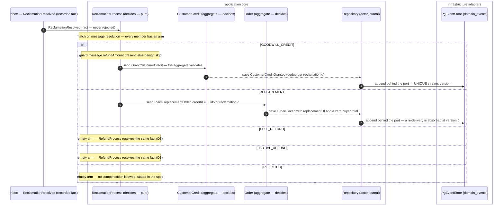
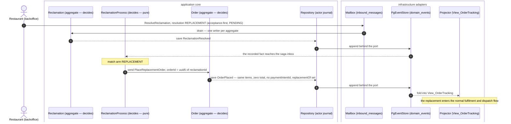
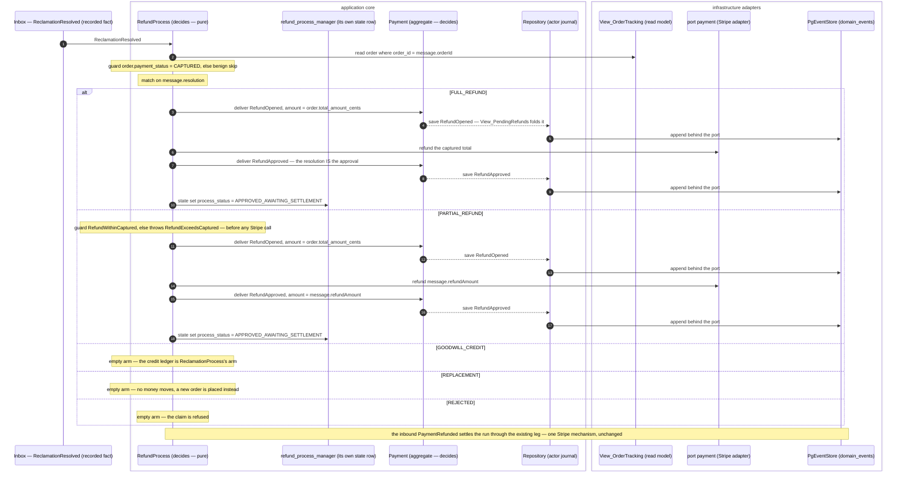
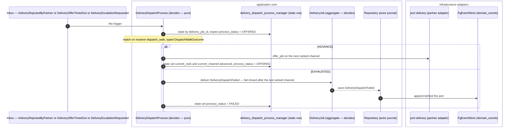

# PROP-20260809-003000 — Conditional branching in the process-manager step DSL: the saga branch becomes spec, not wrapper

- **Status**: Approved (product owner, 2026-08-09 answer sheet — D1–D7 as recommended; [ADR-20260809-050000](../adr/ADR-20260809-050000-morning-brief-eight-decisions.md)) — this file IS the discussion surface the customer asked for ("Let's discuss",
  card 10 of the decision brief)
- **Date**: 2026-08-09
- **Tracking issue**: [#426 "Conditional branching in the process-manager step DSL: the saga branch becomes spec, not wrapper"](https://github.com/TheCaptainCompany/captain-food/issues/426)
- **Originating epic**: [#348 "Epic: the rider/delivery write surface does not exist (24 of main's 32 validator warnings)"](https://github.com/TheCaptainCompany/captain-food/issues/348)
  — decision **D6 endpoint**, answered by the customer as option (iii)
- **Decided by**: [ADR-20260809-002500](../adr/ADR-20260809-002500-quick-wins-approved-d6-dsl-extension-chosen.md)
  — *build the step-DSL conditional-branching extension now*, retiring the hand-written
  `ReclamationProcess` wrapper seam instead of shipping the declared `sends:` annotation
- **Realized by**: _(filled at completion)_
- **History**: this file is a living document (ADR-20260801-020000) — `git log -p` on it is the record
  of how the design moved.

---

## 0. What this proposal decides, in one paragraph

The process-manager step DSL (`specs/{scope}/processmanager.yaml`) can express *sequence* — read,
guard, call, deliver, send, state — but it cannot express *choice*. Every saga that must do one of
several things therefore leaks its decision into hand-written Rust. This proposal adds **one**
branching construct, `match:`, whose arms are exhaustive over a declared enum and whose bodies are
ordinary step lists; plus three small grammar additions the branch needs to be *complete* rather than
*partial* (`present:`/`absent:` conditions, a **declared** discriminant resolver, and a declared
derived-id value form). The rule that makes it the endpoint and not another intermediate:
**the DSL owns every EFFECT, always; code may only ever compute a DECISION, and only through a named,
typed, declared seam.** Seven decisions (D1–D7) are put on the table with per-option trade-offs;
six slices follow, the first of which expresses the Reclamation branch end-to-end.

---

## 1. The problem, from the customer's side

You read the system through two artifacts: **the generated sequence diagrams** (one per saga, in
`specs/generated/documentation.generated.md` and the C4 page) and **`make validate`, which must be
0 errors**. Both are lying to you about one specific place.

### 1.1 What the diagram cannot show you today

When a restaurant resolves a customer claim, the platform does one of five things. The diagram the
generator draws for `ReclamationProcess` today shows exactly one of them, as a straight line:

```
ReclamationResolved  ──▶  send GrantCustomerCredit  ──▶  "skip unless precondition holds"
```

That is the whole picture the generator has. It cannot draw the refund. It cannot draw the
replacement order. It cannot draw the "the claim was rejected, nothing happens" case. Not because
those are unimplemented — they are implemented and tested — but because they live in a hand-written
Rust file (`crates/application/src/process_managers/reclamation.rs`) that the diagram generator has
never read and cannot read. The spec file even admits it, in prose, at
`specs/ordering/processmanager.yaml:176-179`:

> *"the REPLACEMENT dispatch … is carried in this saga's hand-written wrapper seam … a 3-way
> credit/replacement/no-op split is not expressible in the current step DSL."*

A prose apology inside a machine-readable file is the shape of the problem. **A reader who trusts
the diagram believes a REPLACEMENT resolution does nothing.**

### 1.2 What the validator cannot prove today

`make validate` proves that every command the system can handle is dispatched by *something* it can
see. It can see GraphQL mutations. It cannot see the hand-written wrapper. So `PlaceReplacementOrder`
— a real command, handled by the `Order` aggregate at `specs/ordering/actors.yaml:112`, genuinely
dispatched every time a claim is resolved as REPLACEMENT — is reported as *"Handled command
'PlaceReplacementOrder' is not dispatched by any mutation"* (`tools/codegen-rs/src/validate/core.rs:352-359`).

That warning is not a false positive to be silenced. It is the validator correctly reporting that
**it has no evidence the command is ever sent.** The rejected alternative (a declared `sends:` line
saying "trust me, the wrapper sends this") would have removed the warning without creating the
evidence — buying a clean gate with a promise. The customer rejected exactly that, which is why this
document exists.

### 1.3 The consequence chain, stated plainly

1. The branch is invisible in the spec → the diagram is wrong for 4 of 5 outcomes.
2. The branch is invisible to the validator → a real dispatch reads as a hole, and a real hole would
   read the same way.
3. The branch lives in code → adding a sixth resolution to `ReclamationResolution` compiles, validates
   and silently does nothing for the new member.
4. Behaviour tests reach the arms only through the wrapper's entry point, so the *spec* never asserts
   which arm exists — `specs/tests.yaml:3556` tests a refund the specification does not describe.

Point 3 is the one that will eventually cost money: **a resolution nobody wrote an arm for is a claim
that is closed with no compensation, and no error.**

---

## 2. Inventory — every branch the step DSL cannot express

Established by reading all four `processmanager.yaml` fragments and the emitter's own branch
machinery (`tools/codegen-rs/src/emit/pm_orchestrators.rs:1421-1485`). The DSL's *only* branching
device today is an undocumented convention: a mid-leg `guard: { skip: true }` with no condition,
which the emitter turns into `if hooks.branch(...).await? { …before…; return } …after…` — a **2-way**
split whose predicate is anonymous Rust. There are **four** such markers in the repo. Everything
needing three arms or more went to a wrapper.

| # | Process manager · leg | The branch | Where it lives today | Covered by this design? |
|---|---|---|---|---|
| **B1** | `ReclamationProcess` · `ReclamationResolved` | 5-way on `resolution`: GOODWILL_CREDIT / FULL_REFUND / PARTIAL_REFUND / REPLACEMENT / REJECTED | Hand-written wrapper `crates/application/src/process_managers/reclamation.rs:96-127`; spec admits it at `specs/ordering/processmanager.yaml:176-179`; the generated 2-way marker at `:212-214` | ✅ **D1** (`match`) |
| **B2** | `ReclamationProcess` · GOODWILL_CREDIT arm | nested: *"and a credit amount was recorded"* — a presence test on the nullable `refundAmount` | `reclamation.rs:76`; the emitter compensates with a runtime `.expect("saga value guaranteed present by the leg's branch guard")` at `pm_orchestrators.rs:401-406` | ✅ **D5** (`present:`) |
| **B3** | `ReclamationProcess` · PARTIAL_REFUND arm | amount cap: refund must not exceed the captured total (`RefundExceedsCaptured`) — a **comparison**, not an equality | `reclamation.rs:183-193`; declared as a bare `throws:` annotation at `specs/ordering/processmanager.yaml:200-202` with no step behind it | ✅ **D4** (declared predicate) |
| **B4** | `DeliveryDispatchProcess` · `OrderMarkedReady` | CAPTAIN-dispatch vs RESTAURANT-dispatch (self-dispatch short-circuit) — decides whether the port call happens at all | Three `from_hook` values at `specs/delivery/processmanager.yaml:65,67,68` plus a *"or SKIPS the call"* clause buried in a `note:` at `:59` | ✅ **D1 + D4** |
| **B5** | `DeliveryDispatchProcess` · `DeliveryRejectedByPartner` | ADVANCE to the next ranked channel vs EXHAUSTED (fail closed) | bare `skip` marker at `specs/delivery/processmanager.yaml:113-115` | ✅ **D1 + D4** |
| **B6** | `DeliveryDispatchProcess` · `DeliveryEscalationRequested` | same ADVANCE / EXHAUSTED | bare `skip` marker at `:157-159` | ✅ **D1 + D4** |
| **B7** | `DeliveryDispatchProcess` · `DeliveryOfferTimedOut` | same ADVANCE / EXHAUSTED | bare `skip` marker at `:201-203` | ✅ **D1 + D4** |
| **B8** | `ReclamationProcess` → `RefundProcess` | not a branch but the same wrapper: one saga **calls another saga's application legs in-process** (`super::refund::on_refund_requested`, `::approve_refund`) driven by a **synthesized, never-recorded** `RefundRequested` payload | `reclamation.rs:194-221` | ✅ **D3** — by removing the need for it |
| **B9** | `PlaceOrderProcess` · `PlaceOrder` | the whole command leg is excluded from generation (server-side pricing) | `PM_HAND_WRITTEN_LEGS` at `pm_orchestrators.rs:96` | ❌ **deliberately not covered** — see §2.1 |

**Count: 7 inexpressible conditional branches (B1–B7), + 1 cross-saga dispatch seam (B8), + 1 declared
codegen non-goal (B9)** — 9 hand-written seams total, of which this design retires 8.

### 2.1 What the design deliberately does NOT cover, and why

- **B9 — the `PlaceOrder` pricing leg.** Server-side cart re-pricing against the live catalog is
  arithmetic over a variable-length collection with fail-closed resolution per line. Expressing it
  would require a general expression language in YAML, which is the failure mode this proposal is
  most concerned to avoid (§8). It is a *recorded* non-goal (`pm_orchestrators.rs:95`), not an
  accident. It stays `crate::commands::place_order`.
- **Port-call inputs.** `call: { port, operation }` has no `with:` — the entire Stripe input,
  including **the refund amount**, is built by a hook (`input_payment_refund`). So even after this
  proposal the validator still cannot see how much money leaves. That is a real, separate gap; it is
  named in §9 rather than smuggled into this change.
- **`OrderErasureProcess`.** Named in ADR-20260731-160000 §4 and in the C4 L2 model, but it is **not**
  a `processmanager.yaml` entry — ADR-20260731-214500 realized it as the declarative deletion engine
  instead. Zero branches; nothing to migrate. (Verified: zero hits for `ErasureProcess` in
  `specs/*/processmanager.yaml`.)
- **Loops.** `for_each` already exists on `send`/`deliver` and is untouched. No `while`, no recursion.

---

## 3. The decisions — options and trade-offs

Seven decisions. D1 is the one the customer asked to discuss; D2–D7 are the questions D1 forces.
Each table marks the recommendation with ✅ and applies the final-vision rule
([ADR-20260808-235113](../adr/ADR-20260808-235113-final-vision-first-no-intermediate-steps.md)):
the shape that **ends the class** is presented first.

### D1 — the shape of the branching construct

The three shapes below are given as *exact YAML for the same case* (B1), so they can be compared as
text and not as adjectives.

---

#### Option A — `branch:` with ordered `when:`-guarded arms (first match wins)

```yaml
        - branch:
            note: "Dispatch the resolution to its automation."
            arms:
              - when: { message: { resolution: { const: GOODWILL_CREDIT } } }
                steps: [ … ]
              - when: { message: { resolution: { const: REPLACEMENT } } }
                steps: [ … ]
              - otherwise: true
                steps: []
```

- **Validator**: each `when:` is type-checked with the existing `guard.that` machinery (subject
  resolves, field exists, `const` is a member of the field's enum). It **cannot** prove coverage —
  the arms are arbitrary predicates over arbitrary subjects, so "did we handle every case?" is not a
  decidable question. Unreachable-arm detection requires subsumption analysis between predicates;
  in practice it would be implemented as "an `otherwise` that follows another `otherwise`" and
  nothing more.
- **Emitter**: an `if / else if / else` chain. Rust gives no exhaustiveness help.
- **Docs/mermaid**: `alt <cond> / else <cond> / else` — reads well.

| Pros | Cons |
|---|---|
| Most expressive: an arm may test several subjects at once (`resolution == PARTIAL_REFUND` **and** amount present) without nesting | **No exhaustiveness.** Adding `REJECTED` to the enum silently falls into `otherwise` — precisely the failure §1.3 point 3 describes |
| Handles non-enum discriminants (presence, comparison) with no extra machinery | Order-dependent semantics (first match wins) — a reordering is a behaviour change the validator cannot see |
| Smallest conceptual step from today's `guard` grammar | Invites arbitrary boolean algebra in YAML (`and:`/`or:`/`not:`) the first time someone needs two conditions — the slippery slope in §8 |

---

#### Option B — `match:` on one discriminant, exhaustive `cases:` over its enum ✅ **RECOMMENDED**

```yaml
        - match:
            on: { from: { $ref: 'events.yaml#/ReclamationResolved/properties/resolution' } }
            note: "The recorded decision selects its automation -- every member has an arm."
            cases:
              GOODWILL_CREDIT:
                steps: [ … ]
              REPLACEMENT:
                steps: [ … ]
              FULL_REFUND:
                note: "Money policy lives in RefundProcess (D3) -- nothing here."
                steps: []
              PARTIAL_REFUND:
                note: "Money policy lives in RefundProcess (D3) -- nothing here."
                steps: []
              REJECTED:
                note: "The claim is refused -- no compensation is owed."
                steps: []
```

- **Validator**: `on:` must resolve to a value whose type is an **enum scalar**
  (`scalars.yaml` `enum:`) — reusing the existing `scalar_enum()` /`props_info()` helpers at
  `tools/codegen-rs/src/validate/process_managers.rs:28-69`. Then: `cases` keys ⊆ members
  (`pm-match-unknown-case`, error), `cases` keys ⊇ members (`pm-match-not-exhaustive`, error),
  an empty arm must carry a `note` (`pm-match-empty-arm-note`, error — an empty arm is a *statement*,
  and an unexplained one is indistinguishable from a forgotten one). Duplicate keys are a YAML error.
  Unreachable branches are **structurally impossible**: one key, one arm.
- **Emitter**: a Rust `match` with **no `_` arm**, so `rustc` enforces the same exhaustiveness a
  second time, independently — the compiler-first hierarchy of ADR-20260803-234035 with the validator
  as the cross-crate backstop. Adding an enum member breaks the build *and* the validator.
- **Docs/mermaid**: `alt <MEMBER> / else <MEMBER> / …` — one branch per resolution, in enum order.
  The customer's diagram shows all five outcomes.

| Pros | Cons |
|---|---|
| **Exhaustiveness is mechanical and doubly enforced** (validator + `rustc`). Adding a resolution to the enum cannot silently no-op — the exact failure that motivated the change | Requires the discriminant to *be* an enum. Computed decisions (B4–B7) need a declared enum + resolver — see **D4** |
| One discriminant, named in one place: the generated diagram reads *"match on message.resolution"* rather than five unrelated conditions | Compound conditions need nesting (a `guard` or an inner `match` inside the arm) rather than one flat `when:` |
| Order-independent — a `cases` mapping has no first-match semantics to get wrong | Two arms that share most steps duplicate them: the DSL has **no let-bindings**, so an arm cannot compute a value for steps after the `match` (see §8 and D6) |
| Empty arms are *documentation the validator forces you to write* | Slightly larger DSL surface than option C |

---

#### Option C — an optional `when:` on each existing step (flat guard expressions)

```yaml
        - send:
            when: { message: { resolution: { const: REPLACEMENT } } }
            command: { $ref: 'commands.yaml#/PlaceReplacementOrder' }
            …
        - send:
            when: { message: { resolution: { const: GOODWILL_CREDIT } } }
            command: { $ref: 'commands.yaml#/GrantCustomerCredit' }
            …
```

- **Validator**: same per-condition type checking as A. No coverage, no grouping, no arms to reason
  about at all.
- **Emitter**: wrap each step in `if cond { … }`. Trivial.
- **Docs/mermaid**: each step becomes `opt <cond>` — a stack of independent optional messages. **The
  reader can no longer see that the outcomes are mutually exclusive**, which is the exact information
  the customer is missing today.

| Pros | Cons |
|---|---|
| Smallest possible delta — one optional key, no new step kind, no nesting, every existing walker keeps working | **The branch is not a first-class object.** A 4-step arm repeats the same `when:` four times, and one typo silently splits the arm into two behaviours |
| Trivially back-compatible; migration is mechanical | No exhaustiveness, no mutual exclusion, no grouping of the state write with its arm |
| | The generated diagram degenerates to `opt` stacking — it re-creates §1.1's "flattened with notes" problem in a checkable but unreadable form |

---

**Recommendation: Option B.** It is the only one of the three under which *"is every case handled?"*
is a question the machine answers, and under the final-vision rule that is the whole point: option A
unblocks Reclamation and leaves the class open (the next enum member still slips through
`otherwise`), option C unblocks the validator and leaves the *reader* worse off. B ends the class —
and it ends it twice, because the emitted Rust `match` is itself exhaustive.

Option A's expressiveness is not lost: **inside** an arm, an ordinary `guard` step expresses the
compound condition (that is B2's shape, D5). One branching mechanism, not two.

---

### D2 — exhaustiveness policy: is a `default:` allowed?

| Option | Pros | Cons |
|---|---|---|
| **(a) No catch-all. Every enum member gets an arm; an empty arm needs a `note`.** ✅ | Adding a member is a forced decision, in the spec, reviewed. Maps 1:1 to a `_`-free Rust `match`. Empty arms document intent | More YAML for genuinely uninteresting members (three empty arms in B1) |
| (b) `default:` allowed, arms optional | Terser | Re-opens the exact hole: a new member silently joins `default`. The Rust emission needs a `_` arm, so `rustc` stops helping too |
| (c) `default:` allowed **only** when the discriminant is an open type (a `String`, a non-enum) | Handles a future non-enum discriminant | There is no such case today, and D4 forbids creating one — YAGNI |

**Recommendation: (a).** The verbosity is the feature. Three `steps: []` arms with one-line notes is
the cheapest documentation this repo will ever buy.

### D3 — where does the REFUND arm live? (the B8 cross-saga seam)

Today `ReclamationProcess` reaches into `RefundProcess`'s application functions and drives them with a
**synthesized `RefundRequested` that is never recorded** (`reclamation.rs:200-221`). Whatever we do
about branching, that stays wrong: it is one saga writing another saga's state row inside one
reaction — the boundary error Vernon's aggregate rules exist to prevent, applied to process managers.

| Option | Pros | Cons |
|---|---|---|
| **(a) `RefundProcess` receives `ReclamationResolved` directly.** The money policy moves to the money saga: a new event leg with its own `match` over `resolution`, opening and approving in one reaction against **its own** state row ✅ | The fact is already in the log — no synthesis, no cross-saga call, no second state table, no ordering race. Evans-correct: the refund decision belongs to the payments context. Deletes ~95 lines of wrapper (`on_refund_resolution`). `RefundProcess` stays the one Stripe-driving mechanism, now visibly | `RefundProcess` gains a dependency on an ordering-scope event (a legitimate cross-scope `$ref`; process managers are the DAG's declared bridges). Four `tests.yaml` entries change `actor:` |
| (b) Extend `send.to` to accept a process manager, and have `ReclamationProcess` send `ApproveRefund` → `RefundProcess` | A genuinely useful DSL capability (PMs already receive commands — `ApproveRefund` is a `RefundProcess` receive today) | The run must be **opened** before it can be approved, and the open is another saga's reaction to another event: an in-reaction send would race it. Correcting that needs `ReclamationProcess` to grow a state row and a second `RefundOpened` leg — more machinery for a worse boundary |
| (c) Keep the refund arm hand-written | Zero work now | Leaves the largest, most money-adjacent seam exactly as it is, i.e. does not do what card 10 decided |

**Recommendation: (a).** It removes the need for the cross-saga vocabulary rather than adding it.
Note that option (b)'s capability (a `send` targeting a PM inbox) may still be worth having later —
but it should be introduced by a case that needs it, not by one that dissolves.

### D4 — how is a *computed* discriminant declared? (B3–B7)

Some decisions are not readable from a value: *"does a next ranked channel remain in this city's
list?"*, *"is this refund within the captured total?"*. Today they are an **anonymous** `hooks.branch()`
returning `bool` (`pm_orchestrators.rs:1462-1470`).

| Option | Pros | Cons |
|---|---|---|
| **(a) A declared, typed resolver: `on: { from_resolver: { name: dispatch_walk, enum: { $ref: 'scalars.yaml#/DispatchWalkOutcome' } } }`** — the emitter generates `async fn dispatch_walk(...) -> Result<DispatchWalkOutcome, _>` as a required hook, and the `match` arms are still exhaustive over that enum ✅ | **The effects stay in the spec** — only the choice is code. Arms are named, exhaustive, diagrammable (`alt ADVANCE / else EXHAUSTED`). The decision has a name, a type and a home. Distinguishes cleanly from the rejected `sends:` annotation: `sends:` declared *effects* with no steps, this declares a *decision* whose effects are all steps | One new scalar per computed decision (2 expected: `DispatchWalkOutcome`, `RefundAmountWithinCapture` — or a shared `GuardOutcome`) |
| (b) Keep the anonymous boolean `branch` hook, but require it to sit at a declared position | Zero new scalars | A `bool` has no names: the diagram says `alt true / else false`. Two-way only — B1 is why we are here |
| (c) A real expression language in YAML (comparisons, arithmetic, presence, boolean algebra) | Nothing is inexpressible | This is writing a programming language in YAML. It is the single largest risk in §8, and it puts *domain logic* in the saga rather than in the aggregate — Vernon's explicit warning |

**Recommendation: (a).** With one hard rule written into the DSL doctrine header: **a resolver returns
a decision, never a value that an effect consumes.** A resolver that computes a refund amount is a
design error; a resolver that answers "which arm" is the intended use.

### D5 — nullable discriminants and presence tests (B2)

| Option | Pros | Cons |
|---|---|---|
| **(a) `present: true` / `present: false` as a `guard.that` condition value, alongside `const:`, valid on any nullable value; and `PRESENT` / `ABSENT` as the two `cases` of a `match` on a nullable non-enum** ✅ | Kills the emitter's `.expect("saga value guaranteed present by the leg's branch guard")` (`pm_orchestrators.rs:401-406`) — the only place the generated code can panic on a spec-level invariant. After the guard the emitter can bind the narrowed value (`let Some(x) = … else { skip }`), so the type system carries the invariant instead of a comment | Two new grammar tokens |
| (b) Do nothing — nullable properties stay handled by the `.expect()` coercion | No work | Ships a documented panic path in generated money code. Any spec edit that removes the guard turns it into a production panic, silently |
| (c) Make `refundAmount` required on the event | Simplest of all | Wrong: a REPLACEMENT resolution has no amount. Forcing one is modelling a lie, and it is an event-payload change (Young: stored events are contracts — it needs an upcasting story) |

**Recommendation: (a).**

### D6 — sharing steps between arms

The FULL_REFUND and PARTIAL_REFUND arms (under D3, inside `RefundProcess`) differ in exactly two of
four steps — the DSL has no let-bindings, so each arm carries its own chain.

| Option | Pros | Cons |
|---|---|---|
| **(a) Accept the duplication in v1. No aliasing, no shared tails.** ✅ | Every arm reads top-to-bottom with nothing to cross-reference. ~8 duplicated lines total across the whole repo | Two places to edit when the refund chain changes (the validator's test↔rule links catch a divergence, but only after the fact) |
| (b) Arm aliasing: `PARTIAL_REFUND: { like: FULL_REFUND, override: { … } }` | No duplication | Inheritance in a spec language. The diagram generator must resolve it before drawing, or the diagram lies again |
| (c) **Conditional values** instead of conditional control flow: `amount: { match: { on: …, cases: { FULL_REFUND: { from_read: order.total_amount_cents }, PARTIAL_REFUND: { from: … } } } }` | Elegant for exactly this case — zero duplication, no control flow at all | A second branching mechanism with different rules, and it does not help B1 (different commands, not different values). Worth revisiting only if value-level branching recurs |

**Recommendation: (a)**, with (c) recorded in §9 as the thing to reach for if duplication appears a
third time.

### D7 — deterministic derived ids (needed for slice 1 to actually retire the wrapper)

`PlaceReplacementOrder.orderId` is a UUIDv5 derived from `reclamationId` — it *is* the idempotency
key (`reclamation.rs:53-64`). The emitter asserts a `send` payload is fully covered by `with:`
(`pm_orchestrators.rs:1107-1111`), so without a value form for it, the REPLACEMENT arm cannot be
expressed and the wrapper survives. The same pattern already exists a second time:
`DeliveryRequested.deliveryJobId` (`specs/delivery/processmanager.yaml:55`), which is why the whole
payload falls back to a builder hook today.

| Option | Pros | Cons |
|---|---|---|
| **(a) A declared value form: `{ derived_id: { namespace: 'reclamation-replacement', from: { $ref: '…/reclamationId' } } }`** — UUIDv5 over a fixed, spec-declared namespace ✅ | Two known call sites ⇒ a real class, not speculation. The idempotency key becomes **visible in the spec and in the diagram** ("orderId = uuid5 of reclamationId"), where today it is a comment in Rust. The namespace string becomes a spec constant nobody can change accidentally | The namespace must never change (a rename re-targets streams). Needs a validator rule pinning it: `pm-derived-id-namespace-immutable`, checked against a generated manifest |
| (b) Keep a per-command builder hook | No new grammar | The wrapper survives for the sole purpose of computing one UUID, and slice 1 does not deliver what card 10 asked for |
| (c) Let the command carry a nullable id and have the aggregate derive it | Moves it to the aggregate, which owns identity | The aggregate cannot derive it: the id addresses the stream *before* the aggregate is loaded |

**Recommendation: (a).**

---

## 4. The recommended DSL, precisely

### 4.1 Grammar delta (all additive — no existing spec text changes meaning)

```
steps[]  ::= read | guard | call | deliver | send | state | MATCH        # ← new step kind

MATCH    ::= match:
               on:    <value>            # must type to an enum scalar, or to a nullable value
               note:  <string>?
               cases:
                 <ENUM_MEMBER>:          # exactly one key per member of the enum — no default
                   note:  <string>?      #   required when steps is empty
                   steps: [ … ]          #   a full, ordinary step list (nestable, depth <= 2)

<value>  ::= { const: … } | { from: … } | { from_state: … } | { from_read: … }
           | { from_envelope: … } | { from_hook: … }                       # unchanged
           | { from_resolver: { name: <snake_case>, enum: { $ref: 'scalars.yaml#/<Enum>' } } }   # D4, new
           | { derived_id:   { namespace: <slug>, from: { $ref: … } } }                          # D7, new

guard.that.<subject>.<field> ::= { const: <MEMBER> } | { present: true|false }                   # D5, new
```

Removed at the end of the migration (slice 6): the **bare `guard: { skip: true }` linear-branch
marker** and the anonymous `hooks.branch()` it generates. A bare `skip` guard becomes an error
(`pm-branch-marker-retired`) — the construct it stood in for now exists.

### 4.2 The `ReclamationResolved` leg, as it will read

Replacing `specs/ordering/processmanager.yaml:203-215` (`emits:`/`throws:` annotations at `:193-202`
delete with it — they become step-derived):

```yaml
    - message: { $ref: 'events.yaml#/ReclamationResolved' }
      description: >
        The recorded resolution selects its automation. Every member of ReclamationResolution has an
        arm -- adding a member is a decision the validator forces someone to make.
      steps:
        - match:
            on: { from: { $ref: 'events.yaml#/ReclamationResolved/properties/resolution' } }
            cases:
              GOODWILL_CREDIT:
                steps:
                  - guard:
                      that: { message: { refundAmount: { present: true } } }
                      skip: true
                      note: "A GOODWILL_CREDIT with no recorded amount is a benign no-op, not a grant."
                  - send:
                      command: { $ref: 'commands.yaml#/GrantCustomerCredit' }
                      to: { $ref: 'actors.yaml#/CustomerCredit' }
                      with:
                        customerId: { from: { $ref: 'events.yaml#/ReclamationResolved/properties/customerId' } }
                        amount: { from: { $ref: 'events.yaml#/ReclamationResolved/properties/refundAmount' } }
                        reclamationId: { from: { $ref: 'events.yaml#/ReclamationResolved/properties/reclamationId' } }
                      note: "The ledger dedups per reclamationId -- a re-delivered resolution never double-grants."
              REPLACEMENT:
                steps:
                  - send:
                      command: { $ref: 'commands.yaml#/PlaceReplacementOrder' }
                      to: { $ref: 'actors.yaml#/Order' }
                      with:
                        orderId:
                          derived_id:
                            namespace: reclamation-replacement
                            from: { $ref: 'events.yaml#/ReclamationResolved/properties/reclamationId' }
                        originalOrderId: { from: { $ref: 'events.yaml#/ReclamationResolved/properties/orderId' } }
                        reclamationId: { from: { $ref: 'events.yaml#/ReclamationResolved/properties/reclamationId' } }
                      note: "One replacement per claim -- the derived id IS the idempotency key."
              FULL_REFUND:
                note: "Money policy lives in RefundProcess, which receives this same fact (D3)."
                steps: []
              PARTIAL_REFUND:
                note: "Money policy lives in RefundProcess, which receives this same fact (D3)."
                steps: []
              REJECTED:
                note: "The claim is refused -- no compensation is owed, by design."
                steps: []
```

### 4.3 What the validator gains

| Rule | Severity | Checks |
|---|---|---|
| `pm-match-on-non-enum` | error | `on:` resolves and its scalar declares `enum:` (or is nullable, for `PRESENT`/`ABSENT`) |
| `pm-match-unknown-case` | error | every `cases` key is a member of that enum |
| `pm-match-not-exhaustive` | error | every member of that enum has a key |
| `pm-match-empty-arm-note` | error | an arm with `steps: []` carries a `note:` |
| `pm-match-depth` | error | nesting depth ≤ 2 (readability of the generated diagram is a contract) |
| `pm-match-scope` | error | a `read` alias declared inside an arm is not referenced after the `match` |
| `pm-resolver-name` | error | `from_resolver.name` is snake_case and its `enum` `$ref` resolves |
| `pm-derived-id-namespace-immutable` | error | the namespace matches the generated manifest (renaming one re-targets live streams) |
| `pm-branch-marker-retired` | error *(slice 6)* | no bare `guard: { skip: true }` remains |
| `command-no-mutation` | *unchanged rule, new evidence* | `PlaceReplacementOrder` is credited because a **resolvable `send` step** dispatches it — structural, not annotated |

Existing rules keep working unchanged inside arms: `pm-send`/`pm-deliver` still prove the target
aggregate's inbox accepts the message, `pm-value` still type-checks every `with:` entry, `pm-guard`
still enforces the throw/skip dichotomy per leg kind.

### 4.4 What the emitter produces

`tools/codegen-rs/src/emit/pm_orchestrators.rs` gains one `PmStepDef::Match { on, cases }` variant and
one emission function; `emit_pm_leg`'s `branch_at` special case (lines 1421-1485) is deleted at
slice 6. Sketch of the emitted body for §4.2:

```rust
match event.resolution {
    ReclamationResolution::GOODWILL_CREDIT => {
        // guard message.refundAmount present -- benign alternative
        let Some(refund_amount) = event.refund_amount.as_ref() else {
            return Ok(Outcome::Skipped("refundAmount is absent -- ...".into()));
        };
        let sent = GrantCustomerCredit { amount: refund_amount.clone(), .. };
        // ... existing send plumbing, unchanged
    }
    ReclamationResolution::REPLACEMENT => {
        let sent = PlaceReplacementOrder {
            order_id: OrderId(uuid::Uuid::new_v5(&NS_RECLAMATION_REPLACEMENT, event.reclamation_id.0.as_bytes())),
            ..
        };
        // ... existing send plumbing, unchanged
    }
    ReclamationResolution::FULL_REFUND => {}    // spec: money policy lives in RefundProcess
    ReclamationResolution::PARTIAL_REFUND => {} // spec: money policy lives in RefundProcess
    ReclamationResolution::REJECTED => {}       // spec: no compensation is owed
}
```

Note the second gate: **no `_` arm**. If `ReclamationResolution` gains a member and someone bypasses
the validator, `cargo build` fails. The `.expect()` at `pm_orchestrators.rs:401-406` disappears
because `refund_amount` arrives as a narrowed `&Money`.

### 4.5 What the generated documentation produces

`pm_sequence_map` (`tools/codegen-rs/src/c4.rs:269-409`) gains one arm: a `match` step emits
`alt <FIRST_MEMBER>` … `else <MEMBER>` … `end`, recursing into each arm's steps with the existing
per-step renderers. No participant changes. Every artifact that already embeds these diagrams — the
Markdown docs, the HTML docs page, `c4.generated.md` — picks it up for free, because they all read
the one map.

---

## 5. Sequence diagrams — the ReclamationResolved outcome as it will be expressed

Drawn hexagonally per [docs/claude/mermaid.md](../claude/mermaid.md): the actor **decides** (pure),
facts are saved **through the `Repository`**, and `PgEventStore` is the one adapter behind it.

### 5.1 The dispatch itself — what the generator will draw once the branch is spec



<a href="https://mermaid.live/view#pako:eNq1VE1v2kAQ_SsjTolEqvTrgtRIyDjIVQDXBfUSKRp2B7OpvevuBy2N8t87awOhJIfm0JPttd-beW-e56EnjKTeAHqOfgTSgkYKS4v1rQbA4I0O9ZJsfGrQeiVUg9pDNgV0kOml-QW34d3l2w9QkKiwRq-MLsiZakMSziwJYyXfrVD488gSEdg0lRLtp8Dv6ZQ9n0T2I8LcGkHOwZkkoSS5fc0mWDo_RSdJRCfBeVOTTSxJ5eEMy9JSiZ722B3VM_isiPAZd21fgSrSfNY13RinvLFbBgu-wr0JVmPVIkjLvQdKryw6b4PwLAJQYuPJumdWjCNrXqYb0v4r8xGbYGpU-o7ikTvmzaYXV1f5ZPDyLOII9jI0gy1YuifhSbYcU8MqTTyODAwWa-D51Ow7lvTGRp7QjmzHESm2_D7mA9bcJWpA2wWn8jCezUbfspubu6RIR9k8Hp8WKQNaeVRhFbQc1iaw7obrsbw-UOUIlqRVqcF9V03Hk09YaZIMgD-SMLZs1cnAd036NXt7GOIGKyX5xnUsSXLBNHF0TIQbOglNSxud4wCHBprWsYOxWWcbtKOPvo8HMdixnyWtFV9i7cbYQy-LafZlkQIPnbDuA7vgmKedXxTJPDfDJJ2k0_mRyFmxE5lXKIjjFS81W9MmtA_x97KZhE8QgpIfwaz-brKjmhUnSlt0Synhp_JrBj0xr3iUEhB-kzWwDFsW7o3H6pV6kUkvJFWqDYrigCydsUuuiH6vHi4P-q8XHJYivV5MRy-FherGb2PAnhZOzMt-NbBo4kKu7cJhTe3KgbPR-_NDhXxYzLPhfy5SpJ_TZJ7-G702vABrNtF125BNMj9J9jkkGKOndFeqIbH7z3t96HFCeQNI3toPPX5dt_tb0gpD5XuPj38AQGr55g" target="_blank" rel="noopener noreferrer">Open this diagram with pan and zoom on mermaid.live — on github.com use Ctrl/Cmd+click or middle-click to get a NEW tab (GitHub strips target=_blank)</a>

### 5.2 The REPLACEMENT arm end to end — what the customer actually cares about



<a href="https://mermaid.live/view#pako:eNqVVMFq20AQ_ZVBJwccaEt7ETTQJsK4xJZQQukhEMa7I3lTaVdd7TpJQ_69M2s7NU4uOdhCq3lv3rw30lOmnKYsh2ykP5GsoguDrcf-xgJgDM7GfkU-3angPNTF1XUJOEJNY8Do0QaYrFD9dk1jFJ1I5co9AA5DZxQG4ywo50nOB_TBKDMIpi7OL7c0qsN-WzfBtvXUYiC4iZ8-fPwMmpTRNJ4co6vFEbbyTtE4wmSH2BMM0dMrdFkLuvSa_Dt61kW1G3xwo2EvHhmcPLlz0VvsEoKs3ltgbONxDD6qwCoANQ6B_HjMu_j-S2gXaDpBTYxduWj1bc_zYPvW8DOpr9piQzZcsQDisV2Pxt6SHL2BqMsfCePdHSXJk5-G7m-TBdee0zO2PZSfUj49O2NtuSTtug0duD0FL2cxpca-XH47LxbF8loMUTQE5D06bYwfwxSqYnkxX84SO9MxqUSfg_YseO-5swT33rA9MPDvJZOtlvPL0wSryhxG3NBh8DtxO9WViK5muawfjwIrWhu-hDXB4HyQomomZNUiT6eeeDk1aWg4Sr5DteblkSfsPYJk8SCopeMFcRvWJkhurdaAvj8cPpEvmLusWaZ0rzpUbNsgl56DSXZPQRr6uYavEKPRX8A1ImM_0DyNUtZHIydsItR700bsCdizfpzCX_IOggvYTcE6Dv9RGs5tkH8tef1X0bC68F6_eINyaFyn2ZPg4PX6HLmU6rcOv3Tm7ZIXIB1b53vsoIldY7r0ELmxNuOQvG06d59NIeuJy4zmD9RTxrA-fao0NRi7kD0__wP4BaKu" target="_blank" rel="noopener noreferrer">Open this diagram with pan and zoom on mermaid.live — on github.com use Ctrl/Cmd+click or middle-click to get a NEW tab (GitHub strips target=_blank)</a>

### 5.3 The REFUND arms under D3 — the money policy in the money saga



<a href="https://mermaid.live/view#pako:eNrNVm2L2zgQ_itDvtwW0nJX-inQgkncxcduYhxvl4OC0coTR1dZ8klysqH0v9-MYu-mzfbaUij3JbElzTMvzzMjf5xIW-NkBhOP__RoJC6UaJxo3xsA0Qdr-vYOHb91wgUlVSdMgGwJwkNm7uw9vO9f_v7HKyhQatGKoKwp0Fu9wxouHErranraCBmeMQpbiK7TSsajQPv4JXqRM3qBm97UubMSvYeLGqWq0Y_uut7hsy8N1yUbumhYdUfLqhVGNOjgQgUPdm_ABxEQnN2f2efJXwyQi0OL9HohmsZhw6cHr0MQZ4ZFmq-OMXfWq2DdgYwl_cPftndG6GiBph5LoMzGCR9cLwMlAqIWXUDnz3CvGfWdwn21ojq60gn5QZmGKytqaIk7fZ7Fqoh16KwLtDHksg5OdQ-ezo0uY-ZNuqPTa4ocqeS2FcpUyEv-NINs-fzNmyKfPUU67xc571_PIEbJCnCw3yJhxudK1fAaWiKHiHkRl7Jot7RUaruj0wze9MIN1i-GNCrmrvdkPU_y8qZIF1NA7RHu0KiGqP2gunMgClBugcQ2unQca89RR5nrAG9vrq6qIn17s1zw0pAC6WFGnGsVkaKsVh0arKcgWttT2V4P8QUbhK6Oi5Xkeh1hCOE514L0MQMvdvgZzCirSHBOxSVqj_seNlbTrwpDOATAAV3OuHvoJGW8VfQXthiJPo2a-J8NXRD3JVFOKqMXjvK_80s66pvdY2hs_1guyNZxRcRTI9bXkhyxfjyFNSVwbFOPpOGhkx_IT_K8WL1LF1Vym2Rltrys1mlZXqXX6bKMMmVJ5ElRZsnnrD4lsGOstypQMPOhUoOqwpamxDiJ0nuJWPvxyFigO9xwswhzgKHFpND6F4roJwXy2BORsuj8-yRyEv_XQf6f2rhcrRa3GbX8nEZIVj4lDmy7cADh2tNOkES8CqCx5htF-dMBONxUv3k2evBEmV0l8wfv3_RiLE11gwf63aGnEoPB_TBCyV-nhSTtKeMDjdYTL3-m8zJdfH8iWqiWAZkxf6RhGO6n1lNmhM8ruupZLcPVeOSQAiEKgqZbOY6J3sSO6ZttfMd75QNfVhqb0TelNrZJi3IrjPLtFHrDjw3WkylMWnR07dT0TfJxQjBt_DqpcSN6HSafPv0LipL1JQ" target="_blank" rel="noopener noreferrer">Open this diagram with pan and zoom on mermaid.live — on github.com use Ctrl/Cmd+click or middle-click to get a NEW tab (GitHub strips target=_blank)</a>

### 5.4 The delivery walk under D4 — what `alt ADVANCE / else EXHAUSTED` replaces



<a href="https://mermaid.live/view#pako:eNp9VF1v2kAQ_CsrP1EpkdqqT0iNRGuTggpYQD8eIqHlbjGX2Hfu3ZmAovz37oIhKDR9srx3MzczN_ZTopympAtJoD8NWUWpwcJjdWcBsInONtWSvLzV6KNRpkYbYTAGDDCwS7eFu-bj-w-fIKXSbMjvpnRPKpL-sssZYMmD86fFyWpFfm4q0pMmni9kQWGJ0Tg7FR2BCeRM4ce6Lo3ar4Fynl5ryUei5UiUmlBjVOvcO0UhQEeTMprCUWbdeHr3mmI2FwrdUix0y7GoDySLCi0W7KQTIkYC7x4vKNLhuYqhW0IHi8JTIYD27FbKBXaa5RNBT6l2wUTndwxW_IR713iL5R5B9hSJsSuPIfpGRbYDqLGO5MNFMpPp3ljtfDy5g07d3ksLu5CT3wooL7IN2ThjGcQpugqNXZCMwrmcwfj65iYfdSGuCaI3RXFoSz7i-WzehUNky91LvPduuTD6Cmhbc1PgGLJsbAJ8hkm_n02zVFjGjrGOUSBHVHIpwDXwFFwp09NNPWL5cAVxV5OGYwV-8Yxrply17wyWEXrpz974ayavrUTJqAtOeinChF2cWNpG8GgfmE-t0Voqz0AvvgJFUI33HMtCtgNafRq0QA56g_xlseX_eaUyEGS_v_V-zOaHSXtaOuwew7uoeR9NyRLbgq34DVTpAo9wxXe791JyVf7pJR1eM720j-3ght5gP2yWbZLXbVe-SL59WNLa8EOOkIa9mc-F6X5v8L31bHVyBUlFnuul-Tf0lDBdtf8haVphU8bk-fkvYeKfIw" target="_blank" rel="noopener noreferrer">Open this diagram with pan and zoom on mermaid.live — on github.com use Ctrl/Cmd+click or middle-click to get a NEW tab (GitHub strips target=_blank)</a>

---

## 6. "Screens" — the surfaces a reader sees, per use case

This change ships no UI. Its user-visible surfaces are the **generated documentation page**, the
**validator output** and the **spec file itself** — mockups of all three, since those are what the
reviewer reads.

**Use case: "I want to know what happens when a claim is resolved as REPLACEMENT."**
Generated documentation, `⚙️ process manager ReclamationProcess` section — today vs after:

```
  BEFORE                                     AFTER
  ┌──────────────────────────────────┐       ┌──────────────────────────────────────────┐
  │ ReclamationProcess               │       │ ReclamationProcess                       │
  │ Sequence (from the typed steps): │       │ Sequence (from the typed steps):         │
  │                                  │       │                                          │
  │  IN ->> PM : ReclamationResolved │       │  IN ->> PM : ReclamationResolved         │
  │  PM ->> CustomerCredit :         │       │  alt GOODWILL_CREDIT                     │
  │        send GrantCustomerCredit  │       │    PM ->> CustomerCredit : GrantCredit   │
  │  Note over PM : skip unless      │       │  else REPLACEMENT                        │
  │        precondition holds        │       │    PM ->> Order : PlaceReplacementOrder  │
  │                                  │       │  else FULL_REFUND / PARTIAL_REFUND       │
  │  (4 of 5 outcomes not shown)     │       │    Note : handled by RefundProcess       │
  │                                  │       │  else REJECTED                           │
  │                                  │       │    Note : no compensation is owed        │
  └──────────────────────────────────┘       └──────────────────────────────────────────┘
```

**Use case: "I added a resolution to the enum and forgot the saga."**
Validator output — the failure mode §1.3 point 3 describes becomes a blocked build:

```
  $ make validate
  checks: 1 error(s), N warning(s)
  ERROR pm-match-not-exhaustive
      processmanager.yaml/ReclamationProcess.receives[0].steps[0]
      `match` on ReclamationResolution has no arm for member 'STORE_VOUCHER'.
      Every member needs an arm -- an intentional no-op is `steps: []` with a note.
```

**Use case: "I am reviewing the diff and want to see the branch."**
The spec file itself: §4.2 is the mockup. Five arms, five notes, one `$ref` per effect.

---

## 7. Migration of the existing seam

### 7.1 What `crates/application/src/process_managers/reclamation.rs` does today (593 lines)

| Lines | What it is | After |
|---|---|---|
| `:54-64` | `replacement_namespace()` / `replacement_order_id_for()` — the UUIDv5 idempotency key | **deleted** — becomes `derived_id:` in the spec (D7) |
| `:71-78` | `ReclamationResolvedHooks::branch` — the anonymous 2-way predicate | **deleted** — becomes the `match` + a `present:` guard (D1, D5) |
| `:88-127` | `on_reclamation_resolved` — the hand-written 3-way dispatcher | **deleted** — becomes `match` arms (D1) |
| `:131-222` | `on_refund_resolution` — the cross-saga refund arm (92 lines) | **deleted** — moves to `RefundProcess` as a spec leg (D3) |
| `:224-593` | the test module (7 tests) | **moves**, see §7.3 |

Net: **~222 lines of hand-written saga logic retire**; the module either disappears or shrinks to a
test file. The generated pipeline at `crate::generated::process_managers::reclamation_process`
becomes the only implementation.

### 7.2 What stays hand-written afterwards, honestly

- **`RefundProcess`'s `read_order` hook** — projection reads are a declared, permanent seam (the DSL
  names *what* to read, the hook executes it). The new leg reuses the existing alias: `pm_read_infos`
  dedups aliases of identical shape across legs, so no new hook appears.
- **`input_payment_refund`** — the Stripe call's input, including the amount, is still hook-built
  (§2.1, §9). This is the largest remaining invisible surface in the money path.
- **`should_deliver_*`** idempotency predicates for `RefundOpened` / `RefundApproved` — already exist
  on `RefundProcess`, unchanged.
- **The `RefundWithinCaptured` resolver** (D4) — a comparison the DSL will not learn to do.
- **`from_hook` values** in `DeliveryDispatchProcess` (`current_rank`, `current_channel`) — those are
  *computed values*, not branches. They are out of scope here and stay.

So the honest claim is not "no hand-written code". It is: **after this change, no hand-written code
decides which effects happen — only how a value is computed or a comparison evaluated.**

### 7.3 Behaviour tests

- `specs/tests.yaml:3556` `TestReclamationProcessSettlesFullRefund`,
  `TestReclamationProcessSettlesPartialRefund` and `TestReclamationProcessRefundOverCapturedRejected`
  change `actor:` from `processmanager.yaml#/ReclamationProcess` to
  `processmanager.yaml#/RefundProcess` (a `specs/**` change, in slice 3). Their `given`/`when`/`then`
  are unchanged — the *fact* and the *expected facts* are identical, only the saga that owns the
  reaction moves. Their `rules:` links (`RefundSettledOnResolution`,
  `RefundResolutionCappedAtCaptured`) are unchanged, so the bidirectional rule↔test gate stays green.
- `TestReclamationProcessGrantsGoodwillCredit` and the replacement test stay on `ReclamationProcess`.
- `bt_pm_event_call` (`tools/codegen-rs/src/emit/behaviour_tests.rs:333`) repoints the
  `("ReclamationProcess","ReclamationResolved")` entry from the wrapper to the generated fn and gains
  `("RefundProcess","ReclamationResolved")`.
- The seven hand-written unit tests in `reclamation.rs:224-593` split: the credit/replacement ones
  follow the generated pipeline, the refund ones move next to `refund.rs`. Coverage does not drop —
  they assert the same store contents.

### 7.4 The validator credit becomes structural

Today the plan of record ([PROP-20260808-141817](PROP-20260808-141817-rider-delivery-write-surface.md)
slice 2, decision D6) would credit `PlaceReplacementOrder` from a **declared** `sends:` line. After
slice 1 the credit comes from a **resolvable `send` step inside a `match` arm** — the same evidence
the validator already accepts for `BindCartToCustomer` and `GrantCustomerCredit`. Two annotations
also delete themselves, because the steps behind them now exist:

- `specs/ordering/processmanager.yaml:193-199` — the hand-declared `emits: [RefundOpened, RefundApproved]`
- `specs/ordering/processmanager.yaml:200-202` — the hand-declared `throws: [RefundExceedsCaptured]`

Both were coverage annotations for effects with no steps. That is the whole point of card 10:
**declarations disappear because the thing they described became real.**

*(Warning-count note: exactly one `command-no-mutation` warning clears here, so the realizing change
refreshes `tools/codegen-rs/warning-baseline.json` in the same commit — the §17 ratchet fails on an
improvement left unbanked just as it does on a regression.)*

---

## 8. Drawbacks — why we might regret the whole thing

1. **DSL surface growth is permanent.** One new step kind, two new value forms, one new condition
   token, eight new validator rules. Every future reader of `processmanager.yaml` must learn them,
   and every future emitter change must handle nesting. The DSL stops being "an ordered list of
   steps" — the thing that made it easy to hold in your head.
2. **The slippery slope is real and this proposal is on it.** `match` on an enum is defensible.
   The next request will be `match` on a comparison, then `and`/`or`, then arithmetic. The guard
   written into D4 (*a resolver returns a decision, never a value an effect consumes*) is the only
   thing between this and a YAML programming language, and it is a doctrine sentence, not a compiler.
   Recommended mitigation: a validator rule capping resolvers **per process manager** (say 2), so
   crossing the line requires a conscious spec change and a reviewer.
3. **Vernon's warning applies directly.** *Implementing Domain-Driven Design*'s aggregate chapters
   put invariants **inside** the aggregate and leave the process manager to coordinate. Making
   branching easy in the saga makes it easy to put decisions there that belong to `Reclamation` or
   `Order`. The boundary this proposal asserts: **a saga may branch on a fact it received or a state
   it owns; it may never branch on an invariant another aggregate should have enforced.** B3 is the
   uncomfortable case — "is this refund within the captured total?" is arguably a `Payment` invariant
   that the saga is checking because `Payment` is not consulted before the Stripe call. Worth
   revisiting (§9).
4. **Emitter complexity.** Nested step emission means the leg generator becomes recursive:
   scope tracking (`row_in_scope`, `payloads`, `hook_ctx`) must be saved and restored per arm, and
   the `hook_ctx` accumulated inside one arm must not leak into a sibling. That is the single most
   likely place for a subtle generation bug, and it is why `pm-match-scope` and a depth cap are
   validator rules rather than conventions.
5. **A bigger diff surface on `specs/**`.** Rewriting five legs across two scope folders is a
   `specs/**` change, i.e. plan-mode-only work with approval. It cannot be done by an autonomous loop,
   so it consumes supervised sessions.
6. **The wrapper was working.** Nothing here fixes a production bug. The value is entirely in
   *evidence* — diagrams that match reality and a validator that can prove dispatch. That is a real
   but indirect return, and it should be stated rather than dressed up.

---

## 9. Unresolved questions

1. **Port-call inputs are still invisible.** `call:` has no `with:`; the Stripe refund amount is
   hook-built. Should `call` gain a `with:` typed against the service catalog's declared operation
   input? It would put the amount that leaves the platform into the spec. Probably yes — but it is a
   separate proposal, not a rider on this one.
2. **Does B3's cap belong to the `Payment` aggregate?** (Drawback 3.) If `Payment` folded the captured
   total and rejected an over-refund itself, the saga would need no comparison resolver at all, and
   `RefundExceedsCaptured` would be an aggregate error rather than a saga one. This is the DDD-purest
   answer and it deserves its own look.
3. **Value-level branching (D6 option c)** — if a third case needs "same effect, different value",
   revisit conditional values rather than duplicating arms a third time.
4. **A `send` targeting a process-manager inbox** (D3 option b) — dropped here because D3(a) removes
   the need. Record it as available if a future case genuinely needs saga-to-saga command dispatch.
5. **Observability of the taken arm.** Should `specs/observability.yaml` carry a contract asserting a
   `saga.branch.arm` attribute on the saga span? Under ADR-20260808-144738 (evidence displaces proxy
   judgment) the answer is probably yes — *"how often is a claim resolved as REPLACEMENT vs refunded?"*
   is a product question we currently cannot answer from telemetry. Proposed as slice 6.
6. **Resolver-count cap** — is 2 per process manager the right number, or should it be 1? (Drawback 2.)
7. **Nesting depth 2** — enough for B1+B2. If a case needs 3, that is a signal the decision belongs
   in an aggregate, not a signal to raise the cap.

---

## 10. Slices — one claimable issue each, value-ordered

Every slice is a thin vertical slice **of the final shape** (ADR-20260808-235113's scope-vs-shape
distinction), not a staging shim. Slices 1–3 touch `specs/**` and are therefore 🟠 AMBER — they
execute only under this proposal's approval.

| # | Slice | Delivers | Lane | Impact / Effort |
|---|---|---|---|---|
| **1** | **`match:` + `derived_id:` — express the Reclamation branch end to end.** Loader, `PmStepDef::Match`, recursive emission, the five validator rules, the mermaid `alt/else` arm, `derived_id` (D7). Rewrite `ReclamationResolved`'s GOODWILL_CREDIT + REPLACEMENT arms. Delete `replacement_order_id_for` and the `branch` hook from the wrapper | The customer's diagram shows the branch. `PlaceReplacementOrder` is credited structurally. The smallest thing that proves the design | 🟠 AMBER | L / High |
| **2** | **`present:` / `absent:` conditions (D5).** The GOODWILL_CREDIT amount test becomes a step; the emitter narrows the value; `pm_adapt`'s `.expect()` at `pm_orchestrators.rs:401-406` is deleted | Removes the one generated panic path in money code | 🟠 AMBER | S / Low |
| **3** | **Move the REFUND arms to `RefundProcess` (D3).** New `ReclamationResolved` leg with its own `match`; `RefundWithinCaptured` resolver; retarget the `tests.yaml` actors; delete `on_refund_resolution` (92 lines) and the synthesized `RefundRequested` | Kills the cross-saga in-process call — the largest correctness-relevant seam | 🟠 AMBER | L / High |
| **4** | **`from_resolver:` typed discriminants (D4)** + migrate the three `DeliveryDispatchProcess` ADVANCE/EXHAUSTED legs. New scalar `DispatchWalkOutcome` | Three bare markers become named, diagrammed arms | 🟠 AMBER | M / Medium |
| **5** | **`OrderMarkedReady` strategy branch (B4).** CAPTAIN vs RESTAURANT as a `match`; the "or SKIPS the call" clause leaves the `note:` and becomes an arm | The self-dispatch short-circuit stops being prose | 🟠 AMBER | M / Medium |
| **6** | **Close the class.** `pm-branch-marker-retired` becomes an error, `branch_at` (`pm_orchestrators.rs:1421-1485`) and the anonymous `branch` hook are deleted, resolver cap rule, `saga.branch.arm` observability contract | The old mechanism cannot come back — a gate, not a note | 🟢 GREEN (after 1–5) | M / Medium |

**Honest cost: 6 slices.** Slice 1 is the largest single piece (recursive emission is the hard part).
Slices 1 + 2 alone satisfy card 10's literal ask — the Reclamation branch expressed, the wrapper's
branch decision retired. Slice 3 is where the real architectural improvement is, and it is the one
most worth arguing about. Slices 4–6 are what make it *the end of the class* rather than one saga's
fix — without 6, the bare-`skip` marker survives and the next saga uses it.

---

## 11. References

- Decision: [ADR-20260809-002500](../adr/ADR-20260809-002500-quick-wins-approved-d6-dsl-extension-chosen.md)
  (card 10 — option (iii), build the extension) ·
  [ADR-20260808-235113](../adr/ADR-20260808-235113-final-vision-first-no-intermediate-steps.md)
  (final vision first) ·
  [ADR-20260803-234035](../adr/ADR-20260803-234035-compiler-first-a-check-is-the-fallback.md)
  (compiler first) ·
  [ADR-20260808-144738](../adr/ADR-20260808-144738-product-ownership-lives-in-the-team-no-pm-agent.md)
  (evidence displaces proxy judgment)
- Epic: [#348 "Epic: the rider/delivery write surface does not exist (24 of main's 32 validator warnings)"](https://github.com/TheCaptainCompany/captain-food/issues/348)
- Proposals: [PROP-20260808-141817 — rider/delivery write surface](PROP-20260808-141817-rider-delivery-write-surface.md) (decision D6) ·
  [PROP-20260726-013207 — reclamation lifecycle](PROP-20260726-013207-reclamation-lifecycle.md) (the saga this branch belongs to) ·
  [PROP-20260731-195500 — runtime D: PM mailboxes and reminders](PROP-20260731-195500-runtime-d-pm-mailboxes-and-reminders.md)
- Spec surfaces: `specs/common/processmanager.yaml` (the DSL doctrine header) ·
  `specs/ordering/processmanager.yaml:151-215` · `specs/delivery/processmanager.yaml:8-257` ·
  `specs/payments/processmanager.yaml:8-195`
- Code surfaces: `tools/codegen-rs/src/emit/pm_orchestrators.rs` (parser + emitter, branch machinery
  at `:1421-1485`) · `tools/codegen-rs/src/validate/process_managers.rs` (step validation) ·
  `tools/codegen-rs/src/c4.rs:269-409` (the generated saga diagrams) ·
  `crates/application/src/process_managers/reclamation.rs` (the seam being retired)
- Conventions: [docs/claude/dsl.md](../claude/dsl.md) · [docs/claude/mermaid.md](../claude/mermaid.md) ·
  [docs/proposals/README.md](README.md)
