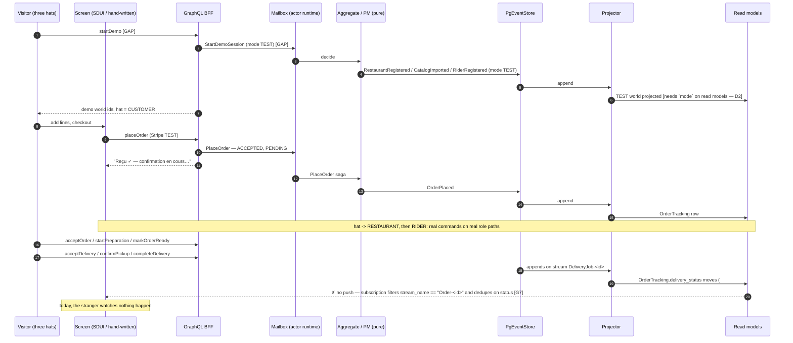

# PROP-20260809-021351 — The public demo: one continuous walk, on production's own pipeline

- **Status**: Proposed
- **Date**: 2026-08-09
- **Tracking issue**: [#410 "Epic: public try-before-committing demo — seeded test restaurant/customer/order/rider on the marketing site"](https://github.com/TheCaptainCompany/captain-food/issues/410)
- **Realized by**: (pending)
- **Concerns**:
  - [ ] `stripe-single-key`: one Stripe secret per deployment. A demo sharing the production deployment either charges a stranger's real card or blocks production from taking real money. D4 must be decided before any public URL exists.
  - [ ] `test-mode-unenforced`: `mode: TEST` is checked in exactly ONE runtime location and **no read model carries it** — demo orders are indistinguishable from real ones in the back office and in every metric built on the read models.
  - [ ] `demo-capacity-coupling`: demo events append to the same `Order` projector checkpoint and the same single-instance CNPG as the money path; a demo burst is projection lag on real customers' tracking screens.
  - [ ] `comparison-not-computed`: the demo's single commercial screen cannot render. The cart projector carries `total_amount_cents`, `lines`, `estimated_breakdown` and `uber_comparison` forward from a previous row that no event ever populates — so the total is **0** and the comparison is **always `None`** (`crates/application/src/projectors/cart.rs:27-44`, verified).
  - [ ] `nominative-comparison-unverifiable`: the named-competitor figure is a coefficient we chose (1.30–1.45) times our own price. Two lenses independently call publishing it on a public page the largest exposure in the epic — comparative-advertising law requires *verifiable* features, and the margin split we publish for a named company is the classic denigration shape. Needs a customer decision, and it is about the PRODUCT, not the demo.
  - [ ] `unscoped-order-reads` **(blocks D3)**: `orders` / `order` / `carts` apply no ownership filter for ANY role — `orders` with no arguments returns the entire `ordertracking` table, un-paginated, while the SDL describes it as *"ownership/scope enforced server-side"*. A publicly-mintable demo session therefore reads every real order. Recorded on [#144](https://github.com/TheCaptainCompany/captain-food/issues/144) with evidence; **D3 cannot ship before it lands**.
  - [ ] `projector-no-mutual-exclusion` **(blocks D1+D2 together)**: the projector takes no lock and overwrites its checkpoint unconditionally (`SET position = EXCLUDED.position`, not `GREATEST`), so two deployments over one database regress it and re-fold — and at least one projector is a true accumulator, so a re-fold **doubles a customer's credit balance, silently and permanently**. There is also no reprojection entrypoint anywhere in the repo, so the fold cannot currently be re-derived.
  - [ ] `fee-breakdown-anchors-zero`: `crates/application/src/pricing.rs:103-112` hard-zeroes delivery, service fee, restaurant contribution, rider payout and platform net. Publishing that breakdown anchors free delivery before the delivery-fee decision exists.

## 1. Why this exists now

This is the mob briefing of [#410](https://github.com/TheCaptainCompany/captain-food/issues/410)
under [ADR-20260809-013142](../adr/ADR-20260809-013142-mob-programming-every-agent-is-in-the-dev.md)
— every lens briefed BEFORE the work, not asked to review it afterwards. Four lenses answered
in parallel against the tree, not against the ADRs: **farley** (lead — the production path),
**ux-designer** (the walk), **beck** (what test fails if this is broken), **dba** (seeding,
isolation, capacity).

They converged on a finding none of them was sent to look for, and it changes what #410 IS.

## 2. The blocking discovery — the customer path is inert on `main`

The standing objective is *"one real order flows checkout → accepted → delivered, and a stranger
can watch it happen."* Today a stranger cannot start it, and nobody would be told if they did.
All four lenses reached the same root cause independently.

| # | Step of the walk | Verdict | Evidence |
|---|---|---|---|
| G2–G4 | Storefront, catalog, cart, auth sheet | **Work** (auth only if the Supabase Send-SMS hook + OVH SMS are configured; otherwise 503, dead end) | `crates/web/src/router.rs:194-205`, `renderer.rs:616-657`, `interact.rs:95-131`, `auth_routes.rs:114-118` |
| **G5** | `/checkout` — **the walk stops here** | **The page is inert.** `renderer.rs:635-639` `hydrate()` returns early for every `sdui: false` screen, and the crate's only `mount_to_body` sits after that guard. No Stripe element mounts; `checkout::submit()` is unreachable from a browser. Worse, the SSR shell is **data-less**: `router.rs:236-241` hardcodes `restaurant_name: ""`, `cart_line_count: 0`, `formatted_total: ""`, `payment_failed: false`. A customer sees an empty summary and a dead button. | `crates/web/src/router.rs`, `crates/web/src/renderer.rs` |
| **G6** | `/orders/:id/confirmation` — tracking | **Static shell, and worse than reported.** `router.rs:247-251` builds `TrackingState::new(order_id)` with `order: None`, so production SSR renders the **UNKNOWN / not-found hero for every order, forever**. Same root cause as G5, not a second bug. | same |
| **G7** | The live update | Even fixed, nothing arrives: the `orderStatusChanged` subscription filters `stream_name == "Order-<id>"` and dedupes when `order.status` is unchanged — so the delivery-status movement wired by [#424](https://github.com/TheCaptainCompany/captain-food/issues/424) never reaches the screen. | `specs/ordering/api.yaml`, transport filter |
| **G7b** | Restaurant / rider sign-in | **No browser sign-in exists for staff.** No login/magic-link screen in any `specs/screens/**`, no `/auth/callback` route. A RESTAURANT or RIDER JWT is obtainable only through the Supabase admin API. **Nobody can open the back office in a browser today.** | `specs/screens/*.yaml`, `crates/server/src/auth_routes.rs` |
| **G8** | The restaurant is *told* | **Nobody is told.** No notification port of any kind in `crates/application/src/ports.rs`. `orderStatusChanged` is keyed per `orderId`, so a queue cannot subscribe to arrivals; `orders_queue` refreshes only on page load. **A paid order sits silently until someone reloads.** This is the domain lens's named worst failure mode, live on `main`. | `specs/screens/restaurant_backoffice.yaml:116-136`, `specs/ordering/api.yaml:289-297` |
| G10 | Payment mode | One Stripe key per deployment; `mode: TEST` isolates the domain, not the money. See D4. | `crates/adapters/stripe/src/outbound.rs:34-48` |
| **C1** | The cart's total and the competitor comparison | **Never computed.** The projector's own comment says these come from the live catalog + policy read models and are `TODO(runtime)`; every accessor returns the previous row's value, and no event ever writes one. Total renders **0**, comparison renders **nothing**. | `crates/application/src/projectors/cart.rs:27-44` (verified) |
| **C2** | The fee breakdown | Delivery, service fee, restaurant contribution, rider payout and platform net are **hard-zeroed** — the honest render today is *articles = total, livraison 0,00 €, frais de service 0,00 €*. | `crates/application/src/pricing.rs:103-112` (verified) |
| **C3** | Allergens on the demo storefront | **Do not exist anywhere in the system** — zero hits across `specs/catalog/**`; HubRise `nutrition` is dropped at the ACL. An earlier proposal recorded the same finding independently. A legal precondition for the first real order (EU FIC 1169/2011), and a false claim if the demo copy says "real allergens". | `specs/catalog/*.yaml`, PROP-20260726-165500 §1 |

**Why a green `main` did not notice.** `tools/smoke/prod-smoke.sh` proves the API path and never
opens a browser — it is structurally incapable of seeing an unmounted page. And
`renderer.rs:691` `every_sdui_screen_of_every_surface_renders()` deliberately **skips**
`!screen.sdui` screens, so checkout and tracking are excluded from the one test that would have
caught it. beck ran the prebuilt web test binary: **22 tests green in 10 ms** over the entire
customer-visible half of the demo, while every one of G5/G6/G7 was true.

> beck's verdict, verbatim: *"Not one test in this repo would go red if a stranger could not order."*

**Consequence for #410**: the demo is not blocked on hosting. It is blocked on a customer path
that does not work anywhere — including localhost. No hosting decision changes that, and every
hosting decision is cheaper to make once the path is real.

## 3. The demo, as a sequence

**Shape**: ONE continuous walk in which the visitor wears three hats in turn, not three demos on
a menu. Entry is on a **real host** (`live.captain.food/demo`) — `join.captain.food` is static
GitHub Pages (ADR-0036) and can mint nothing, so the marketing button is a link.

| # | Visitor sees / does | Screen | Op | Command/event | Read model | State |
|---|---|---|---|---|---|---|
| 1 | Marketing page, one button: *"Essayez une vraie commande — 2 minutes"* | static site (other repo) | — | — | — | GAP(content), trivial |
| 2 | Demo entry: one button, and one line saying what is simulated | GAP `demo_entry` | GAP `startDemo` | GAP `StartDemoSession` → PM emitting `RegisterRestaurant` / `ImportCatalog` / `RegisterRider` / customer, all `mode: TEST` | GAP `View_DemoWorld` | **GAP ×4** |
| 3 | Storefront of the demo restaurant — real catalog, real prices. Demo bar: *"Vous êtes Camille, cliente."* | `restaurant_frontoffice#restaurant` | `restaurant`, `catalog` | — | `Restaurant`, `Catalog` | DONE — **but see GAP(allergens) below** |
| 4 | Adds two dishes | `#restaurant` / `#cart` | `addCartLine` | `AddCartLine` | `Cart` | DONE |
| 5 | Cart → fee breakdown + the competitor comparison | `#cart` | `cart` | — | `Cart` | **GAP — the comparison never computes and the breakdown anchors at zero; see §2 rows C1/C2. Bigger than G5.** |
| 6 | Checkout: address + phone prefilled, **no OTP**, real Stripe **test** PaymentIntent, card prefilled, labelled *"Mode test Stripe — aucun paiement réel."* | `#checkout` | `placeOrder` | `PlaceOrder` saga | `PlaceOrderProcess` | **blocked by G5**, identity by D3 |
| 7 | The acceptance-first window shown honestly: *"Reçu ✓ — confirmation en cours…"* | `#order_tracking` | `operationStatus`, `order.byId` | — | `OrderTracking` | DONE (`pending.rs`) |
| 8 | Demo bar changes by itself: *"Votre commande est sur l'écran du restaurant. Voir →"* | GAP (demo bar) | — | — | `View_DemoWorld` | GAP |
| 9 | Kitchen queue: the order arrives with a sound and a card that cannot be missed; visitor taps **Accepter** on the card | `restaurant_backoffice#orders_queue` | `acceptOrder` | `AcceptOrder` | `OrderTracking` | **GAP — no arrival signal (G8), actions not on the card** |
| 10 | Same board: **En préparation** → **Prête**, two taps, same card | `#orders_queue` | `startPreparation`, `markOrderReady` | | | same GAP |
| 11 | Demo bar: *"Une course est proposée. Prenez le guidon →"* | demo bar | `changeRiderStatus` | `ChangeRiderStatus` | `View_Rider` | GAP |
| 12 | Rider job list: one job, one big button — **Accepter la course** | `rider#jobs` | `acceptDelivery` | `AcceptDelivery` | `View_DeliveryJob` | GAP (action outside the list) |
| 13 | Job detail: exactly ONE button — **Commande récupérée**, then exactly ONE — **Livrée** | `rider#job_detail` | `confirmPickup`, `completeDelivery` | | | GAP (both buttons always rendered) |
| 14 | Back to the customer hat: courier name, *En route*, ETA, then **Livrée** — live, no reload | `#order_tracking` | `orderStatusChanged` | | `OrderTracking` | **BLOCKING — G6 + G7** |
| 15 | End card: the same order from all three sides, one CTA per audience | GAP `demo_summary` | reuse | — | — | GAP(screen) |

### What was removed, and what it cost (subtraction is a design act)

- **The tour** — no coach marks, no "étape 3/7". Cost: the visitor may not know the next action.
  Paid for by the demo bar naming exactly one next action in one sentence. *The product is the tour.*
- **The audience menu** — a restaurateur walks the customer's two taps first. Not a cost: they need
  to see what their customer sees before they see their own screen.
- **The OTP step** (D3), **the card form** (prefilled test card — typing `4242…` teaches nothing),
  **the map with a moving dot** (there is no GPS trace in the system; drawing one would be a lie).
- **The demo bar is the ONE thing added.** Everything else on every screen is the real product,
  unmodified. If a second piece of demo chrome appears, the design has failed.

### Mockups

```
┌─────────────────────────────────┐   ┌─────────────────────────────────┐
│  Captain.Food — démo            │   │ 🎩 Vous êtes Camille, cliente.  │ ← demo bar
│                                 │   ├─────────────────────────────────┤   (the only
│  Commandez pour de vrai,        │   │  Le Camion de Tours       ●Ouvert│    added chrome)
│  sans payer.                    │   │  ────────────────────────────── │
│                                 │   │  Burger maison        12,00 €  +│
│  ┌───────────────────────────┐  │   │  Frites fraîches       4,00 €  +│
│  │   Commencer la démo    →  │  │   │  Cookie                3,00 €  ⓘ│
│  └───────────────────────────┘  │   │                                 │
│                                 │   │            [ Panier · 2 ]       │
│  Vous jouerez tour à tour la    │   └─────────────────────────────────┘
│  cliente, le restaurant et le   │
│  livreur. Paiement en mode test │   ┌─────────────────────────────────┐
│  Stripe — aucune carte demandée.│   │ 🎩 Votre commande est sur        │
└─────────────────────────────────┘   │    l'écran du restaurant. Voir →│
                                      ├─────────────────────────────────┤
┌─────────────────────────────────┐   │  ⏱ 19:34   #A17   19,00 €       │
│  Suivi de commande              │   │  Camille D. · À emporter 19:55  │
│  ────────────────────────────── │   │  2× Burger · 1× Frites          │
│  Reçu ✓ — confirmation en cours…│   │  ┌──────────┐ ┌──────────────┐  │
│  ○ Acceptée                     │   │  │ Accepter │ │  Refuser     │  │ ← on the card,
│  ○ En préparation               │   │  └──────────┘ └──────────────┘  │   zero navigation
│  ○ En route     ETA 19:55       │   └─────────────────────────────────┘
│  ○ Livrée                       │
└─────────────────────────────────┘
```

### Flow — minting the demo world, then the walk (hexagonal-faithful)



## 4. The real-vs-seeded line — stated on the screen, before the step

**Materials honesty**: a seeded step presented as a live one is dishonest material. Where the demo
simulates, it says so **in the product's own voice, before it happens** — never after, never in a
footnote. A restaurateur who catches one unlabelled simulation discounts the whole artifact, and
they are right to.

**MUST be real** (fake any of these and the demo is worse than none):

1. **Server-side pricing, the fee breakdown, the Uber comparison** — this is the commercial claim;
   a hardcoded number here is not a demo.
2. **`placeOrder` → mailbox enqueue → PENDING → projection.** The acceptance-first window is the
   thing that makes the platform trustworthy at peak; a restaurateur who has watched a POS lie
   about a paid order will recognise it.
3. **The Stripe test PaymentIntent, webhook and payment fact** — real integration, test money.
4. **The new-order arrival on the kitchen board** — sound, unmissable card, explicit
   acknowledgement. *This is the single hop the restaurant is evaluating. If it is a mock, delete
   the demo.*
5. **`AcceptOrder` / `StartPreparation` / `MarkOrderReady`** as real commands.
6. **`AcceptDelivery` / `ConfirmPickup` / `CompleteDelivery`** as real commands.
7. **The tracking screen updating from those facts over the real subscription.** "Watch it happen"
   *is* this.

**MAY be seeded — each with the sentence that makes it honest:**

| Seeded | The line the UI shows |
|---|---|
| Catalog, photos, restaurant identity | (no line needed — nobody believes the visitor typed it) |
| Customer identity + address | *"Vous êtes Camille Durand, cliente de démonstration."* — permanently in the demo bar |
| Payment | *"Mode test Stripe — aucun paiement réel, aucune carte demandée."* — on the pay button, **before** the tap |
| Auto-accept when the visitor skips the restaurant hat | *"Le restaurant de démonstration accepte automatiquement au bout de 20 s. En production, c'est un humain qui appuie."* — shown **before** the 20 s |

## 5. Decisions

Final-vision option first in every table (ADR-20260808-235113).

### D1 — Where the demo runs · **customer's** (reverses a recorded decision, and costs console time)

| Option | Pros | Cons |
|---|---|---|
| **(a) MKS demo namespace, same digest, same generated manifests, `staging` profile** ← recommended | The decided destination (ADR-20260807-002705). `specs/common/configuration.yaml` already declares `development \| staging \| production`, so **no spec diff**. The demo namespace becomes the standing canary every production digest passes through — a demo cost converted into a release-safety asset. Demo and production are the same artefact by construction. | **~75–100 customer console-minutes across ≥2 sittings** (NS propagation forces a gap): cluster + node pool + kubeconfig, OVH IAM service account, DNS zone + record replication + NS switch, object-storage bucket + S3 user, sealed-secret hand-over, Stripe webhook repoint. Plus ~20–40 agent-hours, most of it A3 below. **No URL this week.** |
| (b) Resume Render | ~5–10 customer-minutes; the only complete proven pipeline in the repo (`ci` → `build-image` → `deploy` → `db-migrate` → `prod-smoke`); a URL the same day | **Reverses a recorded product-owner decision** — ADR-20260731-061609: *"Render is never resumed"*, which only the customer may reverse. Buys a URL on a stack the demo must then leave, guaranteeing a second migration. Its cheapest step is its riskiest: 15 pending migrations including the enum-text set that **already failed once on that database's disk**. |
| (c) Nothing hosted; demo runs locally until MKS | Zero cost, zero reversal | No stranger can touch it — which is the entire point of #410 |

**Blocking sub-item, agent-side, under (a)**: `deploy/platform/` holds **only CNPG + the restore
drill**. A sweep of `deploy/`, `tools/` and `.github/` finds **no Argo CD, no ingress-nginx, no
cert-manager, no sealed-secrets controller** anywhere as source — yet
`deploy/generated/manifests/ingress.yaml` requires `ingressClassName: nginx` and
`secretName: wildcard-captain-food-tls`, and `deploy/platform/README.md` says "applied by Argo CD".
**This is the largest undeclared item in the whole chain**, and it needs no customer time to fix.

**Also unresolved and agent-side**: the emitter produces **no monolith manifest** — the generated
tree is **57 bins** (53 Deployments + 4 CronJobs) against one d2-8 node with ~6.3 Gi allocatable
that must also carry CNPG, ingress, cert-manager and Argo, while `docs/STATUS.md` records that
"the monolith `server` remains the deployed runtime". The recorded posture and the only artefact
that exists disagree about what gets applied at cutover.

### D2 — Demo data isolation · team-leaning, customer confirm

| Option | Pros | Cons |
|---|---|---|
| **(a) TEST-mode data in the production database, one demo restaurant, `mode` carried onto the read models + a validator rule** ← recommended (dba) | The write-side lineage **already works end to end**: `commands.rs:382` carries `mode` onto `RestaurantRegistered`, the checkout snapshot carries it, `place_order.rs:53` puts it on `OrderPlaced`, `delivery_dispatch.rs:149-156` inherits it onto `DeliveryRequested`. Cutover cost zero. Adding `mode` to the `Restaurant`/`OrderTracking` projection tables **plus a validator rule that any projection table fed by a mode-carrying event must carry the column** makes "we forgot a filter" *unspellable* rather than reviewable — compiler-first, one spec change. | Today `mode` is enforced in **exactly one** runtime location (`commands.rs:2412`) and **no read model carries it**, so a demo order is currently indistinguishable from a real one in the back office and every metric. ADR-0038's own follow-up list has this open. (ADR-0038 line 62 is also stale: it claims a `ref_mode` lookup table that no longer exists.) |
| (b) A separate demo database | Perfect isolation by construction | Doubles the only recovery path we have (CNPG `instances: 1`, 20 Gi, WAL-archive-only) for data that is by definition rebuildable |
| (c) A tenant per visitor | Isolation via existing authz | Slug churn hits `slug_reservations` and the `SlugAlias` group's separate checkpoint, for no benefit over per-visitor aggregates |

### D3 — How a stranger is identified · **customer's** (money + abuse surface)

| Option | Pros | Cons |
|---|---|---|
| **(a) `startDemo` mints a pre-identified demo customer session** ← recommended | No SMS cost, no abuse surface, no dead end; removes the single worst drop-off in a 2-minute walk | The demo does not show sign-in (paid for by honesty in the demo bar) |
| (b) Real phone OTP by SMS | Shows the real onboarding | Real per-message cost, an **unauthenticated SMS-send surface on a public marketing page** (SMS-pumping is the standard abuse of exactly this shape), and if the hook or OVH credentials are unconfigured it returns **503 and the demo dead-ends at the auth sheet** |
| (c) Email magic link | No SMS cost | Does not exist — no `/auth/callback` route, no sign-in screen anywhere (G7b) |

### D4 — Stripe mode · **customer's** (money path)

| Option | Pros | Cons |
|---|---|---|
| **(a) Same image; the demo namespace carries a `sk_test_` secret, the production namespace a live one** ← recommended | No spec diff, no code change on the money path, no new profile. Deploy ≠ release. | Requires D1(a): two namespaces, therefore a cluster |
| (b) Mode-keyed gateway selection inside one deployment | One deployment serves both | A spec **and** code change **on the money path**; two live secrets in one process |
| (c) No payment leg in the demo | Trivially safe | Removes the only leg where money and the domain meet — the thing a restaurateur most wants to see work |

**Why this is a concern and not a detail**: `crates/adapters/stripe/src/outbound.rs:34-48` holds
exactly **one** `secret_key` from a single `STRIPE_SECRET_KEY`. One deployment is one Stripe mode.
If it carries a live key, a "TEST" demo order creates a **live PaymentIntent and charges a
stranger's card**. If it carries a test key — which today's green `prod-smoke` implies — then
**production cannot take real money.**

### D5 — Demo world lifetime · team

**Fresh streams per visitor; never a reset, never a replay.** The Order projector group is ONE
checkpoint row over three prefixes (`worker.rs:295-296`: `"Order-"`, `"Payment-"`,
`"DeliveryJob-"`). "Replay the demo from scratch" means resetting the checkpoint that also owns
**every real customer's tracking screen** — at Friday peak that is a self-inflicted
projection-lag outage. Each visitor instead gets a fresh deterministic id-set under the same TEST
restaurant, and reclamation is a *retention policy*.

**Which does not exist yet.** `domain_stream.max_age` and `domain_events.expired_at` are columns
with **no sweeper anywhere**: `enforce_max_count.sql` is `$maxCount`-only, and `sweep_retention.sql`
explicitly excludes `domain_events`. `$maxCount` cannot help — a demo stream is ~10 events long, so
trimming *within* it never removes it. **Demo data is unbounded until `$maxAge` is implemented.**

The arithmetic, so nobody re-derives it wrong: one run ≈ 20 events, two of them heavy (the
`PaymentIntentCreated` checkout snapshot and `OrderPlaced` both freeze the full item list +
breakdown, ~2–3 KB jsonb) → ~25 KB with overhead. **500 runs/day = ~375 MB/month, growing
forever**; a Product-Hunt-shaped day at 10 000 runs = **250 MB in one day** — arriving via the
marketing site, i.e. uncorrelated with capacity planning and correlated with press. For scale, the
SIRENE mirror at 655 MB was 77% of the database. Cheapest instrument: a scheduled count of
`domain_events` by mode-bearing stream prefix, alerting on the **daily delta**, not absolute size.

### D6 — Who drives the counterparties · team (ux)

The visitor wears all three hats in one walk (the recommended shape above), with auto-accept as
the labelled fallback for a visitor who skips the restaurant hat. The alternative — a scripted
demo operator driving the counterparties through the real mutations — is honest and is the only
shape that works while G7b stands, so it is the fallback if D1/D3 land before staff sign-in does.

## 6. What proceeds with zero customer console time

Ordered. Each is a separate dispatch under the claim protocol.

1. **Wire checkout and tracking hydration (G5 + G6 + G7).** `crates/web/` only, no spec change:
   extend `renderer.rs::hydrate()` to mount the hand-written `checkout` / `tracking` screens for
   their ids instead of returning early; feed the checkout shell from the `cart.current` /
   `me.profile` / `paymentStatus.byOrder` resolvers the screen **already declares**; wire tracking
   to `order.byId` + `orderStatusChanged`, and widen the subscription filter so `DeliveryJob-`
   movement reaches the screen. **Top item because nothing downstream matters while a customer
   cannot press the button.**
   **Compiler-first counterpart, and the preferred form** (ADR-20260803-234035): emit a generated
   table of `sdui: false` screen ids whose mount functions MUST exist, so `hydrate()`'s
   `_ => return` fallback becomes *unspellable* rather than a silent default. A headless-browser
   walk is the fallback if types genuinely cannot reach — and it would still be the only gate that
   ever opens a browser.
2. **Make the objective an executed gate, with no cluster.** Two tests, both red first:
   - `one_order_walks_from_checkout_to_delivered` — infrastructure binary on the `TestDb` witness,
     modelled on `restaurant_write_path.rs` (the only test in the repo that runs a real command all
     the way to a read-model row). Real handlers, real `PgEventStore`, real `ProjectionWorker`,
     real migration chain; the payment gateway is the only double. Asserts through
     `PgOrderRepository` at all eight hops — **plus one assertion worth more than the other eight:
     zero `"event skipped"` errors logged during the walk.** Deliberately NOT split into eight
     tests: eight fast isolated tests already exist and did not catch #424.
   - `the_confirmation_page_tells_a_stranger_what_state_their_order_is_in` — renders through
     `router::render_path` (**production's own call site**), asserts the human sentence in `fr` and
     `en` and no `[order.status.` fallback marker. Red today for three independent reasons.
   - And extend `prod-smoke.sh` past capture — `acceptOrder` → `startPreparation` → `markOrderReady`
     → `acceptDelivery` → `confirmPickup` → `completeDelivery`, with the order placed as
     **`DELIVERY`**. Today it orders `COLLECTION`, so **the only thing that runs against production
     never dispatches a delivery** — every hop the demo is about is unexercised, daily.
3. **Retarget `prod-smoke.sh` for MKS BEFORE the cutover, not after.** It breaks two independent
   ways: `$API_BASE/admin/graphql` exists **only** on `system.captain.food` in
   `deploy/generated/manifests/ingress.yaml:188` (the wildcard rule routes only `/customer/graphql`,
   `/public/graphql` and `/`), and `load_supabase_creds()` reads `SUPABASE_SECRET_KEY` **from the
   Render service env**. Until a green run exists on the new stack, nobody can claim the money path
   works there — and no other gate would notice.
4. **Retire the exploration from the customer's 30 minutes**: inventory the current DNS zone's
   record set (it is recorded **nowhere** in the repo — switching nameservers without it silently
   kills the marketing site and email), write the missing platform manifests as reviewed source,
   and fill the empty `docs/runbooks/mks-bootstrap.md` §3/§4/§5.

**Named and unowned**: **G8 — nobody is told about a paid order.** No notification port exists.
This is the domain lens's worst failure mode and it is live on `main`; it is a dependency of the
demo (step 9 is the hop the restaurant is evaluating) and of production. It needs an owner.

## 7. Verification plan

- Move 1 is done when the two beck tests above go **red first, then green** — a gate never seen red
  is an unverified claim — and a manual local run places an order from the page and shows the
  tracking screen changing status.
- The demo is done when a stranger, given only the marketing link, reaches `Livrée` without help,
  and every simulated step carried its sentence before it happened.
- `make validate` at 0 errors and no new warning kind, re-measured against a pristine `main`.

## 8. Drawbacks

- The demo is a **fourth product surface** with its own screens (`demo_entry`, the demo bar,
  `demo_summary`), its own command/PM (`StartDemoSession`) and its own read model
  (`View_DemoWorld`). That is real permanent surface area, justified only if adoption evidence
  follows it.
- It puts demo traffic on the production database, projector group and Stripe integration. D2 and
  D5 make that defensible; until both land, the demo must be **gated** (config toggle) so it can be
  switched off at peak without a deploy.
- Every honesty label is copy that must be maintained in two languages, and a stale label is
  exactly the dishonest material the design forbids.

## 9. Unresolved questions

- Which restaurant identity does the demo use — a fictional one, or a real partner's catalog with
  permission? (A real one is far more persuasive and carries consent obligations.)
- Does the demo bar survive into production as a general "guided walk" mechanism, or is it deleted
  the day the demo is retired?
- G8's notification port: in-app only, or push/SMS to the restaurant? That decision has cost and
  legal shape and belongs to its own record.
- Whether the 57-bin generated topology is ever the deployed shape, or the emitter grows a monolith
  manifest (D1's sub-item).

## 10. What the late-invited lenses changed

The coordinator briefed four lenses by its own taste; the rest were invited after this file was
committed (recorded as the first measurement in
[ADR-20260809-013142](../adr/ADR-20260809-013142-mob-programming-every-agent-is-in-the-dev.md)).
They did not refine the design — **they contested its place in the queue and found two things the
first four missed.** Kept here because a proposal that hides the objection to itself is not a
record.

### 10.1 The epic is misfiled, not wrong — and it should not be next (holub, business, concurring)

Both lenses reached the same structure independently: **~80% of §6 is production-critical work that
must happen for the FIRST REAL ORDER whether or not a demo ever exists** (hydration, staff sign-in,
the notification hop, the Stripe key split, smoke past capture, platform manifests). The genuinely
demo-specific increment — `demo_entry`, `startDemo`, `View_DemoWorld`, the demo bar, `demo_summary`
— is small, and cheap once the rest lands. Filing the production-critical bucket under a marketing
epic hides that it is production-critical.

holub's sharper form: **this proposal's §2 discovers that the third product surface has never
rendered, and §3 then designs a fourth.** The demo does not compete with the standing objective, it
*contains* it, plus ~40% surface that only pays off after the contained part works. His
recommendation: mark #410 blocked-by the slice, leave D1/D3/D4 unanswered for a week, and note that
option D1(c)'s con column — *"no stranger can touch it, which is the entire point of #410"* — is
circular, because #410 is what is under question. Judged against the standing objective, (c) reaches
a real user first: **a founder with a laptop in a Tours kitchen at 15:00 is a shorter feedback loop
than a public URL, and costs zero console minutes.**

business's sharper form: **self-serve is the wrong channel for this market shape.** With a few
hundred relevant independents in the agglomeration and five-figure annual value per prospect, direct
sales dominates self-serve by a wide margin. The demo's defensible job is *the thing the founder
opens on a phone at the table*, plus inbound legitimacy for press and the ESS networks — and both
jobs need seeded data and staff sign-in (G7b), not a public URL, a demo bar, or a session process
manager. D6's "scripted demo operator" fallback is, commercially, the superior first version.

Also from business, and it reframes the whole premise: **independents do not switch, they
multi-home.** Nobody turns off a 30%-commission platform to try a three-restaurant marketplace —
they add a second tablet. So "market parity" as feature count is probably not the binding
constraint; workflow reliability on the one tablet is. What actually converts, ranked ahead of a
demo: somebody else builds the menu (a 60-item catalog is 3–6 owner-hours, and no demo overcomes
that), incremental orders that do not cannibalise, someone answering the phone at 20:00, and fast
predictable payouts. **The walk has no money-to-restaurant moment at all** — fifteen steps, no
payout view, no settlement cadence, for an audience whose first question is "what do I receive, and
when?"

### 10.2 The commercial screen is the epic's real blocker, not G5 (business, verified by the coordinator)

Rows C1/C2 in §2. Step 5 was marked DONE; it cannot render. This was found by reading the
projector, not the spec — and it outranks G5 for this epic specifically, because step 5 *is* the
pitch.

### 10.3 Two things that are the customer's, and are about the product rather than the demo

- **The named-competitor comparison.** legal and business converged from opposite directions:
  comparative advertising is lawful in France only where the compared features are **verifiable**,
  and ours is a coefficient we chose times our own price, published alongside an estimated split of
  a named company's commission, courier pay and margin. legal grades the denigration exposure high
  and notes it is actionable by the competitor directly, without a regulator. business notes the
  disclaimer the ADRs treat as the mitigation **has zero translation keys** — it does not exist as a
  shippable artifact. Both propose the same replacement, and it is better on its own terms: a
  **self-input commission calculator** where the restaurateur enters their own volume and their own
  contracted rate. The number is theirs, so it is verifiable by construction, it sits outside
  comparative-advertising law entirely, and it speaks the P&L instead of the customer's checkout.
- **The fee breakdown before the delivery fee exists** (row C2). Publishing 0,00 € delivery anchors
  free delivery with every visitor and every restaurateur pitched; when a real fee appears it reads
  as a price rise. The two supplier pricing calls already named in ADR-20260809-020859 §2 are the
  precondition, not a parallel track.

### 10.4 Legal preconditions before any public URL (legal-specialist)

Named here so they are not discovered at cutover. Each is an artifact someone can produce; none is
legal advice, and the lens issues no clearance.

1. **TEST data is publicly discoverable.** `specs/network/api.yaml` `restaurants` — the public
   discovery query — has no `mode` argument, and per D2 no read model carries the column. The demo
   restaurant would appear in the real marketplace and in any public count. This converts **D2(a)
   from a hygiene preference into the required shape**, and the rule should be written so a public
   read path *cannot compile* without a mode predicate.
2. **D4 is a legal precondition, not an ops one.** A live key serving a visitor told *"aucun
   paiement réel"* is an unauthorised payment transaction. The compiler-first instrument already
   exists: `StripeSecretKeyTest` / `StripeSecretKeyLive` are separate scalars with anchored
   patterns in `specs/common/scalars.yaml` — the demo profile must bind the TEST scalar so a live
   key is rejected at startup rather than by a reviewer.
3. **Mentions légales** (LCEN art. 6 III-1, including the host's name and address — a moving fact
   mid-migration). No legal-pages screen or route exists; the only trace is a label string bound to
   nothing, which is the repo's own "renders but does nothing" rule.
4. **A privacy notice at the demo's collection point**, and a decision on demo funnel analytics
   *before* instrumenting: session cookies are consent-exempt, funnel instrumentation generally is
   not.
5. **Restaurant identity.** A real partner needs written authorisation covering name, marks, menu
   text, photographs **and** publication of a comparison over their prices. A fictional one needs a
   name-clearance check and a label on the storefront itself, because that URL gets screenshotted
   out of context. business argues for a real Tours partner with consent — it turns the demo cost
   into a gift to the first partner.
6. **D3(a) generates no new obligations at all; D3(b) generates a whole set** (an anti-abuse control
   set — the repo has none: `RateLimited` exists only as an error definition and there is no
   captcha/throttle anywhere — plus retention, purpose limitation so demo numbers never reach a
   prospection base, a real Art. 13 notice, and a minors question). **One condition attaches to
   (a): the prefilled visitor fields must be non-editable**, or a visitor types their real address
   and the demo quietly becomes a personal-data store, re-importing every (b) obligation.

### 10.5 The modelling is heavier than the repo needs (architect)

Three of the four modelling choices have a cheaper, already-precedented shape in the tree:

- **No new aggregate, no new events, no new read model.** A process manager here is *not* an
  aggregate (`specs/database/tables/process_managers.yaml`: PM state tables are private, unprojected,
  unqueried), and PM-driven aggregate birth is already production doctrine — `specs/ordering/processmanager.yaml`
  annotates one *"Birth of the Payment"*. The demo appends only existing event types with `mode: TEST`,
  so **nothing new ever enters the immutable log** and there is no versioning story to write. Step 2 is
  GAP ×3 (command, PM, screens), not ×4.
- **`View_DemoWorld` is not a projection.** `specs/database/projection_views.yaml` states every read
  model there is a *pure fold* over `domain_events`. A TTL and a "current hat" fold from nothing — the
  hat would need a `HatChanged` event per tab click, which is the worst outcome available. The
  precedent is `auth_sessions`: *"adapter/transport-owned — never event-sourced, never in api.yaml,
  never projected"*. The ids belong in the PM state table; the hat needs zero server state.
- **D5's reclamation mechanism is wrong, and the right one already ships.** A generic, spec-declared,
  restart-safe stream-deletion engine exists (`crates/infrastructure/src/deletion.rs`, shipped as
  `worker-erasure`, gated, bounded by the slowest projection checkpoint, receipts on a ledger stream);
  only `Order` declares a `deletion:` block today. Demo reclamation is a **policy on that engine**, not
  the unimplemented `$maxAge`. The one missing primitive is small: `DeletionTrigger` has no payload
  predicate, and the DSL already has the shape one file over (`whenPayload` in `projection_views.yaml`).

**Two drift findings**, both against ADR-0038: `RegisterRider` and `ImportCatalog` **cannot** carry
`mode: TEST` as §3 step 2 says — ADR-0038 deliberately puts mode on Restaurant/Customer/Order/DeliveryJob
only (*"a rider's test status follows the job"*), and a catalog's mode is derivable from its restaurant
by identity. And `specs/services.yaml` still declares V0 as **one deployable, `expose: false`** — which
D1(a) and D4(a) contradict directly.

**One ubiquitous-language defect**, worth fixing whatever happens to the demo: `Mode` (LIVE/TEST) and
`OrderAcceptanceMode` both surface as the field name `mode`, one of them on a projection column. One
name, two meanings, in a repo whose own rule is *one name = one dedicated scalar*.

### 10.6 The observability contracts we already have are unsatisfiable (observability)

The night's "green gates, broken product" failure has an exact twin on the telemetry side, and it is
checkable without a cluster:

- **`orders_placed_total` — the one number that says a stranger paid us — has zero emission sites.**
  It is declared in `specs/observability.yaml` and exists as a function in `crates/telemetry/src/meters.rs`,
  called by nothing. A trigger on *"`orders_placed_total` == 0 over 24h while storefront views > 0"*
  would have fired the day checkout went inert. **The question was pre-authored in the spec and the
  answer was never wired.**
- **`place-order` cannot be satisfied by any run.** Its `status_rules.success` requires the span
  `pricing.compute`, which has zero call sites; its `business_rejected` rule keys on `command.validate`,
  also zero. Every run is unclassifiable or a technical error, by construction.
- **Nine of eleven contracts are entirely dark** — no `webhook.verify`, no `otp.verify`, no
  `refund.request`, no `dispatch.resolve_strategy` anywhere in `crates/`.
- **The gate that should catch this does not exist, and the code says it does.**
  `crates/telemetry/src/contract.rs` states that a conformance test reads `specs/observability.yaml`
  and asserts every required span has a constant. **That test file does not exist**, and the validator
  checks only a contract's internal shape — never that a declared span or metric is emitted.

The compiler-first fix is the same shape as everywhere else tonight: **generate** `contract.rs` and the
span constructors from the spec, so a missing declared attribute is a compile error; generate one test
per contract; and only then add a validator check for unused instruments as the cross-crate fallback.

Also: the walk cannot be reconstructed as one thing. `correlation_id` defaults to each mutation's own
message id, the inbound `traceparent` is parsed and never used to set an OTel parent (so every mutation
starts a fresh trace root), and the one id that genuinely survives the three hats — `session_id`, already
on the command journal and PM state — is on no span and in no contract.

### 10.7 What the run does with this

The restructuring in §10.1 is a real option space and it is **not** decided here. What is already
acted on: the false DONEs are corrected (§2 C1–C3, step 5), the concerns list carries the three new
blockers, and the register's demo rows are marked as not gating the current slice. What is
deliberately NOT done: no issues re-filed, no priorities changed — that is the customer's, and
holub's own charter forbids him taking it.

## Refs

[#410](https://github.com/TheCaptainCompany/captain-food/issues/410) ·
[ADR-20260808-212741](../adr/ADR-20260808-212741-solida-studio-strategic-frame.md) §2 ·
[ADR-20260809-013142](../adr/ADR-20260809-013142-mob-programming-every-agent-is-in-the-dev.md) ·
[ADR-20260808-235113](../adr/ADR-20260808-235113-final-vision-first-no-intermediate-steps.md) ·
ADR-20260807-002705 (MKS destination) · ADR-20260731-061609 (*"Render is never resumed"*) ·
ADR-0036 (static marketing site) · ADR-0038 (`mode`)
