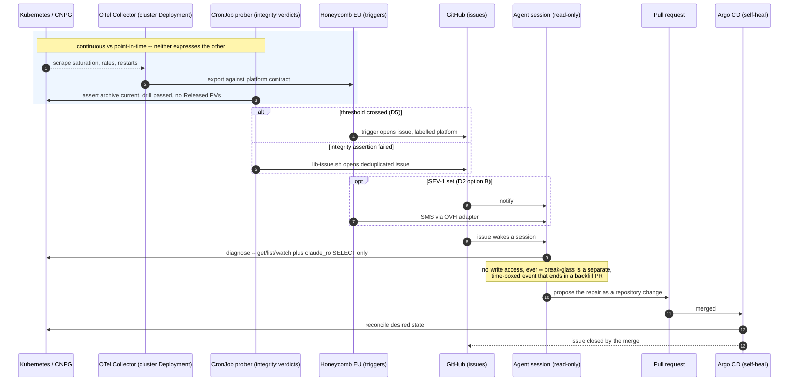
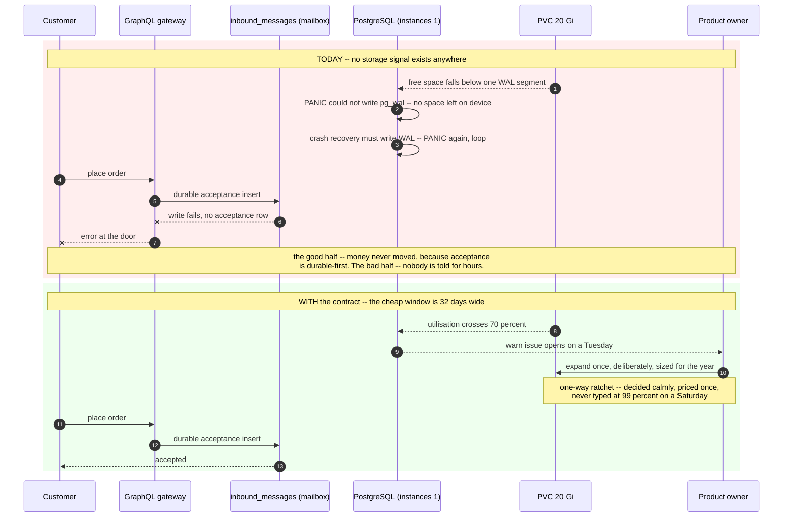
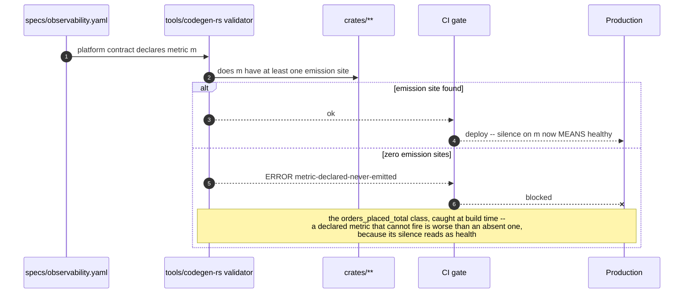

# PROP-20260810-005727 — Platform observability: the technical layer has no contract

- **Status**: Proposed
- **Date**: 2026-08-10
- **Tracking issue**: [#364 "Observability on MKS: OTel collector placement, symptom alerts that open issues, contracts extended"](https://github.com/TheCaptainCompany/captain-food/issues/364)
- **Realized by**: _(filled at completion)_
- **Concerns**:
  - [ ] node-memory-budget: D1's collector + kube-state-metrics add ~300-400 Mi to a node ADR-20260807-114122 already calls snug (~5.5 Gi of ~6.3 Gi allocatable) — the sizing must be re-measured before this is applied, or the collector displaces a bin.
  - [ ] honeycomb-event-volume: infrastructure metrics are high-cardinality by nature (per-pod, per-container, per-volume). The EU plan's monthly event ceiling must be checked against the proposed scrape set BEFORE the firehose is pointed at it, or the first month's bill is the alert.
  - [ ] connection-budget: `max_connections: 220` against ~185 at bin cutover (37 db-needing bins x 5) leaves ~16% headroom. Every new database-touching probe in §4 must be counted into that budget, not added beside it.

> History lives in `git log -p` on this file (ADR-20260801-020000) — this document always holds the
> clean CURRENT state of the design.

## 1. Context — what actually happened

A capacity question about Postgres disk on OVH ("we will need disk usage for Postgres on Kubernetes,
there is a hidden cost behind that") turned out to have a small financial answer and a large
structural one.

**The financial answer is ~€1.72/month.** OVH's public catalog (`api.ovh.com/v1/order/catalog/public/cloud`,
FR, ex-VAT, fetched 2026-08-10) prices `volume.high-speed` at **€0.086/GB/month** and
`storage-standard` object storage at **€0.007/GB/month**, with **€0.00 egress on every class**. The
20 Gi PVC in `deploy/platform/cnpg/cluster.yaml` therefore costs €1.72/mo and the backup bucket
about €0.15/mo, against the **€26.60/mo** recorded in
[ADR-20260807-114122](../adr/ADR-20260807-114122-mks-starts-at-one-node.md) — which prices the node
and the load balancer only. The real bill is ~€28.5/mo, roughly 7% understated. That ADR cites
`docs/runbooks/mks-bootstrap.md §2` for "real catalog prices"; **that file does not exist**, so the
storage line item is recorded nowhere in the repository.

**The structural answer is that nothing would tell us the disk is filling.** `specs/observability.yaml`
carries twelve contracts — `command-acceptance`, `place-order`, `refund`, `customer-identification`,
`prospection`, `stripe-webhook-ingestion`, `avelo37-webhook-ingestion`, `coopcycle-webhook-ingestion`,
`delivery-dispatch-strategy`, `reclamation-sla`, `sirene-sync`, `read-authorization` — and **all
twelve bind to domain workflows**. There is no contract, anywhere, for a technical resource.
Searching all 1015 lines for `disk|storage|pvc|volume|bloat|vacuum|space|capacity` returns only
incidental word matches. This is not an oversight in one file: `cluster.yaml` has no `monitoring:`
block, and ADR-20260807-114122 dropped the Prometheus stack to afford the single-node shape, moving
alerting to Honeycomb — which receives application OTel and nothing else.

**And this failure mode is not hypothetical here.** `migrations/20260730043500_enum_text_domain_events.sql`
opens by recording that its predecessor *"blew the 2 GB disk on production (`could not extend file:
no space left on device`) and rolled back cleanly."*

So the proposal the disk question actually asks for is not a disk probe. It is the one the product
owner named on reading the first draft: **if disk needs a contract, so does every other technical
element**. This document proposes the platform-observability layer as a whole, with disk as its
first and most urgent instrument.

### 1a. Why this is urgent now and cheap now

`deploy/platform/README.md` states plainly: **"nothing applies this tree today"**. Argo CD points at
it at cutover ([#366 "Argo CD: GitOps controller install"](https://github.com/TheCaptainCompany/captain-food/issues/366)).
Every change proposed here is a PR against an unapplied desired state — not a migration, not a
maintenance window. The same work after cutover costs a supervised console session.

### 1b. Three properties that make the technical layer different from the domain layer

1. **Some resources cannot be grown during an incident.** A PVC expands but **never shrinks** — not
   in Kubernetes, not in Cinder. `bootstrap.recovery` into a smaller volume is the only route back
   down, and D6 of [ADR-20260807-002705](../adr/ADR-20260807-002705-hosting-ovh-mks-cnpg-gitops.md)
   deliberately removed every dump-restore path from the tree. An expansion typed at 99% on a
   Saturday is a permanent line item.
2. **Some failures are a hard stop, not a degradation.** A heap `ENOSPC` is a clean per-statement
   error that rolls back — the warning window. A **WAL** `ENOSPC` is `PANIC`, and crash recovery
   must itself write WAL, so it can PANIC again: a crash loop. At `instances: 1` there is no replica
   to promote.
3. **Usable capacity is not provisioned capacity.** `ALTER TABLE ... USING` rewrites the whole
   relation and needs ~2x the table size free. On a 20 Gi volume, `domain_events` cannot safely
   exceed **~6 GB** if another rewriting migration is ever intended. That number, not 20, is the
   one that matters — and it is written down nowhere.

### 1c. The precedent that makes a catalogue insufficient on its own

[DECISIONS.md](DECISIONS.md) records, as a live defect: *"`orders_placed_total` — the metric that
says a stranger paid us — has zero emission sites, so the alert that would have caught the inert
checkout could never have fired."*

A declared signal with no emission site is **indistinguishable from a healthy silence**. Adding
forty platform signals to a spec that cannot prove they are emitted multiplies that failure rather
than fixing it. This is why D6 below is not optional garnish.

## 2. Recommended shape (final vision first)

**Two complementary mechanisms, with an explicit rule for which signal goes where.** These are not
stages of one another — neither can express the other's signals, and shipping only one leaves a
permanent hole.

| mechanism | carries | why it cannot be the other |
|---|---|---|
| **OTel Collector (cluster Deployment) → Honeycomb EU → triggers** | continuous, quantitative, trended signals: saturation levels, rates, latencies, restart counts, lag | needs history and percentiles to be useful. A poller cannot tell you disk grew 4%/day for a week. |
| **CronJob prober → GitHub issue** (the existing `wal-archive-age.sh` shape) | point-in-time integrity verdicts: did the restore drill's checksums match, is the archive current, are there orphaned `Released` PVs, does a declared metric have zero emission sites | these are **assertions, not measurements**. "The restore verified" has no time series. Prometheus-shaped tooling cannot represent it. |

The collector placement is [#364](https://github.com/TheCaptainCompany/captain-food/issues/364)'s
first open checklist item, so this closes it rather than deferring it again.

The contract for both lands in `specs/observability.yaml` as a new `platform:` contract kind, so the
validator gates it exactly as it gates domain contracts — **prose can be ignored, a gate cannot**.

## 3. Decisions this proposal surfaces

### D1 — What collects platform signals?

| option | pros | cons |
|---|---|---|
| **A — OTel Collector Deployment + kube-state-metrics → Honeycomb EU, PLUS the CronJob prober for integrity verdicts** ✅ **recommended** | One telemetry pipeline for app and platform, one UI, one contract home. Honeycomb triggers are already the decided alert transport (ADR-20260807-114122). Answers #364's collector-placement item. Survives the `instances: 3` ladder unchanged. The prober half reuses a file that already has a ServiceAccount, image, schedule and dedup-issue library. | +1-2 pods (~300-400 Mi) on a snug node — see the named concern. Honeycomb event volume for high-cardinality infra metrics is a real cost. CNPG's metrics endpoint adds a database connection to the §4 budget. |
| B — extend the existing CronJob prober only | Near-zero marginal memory. Works today, no new infra, no new failure domain. Covers the single most urgent signal (disk) immediately. | Polling, not streaming — hourly granularity, no history, no trend, no percentiles. Thresholds live in bash rather than in a gated contract. Leaves #364's collector question open. **A different shape from A, not a thin slice of it** — recommending it as a first step would be shape staging (ADR-20260808-235113). |
| C — re-add kube-prometheus | The industry standard. Rich exporters, Alertmanager, mature dashboards. | ~1.5-2 Gi resident — **does not fit the node**, which is precisely why ADR-20260807-114122 dropped it. Re-opens the €67.80 sizing this project rejected on affordability grounds. |
| D — OVH managed observability / Grafana Cloud free tier | No in-cluster memory. Free at our volume. | A second UI and a second contract home, permanently split from the domain contracts. A new data processor to review for GDPR before any telemetry leaves the cluster. |

**Recommendation: A.** If cutover slips far enough that production runs before the collector exists,
B's disk check is the correct interim — but only cited as an interim toward A, and only with the
thresholds already living in the D4 contract so the temporary emitter is the *only* temporary thing.

### D2 — What constitutes a page, and does it reach a phone?

Today every alert path in the tree ends at a GitHub issue. **A GitHub issue at 20:30 on a Saturday is
not a page**, and CLAUDE.md names Friday/Saturday 19:00-21:30 as peak.

| option | pros | cons |
|---|---|---|
| A — GitHub issue only (status quo) | Zero new machinery. Issues wake sessions, which is the agent-admin loop (§2b practice 8). | Nothing reaches a human at peak. A checkout outage waits for someone to look at GitHub. |
| **B — GitHub issue for everything, PLUS SMS via the existing OVH adapter for a named SEV-1 set** ✅ **recommended** | The SMS adapter already exists and is already OVH and already EU. The SEV-1 set is tiny (database down, checkout 5xx sustained, disk over page threshold, cert expiring inside 72h). Marginal cost is a few cents a year. | A second notification path to keep working. Needs its own "did the alert path itself break" check — an alerting system that fails silently is the problem it exists to solve. |
| C — a paging SaaS (PagerDuty/Opsgenie) | Escalation policies, schedules, acknowledgement tracking. | Priced for teams; this is one person. Another processor, another integration, another secret. |

**Recommendation: B.** Also worth stating plainly: at `instances: 1` there is no failover, so the
value of a page is the minutes it saves on a manual recovery — which is exactly the window that
decides whether Friday's orders are lost.

### D3 — Cause-alerts on non-elastic resources: a named exception to "alert on symptoms"

PROP-20260806-223656 §2b practice 8 says alerts fire on **symptoms** — *"checkout latency,
order-acceptance lag, WAL-archive age, cert expiry — not CPU."* Free disk space is a **cause**
metric, and a strict reading of that doctrine excludes it.

| option | pros | cons |
|---|---|---|
| A — hold the line, symptoms only | Doctrinally clean. Avoids the alert fatigue that cause-metrics are famous for. | For a non-elastic resource the symptom **is** the outage. By the time checkout latency moves, Postgres has PANICked and the cheap fix window has closed. |
| **B — a narrow, named exception: saturation of a resource that cannot be grown during an incident is alertable as a cause** ✅ **recommended** | The lead time *is* the entire value. Practice 8 **already lists cert expiry**, which is a cause metric by the same test — so this codifies an exception the doctrine already contains rather than inventing one. Bounded by an explicit test, so it does not become "alert on CPU". | Requires judgement about what counts as non-elastic, which is a judgement someone can get wrong. |
| C — abandon symptom-first | Simple to state. | Reintroduces exactly the noise practice 8 was written to prevent. Nobody wants this. |

**Recommendation: B**, with the membership test written into the contract: a signal qualifies as an
alertable cause only if **(i)** the resource cannot be expanded within the incident, **(ii)**
exhaustion is a hard stop rather than a degradation, and **(iii)** there is a cheap action available
with lead time. Disk, certificates, connection slots and transaction-ID age pass all three. CPU
passes none.

### D4 — Where does the platform contract live?

| option | pros | cons |
|---|---|---|
| **A — `specs/observability.yaml`, new `platform:` contract kind** ✅ **recommended** | One home for every contract. Already SOURCE DSL, already validator-gated, already the file #364 names. ADR-20260808-063951's own words invite this: *"If a second consumer ever appears (e.g. capacity math in the validator), that is the moment to promote it to a spec."* Capacity math in the validator is exactly that consumer. | Existing contracts bind to the domain by `$ref` into actors/commands/events. Platform signals have no domain `$ref`, so the kind needs different required fields and its own validator branch — real work in `tools/codegen-rs`. |
| B — a new `specs/platform-observability.yaml` | Keeps the domain contract file's schema untouched. | Two files, two schemas, two validator paths, and a permanent question about which one a given signal belongs to. |
| C — hand-written source beside `deploy/platform/` | Matches ADR-20260808-063951's precedent for CNPG manifests exactly. No DSL work. | Not gated. A threshold in a YAML nobody validates is prose. Given §1c, ungated is the one thing this must not be. |

**Recommendation: A.** Note the DSL rule: `specs/**` is never modified by execution loops, so this
part lands only with product-owner approval — which is what this proposal is asking for.

### D5 — Disk thresholds

| option | pros | cons |
|---|---|---|
| A — warn 80 / page 90 (conventional) | Industry default. Fewer alerts. | On a 20 Gi volume, 90% leaves 2 Gi — less than the headroom a single rewriting migration needs. The remaining decision is "expand now", made under pressure. |
| **B — warn 70 / page 85** ✅ **recommended** | 70% of 20 Gi leaves 6 Gi, which is roughly the rewriting-migration headroom from §1b.3. Puts the expansion decision on a Tuesday afternoon instead of a Saturday night — and since expansion is a one-way ratchet, *when* that decision gets made is worth more than the alert count. | More alerts on a volume that will sit at 5% for years. Mitigated: at V0 volume this fires approximately never. |

**Recommendation: B**, with a documented rule that **expansion is a supervised decision, never an
automated one** — an autoscaler on a resource that cannot shrink is a ratchet with no human in it.

### D6 — The emission-site gate

Given §1c, this is the decision that makes every other signal in this proposal trustworthy.

| option | pros | cons |
|---|---|---|
| A — do nothing | No work. | `orders_placed_total` happens again, and the next time it may be the disk alert that silently never fires. |
| **B — a validator rule: every metric declared in `specs/observability.yaml` has at least one emission site in `crates/**`, and every declared probe has a scheduled job** ✅ **recommended** | Executable, not prose — the doctrine CLAUDE.md states outright (`makefile_recipe_lines_are_ascii` is the model). Catches the whole class at build time. Retroactively catches `orders_placed_total` on the first run. | A source-text scan is the weaker end of the enforcement hierarchy (PROP-20260802-130500 §1) and [#329](https://github.com/TheCaptainCompany/captain-food/issues/329) is the recorded warning about hardening scanners over boundaries. Scope it to "a declared name appears in an emission call" and accept that it proves wiring exists, not that it is correct. |
| C — a runtime contract heartbeat: the app asserts at boot that every declared metric is registered | Proves live registration, not source text — strictly stronger than B. | Only catches it at boot in an environment that boots, which today is no environment at all. Complements B rather than replacing it. |

**Recommendation: B now, C recorded as the endpoint** once production runs. B is what turns the §4
catalogue from a wish list into a guarantee.

## 4. The signal catalogue — what "other technical elements" means concretely

Legend: **P** = paging (D2's SEV-1 set) · **W** = warn, opens an issue · **T** = trend only, no alert.
"exists" marks what the tree already does — five of these are already built and working.

### A. Storage and capacity — the trigger for this proposal

| signal | why it matters here | level |
|---|---|---|
| PVC free space (`captain-db`) | §1b: hard stop, one-way fix. Nothing watches it today. | **P** at 85%, **W** at 70% |
| database size and largest single relation | the ~6 GB rewriting-migration ceiling is invisible without it | **W** |
| `pg_wal` directory size | balloons on archive stall; the leading indicator of §1b.2 | **W** |
| node ephemeral/local disk (50 GB, images + logs) | `DiskPressure` evicts pods, including the database | **W** |
| object-storage bucket size and backup object count | 30 daily base backups, not one — scales as DB size x 30 | **T** |
| orphaned `Released` PersistentVolumes | `Retain` bills until someone deletes it by hand — the likeliest real euro leak | **W** |

### B. PostgreSQL health

| signal | why it matters here | level |
|---|---|---|
| connection-pool saturation vs `max_connections: 220` | ~185 at bin cutover is 84% before headroom, and 37 pods reconnecting after a `Recreate` deploy is a storm | **P** |
| transaction-ID wraparound age (`datfrozenxid`) | autovacuum is entirely untuned; wraparound is the classic silent killer and forces a read-only shutdown | **P** |
| long-running / idle-in-transaction sessions | blocks vacuum, drives bloat, drives §A | **W** |
| table bloat estimate (`OrderTracking`, `inbound_messages`) | both take non-HOT updates on indexed `status` columns | **T** |
| deadlocks and lock-wait time | order-path contention at peak | **W** |
| replication lag | inert at `instances: 1`, load-bearing the moment the `ha/` ladder flips | **P** (when applicable) |

### C. Backup and recovery — mostly built already

| signal | status | level |
|---|---|---|
| WAL-archive age / `ContinuousArchiving` | **exists** — `wal-archive-age.sh`, hourly | **P** |
| last successful backup age (28h) | **exists** | **W** |
| `firstRecoverabilityPoint` present | **exists** | **W** |
| restore-drill pass/fail | **exists** — weekly, files an issue | **P** |
| **restore-drill duration (RTO trend)** | **gap** — a drill that passes but takes 4x longer is a warning nobody receives | **T** |

### D. Kubernetes and node

| signal | why it matters here | level |
|---|---|---|
| node `Ready` / `MemoryPressure` / `DiskPressure` | the ~5.5 Gi of ~6.3 Gi budget is called snug in the ADR itself | **P** |
| pod `CrashLoopBackOff` / `OOMKilled` | 57 bins at cutover | **W** |
| unschedulable (`Pending`) pods | the snug node's most likely symptom | **W** |
| PVC bound/pending | a database that cannot bind its volume does not start | **P** |
| container restart rate | **T** |

### E. Ingress, TLS and network

| signal | why it matters here | level |
|---|---|---|
| wildcard certificate expiry (`*.captain.food`, DNS-01) | already named in practice 8. A renewal failure is **silent until expiry**, then total | **P** at 72h |
| per-host ingress 5xx rate | `hooks.captain.food` carries the Stripe webhook — a 5xx there is money in flight | **P** |
| load-balancer health | the single entry IP | **P** |

### F. GitOps and supply chain

| signal | why it matters here | level |
|---|---|---|
| Argo CD sync status / `OutOfSync` duration | self-heal means drift should be zero, so a stuck sync is invisible by construction | **W** |
| running image digest vs the pinned digest | ADR-20260730-051500's guarantee, unverified at runtime | **W** |

### G. Mailbox and actor runtime — technical, and closest to the money

| signal | why it matters here | level |
|---|---|---|
| oldest un-leased message age | head-of-line blocking is the mailbox's designed-in risk | **P** |
| mailbox depth by partition | 81 declared lanes | **W** |
| `FAILED` / dead-letter count | a paid order stuck here is the worst failure mode in the domain lens | **P** |
| projector lag (`View_*` freshness) | a stale projection is a customer looking at a wrong order state | **W** |
| lease-renewal failures / fencing events | **W** |

### H. The meta-signal

| signal | why it matters here | level |
|---|---|---|
| declared metric with zero emission sites | §1c — the failure that hides every other failure | **build-time gate (D6)** |

## 5. Screen mockups

### 5a. The alert issue — what wakes a session (use case: agent-admin diagnoses)

```
┌──────────────────────────────────────────────────────────────────────────┐
│ ⚠  [platform] captain-db PVC at 72% -- warn threshold 70%      #NNN      │
│    labels: platform, storage, status/alert                               │
├──────────────────────────────────────────────────────────────────────────┤
│ Observed 2026-08-10 03:00 UTC by cronjob/platform-capacity               │
│                                                                          │
│   volume        pvc/captain-db-1        14.4 Gi / 20 Gi     72%          │
│   growth        +0.4%/day (7d)   ->  85% page threshold in ~32 days      │
│   database      app                      9.1 Gi                          │
│   largest rel   domain_events            5.8 Gi   <-- rewrite ceiling    │
│   pg_wal                                 1.2 Gi   (normal)               │
│                                                                          │
│ CONTRACT  specs/observability.yaml  platform/db-capacity                 │
│ RUNBOOK   docs/runbooks/db-capacity.md                                   │
│                                                                          │
│ Expansion is ONE-WAY -- Cinder volumes never shrink, and no dump-restore │
│ path exists in this tree (ADR-20260807-002705 D6). Decide the target     │
│ size once. VACUUM FULL needs 2x the relation free and is NOT available   │
│ at high utilisation.                                                     │
│                                                                          │
│ [ Diagnose read-only ]   claude_ro + kubectl get (per-session token)     │
│ [ Repair ]               PR against deploy/platform -> Argo CD reconciles│
└──────────────────────────────────────────────────────────────────────────┘
```

### 5b. The SEV-1 SMS (use case: product owner at peak, D2 option B)

```
┌────────────────────────────────────────────┐
│  Captain.Food                       20:41  │
├────────────────────────────────────────────┤
│  SEV-1 captain-db not Ready.               │
│  Checkout failing since 20:38.             │
│  Issue #NNN -- no failover at instances:1. │
│  git.io/cf-runbook-db                      │
└────────────────────────────────────────────┘
```

Deliberately: one severity line, one time anchor, one link. Everything else is in the issue — the
phone exists to start the clock, not to diagnose.

### 5c. The platform health board (use case: is it safe to deploy right now?)

```
┌─ PLATFORM ─────────────────────────────── captain-prod ── 2026-08-10 ────┐
│                                                                          │
│  STORAGE            db pvc  ▓▓▓▓▓▓▓░░░░░░░░░  36%    node  ▓▓▓░░  22%    │
│                     wal      1.2 Gi           bucket  18 Gi / 30 backups │
│                                                                          │
│  DATABASE           conn  ▓▓▓▓▓▓▓▓▓▓░░░  185/220     xid age   4%        │
│                     bloat  OrderTracking 12%   inbound_messages 8%       │
│                                                                          │
│  RECOVERY           archive  current (4m)      backup  8h ago            │
│                     drill    PASS 2026-08-08   RTO 6m12s  (7d avg 5m48s) │
│                                                                          │
│  WORKLOAD           pods  57/57 Ready     restarts 0 (24h)   pending 0   │
│                     node  MemoryPressure=False   DiskPressure=False      │
│                                                                          │
│  EDGE               cert  *.captain.food  expires in 47d                 │
│                     5xx   hooks 0.0%   live 0.1%   restos 0.0%           │
│                                                                          │
│  GITOPS             argo  Synced   digest matches pin                    │
│                                                                          │
│  MAILBOX            depth 3   oldest unleased 1.2s   failed 0   lag 0.4s │
│                                                                          │
│  ── contracts ──    41 declared / 41 with emission sites          ✓      │
└──────────────────────────────────────────────────────────────────────────┘
```

That last row is D6 rendered: the board asserts its own trustworthiness. A board that cannot say
this is a board that might be all-green because nothing is reporting.

## 6. Sequence diagrams

### 6a. The detect → alert → diagnose → repair loop (practice 8 made real)



<a href="https://mermaid.live/view#pako:eNptVF1v2zAM_CtEnjLAXrHuA0MwFMjcIkGzNUHS9WnAIMuMI1SWPEpuGxT97zvZyTqs9YO_dCSPx5MeR9pXPJrQKPDvjp3mc6NqUc1PR7hUF73rmpJl-G6VRKNNq1ykBalAiw5rjiMHOqHiajV7iVsWCbi8ZkuFt5Z19EJjbbsQWeicW-v3Dbv45mVocZlCC_Hu0pfUikcxGhsXuRYT93THUhkdwyuh877q3Dvea9-UdPGDxlFMXbO8Bp_NE3xm4rwrUSGEjl-DbRJqWoMtBQ7BeEdjYVXl3tn9K_jVOgWsOmtJkr4hvsRMe8xUak_FOY0D222-Y2WRbgALJCOpy_Hp-88ZnX74hNvHj4dqVz4yeQhBi6y4nJD2LhrX-S7QXaDWQ6zcuDyahinPybGJO4D5oRU0gLHhk3z6N-Rb5PnZ2bKYUNCiWqagYicqotOM8OSAB9oA_zAELAsEzBGAlF4iqVoZFyK1VsWtl6ZnJEofOi8uAV9M0HLghBa9M3dMuhOBqhlVYiBWm5arjJynNVtW-KDVzaEiu-oojbIRDYDQztuKtPgURuPzozrpmieCs_mEDuMn37IL1M84I6tKhimrv3wPNWxgejbawDaNe6sM0M_Z-35SdmvKvM_5NuwOJSquutYaDdmqod6LBnwLU13c5O_gpwjip-lPqvP1nw5mc9TYTKBGNNv9f53h_-b7hu6MouUNXFypNh6H-U-hY46eBt2rW4xeHU08QDbDZCocAM6H3i41xxNrQjy5V1HvoBFspa3qKv4lHsS_XRTXlLz_vxl7tnQP8ZiU1iiTEacFJC2xY27z2kJU0OlZYD9ApOxLKSdnyap56R-gGSJcGrCKqRWgHdCl0rfbZJLV-pn3aj1J50ObeCdHC1IaSRtLpXcfDE6dPemdcvVhCqs14qaIa1jq40in60EE7DnvNEaNIQYj4ALPR_4LOgx9UFNbn2xX7vvSfbpRRiO8NMpUOFwfR1ho-mO24q3qbBw9Pf0BqEDNpA" target="_blank" rel="noopener noreferrer">Open this diagram with pan and zoom on mermaid.live — on github.com use Ctrl/Cmd+click or middle-click to get a NEW tab (GitHub strips target=_blank)</a>

### 6b. Disk saturation at Friday peak — today, versus with the contract



<a href="https://mermaid.live/view#pako:eNqtVGFr2zAQ_StHPnVgb11K2RpGoE3BK7RNRkPCYFDO0tkRyJInyXW80v--k510pcnH5UPAurt379096XkkrKTRBEaefjdkBF0rLB1WvwzwD5tgTVPl5IbvGl1QQtVoAswAPcwaH2x1LJytYzxzWG9-3EKJgVrsDtPurmKaMrltjHysyHssycNJhUrndvvhsGKRxYqF9aF09MDYJ8r4gEzdw-cj-as-fTWD8Slk6jA-7-POykYEsK2JYoYsR3ziyvxkfH6ewPjsa_-3a3FvA4F9IgezZD6B5fz68iekKRgLPBLHKsCr0qAG2iofPKDp2g05GspXaTqdLrIJFI44s0ZBUKDWHnLStgVrCNaXt-CprMiEoWiR7YoWl_c3MxC20ZIbBmidYjZ1-dhyvx2JHlJTwaIMSHpSgt6hCId-E1VGGR1UvMsdUuzMMEMbLFGZBLS19QAw4_psPYFaxxbWyf3-szVH7q4mIBuHuSZAIajud8Mr9uR2Ou6u0nQbEYZuBe_aJ5H0m3xn21fQdDubADlnHWCAsCGQ1rqje4jB0loJG9RF1FDxJDswFDMqzpMJT1hg49-y-5a7T1Pl97zTQjkfPsKSwXL8h2VsbmUHnBgsT75gPhvbOP9xoEJGHlqnd83OP8ets75Zfu95C2uCQy7kVv33hrCGVhnJhuCmZ2OQ2Hk-ke9d1ASllcegeNfCWe_5Mnw5hZqceOsezuaGLTrDeL5hFjUZHw2CsGzIy_0VnXPmime-5SsiOS4oYQ9pxS8B32TdJWzuPzSMIFLtCA_2MU8Ygaef8sUHLmM5vTRJggVIEKiriFQ7tuauSb-IYVmhq_mU931xsdcxEH3A0LhXpv_FjNMpG2yIk3xd5iiBEb9t_BRJfiGfRyy06t9KSQU2OoxeXv4ChSW1JA" target="_blank" rel="noopener noreferrer">Open this diagram with pan and zoom on mermaid.live — on github.com use Ctrl/Cmd+click or middle-click to get a NEW tab (GitHub strips target=_blank)</a>

### 6c. The emission-site gate (D6) — why the catalogue can be trusted



<a href="https://mermaid.live/view#pako:eNptUsFu2zAM_RXCxyJe7kERYEh6yGFdkAI5FShoiYmFyqIr0umyov8-Kk62BakhGBDfIx_5xI_KsadqBpXQ20DJ0TLgPmP3nMA-HJTT0DWUx3uPWYMLPSaFJaCA9ORkyo1QPmATYtDjtyN28Za-LXRljjItkntKdRY4YAwelb-o_7RZlBSXUUmmd3e3jMWqEOy_N8otvC7oOrMfnAZOz2mkLOv5fDuDPqLuOHfgOGlGp-DJRcwk0JHm4ODswdb41ssMPBcMWjwQoEIkFAVOBNQFEVMACZc-MOp1GHY8JD-CY1Uru1jNgF__BRerEl2bFPWRj1DXlhvLq5iOSSd-hx8P3x-foCVTaI9jKkUh-E2ZryXlC7WHzebn5jxgfR7Y14kOlGtLViV_3c4v66aJ7F7_Bx7ZBmLLge3EcG3tlj1leTFXHfkXZcUIVl1kAg6HfavFsmYI0YOGjmy0-yZP53hx3V9c19aIDlNihV3IBEHgnbNNaEiCcmzb0sn5yalGQ6ZgeFD5a1cm9FLefzTq7FPy1QSqjnKHwdvSf1TWendaf087HKJWn59_AAXPBXw" target="_blank" rel="noopener noreferrer">Open this diagram with pan and zoom on mermaid.live — on github.com use Ctrl/Cmd+click or middle-click to get a NEW tab (GitHub strips target=_blank)</a>

## 7. Scope and sequencing

Vertical slices of the **same** shape, not different shapes (ADR-20260808-235113):

1. **The `platform:` contract kind** (D4) — validator branch, plus the D6 emission-site rule. Nothing
   observable yet; this is the gate everything else is checked against.
2. **Storage and recovery signals** (§4 A and C) — the trigger for this proposal, and the one class
   with a recorded production failure behind it. Includes the missing restore-drill RTO trend.
3. **Collector deployment** (D1 A) — closes #364's placement item; brings §4 B, D, G online.
4. **Edge and GitOps** (§4 E and F) — cert expiry and Argo sync land with the components themselves,
   which do not exist in `deploy/platform/` yet.
5. **SEV-1 SMS path** (D2 B) — last, because it is worthless until the signals it carries exist, and
   it needs its own does-the-alert-path-work check.

Two things that are **not** in this proposal but were found while writing it, and belong on their own
issues rather than being smuggled in here: the redundant `domain_events (stream_name, version)` index
(`migrations/20260717120000_domain_schema.sql:125` duplicates the `UNIQUE` on line 123), and
`temp_file_limit` being unset while `bam.yaml` points analytics at the order path's database.

## 8. Drawbacks — why we might regret the whole thing

- **It is a second system to keep alive.** Monitoring that silently stops working is worse than none,
  because it converts "we don't know" into "we believe it is fine". D6 addresses the declared-but-never-
  emitted half; nothing here addresses the collector itself dying quietly. That needs its own answer.
- **Forty signals is a lot for one person.** The catalogue's honest risk is alert fatigue, after which
  the disk alert gets muted along with everything else. The P/W/T split is the mitigation, and the
  paging set is deliberately tiny — but only production will show whether it was tiny enough.
- **It spends the node's remaining headroom.** ~300-400 Mi on a node with ~0.8 Gi spare either
  displaces a bin or forces the sizing conversation ADR-20260807-114122 closed on affordability
  grounds. That conversation may reopen as a consequence of this proposal.
- **Contract work is upstream of value.** Slices 1 and 2 produce nothing a customer can see, at a
  moment when the customer path on `main` is recorded as inert. A reasonable person could argue this
  waits until something is actually serving orders. The counter-argument is §1a: it is a PR today and
  a supervised console session after cutover.
- **The €1.72 that started this is noise.** If the goal were saving money, none of this is the way.
  The justification is availability of a single-instance database with no failover, not cost.

## 9. Unresolved questions

Copied into [#364](https://github.com/TheCaptainCompany/captain-food/issues/364)'s checklist on approval:

1. **Who watches the watcher?** If the collector or the CronJob stops, every signal goes quiet and
   quiet reads as healthy. A dead-man's-switch (an alert that fires when a heartbeat *stops*) is the
   standard answer, and it needs a home that is not the cluster being monitored.
2. **What is the Honeycomb event-volume cost** of the §4 scrape set at 1-minute resolution, against
   the EU plan's ceiling? Named as a blocking concern; it needs a number before D1-A is applied.
3. **Does the metrics scraper's database connection fit** inside `max_connections: 220` at bin
   cutover, or does that ceiling need re-opening at the same time?
4. **Should BAM analytics share the order path's database at all?** `temp_file_limit` bounds the
   damage; it does not answer the architectural question.
5. **What is the disk growth rate in production?** Every runway number in the §1 analysis is modelled,
   not measured. This is an instrument-then-decide value — the contract supplies it within a month of
   cutover, and the expansion target should be set from data rather than guessed now.
6. **Does the Stripe webhook endpoint return non-2xx when the database is down?** Not a storage
   question, but it is what makes §6b's "money never moved" claim true. A handler that 200s on a
   database error converts a survivable outage into a paid order nobody was told about. Worth a
   targeted test regardless of what happens to this proposal.

## 10. Verification plan

- **The gate proves itself first**: the D6 validator rule must be seen RED before it is trusted —
  land it against the known-bad `orders_placed_total` and confirm it fails, then fix and confirm it
  passes. A gate never seen red is an unverified claim (beck's rule).
- **Thresholds are tested by simulation, not by waiting**: fill a scratch PVC in the drill namespace
  past 70% and 85% and confirm both the issue and (for the page) the SMS actually arrive. The restore
  drill is the precedent — a procedure that has never executed is a hope.
- **`make validate` stays at 0 errors and no NEW warning kinds**, re-measured against a pristine
  `main` worktree at the time of the change rather than against the counts written in CLAUDE.md.
- **Every mermaid block in this file is render-validated** via the mermaid.ink loop in
  [docs/claude/mermaid.md](../claude/mermaid.md) before push, and the pan/zoom links regenerated —
  they go stale the moment a fenced block is edited.
- **The runbook rule applies** (§2b practice 10): `docs/runbooks/db-capacity.md` is trusted only
  after it has been executed once, with the date recorded in its header. That runbook must state
  outright that `VACUUM FULL` is unavailable at high utilisation, before someone tries it at 01:00.

## 11. Related

- [ADR-20260807-002705 — Hosting: OVH MKS, CNPG in-cluster, GitOps-only](../adr/ADR-20260807-002705-hosting-ovh-mks-cnpg-gitops.md) (D2, D7)
- [ADR-20260807-114122 — MKS starts at one node](../adr/ADR-20260807-114122-mks-starts-at-one-node.md) (dropped the Prometheus stack — the hole this fills)
- [ADR-20260808-063951 — CNPG manifests are hand-written platform source](../adr/ADR-20260808-063951-cnpg-platform-source-tree.md) (D4's precedent, and its own invitation to promote)
- [PROP-20260806-223656 — Kubernetes as the deployment substrate](PROP-20260806-223656-kubernetes-as-the-deployment-substrate.md) (§2b practices 4, 5, 8, 10)
- [#360 "CNPG: operator + 3-instance cluster, WAL archiving to Object Storage, weekly executed restore drill"](https://github.com/TheCaptainCompany/captain-food/issues/360) — built the tree this instruments
- [#366 "Argo CD: GitOps controller install"](https://github.com/TheCaptainCompany/captain-food/issues/366) — the reconciler in §6a
- [#242 "Mailbox leases and fencing"](https://github.com/TheCaptainCompany/captain-food/issues/242) — unlocks the `instances: 3` ladder, which makes §4 B's replication lag live
